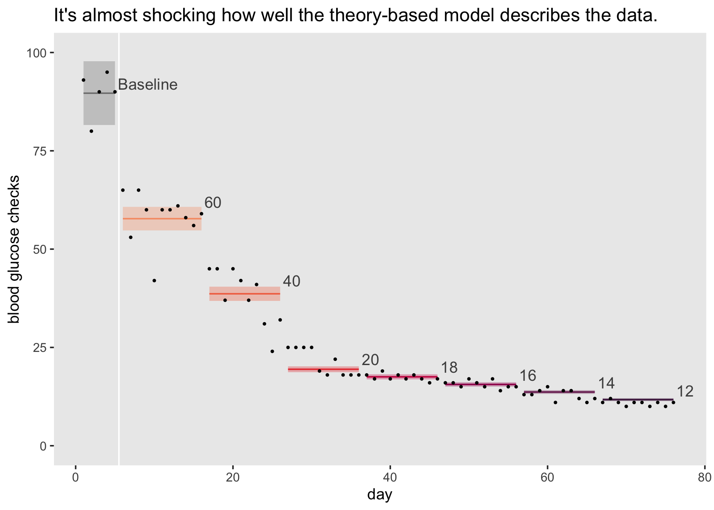

Allen & Evans (2001)
================
A Solomon Kurz
2022-03-23

Load our primary packages.

``` r
library(tidyverse)
library(brms)
library(tidybayes)
library(bayesplot)
library(patchwork)
library(flextable)
```

## Excessive checking

Sometimes young people with diabetes excessively check their blood
glucose levels. Allen & Evans (2001;
<https://doi.org/10.1901/jaba.2001.34-497>) used a changing criterion
design to evaluate an exposure-based intervention to help a 15-year-old,
Amy, reduce her checks to the frequency recommended by her
endocrinologist, which was 6 to 12 times a day.

``` r
# load the data
load(file = "/Users/solomonkurz/Dropbox/Experimental-design-and-the-GLMM/sketches/data/allen2001.rda")

# what is this?
glimpse(allen2001)
```

    ## Rows: 76
    ## Columns: 7
    ## $ day          <int> 1, 2, 3, 4, 5, 6, 7, 8, 9, 10, 11, 12, 13, 14, 15, 16, 17, 18, 19, 20, 21, 22, 23, 24, …
    ## $ phase        <chr> "A", "A", "A", "A", "A", "B1", "B1", "B1", "B1", "B1", "B1", "B1", "B1", "B1", "B1", "B…
    ## $ criterion    <dbl> NA, NA, NA, NA, NA, 60, 60, 60, 60, 60, 60, 60, 60, 60, 60, 60, 40, 40, 40, 40, 40, 40,…
    ## $ baseline     <dbl> 1, 1, 1, 1, 1, 0, 0, 0, 0, 0, 0, 0, 0, 0, 0, 0, 0, 0, 0, 0, 0, 0, 0, 0, 0, 0, 0, 0, 0, …
    ## $ intervention <dbl> 0, 0, 0, 0, 0, 1, 1, 1, 1, 1, 1, 1, 1, 1, 1, 1, 1, 1, 1, 1, 1, 1, 1, 1, 1, 1, 1, 1, 1, …
    ## $ lcriterion   <dbl> 0.000000, 0.000000, 0.000000, 0.000000, 0.000000, 4.094345, 4.094345, 4.094345, 4.09434…
    ## $ checks       <dbl> 93, 80, 90, 95, 90, 65, 53, 65, 60, 42, 60, 60, 61, 58, 56, 59, 45, 45, 37, 45, 42, 37,…

### EDA.

The data are divided into 8 phases where the baseline is `A` and the
remining phases during the intervention are `B1` through `B7`.

``` r
allen2001 %>% 
  count(phase)
```

    ## # A tibble: 8 × 2
    ##   phase     n
    ##   <chr> <int>
    ## 1 A         5
    ## 2 B1       11
    ## 3 B2       10
    ## 4 B3       10
    ## 5 B4       10
    ## 6 B5       10
    ## 7 B6       10
    ## 8 B7       10

The `B1` phases all have associated `criterion` levels.

``` r
allen2001 %>% 
  distinct(phase, criterion)
```

    ## # A tibble: 8 × 2
    ##   phase criterion
    ##   <chr>     <dbl>
    ## 1 A            NA
    ## 2 B1           60
    ## 3 B2           40
    ## 4 B3           20
    ## 5 B4           18
    ## 6 B5           16
    ## 7 B6           14
    ## 8 B7           12

As there is no formal criterion level for the baseline period, that
value is missing in the `criterion` column.

The outcome variable `checks` is an umbounded count, which we might
summarize by its mean and variance, by `phase`.

``` r
allen2001 %>% 
  group_by(phase, criterion) %>% 
  summarise(m = mean(checks),
            v = var(checks)) %>% 
  mutate_if(is.double, round, digits = 1)
```

    ## # A tibble: 8 × 4
    ## # Groups:   phase [8]
    ##   phase criterion     m     v
    ##   <chr>     <dbl> <dbl> <dbl>
    ## 1 A            NA  89.6  33.3
    ## 2 B1           60  58.1  40.5
    ## 3 B2           40  37.9  50.5
    ## 4 B3           20  21.3  11.6
    ## 5 B4           18  17.4   0.7
    ## 6 B5           16  15.6   0.9
    ## 7 B6           14  12.9   1.9
    ## 8 B7           12  10.8   0.4

Here we visualize the `allen2001` data in a similar way to the original
Figure 1 in Allen & Evans (p. 499).

``` r
# adjust the global theme
theme_set(
  theme_gray() + 
    theme(panel.grid = element_blank())
  )

# for the text/numeral annotation
label <- allen2001 %>% 
  group_by(phase) %>% 
  arrange(desc(day)) %>% 
  slice(1) %>% 
  mutate(label  = ifelse(phase == "A", "Baseline", as.character(criterion)),
         checks = ifelse(is.na(criterion), checks, criterion))

# plot
allen2001 %>% 
  ggplot(aes(x = day, y = checks, group = criterion, color = factor(criterion))) +
  geom_vline(xintercept = 5.5, color = "white") +
  # for the gray criterion-level lines
  geom_line(aes(y = criterion),
            color = "grey50") +
  geom_point() +
  geom_line() +
  # for the text/numeral annotation
  geom_text(data = label,
            aes(y = checks, label = label),
            hjust = 0, nudge_x = 0.4, nudge_y = 2, color = "grey30") +
  scale_color_viridis_d(option = "F", end = .7, na.value = "grey50", breaks = NULL) +
  ylim(0, 100)
```


### Dummies.

To aid with our models to come, we’ll want to make a series of dummy
variables for the 8 experimental phases.

``` r
allen2001 <- allen2001 %>% 
  mutate(a  = ifelse(phase == "A", 1, 0),
         b1 = ifelse(phase == "B1", 1, 0),
         b2 = ifelse(phase == "B2", 1, 0),
         b3 = ifelse(phase == "B3", 1, 0),
         b4 = ifelse(phase == "B4", 1, 0),
         b5 = ifelse(phase == "B5", 1, 0),
         b6 = ifelse(phase == "B6", 1, 0),
         b7 = ifelse(phase == "B7", 1, 0)) 

# what have we done?
allen2001 %>% 
  distinct(phase, a, b1, b2, b3, b4, b5, b6, b7)
```

    ## # A tibble: 8 × 9
    ##   phase     a    b1    b2    b3    b4    b5    b6    b7
    ##   <chr> <dbl> <dbl> <dbl> <dbl> <dbl> <dbl> <dbl> <dbl>
    ## 1 A         1     0     0     0     0     0     0     0
    ## 2 B1        0     1     0     0     0     0     0     0
    ## 3 B2        0     0     1     0     0     0     0     0
    ## 4 B3        0     0     0     1     0     0     0     0
    ## 5 B4        0     0     0     0     1     0     0     0
    ## 6 B5        0     0     0     0     0     1     0     0
    ## 7 B6        0     0     0     0     0     0     1     0
    ## 8 B7        0     0     0     0     0     0     0     1

You don’t strictly need to do this because the `phase` variable will
actually get the job done. But the dummies can be instructive and we may
as well show the way with both.

## Models

In this file, we’ll model the data with three model types.

1.  The dummy model
2.  The one-hot model
3.  The theory-based model

### The dummy model.

The simplest and possibly most natural way to analyze the data is with
what we’re calling the simple dummy model. If we describe the outcome
variable `checks` as varying across *i* measurement occasions, the
simple dummy model follows the equation

$$
\\begin{align\*}
\\text{checks}\_i & \\sim \\operatorname{Poisson}(\\lambda_i) \\\\
\\log (\\lambda_i) & = \\beta_0 + \\beta_1 \\text{B1}\_i + \\beta_2 \\text{B2}\_i + \\beta_3 \\text{B3}\_i + \\beta_4 \\text{B4}\_i + \\beta_5 \\text{B5}\_i + \\beta_6 \\text{B6}\_i + \\beta_7 \\text{B7}\_i,
\\end{align\*}
$$

where we use the Poisson likelihood and its conventional log link. The
*β*<sub>0</sub> parameter is the mean value for the baseline period.
Each of the remaining *β* coefficients is multiplies by one of the dummy
variables `b1` through `b7`, and these coefficients express the
difference between those associated `B` phases and baseline.

Next we consider our priors.

#### Simple priors.

We begin setting our priors with the *β*<sub>0</sub> parameter, the
expected value during the baseline period. We know that Amy’s
endocrinologist recommended she check her blood glucose levels 6 to 12
times a day, and since her parents initiated a professional
intervention, we know her baseline values are likely well beyond that
range. But how how much higher should we consider?

One approach is to consider increases in orders of magnitude. If she was
checking 10 times more than the upper limit of her endocrinologist’s
recommended range, that would mean 12 × 10 = 120 checks per day. A
two-order-of-magnitude increase would mean 1, 200 checks. Given an
8-hours night sleep, if Amy checked her glucose at a rate of once a
minute all day long, that would give her 60 × 16 = 960 checks a day,
which is approaching that two-order-of-magnitude increase. So we might
want a prior that puts most of the prior mass above 12 and less than the
960 − 1, 200 range.

Although we don’t have to, it’s typical to use a Gaussian prior for *β*
parameters, so we’ll do so here, too. As we’re using the conventional
log link for the Poisson likelihood, that means the Gaussian prior on
the model space will have exponentiated Gaussian implications on the
count space. To get a sense, here are the means and 95 percentile ranges
on the count metric for 𝒩(log(12×10),1).

``` r
sigma <- 1

exp(log(12 * 10) + c(-1.96 * sigma, 0, 1.96 * sigma))
```

    ## [1]  16.90301 120.00000 851.91925

I find it helps when I plot.

``` r
set.seed(1)

tibble(prior = rnorm(n = 1e5, mean = log(12 * 10), sd = 1)) %>% 
  mutate(count = exp(prior)) %>% 
  
  ggplot(aes(x = count)) +
  geom_histogram(binwidth = 5, fill = "grey60") +
  stat_halfeye(aes(y = 0), .width = c(.5, .95)) +
  scale_y_continuous(NULL, breaks = NULL) +
  ggtitle("Prior predictive distribution for N(log(120), 1)") +
  coord_cartesian(xlim = c(0, 1000))
```


The dots and two levels of horizontal lines mark off the median,
interquartile range, and 95-percentile range for the prior predictive
distribution. The 𝒩(log(12×10),1) prior is broad across the ranges we
have considered so far and I’m comfortable sticking with it, going
forward. But you should feel free to experiment with different
distributions.

Next we consider the priors for *β*<sub>1</sub> through *β*<sub>7</sub>,
our deviation parameters. As we’re working on the log scale, the 𝒩(0,1)
is often good places to start. It allows for small, moderate and even
large deviations from the reference category, but rule out very large
deviations. In this case, however, keep in mind that if our posterior
for *β*<sub>0</sub> ends up rather high, the posteriors for our
upper-end *β* parameters will need to be large and negative to
compensate. For example, let’s say the average baseline rate is near
250. Since we expect the mean for the `B7` phase to be about 12, that
would produce a *β*<sub>7</sub> parameter of around  − 3.

``` r
log(250) - log(12)
```

    ## [1] 3.036554

Thus, it might make sense to use a larger prior like 𝒩(0,2) or greater.
In this case, I’m comfortable using 𝒩(0,2). Thus, we might express our
model with our priors as

$$
\\begin{align\*}
\\text{checks}\_i & \\sim \\operatorname{Poisson}(\\lambda_i) \\\\
\\log (\\lambda_i) & = \\beta_0 + \\beta_1 \\text{B1}\_i + \\beta_2 \\text{B2}\_i + \\beta_3 \\text{B3}\_i + \\beta_4 \\text{B4}\_i + \\beta_5 \\text{B5}\_i + \\beta_6 \\text{B6}\_i + \\beta_7 \\text{B7}\_i \\\\
\\beta_0 & \\sim \\operatorname{Normal}(\\log(120), 1) \\\\
\\beta_1, \\dots, \\beta_7 & \\sim \\operatorname{Normal}(0, 2).
\\end{align\*}
$$

#### Fit.

We can fit the model with `brm()` using either the dummy variables `b1`
through `b7` or with just the `phase` variable. For simplicity, I’m just
using the `phase` approach with `fit1`. But if you’re interested, you
can find the alternate version of the model `formula` which explicitly
uses the dummies in the commented-out lines.

``` r
fit1 <- brm(
  data = allen2001,
  family = poisson,
  checks ~ 0 + Intercept + phase,
  # this is the explicitly dummy-variable alternative:
  # checks ~ 0 + Intercept + b1 + b2 + b3 + b4 + b5 + b6 + b7,
  prior = c(prior(normal(log(12 * 10), 1), class = b, coef = Intercept),
            prior(normal(0, 2), class = b)),
  cores = 4,
  seed = 1,
  file = "fits/fit1.allen2001"
)
```

Check the parameter summary.

``` r
print(fit1)
```

    ##  Family: poisson 
    ##   Links: mu = log 
    ## Formula: checks ~ 0 + Intercept + phase 
    ##    Data: allen2001 (Number of observations: 76) 
    ##   Draws: 4 chains, each with iter = 2000; warmup = 1000; thin = 1;
    ##          total post-warmup draws = 4000
    ## 
    ## Population-Level Effects: 
    ##           Estimate Est.Error l-95% CI u-95% CI Rhat Bulk_ESS Tail_ESS
    ## Intercept     4.49      0.05     4.39     4.58 1.00     1268     1883
    ## phaseB1      -0.43      0.06    -0.55    -0.30 1.00     1546     2020
    ## phaseB2      -0.85      0.07    -0.99    -0.72 1.00     1889     2345
    ## phaseB3      -1.43      0.09    -1.60    -1.26 1.00     2249     2436
    ## phaseB4      -1.63      0.09    -1.81    -1.46 1.00     2006     2534
    ## phaseB5      -1.74      0.09    -1.93    -1.56 1.00     2233     2905
    ## phaseB6      -1.93      0.10    -2.14    -1.73 1.00     2457     2539
    ## phaseB7      -2.11      0.11    -2.33    -1.90 1.00     2645     2678
    ## 
    ## Draws were sampled using sampling(NUTS). For each parameter, Bulk_ESS
    ## and Tail_ESS are effective sample size measures, and Rhat is the potential
    ## scale reduction factor on split chains (at convergence, Rhat = 1).

Based on the *R̂* and ESS columns, the chains appear to be in good
health. We can confirm that with a quick look at the trace plots, too.

``` r
as_draws_df(fit1) %>% 
  rename(chain     = .chain,
         `beta[0]` = b_Intercept,
         `beta[1]` = b_phaseB1,
         `beta[2]` = b_phaseB2,
         `beta[3]` = b_phaseB3,
         `beta[4]` = b_phaseB4,
         `beta[5]` = b_phaseB5,
         `beta[6]` = b_phaseB6,
         `beta[7]` = b_phaseB7) %>% 
  mcmc_trace(pars = vars(contains("beta")),
             facet_args = list(ncol = 2, 
                               labeller = label_parsed, 
                               strip.position = "right"), 
             size = .15) +
  scale_x_continuous(NULL, breaks = NULL) +
  theme(legend.position = "none",
        strip.text.y = element_text(angle = 0))
```


The chains look great.

Here’s how we might express the model with a line plot.

``` r
fitted(fit1) %>% 
  data.frame() %>% 
  bind_cols(allen2001) %>% 

  ggplot(aes(x = day, group = criterion)) +
  geom_vline(xintercept = 5.5, color = "white") +
  geom_ribbon(aes(ymin = Q2.5, ymax = Q97.5, fill = factor(criterion)),
              alpha = 1/3) +
  geom_line(aes(y = Estimate, color = factor(criterion))) +
  geom_point(aes(y = checks),
             size = 1/2) +
  scale_fill_viridis_d(option = "F", begin = .2, end = .8, na.value = "grey50", breaks = NULL) +
  scale_color_viridis_d(option = "F", begin = .2, end = .8, na.value = "grey50", breaks = NULL) +
  scale_y_continuous("checks", limits = c(0, 100)) +
  labs(title = "The dummy-code model with weak priors.")
```


Look at those sweet steps!

### The one-hot model.

Next we consider a closely-related version fo the model inspired by our
friends in the machine-learning community, which follows the basic form

$$
\\begin{align\*}
\\text{checks}\_i & \\sim \\operatorname{Poisson}(\\lambda_i) \\\\
\\log (\\lambda_i) & = \\beta_0 \\text{A}\_i + \\beta_1 \\text{B1}\_i + \\beta_2 \\text{B2}\_i + \\beta_3 \\text{B3}\_i + \\beta_4 \\text{B4}\_i + \\beta_5 \\text{B5}\_i + \\beta_6 \\text{B6}\_i + \\beta_7 \\text{B7}\_i, \\\\
\\end{align\*}
$$

where *β*<sub>0</sub> is still the mean during the baseline period, but
now we explicitly include the `a` dummy variable in the equation, while
we continue to retain all the other 7 dummies for the B phases. Whereas
man social scientists tend to leave out the dummy variable which encodes
the reference category–the way we omitted the `a` dummy in `fit1`–, the
one-hot encoding method includes ALL dummy variables. As a consequence,
we no longer have a reference category. Rather, the coefficient for each
dummy *β*<sub>0</sub>, …, *β*7 is directly parameterized as the mean of
its own phase, without reference to any other phase.

The one-hot parameterization is attractive because it offers a more
natural way for setting our priors. Consider, again, the distinct levels
of `phase` and their associated `criterion` values.

``` r
allen2001 %>% 
  distinct(phase, criterion) %>% 
  flextable()
```

We still don’t have a great expected value for the baseline A period, so
we’ll retina the 𝒩(log(120),1) prior from before. But now we have very
specific expectations for the average number of checks within the B
phases which are defined by the values in the `criterion` column. So for
the priors for *β*<sub>1</sub>, …, *β*7, I propose we use a Gaussian
prior centered on the log of each `criterion` value.

The next issue is how tot set the *σ* hyperparameters, which will
express how certain our priors are for *β*<sub>1</sub>, …, *β*7. As is
turns out,

-   *σ* = 0.3536465 puts 95% of the prior mass between half of the
    expected value and twice the expected value,
-   *σ* = 0.20687 puts 95% of the prior mass between two-thirds of the
    expected value and 150% of the expected value,
-   *σ* = 0.1467766 puts 95% of the prior mass between three-quarters of
    the expected value and four-thirds of the expected value.

Execute the code, below, to see four yourself.

``` r
# sigma <- 0.3536465  # 1/2 on the low end; 2/1 on the high end
# sigma <- 0.20687    # 2/3 on the low end; 3/2 on the high end
sigma <- 0.1467766    # 3/4 on the low end; 4/3 on the high end

# B1 criterion 60
exp(log(60) + c(-1.96 * sigma, 0, 1.96 * sigma))

# B2 criterion 40
exp(log(40) + c(-1.96 * sigma, 0, 1.96 * sigma))

# B3 criterion 20
exp(log(20) + c(-1.96 * sigma, 0, 1.96 * sigma))

# B4 criterion 18
exp(log(18) + c(-1.96 * sigma, 0, 1.96 * sigma))

# B5 criterion 16
exp(log(16) + c(-1.96 * sigma, 0, 1.96 * sigma))

# B6 criterion 14
exp(log(14) + c(-1.96 * sigma, 0, 1.96 * sigma))

# B7 criterion 12
exp(log(12) + c(-1.96 * sigma, 0, 1.96 * sigma))
```

You, of course, could use any mixture of these or other entirely
different values. When I perused the prior literature on
changing-criterion designs, I was struck by how orderly the data often
hovered around the expected criterion levels (e.g., [Hartmann & Hall,
1976](https://doi.org/10.1901/jaba.1976.9-527); [Morgan & Hiebert,
1982](https://doi.org/10.2466/pr0.1982.50.3c.1287)). So why not stand by
your convictions and set a strong prior? Here’s the model I propose:

$$
\\begin{align\*}
\\text{checks}\_i & \\sim \\operatorname{Poisson}(\\lambda_i) \\\\
\\log (\\lambda_i) & = \\beta_0 \\text{A}\_i + \\beta_1 \\text{B1}\_i + \\beta_2 \\text{B2}\_i + \\beta_3 \\text{B3}\_i + \\beta_4 \\text{B4}\_i + \\beta_5 \\text{B5}\_i + \\beta_6 \\text{B6}\_i + \\beta_7 \\text{B7}\_i \\\\
\\beta_0 & \\sim \\operatorname{Normal}(\\log(120), 1) \\\\
\\beta_1 & \\sim \\operatorname{Normal}(\\log(60), 0.1467766) \\\\
\\beta_2 & \\sim \\operatorname{Normal}(\\log(40), 0.1467766) \\\\
\\beta_3 & \\sim \\operatorname{Normal}(\\log(20), 0.1467766) \\\\
\\beta_4 & \\sim \\operatorname{Normal}(\\log(18), 0.1467766) \\\\
\\beta_5 & \\sim \\operatorname{Normal}(\\log(16), 0.1467766) \\\\
\\beta_6 & \\sim \\operatorname{Normal}(\\log(14), 0.1467766) \\\\
\\beta_7 & \\sim \\operatorname{Normal}(\\log(12), 0.1467766),
\\end{align\*}
$$

where my tight *σ* hyperparameters express my conviction 95% of the
prior mass for each of the B periods should rest between three-quarters
and four-thirds of the criterion level.

#### Fit.

Similar to before, we can fit the model with `brm()` using either all
dummy variables `a` through `b7` or with just the `phase` variable. Note
that if you chose to experiment with the explicit method, you’ll need to
adjust the terms in the `coef` arguments within the `prior()` functions.
If this confuses you, spend some time with the `get_prior()` function.

``` r
fit2 <- brm(
  data = allen2001,
  family = poisson,
  checks ~ 0 + phase,
  # this is the explicitly dummy-variable alternative:
  # checks ~ 0 + a + b1 + b2 + b3 + b4 + b5 + b6 + b7,
  prior = c(prior(normal(log(12 * 10), 1), class = b, coef = phaseA),
            prior(normal(log(60), 0.1467766), class = b, coef = phaseB1),
            prior(normal(log(40), 0.1467766), class = b, coef = phaseB2),
            prior(normal(log(20), 0.1467766), class = b, coef = phaseB3),
            prior(normal(log(18), 0.1467766), class = b, coef = phaseB4),
            prior(normal(log(16), 0.1467766), class = b, coef = phaseB5),
            prior(normal(log(14), 0.1467766), class = b, coef = phaseB6),
            prior(normal(log(12), 0.1467766), class = b, coef = phaseB7)),
  cores = 4,
  seed = 1,
  file = "fits/fit2.allen2001"
)
```

Check the parameter summary.

``` r
print(fit2)
```

    ##  Family: poisson 
    ##   Links: mu = log 
    ## Formula: checks ~ 0 + phase 
    ##    Data: allen2001 (Number of observations: 76) 
    ##   Draws: 4 chains, each with iter = 2000; warmup = 1000; thin = 1;
    ##          total post-warmup draws = 4000
    ## 
    ## Population-Level Effects: 
    ##         Estimate Est.Error l-95% CI u-95% CI Rhat Bulk_ESS Tail_ESS
    ## phaseA      4.49      0.05     4.40     4.59 1.00     6727     3143
    ## phaseB1     4.06      0.04     3.99     4.14 1.00     6588     3323
    ## phaseB2     3.64      0.05     3.55     3.73 1.00     6318     3443
    ## phaseB3     3.05      0.06     2.92     3.17 1.00     7157     2974
    ## phaseB4     2.86      0.07     2.74     2.99 1.00     5770     3301
    ## phaseB5     2.75      0.07     2.61     2.89 1.00     5885     3320
    ## phaseB6     2.58      0.08     2.43     2.73 1.00     6396     2798
    ## phaseB7     2.41      0.08     2.25     2.57 1.00     7975     2902
    ## 
    ## Draws were sampled using sampling(NUTS). For each parameter, Bulk_ESS
    ## and Tail_ESS are effective sample size measures, and Rhat is the potential
    ## scale reduction factor on split chains (at convergence, Rhat = 1).

We might check the health of the chains, this time with trank plots.

``` r
as_draws_df(fit2) %>% 
  mutate(chain     = .chain) %>% 
  rename(`beta[0]` = b_phaseA,
         `beta[1]` = b_phaseB1,
         `beta[2]` = b_phaseB2,
         `beta[3]` = b_phaseB3,
         `beta[4]` = b_phaseB4,
         `beta[5]` = b_phaseB5,
         `beta[6]` = b_phaseB6,
         `beta[7]` = b_phaseB7) %>% 
  mcmc_rank_overlay(pars = vars(contains("beta")),
             facet_args = list(ncol = 2, 
                               labeller = label_parsed, 
                               strip.position = "right")) +
  scale_x_continuous(NULL, breaks = NULL) +
  coord_cartesian(ylim = c(30, NA)) +
  theme(legend.position = "none",
        strip.text.y = element_text(angle = 0))
```


The chains appear to be in good health.

Here’s how we might express this model with a line plot.

``` r
fitted(fit2) %>% 
  data.frame() %>% 
  bind_cols(allen2001) %>% 

  ggplot(aes(x = day, group = criterion)) +
  geom_vline(xintercept = 5.5, color = "white") +
  geom_ribbon(aes(ymin = Q2.5, ymax = Q97.5, fill = factor(criterion)),
              alpha = 1/3) +
  geom_line(aes(y = Estimate, color = factor(criterion))) +
  geom_point(aes(y = checks),
             size = 1/2) +
  scale_fill_viridis_d(option = "F", begin = .2, end = .8, na.value = "grey50", breaks = NULL) +
  scale_color_viridis_d(option = "F", begin = .2, end = .8, na.value = "grey50", breaks = NULL) +
  scale_y_continuous("checks", limits = c(0, 100)) +
  labs(title = "The one-hot model with theory-based priors.")
```


If you look closely, you’ll see the 95% intervals during the
intervention phase are a little tighter than the corresponding ones in
the plot of the `fit1` model from the last section. That’s because we
used smarter priors.

### The theory-based model.

Between the dummy and one-hot models, we have a pretty good framework
for analyzing a variety of changing-criterion data sets. But if you’re
willing to get a little weird, with me, I think we can do even better.
When we set the priors for out one-hot model, covered how the
changing-criterion design makes specific predictions about the
conditional means during the intervention period. If our intervention
brings the target behavior under experimental control, the average
behavior rate should be equal to the criterion level. Why not just build
that into the model formula? One way would be the model

$$
\\begin{align\*}
\\text{checks}\_i & \\sim \\operatorname{Poisson}(\\lambda_i) \\\\
\\log (\\lambda_i) & = \\beta_0 \\text{baseline}\_i + \\beta_1 \\text{intervention}\_i \\times \\log (\\text{criterion}\_i),
\\end{align\*}
$$

where `baseline` is a dummy indicating whether we’re in the baseline
phase or not (yes, this is just an alternative to the `a` dummy) and
`intervention` is a dummy indicating whether we’re in the intervention
phase or not (i.e., `intervention = ifelse(baseline == 1, 0, 1)`).
Notice that our `intervention` dummy is always in an interaction with
the log of the `criterion` level. During the baseline period, the
log (criterion<sub>*i*</sub>) term drops out because it gets multiplied
by zero. During the intervention period, the expected value at baseline
drops out because it gets multiplied by zero.

The one catch with this parameterization is it requires us to insert a
non-`NA` value in the `criterion` column during the baseline occasions.
Otherwise, `brm()` will automatically drop those cases. Since the model
equation will always cancel those values out by multiplying them by
zero, it really doesn’t matter what they are, as long as they’re not
missing. To make this easy, I’ve included an `lcriterion` variable in
the data set.

``` r
allen2001 %>% 
  distinct(phase, criterion, lcriterion) %>% 
  flextable() %>% 
  width(width = c(0.75, 0.75, 1.25))
```

In the data, `lcriterion` is just the log of `criterion` during the
intervention periods. But during baseline, `lcriterion` is just zero. If
you want, you could replace those zeros with `-999` or any other
numeral. As long as the model formula contains the
*β*<sub>1</sub>intervention<sub>*i*</sub> × log (criterion<sub>*i*</sub>)
portion, those values will always get zeroed out, but their inclusion
will keep `brm()` from dropping the cases that would otherwise read as
missing data.

As to priors, we’ll continue to keep our diffuse 𝒩(log(120),1) prior on
*β*<sub>0</sub>. If our model holds, we should expect the posterior for
*β*<sub>1</sub> to be very close to 1. So why not be bold and express
that with a very tight prior like𝒩(1,0.1)? If you’re game, we can
express the full model as

$$
\\begin{align\*}
\\text{checks}\_i & \\sim \\operatorname{Poisson}(\\lambda_i) \\\\
\\log (\\lambda_i) & = \\beta_0 \\text{baseline}\_i + \\beta_1 \\text{intervention}\_i \\times \\log (\\text{criterion}\_i)  \\\\
\\beta_0 & \\sim \\operatorname{Normal}(\\log(120), 1) \\\\
\\beta_1 & \\sim \\operatorname{Normal}(1, 0.1).
\\end{align\*}
$$

Here’s how to fit the model with `brm()`.

``` r
fit3 <- brm(
  data = allen2001,
  family = poisson,
  checks ~ 0 + baseline + intervention : lcriterion,
  prior = c(prior(normal(log(12 * 10), 1), class = b, coef = baseline),
            prior(normal(1, 0.1), class = b, coef = "intervention:lcriterion")),
  cores = 4, seed = 1,
  file = "fits/fit3.allen2001"
)
```

Here’s the parameter summary.

``` r
print(fit3)
```

    ##  Family: poisson 
    ##   Links: mu = log 
    ## Formula: checks ~ 0 + baseline + intervention:lcriterion 
    ##    Data: allen2001 (Number of observations: 76) 
    ##   Draws: 4 chains, each with iter = 2000; warmup = 1000; thin = 1;
    ##          total post-warmup draws = 4000
    ## 
    ## Population-Level Effects: 
    ##                         Estimate Est.Error l-95% CI u-95% CI Rhat Bulk_ESS Tail_ESS
    ## baseline                    4.49      0.05     4.40     4.58 1.00     3056     2330
    ## intervention:lcriterion     0.99      0.01     0.98     1.00 1.00     3531     2708
    ## 
    ## Draws were sampled using sampling(NUTS). For each parameter, Bulk_ESS
    ## and Tail_ESS are effective sample size measures, and Rhat is the potential
    ## scale reduction factor on split chains (at convergence, Rhat = 1).

The chains look great!

``` r
as_draws_df(fit3) %>% 
  rename(chain     = .chain,
         `beta[0]` = b_baseline,
         `beta[1]` = `b_intervention:lcriterion`) %>% 
  mcmc_trace(pars = vars(contains("beta")),
             facet_args = list(ncol = 2, 
                               labeller = label_parsed, 
                               strip.position = "right"), 
             size = .15) +
  scale_x_continuous(NULL, breaks = NULL) +
  theme(legend.position = "none",
        strip.text.y = element_text(angle = 0))
```


Behold the line plot.

``` r
fitted(fit3) %>% 
  data.frame() %>% 
  bind_cols(allen2001) %>% 

  ggplot(aes(x = day, group = criterion)) +
  geom_vline(xintercept = 5.5, color = "white") +
  geom_ribbon(aes(ymin = Q2.5, ymax = Q97.5, fill = factor(criterion)),
              alpha = 1/3) +
  geom_line(aes(y = Estimate, color = factor(criterion))) +
  geom_point(aes(y = checks),
             size = 1/2) +
  scale_fill_viridis_d(option = "F", begin = .2, end = .8, na.value = "grey50", breaks = NULL) +
  scale_color_viridis_d(option = "F", begin = .2, end = .8, na.value = "grey50", breaks = NULL) +
  scale_y_continuous("checks", limits = c(0, 100)) +
  labs(title = "It's almost shocking how well the theory-based model describes the data.")
```



The two-parameter theory-based model returns very tight 95% intervals
during the intervention period.

### Model comparison?

One might wonder how the three models compare from a LOO-CV perspective.

``` r
fit1 <- add_criterion(fit1, criterion = "loo")
fit2 <- add_criterion(fit2, criterion = "loo")
fit3 <- add_criterion(fit3, criterion = "loo")

loo_compare(fit1, fit2, fit3, criterion = "loo") %>% print(simplify = F)
```

    ##      elpd_diff se_diff elpd_loo se_elpd_loo p_loo  se_p_loo looic  se_looic
    ## fit3    0.0       0.0  -207.2      5.7         1.0    0.3    414.5   11.5  
    ## fit2   -2.0       0.9  -209.2      5.7         2.9    0.7    418.5   11.5  
    ## fit1   -2.9       1.1  -210.1      5.7         3.4    0.7    420.2   11.4

The dummy and one-hot models are very similar, which shouldn’t be a big
surprise. Look how well our gutsy two-parameter theory-based model is
doing, though. This sins it commits with its overconfidence are made up
for by its parsimony. This might not hold for all data sets, though. The
theory-based model only works if you have strong experimental control
over the target behavior.

### How big is it?

Now we’ve experimented with different ways to model the data, a natural
question is how to express the analyses in terms of an effect size.
Given the data are counts, I’m not sure a Cohen’s *d*
standardized-mean-difference type effect size makes sense, here. To my
mind, Cohen’s *d* implies the Gaussian likelihood given how you are
standardizing the parameter with some version of *σ*. We could, however,
compute a simple unstandardized mean difference of the average at
baseline minus the average at the final phase `B7`. An alternative would
be a ratio where you divide the baseline mean by the final `B7` mean,
which would express how many times larger the baseline mean was from the
final mean. On the flip side, if we were to divide the final `B7` mean
by the baseline mean, that ratio would express the final `B7` mean as a
proportion of the baseline. If you subtract that proportion from 1 and
then multiply by 100, you get a percent decrease from baseline.

Here’s how to compute those effect sizes and their 95% intervals with
our original model `fit1`.

``` r
# define the new data
nd <- allen2001 %>% 
  distinct(phase) %>% 
  slice(c(1, 8))

fitted(fit1,
       newdata = nd,
       summary = F) %>% 
  # wrangle
  data.frame() %>%
  set_names(nd %>% pull(phase)) %>% 
  transmute(`A - B7` = A - B7,
            `A / B7` = A / B7,
            `B7 / A` = B7 / A,
            `(1 - B7 / A) * 100` = (1 - B7 / A) * 100) %>% 
  pivot_longer(everything(), names_to = "effect") %>% 
  group_by(effect) %>% 
  mean_qi(value) %>% 
  select(effect:.upper) %>% 
  mutate_if(is.double, round, digits = 2)
```

    ## # A tibble: 4 × 4
    ##   effect             value .lower .upper
    ##   <chr>              <dbl>  <dbl>  <dbl>
    ## 1 (1 - B7 / A) * 100 87.8   85.0   90.2 
    ## 2 A - B7             78.2   69.5   87.0 
    ## 3 A / B7              8.27   6.66  10.3 
    ## 4 B7 / A              0.12   0.1    0.15

Our unstandardized pre/post mean difference is
78.2, 95%CI \[69.5,87.0\]. The baseline checking rate was
8.3 \[6.7,10.3\] times greater than the final rate at the end of the
intervention. Put another way, the final checking rate during the
12-check criterion phase of the intervention constituted an
87.8% \[85.0%,90.2%\] reduction in blood glucose checks.

### Phase contrasts.

The line plots for all out models show a clear and dramatic reduction of
Amy’s checking behavior following the onset of the exposure-based
intervention. A strength of the changing criterion design is it allows
researchers to make very specific predictions about the rate differences
in each phase shift. If all goes well, the difference in the average
rate in one phase to the next should be the same as the difference in
the criterion level for those two phases. Consider the following table.

``` r
# save the expected contrasts
e_difference <- allen2001 %>% 
  distinct(phase, criterion) %>% 
  mutate(contrast = str_c(phase, " - ", lead(phase)),
         e_difference = criterion - lead(criterion)) %>% 
  filter(!is.na(contrast))

# display the results in a table
e_difference %>% 
  rename(`expected difference` = e_difference) %>% 
  flextable() %>% 
  width(width = c(0.5, 1.5, 1.7, 1.7)) %>% 
  align(j = 3, align = "right", part = "all")
```

For each phase, the natural contrast is with the rate in the subsequent
phase. If we subtract the criterion level of each phase from the
preceding phases level, this will provide a list of expected
differences. However, since the baseline `A` phase doesn’t have an
experimental criterion, there is no expected difference for the baseline
minus the first experimental phase `B1`. Though none of our models are
parameterized in terms of these contrasts, we can compute them from the
posterior of each. The easiest way is probably with aid from the
`fitted()` function. Here’s the workflow with `fit2`.

``` r
# define the new data
nd <- allen2001 %>% 
  distinct(phase)

# compute the fitted values
fitted(fit2,
       newdata = nd,
       summary = F) %>% 
  # wrangle
  data.frame() %>%
  set_names(nd %>% pull(phase)) %>% 
  transmute(`A - B1`  = A - B1,
            `B1 - B2` = B1 - B2,
            `B2 - B3` = B2 - B3,
            `B3 - B4` = B3 - B4,
            `B4 - B5` = B4 - B5,
            `B5 - B6` = B5 - B6,
            `B6 - B7` = B6 - B7) %>% 
  pivot_longer(everything(), names_to = "contrast") %>% 
  
  # plot
  ggplot(aes(x = value, y = 0)) +
  tidybayes::stat_halfeye(.width = .95, normalize = "panels", size = 1.5) +
  geom_vline(data = e_difference,
             aes(xintercept = e_difference),
             linetype = 2, size = 1/3) +
  scale_y_continuous(NULL, breaks = NULL) +
  labs(title = "Contrasts for subsequent phases",
       subtitle = "The dashed lines mark the expected contrast values based on the experimental design.",
       x = "contrast") +
  facet_wrap(~ contrast, scales = "free", nrow = 2)
```


In all cases, the expected contrasts between phases were well within the
bounds 95% of the posterior, which suggests the serial decreases in the
excessive checking behaviors were indeed under experimental control. Amy
didn’t just gradually reduce her checks over time; she reduced her
checks according to the magnitudes intended by the researchers.

If you make the corresponding plot for our theory-based model `fit3`,
you’ll notice the contrasts are similar, but their posteriors are much
more narrow. I’ll leave that as an exercise for the interested reader.

## Session information

``` r
sessionInfo()
```

    ## R version 4.1.2 (2021-11-01)
    ## Platform: x86_64-apple-darwin17.0 (64-bit)
    ## Running under: macOS Catalina 10.15.7
    ## 
    ## Matrix products: default
    ## BLAS:   /Library/Frameworks/R.framework/Versions/4.1/Resources/lib/libRblas.0.dylib
    ## LAPACK: /Library/Frameworks/R.framework/Versions/4.1/Resources/lib/libRlapack.dylib
    ## 
    ## locale:
    ## [1] en_US.UTF-8/en_US.UTF-8/en_US.UTF-8/C/en_US.UTF-8/en_US.UTF-8
    ## 
    ## attached base packages:
    ## [1] stats     graphics  grDevices utils     datasets  methods   base     
    ## 
    ## other attached packages:
    ##  [1] flextable_0.6.10 patchwork_1.1.1  bayesplot_1.8.1  tidybayes_3.0.2  brms_2.16.3      Rcpp_1.0.8      
    ##  [7] forcats_0.5.1    stringr_1.4.0    dplyr_1.0.7      purrr_0.3.4      readr_2.0.1      tidyr_1.2.0     
    ## [13] tibble_3.1.6     ggplot2_3.3.5    tidyverse_1.3.1 
    ## 
    ## loaded via a namespace (and not attached):
    ##   [1] uuid_0.1-4           readxl_1.3.1         backports_1.4.1      systemfonts_1.0.2    plyr_1.8.6          
    ##   [6] igraph_1.2.6         svUnit_1.0.6         splines_4.1.2        crosstalk_1.1.1      TH.data_1.0-10      
    ##  [11] rstantools_2.1.1     inline_0.3.19        digest_0.6.29        htmltools_0.5.2      rsconnect_0.8.24    
    ##  [16] fansi_1.0.2          magrittr_2.0.2       checkmate_2.0.0      tzdb_0.1.2           modelr_0.1.8        
    ##  [21] RcppParallel_5.1.4   matrixStats_0.61.0   xslt_1.4.3           officer_0.4.1        xts_0.12.1          
    ##  [26] sandwich_3.0-1       prettyunits_1.1.1    colorspace_2.0-2     rvest_1.0.1          ggdist_3.0.1        
    ##  [31] haven_2.4.3          xfun_0.25            callr_3.7.0          crayon_1.4.2         jsonlite_1.7.3      
    ##  [36] lme4_1.1-27.1        survival_3.2-13      zoo_1.8-9            glue_1.6.1           gtable_0.3.0        
    ##  [41] emmeans_1.7.1-1      webshot_0.5.2        distributional_0.2.2 pkgbuild_1.2.0       rstan_2.21.3        
    ##  [46] abind_1.4-5          scales_1.1.1         mvtnorm_1.1-2        DBI_1.1.1            miniUI_0.1.1.1      
    ##  [51] viridisLite_0.4.0    xtable_1.8-4         diffobj_0.3.4        stats4_4.1.2         StanHeaders_2.21.0-7
    ##  [56] DT_0.19              htmlwidgets_1.5.3    httr_1.4.2           threejs_0.3.3        arrayhelpers_1.1-0  
    ##  [61] posterior_1.1.0.9000 ellipsis_0.3.2       pkgconfig_2.0.3      loo_2.4.1            farver_2.1.0        
    ##  [66] dbplyr_2.1.1         utf8_1.2.2           labeling_0.4.2       tidyselect_1.1.1     rlang_1.0.1         
    ##  [71] reshape2_1.4.4       later_1.3.0          munsell_0.5.0        cellranger_1.1.0     tools_4.1.2         
    ##  [76] cli_3.1.1            generics_0.1.2       broom_0.7.10         ggridges_0.5.3       evaluate_0.14       
    ##  [81] fastmap_1.1.0        yaml_2.2.1           processx_3.5.2       knitr_1.33           fs_1.5.0            
    ##  [86] zip_2.2.0            nlme_3.1-153         equatags_0.1.1       mime_0.11            projpred_2.0.2      
    ##  [91] xml2_1.3.2           compiler_4.1.2       shinythemes_1.2.0    rstudioapi_0.13      gamm4_0.2-6         
    ##  [96] reprex_2.0.1         stringi_1.7.4        highr_0.9            ps_1.6.0             Brobdingnag_1.2-6   
    ## [101] gdtools_0.2.3        lattice_0.20-45      Matrix_1.3-4         nloptr_1.2.2.2       markdown_1.1        
    ## [106] shinyjs_2.0.0        tensorA_0.36.2       vctrs_0.3.8          pillar_1.7.0         lifecycle_1.0.1     
    ## [111] bridgesampling_1.1-2 locatexec_0.1.1      estimability_1.3     data.table_1.14.2    httpuv_1.6.2        
    ## [116] R6_2.5.1             promises_1.2.0.1     gridExtra_2.3        codetools_0.2-18     boot_1.3-28         
    ## [121] colourpicker_1.1.0   MASS_7.3-54          gtools_3.9.2         assertthat_0.2.1     withr_2.4.3         
    ## [126] shinystan_2.5.0      multcomp_1.4-17      mgcv_1.8-38          parallel_4.1.2       hms_1.1.0           
    ## [131] grid_4.1.2           coda_0.19-4          minqa_1.2.4          rmarkdown_2.10       shiny_1.6.0         
    ## [136] lubridate_1.7.10     base64enc_0.1-3      dygraphs_1.1.1.6
