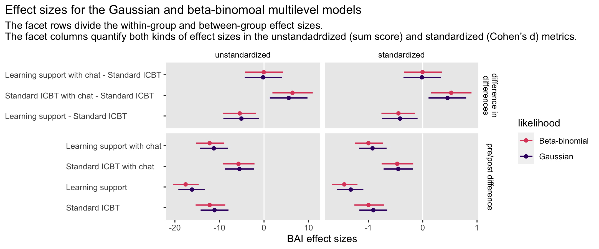

Berg et al (2020)
================
A Solomon Kurz
2022-07-27

Load our primary packages.

``` r
library(tidyverse)
library(brms)
library(tidybayes)
library(patchwork)
```

## How does one make for a better online therapy?

Berg and colleagues (2020; <https://doi.org/10.3389/fpsyt.2020.00503>)
reported the results from a randomized controlled trial for
internet-based cognitive behavioural therapy (ICBT) for anxiety and
comorbid depression in adolescents in Sweden. We don’t have access to
their original data, but I have simulated data that resemble those from
Berg et al and saved them in a file called `berg2020.rda`. Here we load
the `berg2020` data.

``` r
# load the data
load(file = "data/berg2020.rda")

# what is this?
glimpse(berg2020)
```

    ## Rows: 120
    ## Columns: 9
    ## $ id      <int> 1, 2, 3, 4, 5, 6, 7, 8, 9, 10, 11, 12, 13, 14, 15, 16, 17, 18, 19, 20, 21, 22, 23, 24, 25, 2…
    ## $ group   <fct> 1, 1, 1, 1, 1, 1, 1, 1, 1, 1, 1, 1, 1, 1, 1, 1, 1, 1, 1, 1, 1, 1, 1, 1, 1, 1, 1, 1, 1, 1, 2,…
    ## $ icbt    <fct> Standard ICBT, Standard ICBT, Standard ICBT, Standard ICBT, Standard ICBT, Standard ICBT, St…
    ## $ chat    <dbl> 0, 0, 0, 0, 0, 0, 0, 0, 0, 0, 0, 0, 0, 0, 0, 0, 0, 0, 0, 0, 0, 0, 0, 0, 0, 0, 0, 0, 0, 0, 0,…
    ## $ support <dbl> 0, 0, 0, 0, 0, 0, 0, 0, 0, 0, 0, 0, 0, 0, 0, 0, 0, 0, 0, 0, 0, 0, 0, 0, 0, 0, 0, 0, 0, 0, 1,…
    ## $ bai0    <dbl> 52, 29, 40, 29, 15, 42, 31, 44, 21, 19, 26, 29, 30, 31, 40, 31, 38, 59, 38, 36, 16, 26, 37, …
    ## $ bai1    <dbl> 34, 6, 22, 3, 16, 28, 22, 34, 21, 10, 16, 15, 31, 21, NA, 25, 33, 35, 16, 23, 8, 9, 14, 19, …
    ## $ bdi0    <dbl> 32, 16, 44, 42, 12, 26, 39, 25, 31, 38, 17, 43, 50, 27, 22, 19, 30, 45, 21, 28, 18, 21, 13, …
    ## $ bdi1    <dbl> 9, 3, 35, 10, 3, 23, 9, 9, 33, 10, 1, 44, 24, 12, NA, 23, NA, 57, 5, 9, 16, 6, 1, 6, 6, 6, 2…

Participants were randomized into four groups and data were collected at
three time points. The four groups were:

-   Standard internet-based cognitive behavioural therapy (ICBT),
-   ICBT with learning support,
-   ICBT with chat sessions, and
-   ICBT with both learning support and chat sessions.

In the data, those four conditions are marked by the `group` and `icbt`
factors, as well as the `chat` and `support` dummies.

``` r
berg2020 %>% 
  distinct(group, icbt, support, chat)
```

    ## # A tibble: 4 × 4
    ##   group icbt                        chat support
    ##   <fct> <fct>                      <dbl>   <dbl>
    ## 1 1     Standard ICBT                  0       0
    ## 2 2     Learning support               0       1
    ## 3 3     Standard ICBT with chat        1       0
    ## 4 4     Learning support with chat     1       1

Berg and colleagues defined their primary outcomes as

-   the Beck Anxiety Inventory (BAI) and
-   the Beck Depression Inventory-II (BDI-II).

In the study, the authors focused on the sum scores for both. The BAI
and BDI-II are both composed of 21 Likert-type items, each ranging from
0 to 3. Thus each sum score ranges from 0 to 63, where the largest value
63 indicates very high levels of anxiety/depression

In the original study, the authors analyzed data from three time points,
which were:

-   pre-treatment;
-   post-treatment, which was 8 weeks later, directly on completion of
    the 8-week intervention; and
-   at a 6-month follow-up period.

For our purposes, we have simplified the data to focus on the pre- and
post-treatment assessment periods. In the `berg2020` data, the outcome
data are in the following columns:

-   `bai0` (BAI at pre-treatment),
-   `bai1` (BAI at post-treatment),
-   `bdi0` (BDI-II at pre-treatment), and
-   `bdi1` (BDI-II at post-treatment).

For simplicity, most of our analyses will focus on the BAI. However, we
will spend some time analyzing the BDI-II, too.

## EDA

### Sample statistics.

Here are the sample statistics for the BAI at pre- and post-treatment,
by the four treatment groups.

``` r
berg2020 %>% 
  pivot_longer(starts_with("bai"), values_to = "bai") %>% 
  mutate(assessment = ifelse(name == "bai0", "pre", "post")) %>%
  mutate(assessment = factor(assessment, levels = c("pre", "post"))) %>% 
  group_by(assessment, icbt) %>% 
  summarise(m = mean(bai, na.rm = T) %>% round(digits = 1),
            s = sd(bai, na.rm = T) %>% round(digits = 1),
            n = sum(!is.na(bai)))
```

    ## # A tibble: 8 × 5
    ## # Groups:   assessment [2]
    ##   assessment icbt                           m     s     n
    ##   <fct>      <fct>                      <dbl> <dbl> <int>
    ## 1 pre        Standard ICBT               31.3  11.5    30
    ## 2 pre        Learning support            27.7  13.5    30
    ## 3 pre        Standard ICBT with chat     24.7  10.2    30
    ## 4 pre        Learning support with chat  30.3  12.8    30
    ## 5 post       Standard ICBT               19.1  10.2    28
    ## 6 post       Learning support            11.7   8.5    27
    ## 7 post       Standard ICBT with chat     21.1  11.8    28
    ## 8 post       Learning support with chat  19.5  10.6    23

If you compare these values with those presented in Table 2 of the
original article (p. 9), you’ll see they’re pretty similar. You can see
by the `n` column that there are some missing data for the
post-treatment assessment.

### Look at the data.

Here’s a quick plot of the BAI scores at both time points.

``` r
# adjust the global plot settings
theme_set(
  theme_gray() +
    theme(panel.grid = element_blank(),
          plot.title.position = "plot",
          strip.background = element_blank(),
          strip.text = element_text(color = "black"))
)

berg2020 %>% 
  pivot_longer(starts_with("bai"), values_to = "bai") %>% 
  mutate(assessment = ifelse(name == "bai0", "pre", "post")) %>%
  mutate(assessment = factor(assessment, levels = c("pre", "post"))) %>% 
  
  ggplot(aes(x = bai)) +
  geom_bar() +
  coord_cartesian(xlim = c(0, 63)) +
  facet_grid(assessment ~ icbt)
```


As will happen with anxiety sum scores, the data are somewhat right
skewed, which will play an important role in the statistical analysis.

### Center baseline.

It will help some of our models if we center the baseline versions of
the BAI and BDI-II. The versions of these variables with the `c` suffix
have been centered at their grand means. The versions of the variables
with the `z` suffix are standardized.

``` r
berg2020 <- berg2020 %>% 
  mutate(bai0c = bai0 - mean(bai0),
         bdi0c = bdi0 - mean(bdi0),
         bai0z = (bai0 - mean(bai0)) / sd(bai0),
         bdi0z = (bdi0 - mean(bdi0)) / sd(bdi0))

# what?
head(berg2020)
```

    ## # A tibble: 6 × 13
    ##      id group icbt           chat support  bai0  bai1  bdi0  bdi1   bai0c  bdi0c   bai0z  bdi0z
    ##   <int> <fct> <fct>         <dbl>   <dbl> <dbl> <dbl> <dbl> <dbl>   <dbl>  <dbl>   <dbl>  <dbl>
    ## 1     1 1     Standard ICBT     0       0    52    34    32     9  23.5     4.21  1.93    0.414
    ## 2     2 1     Standard ICBT     0       0    29     6    16     3   0.492 -11.8   0.0404 -1.16 
    ## 3     3 1     Standard ICBT     0       0    40    22    44    35  11.5    16.2   0.943   1.59 
    ## 4     4 1     Standard ICBT     0       0    29     3    42    10   0.492  14.2   0.0404  1.40 
    ## 5     5 1     Standard ICBT     0       0    15    16    12     3 -13.5   -15.8  -1.11   -1.55 
    ## 6     6 1     Standard ICBT     0       0    42    28    26    23  13.5    -1.79  1.11   -0.176

## How to model sum-score data

Researchers typically analyze sum-score data with the conventional
Gaussian likelihood. For simplicity, we’ll start with that strategy,
too. However, sum-score data are often characterized by integer values
with well-defined lower and upper limits, which are 0 and 63 in the case
of our BAI and BDI-II data. Though they sometimes look approximately
Gaussian when their means are toward the middle of the range, sum-score
data from measures of anxiety and depression often show marked skew.
Sometimes researchers handle the skew by data transformations (e.g., the
square-root transformation) and other times they ignore the issue
altogether. I think we can do better.

One alternative would be using skew-normal or skew-Student likelihood
(see the preprint by Martin and Williams;
<https://doi.org/10.31234/osf.io/26m49>). This approach, however, will
not fully solve the problem with the lower and/or upper boundaries. A
more sophisticated approach would be to model the item-level data with a
multilevel-ordinal IRT-type model, such as discussed by Bürkner (2019;
<https://doi.org/10.48550/arXiv.1905.09501>). This approach is excellent
for respecting the ordinal nature of the items and for expressing the
data-generating process, but it comes at the cost of a complex,
highly-parameterized model which may be difficult to fit. Another option
would be to model the sum-score values as ordinal variables with 64
levels. However, my experience is ordinal models are difficult to fit
when you have more than 10 or so levels.

In this script, we’ll practice modeling the sum-score values with the
beta-binomial likelihood. The beta-binomial will not faithfully
reproduce the item-level data-generating process, but it will
accommodate the lower and upper bounds, handle the skew, and only
predict integer values. You might think of the beta-binomial as a better
alternative to the conventional Gaussian likelihood, but a pragmatic and
simpler alternative to the rigorous item-level multilevel-ordinal IRT
approach.

### Gaussian.

We will explore both single- and multilevel approaches with the
conventional Gaussian likelihood. The `berg2020` data are already
formatted for the single-level approach. Here we make a long-formatted
version of the data for the multilevel approach.

``` r
berg2020_long <- berg2020 %>% 
  pivot_longer(bai0:bdi1) %>% 
  separate(name, into = c("y", "time"), sep = "(?<=[A-Za-z])(?=[0-9])") %>% 
  mutate(time = as.double(time)) %>% 
  pivot_wider(names_from = y, values_from = value) %>% 
  # we don't need the centered versions of the BAI/BDI-II for the long data
  select(-ends_with("c"), -ends_with("z") )

# what?
head(berg2020_long)
```

    ## # A tibble: 6 × 8
    ##      id group icbt           chat support  time   bai   bdi
    ##   <int> <fct> <fct>         <dbl>   <dbl> <dbl> <dbl> <dbl>
    ## 1     1 1     Standard ICBT     0       0     0    52    32
    ## 2     1 1     Standard ICBT     0       0     1    34     9
    ## 3     2 1     Standard ICBT     0       0     0    29    16
    ## 4     2 1     Standard ICBT     0       0     1     6     3
    ## 5     3 1     Standard ICBT     0       0     0    40    44
    ## 6     3 1     Standard ICBT     0       0     1    22    35

#### Single-level models.

The conventional[^1] way to analyze post-treatment sum-score data from a

factorial study would be with a single-level model like

![
\\begin{align\*}
\\text{bai1}\_i & \\sim \\operatorname{Normal}(\\mu_i, \\sigma_i) \\\\
\\mu_i & = \\beta_0 + \\beta_1 \\text{bai0c}\_i + \\beta_2 \\text{support}\_i + \\beta_3 \\text{chat}\_i + \\beta_4 \\text{support}\_i \\times \\text{chat}\_i \\\\
\\log (\\sigma_i) & = \\eta_0 + \\eta_1 \\text{bai0c}\_i + \\eta_2 \\text{support}\_i + \\eta_3 \\text{chat}\_i + \\eta_4 \\text{support}\_i \\times \\text{chat}\_i \\\\
\\beta_0 & \\sim \\operatorname{Normal}(20.6, 9) \\\\
\\beta_1 & \\sim \\operatorname{Normal}(0.5, 9) \\\\
\\beta_2, \\dots, \\beta_4 & \\sim \\operatorname{Normal}(0, 9) \\\\
\\eta_0 & \\sim \\operatorname{Normal}(\\log(9), 0.5) \\\\
\\eta_1, \\dots, \\eta_4 & \\sim \\operatorname{Normal}(0, 0.5),
\\end{align\*}
](https://latex.codecogs.com/png.image?%5Cdpi%7B110%7D&space;%5Cbg_white&space;%0A%5Cbegin%7Balign%2A%7D%0A%5Ctext%7Bbai1%7D_i%20%26%20%5Csim%20%5Coperatorname%7BNormal%7D%28%5Cmu_i%2C%20%5Csigma_i%29%20%5C%5C%0A%5Cmu_i%20%26%20%3D%20%5Cbeta_0%20%2B%20%5Cbeta_1%20%5Ctext%7Bbai0c%7D_i%20%2B%20%5Cbeta_2%20%5Ctext%7Bsupport%7D_i%20%2B%20%5Cbeta_3%20%5Ctext%7Bchat%7D_i%20%2B%20%5Cbeta_4%20%5Ctext%7Bsupport%7D_i%20%5Ctimes%20%5Ctext%7Bchat%7D_i%20%5C%5C%0A%5Clog%20%28%5Csigma_i%29%20%26%20%3D%20%5Ceta_0%20%2B%20%5Ceta_1%20%5Ctext%7Bbai0c%7D_i%20%2B%20%5Ceta_2%20%5Ctext%7Bsupport%7D_i%20%2B%20%5Ceta_3%20%5Ctext%7Bchat%7D_i%20%2B%20%5Ceta_4%20%5Ctext%7Bsupport%7D_i%20%5Ctimes%20%5Ctext%7Bchat%7D_i%20%5C%5C%0A%5Cbeta_0%20%26%20%5Csim%20%5Coperatorname%7BNormal%7D%2820.6%2C%209%29%20%5C%5C%0A%5Cbeta_1%20%26%20%5Csim%20%5Coperatorname%7BNormal%7D%280.5%2C%209%29%20%5C%5C%0A%5Cbeta_2%2C%20%5Cdots%2C%20%5Cbeta_4%20%26%20%5Csim%20%5Coperatorname%7BNormal%7D%280%2C%209%29%20%5C%5C%0A%5Ceta_0%20%26%20%5Csim%20%5Coperatorname%7BNormal%7D%28%5Clog%289%29%2C%200.5%29%20%5C%5C%0A%5Ceta_1%2C%20%5Cdots%2C%20%5Ceta_4%20%26%20%5Csim%20%5Coperatorname%7BNormal%7D%280%2C%200.5%29%2C%0A%5Cend%7Balign%2A%7D%0A "
\begin{align*}
\text{bai1}_i & \sim \operatorname{Normal}(\mu_i, \sigma_i) \\
\mu_i & = \beta_0 + \beta_1 \text{bai0c}_i + \beta_2 \text{support}_i + \beta_3 \text{chat}_i + \beta_4 \text{support}_i \times \text{chat}_i \\
\log (\sigma_i) & = \eta_0 + \eta_1 \text{bai0c}_i + \eta_2 \text{support}_i + \eta_3 \text{chat}_i + \eta_4 \text{support}_i \times \text{chat}_i \\
\beta_0 & \sim \operatorname{Normal}(20.6, 9) \\
\beta_1 & \sim \operatorname{Normal}(0.5, 9) \\
\beta_2, \dots, \beta_4 & \sim \operatorname{Normal}(0, 9) \\
\eta_0 & \sim \operatorname{Normal}(\log(9), 0.5) \\
\eta_1, \dots, \eta_4 & \sim \operatorname{Normal}(0, 0.5),
\end{align*}
")

where

controls for the mean-centered BAI values at baseline, and will improve
the precision of the other

parameters. Given our dummy variables `support` and `chat`,

is the mean for the reference category, the standard ICBT. Thus,

is the difference in BAI for those in the learning-support condition,
relative to those in standard ICBT, and

is the difference in BAI for those in the standard ICBT with chat
condition, relative to those in standard ICBT. The coefficient

captures the interaction between the two dummies, and in conjunction
with the other parameters, gives the mean for those with the full
learning support with chat condition. Because of the baseline covariate
parameter
,
all other

coefficients are conditional on the baseline values of BAI.

Note we have taken a full distributional modeling approach by assigning
a model to
").
The

coefficients mirror the

coefficients for the

model.

The prior values are based on the results in Topooco et al (2018;
<https://doi.org/10.1192/bjo.2018.18>), which is a study published a few
years prior by largely the same research team. Topooco and colleagues
reported on ICBT for depression and comorbid anxiety complaints in
adolescents in Sweden. The BDI-II was their primary outcome measure and
the BAI was one of their secondary outcomes. The authors reported on the
sample means and standard deviations for the pre- and post-treatment
assessment periods in Table 3 (p. 204). For those in the ICBT condition
,
the mean BAI at baseline was 27.0 with a standard deviation of 12.1, and
it changed to a mean of 20.6, with a standard deviation of 9.0, at the
completion of treatment.

Given the similarity of the study population, the treatment, and the
research groups in Topooco et al (2018) and Berg et al (2020), it seemed
reasonable to center the prior for

on 20.6, the value from Topooco et al’s Table 3. Assigning the scale
hyper parameter to 9, the standard deviation at post-treatment, is
roughly analogous to assigning a
")
prior to a model with standardized data.

The prior for
,
the baseline covariate, indicated we expect a moderate relation between
the pre- and post-assessment BAI values. For that parameter, an estimate
of 1 would indicate perfect correlation, and a value of 0 would indicate
a null correlation. Though Topooco et al (2018) does not provide the
pre-post correlation for the BAI, you can infer one from Ström et al
(2013; <https://doi.org/10.7717/peerj.178>), who randomly assigned 48
Swedish adults (mean age 49 years old; 83% women) into control or an
active internet-delivered therapist-guided physical activity treatment
for mild to moderate depression. One of their primary outcomes was the
BDI-II and the BAI was a secondary outcome. The treatment condition
lasted 9 weeks. Fortunately, Ström and colleagues made their data freely
available at
<https://datadryad.org/stash/dataset/doi:10.5061/dryad.c6q65>. Based on
an analysis of their full data set, the pre-post correlation for the BAI
was about .7 and the pre-post correlation for the BDI-II was about .6.
Thus, a
")
prior for

is light-handed reflection of our expectation of a moderately-sized
positive correlation.

The common
")
prior for

through

is designed to weakly regularize against large differences among the
treatment conditions. Given how all four conditions are variations on
ICBT, this seems sensible.

The
, 0.5)")
prior for

is designed to center the post-treatment standard deviation for those in
standard ICBT at the same standard deviation value Topooco and
colleagues (2018) reported in their Table 3. Given how that and all

parameters are on the log scale, scaling the priors by 0.5 reflects our
expectation that the posteriors will not be off by more than an order of
magnitude. All remaining

priors are designed to be weakly regularizing with
").

Here’s how to fit the model with `brm()`. Note our use of the `| mi()`
syntax, which allows for one-step Bayesian imputation for the missing
post-treatment BAI values.

``` r
fit1 <- brm(
  data = berg2020,
  family = gaussian,
  bf(bai1 | mi() ~ 0 + Intercept + bai0c + support + chat + support:chat,
     sigma       ~ 0 + Intercept + bai0c + support + chat + support:chat),
  prior = c(prior(normal(20.6, 9), class = b, coef = Intercept),
            prior(normal(0.5, 9), class = b, coef = bai0c),
            prior(normal(0, 9), class = b),
            # the model for log(sigma)
            prior(normal(log(9), 0.5), class = b, coef = Intercept, dpar = sigma),
            prior(normal(0, 0.5), class = b, dpar = sigma)),
  cores = 4,
  seed = 1,
  file = "fits/fit1.berg2020"
)
```

Check the summary.

``` r
summary(fit1)
```

    ##  Family: gaussian 
    ##   Links: mu = identity; sigma = log 
    ## Formula: bai1 | mi() ~ 0 + Intercept + bai0c + support + chat + support:chat 
    ##          sigma ~ 0 + Intercept + bai0c + support + chat + support:chat
    ##    Data: berg2020 (Number of observations: 120) 
    ##   Draws: 4 chains, each with iter = 2000; warmup = 1000; thin = 1;
    ##          total post-warmup draws = 4000
    ## 
    ## Population-Level Effects: 
    ##                    Estimate Est.Error l-95% CI u-95% CI Rhat Bulk_ESS Tail_ESS
    ## Intercept             17.42      1.59    14.28    20.52 1.00     1781     2480
    ## bai0c                  0.57      0.07     0.43     0.70 1.00     3293     2986
    ## support               -4.75      2.03    -8.62    -0.69 1.00     1638     2412
    ## chat                   5.11      2.25     0.72     9.66 1.00     1736     2424
    ## support:chat          -0.74      2.90    -6.48     4.95 1.00     1672     2429
    ## sigma_Intercept        2.15      0.12     1.92     2.39 1.00     1964     2848
    ## sigma_bai0c            0.01      0.01    -0.00     0.02 1.00     3043     2925
    ## sigma_support         -0.20      0.17    -0.54     0.15 1.00     2081     2713
    ## sigma_chat             0.02      0.17    -0.32     0.36 1.00     2057     2869
    ## sigma_support:chat    -0.04      0.25    -0.54     0.45 1.00     2031     2714
    ## 
    ## Draws were sampled using sampling(NUTS). For each parameter, Bulk_ESS
    ## and Tail_ESS are effective sample size measures, and Rhat is the potential
    ## scale reduction factor on split chains (at convergence, Rhat = 1).

Since Berg et al described the BAI and BDI-II as both primary outcome
variables, we can generalize out `fit1` approach to simultaneously
analyze both outcomes in a single bivariate normal model. As with the
BAI parameters in `fit1`, our parameters for the BDI-II portion of the
model also come from the summary statistics in Topooco et al’s Table 3.

``` r
# save the model objects
bai_model <- bf(
  bai1 | mi() ~ 0 + Intercept + bai0c + support + chat + support:chat,
  sigma       ~ 0 + Intercept + bai0c + support + chat + support:chat)

bdi_model <- bf(
  bdi1 | mi() ~ 0 + Intercept + bdi0c + support + chat + support:chat,
  sigma       ~ 0 + Intercept + bdi0c + support + chat + support:chat)

# fit the model
fit2 <- brm(
  data = berg2020,
  family = gaussian,
  # add in the model objects
  bai_model + bdi_model + set_rescor(TRUE),
  prior = c(# bai
            prior(normal(20.6, 9), class = b, coef = Intercept, resp = bai1),
            prior(normal(0.5, 9), class = b, coef = bai0c, resp = bai1),
            prior(normal(0, 9), class = b, resp = bai1),
            prior(normal(log(9), 0.5), class = b, coef = Intercept, dpar = sigma, resp = bai1),
            prior(normal(0, 0.5), class = b, dpar = sigma, resp = bai1),
            # bdi
            prior(normal(19.9, 7.2), class = b, coef = Intercept, resp = bdi1),
            prior(normal(0.5, 7.2), class = b, coef = bdi0c, resp = bdi1),
            prior(normal(0, 7.2), class = b, resp = bdi1),
            prior(normal(log(7.2), 0.5), class = b, coef = Intercept, dpar = sigma, resp = bdi1),
            prior(normal(0, 0.5), class = b, dpar = sigma, resp = bdi1),
            # residual correlation
            prior(lkj(2), class = rescor)),
  cores = 4,
  seed = 1,
  file = "fits/fit2.berg2020"
)
```

Check the summary.

``` r
summary(fit2)
```

    ##  Family: MV(gaussian, gaussian) 
    ##   Links: mu = identity; sigma = log
    ##          mu = identity; sigma = log 
    ## Formula: bai1 | mi() ~ 0 + Intercept + bai0c + support + chat + support:chat 
    ##          sigma ~ 0 + Intercept + bai0c + support + chat + support:chat
    ##          bdi1 | mi() ~ 0 + Intercept + bdi0c + support + chat + support:chat 
    ##          sigma ~ 0 + Intercept + bdi0c + support + chat + support:chat
    ##    Data: berg2020 (Number of observations: 120) 
    ##   Draws: 4 chains, each with iter = 2000; warmup = 1000; thin = 1;
    ##          total post-warmup draws = 4000
    ## 
    ## Population-Level Effects: 
    ##                         Estimate Est.Error l-95% CI u-95% CI Rhat Bulk_ESS Tail_ESS
    ## bai1_Intercept             17.19      1.53    14.11    20.18 1.00     2804     2908
    ## bai1_bai0c                  0.58      0.06     0.46     0.70 1.00     4297     3318
    ## bai1_support               -4.31      1.99    -8.15    -0.38 1.00     2991     2378
    ## bai1_chat                   5.76      2.20     1.52    10.21 1.00     2659     2837
    ## bai1_support:chat          -1.77      2.81    -7.17     3.71 1.00     2661     2921
    ## sigma_bai1_Intercept        2.13      0.12     1.91     2.37 1.00     3454     3420
    ## sigma_bai1_bai0c            0.01      0.01    -0.00     0.02 1.00     3270     2921
    ## sigma_bai1_support         -0.16      0.17    -0.49     0.18 1.00     3100     3094
    ## sigma_bai1_chat             0.07      0.16    -0.25     0.39 1.00     3398     3098
    ## sigma_bai1_support:chat    -0.16      0.24    -0.65     0.32 1.00     2775     2513
    ## bdi1_Intercept             13.93      1.56    10.84    17.10 1.00     3055     3063
    ## bdi1_bdi0c                  0.55      0.08     0.40     0.70 1.00     4952     3422
    ## bdi1_support               -0.95      1.88    -4.65     2.65 1.00     2636     3043
    ## bdi1_chat                  -1.97      2.13    -6.22     2.03 1.00     2900     3107
    ## bdi1_support:chat           3.65      2.65    -1.57     8.91 1.00     2997     3291
    ## sigma_bdi1_Intercept        2.27      0.12     2.05     2.51 1.00     3220     3453
    ## sigma_bdi1_bdi0c            0.04      0.01     0.02     0.05 1.00     4201     3219
    ## sigma_bdi1_support         -0.26      0.17    -0.59     0.06 1.00     2934     3299
    ## sigma_bdi1_chat             0.03      0.17    -0.31     0.36 1.00     3157     3167
    ## sigma_bdi1_support:chat     0.10      0.23    -0.36     0.54 1.00     3024     3278
    ## 
    ## Residual Correlations: 
    ##                   Estimate Est.Error l-95% CI u-95% CI Rhat Bulk_ESS Tail_ESS
    ## rescor(bai1,bdi1)     0.42      0.08     0.25     0.57 1.00     4720     3223
    ## 
    ## Draws were sampled using sampling(NUTS). For each parameter, Bulk_ESS
    ## and Tail_ESS are effective sample size measures, and Rhat is the potential
    ## scale reduction factor on split chains (at convergence, Rhat = 1).

If you compare the BAI-related coefficients in the univariate `fit1` to
those in the bivariate `fit2`, you’ll notice the posterior standard
deviations are a little bit smaller in `fit2`. I believe this is the
advantage of the correlations among the various

parameters and how they influence the one-step imputation. To get a
better sense, spend some time reviewing and possibly visualizing the
output from `vcov(fit2, correlation = TRUE)`.

Anyway, you can use the posterior draws from either `fit1` or `fit2` to
compute the expected post-treatment means for the four versions of IBCT
in the BAI. Here’s a plot of the results from the bivariate `fit2`.

``` r
# define the new data
nd <- berg2020 %>% 
  distinct(group, icbt, support, chat) %>% 
  mutate(bai0c = 0)

# reformat and pull the group names for the plot
labs <- nd %>% 
  mutate(icbt = str_replace_all(icbt, " ", "~")) %>% 
  pull(icbt)

# extract and wrangle the fitted draws
fitted(fit2,
       newdata = nd,
       resp = "bai1",
       summary = F) %>% 
  data.frame() %>% 
  set_names(str_c("mu[", labs, "]")) %>% 
  pivot_longer(everything()) %>% 
  mutate(name = factor(name, levels = str_c("mu[", labs, "]"))) %>% 
  
  # plot!
  ggplot(aes(x = value, y = name)) +
  geom_vline(xintercept = mean(berg2020$bai0), color = "white") +
  stat_halfeye(.width = .95, size = 1.5) + 
  scale_x_continuous("BAI sum score (post treatment)", limits = c(0, 63)) +
  scale_y_discrete(NULL, labels = ggplot2:::parse_safe) +
  theme(axis.text.y = element_text(hjust = 0))
```


For reference, the white vertical line is the BAI grand mean at
baseline. You can also use the posterior draws to compute the contrasts
for the three experimental versions of the treatment with standard ICBT.

``` r
as_draws_df(fit1) %>% 
  transmute(`support - standard`        = b_support,
            `chat - standard`           = b_chat,
            `support + chat - standard` = b_support + b_chat + `b_support:chat`) %>% 
  pivot_longer(everything()) %>% 
  group_by(name) %>% 
  mean_qi(value)
```

    ## # A tibble: 3 × 7
    ##   name                       value .lower .upper .width .point .interval
    ##   <chr>                      <dbl>  <dbl>  <dbl>  <dbl> <chr>  <chr>    
    ## 1 chat - standard            5.11   0.724  9.66    0.95 mean   qi       
    ## 2 support - standard        -4.75  -8.62  -0.693   0.95 mean   qi       
    ## 3 support + chat - standard -0.379 -4.59   3.97    0.95 mean   qi

These unstandardized mean differences from standard ICBT would be
considered the average treatment effects, the causal estimates. Here are
the same, converted to teh standardized mean difference metric (i.e.,
Cohen’s
’s).

``` r
# compute the baseline pooled standard deviation for the BAI
pooled_sd_bai0 <- berg2020 %>% 
  summarise(s = sd(bai0)) %>% 
  pull()

# Cohen's d, relative to standard ICBT
as_draws_df(fit1) %>% 
  transmute(`support - standard`        = b_support,
            `chat - standard`           = b_chat,
            `support + chat - standard` = b_support + b_chat + `b_support:chat`) %>% 
  pivot_longer(everything()) %>% 
  group_by(name) %>% 
  mean_qi(value) %>% 
  select(name:.upper) %>% 
  mutate_if(is.double, .funs = ~ . / pooled_sd_bai0)
```

    ## # A tibble: 3 × 4
    ##   name                        value  .lower  .upper
    ##   <chr>                       <dbl>   <dbl>   <dbl>
    ## 1 chat - standard            0.420   0.0594  0.793 
    ## 2 support - standard        -0.390  -0.708  -0.0569
    ## 3 support + chat - standard -0.0311 -0.377   0.326

#### The multilevel approach.

Focusing on the BAI, we can fit a multilevel version of the single-level
`fit1` model. Using the long-formatted version of the data, we can model
the outcome `bai` as varying across

adolescents and

points in time by

![
\\begin{align\*}
\\text{bai}\_{ij} & \\sim \\mathcal N(\\mu\_{ij}, \\sigma\_{ij}) \\\\
\\mu\_{ij} & = \\beta_0 + \\beta_1 \\text{time}\_{ij} + (\\beta_2 \\text{support}\_{ij} + \\beta_3 \\text{chat}\_{ij} + \\beta_4 \\text{support}\_{ij} \\times \\text{chat}\_{ij}) \\text{time}\_{ij} + u\_{0i} \\\\
\\log(\\sigma\_{ij}) & = \\eta_0 + \\eta_1 \\text{time}\_{ij} + (\\eta_2 \\text{support}\_{ij} + \\eta_3 \\text{chat}\_{ij} + \\eta_4 \\text{support}\_{ij} \\times \\text{chat}\_{ij}) \\text{time}\_{ij} + v\_{0i} \\\\
\\begin{bmatrix} u\_{0i} \\\\ v\_{0i} \\end{bmatrix} & \\sim \\mathcal{MVN}(\\mathbf 0, \\mathbf{SRS}) \\\\
\\mathbf S & = \\begin{bmatrix} \\sigma_u \\\\ 0 & \\sigma_v \\end{bmatrix} \\\\
\\mathbf R & = \\begin{bmatrix} 1 \\\\ 0 & 1 \\end{bmatrix},
\\end{align\*}
](https://latex.codecogs.com/png.image?%5Cdpi%7B110%7D&space;%5Cbg_white&space;%0A%5Cbegin%7Balign%2A%7D%0A%5Ctext%7Bbai%7D_%7Bij%7D%20%26%20%5Csim%20%5Cmathcal%20N%28%5Cmu_%7Bij%7D%2C%20%5Csigma_%7Bij%7D%29%20%5C%5C%0A%5Cmu_%7Bij%7D%20%26%20%3D%20%5Cbeta_0%20%2B%20%5Cbeta_1%20%5Ctext%7Btime%7D_%7Bij%7D%20%2B%20%28%5Cbeta_2%20%5Ctext%7Bsupport%7D_%7Bij%7D%20%2B%20%5Cbeta_3%20%5Ctext%7Bchat%7D_%7Bij%7D%20%2B%20%5Cbeta_4%20%5Ctext%7Bsupport%7D_%7Bij%7D%20%5Ctimes%20%5Ctext%7Bchat%7D_%7Bij%7D%29%20%5Ctext%7Btime%7D_%7Bij%7D%20%2B%20u_%7B0i%7D%20%5C%5C%0A%5Clog%28%5Csigma_%7Bij%7D%29%20%26%20%3D%20%5Ceta_0%20%2B%20%5Ceta_1%20%5Ctext%7Btime%7D_%7Bij%7D%20%2B%20%28%5Ceta_2%20%5Ctext%7Bsupport%7D_%7Bij%7D%20%2B%20%5Ceta_3%20%5Ctext%7Bchat%7D_%7Bij%7D%20%2B%20%5Ceta_4%20%5Ctext%7Bsupport%7D_%7Bij%7D%20%5Ctimes%20%5Ctext%7Bchat%7D_%7Bij%7D%29%20%5Ctext%7Btime%7D_%7Bij%7D%20%2B%20v_%7B0i%7D%20%5C%5C%0A%5Cbegin%7Bbmatrix%7D%20u_%7B0i%7D%20%5C%5C%20v_%7B0i%7D%20%5Cend%7Bbmatrix%7D%20%26%20%5Csim%20%5Cmathcal%7BMVN%7D%28%5Cmathbf%200%2C%20%5Cmathbf%7BSRS%7D%29%20%5C%5C%0A%5Cmathbf%20S%20%26%20%3D%20%5Cbegin%7Bbmatrix%7D%20%5Csigma_u%20%5C%5C%200%20%26%20%5Csigma_v%20%5Cend%7Bbmatrix%7D%20%5C%5C%0A%5Cmathbf%20R%20%26%20%3D%20%5Cbegin%7Bbmatrix%7D%201%20%5C%5C%200%20%26%201%20%5Cend%7Bbmatrix%7D%2C%0A%5Cend%7Balign%2A%7D%0A "
\begin{align*}
\text{bai}_{ij} & \sim \mathcal N(\mu_{ij}, \sigma_{ij}) \\
\mu_{ij} & = \beta_0 + \beta_1 \text{time}_{ij} + (\beta_2 \text{support}_{ij} + \beta_3 \text{chat}_{ij} + \beta_4 \text{support}_{ij} \times \text{chat}_{ij}) \text{time}_{ij} + u_{0i} \\
\log(\sigma_{ij}) & = \eta_0 + \eta_1 \text{time}_{ij} + (\eta_2 \text{support}_{ij} + \eta_3 \text{chat}_{ij} + \eta_4 \text{support}_{ij} \times \text{chat}_{ij}) \text{time}_{ij} + v_{0i} \\
\begin{bmatrix} u_{0i} \\ v_{0i} \end{bmatrix} & \sim \mathcal{MVN}(\mathbf 0, \mathbf{SRS}) \\
\mathbf S & = \begin{bmatrix} \sigma_u \\ 0 & \sigma_v \end{bmatrix} \\
\mathbf R & = \begin{bmatrix} 1 \\ 0 & 1 \end{bmatrix},
\end{align*}
")

with priors

 \\
\beta_1 & \sim \operatorname{Normal}(-6.4, 9) \\
\beta_2, \dots, \beta_4 & \sim \operatorname{Normal}(0, 9) \\
\eta_0 & \sim \operatorname{Normal}(\log(12.1), 0.5) \\
\eta_1, \dots, \eta_4 & \sim \operatorname{Normal}(0, 0.5) \\
\sigma_u & \sim \operatorname{Exponential}(1 / 12.1) \\
\sigma_v & \sim \operatorname{Exponential}(1),
\end{align*}
")

where now

is the grand mean for the BAI at baseline and

is the expected pre-post change in BAI for the reference group, standard
ICBT. The remaining

coefficients
")
define the differences in pre-post change in the BAI for the other
treatment conditions, relative to standard ICBT. The

parameters compose a mirror-image version of the model for
").
Both

and
")
models have a single deviation term

and
"),
which capture the adolescent-level differences at baseline. Those
deviation terms are modeled as multivariate normal with a mean vector of
two zeros, a square matrix for the standard deviations
,
and a diagonal correlation matrix
.
In principle, you adjust the model to include a non-zero correlation
within
.
Here we omit that correlation for simplicity.

As with the single-level models, we continue to base the priors on the
sample statistics from Table 3 in Topooco et al (2018). The prior for
,
"),
is now based on the sample mean and standard deviation for ICBT at
baseline. The prior for
,
"),
now reflects out expected decrease in BAI, based on Topooco et al. In a
similar way, we have updated the prior for

to reflect the expectation of a standard deviation of 12.1, at baseline.
The scales of the priors for

and

are designed to be weakly-regularizing on the scales of the models.

Here’s how to fit the multilevel version of the `fit1` model with
`brm()`.

``` r
fit3 <- brm(
  data = berg2020_long,
  family = gaussian,
  bf(bai   ~ 0 + Intercept + time + (support + chat + support:chat) : time + (1 | id),
     sigma ~ 0 + Intercept + time + (support + chat + support:chat) : time + (1 | id)),
  prior = c(prior(normal(27.0, 12.1), class = b, coef = Intercept),
            prior(normal(-6.4, 9), class = b, coef = time),
            prior(normal(0, 9), class = b),
            prior(exponential(1 / 12.1), class = sd),
            # the model for log(sigma)
            prior(normal(log(12.1), 0.5), class = b, coef = Intercept, dpar = sigma),
            prior(normal(0, 0.5), class = b, dpar = sigma),
            prior(exponential(1), class = sd, dpar = sigma)),
  cores = 4,
  seed = 1,
  control = list(adapt_delta = .999),
  file = "fits/fit3.berg2020"
)
```

Check the model summary.

``` r
summary(fit3)
```

    ##  Family: gaussian 
    ##   Links: mu = identity; sigma = log 
    ## Formula: bai ~ 0 + Intercept + time + (support + chat + support:chat):time + (1 | id) 
    ##          sigma ~ 0 + Intercept + time + (support + chat + support:chat):time + (1 | id)
    ##    Data: berg2020_long (Number of observations: 226) 
    ##   Draws: 4 chains, each with iter = 2000; warmup = 1000; thin = 1;
    ##          total post-warmup draws = 4000
    ## 
    ## Group-Level Effects: 
    ## ~id (Number of levels: 120) 
    ##                     Estimate Est.Error l-95% CI u-95% CI Rhat Bulk_ESS Tail_ESS
    ## sd(Intercept)           9.44      0.80     7.94    11.04 1.00      874     2013
    ## sd(sigma_Intercept)     0.10      0.08     0.01     0.28 1.00     1658     2125
    ## 
    ## Population-Level Effects: 
    ##                         Estimate Est.Error l-95% CI u-95% CI Rhat Bulk_ESS Tail_ESS
    ## Intercept                  28.44      1.12    26.30    30.63 1.00     2002     2839
    ## time                      -11.09      1.60   -14.23    -7.98 1.00     2333     3064
    ## time:support               -5.08      2.03    -9.12    -1.16 1.00     2007     2525
    ## time:chat                   5.57      2.16     1.30     9.76 1.00     2364     2630
    ## time:support:chat          -0.66      2.94    -6.40     5.08 1.00     2073     2473
    ## sigma_Intercept             2.07      0.10     1.86     2.24 1.00     1354     2191
    ## sigma_time                 -0.34      0.28    -0.94     0.17 1.01      604      747
    ## sigma_time:support         -0.45      0.35    -1.21     0.18 1.01      471      496
    ## sigma_time:chat            -0.03      0.31    -0.63     0.56 1.00     1054     1755
    ## sigma_time:support:chat    -0.09      0.42    -0.94     0.73 1.01      870     1734
    ## 
    ## Draws were sampled using sampling(NUTS). For each parameter, Bulk_ESS
    ## and Tail_ESS are effective sample size measures, and Rhat is the potential
    ## scale reduction factor on split chains (at convergence, Rhat = 1).

The nice thing about the multilevel approach is it provides a natural
way to plot the pre/post changes in BAI from the model along with the
data in a line plot. To set up the plot, first we’ll extract and wrangle
the posterior draws.

``` r
nd <- berg2020_long %>% 
  distinct(group, icbt, support, chat, time) %>% 
  mutate(row = 1:8)

labs <- c("Standard ICBT", "Learning support", "Standard ICBT with chat", "Learning support with chat", "Learning support - Standard ICBT", "Standard ICBT with chat - Standard ICBT", "Learning support with chat - Standard ICBT")

f3 <- fitted(fit3,
             newdata = nd,
             re_formula = NA,
             summary = F) %>% 
  data.frame() %>% 
  set_names(1:8) %>% 
  mutate(iter = 1:n()) %>% 
  pivot_longer(-iter, names_to = "row") %>% 
  mutate(row = as.double(row)) %>% 
  left_join(nd, by = "row") 

# what is this?
head(f3)
```

    ## # A tibble: 6 × 8
    ##    iter   row value group icbt                     chat support  time
    ##   <int> <dbl> <dbl> <fct> <fct>                   <dbl>   <dbl> <dbl>
    ## 1     1     1 27.3  1     Standard ICBT               0       0     0
    ## 2     1     2 15.4  1     Standard ICBT               0       0     1
    ## 3     1     3 27.3  2     Learning support            0       1     0
    ## 4     1     4  8.74 2     Learning support            0       1     1
    ## 5     1     5 27.3  3     Standard ICBT with chat     1       0     0
    ## 6     1     6 22.7  3     Standard ICBT with chat     1       0     1

Here’s the model-based line plot.

``` r
f3 %>% 
  ggplot(aes(x = time, y = value)) +
  geom_hline(yintercept = mean(berg2020$bai0), color = "white") +
  stat_lineribbon(.width = .95, fill = "grey60") +
  geom_line(data = berg2020_long,
            aes(y = bai, group = id),
            size = 1/4, alpha = 1/4) +
  scale_x_continuous(NULL, breaks = 0:1, labels = c("pre", "post"), expand = c(0.15, 0.15)) +
  scale_y_continuous("BAI sum score", limits = c(0, 63)) +
  facet_wrap(~ icbt)
```


The bold black lines superimposed on the gray ribbons show the
population means and their 95% intervals, for each group over time. The
thin semitransparent lines are the participant-level data. For
reference, the white horizontal lines in the background mark off the
grand mean for the BAI at baseline.

This plot simultaneously shows two kinds of effect sizes. For each
group, there is a pre/post change in BAI, which is what you can think of
as the within-group effect sizes. There are also the differences among
the groups at the post-treatment assessment, what you can call the
between-group effect sizes. We can further wrangle our posterior samples
to more directly quantify those two kinds of effect sizes.

``` r
# wrangle
f3 %>% 
  select(-row, -group, -chat, -support) %>% 
  pivot_wider(names_from = time, values_from = value) %>% 
  mutate(unstandardized = `1` - `0`,
         standardized   = (`1` - `0`) / pooled_sd_bai0) %>% 
  select(iter, icbt, unstandardized, standardized) %>% 
  pivot_longer(unstandardized:standardized, names_to = "difference") %>% 
  pivot_wider(names_from = icbt, values_from = value) %>% 
  mutate(difference = factor(difference, levels = c("unstandardized", "standardized"))) %>% 
  mutate(`Learning support - Standard ICBT`           = `Learning support` - `Standard ICBT`,
         `Standard ICBT with chat - Standard ICBT`    = `Standard ICBT with chat` - `Standard ICBT`,
         `Learning support with chat - Standard ICBT` = `Learning support with chat` - `Standard ICBT`) %>% 
  pivot_longer(cols = c(-iter, -difference), values_to = "d") %>% 
  mutate(name = factor(name, levels = labs),
         type = ifelse(name %in% labs[1:4], "pre/post difference", "difference in\ndifferences")) %>% 
  
  # plot!
  ggplot(aes(x = d, y = name)) +
  geom_vline(xintercept = 0, color = "white") +
  stat_halfeye(.width = .95, size = 1.5, normalize = "panels") + 
  labs(title = "Effect sizes for the multilevel model",
       subtitle = "The facet rows divide the within-group and between-group effect sizes.\nThe facet columns quantify both kinds of effect sizes in the unstandadrdized (sum score) and standardized (Cohen's d) metrics.",
       x = "BAI effect sizes",
       y = NULL) +
  theme(axis.text.y = element_text(hjust = 0)) +
  facet_grid(type ~ difference, space = "free_y", scales = "free")
```


The effect size plot helps show the differences are greater within
groups than between them.

As with the single-level models, you can generalize this approach to fit
a bivariate multilevel model for both the BAI and BDI-II.

#### Shortcommings.

If all you care about are model-based conditional means, the Gaussian
approaches we used for `fit1` through `fit3` do a descent job describing
the data. However, these models presume the data can be legitimately
described using the normal distribution. Given the BAI and BDI-II sum
scores can only take on integer values between 0 and 63, this isn’t a
great assumption. For example, take a look at the posterior-predictive
distributions from `fit3`.

``` r
set.seed(1)
p1 <- pp_check(fit3, type = "hist", ndraws = 8, binwidth = 1) +
  geom_vline(xintercept = c(-0.5, 63.5), linetype = 2, size = 1/4) +
  scale_x_continuous(breaks = 0:3 * 21) +
  coord_cartesian(xlim = c(-10, 73)) +
  ggtitle("Multilevel Gaussian (fit3)") +
  theme(title = element_text(size = 9))

p1
```


The simulated data cross both lower and upper boundaries for the BAI.
Further, all simulated data sets are markedly more bell-shaped than the
original data. When possible, it’s generally a good idea to analyze
experimental data with models that produce data resembling the original
data. In next section, we see how well the beta-binomial model rises to
the task.

### Beta-binomial.

As with the conventional Gaussian likelihood, we will explore both
single- and multilevel versions of the beta-binomial likelihood.

#### Beta-binomial: Single level.

The beta-binomial version of our univariate single-level model for the
BAI would be

![
\\begin{align\*}
\\text{bai1}\_i & \\sim \\operatorname{BetaBinomial}(n = 63, \\mu_i, \\phi_i)\\\\
\\operatorname{logit}(\\mu_i) & = \\beta_0 + \\beta_1 \\text{bai0z}\_i + \\beta_2 \\text{support}\_i + \\beta_3 \\text{chat}\_i + \\beta_4 \\text{support}\_i \\times \\text{chat}\_i \\\\
\\log (\\phi_i) & = \\eta_0 + \\eta_1 \\text{bai0z}\_i + \\eta_2 \\text{support}\_i + \\eta_3 \\text{chat}\_i + \\eta_4 \\text{support}\_i \\times \\text{chat}\_i \\\\
\\beta_0 & \\sim \\operatorname{Normal}(-0.7218573, 1) \\\\
\\beta_1 & \\sim \\operatorname{Normal}(0.5, 1) \\\\
\\beta_2, \\dots, \\beta_4 & \\sim \\operatorname{Normal}(0, 1) \\\\
\\eta_0 & \\sim \\operatorname{Normal}(\\log(12.80353), 1) \\\\
\\eta_1, \\dots, \\eta_4 & \\sim \\operatorname{Normal}(0, 0.5),
\\end{align\*}
](https://latex.codecogs.com/png.image?%5Cdpi%7B110%7D&space;%5Cbg_white&space;%0A%5Cbegin%7Balign%2A%7D%0A%5Ctext%7Bbai1%7D_i%20%26%20%5Csim%20%5Coperatorname%7BBetaBinomial%7D%28n%20%3D%2063%2C%20%5Cmu_i%2C%20%5Cphi_i%29%5C%5C%0A%5Coperatorname%7Blogit%7D%28%5Cmu_i%29%20%26%20%3D%20%5Cbeta_0%20%2B%20%5Cbeta_1%20%5Ctext%7Bbai0z%7D_i%20%2B%20%5Cbeta_2%20%5Ctext%7Bsupport%7D_i%20%2B%20%5Cbeta_3%20%5Ctext%7Bchat%7D_i%20%2B%20%5Cbeta_4%20%5Ctext%7Bsupport%7D_i%20%5Ctimes%20%5Ctext%7Bchat%7D_i%20%5C%5C%0A%5Clog%20%28%5Cphi_i%29%20%26%20%3D%20%5Ceta_0%20%2B%20%5Ceta_1%20%5Ctext%7Bbai0z%7D_i%20%2B%20%5Ceta_2%20%5Ctext%7Bsupport%7D_i%20%2B%20%5Ceta_3%20%5Ctext%7Bchat%7D_i%20%2B%20%5Ceta_4%20%5Ctext%7Bsupport%7D_i%20%5Ctimes%20%5Ctext%7Bchat%7D_i%20%5C%5C%0A%5Cbeta_0%20%26%20%5Csim%20%5Coperatorname%7BNormal%7D%28-0.7218573%2C%201%29%20%5C%5C%0A%5Cbeta_1%20%26%20%5Csim%20%5Coperatorname%7BNormal%7D%280.5%2C%201%29%20%5C%5C%0A%5Cbeta_2%2C%20%5Cdots%2C%20%5Cbeta_4%20%26%20%5Csim%20%5Coperatorname%7BNormal%7D%280%2C%201%29%20%5C%5C%0A%5Ceta_0%20%26%20%5Csim%20%5Coperatorname%7BNormal%7D%28%5Clog%2812.80353%29%2C%201%29%20%5C%5C%0A%5Ceta_1%2C%20%5Cdots%2C%20%5Ceta_4%20%26%20%5Csim%20%5Coperatorname%7BNormal%7D%280%2C%200.5%29%2C%0A%5Cend%7Balign%2A%7D%0A "
\begin{align*}
\text{bai1}_i & \sim \operatorname{BetaBinomial}(n = 63, \mu_i, \phi_i)\\
\operatorname{logit}(\mu_i) & = \beta_0 + \beta_1 \text{bai0z}_i + \beta_2 \text{support}_i + \beta_3 \text{chat}_i + \beta_4 \text{support}_i \times \text{chat}_i \\
\log (\phi_i) & = \eta_0 + \eta_1 \text{bai0z}_i + \eta_2 \text{support}_i + \eta_3 \text{chat}_i + \eta_4 \text{support}_i \times \text{chat}_i \\
\beta_0 & \sim \operatorname{Normal}(-0.7218573, 1) \\
\beta_1 & \sim \operatorname{Normal}(0.5, 1) \\
\beta_2, \dots, \beta_4 & \sim \operatorname{Normal}(0, 1) \\
\eta_0 & \sim \operatorname{Normal}(\log(12.80353), 1) \\
\eta_1, \dots, \eta_4 & \sim \operatorname{Normal}(0, 0.5),
\end{align*}
")

where the models for
")
and
")
replace the models for

and
")
from the Gaussian version of the model. Note how in the top line of the
equation, we set
,
which defines the upper bound. As with the binomial likelihood, the
lower bound is already set at 0. Also like with the binomial likelihood,
we use the logit link for

to ensure the conditional mean is constrained between 0 and 63. Much
like the Gaussian
,
we use the log link for the dispersion parameter

when giving it a linear model.

Note how we have replaced the mean-centered `bai0c` with the
standardized `bai0z` in the models for both
")
and
").
This will help with scaling, particularly with the
")
model. For the logistic distribution, about 98.7% of probability mass
ranges between -5 and 5. For the standard normal distribution, about
99.7% of the probability mass ranges between -3 and 3.

``` r
# logistic
plogis(5) - plogis(-5)
```

    ## [1] 0.9866143

``` r
# standard normal
pnorm(3) - pnorm(-3)
```

    ## [1] 0.9973002

Here are what the two look like between -6 and 6.

``` r
tibble(theta = seq(from = -7, to = 7, length.out = 300)) %>% 
  mutate(logistic = dlogis(theta),
         `standard normal` = dnorm(theta)) %>% 
  pivot_longer(-theta, names_to = "distribution") %>% 
  
  ggplot(aes(x = theta, y = value, color = distribution)) +
  geom_line(size = 1) +
  scale_color_viridis_d(option = "B", end = .6) +
  labs(x = expression(theta),
       y = "density") +
  coord_cartesian(xlim = c(-5.6, 5.6))
```


Thus putting the baseline BAI covariate on a standardized metric will
make for an easier interpretation than if we were to use the simple
mean-centered version. The

coefficient won’t quite be in a correlation metric; but it won’t be far
off.

As to priors, the mean hyperparameter for
,
-0.7218573, may seem oddly specific. Recall from Table 3 in Topooco et
al (2018), we learned 20.6 was a good expectation for the BAI following
standard ICBT. Here’s what happens when you divide that value by the
upper limit, 63, and apply the logit link.

``` r
qlogis(20.6 / 63)
```

    ## [1] -0.7218573

Given how we have scaled the baseline covariate `baiz` similarly to the
logit scale, the
")
prior will serve a similar function to the
")
prior from `fit1`. The remaining

parameters were all assigned
"),
which is weakly-regularizing on the log-odds scale.

To understand the priors for the
")
model, we’ll want to first discuss how

influences the beta-binomial function. First off, the population mean
for the beta-binomial distribution of some variable

is defined as

 = n\mu.")

The population variance follows a the more complicated formula

 = n\mu(1 - \mu) \frac{\phi + n}{\phi + 1}.
")

Our task, however, is to come up with reasonable prior for

and

based on sample statistics from prior research, such as Table 3 in
Topooco et al (2018). By the moment of methods, you can use a sample
mean

and known value for

to estimate the population

with the equation


which is what we did with our `20.6 / 63` computation, above. You can
also use the sample mean and standard deviation

to estimate the population
.
The best method for this is under some dispute, but an okay place to
start is with

 M (n - M)}{n S^2 - M (n - M)}.
")

Here’s that in code with the sample statistics from Topooco et al
(2018).

``` r
m <- 20.6
s <- 9
n <- 63

# mu
m / n
```

    ## [1] 0.3269841

``` r
# phi
((n - 1) * m * (n - m)) / (n * s^2 - m * (n - m))
```

    ## [1] 12.80353

Since the model for

uses the log link, we should center the prior at
").
By setting the scale hyperparameter to 1, we are allowing for a
moderately large range of values above or below, on the log scale.
Specifically, we are placing about 95% of the prior mass of

between 1.7 and 94.6.

``` r
exp(log(12.80353) + c(-2, 0, 2))
```

    ## [1]  1.732769 12.803530 94.606001

To help bring that into perspective, here are what the beta binomial
distribution looks like with
,
,
and
.

``` r
tibble(n   = 63, 
       mu  = m / n,
       phi = exp(log(12.80353) + c(-2, 0, 2))) %>% 
  expand(nesting(n, mu, phi),
         bai1 = 0:63) %>% 
  mutate(alpha = mu * phi,
         beta  = (1 - mu) * phi) %>% 
  mutate(density = VGAM::dbetabinom.ab(x = bai1, size = n, shape1 = alpha, shape2 = beta)) %>% 
  mutate(phi = str_c("phi==", round(phi, digits = 1))) %>% 
  
  ggplot(aes(x = bai1, y = density)) +
  geom_col() +
  ggtitle(expression("Beta-binomial(63, 0.33, "*phi*")")) +
  facet_wrap(~ phi, labeller = label_parsed)
```


If you work through the math, this returns the three standard deviation
values of

``` r
tibble(n   = 63,
       mu  = m / n,
       phi = exp(log(12.80353) + c(-2, 0, 2))) %>% 
  mutate(sd = sqrt(n * mu * (1 - mu) * (phi + n) / (phi + 1)))
```

    ## # A tibble: 3 × 4
    ##       n    mu   phi    sd
    ##   <dbl> <dbl> <dbl> <dbl>
    ## 1    63 0.327  1.73 18.1 
    ## 2    63 0.327 12.8   8.73
    ## 3    63 0.327 94.6   4.78

Thus in this case, higher values of

make for more concentrated distributions (i.e., lower variances). Adjust
your priors accordingly. The
")
prior for the remaining

parameters all reflect the notion that we do not expect large
differences in

across the different experimental conditions. Here’s how to fit the
model with `brm()`.

``` r
fit4 <- brm(
  data = berg2020,
  family = beta_binomial(),
  bf(bai1 | trials(63) ~ 0 + Intercept + bai0z + support + chat + support:chat,
     phi               ~ 0 + Intercept + bai0z + support + chat + support:chat),
  prior = c(prior(normal(-0.7218573, 1), class = b, coef = Intercept),
            prior(normal(0.5, 1), class = b, coef = bai0z),
            prior(normal(0, 1), class = b),
            # the model for log(phi)
            prior(normal(log(12.80353), 1), class = b, coef = Intercept, dpar = phi),
            prior(normal(0, 0.5), class = b, dpar = phi)),
  chains = 4, cores = 4, seed = 1,
  file = "fits/fit4.berg2020"
)
```

Check the model summary.

``` r
summary(fit4)
```

    ##  Family: beta_binomial 
    ##   Links: mu = logit; phi = log 
    ## Formula: bai1 | trials(63) ~ 0 + Intercept + bai0z + support + chat + support:chat 
    ##          phi ~ 0 + Intercept + bai0z + support + chat + support:chat
    ##    Data: berg2020 (Number of observations: 106) 
    ##   Draws: 4 chains, each with iter = 2000; warmup = 1000; thin = 1;
    ##          total post-warmup draws = 4000
    ## 
    ## Population-Level Effects: 
    ##                  Estimate Est.Error l-95% CI u-95% CI Rhat Bulk_ESS Tail_ESS
    ## Intercept           -1.07      0.13    -1.33    -0.81 1.00     2257     2509
    ## bai0z                0.60      0.07     0.46     0.74 1.00     4645     2965
    ## support             -0.47      0.18    -0.82    -0.10 1.00     2306     2550
    ## chat                 0.51      0.17     0.17     0.85 1.00     2285     2674
    ## support:chat        -0.02      0.25    -0.51     0.46 1.00     2264     2469
    ## phi_Intercept        2.47      0.25     1.99     2.95 1.00     3271     2557
    ## phi_bai0z            0.06      0.18    -0.30     0.42 1.00     4286     2903
    ## phi_support          0.28      0.31    -0.32     0.86 1.00     3585     3105
    ## phi_chat             0.12      0.30    -0.48     0.73 1.00     3362     3067
    ## phi_support:chat     0.15      0.38    -0.62     0.91 1.00     3568     3298
    ## 
    ## Draws were sampled using sampling(NUTS). For each parameter, Bulk_ESS
    ## and Tail_ESS are effective sample size measures, and Rhat is the potential
    ## scale reduction factor on split chains (at convergence, Rhat = 1).

Notice how in the fifth line of the summary, we read:
`Number of observations: 106`. One of the strengths of the single-level
Gaussian approach is it allowed for missing data via the one-step
Bayesian imputation approach. Unfortunately, we do not have that option
for beta-binomial models fit with **brms**. Thus, we fit the model with
case-wise deletion. The multilevel model approach will provide a better
alternative. But before we move on, here’s how to work with the
posterior draws to compute the model-based group means and the contrasts
of the three experimental conditions with the standard ICBT condition.

``` r
mean_levels <- c("mean[standard]", "mean[support]", "mean[chat]", "mean[support + chat]", 
                 "mean[support] - mean[standard]", "mean[chat] - mean[standard]", "mean[support + chat] - mean[standard]")

as_draws_df(fit4) %>% 
  mutate(n   = 63,
         mu1 = inv_logit_scaled(b_Intercept),
         mu2 = inv_logit_scaled(b_Intercept + b_support),
         mu3 = inv_logit_scaled(b_Intercept + b_chat),
         mu4 = inv_logit_scaled(b_Intercept + b_support + b_chat + `b_support:chat`)) %>% 
  transmute(`mean[standard]`       = mu1 * n,
            `mean[support]`        = mu2 * n,
            `mean[chat]`           = mu3 * n,
            `mean[support + chat]` = mu4 * n) %>% 
  mutate(`mean[support] - mean[standard]`        = `mean[support]` - `mean[standard]`,
         `mean[chat] - mean[standard]`           = `mean[chat]` - `mean[standard]`,
         `mean[support + chat] - mean[standard]` = `mean[support + chat]` - `mean[standard]`) %>% 
  pivot_longer(everything()) %>% 
  mutate(estimand = factor(name, levels = mean_levels)) %>% 
  group_by(estimand) %>% 
  mean_qi(value)
```

    ## # A tibble: 7 × 7
    ##   estimand                               value .lower .upper .width .point .interval
    ##   <fct>                                  <dbl>  <dbl>  <dbl>  <dbl> <chr>  <chr>    
    ## 1 mean[standard]                        16.2    13.2   19.4    0.95 mean   qi       
    ## 2 mean[support]                         11.2     8.81  14.0    0.95 mean   qi       
    ## 3 mean[chat]                            23.0    19.7   26.4    0.95 mean   qi       
    ## 4 mean[support + chat]                  16.4    13.7   19.5    0.95 mean   qi       
    ## 5 mean[support] - mean[standard]        -4.97   -8.68  -1.08   0.95 mean   qi       
    ## 6 mean[chat] - mean[standard]            6.87    2.36  11.2    0.95 mean   qi       
    ## 7 mean[support + chat] - mean[standard]  0.269  -3.79   4.32   0.95 mean   qi

As with the single-level Gaussian model, you can divide these contrasts
by the pooled standard deviation at baseline to convert them to a
Cohen’s

metric.

#### Beta-binomial: Multilevel.

The univariate multilevel version of the beta-binomial model for the BAI
would be

![
\\begin{align\*}
\\text{bai}\_{ij} & \\sim \\operatorname{BetaBinomial}(n = 63, \\mu\_{ij}, \\phi\_{ij}) \\\\
\\operatorname{logit}(\\mu\_{ij}) & = \\beta_0 + \\beta_1 \\text{time}\_{ij} + (\\beta_2 \\text{support}\_{ij} + \\beta_3 \\text{chat}\_{ij} + \\beta_4 \\text{support}\_{ij} \\times \\text{chat}\_{ij}) \\text{time}\_{ij} + u\_{0i} \\\\
\\log(\\phi\_{ij}) & = \\eta_0 + \\eta_1 \\text{time}\_{ij} + (\\eta_2 \\text{support}\_{ij} + \\eta_3 \\text{chat}\_{ij} + \\eta_4 \\text{support}\_{ij} \\times \\text{chat}\_{ij}) \\text{time}\_{ij} + v\_{0i} \\\\
\\begin{bmatrix} u\_{0i} \\\\ v\_{0i} \\end{bmatrix} & \\sim \\mathcal{MVN}(\\mathbf 0, \\mathbf{SRS}) \\\\
\\mathbf S & = \\begin{bmatrix} \\sigma_u \\\\ 0 & \\sigma_v \\end{bmatrix} \\\\
\\mathbf R & = \\begin{bmatrix} 1 \\\\ 0 & 1 \\end{bmatrix},
\\end{align\*}
](https://latex.codecogs.com/png.image?%5Cdpi%7B110%7D&space;%5Cbg_white&space;%0A%5Cbegin%7Balign%2A%7D%0A%5Ctext%7Bbai%7D_%7Bij%7D%20%26%20%5Csim%20%5Coperatorname%7BBetaBinomial%7D%28n%20%3D%2063%2C%20%5Cmu_%7Bij%7D%2C%20%5Cphi_%7Bij%7D%29%20%5C%5C%0A%5Coperatorname%7Blogit%7D%28%5Cmu_%7Bij%7D%29%20%26%20%3D%20%5Cbeta_0%20%2B%20%5Cbeta_1%20%5Ctext%7Btime%7D_%7Bij%7D%20%2B%20%28%5Cbeta_2%20%5Ctext%7Bsupport%7D_%7Bij%7D%20%2B%20%5Cbeta_3%20%5Ctext%7Bchat%7D_%7Bij%7D%20%2B%20%5Cbeta_4%20%5Ctext%7Bsupport%7D_%7Bij%7D%20%5Ctimes%20%5Ctext%7Bchat%7D_%7Bij%7D%29%20%5Ctext%7Btime%7D_%7Bij%7D%20%2B%20u_%7B0i%7D%20%5C%5C%0A%5Clog%28%5Cphi_%7Bij%7D%29%20%26%20%3D%20%5Ceta_0%20%2B%20%5Ceta_1%20%5Ctext%7Btime%7D_%7Bij%7D%20%2B%20%28%5Ceta_2%20%5Ctext%7Bsupport%7D_%7Bij%7D%20%2B%20%5Ceta_3%20%5Ctext%7Bchat%7D_%7Bij%7D%20%2B%20%5Ceta_4%20%5Ctext%7Bsupport%7D_%7Bij%7D%20%5Ctimes%20%5Ctext%7Bchat%7D_%7Bij%7D%29%20%5Ctext%7Btime%7D_%7Bij%7D%20%2B%20v_%7B0i%7D%20%5C%5C%0A%5Cbegin%7Bbmatrix%7D%20u_%7B0i%7D%20%5C%5C%20v_%7B0i%7D%20%5Cend%7Bbmatrix%7D%20%26%20%5Csim%20%5Cmathcal%7BMVN%7D%28%5Cmathbf%200%2C%20%5Cmathbf%7BSRS%7D%29%20%5C%5C%0A%5Cmathbf%20S%20%26%20%3D%20%5Cbegin%7Bbmatrix%7D%20%5Csigma_u%20%5C%5C%200%20%26%20%5Csigma_v%20%5Cend%7Bbmatrix%7D%20%5C%5C%0A%5Cmathbf%20R%20%26%20%3D%20%5Cbegin%7Bbmatrix%7D%201%20%5C%5C%200%20%26%201%20%5Cend%7Bbmatrix%7D%2C%0A%5Cend%7Balign%2A%7D%0A "
\begin{align*}
\text{bai}_{ij} & \sim \operatorname{BetaBinomial}(n = 63, \mu_{ij}, \phi_{ij}) \\
\operatorname{logit}(\mu_{ij}) & = \beta_0 + \beta_1 \text{time}_{ij} + (\beta_2 \text{support}_{ij} + \beta_3 \text{chat}_{ij} + \beta_4 \text{support}_{ij} \times \text{chat}_{ij}) \text{time}_{ij} + u_{0i} \\
\log(\phi_{ij}) & = \eta_0 + \eta_1 \text{time}_{ij} + (\eta_2 \text{support}_{ij} + \eta_3 \text{chat}_{ij} + \eta_4 \text{support}_{ij} \times \text{chat}_{ij}) \text{time}_{ij} + v_{0i} \\
\begin{bmatrix} u_{0i} \\ v_{0i} \end{bmatrix} & \sim \mathcal{MVN}(\mathbf 0, \mathbf{SRS}) \\
\mathbf S & = \begin{bmatrix} \sigma_u \\ 0 & \sigma_v \end{bmatrix} \\
\mathbf R & = \begin{bmatrix} 1 \\ 0 & 1 \end{bmatrix},
\end{align*}
")

with priors

 \\
\beta_1 & \sim \operatorname{Normal}(-0.4341752, 1) \\
\beta_2, \dots, \beta_4 & \sim \operatorname{Normal}(0, 1) \\
\eta_0 & \sim \operatorname{Normal}(\log(7.303107), 1) \\
\eta_1, \dots, \eta_4 & \sim \operatorname{Normal}(0, 0.5) \\
\sigma_u\ \&\ \sigma_v & \sim \operatorname{Exponential}(1),
\end{align*}
")

where we are once again modeling `bai`, which varies across

adolescents and

occasions. Since

is now the expected grand mean at baseline, we have entered the prior on
the logit-transformed
.

``` r
qlogis(27.0 / 63)
```

    ## [1] -0.2876821

The

parameter is now the expected change in the BAI sum score over time, in
the log-odds metric, we deterimed how to centere the prior like so:

``` r
qlogis(20.6 / 63) - qlogis(27.0 / 63)
```

    ## [1] -0.4341752

The remaining

coefficients are all centered on zero, to make them weakly regularizing.
All

parameters are scaled at one, which makes them of moderate strength on
the log-odds scale. As to the model for
"),
we’ll want to first use the method of moments to the baseline BAI sample
statistics from Table 3 in Topooco et al (2018).

``` r
m <- 27.0
s <- 12.1
n <- 63

# mu
m / n
```

    ## [1] 0.4285714

``` r
# phi
((n - 1) * m * (n - m)) / (n * s^2 - m * (n - m))
```

    ## [1] 7.303107

As

is the expected value for
")
at baseline, we have centered its prior on
"),
with a generous unit scale. The remaining

parameters all have a weakly-regularizing
")
prior. As to the

and

parameters, the
")
prior is a good weakly-regularizing default for both log-odds and log
scales.

Here’s how to fit the model with `brm()`.

``` r
fit5 <- brm(
  data = berg2020_long,
  family = beta_binomial(),
  bf(bai | trials(63) ~ 0 + Intercept + time + (support + chat + support:chat) : time + (1 | id),
     phi              ~ 0 + Intercept + time + (support + chat + support:chat) : time + (1 | id)),
  prior = c(prior(normal(-0.2876821, 1), class = b, coef = Intercept),
            prior(normal(-0.4341752, 1), class = b, coef = time),
            prior(normal(0, 1), class = b),
            prior(exponential(1), class = sd),
            # the model for log(phi)
            prior(normal(log(7.303107), 1), class = b, coef = Intercept, dpar = phi),
            prior(normal(0, 0.5), class = b, dpar = phi),
            prior(exponential(1), class = sd, dpar = phi)),
  chains = 4, cores = 4, seed = 1,
  file = "fits/fit5.berg2020"
)
```

Check the summary.

``` r
summary(fit5)
```

    ##  Family: beta_binomial 
    ##   Links: mu = logit; phi = log 
    ## Formula: bai | trials(63) ~ 0 + Intercept + time + (support + chat + support:chat):time + (1 | id) 
    ##          phi ~ 0 + Intercept + time + (support + chat + support:chat):time + (1 | id)
    ##    Data: berg2020_long (Number of observations: 226) 
    ##   Draws: 4 chains, each with iter = 2000; warmup = 1000; thin = 1;
    ##          total post-warmup draws = 4000
    ## 
    ## Group-Level Effects: 
    ## ~id (Number of levels: 120) 
    ##                   Estimate Est.Error l-95% CI u-95% CI Rhat Bulk_ESS Tail_ESS
    ## sd(Intercept)         0.73      0.07     0.61     0.87 1.00     1407     2604
    ## sd(phi_Intercept)     0.27      0.22     0.01     0.80 1.00     1346     1821
    ## 
    ## Population-Level Effects: 
    ##                       Estimate Est.Error l-95% CI u-95% CI Rhat Bulk_ESS Tail_ESS
    ## Intercept                -0.21      0.08    -0.36    -0.04 1.00     2001     2459
    ## time                     -0.86      0.13    -1.12    -0.60 1.00     3202     3331
    ## time:support             -0.53      0.19    -0.89    -0.16 1.00     3172     2919
    ## time:chat                 0.48      0.17     0.14     0.82 1.00     2818     2727
    ## time:support:chat         0.04      0.25    -0.45     0.54 1.00     2838     3011
    ## phi_Intercept             3.31      0.28     2.79     3.89 1.00     1661     2384
    ## phi_time                 -0.14      0.38    -0.89     0.64 1.00     2960     2935
    ## phi_time:support          0.20      0.38    -0.57     0.96 1.00     5189     2832
    ## phi_time:chat             0.21      0.39    -0.55     1.02 1.00     4439     3188
    ## phi_time:support:chat     0.23      0.47    -0.65     1.16 1.00     5784     2959
    ## 
    ## Draws were sampled using sampling(NUTS). For each parameter, Bulk_ESS
    ## and Tail_ESS are effective sample size measures, and Rhat is the potential
    ## scale reduction factor on split chains (at convergence, Rhat = 1).

Now noticed that, just like with our multilevel Gaussian model `fit3`,
the fifth line of the summary output informs us:
`Number of observations: 226`. That is, the multilevel beta-binomial
allows us to handle the missing values at the post-treatment time point
with full-information estimation. We were still able to make good use of
all of the baseline data.

Even though we’ve used a very different likelihood from the `fit3`
model, we can still use the same approach to pull the fitted draws to
make a nice model-based line plot.

``` r
# wrangle
f5 <- fitted(fit5,
             newdata = nd,
             re_formula = NA,
             summary = F) %>% 
  data.frame() %>% 
  set_names(1:8) %>% 
  mutate(iter = 1:n()) %>% 
  pivot_longer(-iter, names_to = "row") %>% 
  mutate(row = as.double(row)) %>% 
  left_join(nd, by = "row") 

# plot!
f5 %>% 
  ggplot(aes(x = time, y = value)) +
  geom_hline(yintercept = mean(berg2020$bai0), color = "white") +
  stat_lineribbon(.width = .95, fill = "grey60") +
  geom_line(data = berg2020_long,
            aes(y = bai, group = id),
            size = 1/4, alpha = 1/4) +
  scale_x_continuous(NULL, breaks = 0:1, labels = c("pre", "post"), expand = c(0.15, 0.15)) +
  scale_y_continuous("BAI sum score", limits = c(0, 63)) +
  facet_wrap(~ icbt)
```


You can also graphically depict the within- and between-group effect
sizes with the beta-binomial draws, much like we did with the Gaussian
draws. Here we’ll make a modified version of the earlier plot by
simultaneously showing the effect sizes for both likelihoods.

``` r
# combine the two likelihoods
bind_rows(f3, f5) %>% 
  # wrangle
  mutate(likelihood = rep(c("Gaussian", "Beta-binomial"), each = n() / 2)) %>% 
  select(-row, -group, -chat, -support) %>% 
  pivot_wider(names_from = time, values_from = value) %>% 
  mutate(unstandardized = `1` - `0`,
         standardized   = (`1` - `0`) / pooled_sd_bai0) %>% 
  select(iter, icbt, unstandardized, standardized, likelihood) %>% 
  pivot_longer(unstandardized:standardized, names_to = "difference") %>% 
  pivot_wider(names_from = icbt, values_from = value) %>% 
  mutate(difference = factor(difference, levels = c("unstandardized", "standardized"))) %>% 
  mutate(`Learning support - Standard ICBT`           = `Learning support` - `Standard ICBT`,
         `Standard ICBT with chat - Standard ICBT`    = `Standard ICBT with chat` - `Standard ICBT`,
         `Learning support with chat - Standard ICBT` = `Learning support with chat` - `Standard ICBT`) %>% 
  pivot_longer(cols = c(-iter, -difference, -likelihood), values_to = "d") %>% 
  mutate(name = factor(name, levels = labs),
         type = ifelse(name %in% labs[1:4], "pre/post difference", "difference in\ndifferences")) %>% 
  
  # plot!
  ggplot(aes(x = d, y = name)) +
  geom_vline(xintercept = 0, color = "white") +
  stat_pointinterval(aes(color = likelihood, group = likelihood),
               .width = .95, size = 1.5, position = position_dodge(width = -0.5)) + 
  scale_color_viridis_d(option = "A", begin = .2, end = .6, direction = -1) +
  labs(title = "Effect sizes for the Gaussian and beta-binomoal multilevel models",
       subtitle = "The facet rows divide the within-group and between-group effect sizes.\nThe facet columns quantify both kinds of effect sizes in the unstandadrdized (sum score) and standardized (Cohen's d) metrics.",
       x = "BAI effect sizes",
       y = NULL) +
  theme(axis.text.y = element_text(hjust = 0)) +
  facet_grid(type ~ difference, space = "free_y", scales = "free")
```



### Strength.

It might be instructive to compare the posterior predictive check from
the Gaussian `fit3` to a similar posterior predictive check from the
beta-binomial `fit5`.

``` r
set.seed(1)
p2 <- pp_check(fit5, type = "hist", ndraws = 8, binwidth = 1) +
  geom_vline(xintercept = c(-0.5, 63.5), linetype = 2, size = 1/4) +
  scale_x_continuous(breaks = 0:3 * 21) +
  coord_cartesian(xlim = c(-10, 73)) +
  ggtitle("Multilevel beta-binomial (fit5)") +
  theme(title = element_text(size = 9))

p1 + p2 +
  plot_annotation(title = "Posterior predictive checks") + 
  plot_layout(guides = "collect")
```


The simulated data from the beta-binomial model respect both lower and
upper boundaries for the BAI. Further, all the simulated beta-binomial
data were skewed in a way that generally resembled the original data.
Though it’s not easy to tell from the plots, the beta-binomial also only
returned integer values, similar to the BAI sum-score values. When
possible, it’s generally a good idea to analyze experimental data with
models that produce data resembling the original data.

### Next steps.

Though not shown here, it would also be possible to simultaneously
analyze both BAI and BDI-II sum scores with a bivariate beta-binomial
model. This could be done with either the single-level or multilevel
approach. The big difference to note, here, is that the bivariate
beta-binomial model does not have a natural analogue to the residual
correlation parameter
")
you would expect from a bivariate Gaussian model.

## Session info

``` r
sessionInfo()
```

    ## R version 4.2.0 (2022-04-22)
    ## Platform: x86_64-apple-darwin17.0 (64-bit)
    ## Running under: macOS Big Sur/Monterey 10.16
    ## 
    ## Matrix products: default
    ## BLAS:   /Library/Frameworks/R.framework/Versions/4.2/Resources/lib/libRblas.0.dylib
    ## LAPACK: /Library/Frameworks/R.framework/Versions/4.2/Resources/lib/libRlapack.dylib
    ## 
    ## locale:
    ## [1] en_US.UTF-8/en_US.UTF-8/en_US.UTF-8/C/en_US.UTF-8/en_US.UTF-8
    ## 
    ## attached base packages:
    ## [1] stats     graphics  grDevices utils     datasets  methods   base     
    ## 
    ## other attached packages:
    ##  [1] patchwork_1.1.1      tidybayes_3.0.2      brms_2.17.3          Rcpp_1.0.9           forcats_0.5.1       
    ##  [6] stringr_1.4.0        dplyr_1.0.9          purrr_0.3.4          readr_2.1.2          tidyr_1.2.0         
    ## [11] tibble_3.1.7         ggplot2_3.3.6        tidyverse_1.3.1.9000
    ## 
    ## loaded via a namespace (and not attached):
    ##   [1] readxl_1.4.0         backports_1.4.1      VGAM_1.1-6           plyr_1.8.7           igraph_1.3.1        
    ##   [6] splines_4.2.0        svUnit_1.0.6         crosstalk_1.2.0      TH.data_1.1-1        rstantools_2.2.0    
    ##  [11] inline_0.3.19        digest_0.6.29        htmltools_0.5.2      fansi_1.0.3          magrittr_2.0.3      
    ##  [16] checkmate_2.1.0      googlesheets4_1.0.0  tzdb_0.3.0           modelr_0.1.8         dtplyr_1.2.1        
    ##  [21] RcppParallel_5.1.5   matrixStats_0.62.0   xts_0.12.1           sandwich_3.0-1       prettyunits_1.1.1   
    ##  [26] colorspace_2.0-3     rvest_1.0.2          ggdist_3.1.1         haven_2.5.0          xfun_0.31           
    ##  [31] callr_3.7.0          crayon_1.5.1         jsonlite_1.8.0       survival_3.3-1       zoo_1.8-10          
    ##  [36] glue_1.6.2           gtable_0.3.0         gargle_1.2.0         emmeans_1.7.3        V8_4.1.0            
    ##  [41] distributional_0.3.0 pkgbuild_1.3.1       rstan_2.26.11        abind_1.4-5          scales_1.2.0        
    ##  [46] mvtnorm_1.1-3        DBI_1.1.2            miniUI_0.1.1.1       viridisLite_0.4.0    xtable_1.8-4        
    ##  [51] diffobj_0.3.5        stats4_4.2.0         StanHeaders_2.26.11  DT_0.22              htmlwidgets_1.5.4   
    ##  [56] httr_1.4.3           threejs_0.3.3        arrayhelpers_1.1-0   posterior_1.2.1      ellipsis_0.3.2      
    ##  [61] pkgconfig_2.0.3      loo_2.5.1            farver_2.1.1         dbplyr_2.1.1.9000    utf8_1.2.2          
    ##  [66] labeling_0.4.2       tidyselect_1.1.2     rlang_1.0.4          reshape2_1.4.4       later_1.3.0         
    ##  [71] munsell_0.5.0        cellranger_1.1.0     tools_4.2.0          cli_3.3.0            generics_0.1.2      
    ##  [76] broom_0.8.0          ggridges_0.5.3       evaluate_0.15        fastmap_1.1.0        yaml_2.3.5          
    ##  [81] processx_3.5.3       knitr_1.39           fs_1.5.2             nlme_3.1-157         mime_0.12           
    ##  [86] xml2_1.3.3           compiler_4.2.0       bayesplot_1.9.0      shinythemes_1.2.0    rstudioapi_0.13     
    ##  [91] curl_4.3.2           reprex_2.0.1         stringi_1.7.6        highr_0.9            ps_1.7.0            
    ##  [96] Brobdingnag_1.2-8    lattice_0.20-45      Matrix_1.4-1         markdown_1.1         shinyjs_2.1.0       
    ## [101] tensorA_0.36.2       vctrs_0.4.1          pillar_1.8.0         lifecycle_1.0.1      bridgesampling_1.1-2
    ## [106] estimability_1.3     data.table_1.14.2    httpuv_1.6.5         R6_2.5.1             promises_1.2.0.1    
    ## [111] gridExtra_2.3        codetools_0.2-18     colourpicker_1.1.1   MASS_7.3-56          gtools_3.9.2        
    ## [116] assertthat_0.2.1     withr_2.5.0          shinystan_2.6.0      multcomp_1.4-19      parallel_4.2.0      
    ## [121] hms_1.1.1            grid_4.2.0           coda_0.19-4          rmarkdown_2.14       googledrive_2.0.0   
    ## [126] shiny_1.7.2          lubridate_1.8.0      base64enc_0.1-3      dygraphs_1.1.1.6

## Endnotes

[^1]: Okay, it isn’t *conventional* to model
    ")
    along with
    .
    But if you ignore our distributional modeling sensibilities, the
    guts of the model are conventional. We have the baseline values as a
    covariate and have depicted the
    
    factorial design with two dummy variables. That’s conventional.
