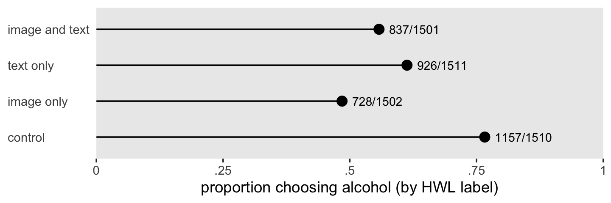
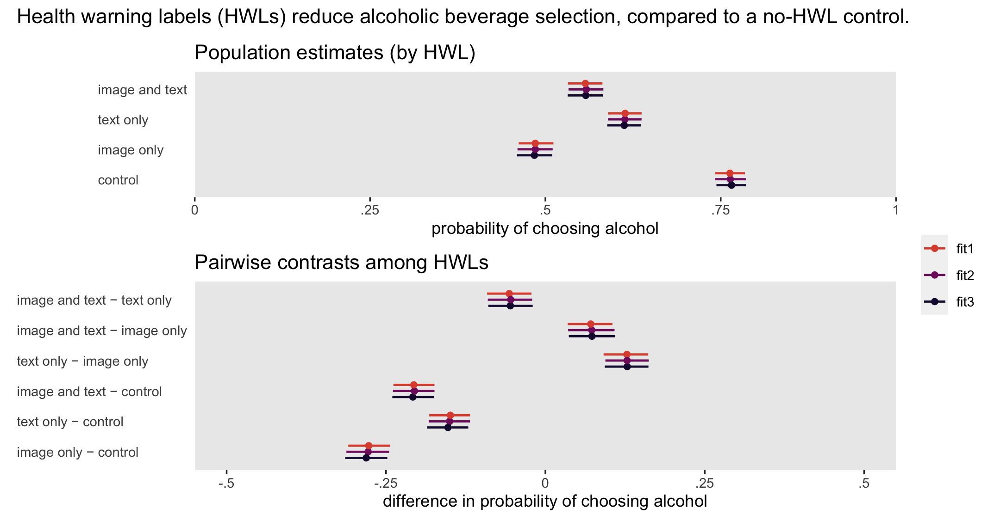

Clarke et al (2021)
================
A Solomon Kurz
2022-06-29

Load our primary packages.

``` r
# library(tidyverse)

library(ggplot2)
library(tibble)
library(dplyr)
library(tidyr)
library(stringr)
library(readr)
library(forcats)
library(purrr)

library(brms)
library(tidybayes)
library(patchwork)
```

## Health warning labels for alcoholic beverages

Clarke and colleagues (2021; <https://doi.org/10.1111/add.15072>)
reported the results from a posttest-only randomized experiment with a

factorial design to explore the impact of health warning labels (HWLs)
on a alcohol-selection task. The authors made their data available on
the OSF at <https://osf.io/pr8zu/> (see the
`Alcohol study 2 full dataset.xlsx` file in the `Study 2 folder`).
However, given their primary outcome data are binomial, we can reproduce
the full data set with a simple four-row tibble, based on the
information they reported in their Table 2 (p. 46).

``` r
clarke2021 <- tibble(
  group   = 1:4,
  image   = c(1, 0, 1, 0),
  text    = c(1, 1, 0, 0),
  hwl     = c("image and text", "text only", "image only", "control"),
  alcohol = c(837, 926, 728, 1157),
  total   = c(1501, 1511, 1502, 1510)) %>% 
  mutate(hwl = factor(hwl, levels = c("control", "image only", "text only", "image and text")))

# what is this?
print(clarke2021)
```

    ## # A tibble: 4 × 6
    ##   group image  text hwl            alcohol total
    ##   <int> <dbl> <dbl> <fct>            <dbl> <dbl>
    ## 1     1     1     1 image and text     837  1501
    ## 2     2     0     1 text only          926  1511
    ## 3     3     1     0 image only         728  1502
    ## 4     4     0     0 control           1157  1510

Clarke and colleagues recruited UK adults who consumed beer or whine at
least one a week, with help from a market research agency
(<https://www.dynata.com/>). The sample was designed to resemble the
general UK adult population by age and gender. After consent,

participants were randomized into one of four conditions. After

dropped out (evenly dispersed across conditions), the four experimental
groups and their sample sizes were:

-   a no-HWL control
    (),
-   an image-only HWL group
    (),
-   a text-only HWL group
    (),
    and
-   an image-and-text HWL group
    ().

These four groups are numbered as in the paper in the `group` variable
and described with labels in the `hwl` factor variable. The groups are
also described with the `image` and `text` dummy variables.

After random assignment, participants viewed images of 6 alcoholic and 6
non-alcoholic drinks. The orders were randomized by participant and the
labels on the drinks varied based on the experimental condition. After
viewing all 12 images, participant were asked to choose which drink they
would like to consume. Though Clarke and colleagues collected data on a
variety of outcomes, their primary outcome was whether participants
selected an alcoholic or non-alcoholic beverage. The `alcohol` column
shows the numbers of participants who selected an alcoholic beverage in
each group. The `total` columns shows the total sample size in each
group.

## EDA

### Sample statistics.

Here are the sample statistics for the selection task, by group.

``` r
clarke2021%>% 
  mutate(`chose non-alcoholic beverage` = total - alcohol) %>% 
  rename(`chose alcoholic beverage` = alcohol) %>% 
  select(group, hwl, `chose alcoholic beverage`, `chose non-alcoholic beverage`, total) %>% 
  mutate(`% chose alcohol` = round(100 * `chose alcoholic beverage` / total, digits = 1))
```

    ## # A tibble: 4 × 6
    ##   group hwl            `chose alcoholic beverage` `chose non-alcoholic beverage` total `% chose alcohol`
    ##   <int> <fct>                               <dbl>                          <dbl> <dbl>             <dbl>
    ## 1     1 image and text                        837                            664  1501              55.8
    ## 2     2 text only                             926                            585  1511              61.3
    ## 3     3 image only                            728                            774  1502              48.5
    ## 4     4 control                              1157                            353  1510              76.6

### Look at the data.

It might be nice to look at those statistics in a lollipop plot.

``` r
clarke2021 %>% 
  mutate(label = str_c(alcohol, "/", total)) %>% 
  
  ggplot(aes(x = alcohol / total, y = hwl)) +
  geom_point(size = 3) +
  geom_linerange(aes(xmin = 0, xmax = alcohol / total)) +
  geom_text(aes(label = label, hjust = 0),
            nudge_x = .02, size = 3) +
  scale_x_continuous("proportion choosing alcohol (by HWL label)", 
                     labels = c("0", ".25", ".5", ".75", "1"),
                     expand = c(0, 0), limits = 0:1) +
  labs(y = NULL) +
  theme(axis.text.y = element_text(hjust = 0),
        axis.ticks.y = element_blank(),
        panel.grid = element_blank())
```



## Models

As the data are simple bounded counts, a single-level binomial framework
will handle them well. For the sake of pedagogy, we’ll explore three
variants of the same model. If we describe `alcohol` as varying across

rows, we can describe the data with the two dummy variables and their
interaction as

 \\
\operatorname{logit}(p_i) & = \beta_0 + \beta_1 \text{image}_i + \beta_2 \text{text}_i + \beta_3 \text{image}_i \text{text}_i \\
\beta_0, \dots, \beta_3   & \sim \mathcal N(0, 1),
\end{align*}
")

where the number of binomial trials for each condition is captured by
the `total` variable. To constrain the conditional probabilities

to within the
")
range, we use the conventional logit link. Given our two dummy variables
`image` and `text`,

captures the expected value for the reference category, the no-HWL
control condition.

captures the difference for the image-only HWL condition and

captures the difference for the text-only HWL condition, both relative
to the no-HWL control. Thus,

is the interaction between the two dummies and the difference between
the image-and-text HWL condition, relative to control, is captured by
the combination of
,
,
and
.

In their literature review (p. 42), Clarke and colleagues described the
prior literature on HWL for alcoholic beverages as scant with
small-
studies which had somewhat contradictory findings. In this case, we
might adopt a simple weakly-regularizing approach, rather than basing
the priors on the findings of any specific study. By setting the prior
for the control condition
()
to
"),
we are centering the prior mass on the probability scale to .5, with a
liberal 95% percentile range from .12 to .87.

``` r
# prior scale
tibble(log_odds = rnorm(n = 1e5, mean = 0, sd = 1)) %>% 
  # probability scale
  mutate(p = inv_logit_scaled(log_odds)) %>% 
  pivot_longer(everything()) %>% 
  # summarize
  group_by(name) %>% 
  mean_qi(value)
```

    ## # A tibble: 2 × 7
    ##   name        value .lower .upper .width .point .interval
    ##   <chr>       <dbl>  <dbl>  <dbl>  <dbl> <chr>  <chr>    
    ## 1 log_odds -0.00297 -1.96   1.95    0.95 mean   qi       
    ## 2 p         0.499    0.123  0.875   0.95 mean   qi

The other

parameters share the
")
prior, which gently centers the group differences from control to zero,
but easily allows for large differences.

An alternative to the dummy-variable interaction model would be

 \\
\operatorname{logit}(p_i) & = \beta_0 + \beta_1 \text{image-only}_i + \beta_2 \text{text-only}_i + \beta_3 \text{image-and-text}_i \\
\beta_0, \dots, \beta_3   & \sim \mathcal N(0, 1),
\end{align*}
")

where we have replaced the `image` and `text` dummy variables and their
interaction with three new dummy variables. Here `image only` is coded 1
for the image-only HWL condition and 0 otherwise, `text only` is coded 1
for the text-only HWL condition and 0 otherwise, and `image and text` is
coded 1 for the image-and-text HWL condition and 0 otherwise. With such
a model,

still captures the expected value for the reference category, the no-HWL
control condition. However, now the three remaining conditions are each
expressed as deviations from the control condition without the need for
an interaction term. As to priors, we continue to use the
weakly-regularizing
")
for all

parameters.

For the final model, we adopt a one-hot dummy coding system:

 \\
\operatorname{logit}(p_i) & = \beta_0 \text{control}_i + \beta_1 \text{image-only}_i + \beta_2 \text{text-only}_i + \beta_3 \text{image-and-text}_i \\
\beta_0, \dots, \beta_3   & \sim \mathcal N(0, 1),
\end{align*}
")

where now we add a `control` dummy to
.
Provided `control` is coded 1 for the no-HWL condition and 0 otherwise,
the

parameter has the same meaning as in the other to models. But now we
have included dummy variables for all four conditions, the remain

through

parameters are no longer expressed as deviations from the reference
category. Rather, each

coefficient stands for the expected value for its own condition. Once
again, assigning the
")
prior to each parameter will weakly regularize the group probabilities
toward .5.

From a likelihood perspective, all three versions of the model are
equivalent. But because of how the

parameters do or do not reference one another within each model, the
common
")
will have slightly different effects on the posteriors. I would like to
suggest that no one model is better than the others, but different
researchers may find it easier to set the priors for one or another.

Anyway, here’s how to fit the three models with `brm()`.

``` r
fit1 <- brm(
  data = clarke2021,
  family = binomial,
  alcohol | trials(total) ~ 0 + Intercept + image + text + image : text,
  prior = c(prior(normal(0, 1), class = b)),
  cores = 4, seed = 1,
  file = "fits/fit1.clarke2021"
)

fit2 <- brm(
  data = clarke2021,
  family = binomial,
  alcohol | trials(total) ~ 0 + Intercept + hwl,
  prior = c(prior(normal(0, 1), class = b)),
  cores = 4, seed = 1,
  file = "fits/fit2.clarke2021"
)

fit3 <- brm(
  data = clarke2021,
  family = binomial,
  alcohol | trials(total) ~ 0 + hwl,
  prior = c(prior(normal(0, 1), class = b)),
  cores = 4, seed = 1,
  file = "fits/fit3.clarke2021"
)
```

Check the summaries.

``` r
summary(fit1)
```

    ##  Family: binomial 
    ##   Links: mu = logit 
    ## Formula: alcohol | trials(total) ~ 0 + Intercept + image + text + image:text 
    ##    Data: clarke2021 (Number of observations: 4) 
    ##   Draws: 4 chains, each with iter = 2000; warmup = 1000; thin = 1;
    ##          total post-warmup draws = 4000
    ## 
    ## Population-Level Effects: 
    ##            Estimate Est.Error l-95% CI u-95% CI Rhat Bulk_ESS Tail_ESS
    ## Intercept      1.17      0.06     1.06     1.29 1.00     1310     1982
    ## image         -1.23      0.08    -1.38    -1.07 1.00     1206     1859
    ## text          -0.71      0.08    -0.86    -0.56 1.00     1307     2004
    ## image:text     0.99      0.11     0.79     1.20 1.00     1297     1783
    ## 
    ## Draws were sampled using sampling(NUTS). For each parameter, Bulk_ESS
    ## and Tail_ESS are effective sample size measures, and Rhat is the potential
    ## scale reduction factor on split chains (at convergence, Rhat = 1).

``` r
summary(fit2)
```

    ##  Family: binomial 
    ##   Links: mu = logit 
    ## Formula: alcohol | trials(total) ~ 0 + Intercept + hwl 
    ##    Data: clarke2021 (Number of observations: 4) 
    ##   Draws: 4 chains, each with iter = 2000; warmup = 1000; thin = 1;
    ##          total post-warmup draws = 4000
    ## 
    ## Population-Level Effects: 
    ##                 Estimate Est.Error l-95% CI u-95% CI Rhat Bulk_ESS Tail_ESS
    ## Intercept           1.17      0.06     1.05     1.30 1.00     1062     1428
    ## hwlimageonly       -1.23      0.08    -1.39    -1.08 1.00     1330     1794
    ## hwltextonly        -0.71      0.08    -0.87    -0.56 1.00     1205     1679
    ## hwlimageandtext    -0.94      0.08    -1.11    -0.79 1.00     1273     1589
    ## 
    ## Draws were sampled using sampling(NUTS). For each parameter, Bulk_ESS
    ## and Tail_ESS are effective sample size measures, and Rhat is the potential
    ## scale reduction factor on split chains (at convergence, Rhat = 1).

``` r
summary(fit3)
```

    ##  Family: binomial 
    ##   Links: mu = logit 
    ## Formula: alcohol | trials(total) ~ 0 + hwl 
    ##    Data: clarke2021 (Number of observations: 4) 
    ##   Draws: 4 chains, each with iter = 2000; warmup = 1000; thin = 1;
    ##          total post-warmup draws = 4000
    ## 
    ## Population-Level Effects: 
    ##                 Estimate Est.Error l-95% CI u-95% CI Rhat Bulk_ESS Tail_ESS
    ## hwlcontrol          1.18      0.06     1.07     1.30 1.00     4343     2795
    ## hwlimageonly       -0.06      0.05    -0.16     0.04 1.00     4791     2837
    ## hwltextonly         0.46      0.05     0.36     0.56 1.00     4692     3001
    ## hwlimageandtext     0.23      0.05     0.13     0.33 1.00     5390     3255
    ## 
    ## Draws were sampled using sampling(NUTS). For each parameter, Bulk_ESS
    ## and Tail_ESS are effective sample size measures, and Rhat is the potential
    ## scale reduction factor on split chains (at convergence, Rhat = 1).

As expected, the summaries for

are about the same across models and the summaries for the other
parameters differ quite a bit. Perhaps less interestingly, notice how
the bulk and tail effective sample sizes are notable larger for the
one-hot version of the model (`fit3`). You can get a sense of why by
looking at the correlatinos among the parameters via `vcov()`.

``` r
vcov(fit1, correlation = T) %>% round(digits = 3)
```

    ##            Intercept  image   text image:text
    ## Intercept      1.000 -0.753 -0.751      0.541
    ## image         -0.753  1.000  0.563     -0.727
    ## text          -0.751  0.563  1.000     -0.724
    ## image:text     0.541 -0.727 -0.724      1.000

``` r
vcov(fit2, correlation = T) %>% round(digits = 3)
```

    ##                 Intercept hwlimageonly hwltextonly hwlimageandtext
    ## Intercept           1.000       -0.763      -0.762          -0.765
    ## hwlimageonly       -0.763        1.000       0.594           0.566
    ## hwltextonly        -0.762        0.594       1.000           0.572
    ## hwlimageandtext    -0.765        0.566       0.572           1.000

``` r
vcov(fit3, correlation = T) %>% round(digits = 3)
```

    ##                 hwlcontrol hwlimageonly hwltextonly hwlimageandtext
    ## hwlcontrol           1.000       -0.018       0.007           0.012
    ## hwlimageonly        -0.018        1.000       0.028          -0.037
    ## hwltextonly          0.007        0.028       1.000          -0.020
    ## hwlimageandtext      0.012       -0.037      -0.020           1.000

The first two versions of the model results in strong correlations among
the

parameters. Those strong correlations dropped toward zero with the
one-hot coded model `fit3`. As a consequence, the effective sample size
estimates shot up. The effective sample sizes were still large enough
for the other two models that I wouldn’t worry about using their
results. But if you ever run into low effective sample size difficulties
in your own research, perhaps a simple reparameterization could help.

As to the

posteriors themselves, the advantage of the first two models is

and

both return odds ratios for the image-only and text-only conditions,
relative to the no HWL control. Just exponentiate.

``` r
fixef(fit1)[2:3, -2] %>% exp()
```

    ##        Estimate      Q2.5     Q97.5
    ## image 0.2933001 0.2511463 0.3416951
    ## text  0.4926328 0.4214083 0.5727625

``` r
fixef(fit2)[2:3, -2] %>% exp()
```

    ##               Estimate      Q2.5     Q97.5
    ## hwlimageonly 0.2914361 0.2480646 0.3397817
    ## hwltextonly  0.4901638 0.4179464 0.5710997

As it is an interaction term, the

posterior for `fit1` is difficult to interpret directly. However,
researchers used to the NHST approach may appreciate how one can use the
95% intervals for the parameter to test the statistical significance of
the interaction term.

in `fit2`, however, can provide a straightforward odds ratio for the
image-and-text HWL condition relative to control, after exponentiation.

``` r
fixef(fit2)[4, -2] %>% exp()
```

    ##  Estimate      Q2.5     Q97.5 
    ## 0.3905556 0.3307953 0.4541475

The parameters in the one-hot based `fit3` do not lend themselves as
easily to odds ratios. However, one can work directly with the posterior
draws from any of the three models to hand-compute odds ratios or any
other comparisons among the conditions, as desired. To my mind, the
`brms::fitted()` function provides the easiest method for wrangling the
posteriors. To give a sense, here we use `fitted()` to compute the
log-odds for each condition, from each of the three versions of the
model.

``` r
# fit1
f1 <- fitted(
  fit1,
  scale = "linear",
  summary = F
) %>% 
  data.frame() %>% 
  set_names(pull(clarke2021, hwl)) %>% 
  mutate(draw = 1:n(),
         fit = "fit1")

f2 <- fitted(
  fit2,
  scale = "linear",
  summary = F
) %>% 
  data.frame() %>% 
  set_names(pull(clarke2021, hwl)) %>% 
  mutate(draw = 1:n(),
         fit = "fit2")

f3 <- fitted(
  fit3,
  scale = "linear",
  summary = F
) %>% 
  data.frame() %>% 
  set_names(pull(clarke2021, hwl)) %>% 
  mutate(draw = 1:n(),
         fit = "fit3")
  
# combine
f <- bind_rows(f1, f2, f3) %>% 
  # make it long
  pivot_longer(`image and text`:control, names_to = "hwl", values_to = "log_odds") %>% 
  # convert log odds to probabilities
  mutate(p = inv_logit_scaled(log_odds))

# what?
glimpse(f)
```

    ## Rows: 48,000
    ## Columns: 5
    ## $ draw     <int> 1, 1, 1, 1, 2, 2, 2, 2, 3, 3, 3, 3, 4, 4, 4, 4, 5, 5, 5, 5, 6, 6, 6, 6, 7, 7, 7, 7, 8, 8, 8…
    ## $ fit      <chr> "fit1", "fit1", "fit1", "fit1", "fit1", "fit1", "fit1", "fit1", "fit1", "fit1", "fit1", "fi…
    ## $ hwl      <chr> "image and text", "text only", "image only", "control", "image and text", "text only", "ima…
    ## $ log_odds <dbl> 0.24847893, 0.47410535, 0.08183143, 1.19083506, 0.21114577, 0.44079414, -0.01464878, 1.1377…
    ## $ p        <dbl> 0.5618021, 0.6163550, 0.5204464, 0.7668904, 0.5525912, 0.6084482, 0.4963379, 0.7572616, 0.5…

With all the posterior draws across the three models in one `f` object,
we can display the conditional probabilities in a coefficient plot.

``` r
p1 <- f %>% 
  mutate(hwl = factor(hwl, levels = clarke2021 %>% arrange(hwl) %>% pull(hwl))) %>% 
  
  ggplot(aes(x = p, y = hwl)) +
  stat_pointinterval(aes(color = fit, group = fit),
                     .width = .95, size = 1.5, position = position_dodge(width = -0.6)) +
  scale_color_viridis_d(NULL, option = "B", begin = .1, end = .6, direction = -1) +
  scale_x_continuous("probability of choosing alcohol", 
                     labels = c("0", ".25", ".5", ".75", "1"),
                     expand = c(0, 0), limits = 0:1) +
  labs(title = "Population estimates (by HWL)",
       y = NULL) +
  theme(axis.text.y = element_text(hjust = 0),
        axis.ticks.y = element_blank(),
        panel.grid = element_blank())
```

With aid from the `tidybayes::compare_levels()` function, it’s easy to
compute all pairwise effect sizes as probability contrasts and then
display the results in a coefficient plot.

``` r
# for the y-axis labels
group_labels <- c("image and text", "text only", "image only", "control")

contrast_levels <- c("image only \u2212 control", "text only \u2212 control", "image and text \u2212 control", "text only \u2212 image only", "image and text \u2212 image only", "image and text \u2212 text only")

# wrangle
p2 <- f %>% 
  mutate(hwl = factor(hwl, levels = group_labels)) %>%
  mutate(hwl = fct_rev(hwl)) %>%
  compare_levels(p, by = hwl, draw_indices = c("draw", "fit")) %>% 
  mutate(hwl = str_replace(hwl, "-", "\u2212")) %>% 
  mutate(hwl = factor(hwl, levels = contrast_levels))  %>% 
  
  # plot!
  ggplot(aes(x = p, y = hwl)) +
  stat_pointinterval(aes(color = fit, group = fit),
                     .width = .95, size = 1.5, position = position_dodge(width = -0.6)) +
  scale_color_viridis_d(NULL, option = "B", begin = .1, end = .6, direction = -1) +
  scale_x_continuous("difference in probability of choosing alcohol", 
                     labels = c("-.5", "-.25", "0", ".25", ".5"),
                     limits = c(-0.5, 0.5)) +
  labs(title = "Pairwise contrasts among HWLs",
       y = NULL) +
  theme(axis.text.y = element_text(hjust = 0),
        axis.ticks.y = element_blank(),
        panel.grid = element_blank())
```

Here we combine the two sub plots, add an overall title, and display the
results.

``` r
p1 / p2 + 
  plot_annotation(title = "Health warning labels (HWLs) reduce alcoholic beverage selection, compared to a no-HWL control.") +
  plot_layout(heights = c(2, 3), guides = "collect")
```



You’ll note that although the probabilities and their contrasts are very
similar across the three models, there are subtle differences,
particularly for `fit3`. As we discussed before, the
")
prior imposed slightly different consequences for the marginal
posteriors in each model.

## Session info

``` r
sessionInfo()
```

    ## R version 4.2.0 (2022-04-22)
    ## Platform: x86_64-apple-darwin17.0 (64-bit)
    ## Running under: macOS Catalina 10.15.7
    ## 
    ## Matrix products: default
    ## BLAS:   /Library/Frameworks/R.framework/Versions/4.2/Resources/lib/libRblas.0.dylib
    ## LAPACK: /Library/Frameworks/R.framework/Versions/4.2/Resources/lib/libRlapack.dylib
    ## 
    ## locale:
    ## [1] en_US.UTF-8/en_US.UTF-8/en_US.UTF-8/C/en_US.UTF-8/en_US.UTF-8
    ## 
    ## attached base packages:
    ## [1] stats     graphics  grDevices utils     datasets  methods   base     
    ## 
    ## other attached packages:
    ##  [1] patchwork_1.1.1 tidybayes_3.0.2 brms_2.17.3     Rcpp_1.0.8.3    purrr_0.3.4     forcats_0.5.1  
    ##  [7] readr_2.1.2     stringr_1.4.0   tidyr_1.2.0     dplyr_1.0.9     tibble_3.1.7    ggplot2_3.3.6  
    ## 
    ## loaded via a namespace (and not attached):
    ##   [1] TH.data_1.1-1        colorspace_2.0-3     ellipsis_0.3.2       ggridges_0.5.3       estimability_1.3    
    ##   [6] markdown_1.1         base64enc_0.1-3      rstudioapi_0.13      farver_2.1.0         rstan_2.26.11       
    ##  [11] svUnit_1.0.6         DT_0.22              lubridate_1.8.0      fansi_1.0.3          mvtnorm_1.1-3       
    ##  [16] diffobj_0.3.5        bridgesampling_1.1-2 codetools_0.2-18     splines_4.2.0        knitr_1.39          
    ##  [21] shinythemes_1.2.0    bayesplot_1.9.0      jsonlite_1.8.0       ggdist_3.1.1         shiny_1.7.1         
    ##  [26] compiler_4.2.0       emmeans_1.7.3        backports_1.4.1      assertthat_0.2.1     Matrix_1.4-1        
    ##  [31] fastmap_1.1.0        cli_3.3.0            later_1.3.0          htmltools_0.5.2      prettyunits_1.1.1   
    ##  [36] tools_4.2.0          igraph_1.3.1         coda_0.19-4          gtable_0.3.0         glue_1.6.2          
    ##  [41] reshape2_1.4.4       posterior_1.2.1      V8_4.1.0             vctrs_0.4.1          nlme_3.1-157        
    ##  [46] crosstalk_1.2.0      tensorA_0.36.2       xfun_0.31            ps_1.7.0             mime_0.12           
    ##  [51] miniUI_0.1.1.1       lifecycle_1.0.1      gtools_3.9.2         MASS_7.3-56          zoo_1.8-10          
    ##  [56] scales_1.2.0         colourpicker_1.1.1   hms_1.1.1            promises_1.2.0.1     Brobdingnag_1.2-7   
    ##  [61] parallel_4.2.0       sandwich_3.0-1       inline_0.3.19        shinystan_2.6.0      yaml_2.3.5          
    ##  [66] curl_4.3.2           gridExtra_2.3        loo_2.5.1            StanHeaders_2.26.11  stringi_1.7.6       
    ##  [71] highr_0.9            dygraphs_1.1.1.6     checkmate_2.1.0      pkgbuild_1.3.1       rlang_1.0.2         
    ##  [76] pkgconfig_2.0.3      matrixStats_0.62.0   distributional_0.3.0 evaluate_0.15        lattice_0.20-45     
    ##  [81] labeling_0.4.2       rstantools_2.2.0     htmlwidgets_1.5.4    processx_3.5.3       tidyselect_1.1.2    
    ##  [86] plyr_1.8.7           magrittr_2.0.3       R6_2.5.1             generics_0.1.2       multcomp_1.4-19     
    ##  [91] DBI_1.1.2            pillar_1.7.0         withr_2.5.0          xts_0.12.1           survival_3.3-1      
    ##  [96] abind_1.4-5          crayon_1.5.1         arrayhelpers_1.1-0   utf8_1.2.2           tzdb_0.3.0          
    ## [101] rmarkdown_2.14       grid_4.2.0           callr_3.7.0          threejs_0.3.3        digest_0.6.29       
    ## [106] xtable_1.8-4         httpuv_1.6.5         RcppParallel_5.1.5   stats4_4.2.0         munsell_0.5.0       
    ## [111] viridisLite_0.4.0    shinyjs_2.1.0
