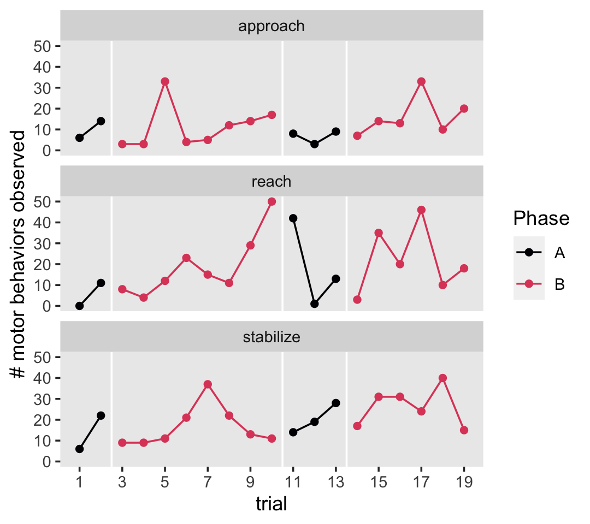
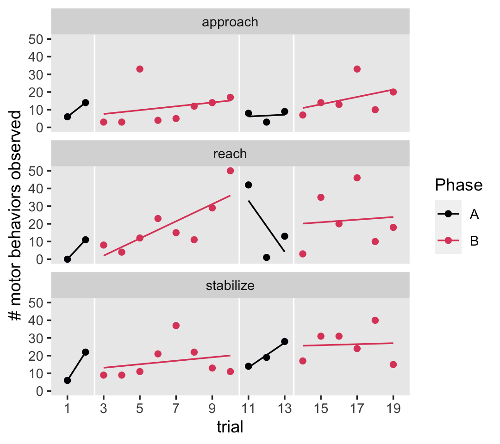
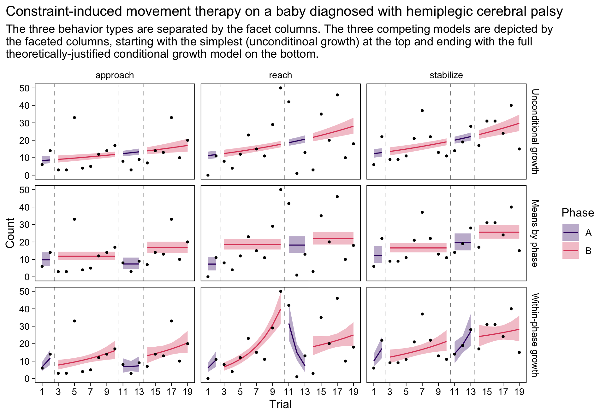
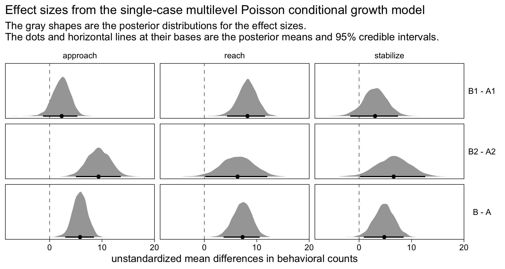

Coker et al (2009)
================
A Solomon Kurz
2022-02-27

Load our primary packages.

``` r
library(tidyverse)
library(brms)
library(tidybayes)
```

## Bad habbits!

Coker et al (2009; <https://doi.org/10.3233/NRE-2009-0469>) used a
multivariate single-case ABAB design to evaluate a modified
constraint-induced movement therapy on baby diagnosed with hemiplegic
cerebral palsy.

``` r
# load the data
load(file = "/Users/solomonkurz/Dropbox/Experimental-design-and-the-GLMM/sketches/data/coker2009.rda")

# what is this?
glimpse(coker2009)
```

    ## Rows: 57
    ## Columns: 7
    ## $ behavior <chr> "reach", "reach", "reach", "reach", "reach", "reach", "reach", "reach", "reach", "reach", "…
    ## $ trial    <int> 1, 2, 3, 4, 5, 6, 7, 8, 9, 10, 11, 12, 13, 14, 15, 16, 17, 18, 19, 1, 2, 3, 4, 5, 6, 7, 8, …
    ## $ trial0   <dbl> 0, 1, 2, 3, 4, 5, 6, 7, 8, 9, 10, 11, 12, 13, 14, 15, 16, 17, 18, 0, 1, 2, 3, 4, 5, 6, 7, 8…
    ## $ ptrial   <int> 1, 2, 1, 2, 3, 4, 5, 6, 7, 8, 1, 2, 3, 1, 2, 3, 4, 5, 6, 1, 2, 1, 2, 3, 4, 5, 6, 7, 8, 1, 2…
    ## $ ptrial0  <dbl> 0, 1, 0, 1, 2, 3, 4, 5, 6, 7, 0, 1, 2, 0, 1, 2, 3, 4, 5, 0, 1, 0, 1, 2, 3, 4, 5, 6, 7, 0, 1…
    ## $ phase    <fct> A1, A1, B1, B1, B1, B1, B1, B1, B1, B1, A2, A2, A2, B2, B2, B2, B2, B2, B2, A1, A1, B1, B1,…
    ## $ total    <dbl> 0, 11, 8, 4, 12, 23, 15, 11, 29, 50, 42, 1, 13, 3, 35, 20, 46, 10, 18, 6, 22, 9, 9, 11, 21,…

The data are in the long format with respect to the three behavior types
listed in the `behavior` column. Each was measured across 19 successive
trials, which are listed in the `trial` column. The `trial0` column is
`trial -`, to help the intercept in regression models. Each of the
behaviors were assessed within four experimental phases (i.e., A1, B1,
A2, B2), which are recorded in the `phase` column. The `ptrial` and
`ptrial0` columns list the trials within each of the four phases,
restarting the sequence at the beginning of each `phase`. The `total`
column is the number of observed behaviors within a given `trial`.

### EDA.

Here are the number of trials within each experimental phase.

``` r
coker2009 %>%
  filter(behavior == "reach") %>% 
  count(phase)
```

    ## # A tibble: 4 × 2
    ##   phase     n
    ##   <fct> <int>
    ## 1 A1        2
    ## 2 B1        8
    ## 3 A2        3
    ## 4 B2        6

Here’s a version of Figure 2 in the original paper.

``` r
coker2009 %>% 
  mutate(Phase = ifelse(str_detect(phase, "A"), "A", "B")) %>% 
  
  ggplot(aes(x = trial, y = total, group = phase, color = Phase)) +
  geom_vline(xintercept = c(2.5, 10.5, 13.5), color = "white") +
  geom_point() +
  geom_line() +
  scale_x_continuous(breaks = seq(from = 1, to = 19, by = 2)) +
  scale_color_viridis_d(option = "A", end = .6) +
  ylab("# motor behaviors observed") +
  theme(panel.grid = element_blank()) +
  facet_wrap(~ behavior, ncol = 1)
```



We could also use the `geom_smooth()` method to get a sense of the
linear treands across behaviors and phases.

``` r
coker2009 %>% 
  mutate(Phase = ifelse(str_detect(phase, "A"), "A", "B")) %>% 
  
  ggplot(aes(x = trial, y = total, group = phase, color = Phase)) +
  geom_vline(xintercept = c(2.5, 10.5, 13.5), color = "white") +
  geom_point() +
  geom_smooth(method = "lm", se = FALSE, formula = y ~ x, size = 1/2) +
  scale_x_continuous(breaks = seq(from = 1, to = 19, by = 2)) +
  scale_color_viridis_d(option = "A", end = .6) +
  ylab("# motor behaviors observed") +
  theme(panel.grid = element_blank()) +
  facet_wrap(~ behavior, ncol = 1)
```



We explicitly removed the standard error ribbons from the plot with
`se = FALSE` because, IMO, they would be invalid. They’re based on OLS
estimation, which isn’t particularly appropriate for that of this kind.
However, the lines are okay for quick-and-dirty exploratory plots.

## Models

There are a handful of different models we might use to analyze these
data. We’ll consider three. In all cases, we’ll model the behavioral
counts with the Poisson likelihood. As the data are in the long format
with respect to the behavior types, the model will be multilevel in that
behavioral counts will be nested within the three levels of `behavior`.

The first model will be the unconditional growth model

$$
\\begin{align\*}
\\text{total}\_{ij} & \\sim \\operatorname{Poisson}(\\lambda\_{ij}) \\\\
\\log(\\lambda\_{ij}) & = a_i + b_i \\text{trial0}\_{ij} \\\\
a_i & = \\alpha + u_i \\\\
b_i & = \\beta + v_i \\\\
\\begin{bmatrix} u_i \\\\ v_i \\end{bmatrix} & \\sim
  \\operatorname{Normal} \\left ( 
    \\begin{bmatrix} 0 \\\\ 0 \\end{bmatrix}, \\mathbf \\Sigma 
    \\right) \\\\
\\mathbf \\Sigma & = \\mathbf{SRS} \\\\
\\mathbf S & =  \\begin{bmatrix} \\sigma_u & \\\\ 0 & \\sigma_v \\end{bmatrix} \\\\
\\mathbf R & =  \\begin{bmatrix} 1 & \\\\ \\rho & 1 \\end{bmatrix} \\\\
\\alpha & \\sim \\operatorname{Normal}(\\log(5), 0.5) \\\\
\\beta  & \\sim \\operatorname{Normal}(0, 0.5) \\\\
\\sigma_u & \\sim \\operatorname{Exponential}(2) \\\\
\\sigma_v & \\sim \\operatorname{Exponential}(2) \\\\
\\rho    & \\sim \\operatorname{LKJ}(2),
\\end{align\*}
$$

where the behavioral count variable `total` varies across *i* behaviors
and *j* trials. There is an overall intercept *α* and
`behavior`-specific deviations (*u*<sub>*i*</sub>) around that overall
intercept. There is an overall slope across `trial0` *β*, which has
`behavior`-specific deviations (*v*<sub>*i*</sub>) around that overall
parameter. Per by convention, those two deviation parameters are modeled
as multivariate normal with the variance/covariance **Σ** decomposed
into a standard deviation matrix **S** and correlation matrix **R**.

The second model allows for `phase`-specific means:

$$ $$

Here the \[phase\] subscript indicates the *α* parameter is indexed by
the four levels of `phase`, which all also vary across the three levels
of `behavior` as indicated by the `behavior`-specific deviations around
those four grand means *u*<sub>\[phase\]*i*</sub>. Those four deviation
parameters are modeled as multivariate normal in the typical way, with
the **S** and **R** matrices now following a 4 × 4 structure.

The final model is what you might call the full or theory based model:

$$ $$

where now the intercepts and `ptrial0` slopes vary across the four
levels of `phase`. Given that all these also vary across the three
levels of `behavior`, this results in an 8 × 8 structure for the **S**
and **R** matrices.

Here’s how to fit the models with **brms**.

``` r
fit1 <- brm(
  data = coker2009,
  family = poisson,
  total ~ 0 + Intercept + trial0 + (1 + trial0 | behavior),
  prior = c(prior(normal(log(5), 0.5), class = b, coef = Intercept),
            prior(normal(0, 0.5), class = b),
            prior(exponential(2), class = sd),
            prior(lkj(2), class = cor)),
  cores = 4, seed = 1,
  control = list(adapt_delta = .9995,
                 max_treedepth = 12),
  file = "fits/fit1.coker2009"
)

fit2 <- brm(
  data = coker2009,
  family = poisson,
  total ~ 0 + phase + (0 + phase | behavior),
  prior = c(prior(normal(log(5), 1), class = b),
            prior(exponential(2), class = sd),
            prior(lkj(1), class = cor)),
  cores = 4, seed = 1,
  control = list(adapt_delta = .999,
                 max_treedepth = 12),
  file = "fits/fit2.coker2009"
)

fit3 <- brm(
  data = coker2009,
  family = poisson,
  total ~ 0 + Intercept + phase + ptrial0 + phase:ptrial0 + (1 + phase + ptrial0 + phase:ptrial0 | behavior),
  prior = c(prior(normal(log(5), 0.5), class = b, coef = Intercept),
            prior(normal(0, 0.5), class = b),
            prior(exponential(2), class = sd),
            prior(lkj(1), class = cor)),
  cores = 4, seed = 1,
  control = list(adapt_delta = .9999,
                 max_treedepth = 12),
  file = "fits/fit3.coker2009"
)
```

As is often the case in when you have few levels for the multilevel
grouping term (i.e., the levels of `behavior`), all three models
required adjustments to the parameters within the `control` settings to
keep the MCMC chains healthy.

Rather than looking at the model summaries with `print()`, we just plot.

``` r
model <- c("Unconditional growth", "Means by phase", "Within-phase growth")

rbind(
  fitted(fit1),
  fitted(fit2),
  fitted(fit3)
) %>% 
  data.frame() %>% 
  bind_cols(
    bind_rows(coker2009, coker2009, coker2009)
  ) %>% 
  mutate(Phase = ifelse(str_detect(phase, "A"), "A", "B"),
         model = rep(model, each = n() / 3) %>% factor(., levels = model))  %>% 
  
  ggplot(aes(x = trial, group = phase)) +
  geom_vline(xintercept = c(2.5, 10.5, 13.5), color = "grey50", linetype = 2, size = 1/4) +
  geom_ribbon(aes(ymin = Q2.5, ymax = Q97.5, fill = Phase),
              alpha = 1/3) +
  geom_line(aes(y = Estimate, color = Phase)) +
  geom_point(aes(y = total),
             size = 2/3) +
  scale_fill_viridis_d(option = "A", begin = .2, end = .6) +
  scale_color_viridis_d(option = "A", begin = .2, end = .6) +
  scale_x_continuous(breaks = seq(from = 1, to = 19, by = 2)) +
  labs(title = "Constraint-induced movement therapy on a baby diagnosed with hemiplegic cerebral palsy",
       "behavor count",
       subtitle = "The three behavior types are separated by the facet columns. The three competing models are depicted by\nthe faceted columns, starting with the simplest (unconditinoal growth) at the top and ending with the full\ntheoretically-justified conditional growth model on the bottom.",
       x = "Trial",
       y = "Count") +
  facet_grid(model ~ behavior) +
  theme_linedraw() +
  theme(panel.grid = element_blank(),
        plot.title.position = "plot",
        strip.background = element_blank(),
        strip.text = element_text(color = "black"))
```



IMO, you’re best off using `fit2`, the full theoretically-justified
conditional growth model. However, you could compare the models by their
out-of-sample performance with their LOO-CV estimates and contrasts.

``` r
fit1 <- add_criterion(fit1, criterion = "loo")
fit2 <- add_criterion(fit2, criterion = "loo")
fit3 <- add_criterion(fit3, criterion = "loo")

loo_compare(fit1, fit2, fit3) %>% 
  print(simplify = F)
```

    ##      elpd_diff se_diff elpd_loo se_elpd_loo p_loo  se_p_loo looic  se_looic
    ## fit3    0.0       0.0  -312.0     33.7        77.6   13.9    624.0   67.4  
    ## fit1  -14.7      23.5  -326.7     36.9        32.3    6.5    653.4   73.8  
    ## fit2  -43.8      27.7  -355.8     38.5        74.0   14.3    711.6   77.1

Numerically, the full model `fit3` made the best sense of the data from
a cross-validation perspective. Note, however, how large the standard
errors are relative to the differences, particularly for `fit3` relative
to `fit1`. What does this mean? If you study the top and bottom columns
of the facet plot, above, you’ll see that the results from the
experiment are somewhat ambiguous. The unconditional growth model,
alone, made pretty good sense of the data. Why might that be? We’re
measuring behaviors in a baby and what do babies do if not develop? I
suspect Corker and colleagues would have provided a more convincing
demonstration of their intervention had they collected data on more
trials, particularly during the A phases. Yes, there’s enough
information in the data to suggest the intervention was probably
helpful. But the evidence is weak and no-one should be breaking open the
Champagne.

Here’s how you might compute effect sizes (unstandardized mean
differences) with the full model `fit3`.

``` r
nd <- coker2009 %>% 
  group_by(behavior, phase) %>% 
  summarise(ptrial0 = mean(ptrial0)) %>% 
  ungroup() %>% 
  mutate(row = 1:n())

fitted(fit3,
       newdata = nd,
       summary = F) %>% 
  data.frame() %>% 
  set_names(1:12) %>% 
  mutate(draw = 1:n()) %>% 
  pivot_longer(-draw, 
               names_to = "row",
               names_transform = list(row = as.integer)) %>% 
  left_join(nd, by = "row") %>% 
  select(-row, -ptrial0) %>% 
  pivot_wider(names_from = phase, values_from = value) %>% 
  mutate(`B1 - A1` = B1 - A1,
         `B2 - A2` = B2 - A2) %>% 
  mutate(`B - A` = (`B1 - A1` + `B2 - A2`) / 2) %>% 
  pivot_longer(contains("-"), names_to = "contrast") %>% 
  mutate(contrast = factor(contrast, levels = c("B1 - A1", "B2 - A2", "B - A"))) %>% 
  
  ggplot(aes(x = value, y = 0)) +
  geom_vline(xintercept = 0, size = 1/4, linetype = 2, color = "grey25") +
  tidybayes::stat_halfeye(.width = .95, size = 1) +
  scale_y_continuous(NULL, breaks = NULL) +
  labs(title = "Effect sizes from the single-case multilevel Poisson conditional growth model",
       subtitle = "The gray shapes are the posterior distributions for the effect sizes.\nThe dots and horizontal lines at their bases are the posterior means and 95% credible intervals.",
       x = "unstandardized mean differences in behavioral counts") +
  facet_grid(contrast ~ behavior) +
  theme_linedraw() +
  theme(panel.grid = element_blank(),
        strip.background = element_blank(),
        strip.text.y = element_text(angle = 0),
        strip.text = element_text(color = "black"))
```



## Session information

``` r
sessionInfo()
```

    ## R version 4.1.2 (2021-11-01)
    ## Platform: x86_64-apple-darwin17.0 (64-bit)
    ## Running under: macOS Catalina 10.15.7
    ## 
    ## Matrix products: default
    ## BLAS:   /Library/Frameworks/R.framework/Versions/4.1/Resources/lib/libRblas.0.dylib
    ## LAPACK: /Library/Frameworks/R.framework/Versions/4.1/Resources/lib/libRlapack.dylib
    ## 
    ## locale:
    ## [1] en_US.UTF-8/en_US.UTF-8/en_US.UTF-8/C/en_US.UTF-8/en_US.UTF-8
    ## 
    ## attached base packages:
    ## [1] stats     graphics  grDevices utils     datasets  methods   base     
    ## 
    ## other attached packages:
    ##  [1] tidybayes_3.0.2 brms_2.16.3     Rcpp_1.0.8      forcats_0.5.1   stringr_1.4.0   dplyr_1.0.7    
    ##  [7] purrr_0.3.4     readr_2.0.1     tidyr_1.2.0     tibble_3.1.6    ggplot2_3.3.5   tidyverse_1.3.1
    ## 
    ## loaded via a namespace (and not attached):
    ##   [1] readxl_1.3.1         backports_1.4.1      plyr_1.8.6           igraph_1.2.6         svUnit_1.0.6        
    ##   [6] splines_4.1.2        crosstalk_1.1.1      TH.data_1.0-10       rstantools_2.1.1     inline_0.3.19       
    ##  [11] digest_0.6.29        htmltools_0.5.2      rsconnect_0.8.24     fansi_1.0.2          magrittr_2.0.2      
    ##  [16] checkmate_2.0.0      tzdb_0.1.2           modelr_0.1.8         RcppParallel_5.1.4   matrixStats_0.61.0  
    ##  [21] xts_0.12.1           sandwich_3.0-1       prettyunits_1.1.1    colorspace_2.0-2     rvest_1.0.1         
    ##  [26] ggdist_3.0.1         haven_2.4.3          xfun_0.25            callr_3.7.0          crayon_1.4.2        
    ##  [31] jsonlite_1.7.3       lme4_1.1-27.1        survival_3.2-13      zoo_1.8-9            glue_1.6.1          
    ##  [36] gtable_0.3.0         emmeans_1.7.1-1      distributional_0.2.2 pkgbuild_1.2.0       rstan_2.21.3        
    ##  [41] abind_1.4-5          scales_1.1.1         mvtnorm_1.1-2        DBI_1.1.1            miniUI_0.1.1.1      
    ##  [46] viridisLite_0.4.0    xtable_1.8-4         diffobj_0.3.4        stats4_4.1.2         StanHeaders_2.21.0-7
    ##  [51] DT_0.19              htmlwidgets_1.5.3    httr_1.4.2           threejs_0.3.3        arrayhelpers_1.1-0  
    ##  [56] posterior_1.1.0.9000 ellipsis_0.3.2       pkgconfig_2.0.3      loo_2.4.1            farver_2.1.0        
    ##  [61] dbplyr_2.1.1         utf8_1.2.2           labeling_0.4.2       tidyselect_1.1.1     rlang_1.0.1         
    ##  [66] reshape2_1.4.4       later_1.3.0          munsell_0.5.0        cellranger_1.1.0     tools_4.1.2         
    ##  [71] cli_3.1.1            generics_0.1.2       broom_0.7.10         ggridges_0.5.3       evaluate_0.14       
    ##  [76] fastmap_1.1.0        yaml_2.2.1           processx_3.5.2       knitr_1.33           fs_1.5.0            
    ##  [81] nlme_3.1-153         mime_0.11            projpred_2.0.2       xml2_1.3.2           compiler_4.1.2      
    ##  [86] bayesplot_1.8.1      shinythemes_1.2.0    rstudioapi_0.13      gamm4_0.2-6          reprex_2.0.1        
    ##  [91] stringi_1.7.4        highr_0.9            ps_1.6.0             Brobdingnag_1.2-6    lattice_0.20-45     
    ##  [96] Matrix_1.3-4         nloptr_1.2.2.2       markdown_1.1         shinyjs_2.0.0        tensorA_0.36.2      
    ## [101] vctrs_0.3.8          pillar_1.7.0         lifecycle_1.0.1      bridgesampling_1.1-2 estimability_1.3    
    ## [106] httpuv_1.6.2         R6_2.5.1             promises_1.2.0.1     gridExtra_2.3        codetools_0.2-18    
    ## [111] boot_1.3-28          colourpicker_1.1.0   MASS_7.3-54          gtools_3.9.2         assertthat_0.2.1    
    ## [116] withr_2.4.3          shinystan_2.5.0      multcomp_1.4-17      mgcv_1.8-38          parallel_4.1.2      
    ## [121] hms_1.1.0            grid_4.1.2           coda_0.19-4          minqa_1.2.4          rmarkdown_2.10      
    ## [126] shiny_1.6.0          lubridate_1.7.10     base64enc_0.1-3      dygraphs_1.1.1.6
