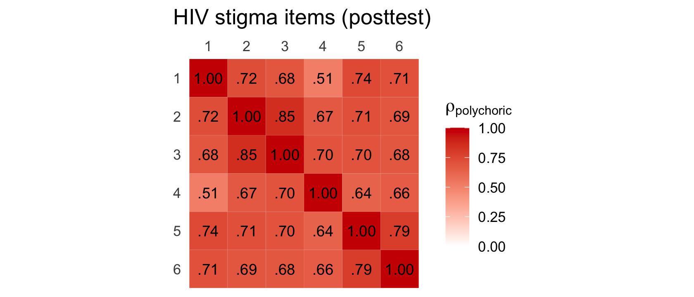
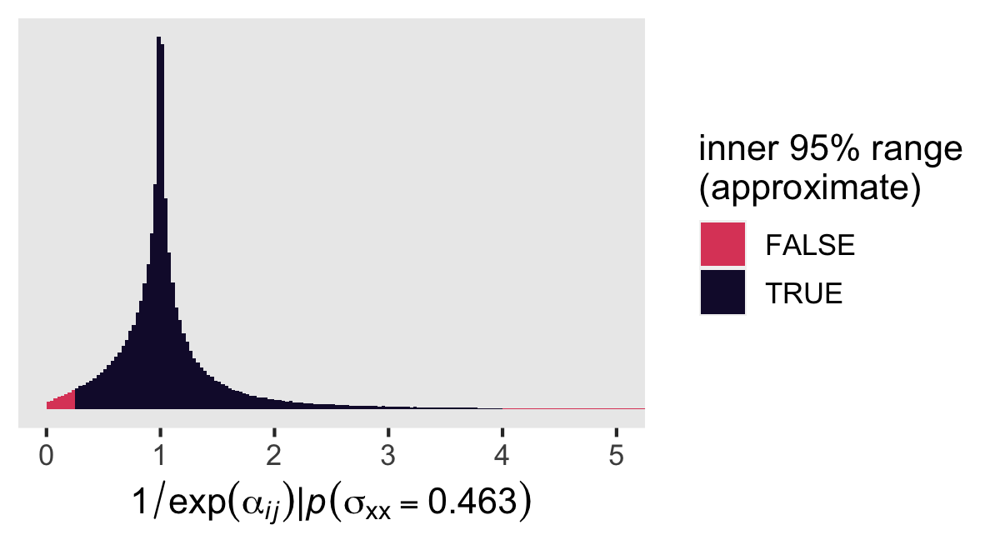
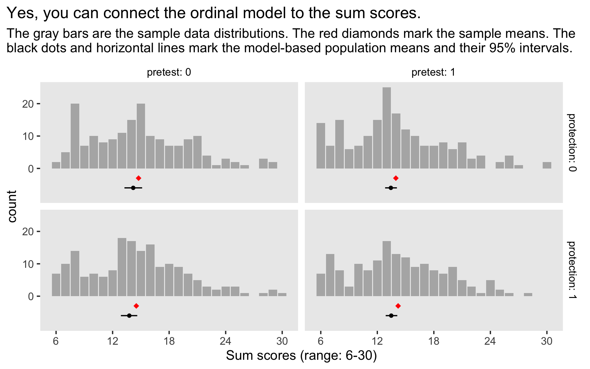

Coyne et al (2022)
================
A Solomon Kurz
2022-08-01

Load our primary packages.

``` r
library(tidyverse)
library(brms)
library(tidybayes)
```

## HIV stigma

In an online study aimed at reducing HIV stigma, Coyne et al (2022;
<https://doi.org/10.1007/s10461-022-03710-9>) used a

group design to compare the effective of two kinds of messages about
viral load, and the extent to which the difference between the messages
depended on pretesting. Whereas a typical Solomon four-group design
would compare an active experimental condition with a control condition,
you might describe Coyne et al as following a modified Solomon
four-group design, given that neither of their messaging conditions are
inert control conditions. Regardless, we can still use the basic Solomon
four-group methodology to get a sense of how much pretesting influences
the comparison between to two kinds of messages.

The authors provided their raw data files and scripts on the OSF at
<https://osf.io/rbq7a/>. Here we load the data.

``` r
# load
coyne2022 <- haven::read_sav(file = "data/Awareness understanding and HIV stigma data.sav") %>% 
  # remove the first row, which has a participant who reported they were below 18 
  filter(Age >= 18) %>% 
  # add a participant number
  mutate(id = 1:n(),
         # reformat these two variables as factors
         TestGroup    = as_factor(TestGroup),
         MessageGroup = as_factor(MessageGroup)) %>% 
  # move id to the left
  select(id, everything()) %>% 
  # make dummies for the groups
  mutate(pretest    = ifelse(TestGroup == "PretestPosttest", 1, 0),
         protection = ifelse(MessageGroup == "GainFrame", 1, 0))

# what do we have?
glimpse(coyne2022)
```

    ## Rows: 707
    ## Columns: 45
    ## $ id                                 <int> 1, 2, 3, 4, 5, 6, 7, 8, 9, 10, 11, 12, 13, 14, 15, 16, 17, 18, 19, 20, 21, …
    ## $ Consent                            <chr> "Yes", "Yes", "Yes", "Yes", "Yes", "Yes", "Yes", "Yes", "Yes", "Yes", "Yes"…
    ## $ Consent2                           <chr> "Yes", "Yes", "Yes", "Yes", "Yes", "Yes", "Yes", "Yes", "Yes", "Yes", "Yes"…
    ## $ Age                                <dbl> 26, 28, 29, 30, 30, 31, 32, 32, 36, 40, 40, 41, 41, 43, 43, 43, 46, 49, 50,…
    ## $ Gender                             <chr> "Female", "Female", "Male", "Female", "Female", "Male", "Female", "Male", "…
    ## $ Sexuality                          <chr> "Straight/heterosexual", "Straight/heterosexual", "Straight/heterosexual", …
    ## $ EHLS1                              <dbl> 3, 4, 3, 3, 4, 3, 4, 3, 3, 3, 3, 3, 3, 4, 3, 3, 3, 2, 3, 3, 3, 2, 4, 3, 3, …
    ## $ EHLS2                              <dbl> 4, 4, 4, 3, 4, 1, 4, 3, 3, 3, 3, 3, 3, 2, 4, 4, 3, 2, 2, 3, 3, 3, 3, 2, 3, …
    ## $ EHLS3                              <dbl> 3, 2, 3, 2, 4, 2, 4, 2, 3, 3, 3, 3, 3, 2, 3, 2, 2, 2, 3, 2, 3, 2, 2, 2, 2, …
    ## $ EHLS4                              <dbl> 4, 4, 4, 4, 4, 4, 4, 4, 2, 3, 3, 3, 4, 3, 3, 4, 3, 2, 3, 3, 3, 4, 3, 3, 3, …
    ## $ EHLS5                              <dbl> 3, 3, 3, 2, 3, 3, 3, 3, 2, 2, 2, 2, 4, 1, 2, 3, 2, 2, 2, 3, 3, 2, 3, 3, 3, …
    ## $ EHLS6                              <dbl> 3, 4, 3, 2, 3, 2, 4, 3, 3, 3, 2, 3, 4, 3, 3, 3, 3, 2, 3, 4, 3, 3, 4, 3, 3, …
    ## $ EHLS7                              <dbl> 2, 2, 3, 2, 2, 1, 2, 2, 1, 3, 1, 3, 2, 1, 2, 1, 2, 1, 2, 2, 2, 2, 2, 2, 2, …
    ## $ EHLS8                              <dbl> 2, 3, 3, 2, 1, 2, 3, 3, 3, 3, 3, 2, 3, 2, 3, 2, 2, 2, 2, 2, 2, 2, 2, 3, 2, …
    ## $ EHLS9                              <dbl> 3, 2, 4, 3, 3, 4, 4, 4, 4, 4, 3, 2, 4, 3, 3, 3, 3, 3, 3, 3, 3, 3, 3, 3, 3, …
    ## $ EHLS10                             <dbl> 3, 3, 4, 3, 3, 3, 4, 2, 2, 4, 2, 2, 4, 2, 3, 2, 2, 2, 4, 2, 3, 4, 4, 2, 3, …
    ## $ EHLS11                             <dbl> 3, 3, 4, 2, 2, 3, 3, 3, 2, 3, 3, 3, 3, 1, 3, 2, 2, 3, 4, 3, 3, 3, 3, 2, 2, …
    ## $ EHLS12                             <dbl> 3, 3, 3, 3, 3, 3, 3, 3, 2, 3, 3, 3, 4, 2, 3, 1, 3, 2, 3, 3, 3, 3, 4, 2, 2, …
    ## $ StigmaPretest1                     <dbl> 2, NA, 2, NA, NA, NA, NA, NA, 2, NA, 2, 3, 3, NA, NA, NA, NA, NA, NA, NA, 2…
    ## $ StigmaPretest2                     <dbl> 5, NA, 4, NA, NA, NA, NA, NA, 4, NA, 3, 4, 4, NA, NA, NA, NA, NA, NA, NA, 2…
    ## $ StigmaPretest3                     <dbl> 5, NA, 4, NA, NA, NA, NA, NA, 3, NA, 3, 4, 4, NA, NA, NA, NA, NA, NA, NA, 2…
    ## $ StigmaPretest4                     <dbl> 5, NA, 5, NA, NA, NA, NA, NA, 5, NA, 5, 5, 5, NA, NA, NA, NA, NA, NA, NA, 5…
    ## $ StigmaPretest5                     <dbl> 3, NA, 2, NA, NA, NA, NA, NA, 2, NA, 2, 4, 5, NA, NA, NA, NA, NA, NA, NA, 2…
    ## $ StigmaPretest6                     <dbl> 3, NA, 2, NA, NA, NA, NA, NA, 2, NA, 2, 4, 3, NA, NA, NA, NA, NA, NA, NA, 4…
    ## $ StigmaPosttest1                    <dbl> 2, 2, 2, 1, 2, 1, 2, 2, 2, 2, 2, 3, 2, 2, 2, 2, 3, 2, 2, 1, 2, 1, 2, 3, 2, …
    ## $ StigmaPosttest2                    <dbl> 5, 2, 4, 1, 2, 2, 5, 3, 3, 2, 3, 4, 2, 2, 2, 5, 2, 3, 3, 1, 2, 1, 4, 3, 3, …
    ## $ StigmaPosttest3                    <dbl> 5, 3, 4, 1, 2, 2, 5, 3, 3, 2, 3, 4, 2, 2, 2, 5, 2, 3, 3, 1, 2, 1, 3, 3, 3, …
    ## $ StigmaPosttest4                    <dbl> 5, 4, 5, 3, 5, 5, 5, 4, 5, 3, 4, 4, 1, 5, 3, 5, 4, 3, 3, 2, 5, 4, 5, 4, 4, …
    ## $ StigmaPosttest5                    <dbl> 3, 2, 2, 1, 5, 2, 2, 1, 2, 2, 2, 4, 2, 2, 1, 1, 2, 2, 3, 1, 2, 1, 5, 3, 4, …
    ## $ StigmaPosttest6                    <dbl> 4, 2, 2, 2, 5, 1, 1, 2, 2, 2, 2, 4, 2, 4, 2, 1, 3, 2, 2, 1, 3, 2, 5, 3, 4, …
    ## $ PerceivedAccuracy                  <chr> "1", "1", "1", "1", "1", "6", "4", "2", "2", "1", "1", "3", "I don't know w…
    ## $ Understanding                      <chr> "1", "1", "1", "1", "1", "1", "1", "1", "1", "1", "1", "1", "1", "1", "1", …
    ## $ Familiarity                        <chr> "Never", "Never", "Never", "Never", "Never", "Never", "Never", "Never", "Ne…
    ## $ TestingFrequency                   <chr> "6-12 months ago", "More than one year ago", "I have never completed a HIV …
    ## $ SocialContactsTesting              <chr> "I do not know anybody", "One or two people", "I do not know anybody", "I d…
    ## $ PriorAwareness                     <chr> "I don't understand this", "I didn't know this already", "I didn't know thi…
    ## $ TestGroup                          <fct> PretestPosttest, Posttestonly, PretestPosttest, Posttestonly, Posttestonly,…
    ## $ MessageGroup                       <fct> GainFrame, LossFrame, GainFrame, GainFrame, GainFrame, LossFrame, GainFrame…
    ## $ PerceivedAccuracyKnowledgeofSlogan <dbl> 1, 1, 1, 1, 1, 6, 4, 2, 2, 1, 1, 3, NA, 6, 3, 1, 1, 3, 7, 4, 1, 4, 2, 3, 2,…
    ## $ HealthLiteracyTotal                <dbl> 36, 37, 41, 31, 36, 31, 42, 35, 30, 37, 31, 32, 41, 26, 35, 30, 30, 25, 34,…
    ## $ StigmaPretestTotal                 <dbl> 23, NA, 19, NA, NA, NA, NA, NA, 18, NA, 17, 24, 24, NA, NA, NA, NA, NA, NA,…
    ## $ StigmaPosttestTotal                <dbl> 24, 15, 19, 9, 21, 13, 20, 15, 17, 13, 16, 23, 11, 17, 12, 19, 16, 15, 16, …
    ## $ UnderstandingKnowledgeofUVL        <dbl> 1, 1, 1, 1, 1, 1, 1, 1, 1, 1, 1, 1, 1, 1, 1, 1, 1, 1, 1, 1, 1, 1, 1, 1, 1, …
    ## $ pretest                            <dbl> 1, 0, 1, 0, 0, 0, 0, 0, 1, 0, 1, 1, 1, 0, 0, 0, 0, 0, 0, 0, 1, 1, 0, 1, 1, …
    ## $ protection                         <dbl> 1, 0, 1, 1, 1, 0, 1, 1, 1, 0, 1, 0, 1, 1, 0, 0, 1, 1, 0, 1, 1, 1, 1, 1, 0, …

The `coyne2022` data are in the wide format where the data from each
participant is found in a single row. The primary substantive
independent variable of interest is `MessageGroup`, which indicates
whether each person saw:

-   a *gain*-framed message (`GainFrame`, a protection-framed message
    emphasizing the protective benefits of an undetectable viral load),
-   or a *risk*-framed message (`LossFrame`, risk-framed message
    emphasizing the reduction in transmission risk afforded by an
    undetectable viral load).

The primary methodological independent variable of interest is
`TestGroup`, which indicates whether each person was

-   assessed at posttest only (`Posttestonly`) or
-   at both pretest and posttest (`PretestPosttest`).

The primary dependent variable is `StigmaPosttestTotal`, which is a
summary score of six 5-point Likert-type items, `StigmaPosttest1`
through `StigmaPosttest6`. When this variable was assessed at the
pretest period, it is saved in the data as `StigmaPretestTotal`, which
is a summary score of the similarly named items `StigmaPretest1` through
`StigmaPretest1`.

For our purposes, we’ll want the data in two additional formats. First,
we’ll want a subsetted version of the data that is long with respect to
the six variables `StigmaPosttest1` through `StigmaPosttest6`. We’ll
call that version `coyne2022_long`.

``` r
coyne2022_long <- coyne2022 %>% 
  select(id, TestGroup, MessageGroup, pretest, protection, StigmaPosttest1:StigmaPosttest6) %>% 
  pivot_longer(StigmaPosttest1:StigmaPosttest6) %>% 
  # reformat the item numbers and Likert-type responses
  mutate(item   = str_extract(name, "\\d") %>% as.factor(),
         likert = factor(value, ordered = TRUE)) %>% 
  select(-name, -value)

# what?
glimpse(coyne2022_long)
```

    ## Rows: 4,242
    ## Columns: 7
    ## $ id           <int> 1, 1, 1, 1, 1, 1, 2, 2, 2, 2, 2, 2, 3, 3, 3, 3, 3, 3, 4, 4, 4, 4, 4, 4, 5, 5, 5, 5, 5, 5, 6, 6, 6…
    ## $ TestGroup    <fct> PretestPosttest, PretestPosttest, PretestPosttest, PretestPosttest, PretestPosttest, PretestPostt…
    ## $ MessageGroup <fct> GainFrame, GainFrame, GainFrame, GainFrame, GainFrame, GainFrame, LossFrame, LossFrame, LossFrame…
    ## $ pretest      <dbl> 1, 1, 1, 1, 1, 1, 0, 0, 0, 0, 0, 0, 1, 1, 1, 1, 1, 1, 0, 0, 0, 0, 0, 0, 0, 0, 0, 0, 0, 0, 0, 0, 0…
    ## $ protection   <dbl> 1, 1, 1, 1, 1, 1, 0, 0, 0, 0, 0, 0, 1, 1, 1, 1, 1, 1, 1, 1, 1, 1, 1, 1, 1, 1, 1, 1, 1, 1, 0, 0, 0…
    ## $ item         <fct> 1, 2, 3, 4, 5, 6, 1, 2, 3, 4, 5, 6, 1, 2, 3, 4, 5, 6, 1, 2, 3, 4, 5, 6, 1, 2, 3, 4, 5, 6, 1, 2, 3…
    ## $ likert       <ord> 2, 5, 5, 5, 3, 4, 2, 2, 3, 4, 2, 2, 2, 4, 4, 5, 2, 2, 1, 1, 1, 3, 1, 2, 2, 2, 2, 5, 5, 5, 1, 2, 2…

We’ll also want a second long-formatted version of the data. But this
version will be long with respect to the 6 stigma items and with respect
to the two measurement occasions. We’ll call this version
`coyne2022_long_long`.

``` r
coyne2022_long_long <- coyne2022 %>% 
  select(id, TestGroup, MessageGroup, StigmaPretest1:StigmaPretest6, StigmaPosttest1:StigmaPosttest6) %>% 
  pivot_longer(contains("Stigma")) %>% 
  # make dummies for the groups
  mutate(pretest    = ifelse(TestGroup == "PretestPosttest", 1, 0),
         protection = ifelse(MessageGroup == "GainFrame", 1, 0)) %>% 
  # reformat the item numbers and Likert-type responses
  mutate(item   = str_extract(name, "\\d") %>% as.factor(),
         likert = factor(value, ordered = TRUE)) %>% 
  # add a time variable
  mutate(time = ifelse(str_detect(name, "Pretest"), 0, 1)) %>% 
  select(-name, -value) %>% 
  filter(!(pretest == 0 & time == 0))

# what?
glimpse(coyne2022_long_long)
```

    ## Rows: 6,360
    ## Columns: 8
    ## $ id           <int> 1, 1, 1, 1, 1, 1, 1, 1, 1, 1, 1, 1, 2, 2, 2, 2, 2, 2, 3, 3, 3, 3, 3, 3, 3, 3, 3, 3, 3, 3, 4, 4, 4…
    ## $ TestGroup    <fct> PretestPosttest, PretestPosttest, PretestPosttest, PretestPosttest, PretestPosttest, PretestPostt…
    ## $ MessageGroup <fct> GainFrame, GainFrame, GainFrame, GainFrame, GainFrame, GainFrame, GainFrame, GainFrame, GainFrame…
    ## $ pretest      <dbl> 1, 1, 1, 1, 1, 1, 1, 1, 1, 1, 1, 1, 0, 0, 0, 0, 0, 0, 1, 1, 1, 1, 1, 1, 1, 1, 1, 1, 1, 1, 0, 0, 0…
    ## $ protection   <dbl> 1, 1, 1, 1, 1, 1, 1, 1, 1, 1, 1, 1, 0, 0, 0, 0, 0, 0, 1, 1, 1, 1, 1, 1, 1, 1, 1, 1, 1, 1, 1, 1, 1…
    ## $ item         <fct> 1, 2, 3, 4, 5, 6, 1, 2, 3, 4, 5, 6, 1, 2, 3, 4, 5, 6, 1, 2, 3, 4, 5, 6, 1, 2, 3, 4, 5, 6, 1, 2, 3…
    ## $ likert       <ord> 2, 5, 5, 5, 3, 3, 2, 5, 5, 5, 3, 4, 2, 2, 3, 4, 2, 2, 2, 4, 4, 5, 2, 2, 2, 4, 4, 5, 2, 2, 1, 1, 1…
    ## $ time         <dbl> 0, 0, 0, 0, 0, 0, 1, 1, 1, 1, 1, 1, 1, 1, 1, 1, 1, 1, 0, 0, 0, 0, 0, 0, 1, 1, 1, 1, 1, 1, 1, 1, 1…

Note how in both long-formatted versions of the data, we’ve saved the
dependent variable `likert` as an ordered factor.

## EDA

### Sample statistics.

Here are the sample statistics for the pre- and post-intervention sum
scores of the 6 items, by the

groups.

``` r
coyne2022 %>% 
  pivot_longer(contains("testTotal"), values_to = "sum_score") %>% 
  mutate(test = ifelse(name == "StigmaPretestTotal", "pretest", "posttest")) %>% 
  mutate(test = factor(test, levels = c("pretest", "posttest"))) %>% 
  mutate(pretest    = ifelse(TestGroup == "PretestPosttest", 1, 0),
         protection = ifelse(MessageGroup == "GainFrame", 1, 0)) %>% 
  group_by(test, pretest, protection, TestGroup, MessageGroup) %>% 
  summarise(n = n(),
            m = mean(sum_score, na.rm = T),
            s = sd(sum_score, na.rm = T),
            min = min(sum_score, na.rm = T),
            max = max(sum_score, na.rm = T)) %>% 
  mutate_if(is.double, round, digits = 2)
```

    ## # A tibble: 8 × 10
    ## # Groups:   test, pretest, protection, TestGroup [8]
    ##   test     pretest protection TestGroup       MessageGroup     n     m     s   min   max
    ##   <fct>      <dbl>      <dbl> <fct>           <fct>        <int> <dbl> <dbl> <dbl> <dbl>
    ## 1 pretest        0          0 Posttestonly    LossFrame      175 NaN   NA      Inf  -Inf
    ## 2 pretest        0          1 Posttestonly    GainFrame      179 NaN   NA      Inf  -Inf
    ## 3 pretest        1          0 PretestPosttest LossFrame      190  15.1  5.28     6    30
    ## 4 pretest        1          1 PretestPosttest GainFrame      163  15.4  5.5      6    30
    ## 5 posttest       0          0 Posttestonly    LossFrame      175  14.8  5.23     6    29
    ## 6 posttest       0          1 Posttestonly    GainFrame      179  14.5  5.23     6    30
    ## 7 posttest       1          0 PretestPosttest LossFrame      190  14.0  5.28     6    30
    ## 8 posttest       1          1 PretestPosttest GainFrame      163  14.2  5.03     6    28

If it isn’t clear from the output, the sum scores are completely
missing, by design, for the conditions in the first two rows. Note the
different ways the summary statistic functions handle complete
missingness.

To foreshadow, we might also want the sample statistics for the items
themselves. Given they’re 5-point Likert-type ratings, we’ll also
provide the mode.

``` r
coyne2022_long_long %>% 
  mutate(likert = as.double(likert)) %>% 
  group_by(time, item, pretest, protection, TestGroup, MessageGroup) %>% 
  summarise(n = n(),
            m = mean(likert, na.rm = T),
            mode = Mode(likert, na.rm = T),
            s = sd(likert, na.rm = T),
            min = min(likert, na.rm = T),
            max = max(likert, na.rm = T)) %>% 
  mutate_if(is.double, round, digits = 2)
```

    ## # A tibble: 36 × 12
    ## # Groups:   time, item, pretest, protection, TestGroup [36]
    ##     time item  pretest protection TestGroup       MessageGroup     n     m  mode     s   min   max
    ##    <dbl> <fct>   <dbl>      <dbl> <fct>           <fct>        <int> <dbl> <dbl> <dbl> <dbl> <dbl>
    ##  1     0 1           1          0 PretestPosttest LossFrame      190  1.83     2  0.88     1     5
    ##  2     0 1           1          1 PretestPosttest GainFrame      163  1.83     2  0.8      1     5
    ##  3     0 2           1          0 PretestPosttest LossFrame      190  2.34     2  1.1      1     5
    ##  4     0 2           1          1 PretestPosttest GainFrame      163  2.39     1  1.17     1     5
    ##  5     0 3           1          0 PretestPosttest LossFrame      190  2.52     2  1.18     1     5
    ##  6     0 3           1          1 PretestPosttest GainFrame      163  2.58     3  1.19     1     5
    ##  7     0 4           1          0 PretestPosttest LossFrame      190  3.77     4  1.04     1     5
    ##  8     0 4           1          1 PretestPosttest GainFrame      163  3.82     5  1.17     1     5
    ##  9     0 5           1          0 PretestPosttest LossFrame      190  2.28     2  1.13     1     5
    ## 10     0 5           1          1 PretestPosttest GainFrame      163  2.35     2  1.11     1     5
    ## # … with 26 more rows
    ## # ℹ Use `print(n = ...)` to see more rows

### Look at the data.

To get a sense of the overall distributions of the sum scores at
posttest, we’ll make a faceted bar plot.

``` r
# adjust the global plot settings
theme_set(
  theme_gray(base_size = 13) +
    theme(panel.grid = element_blank(),
          plot.title.position = "plot",
          strip.background = element_blank(),
          strip.text = element_text(color = "black"))
)

coyne2022 %>% 
  mutate(TestGroup = as_factor(TestGroup),
         MessageGroup = as_factor(MessageGroup)) %>% 
  
  ggplot(aes(x = StigmaPosttestTotal)) +
  geom_bar() +
  facet_grid(TestGroup ~ MessageGroup)
```


In each panel, those sum-score distributions are multimodal, asymmetric,
display a clear lower limit, and hint at their logical upper limit. To
foreshadow the next section, the conventional Gaussian likelihood is a
poor choice for modeling these data. If the distributions were smoother,
the beta-binomial likelihood might be a good pragmatic option. But given
the oddness of their overall shapes, we might be better off modeling the
data at the item level. Here are what the six item distributions look
like for the posttest assessment, in the four conditions.

``` r
coyne2022_long %>% 
  mutate(group = str_c(MessageGroup, "\n", TestGroup)) %>% 
  
  ggplot(aes(x = likert)) +
  geom_bar() +
  labs(x = "Likert-type rating") + 
  facet_grid(group ~ item, labeller = labeller(item = label_both)) +
  theme(strip.text.y = element_text(angle = 0, hjust = 0))
```


In the paper, Coyne and colleagues indicated these items were adapted
from a larger item pool, and that there were no previous studies on
their basic psychometric characteristics. In addition to the summary
statistics and bar plots, above, a psychometrician might want their
correlation matrix. Given they are ordinal, polychoric correlation
coefficients are a good choice. Here’s the polychoric correlation matrix
in a shaded tile plot.

``` r
p <- coyne2022 %>% 
  select(StigmaPosttest1:StigmaPosttest6) %>% 
  psych::polychoric()

# str(p)

p$rho %>% 
  data.frame() %>% 
  rownames_to_column("row") %>% 
  pivot_longer(-row, names_to = "col") %>% 
  mutate(row = str_extract(row, "\\d"),
         col = str_extract(col, "\\d"),
         label = MOTE::apa(value, decimals = 2, leading = F)) %>% 
  mutate(row = fct_rev(row)) %>% 
  
  ggplot(aes(x = col, y = row)) +
  geom_tile(aes(fill = value),
            color = "grey92", size = 1/50) +
  geom_text(aes(label = label)) +
  scale_fill_gradient(expression(rho[polychoric]), low = "white", high = "red3", limits = 0:1) +
  scale_x_discrete(expand = c(0, 0), position = "top") +
  scale_y_discrete(expand = c(0, 0)) +
  labs(title = "HIV stigma items (posttest)",
       x = NULL,
       y = NULL) +
  coord_equal() +
  theme(axis.ticks = element_blank())
```



To my eye, the correlation estimates are reasonably high. Also note that
as we’ve estimated these correlations while ignoring the experimental
conditions, they’re probably a little lower than if they were from an
equal-sized group who were all in the same experimental condition.

## Models

We’ll explore four models for the Coyne et al data. The first two models
will be cross-sectional in that the dummy variables from the four
experimental conditions will the predictors for the posttest assessment.
The second models will be longitudinal in that we’ll take the multilevel
approach for modeling the pretest and posttest assessments, which will
add time to the list of predictor variables. In addition, both the
cross-sectional and longitudinal models will contain either just a
conventional

model, or a model for the discrimination parameter in addition to the

model.

### Cross-sectional.

For our first model, we can think of the `likert` values as varying
across

persons and

items. We further describe the `likert` values as having

response options, given they are from questions which used a 1-to-5
Likert-type scale. With the cumulative probit model, you can model the
relative probability of each ordinal category as

 = \Phi(\tau_k) - \Phi(\tau_{k - 1}),")

where

is the

threshold,

is a shorthand for the set of 4 thresholds
,
and

is the cumulative standard normal distribution. As our goal is to
examine meaningful differences in the mean and variances of the `likert`
values across the

persons, and

items in the data, we will expand the above equation to

![p(\\text{likert} = k \| \\{ \\tau_k \\}, \\mu, \\alpha) = \\Phi(\\alpha\[\\tau_k - \\mu\]) - \\Phi(\\alpha\[\\tau\_{k - 1} - \\mu\]),](https://latex.codecogs.com/png.image?%5Cdpi%7B110%7D&space;%5Cbg_white&space;p%28%5Ctext%7Blikert%7D%20%3D%20k%20%7C%20%5C%7B%20%5Ctau_k%20%5C%7D%2C%20%5Cmu%2C%20%5Calpha%29%20%3D%20%5CPhi%28%5Calpha%5B%5Ctau_k%20-%20%5Cmu%5D%29%20-%20%5CPhi%28%5Calpha%5B%5Ctau_%7Bk%20-%201%7D%20-%20%5Cmu%5D%29%2C "p(\text{likert} = k | \{ \tau_k \}, \mu, \alpha) = \Phi(\alpha[\tau_k - \mu]) - \Phi(\alpha[\tau_{k - 1} - \mu]),")

where

is the mean of the cumulative normal distribution and

is the *discrimination* parameter, which is the reciprocal of the
standard deviation of the cumulative normal distribution, such that
.
In the empty model,

and

for identification purposes and if you substitute those values into the
equation, above, you’ll see the terms on the right-side of the equation
drop out and you end up with the simplified version of the equation from
earlier.

With this parameterization, we can analyze our experimental data with
the model

![
\\begin{align\*}
p(\\text{likert} = k \| \\{ \\tau_k \\}, \\mu\_{ij}, \\alpha = 1) & = \\Phi(\\alpha\[\\tau\_{jk} - \\mu\_{ij}\]) - \\Phi(\\alpha\[\\tau\_{jk - 1} - \\mu\_{ij}\]) \\\\
\\mu\_{ij} & = 0 + \\beta_1 \\text{protection}\_{ij} + \\beta_2 \\text{pretest}\_{ij} + \\beta_3 \\text{protection}\_{ij} \\text{pretest}\_{ij} \\\\
& \\;\\;\\; + \\left \[ u\_{0i} \\right \] + \\left \[v\_{0j} + v\_{1j} \\text{protection}\_{ij} + v\_{2j} \\text{pretest}\_{ij} + v\_{3j} \\text{protection}\_{ij} \\text{pretest}\_{ij} \\right \] \\\\ 
u\_{0i} & \\sim \\mathcal N(0, \\sigma\_{0u}) \\\\
\\begin{bmatrix} v\_{0j} \\\\ v\_{1j} \\\\ v\_{2j} \\\\ v\_{3j} \\end{bmatrix} & \\sim \\mathcal N(\\mathbf 0, \\mathbf{SRS}) \\\\
\\mathbf S & = \\begin{bmatrix} 
  \\sigma\_{0v} \\\\ 
  0 & \\sigma\_{1v} \\\\ 
  0 & 0 & \\sigma\_{2v} \\\\ 
  0 & 0 & 0 & \\sigma\_{3v} \\end{bmatrix} \\\\
\\mathbf R & = \\begin{bmatrix} 
  1 \\\\ 
  \\rho\_{10} & 1 \\\\ 
  \\rho\_{20} & \\rho\_{21} & 1 \\\\ 
  \\rho\_{30} & \\rho\_{31} & \\rho\_{32} & 1 \\end{bmatrix},
\\end{align\*}
](https://latex.codecogs.com/png.image?%5Cdpi%7B110%7D&space;%5Cbg_white&space;%0A%5Cbegin%7Balign%2A%7D%0Ap%28%5Ctext%7Blikert%7D%20%3D%20k%20%7C%20%5C%7B%20%5Ctau_k%20%5C%7D%2C%20%5Cmu_%7Bij%7D%2C%20%5Calpha%20%3D%201%29%20%26%20%3D%20%5CPhi%28%5Calpha%5B%5Ctau_%7Bjk%7D%20-%20%5Cmu_%7Bij%7D%5D%29%20-%20%5CPhi%28%5Calpha%5B%5Ctau_%7Bjk%20-%201%7D%20-%20%5Cmu_%7Bij%7D%5D%29%20%5C%5C%0A%5Cmu_%7Bij%7D%20%26%20%3D%200%20%2B%20%5Cbeta_1%20%5Ctext%7Bprotection%7D_%7Bij%7D%20%2B%20%5Cbeta_2%20%5Ctext%7Bpretest%7D_%7Bij%7D%20%2B%20%5Cbeta_3%20%5Ctext%7Bprotection%7D_%7Bij%7D%20%5Ctext%7Bpretest%7D_%7Bij%7D%20%5C%5C%0A%26%20%5C%3B%5C%3B%5C%3B%20%2B%20%5Cleft%20%5B%20u_%7B0i%7D%20%5Cright%20%5D%20%2B%20%5Cleft%20%5Bv_%7B0j%7D%20%2B%20v_%7B1j%7D%20%5Ctext%7Bprotection%7D_%7Bij%7D%20%2B%20v_%7B2j%7D%20%5Ctext%7Bpretest%7D_%7Bij%7D%20%2B%20v_%7B3j%7D%20%5Ctext%7Bprotection%7D_%7Bij%7D%20%5Ctext%7Bpretest%7D_%7Bij%7D%20%5Cright%20%5D%20%5C%5C%20%0Au_%7B0i%7D%20%26%20%5Csim%20%5Cmathcal%20N%280%2C%20%5Csigma_%7B0u%7D%29%20%5C%5C%0A%5Cbegin%7Bbmatrix%7D%20v_%7B0j%7D%20%5C%5C%20v_%7B1j%7D%20%5C%5C%20v_%7B2j%7D%20%5C%5C%20v_%7B3j%7D%20%5Cend%7Bbmatrix%7D%20%26%20%5Csim%20%5Cmathcal%20N%28%5Cmathbf%200%2C%20%5Cmathbf%7BSRS%7D%29%20%5C%5C%0A%5Cmathbf%20S%20%26%20%3D%20%5Cbegin%7Bbmatrix%7D%20%0A%20%20%5Csigma_%7B0v%7D%20%5C%5C%20%0A%20%200%20%26%20%5Csigma_%7B1v%7D%20%5C%5C%20%0A%20%200%20%26%200%20%26%20%5Csigma_%7B2v%7D%20%5C%5C%20%0A%20%200%20%26%200%20%26%200%20%26%20%5Csigma_%7B3v%7D%20%5Cend%7Bbmatrix%7D%20%5C%5C%0A%5Cmathbf%20R%20%26%20%3D%20%5Cbegin%7Bbmatrix%7D%20%0A%20%201%20%5C%5C%20%0A%20%20%5Crho_%7B10%7D%20%26%201%20%5C%5C%20%0A%20%20%5Crho_%7B20%7D%20%26%20%5Crho_%7B21%7D%20%26%201%20%5C%5C%20%0A%20%20%5Crho_%7B30%7D%20%26%20%5Crho_%7B31%7D%20%26%20%5Crho_%7B32%7D%20%26%201%20%5Cend%7Bbmatrix%7D%2C%0A%5Cend%7Balign%2A%7D%0A "
\begin{align*}
p(\text{likert} = k | \{ \tau_k \}, \mu_{ij}, \alpha = 1) & = \Phi(\alpha[\tau_{jk} - \mu_{ij}]) - \Phi(\alpha[\tau_{jk - 1} - \mu_{ij}]) \\
\mu_{ij} & = 0 + \beta_1 \text{protection}_{ij} + \beta_2 \text{pretest}_{ij} + \beta_3 \text{protection}_{ij} \text{pretest}_{ij} \\
& \;\;\; + \left [ u_{0i} \right ] + \left [v_{0j} + v_{1j} \text{protection}_{ij} + v_{2j} \text{pretest}_{ij} + v_{3j} \text{protection}_{ij} \text{pretest}_{ij} \right ] \\ 
u_{0i} & \sim \mathcal N(0, \sigma_{0u}) \\
\begin{bmatrix} v_{0j} \\ v_{1j} \\ v_{2j} \\ v_{3j} \end{bmatrix} & \sim \mathcal N(\mathbf 0, \mathbf{SRS}) \\
\mathbf S & = \begin{bmatrix} 
  \sigma_{0v} \\ 
  0 & \sigma_{1v} \\ 
  0 & 0 & \sigma_{2v} \\ 
  0 & 0 & 0 & \sigma_{3v} \end{bmatrix} \\
\mathbf R & = \begin{bmatrix} 
  1 \\ 
  \rho_{10} & 1 \\ 
  \rho_{20} & \rho_{21} & 1 \\ 
  \rho_{30} & \rho_{31} & \rho_{32} & 1 \end{bmatrix},
\end{align*}
")

with priors

 \\
\tau_{j2} & \sim \mathcal N(-0.2533471, 1) \\
\tau_{j3} & \sim \mathcal N( 0.2533471, 1) \\
\tau_{j4} & \sim \mathcal N( 0.8416212, 1) \\
\beta_1, \dots, \beta_3 & \sim \mathcal N(0, 1) \\ 
\sigma_{0u}, \dots, \sigma_{3v} & \sim \operatorname{Exponential}(1) \\
\mathbf R & \sim \operatorname{LKJ}(1),
\end{align*}
")

where
,
which stands for the grand mean, on the latent probit scale, for the
reference group who received the risk-framed message and did not receive
a pretest assessment.

is the deviation in the grand mean for those who received the
protection-frame message, but without a pretest, relative to the
reference group.

is the deviation in the grand mean for those who received the risk-frame
message and had a pretest, relative to the reference group. The focal
parameter is

is the interaction between the message-frame and pretest dummy
variables. You could describe

as a difference in differences which answers the question: *To what
extent does the difference in the message-frame conditions differ based
on whether participants complete a pretest?*.

Although

is fixed to zero, the

and

deviation parameters allow it to vary across

persons and

items. Because each person in the study only participated in one of the
four conditions, the parameters

through

are only allowed to vary across the

items. Note also that the

subscripts are meant to indicate the

threshold parameters vary across the six items.

As to priors,

through

all have the
")
prior, which should be weakly regularizing on the probit scale. In a
similar way, the
")
prior will mildly bias all level-2

parameters toward the unit scale. Within the context of a


matrix, setting

within the LKJ prior will weakly regularize the level-2 correlations off
the boundaries. Given there is no prior work on the psychometric
properties of the six Likert-type items, the priors for the

thresholds are set to convey a default null assumption that all five
response options are equally likely. Using the same basic strategy we
used in the [Wagenmakers et al (2016, Albohn only)
sketch](https://github.com/ASKurz/Experimental-design-and-the-GLMM/blob/main/sketches/Wagenmakers-et-al--2016--Albohn-only.md#conventional-multilevel-ordinal-model),
here’s how to convert those null proportions into cumulative
proportions, which are then mapped onto the probit scale.

``` r
tibble(rating = 1:5) %>% 
  mutate(proportion = 1/5) %>% 
  mutate(cumulative_proportion = cumsum(proportion)) %>% 
  mutate(right_hand_threshold = qnorm(cumulative_proportion))
```

    ## # A tibble: 5 × 4
    ##   rating proportion cumulative_proportion right_hand_threshold
    ##    <int>      <dbl>                 <dbl>                <dbl>
    ## 1      1        0.2                   0.2               -0.842
    ## 2      2        0.2                   0.4               -0.253
    ## 3      3        0.2                   0.6                0.253
    ## 4      4        0.2                   0.8                0.842
    ## 5      5        0.2                   1                Inf

Here’s how to fit the model with `brm()`. Note how by setting
`thres(gr = item)` on the left-hand side of the model `formula`, we have
allowed the

thresholds to vary across the

items.

``` r
# 10.75303 mins
fit1 <- brm(
  data = coyne2022_long,
  family = cumulative(probit),
  likert | thres(gr = item) ~ 1 + protection + pretest + protection:pretest + (1 | id) + (1 + protection + pretest + protection:pretest | item),
  prior = c(prior(normal(-0.8416212, 1), class = Intercept, coef = 1, group = 1),
            prior(normal(-0.2533471, 1), class = Intercept, coef = 2, group = 1),
            prior(normal( 0.2533471, 1), class = Intercept, coef = 3, group = 1),
            prior(normal( 0.8416212, 1), class = Intercept, coef = 4, group = 1),
            
            prior(normal(-0.8416212, 1), class = Intercept, coef = 1, group = 2),
            prior(normal(-0.2533471, 1), class = Intercept, coef = 2, group = 2),
            prior(normal( 0.2533471, 1), class = Intercept, coef = 3, group = 2),
            prior(normal( 0.8416212, 1), class = Intercept, coef = 4, group = 2),
            
            prior(normal(-0.8416212, 1), class = Intercept, coef = 1, group = 3),
            prior(normal(-0.2533471, 1), class = Intercept, coef = 2, group = 3),
            prior(normal( 0.2533471, 1), class = Intercept, coef = 3, group = 3),
            prior(normal( 0.8416212, 1), class = Intercept, coef = 4, group = 3),
            
            prior(normal(-0.8416212, 1), class = Intercept, coef = 1, group = 4),
            prior(normal(-0.2533471, 1), class = Intercept, coef = 2, group = 4),
            prior(normal( 0.2533471, 1), class = Intercept, coef = 3, group = 4),
            prior(normal( 0.8416212, 1), class = Intercept, coef = 4, group = 4),
            
            prior(normal(-0.8416212, 1), class = Intercept, coef = 1, group = 5),
            prior(normal(-0.2533471, 1), class = Intercept, coef = 2, group = 5),
            prior(normal( 0.2533471, 1), class = Intercept, coef = 3, group = 5),
            prior(normal( 0.8416212, 1), class = Intercept, coef = 4, group = 5),
            
            prior(normal(-0.8416212, 1), class = Intercept, coef = 1, group = 6),
            prior(normal(-0.2533471, 1), class = Intercept, coef = 2, group = 6),
            prior(normal( 0.2533471, 1), class = Intercept, coef = 3, group = 6),
            prior(normal( 0.8416212, 1), class = Intercept, coef = 4, group = 6),
            
            prior(normal(0, 1), class = b),
            prior(exponential(1), class = sd),
            
            prior(lkj(1), class = cor)),
  cores = 4,
  seed = 1,
  init_r = 0.2,
  file = "fits/fit1.coyne2022"
)
```

The second version of the model is a straight generalization of the
first. Here we take a distributional ordered-probit approach to allow
the

discrimination parameters to vary across

persons and

items with the model

![
\\begin{align\*}
p(\\text{likert} = k \| \\{ \\tau_k \\}, \\mu\_{ij}, \\alpha\_{ij}) & = \\Phi(\\alpha\_{ij}\[\\tau\_{jk} - \\mu\_{ij}\]) - \\Phi(\\alpha\_{ij}\[\\tau\_{jk - 1} - \\mu\_{ij}\]) \\\\
\\mu\_{ij} & = 0 + \\beta_1 \\text{protection}\_{ij} + \\beta_2 \\text{pretest}\_{ij} + \\beta_3 \\text{protection}\_{ij} \\text{pretest}\_{ij} \\\\
& \\;\\;\\; + \\left \[ u\_{0i} \\right \] + \\left \[v\_{0j} + v\_{1j} \\text{protection}\_{ij} + v\_{2j} \\text{pretest}\_{ij} + v\_{3j} \\text{protection}\_{ij} \\text{pretest}\_{ij} \\right \] \\\\ 
\\log(\\alpha\_{ij}) & = 0 + \\eta_1 \\text{protection}\_{ij} + \\eta_2 \\text{pretest}\_{ij} + \\eta_3 \\text{protection}\_{ij} \\text{pretest}\_{ij} \\\\
& \\;\\;\\; + \\left \[ u\_{1i} \\right \] + \\left \[v\_{4j} + v\_{5j} \\text{protection}\_{ij} + v\_{6j} \\text{pretest}\_{ij} + v\_{7j} \\text{protection}\_{ij} \\text{pretest}\_{ij} \\right \] \\\\ 
\\begin{bmatrix} u\_{0i} \\\\ u\_{1i} \\end{bmatrix} & \\sim \\mathcal N(\\mathbf 0, \\mathbf{S_uR_uS_u}) \\\\
\\begin{bmatrix} v\_{0j} \\\\ \\vdots \\\\ v\_{7j} \\end{bmatrix}& \\sim \\mathcal N(\\mathbf 0, \\mathbf{S_vR_vS_v})
\\end{align\*}
](https://latex.codecogs.com/png.image?%5Cdpi%7B110%7D&space;%5Cbg_white&space;%0A%5Cbegin%7Balign%2A%7D%0Ap%28%5Ctext%7Blikert%7D%20%3D%20k%20%7C%20%5C%7B%20%5Ctau_k%20%5C%7D%2C%20%5Cmu_%7Bij%7D%2C%20%5Calpha_%7Bij%7D%29%20%26%20%3D%20%5CPhi%28%5Calpha_%7Bij%7D%5B%5Ctau_%7Bjk%7D%20-%20%5Cmu_%7Bij%7D%5D%29%20-%20%5CPhi%28%5Calpha_%7Bij%7D%5B%5Ctau_%7Bjk%20-%201%7D%20-%20%5Cmu_%7Bij%7D%5D%29%20%5C%5C%0A%5Cmu_%7Bij%7D%20%26%20%3D%200%20%2B%20%5Cbeta_1%20%5Ctext%7Bprotection%7D_%7Bij%7D%20%2B%20%5Cbeta_2%20%5Ctext%7Bpretest%7D_%7Bij%7D%20%2B%20%5Cbeta_3%20%5Ctext%7Bprotection%7D_%7Bij%7D%20%5Ctext%7Bpretest%7D_%7Bij%7D%20%5C%5C%0A%26%20%5C%3B%5C%3B%5C%3B%20%2B%20%5Cleft%20%5B%20u_%7B0i%7D%20%5Cright%20%5D%20%2B%20%5Cleft%20%5Bv_%7B0j%7D%20%2B%20v_%7B1j%7D%20%5Ctext%7Bprotection%7D_%7Bij%7D%20%2B%20v_%7B2j%7D%20%5Ctext%7Bpretest%7D_%7Bij%7D%20%2B%20v_%7B3j%7D%20%5Ctext%7Bprotection%7D_%7Bij%7D%20%5Ctext%7Bpretest%7D_%7Bij%7D%20%5Cright%20%5D%20%5C%5C%20%0A%5Clog%28%5Calpha_%7Bij%7D%29%20%26%20%3D%200%20%2B%20%5Ceta_1%20%5Ctext%7Bprotection%7D_%7Bij%7D%20%2B%20%5Ceta_2%20%5Ctext%7Bpretest%7D_%7Bij%7D%20%2B%20%5Ceta_3%20%5Ctext%7Bprotection%7D_%7Bij%7D%20%5Ctext%7Bpretest%7D_%7Bij%7D%20%5C%5C%0A%26%20%5C%3B%5C%3B%5C%3B%20%2B%20%5Cleft%20%5B%20u_%7B1i%7D%20%5Cright%20%5D%20%2B%20%5Cleft%20%5Bv_%7B4j%7D%20%2B%20v_%7B5j%7D%20%5Ctext%7Bprotection%7D_%7Bij%7D%20%2B%20v_%7B6j%7D%20%5Ctext%7Bpretest%7D_%7Bij%7D%20%2B%20v_%7B7j%7D%20%5Ctext%7Bprotection%7D_%7Bij%7D%20%5Ctext%7Bpretest%7D_%7Bij%7D%20%5Cright%20%5D%20%5C%5C%20%0A%5Cbegin%7Bbmatrix%7D%20u_%7B0i%7D%20%5C%5C%20u_%7B1i%7D%20%5Cend%7Bbmatrix%7D%20%26%20%5Csim%20%5Cmathcal%20N%28%5Cmathbf%200%2C%20%5Cmathbf%7BS_uR_uS_u%7D%29%20%5C%5C%0A%5Cbegin%7Bbmatrix%7D%20v_%7B0j%7D%20%5C%5C%20%5Cvdots%20%5C%5C%20v_%7B7j%7D%20%5Cend%7Bbmatrix%7D%26%20%5Csim%20%5Cmathcal%20N%28%5Cmathbf%200%2C%20%5Cmathbf%7BS_vR_vS_v%7D%29%0A%5Cend%7Balign%2A%7D%0A "
\begin{align*}
p(\text{likert} = k | \{ \tau_k \}, \mu_{ij}, \alpha_{ij}) & = \Phi(\alpha_{ij}[\tau_{jk} - \mu_{ij}]) - \Phi(\alpha_{ij}[\tau_{jk - 1} - \mu_{ij}]) \\
\mu_{ij} & = 0 + \beta_1 \text{protection}_{ij} + \beta_2 \text{pretest}_{ij} + \beta_3 \text{protection}_{ij} \text{pretest}_{ij} \\
& \;\;\; + \left [ u_{0i} \right ] + \left [v_{0j} + v_{1j} \text{protection}_{ij} + v_{2j} \text{pretest}_{ij} + v_{3j} \text{protection}_{ij} \text{pretest}_{ij} \right ] \\ 
\log(\alpha_{ij}) & = 0 + \eta_1 \text{protection}_{ij} + \eta_2 \text{pretest}_{ij} + \eta_3 \text{protection}_{ij} \text{pretest}_{ij} \\
& \;\;\; + \left [ u_{1i} \right ] + \left [v_{4j} + v_{5j} \text{protection}_{ij} + v_{6j} \text{pretest}_{ij} + v_{7j} \text{protection}_{ij} \text{pretest}_{ij} \right ] \\ 
\begin{bmatrix} u_{0i} \\ u_{1i} \end{bmatrix} & \sim \mathcal N(\mathbf 0, \mathbf{S_uR_uS_u}) \\
\begin{bmatrix} v_{0j} \\ \vdots \\ v_{7j} \end{bmatrix}& \sim \mathcal N(\mathbf 0, \mathbf{S_vR_vS_v})
\end{align*}
")

with priors

![
\\begin{align\*}
\\tau\_{j1} & \\sim \\mathcal N(-0.8416212, 1) \\\\
\\tau\_{j2} & \\sim \\mathcal N(-0.2533471, 1) \\\\
\\tau\_{j3} & \\sim \\mathcal N( 0.2533471, 1) \\\\
\\tau\_{j4} & \\sim \\mathcal N( 0.8416212, 1) \\\\
\\beta_1, \\dots, \\beta_3 & \\sim \\mathcal N(0, 1) \\\\ 
\\eta_1, \\dots, \\eta_3 & \\sim \\mathcal N(0, 1) \\\\ 
\\sigma\_{0u}, \\sigma\_{0v}, \\dots, \\sigma\_{3v} & \\sim \\operatorname{Exponential}(1) \\\\
\\sigma\_{1u}, \\sigma\_{4v}, \\dots, \\sigma\_{7v} & \\sim \\operatorname{Exponential}(1 / 0.463) \\\\
\\mathbf{R_u}, \\mathbf{R_v} & \\sim \\operatorname{LKJ}(1),
\\end{align\*}
](https://latex.codecogs.com/png.image?%5Cdpi%7B110%7D&space;%5Cbg_white&space;%0A%5Cbegin%7Balign%2A%7D%0A%5Ctau_%7Bj1%7D%20%26%20%5Csim%20%5Cmathcal%20N%28-0.8416212%2C%201%29%20%5C%5C%0A%5Ctau_%7Bj2%7D%20%26%20%5Csim%20%5Cmathcal%20N%28-0.2533471%2C%201%29%20%5C%5C%0A%5Ctau_%7Bj3%7D%20%26%20%5Csim%20%5Cmathcal%20N%28%200.2533471%2C%201%29%20%5C%5C%0A%5Ctau_%7Bj4%7D%20%26%20%5Csim%20%5Cmathcal%20N%28%200.8416212%2C%201%29%20%5C%5C%0A%5Cbeta_1%2C%20%5Cdots%2C%20%5Cbeta_3%20%26%20%5Csim%20%5Cmathcal%20N%280%2C%201%29%20%5C%5C%20%0A%5Ceta_1%2C%20%5Cdots%2C%20%5Ceta_3%20%26%20%5Csim%20%5Cmathcal%20N%280%2C%201%29%20%5C%5C%20%0A%5Csigma_%7B0u%7D%2C%20%5Csigma_%7B0v%7D%2C%20%5Cdots%2C%20%5Csigma_%7B3v%7D%20%26%20%5Csim%20%5Coperatorname%7BExponential%7D%281%29%20%5C%5C%0A%5Csigma_%7B1u%7D%2C%20%5Csigma_%7B4v%7D%2C%20%5Cdots%2C%20%5Csigma_%7B7v%7D%20%26%20%5Csim%20%5Coperatorname%7BExponential%7D%281%20%2F%200.463%29%20%5C%5C%0A%5Cmathbf%7BR_u%7D%2C%20%5Cmathbf%7BR_v%7D%20%26%20%5Csim%20%5Coperatorname%7BLKJ%7D%281%29%2C%0A%5Cend%7Balign%2A%7D%0A "
\begin{align*}
\tau_{j1} & \sim \mathcal N(-0.8416212, 1) \\
\tau_{j2} & \sim \mathcal N(-0.2533471, 1) \\
\tau_{j3} & \sim \mathcal N( 0.2533471, 1) \\
\tau_{j4} & \sim \mathcal N( 0.8416212, 1) \\
\beta_1, \dots, \beta_3 & \sim \mathcal N(0, 1) \\ 
\eta_1, \dots, \eta_3 & \sim \mathcal N(0, 1) \\ 
\sigma_{0u}, \sigma_{0v}, \dots, \sigma_{3v} & \sim \operatorname{Exponential}(1) \\
\sigma_{1u}, \sigma_{4v}, \dots, \sigma_{7v} & \sim \operatorname{Exponential}(1 / 0.463) \\
\mathbf{R_u}, \mathbf{R_v} & \sim \operatorname{LKJ}(1),
\end{align*}
")

where the

parameters in the model for
")
mirror the

parameters in the

model. For the sake of space, I have not explicitly mapped them out, but
now the

and

parameters follow a

variance/covariance matrix and the eight parameters

follow an

variance/covariance matrix.

With respect to priors,
")
is meant to be weakly regularizing on the log space of the

parameters. For the new

parameters, we set the mean of the exponential prior to 0.463. If you
simulate from that prior and transform it into the latent

scale, you’ll see it returns a distribution of

values with a percentile-based 95% interval of about 0.25 to 4. Here’s
what that looks like.

``` r
set.seed(1)

tibble(sd = rexp(n = 5e5, rate = 1 / 0.463)) %>% 
  mutate(sigma = 1 / exp(rnorm(n = n(), mean = 0, sd = sd))) %>% 
  filter(sigma < 10) %>% 
  
  ggplot(aes(x = sigma, fill = sigma > 0.25 & sigma < 4)) +
  geom_histogram(binwidth = 0.03125, boundary = 0) +
  scale_fill_viridis_d("inner 95% range\n(approximate)", option = "A", begin = .1, end = .6, direction = -1) +
  scale_y_continuous(NULL, breaks = NULL) +
  xlab(expression(1/exp(alpha[italic(ij)])*'|'*italic(p)(sigma[xx]==0.463))) +
  coord_cartesian(xlim = c(0, 5))
```



If the latent

for the reference group is fixed to 1 for identification purposes, then
a prior that allows the deviations to range as low as 0.25 (one quarter
of the value) and as high as 4 (four times the value) is pretty
generous. I suspect one could easily justify a stronger prior.

Here’s how to fit the model with `brm()`.

``` r
# 27.88503 mins
fit2 <- brm(
  data = coyne2022_long,
  family = cumulative(probit),
  bf(likert | thres(gr = item) ~ 1 + protection + pretest + protection:pretest + (1 |i| id) + (1 + protection + pretest + protection:pretest |j| item)) +
     lf(disc                   ~ 0 + protection + pretest + protection:pretest + (1 |i| id) + (1 + protection + pretest + protection:pretest |j| item),
        # don't forget this line
        cmc = FALSE),
  prior = c(prior(normal(-0.8416212, 1), class = Intercept, coef = 1, group = 1),
            prior(normal(-0.2533471, 1), class = Intercept, coef = 2, group = 1),
            prior(normal( 0.2533471, 1), class = Intercept, coef = 3, group = 1),
            prior(normal( 0.8416212, 1), class = Intercept, coef = 4, group = 1),
            
            prior(normal(-0.8416212, 1), class = Intercept, coef = 1, group = 2),
            prior(normal(-0.2533471, 1), class = Intercept, coef = 2, group = 2),
            prior(normal( 0.2533471, 1), class = Intercept, coef = 3, group = 2),
            prior(normal( 0.8416212, 1), class = Intercept, coef = 4, group = 2),
            
            prior(normal(-0.8416212, 1), class = Intercept, coef = 1, group = 3),
            prior(normal(-0.2533471, 1), class = Intercept, coef = 2, group = 3),
            prior(normal( 0.2533471, 1), class = Intercept, coef = 3, group = 3),
            prior(normal( 0.8416212, 1), class = Intercept, coef = 4, group = 3),
            
            prior(normal(-0.8416212, 1), class = Intercept, coef = 1, group = 4),
            prior(normal(-0.2533471, 1), class = Intercept, coef = 2, group = 4),
            prior(normal( 0.2533471, 1), class = Intercept, coef = 3, group = 4),
            prior(normal( 0.8416212, 1), class = Intercept, coef = 4, group = 4),
            
            prior(normal(-0.8416212, 1), class = Intercept, coef = 1, group = 5),
            prior(normal(-0.2533471, 1), class = Intercept, coef = 2, group = 5),
            prior(normal( 0.2533471, 1), class = Intercept, coef = 3, group = 5),
            prior(normal( 0.8416212, 1), class = Intercept, coef = 4, group = 5),
            
            prior(normal(-0.8416212, 1), class = Intercept, coef = 1, group = 6),
            prior(normal(-0.2533471, 1), class = Intercept, coef = 2, group = 6),
            prior(normal( 0.2533471, 1), class = Intercept, coef = 3, group = 6),
            prior(normal( 0.8416212, 1), class = Intercept, coef = 4, group = 6),
            
            prior(normal(0, 1), class = b),
            
            prior(exponential(1), class = sd),
            prior(exponential(1 / 0.463), class = sd, dpar = disc),
            
            prior(lkj(1), class = cor)),
  cores = 4,
  seed = 1,
  init_r = 0.2,
  file = "fits/fit2.coyne2022"
)
```

Check the summaries of the two models.

``` r
summary(fit1)
```

    ##  Family: cumulative 
    ##   Links: mu = probit; disc = identity 
    ## Formula: likert | thres(gr = item) ~ 1 + protection + pretest + protection:pretest + (1 | id) + (1 + protection + pretest + protection:pretest | item) 
    ##    Data: coyne2022_long (Number of observations: 4242) 
    ##   Draws: 4 chains, each with iter = 2000; warmup = 1000; thin = 1;
    ##          total post-warmup draws = 4000
    ## 
    ## Group-Level Effects: 
    ## ~id (Number of levels: 707) 
    ##               Estimate Est.Error l-95% CI u-95% CI Rhat Bulk_ESS Tail_ESS
    ## sd(Intercept)     1.57      0.06     1.47     1.69 1.00      867     1614
    ## 
    ## ~item (Number of levels: 6) 
    ##                                    Estimate Est.Error l-95% CI u-95% CI Rhat Bulk_ESS Tail_ESS
    ## sd(Intercept)                          1.33      0.46     0.68     2.43 1.00     1411     2211
    ## sd(protection)                         0.06      0.06     0.00     0.19 1.00     2871     2405
    ## sd(pretest)                            0.23      0.11     0.09     0.50 1.00     2322     2554
    ## sd(protection:pretest)                 0.08      0.08     0.00     0.29 1.00     3001     2039
    ## cor(Intercept,protection)              0.01      0.45    -0.80     0.81 1.00     6825     2897
    ## cor(Intercept,pretest)                -0.50      0.34    -0.95     0.31 1.00     3069     2911
    ## cor(protection,pretest)               -0.00      0.45    -0.82     0.81 1.00     2408     3211
    ## cor(Intercept,protection:pretest)     -0.03      0.45    -0.82     0.80 1.00     6302     2938
    ## cor(protection,protection:pretest)    -0.09      0.46    -0.86     0.80 1.00     4044     3263
    ## cor(pretest,protection:pretest)       -0.07      0.45    -0.83     0.78 1.00     4667     3475
    ## 
    ## Population-Level Effects: 
    ##                    Estimate Est.Error l-95% CI u-95% CI Rhat Bulk_ESS Tail_ESS
    ## Intercept[1,1]        -2.19      0.46    -3.13    -1.28 1.00     4146     3145
    ## Intercept[1,2]         0.12      0.46    -0.81     1.01 1.00     4339     3179
    ## Intercept[1,3]         1.37      0.47     0.41     2.27 1.00     4346     3078
    ## Intercept[1,4]         2.03      0.48     1.08     2.98 1.00     4870     3335
    ## Intercept[2,1]        -2.02      0.45    -2.90    -1.16 1.00     4123     2510
    ## Intercept[2,2]        -0.38      0.45    -1.25     0.49 1.00     4133     2527
    ## Intercept[2,3]         0.77      0.45    -0.10     1.65 1.00     4239     2648
    ## Intercept[2,4]         2.12      0.46     1.23     3.01 1.00     4203     2809
    ## Intercept[3,1]        -1.98      0.45    -2.89    -1.13 1.00     4177     3064
    ## Intercept[3,2]        -0.26      0.45    -1.16     0.60 1.00     4179     3038
    ## Intercept[3,3]         0.86      0.45    -0.04     1.73 1.00     4317     3113
    ## Intercept[3,4]         2.07      0.45     1.17     2.93 1.00     4510     3197
    ## Intercept[4,1]        -2.19      0.46    -3.07    -1.29 1.00     4850     2912
    ## Intercept[4,2]        -1.13      0.46    -1.99    -0.23 1.00     5187     3352
    ## Intercept[4,3]         0.69      0.46    -0.18     1.60 1.00     5190     3294
    ## Intercept[4,4]         1.92      0.46     1.06     2.82 1.00     5180     2981
    ## Intercept[5,1]        -2.21      0.46    -3.13    -1.30 1.00     4156     2869
    ## Intercept[5,2]        -0.11      0.46    -1.04     0.80 1.00     4322     2761
    ## Intercept[5,3]         0.84      0.47    -0.10     1.73 1.00     4370     2819
    ## Intercept[5,4]         1.91      0.47     0.96     2.83 1.00     4673     2875
    ## Intercept[6,1]        -2.05      0.46    -2.95    -1.17 1.00     3775     3078
    ## Intercept[6,2]        -0.22      0.46    -1.10     0.66 1.00     3866     2941
    ## Intercept[6,3]         1.09      0.46     0.21     1.98 1.00     3852     3152
    ## Intercept[6,4]         2.01      0.46     1.13     2.90 1.00     4098     3116
    ## protection            -0.13      0.17    -0.46     0.22 1.01      541     1133
    ## pretest               -0.34      0.19    -0.70     0.04 1.00      708     1230
    ## protection:pretest     0.20      0.24    -0.25     0.68 1.01      562     1198
    ## 
    ## Family Specific Parameters: 
    ##      Estimate Est.Error l-95% CI u-95% CI Rhat Bulk_ESS Tail_ESS
    ## disc     1.00      0.00     1.00     1.00   NA       NA       NA
    ## 
    ## Draws were sampled using sampling(NUTS). For each parameter, Bulk_ESS
    ## and Tail_ESS are effective sample size measures, and Rhat is the potential
    ## scale reduction factor on split chains (at convergence, Rhat = 1).

``` r
summary(fit2)
```

    ##  Family: cumulative 
    ##   Links: mu = probit; disc = log 
    ## Formula: likert | thres(gr = item) ~ 1 + protection + pretest + protection:pretest + (1 | i | id) + (1 + protection + pretest + protection:pretest | j | item) 
    ##          disc ~ 0 + protection + pretest + protection:pretest + (1 | i | id) + (1 + protection + pretest + protection:pretest | j | item)
    ##    Data: coyne2022_long (Number of observations: 4242) 
    ##   Draws: 4 chains, each with iter = 2000; warmup = 1000; thin = 1;
    ##          total post-warmup draws = 4000
    ## 
    ## Group-Level Effects: 
    ## ~id (Number of levels: 707) 
    ##                               Estimate Est.Error l-95% CI u-95% CI Rhat Bulk_ESS Tail_ESS
    ## sd(Intercept)                     1.45      0.16     1.15     1.76 1.01      447      868
    ## sd(disc_Intercept)                0.58      0.04     0.51     0.66 1.00     1287     2264
    ## cor(Intercept,disc_Intercept)    -0.25      0.09    -0.43    -0.06 1.00      946     1703
    ## 
    ## ~item (Number of levels: 6) 
    ##                                                 Estimate Est.Error l-95% CI u-95% CI Rhat Bulk_ESS Tail_ESS
    ## sd(Intercept)                                       1.16      0.43     0.52     2.19 1.00     1235     2014
    ## sd(protection)                                      0.05      0.05     0.00     0.18 1.00     2352     2257
    ## sd(pretest)                                         0.26      0.14     0.10     0.61 1.00     1481     1487
    ## sd(protection:pretest)                              0.06      0.06     0.00     0.21 1.00     2303     2015
    ## sd(disc_Intercept)                                  0.46      0.18     0.22     0.88 1.00      992     1998
    ## sd(disc_protection)                                 0.13      0.10     0.01     0.39 1.00     1343     2198
    ## sd(disc_pretest)                                    0.13      0.11     0.01     0.39 1.00     1704     2143
    ## sd(disc_protection:pretest)                         0.20      0.15     0.01     0.55 1.00     1401     1766
    ## cor(Intercept,protection)                          -0.01      0.33    -0.62     0.63 1.00     4963     2466
    ## cor(Intercept,pretest)                             -0.31      0.29    -0.80     0.32 1.00     2966     2581
    ## cor(protection,pretest)                             0.01      0.34    -0.64     0.63 1.00     2408     3078
    ## cor(Intercept,protection:pretest)                   0.02      0.34    -0.64     0.65 1.00     5734     2504
    ## cor(protection,protection:pretest)                 -0.05      0.34    -0.69     0.60 1.00     4844     3074
    ## cor(pretest,protection:pretest)                    -0.05      0.34    -0.67     0.59 1.00     4354     3022
    ## cor(Intercept,disc_Intercept)                      -0.34      0.26    -0.77     0.22 1.00     2474     2682
    ## cor(protection,disc_Intercept)                     -0.05      0.33    -0.67     0.59 1.00     2302     3358
    ## cor(pretest,disc_Intercept)                         0.15      0.30    -0.45     0.69 1.00     2606     2857
    ## cor(protection:pretest,disc_Intercept)              0.01      0.34    -0.64     0.65 1.00     2190     2979
    ## cor(Intercept,disc_protection)                     -0.09      0.31    -0.69     0.53 1.00     4211     3012
    ## cor(protection,disc_protection)                     0.03      0.33    -0.60     0.65 1.00     3456     3130
    ## cor(pretest,disc_protection)                        0.13      0.32    -0.50     0.71 1.00     3710     3299
    ## cor(protection:pretest,disc_protection)            -0.02      0.33    -0.64     0.61 1.00     2994     3102
    ## cor(disc_Intercept,disc_protection)                -0.05      0.33    -0.65     0.58 1.00     3346     3204
    ## cor(Intercept,disc_pretest)                        -0.05      0.32    -0.68     0.56 1.00     4340     2783
    ## cor(protection,disc_pretest)                       -0.03      0.34    -0.66     0.63 1.00     3266     2993
    ## cor(pretest,disc_pretest)                           0.02      0.32    -0.60     0.62 1.00     4259     3069
    ## cor(protection:pretest,disc_pretest)                0.01      0.33    -0.63     0.63 1.00     3038     3413
    ## cor(disc_Intercept,disc_pretest)                    0.12      0.33    -0.52     0.71 1.00     3033     2988
    ## cor(disc_protection,disc_pretest)                  -0.00      0.33    -0.63     0.61 1.00     2790     3103
    ## cor(Intercept,disc_protection:pretest)              0.04      0.31    -0.58     0.63 1.00     3901     2688
    ## cor(protection,disc_protection:pretest)            -0.00      0.33    -0.62     0.65 1.00     3606     2983
    ## cor(pretest,disc_protection:pretest)               -0.00      0.32    -0.60     0.60 1.00     3909     2864
    ## cor(protection:pretest,disc_protection:pretest)     0.03      0.34    -0.61     0.68 1.00     2663     3192
    ## cor(disc_Intercept,disc_protection:pretest)         0.07      0.33    -0.57     0.68 1.00     3214     3293
    ## cor(disc_protection,disc_protection:pretest)       -0.06      0.34    -0.68     0.59 1.00     2762     3108
    ## cor(disc_pretest,disc_protection:pretest)           0.03      0.34    -0.61     0.65 1.00     2713     3048
    ## 
    ## Population-Level Effects: 
    ##                         Estimate Est.Error l-95% CI u-95% CI Rhat Bulk_ESS Tail_ESS
    ## Intercept[1,1]             -2.12      0.57    -3.24    -1.02 1.00     1122     1990
    ## Intercept[1,2]             -0.00      0.50    -0.99     0.96 1.00     3028     2424
    ## Intercept[1,3]              1.37      0.51     0.38     2.36 1.00     3530     2944
    ## Intercept[1,4]              2.34      0.56     1.27     3.44 1.00     2886     2710
    ## Intercept[2,1]             -1.80      0.48    -2.77    -0.83 1.00     1226     1518
    ## Intercept[2,2]             -0.44      0.44    -1.34     0.43 1.00     2498     2324
    ## Intercept[2,3]              0.56      0.44    -0.31     1.41 1.00     3471     2919
    ## Intercept[2,4]              1.98      0.49     1.03     2.96 1.00     2506     2823
    ## Intercept[3,1]             -1.80      0.48    -2.73    -0.87 1.00     1272     1557
    ## Intercept[3,2]             -0.34      0.45    -1.21     0.54 1.00     2264     2653
    ## Intercept[3,3]              0.64      0.45    -0.23     1.53 1.00     2438     2815
    ## Intercept[3,4]              1.87      0.49     0.91     2.83 1.00     1779     2375
    ## Intercept[4,1]             -2.38      0.50    -3.37    -1.36 1.00     1709     2393
    ## Intercept[4,2]             -1.26      0.47    -2.15    -0.33 1.00     2815     2419
    ## Intercept[4,3]              0.60      0.48    -0.31     1.57 1.00     2482     1874
    ## Intercept[4,4]              2.00      0.54     0.98     3.09 1.00     1410     1938
    ## Intercept[5,1]             -1.96      0.49    -2.91    -1.02 1.00     1349     2200
    ## Intercept[5,2]             -0.13      0.45    -1.03     0.74 1.00     3247     3040
    ## Intercept[5,3]              0.73      0.45    -0.16     1.61 1.00     3308     2970
    ## Intercept[5,4]              1.85      0.49     0.91     2.84 1.00     2338     3025
    ## Intercept[6,1]             -1.93      0.48    -2.92    -1.03 1.00     1281     2151
    ## Intercept[6,2]             -0.26      0.44    -1.15     0.57 1.00     3080     2865
    ## Intercept[6,3]              0.99      0.45     0.10     1.85 1.00     3308     2849
    ## Intercept[6,4]              2.03      0.49     1.08     2.98 1.00     2255     2756
    ## protection                 -0.15      0.16    -0.49     0.13 1.01      542      829
    ## pretest                    -0.32      0.20    -0.73     0.06 1.01      619      909
    ## protection:pretest          0.25      0.23    -0.19     0.71 1.01      466      752
    ## disc_protection            -0.10      0.12    -0.34     0.11 1.00     1469     1880
    ## disc_pretest                0.02      0.11    -0.22     0.24 1.00     1753     1655
    ## disc_protection:pretest     0.19      0.17    -0.14     0.53 1.00     1776     2093
    ## 
    ## Draws were sampled using sampling(NUTS). For each parameter, Bulk_ESS
    ## and Tail_ESS are effective sample size measures, and Rhat is the potential
    ## scale reduction factor on split chains (at convergence, Rhat = 1).

You could spend a lot of time wading through those parameter summaries.
But since these are Solomon 4-group data, the parameters directly
relevant for the differences-in-differences will answer our primary
research question about the effect of pretesting. To bring this all into
focus, here’s a coefficient plot of the difference-in-differences

for the
-based
model `fit1`.

``` r
# save all group-level parameter summaries
c1 <- coef(fit1)

# wrangle 
rbind(fixef(fit1)["protection:pretest", ], 
      c1$item[, , "protection:pretest"]) %>% 
  data.frame() %>% 
  mutate(item = c("population~mean", str_c("italic(j)==", 1:6))) %>% 
  mutate(item = factor(item, levels = c("population~mean", str_c("italic(j)==", 1:6)))) %>% 
  
  # plot
  ggplot(aes(x = Estimate, xmin = Q2.5, xmax = Q97.5, y = item)) +
  geom_vline(xintercept = 0, color = "white") +
  geom_pointrange(aes(size = item == "population~mean",
                      shape = item == "population~mean")) +
  scale_shape_manual(values = 16:15, breaks = NULL) +
  scale_size_discrete(range = c(0.5, 0.7), breaks = NULL) +
  scale_y_discrete(NULL, labels = ggplot2:::parse_safe) +
  xlim(-1, 1) +
  labs(title = "Pretesting effect for protection versus loss (fit1)",
       x = "difference in differences")
```


On the latent

scale, the difference in differences ranges from small negative to
moderately-large positive for all six items and the population mean
across items. The evidence isn’t particularly strong in any direction,
which suggests that whereas pretesting may not be a huge factor in
biasing the comparisons of the two messaging conditions, it’s not clear.

Here’s the corresponding plot for the full distributional model `fit2`.

``` r
c2 <- coef(fit2)

# population effects
fixef(fit2)[c("protection:pretest", "disc_protection:pretest"), ] %>% 
  data.frame() %>% 
  mutate(greek = c("beta[4]", "eta[4]"),
         item  = rep("population~mean", times = 2)) %>% 
  # item-specific effects
  bind_rows(
    rbind(c2$item[, , "protection:pretest"], c2$item[, , "disc_protection:pretest"]) %>% 
      data.frame() %>% 
      mutate(greek = rep(c("beta[4]", "eta[4]"), each = n() / 2),
             item  = rep(str_c("italic(j)==", 1:6), times = 2))
  ) %>% 
  mutate(item = factor(item, levels = c("population~mean", str_c("italic(j)==", 1:6)))) %>% 
  
  ggplot(aes(x = Estimate, xmin = Q2.5, xmax = Q97.5, y = item)) +
  geom_vline(xintercept = 0, color = "white") +
  geom_pointrange(aes(size = item == "population~mean",
                      shape = item == "population~mean")) +
  scale_shape_manual(values = 16:15, breaks = NULL) +
  scale_size_discrete(range = c(0.5, 0.7), breaks = NULL) +
  scale_y_discrete(NULL, labels = ggplot2:::parse_safe) +
  xlim(-1, 1) +
  labs(title = "Pretesting effect for protection versus loss (fit2)",
       x = "difference in differences") +
  facet_wrap(~ greek, labeller = label_parsed)
```


On the latent

scale, the difference in differences ranges from small negative to
moderately-large positive for all six items and the population mean
across items. The evidence isn’t particularly strong in any direction,
which suggests that whereas pretesting may not be a huge factor in
biasing the comparisons of the two messaging conditions, it’s not clear.

The difference in differences for the latent

parameters are similar to those from the simpler model. The difference
in differences for the discrimination
")
parameters show a little more variability, but the overall pattern is
the same as with the latent

parameters. The evidence is weak and suggests that whereas pretesting
may not be a huge factor in biasing the comparisons of the two messaging
conditions, it’s not clear.

### Longitudinal.

The cross-sectional versions of the model allowed us to query the basic
research questions about the effect of pretesting on the experiment.
However, the approach was inefficient in that it ignored the helpful
information from the measures of stigma from the pretesting period. To
bring those data into the model without dropping all the cases for whom
those values are missing by design, we will work with he
extra-long-formatted `coyne2022_long_long` version of the data to fit a
longitudinal model.

If we think of the `likert` values as varying across

persons,

items, and

time points, we can model the relative probability of each ordinal
category as,

![
\\begin{align\*}
p(\\text{likert} = k \| \\{ \\tau_k \\}, \\mu\_{ijt}, \\alpha = 1) & = \\Phi(\\alpha\[\\tau\_{jk} - \\mu\_{ijt}\]) - \\Phi(\\alpha\[\\tau\_{jk - 1} - \\mu\_{ijt}\]) \\\\
\\mu\_{ijt} & = 0 + \\beta_1 \\text{time}\_{ijt} + \\left ( \\beta_2 \\text{protection}\_{ijt} + \\beta_3 \\text{pretest}\_{ijt} + \\beta_4 \\text{protection}\_{ijt} \\text{pretest}\_{ijt} \\right ) \\text{time}\_{ijt} \\\\
& \\;\\;\\; + \\left \[ u\_{0i} + u\_{1i}\\text{time}\_{ijt} \\right \] + \\left \[v\_{0j} + \\left (v\_{1j} + v\_{2j} \\text{protection}\_{ijt} + v\_{3j} \\text{pretest}\_{ijt} + v\_{4j} \\text{protection}\_{ijt} \\text{pretest}\_{ijt} \\right ) \\text{time}\_{ijt} \\right \] \\\\ 
\\begin{bmatrix} u\_{0i} \\\\ u\_{1i} \\end{bmatrix} & \\sim \\mathcal N(\\mathbf 0, \\mathbf{S_uR_uS_u}) \\\\
\\begin{bmatrix} v\_{0j} \\\\ \\vdots \\\\ v\_{4j} \\end{bmatrix}& \\sim \\mathcal N(\\mathbf 0, \\mathbf{S_vR_vS_v}),
\\end{align\*}
](https://latex.codecogs.com/png.image?%5Cdpi%7B110%7D&space;%5Cbg_white&space;%0A%5Cbegin%7Balign%2A%7D%0Ap%28%5Ctext%7Blikert%7D%20%3D%20k%20%7C%20%5C%7B%20%5Ctau_k%20%5C%7D%2C%20%5Cmu_%7Bijt%7D%2C%20%5Calpha%20%3D%201%29%20%26%20%3D%20%5CPhi%28%5Calpha%5B%5Ctau_%7Bjk%7D%20-%20%5Cmu_%7Bijt%7D%5D%29%20-%20%5CPhi%28%5Calpha%5B%5Ctau_%7Bjk%20-%201%7D%20-%20%5Cmu_%7Bijt%7D%5D%29%20%5C%5C%0A%5Cmu_%7Bijt%7D%20%26%20%3D%200%20%2B%20%5Cbeta_1%20%5Ctext%7Btime%7D_%7Bijt%7D%20%2B%20%5Cleft%20%28%20%5Cbeta_2%20%5Ctext%7Bprotection%7D_%7Bijt%7D%20%2B%20%5Cbeta_3%20%5Ctext%7Bpretest%7D_%7Bijt%7D%20%2B%20%5Cbeta_4%20%5Ctext%7Bprotection%7D_%7Bijt%7D%20%5Ctext%7Bpretest%7D_%7Bijt%7D%20%5Cright%20%29%20%5Ctext%7Btime%7D_%7Bijt%7D%20%5C%5C%0A%26%20%5C%3B%5C%3B%5C%3B%20%2B%20%5Cleft%20%5B%20u_%7B0i%7D%20%2B%20u_%7B1i%7D%5Ctext%7Btime%7D_%7Bijt%7D%20%5Cright%20%5D%20%2B%20%5Cleft%20%5Bv_%7B0j%7D%20%2B%20%5Cleft%20%28v_%7B1j%7D%20%2B%20v_%7B2j%7D%20%5Ctext%7Bprotection%7D_%7Bijt%7D%20%2B%20v_%7B3j%7D%20%5Ctext%7Bpretest%7D_%7Bijt%7D%20%2B%20v_%7B4j%7D%20%5Ctext%7Bprotection%7D_%7Bijt%7D%20%5Ctext%7Bpretest%7D_%7Bijt%7D%20%5Cright%20%29%20%5Ctext%7Btime%7D_%7Bijt%7D%20%5Cright%20%5D%20%5C%5C%20%0A%5Cbegin%7Bbmatrix%7D%20u_%7B0i%7D%20%5C%5C%20u_%7B1i%7D%20%5Cend%7Bbmatrix%7D%20%26%20%5Csim%20%5Cmathcal%20N%28%5Cmathbf%200%2C%20%5Cmathbf%7BS_uR_uS_u%7D%29%20%5C%5C%0A%5Cbegin%7Bbmatrix%7D%20v_%7B0j%7D%20%5C%5C%20%5Cvdots%20%5C%5C%20v_%7B4j%7D%20%5Cend%7Bbmatrix%7D%26%20%5Csim%20%5Cmathcal%20N%28%5Cmathbf%200%2C%20%5Cmathbf%7BS_vR_vS_v%7D%29%2C%0A%5Cend%7Balign%2A%7D%0A "
\begin{align*}
p(\text{likert} = k | \{ \tau_k \}, \mu_{ijt}, \alpha = 1) & = \Phi(\alpha[\tau_{jk} - \mu_{ijt}]) - \Phi(\alpha[\tau_{jk - 1} - \mu_{ijt}]) \\
\mu_{ijt} & = 0 + \beta_1 \text{time}_{ijt} + \left ( \beta_2 \text{protection}_{ijt} + \beta_3 \text{pretest}_{ijt} + \beta_4 \text{protection}_{ijt} \text{pretest}_{ijt} \right ) \text{time}_{ijt} \\
& \;\;\; + \left [ u_{0i} + u_{1i}\text{time}_{ijt} \right ] + \left [v_{0j} + \left (v_{1j} + v_{2j} \text{protection}_{ijt} + v_{3j} \text{pretest}_{ijt} + v_{4j} \text{protection}_{ijt} \text{pretest}_{ijt} \right ) \text{time}_{ijt} \right ] \\ 
\begin{bmatrix} u_{0i} \\ u_{1i} \end{bmatrix} & \sim \mathcal N(\mathbf 0, \mathbf{S_uR_uS_u}) \\
\begin{bmatrix} v_{0j} \\ \vdots \\ v_{4j} \end{bmatrix}& \sim \mathcal N(\mathbf 0, \mathbf{S_vR_vS_v}),
\end{align*}
")

where the reference point

is the grand mean for the pretest assessments. The

parameter now captures the expected deviation from the grand mean for
the participants in the risk-framed condition who did not have a
pretest. The remaining

parameters
")
all capture the various group differences at the posttest assessment,
relative to the pretest grand mean.

As to the deviation parameters, notice how we have allowed participants
to vary at pretest and over time with the

and
.
The model can handle both parameters because we are analyzing the data
at the item level, which effectively gives participant up to 6 data
points at each time period. With the second group of deviation
parameters
"),
we allow all

parameters to vary across the 6 items. The

and

parameters follow a

variance/covariance matrix and the five parameters

follow an

variance/covariance matrix.

The priors are a simple extension of those in our first model,

 \\
\tau_{j2} & \sim \mathcal N(-0.2533471, 1) \\
\tau_{j3} & \sim \mathcal N( 0.2533471, 1) \\
\tau_{j4} & \sim \mathcal N( 0.8416212, 1) \\
\beta_1, \dots, \beta_4 & \sim \mathcal N(0, 1) \\ 
\sigma_{0u}, \dots, \sigma_{4v} & \sim \operatorname{Exponential}(1) \\
\mathbf R & \sim \operatorname{LKJ}(1),
\end{align*}
")

where the
")
prior for the

should be weakly regularizing on the probit scale. In a similar way, the
")
prior will mildly bias all level-2

parameters toward the unit scale, and setting

within the LKJ prior will weakly regularize the level-2 correlations off
the boundaries. We also continue with the same priors on the thresholds,
which convey the null assumption that all five response options are
equally likely.

Here’s how to fit the model with `brm()`.

``` r
# 35.66254 mins
fit3 <- brm(
  data = coyne2022_long_long,
  family = cumulative(probit),
  likert | thres(gr = item) ~ 1 + time + (protection + pretest + protection:pretest) : time + 
    (1 + time | id) + (1 + time + (protection + pretest + protection:pretest) : time | item),
  prior = c(prior(normal(-0.8416212, 1), class = Intercept, coef = 1, group = 1),
            prior(normal(-0.2533471, 1), class = Intercept, coef = 2, group = 1),
            prior(normal( 0.2533471, 1), class = Intercept, coef = 3, group = 1),
            prior(normal( 0.8416212, 1), class = Intercept, coef = 4, group = 1),
            
            prior(normal(-0.8416212, 1), class = Intercept, coef = 1, group = 2),
            prior(normal(-0.2533471, 1), class = Intercept, coef = 2, group = 2),
            prior(normal( 0.2533471, 1), class = Intercept, coef = 3, group = 2),
            prior(normal( 0.8416212, 1), class = Intercept, coef = 4, group = 2),
            
            prior(normal(-0.8416212, 1), class = Intercept, coef = 1, group = 3),
            prior(normal(-0.2533471, 1), class = Intercept, coef = 2, group = 3),
            prior(normal( 0.2533471, 1), class = Intercept, coef = 3, group = 3),
            prior(normal( 0.8416212, 1), class = Intercept, coef = 4, group = 3),
            
            prior(normal(-0.8416212, 1), class = Intercept, coef = 1, group = 4),
            prior(normal(-0.2533471, 1), class = Intercept, coef = 2, group = 4),
            prior(normal( 0.2533471, 1), class = Intercept, coef = 3, group = 4),
            prior(normal( 0.8416212, 1), class = Intercept, coef = 4, group = 4),
            
            prior(normal(-0.8416212, 1), class = Intercept, coef = 1, group = 5),
            prior(normal(-0.2533471, 1), class = Intercept, coef = 2, group = 5),
            prior(normal( 0.2533471, 1), class = Intercept, coef = 3, group = 5),
            prior(normal( 0.8416212, 1), class = Intercept, coef = 4, group = 5),
            
            prior(normal(-0.8416212, 1), class = Intercept, coef = 1, group = 6),
            prior(normal(-0.2533471, 1), class = Intercept, coef = 2, group = 6),
            prior(normal( 0.2533471, 1), class = Intercept, coef = 3, group = 6),
            prior(normal( 0.8416212, 1), class = Intercept, coef = 4, group = 6),
            
            prior(normal(0, 1), class = b),
            
            prior(exponential(1), class = sd),
            
            prior(lkj(1), class = cor)),
  cores = 4,
  seed = 1,
  init_r = 0.2,
  file = "fits/fit3.coyne2022"
)
```

As with the cross-sectional models, now we generalize out
-centric
model to a full distributional model with a mean model

![
\\begin{align\*}
p(\\text{likert} = k \| \\{ \\tau_k \\}, \\mu\_{ijt}, \\alpha\_{ijt}) & = \\Phi(\\alpha\_{ijt}\[\\tau\_{jk} - \\mu\_{ijt}\]) - \\Phi(\\alpha\_{ijt}\[\\tau\_{jk - 1} - \\mu\_{ijt}\]) \\\\
\\mu\_{ijt} & = 0 + \\beta_1 \\text{time}\_{ijt} + \\left ( \\beta_2 \\text{protection}\_{ijt} + \\beta_3 \\text{pretest}\_{ijt} + \\beta_4 \\text{protection}\_{ijt} \\text{pretest}\_{ijt} \\right ) \\text{time}\_{ijt} \\\\
& \\;\\;\\; + \\left \[ u\_{0i} + u\_{1i}\\text{time}\_{ijt} \\right \] + \\left \[v\_{0j} + \\left (v\_{1j} + v\_{2j} \\text{protection}\_{ijt} + v\_{3j} 
\\text{pretest}\_{ijt} + v\_{4j} \\text{protection}\_{ijt} \\text{pretest}\_{ijt} \\right ) \\text{time}\_{ijt} \\right \],
\\end{align\*}
](https://latex.codecogs.com/png.image?%5Cdpi%7B110%7D&space;%5Cbg_white&space;%0A%5Cbegin%7Balign%2A%7D%0Ap%28%5Ctext%7Blikert%7D%20%3D%20k%20%7C%20%5C%7B%20%5Ctau_k%20%5C%7D%2C%20%5Cmu_%7Bijt%7D%2C%20%5Calpha_%7Bijt%7D%29%20%26%20%3D%20%5CPhi%28%5Calpha_%7Bijt%7D%5B%5Ctau_%7Bjk%7D%20-%20%5Cmu_%7Bijt%7D%5D%29%20-%20%5CPhi%28%5Calpha_%7Bijt%7D%5B%5Ctau_%7Bjk%20-%201%7D%20-%20%5Cmu_%7Bijt%7D%5D%29%20%5C%5C%0A%5Cmu_%7Bijt%7D%20%26%20%3D%200%20%2B%20%5Cbeta_1%20%5Ctext%7Btime%7D_%7Bijt%7D%20%2B%20%5Cleft%20%28%20%5Cbeta_2%20%5Ctext%7Bprotection%7D_%7Bijt%7D%20%2B%20%5Cbeta_3%20%5Ctext%7Bpretest%7D_%7Bijt%7D%20%2B%20%5Cbeta_4%20%5Ctext%7Bprotection%7D_%7Bijt%7D%20%5Ctext%7Bpretest%7D_%7Bijt%7D%20%5Cright%20%29%20%5Ctext%7Btime%7D_%7Bijt%7D%20%5C%5C%0A%26%20%5C%3B%5C%3B%5C%3B%20%2B%20%5Cleft%20%5B%20u_%7B0i%7D%20%2B%20u_%7B1i%7D%5Ctext%7Btime%7D_%7Bijt%7D%20%5Cright%20%5D%20%2B%20%5Cleft%20%5Bv_%7B0j%7D%20%2B%20%5Cleft%20%28v_%7B1j%7D%20%2B%20v_%7B2j%7D%20%5Ctext%7Bprotection%7D_%7Bijt%7D%20%2B%20v_%7B3j%7D%20%0A%5Ctext%7Bpretest%7D_%7Bijt%7D%20%2B%20v_%7B4j%7D%20%5Ctext%7Bprotection%7D_%7Bijt%7D%20%5Ctext%7Bpretest%7D_%7Bijt%7D%20%5Cright%20%29%20%5Ctext%7Btime%7D_%7Bijt%7D%20%5Cright%20%5D%2C%0A%5Cend%7Balign%2A%7D%0A "
\begin{align*}
p(\text{likert} = k | \{ \tau_k \}, \mu_{ijt}, \alpha_{ijt}) & = \Phi(\alpha_{ijt}[\tau_{jk} - \mu_{ijt}]) - \Phi(\alpha_{ijt}[\tau_{jk - 1} - \mu_{ijt}]) \\
\mu_{ijt} & = 0 + \beta_1 \text{time}_{ijt} + \left ( \beta_2 \text{protection}_{ijt} + \beta_3 \text{pretest}_{ijt} + \beta_4 \text{protection}_{ijt} \text{pretest}_{ijt} \right ) \text{time}_{ijt} \\
& \;\;\; + \left [ u_{0i} + u_{1i}\text{time}_{ijt} \right ] + \left [v_{0j} + \left (v_{1j} + v_{2j} \text{protection}_{ijt} + v_{3j} 
\text{pretest}_{ijt} + v_{4j} \text{protection}_{ijt} \text{pretest}_{ijt} \right ) \text{time}_{ijt} \right ],
\end{align*}
")

and
")
model,

![
\\begin{align\*}
\\log(\\alpha\_{ijt}) & = 0 + \\eta_1 \\text{time}\_{ijt} + \\left ( \\eta_2 \\text{protection}\_{ijt} + \\eta_3 \\text{pretest}\_{ijt} + \\eta_4 \\text{protection}\_{ijt} \\text{pretest}\_{ijt} \\right ) \\text{time}\_{ijt} \\\\
& \\;\\;\\; + \\left \[ u\_{2i} + u\_{3i}\\text{time}\_{ijt} \\right \] + \\left \[v\_{5j} + \\left (v\_{6j} + v\_{7j} \\text{protection}\_{ijt} + v\_{8j} 
\\text{pretest}\_{ijt} + v\_{9j} \\text{protection}\_{ijt} \\text{pretest}\_{ijt} \\right ) \\text{time}\_{ijt} \\right \],
\\end{align\*}
](https://latex.codecogs.com/png.image?%5Cdpi%7B110%7D&space;%5Cbg_white&space;%0A%5Cbegin%7Balign%2A%7D%0A%5Clog%28%5Calpha_%7Bijt%7D%29%20%26%20%3D%200%20%2B%20%5Ceta_1%20%5Ctext%7Btime%7D_%7Bijt%7D%20%2B%20%5Cleft%20%28%20%5Ceta_2%20%5Ctext%7Bprotection%7D_%7Bijt%7D%20%2B%20%5Ceta_3%20%5Ctext%7Bpretest%7D_%7Bijt%7D%20%2B%20%5Ceta_4%20%5Ctext%7Bprotection%7D_%7Bijt%7D%20%5Ctext%7Bpretest%7D_%7Bijt%7D%20%5Cright%20%29%20%5Ctext%7Btime%7D_%7Bijt%7D%20%5C%5C%0A%26%20%5C%3B%5C%3B%5C%3B%20%2B%20%5Cleft%20%5B%20u_%7B2i%7D%20%2B%20u_%7B3i%7D%5Ctext%7Btime%7D_%7Bijt%7D%20%5Cright%20%5D%20%2B%20%5Cleft%20%5Bv_%7B5j%7D%20%2B%20%5Cleft%20%28v_%7B6j%7D%20%2B%20v_%7B7j%7D%20%5Ctext%7Bprotection%7D_%7Bijt%7D%20%2B%20v_%7B8j%7D%20%0A%5Ctext%7Bpretest%7D_%7Bijt%7D%20%2B%20v_%7B9j%7D%20%5Ctext%7Bprotection%7D_%7Bijt%7D%20%5Ctext%7Bpretest%7D_%7Bijt%7D%20%5Cright%20%29%20%5Ctext%7Btime%7D_%7Bijt%7D%20%5Cright%20%5D%2C%0A%5Cend%7Balign%2A%7D%0A "
\begin{align*}
\log(\alpha_{ijt}) & = 0 + \eta_1 \text{time}_{ijt} + \left ( \eta_2 \text{protection}_{ijt} + \eta_3 \text{pretest}_{ijt} + \eta_4 \text{protection}_{ijt} \text{pretest}_{ijt} \right ) \text{time}_{ijt} \\
& \;\;\; + \left [ u_{2i} + u_{3i}\text{time}_{ijt} \right ] + \left [v_{5j} + \left (v_{6j} + v_{7j} \text{protection}_{ijt} + v_{8j} 
\text{pretest}_{ijt} + v_{9j} \text{protection}_{ijt} \text{pretest}_{ijt} \right ) \text{time}_{ijt} \right ],
\end{align*}
")

where the

parameters in the model for
")
mirror the

parameters in the

model. The level-2 matrices have grown so now the

parameters follow a

variance/covariance matrix and the

parameters follow an

variance/covariance matrix:

 \\
\begin{bmatrix} v_{0j} \\ \vdots \\ v_{9j} \end{bmatrix}& \sim \mathcal N(\mathbf 0, \mathbf{S_vR_vS_v}),
\end{align*}
")

Continuing on with the sensibilities from the previous models, the
priors are

![
\\begin{align\*}
\\tau\_{j1} & \\sim \\mathcal N(-0.8416212, 1) \\\\
\\tau\_{j2} & \\sim \\mathcal N(-0.2533471, 1) \\\\
\\tau\_{j3} & \\sim \\mathcal N( 0.2533471, 1) \\\\
\\tau\_{j4} & \\sim \\mathcal N( 0.8416212, 1) \\\\
\\beta_1, \\dots, \\beta_4 & \\sim \\mathcal N(0, 1) \\\\ 
\\eta_1, \\dots, \\eta_4 & \\sim \\mathcal N(0, 1) \\\\ 
\\sigma\_{0u}, \\sigma\_{1u}, \\sigma\_{0v}, \\dots, \\sigma\_{4v} & \\sim \\operatorname{Exponential}(1) \\\\
\\sigma\_{2u}, \\sigma\_{3u}, \\sigma\_{5v}, \\dots, \\sigma\_{9v} & \\sim \\operatorname{Exponential}(1 / 0.463) \\\\
\\mathbf{R_u}, \\mathbf{R_v} & \\sim \\operatorname{LKJ}(1).
\\end{align\*}
](https://latex.codecogs.com/png.image?%5Cdpi%7B110%7D&space;%5Cbg_white&space;%0A%5Cbegin%7Balign%2A%7D%0A%5Ctau_%7Bj1%7D%20%26%20%5Csim%20%5Cmathcal%20N%28-0.8416212%2C%201%29%20%5C%5C%0A%5Ctau_%7Bj2%7D%20%26%20%5Csim%20%5Cmathcal%20N%28-0.2533471%2C%201%29%20%5C%5C%0A%5Ctau_%7Bj3%7D%20%26%20%5Csim%20%5Cmathcal%20N%28%200.2533471%2C%201%29%20%5C%5C%0A%5Ctau_%7Bj4%7D%20%26%20%5Csim%20%5Cmathcal%20N%28%200.8416212%2C%201%29%20%5C%5C%0A%5Cbeta_1%2C%20%5Cdots%2C%20%5Cbeta_4%20%26%20%5Csim%20%5Cmathcal%20N%280%2C%201%29%20%5C%5C%20%0A%5Ceta_1%2C%20%5Cdots%2C%20%5Ceta_4%20%26%20%5Csim%20%5Cmathcal%20N%280%2C%201%29%20%5C%5C%20%0A%5Csigma_%7B0u%7D%2C%20%5Csigma_%7B1u%7D%2C%20%5Csigma_%7B0v%7D%2C%20%5Cdots%2C%20%5Csigma_%7B4v%7D%20%26%20%5Csim%20%5Coperatorname%7BExponential%7D%281%29%20%5C%5C%0A%5Csigma_%7B2u%7D%2C%20%5Csigma_%7B3u%7D%2C%20%5Csigma_%7B5v%7D%2C%20%5Cdots%2C%20%5Csigma_%7B9v%7D%20%26%20%5Csim%20%5Coperatorname%7BExponential%7D%281%20%2F%200.463%29%20%5C%5C%0A%5Cmathbf%7BR_u%7D%2C%20%5Cmathbf%7BR_v%7D%20%26%20%5Csim%20%5Coperatorname%7BLKJ%7D%281%29.%0A%5Cend%7Balign%2A%7D%0A "
\begin{align*}
\tau_{j1} & \sim \mathcal N(-0.8416212, 1) \\
\tau_{j2} & \sim \mathcal N(-0.2533471, 1) \\
\tau_{j3} & \sim \mathcal N( 0.2533471, 1) \\
\tau_{j4} & \sim \mathcal N( 0.8416212, 1) \\
\beta_1, \dots, \beta_4 & \sim \mathcal N(0, 1) \\ 
\eta_1, \dots, \eta_4 & \sim \mathcal N(0, 1) \\ 
\sigma_{0u}, \sigma_{1u}, \sigma_{0v}, \dots, \sigma_{4v} & \sim \operatorname{Exponential}(1) \\
\sigma_{2u}, \sigma_{3u}, \sigma_{5v}, \dots, \sigma_{9v} & \sim \operatorname{Exponential}(1 / 0.463) \\
\mathbf{R_u}, \mathbf{R_v} & \sim \operatorname{LKJ}(1).
\end{align*}
")

Here’s how to fit the model with `brm()`.

``` r
# about 180 MB--too large to save on GitHub

# 1.341376 hours
fit4 <- brm(
  data = coyne2022_long_long,
  family = cumulative(probit),
  bf(likert | thres(gr = item) ~ 1 + time + (protection + pretest + protection:pretest) : time + (1 + time |i| id) + (1 + time + (protection + pretest + protection:pretest) : time |j| item)) +
     lf(disc                   ~ 0 + time + (protection + pretest + protection:pretest) : time + (1 + time |i| id) + (1 + time + (protection + pretest + protection:pretest) : time |j| item),
        # don't forget this line
        cmc = FALSE),
  prior = c(prior(normal(-0.8416212, 1), class = Intercept, coef = 1, group = 1),
            prior(normal(-0.2533471, 1), class = Intercept, coef = 2, group = 1),
            prior(normal( 0.2533471, 1), class = Intercept, coef = 3, group = 1),
            prior(normal( 0.8416212, 1), class = Intercept, coef = 4, group = 1),
            
            prior(normal(-0.8416212, 1), class = Intercept, coef = 1, group = 2),
            prior(normal(-0.2533471, 1), class = Intercept, coef = 2, group = 2),
            prior(normal( 0.2533471, 1), class = Intercept, coef = 3, group = 2),
            prior(normal( 0.8416212, 1), class = Intercept, coef = 4, group = 2),
            
            prior(normal(-0.8416212, 1), class = Intercept, coef = 1, group = 3),
            prior(normal(-0.2533471, 1), class = Intercept, coef = 2, group = 3),
            prior(normal( 0.2533471, 1), class = Intercept, coef = 3, group = 3),
            prior(normal( 0.8416212, 1), class = Intercept, coef = 4, group = 3),
            
            prior(normal(-0.8416212, 1), class = Intercept, coef = 1, group = 4),
            prior(normal(-0.2533471, 1), class = Intercept, coef = 2, group = 4),
            prior(normal( 0.2533471, 1), class = Intercept, coef = 3, group = 4),
            prior(normal( 0.8416212, 1), class = Intercept, coef = 4, group = 4),
            
            prior(normal(-0.8416212, 1), class = Intercept, coef = 1, group = 5),
            prior(normal(-0.2533471, 1), class = Intercept, coef = 2, group = 5),
            prior(normal( 0.2533471, 1), class = Intercept, coef = 3, group = 5),
            prior(normal( 0.8416212, 1), class = Intercept, coef = 4, group = 5),
            
            prior(normal(-0.8416212, 1), class = Intercept, coef = 1, group = 6),
            prior(normal(-0.2533471, 1), class = Intercept, coef = 2, group = 6),
            prior(normal( 0.2533471, 1), class = Intercept, coef = 3, group = 6),
            prior(normal( 0.8416212, 1), class = Intercept, coef = 4, group = 6),
            
            prior(normal(0, 1), class = b),
            
            prior(exponential(1), class = sd),
            # here's the fancy new prior line
            prior(exponential(1 / 0.463), class = sd, dpar = disc),
            
            prior(lkj(1), class = cor)),
  cores = 4,
  seed = 1,
  init_r = 0.2,
  control = list(adapt_delta = .85,
                 max_treedepth = 11),
  file = "fits/fit4.coyne2022"
)
```

As with the two cross-sectional models, the summaries for the two
longitudinal models return a lot of output.

``` r
summary(fit3)
```

    ##  Family: cumulative 
    ##   Links: mu = probit; disc = identity 
    ## Formula: likert | thres(gr = item) ~ 1 + time + (protection + pretest + protection:pretest):time + (1 + time | id) + (1 + time + (protection + pretest + protection:pretest):time | item) 
    ##    Data: coyne2022_long_long (Number of observations: 6359) 
    ##   Draws: 4 chains, each with iter = 2000; warmup = 1000; thin = 1;
    ##          total post-warmup draws = 4000
    ## 
    ## Group-Level Effects: 
    ## ~id (Number of levels: 707) 
    ##                     Estimate Est.Error l-95% CI u-95% CI Rhat Bulk_ESS Tail_ESS
    ## sd(Intercept)           1.58      0.06     1.46     1.71 1.00     1231     2323
    ## sd(time)                0.53      0.06     0.42     0.64 1.00      572     1329
    ## cor(Intercept,time)    -0.17      0.10    -0.37     0.03 1.00     2470     2889
    ## 
    ## ~item (Number of levels: 6) 
    ##                                              Estimate Est.Error l-95% CI u-95% CI Rhat Bulk_ESS Tail_ESS
    ## sd(Intercept)                                    1.25      0.45     0.59     2.34 1.00     2426     2218
    ## sd(time)                                         0.08      0.07     0.00     0.24 1.00     2097     2245
    ## sd(time:protection)                              0.06      0.05     0.00     0.19 1.00     2318     1991
    ## sd(time:pretest)                                 0.20      0.10     0.07     0.45 1.00     1987     1857
    ## sd(time:protection:pretest)                      0.08      0.08     0.00     0.29 1.00     3306     2425
    ## cor(Intercept,time)                              0.14      0.39    -0.64     0.82 1.00     4496     2772
    ## cor(Intercept,time:protection)                   0.06      0.41    -0.71     0.80 1.00     5674     2947
    ## cor(time,time:protection)                       -0.02      0.41    -0.77     0.74 1.00     3935     2980
    ## cor(Intercept,time:pretest)                     -0.41      0.33    -0.91     0.34 1.00     3257     3318
    ## cor(time,time:pretest)                          -0.20      0.39    -0.83     0.60 1.00     3217     3077
    ## cor(time:protection,time:pretest)               -0.05      0.40    -0.77     0.72 1.00     2970     3105
    ## cor(Intercept,time:protection:pretest)          -0.04      0.41    -0.77     0.72 1.00     6311     2910
    ## cor(time,time:protection:pretest)               -0.01      0.41    -0.76     0.74 1.00     4349     2922
    ## cor(time:protection,time:protection:pretest)    -0.07      0.41    -0.79     0.73 1.00     3443     3359
    ## cor(time:pretest,time:protection:pretest)       -0.04      0.42    -0.79     0.74 1.00     4144     3447
    ## 
    ## Population-Level Effects: 
    ##                         Estimate Est.Error l-95% CI u-95% CI Rhat Bulk_ESS Tail_ESS
    ## Intercept[1,1]             -2.16      0.48    -3.13    -1.23 1.00     5016     3158
    ## Intercept[1,2]              0.11      0.48    -0.84     1.03 1.00     5184     3041
    ## Intercept[1,3]              1.34      0.48     0.39     2.28 1.00     5197     3138
    ## Intercept[1,4]              2.08      0.49     1.11     3.06 1.00     5151     3222
    ## Intercept[2,1]             -1.98      0.45    -2.88    -1.11 1.00     4741     2966
    ## Intercept[2,2]             -0.42      0.45    -1.30     0.45 1.00     4720     2967
    ## Intercept[2,3]              0.79      0.46    -0.11     1.65 1.00     4705     2928
    ## Intercept[2,4]              2.20      0.46     1.29     3.08 1.00     4610     2882
    ## Intercept[3,1]             -1.97      0.45    -2.85    -1.08 1.00     4051     3158
    ## Intercept[3,2]             -0.32      0.45    -1.21     0.56 1.00     4191     3045
    ## Intercept[3,3]              0.87      0.45    -0.03     1.76 1.00     4201     2973
    ## Intercept[3,4]              2.10      0.45     1.21     2.99 1.00     4159     2906
    ## Intercept[4,1]             -2.20      0.48    -3.11    -1.24 1.00     4599     2958
    ## Intercept[4,2]             -1.17      0.48    -2.08    -0.21 1.00     4449     2907
    ## Intercept[4,3]              0.57      0.47    -0.34     1.52 1.00     4369     2769
    ## Intercept[4,4]              1.89      0.48     0.96     2.87 1.00     4408     2950
    ## Intercept[5,1]             -2.19      0.45    -3.10    -1.32 1.00     3996     3028
    ## Intercept[5,2]             -0.14      0.45    -1.05     0.73 1.00     4080     2936
    ## Intercept[5,3]              0.86      0.45    -0.04     1.72 1.00     4068     2825
    ## Intercept[5,4]              1.93      0.45     1.02     2.80 1.00     4188     3053
    ## Intercept[6,1]             -2.07      0.46    -3.01    -1.21 1.00     4182     3022
    ## Intercept[6,2]             -0.26      0.46    -1.19     0.62 1.00     4202     2906
    ## Intercept[6,3]              1.04      0.46     0.11     1.90 1.00     4297     2973
    ## Intercept[6,4]              2.05      0.46     1.12     2.93 1.00     4253     3062
    ## time                       -0.15      0.16    -0.46     0.16 1.00      930     1499
    ## time:protection            -0.08      0.18    -0.41     0.27 1.00     1132     2102
    ## time:pretest               -0.24      0.18    -0.62     0.11 1.00     1022     1842
    ## time:protection:pretest     0.09      0.20    -0.29     0.47 1.00     1255     2296
    ## 
    ## Family Specific Parameters: 
    ##      Estimate Est.Error l-95% CI u-95% CI Rhat Bulk_ESS Tail_ESS
    ## disc     1.00      0.00     1.00     1.00   NA       NA       NA
    ## 
    ## Draws were sampled using sampling(NUTS). For each parameter, Bulk_ESS
    ## and Tail_ESS are effective sample size measures, and Rhat is the potential
    ## scale reduction factor on split chains (at convergence, Rhat = 1).

``` r
summary(fit4)
```

    ##  Family: cumulative 
    ##   Links: mu = probit; disc = log 
    ## Formula: likert | thres(gr = item) ~ 1 + time + (protection + pretest + protection:pretest):time + (1 + time | i | id) + (1 + time + (protection + pretest + protection:pretest):time | j | item) 
    ##          disc ~ 0 + time + (protection + pretest + protection:pretest):time + (1 + time | i | id) + (1 + time + (protection + pretest + protection:pretest):time | j | item)
    ##    Data: coyne2022_long_long (Number of observations: 6359) 
    ##   Draws: 4 chains, each with iter = 2000; warmup = 1000; thin = 1;
    ##          total post-warmup draws = 4000
    ## 
    ## Group-Level Effects: 
    ## ~id (Number of levels: 707) 
    ##                               Estimate Est.Error l-95% CI u-95% CI Rhat Bulk_ESS Tail_ESS
    ## sd(Intercept)                     1.51      0.15     1.22     1.81 1.01      481      911
    ## sd(time)                          0.19      0.06     0.08     0.30 1.02      189      277
    ## sd(disc_Intercept)                0.63      0.04     0.55     0.71 1.00     1480     2323
    ## sd(disc_time)                     0.07      0.05     0.00     0.19 1.00      929     2147
    ## cor(Intercept,time)              -0.16      0.21    -0.54     0.26 1.00     2973     2016
    ## cor(Intercept,disc_Intercept)    -0.23      0.09    -0.40    -0.06 1.01      796     1524
    ## cor(time,disc_Intercept)          0.69      0.20     0.26     0.97 1.03       58      181
    ## cor(Intercept,disc_time)         -0.36      0.41    -0.92     0.58 1.00     3442     3099
    ## cor(time,disc_time)              -0.04      0.42    -0.79     0.75 1.00     3171     3183
    ## cor(disc_Intercept,disc_time)     0.00      0.40    -0.79     0.77 1.00     3578     2956
    ## 
    ## ~item (Number of levels: 6) 
    ##                                                           Estimate Est.Error l-95% CI u-95% CI Rhat Bulk_ESS Tail_ESS
    ## sd(Intercept)                                                 1.11      0.41     0.48     2.06 1.00     1619     1942
    ## sd(time)                                                      0.14      0.09     0.02     0.35 1.00     1371     1106
    ## sd(time:protection)                                           0.05      0.05     0.00     0.17 1.00     2548     1991
    ## sd(time:pretest)                                              0.23      0.11     0.09     0.53 1.00     1899     2558
    ## sd(time:protection:pretest)                                   0.06      0.06     0.00     0.21 1.00     2893     2019
    ## sd(disc_Intercept)                                            0.41      0.16     0.20     0.79 1.00     1250     2508
    ## sd(disc_time)                                                 0.06      0.06     0.00     0.22 1.00     2693     2287
    ## sd(disc_time:protection)                                      0.11      0.09     0.00     0.32 1.00     1450     2014
    ## sd(disc_time:pretest)                                         0.08      0.07     0.00     0.26 1.00     2467     2434
    ## sd(disc_time:protection:pretest)                              0.15      0.12     0.01     0.43 1.00     1915     2178
    ## cor(Intercept,time)                                           0.08      0.28    -0.46     0.58 1.00     5362     3389
    ## cor(Intercept,time:protection)                                0.03      0.29    -0.56     0.58 1.00     7404     2826
    ## cor(time,time:protection)                                    -0.04      0.30    -0.61     0.56 1.00     7024     2880
    ## cor(Intercept,time:pretest)                                  -0.23      0.27    -0.71     0.31 1.00     4328     3431
    ## cor(time,time:pretest)                                       -0.21      0.29    -0.71     0.38 1.00     3873     3413
    ## cor(time:protection,time:pretest)                            -0.04      0.30    -0.61     0.54 1.00     3314     3451
    ## cor(Intercept,time:protection:pretest)                        0.05      0.31    -0.56     0.62 1.00     7603     2809
    ## cor(time,time:protection:pretest)                             0.01      0.30    -0.57     0.59 1.00     5553     2989
    ## cor(time:protection,time:protection:pretest)                 -0.04      0.32    -0.62     0.59 1.00     4354     3382
    ## cor(time:pretest,time:protection:pretest)                    -0.06      0.30    -0.63     0.52 1.00     4537     2953
    ## cor(Intercept,disc_Intercept)                                -0.29      0.26    -0.72     0.25 1.00     3189     2582
    ## cor(time,disc_Intercept)                                      0.04      0.28    -0.51     0.58 1.00     3034     3143
    ## cor(time:protection,disc_Intercept)                          -0.06      0.30    -0.63     0.55 1.00     2965     3213
    ## cor(time:pretest,disc_Intercept)                              0.16      0.27    -0.38     0.64 1.00     2963     3087
    ## cor(time:protection:pretest,disc_Intercept)                  -0.02      0.30    -0.59     0.55 1.00     2451     2837
    ## cor(Intercept,disc_time)                                     -0.06      0.30    -0.63     0.54 1.00     7182     3057
    ## cor(time,disc_time)                                          -0.00      0.30    -0.58     0.56 1.00     6420     3105
    ## cor(time:protection,disc_time)                               -0.01      0.30    -0.58     0.57 1.00     4352     3042
    ## cor(time:pretest,disc_time)                                   0.05      0.30    -0.52     0.59 1.00     5609     2705
    ## cor(time:protection:pretest,disc_time)                       -0.00      0.30    -0.59     0.57 1.00     3416     3012
    ## cor(disc_Intercept,disc_time)                                 0.02      0.30    -0.57     0.60 1.00     4360     3136
    ## cor(Intercept,disc_time:protection)                          -0.05      0.29    -0.59     0.50 1.00     6128     3304
    ## cor(time,disc_time:protection)                               -0.11      0.29    -0.64     0.46 1.00     5753     3449
    ## cor(time:protection,disc_time:protection)                     0.01      0.30    -0.56     0.57 1.00     4261     3272
    ## cor(time:pretest,disc_time:protection)                        0.12      0.29    -0.47     0.64 1.00     4553     3352
    ## cor(time:protection:pretest,disc_time:protection)            -0.00      0.30    -0.57     0.56 1.00     3294     2971
    ## cor(disc_Intercept,disc_time:protection)                     -0.02      0.29    -0.56     0.54 1.00     3155     3356
    ## cor(disc_time,disc_time:protection)                          -0.02      0.30    -0.58     0.56 1.00     2756     3214
    ## cor(Intercept,disc_time:pretest)                             -0.07      0.29    -0.61     0.51 1.00     7117     3180
    ## cor(time,disc_time:pretest)                                   0.02      0.30    -0.57     0.60 1.00     5523     2938
    ## cor(time:protection,disc_time:pretest)                       -0.02      0.30    -0.58     0.56 1.00     4296     3436
    ## cor(time:pretest,disc_time:pretest)                           0.06      0.29    -0.51     0.60 1.00     4503     3093
    ## cor(time:protection:pretest,disc_time:pretest)               -0.01      0.31    -0.59     0.57 1.00     3363     3282
    ## cor(disc_Intercept,disc_time:pretest)                         0.12      0.30    -0.50     0.67 1.00     3629     3403
    ## cor(disc_time,disc_time:pretest)                             -0.03      0.30    -0.58     0.56 1.00     2813     2756
    ## cor(disc_time:protection,disc_time:pretest)                  -0.01      0.30    -0.59     0.57 1.00     2666     3222
    ## cor(Intercept,disc_time:protection:pretest)                   0.05      0.29    -0.52     0.58 1.00     6056     3136
    ## cor(time,disc_time:protection:pretest)                        0.01      0.30    -0.57     0.56 1.00     5638     3231
    ## cor(time:protection,disc_time:protection:pretest)            -0.00      0.30    -0.58     0.56 1.00     4017     2767
    ## cor(time:pretest,disc_time:protection:pretest)                0.00      0.30    -0.57     0.55 1.00     4477     3590
    ## cor(time:protection:pretest,disc_time:protection:pretest)     0.03      0.30    -0.54     0.60 1.00     3423     3483
    ## cor(disc_Intercept,disc_time:protection:pretest)              0.06      0.29    -0.51     0.59 1.00     3503     3172
    ## cor(disc_time,disc_time:protection:pretest)                  -0.03      0.30    -0.59     0.56 1.00     2738     3335
    ## cor(disc_time:protection,disc_time:protection:pretest)       -0.05      0.30    -0.60     0.54 1.00     2410     3102
    ## cor(disc_time:pretest,disc_time:protection:pretest)          -0.02      0.30    -0.59     0.56 1.00     2762     3304
    ## 
    ## Population-Level Effects: 
    ##                              Estimate Est.Error l-95% CI u-95% CI Rhat Bulk_ESS Tail_ESS
    ## Intercept[1,1]                  -2.15      0.56    -3.26    -1.08 1.00     1326     1836
    ## Intercept[1,2]                  -0.02      0.50    -1.02     0.92 1.00     3329     2484
    ## Intercept[1,3]                   1.34      0.50     0.35     2.29 1.00     4330     3017
    ## Intercept[1,4]                   2.44      0.54     1.39     3.48 1.00     3331     2879
    ## Intercept[2,1]                  -1.80      0.49    -2.77    -0.86 1.00     1911     2372
    ## Intercept[2,2]                  -0.47      0.46    -1.36     0.42 1.00     3714     3301
    ## Intercept[2,3]                   0.62      0.46    -0.29     1.52 1.00     3986     3038
    ## Intercept[2,4]                   2.18      0.50     1.21     3.18 1.00     2203     2944
    ## Intercept[3,1]                  -1.81      0.47    -2.76    -0.89 1.00     1727     2106
    ## Intercept[3,2]                  -0.39      0.44    -1.30     0.47 1.00     3378     2943
    ## Intercept[3,3]                   0.64      0.44    -0.25     1.48 1.00     4104     3020
    ## Intercept[3,4]                   1.99      0.47     1.04     2.92 1.00     2361     2693
    ## Intercept[4,1]                  -2.49      0.50    -3.46    -1.48 1.00     2116     2726
    ## Intercept[4,2]                  -1.25      0.47    -2.12    -0.34 1.00     3820     3168
    ## Intercept[4,3]                   0.60      0.48    -0.30     1.57 1.00     2960     2673
    ## Intercept[4,4]                   2.10      0.53     1.10     3.17 1.00     1599     2042
    ## Intercept[5,1]                  -2.00      0.49    -2.99    -1.06 1.00     1753     2279
    ## Intercept[5,2]                  -0.19      0.45    -1.08     0.66 1.00     4005     3079
    ## Intercept[5,3]                   0.69      0.45    -0.20     1.58 1.00     4548     3105
    ## Intercept[5,4]                   1.88      0.48     0.95     2.85 1.00     2987     2896
    ## Intercept[6,1]                  -1.99      0.49    -2.96    -1.09 1.00     1510     2272
    ## Intercept[6,2]                  -0.27      0.44    -1.17     0.55 1.00     3547     3036
    ## Intercept[6,3]                   0.95      0.45     0.04     1.80 1.00     3771     3133
    ## Intercept[6,4]                   2.12      0.48     1.10     3.06 1.00     2516     2693
    ## time                            -0.14      0.16    -0.47     0.18 1.01      510      853
    ## time:protection                 -0.12      0.17    -0.44     0.23 1.01      558     1004
    ## time:pretest                    -0.23      0.18    -0.59     0.12 1.01      597     1028
    ## time:protection:pretest          0.14      0.18    -0.22     0.49 1.01      610     1124
    ## disc_time                        0.10      0.09    -0.08     0.28 1.00     2167     2726
    ## disc_time:protection            -0.15      0.11    -0.38     0.07 1.00     2115     2610
    ## disc_time:pretest               -0.03      0.10    -0.22     0.16 1.00     2205     3105
    ## disc_time:protection:pretest     0.21      0.14    -0.07     0.50 1.00     2244     2821
    ## 
    ## Draws were sampled using sampling(NUTS). For each parameter, Bulk_ESS
    ## and Tail_ESS are effective sample size measures, and Rhat is the potential
    ## scale reduction factor on split chains (at convergence, Rhat = 1).

You could spend a lot of time wading through those parameter summaries.
But since these are Solomon 4-group data, the parameters directly
relevant for the differences-in-differences will answer our primary
research question about the effect of pretesting. To bring this all into
focus, here’s a coefficient plot of the difference-in-differences

for the
-based
model `fit1`.

Given the parameterization in our longitudinal models, it will take more
effort at the data-wrangling stage to show the differences in
differences in a coefficient plot. To my mind, the
`tidybayes::add_linpred_draws()` function will provide a good baseline
strategy. To start, here’s how you might compute the item-level
contrasts for `fit1`. We’ll save their summaries as `mu_d_in_d_item`.

``` r
mu_d_in_d_item <- coyne2022_long_long %>% 
  distinct(item, protection, pretest) %>%
  mutate(time = 1) %>% 
  add_linpred_draws(fit3, re_formula = ~ (1 + time + (protection + pretest + protection:pretest):time | item)) %>% 
  ungroup() %>% 
  mutate(item = str_c("italic(j)==", item)) %>% 
  select(-.row, -.chain, -.iteration, -time) %>% 
  pivot_wider(names_from = protection, values_from = .linpred) %>% 
  mutate(d = `1` - `0`) %>% 
  select(-`1`, -`0`) %>% 
  pivot_wider(names_from = pretest, values_from = d) %>% 
  mutate(d_in_d = `1` - `0`) %>% 
  group_by(item) %>% 
  mean_qi(d_in_d)

# what is this?
mu_d_in_d_item
```

    ## # A tibble: 6 × 7
    ##   item         d_in_d .lower .upper .width .point .interval
    ##   <chr>         <dbl>  <dbl>  <dbl>  <dbl> <chr>  <chr>    
    ## 1 italic(j)==1 0.0789 -0.310  0.480   0.95 mean   qi       
    ## 2 italic(j)==2 0.102  -0.279  0.487   0.95 mean   qi       
    ## 3 italic(j)==3 0.0937 -0.287  0.496   0.95 mean   qi       
    ## 4 italic(j)==4 0.0731 -0.312  0.463   0.95 mean   qi       
    ## 5 italic(j)==5 0.0873 -0.287  0.482   0.95 mean   qi       
    ## 6 italic(j)==6 0.110  -0.264  0.504   0.95 mean   qi

Now compute, summarize, and save the posterior for the population-level
difference in differences for `fit3`.

``` r
mu_d_in_d_population <- coyne2022_long_long %>% 
  distinct(item, protection, pretest) %>%
  mutate(time = 1) %>% 
  add_linpred_draws(fit3, re_formula = NA) %>% 
  ungroup() %>% 
  filter(item == "1") %>% 
  mutate(item = "population~mean") %>% 
  select(-.row, -.chain, -.iteration, -time) %>% 
  pivot_wider(names_from = protection, values_from = .linpred) %>% 
  mutate(d = `1` - `0`) %>% 
  select(-`1`, -`0`) %>% 
  pivot_wider(names_from = pretest, values_from = d) %>% 
  mutate(d_in_d = `1` - `0`) %>% 
  group_by(item) %>% 
  mean_qi(d_in_d)

# what is this?
mu_d_in_d_population
```

    ## # A tibble: 1 × 7
    ##   item            d_in_d .lower .upper .width .point .interval
    ##   <chr>            <dbl>  <dbl>  <dbl>  <dbl> <chr>  <chr>    
    ## 1 population~mean 0.0870 -0.290  0.470   0.95 mean   qi

We’re ready to combine the two summary objects and plot.

``` r
# combine and wrangle
rbind(mu_d_in_d_item, mu_d_in_d_population) %>% 
  mutate(item = factor(item, levels = c("population~mean", str_c("italic(j)==", 1:6)))) %>% 
  
  # plot
  ggplot(aes(x = d_in_d, xmin = .lower, xmax = .upper, y = item)) +
  geom_vline(xintercept = 0, color = "white") +
  geom_pointrange(aes(size = item == "population~mean",
                      shape = item == "population~mean")) +
  scale_shape_manual(values = 16:15, breaks = NULL) +
  scale_size_discrete(range = c(0.5, 0.7), breaks = NULL) +
  scale_y_discrete(NULL, labels = ggplot2:::parse_safe) +
  xlim(-1, 1) +
  labs(title = "Pretesting effect for protection versus loss (fit3)",
       x = "difference in differences")
```


If you compare that plot with its analogue from the cross-sectional
model `fit1`, you’ll see the 95% intervals are narrower, which is why we
should prefer the longitudinal version of the model. We can extend our
`add_linpred_draws()` strategy to accommodate the distributional model
`fit4` by adjusting the settings in the `dpar` argument. Here’s what
that workflow can look like in one big step.

``` r
# compute and summarize
bind_rows(
  # population
  coyne2022_long_long %>% 
    distinct(item, protection, pretest) %>%
    mutate(time = 1) %>% 
    add_linpred_draws(fit4, re_formula = NA, dpar = c("mu", "disc")) %>% 
    ungroup() %>% 
    filter(item == "1") %>% 
    mutate(item = "population~mean"),
  # item
  coyne2022_long_long %>% 
    distinct(item, protection, pretest) %>%
    mutate(time = 1) %>% 
    add_linpred_draws(
      fit4, 
      re_formula = ~ (1 + time + (protection + pretest + protection:pretest):time |j| item),
      dpar = c("mu", "disc")) %>% 
    ungroup() %>% 
    mutate(item = str_c("italic(j)==", item))
) %>% 
  # wrangle both
  select(-.row, -.chain, -.iteration, -time, -.linpred) %>% 
  pivot_longer(mu:disc, names_to = "parameter") %>% 
  pivot_wider(names_from = protection, values_from = value) %>% 
  mutate(d = `1` - `0`) %>% 
  select(-`1`, -`0`) %>% 
  pivot_wider(names_from = pretest, values_from = d) %>% 
  mutate(d_in_d = `1` - `0`) %>% 
  group_by(item, parameter) %>% 
  mean_qi(d_in_d) %>% 
  mutate(greek = ifelse(parameter == "mu", "mu", "alpha")) %>% 
  mutate(item  = factor(item, levels = c("population~mean", str_c("italic(j)==", 1:6))),
         greek = factor(greek, levels = c("mu", "alpha"))) %>% 
  
  # plot!
  ggplot(aes(x = d_in_d, xmin = .lower, xmax = .upper, y = item)) +
  geom_vline(xintercept = 0, color = "white") +
  geom_pointrange(aes(size = item == "population~mean",
                      shape = item == "population~mean")) +
  scale_shape_manual(values = 16:15, breaks = NULL) +
  scale_size_discrete(range = c(0.5, 0.7), breaks = NULL) +
  scale_y_discrete(NULL, labels = ggplot2:::parse_safe) +
  xlim(-1, 1) +
  labs(title = "Pretesting effect for protection versus loss (fit4)",
       x = "difference in differences") +
  facet_wrap(~ greek, labeller = label_parsed)
```


Again, the overall pattern of results are similar to those from the
cross-sectional `fit2`, but the 95% intervals are narrower, which is why
we prefer using all the available data in the multilevel longitudinal
model.

## Likert scale

So far, we have summarized the differences in differences in all models
in the metrics of the model parameters. We compared the latent means
and, with the distributional models, the latent discrimination
parameters. But substantive researchers might prefer effect sizes
expressed in terms of the underlying data. In this section, we’ll
practice three approaches:

-   item-level differences in the Likert-rating metric,
-   sum-score differences in the sum-score metric, and
-   sum-score differences in the POMP metric.

### Item-level differences in the Likert-rating metric.

I expect most substantive researchers wouldn’t actually want the effect
sizes presented as item-level differences in the Likert-rating metric,
but the workflow in this section will prepare us for the sum-score
workflows to follow. One again, we’ll use a **tidybayes**-oriented
workflow, but this time we will use the `add_epred_draws()` function,
rather than the `add_linpred_draws()` function from above. The two
functions work much the same way, but `add_epred_draws()` will return
the model results in the metric of the model expectations, rather than
of the parameters. Here’s the initial bit of code, using the
longitudinal distributional model `fit4` as our foundation.

``` r
fit4_epred <- coyne2022_long_long %>% 
  distinct(item, protection, pretest) %>%
  mutate(time = 1) %>% 
  add_epred_draws(
    fit4, 
    re_formula = ~ (1 + time + (protection + pretest + protection:pretest):time |j| item)) %>% 
  ungroup()

# what?
head(fit4_epred)
```

    ## # A tibble: 6 × 10
    ##   pretest protection item   time  .row .chain .iteration .draw .category .epred
    ##     <dbl>      <dbl> <fct> <dbl> <int>  <int>      <int> <int> <fct>      <dbl>
    ## 1       1          1 1         1     1     NA         NA     1 1          0.398
    ## 2       1          1 1         1     1     NA         NA     2 1          0.352
    ## 3       1          1 1         1     1     NA         NA     3 1          0.287
    ## 4       1          1 1         1     1     NA         NA     4 1          0.350
    ## 5       1          1 1         1     1     NA         NA     5 1          0.253
    ## 6       1          1 1         1     1     NA         NA     6 1          0.325

``` r
glimpse(fit4_epred)
```

    ## Rows: 480,000
    ## Columns: 10
    ## $ pretest    <dbl> 1, 1, 1, 1, 1, 1, 1, 1, 1, 1, 1, 1, 1, 1, 1, 1, 1, 1, 1, 1, 1, 1, 1, 1, 1, 1, 1, 1, 1, 1, 1, 1, 1, …
    ## $ protection <dbl> 1, 1, 1, 1, 1, 1, 1, 1, 1, 1, 1, 1, 1, 1, 1, 1, 1, 1, 1, 1, 1, 1, 1, 1, 1, 1, 1, 1, 1, 1, 1, 1, 1, …
    ## $ item       <fct> 1, 1, 1, 1, 1, 1, 1, 1, 1, 1, 1, 1, 1, 1, 1, 1, 1, 1, 1, 1, 1, 1, 1, 1, 1, 1, 1, 1, 1, 1, 1, 1, 1, …
    ## $ time       <dbl> 1, 1, 1, 1, 1, 1, 1, 1, 1, 1, 1, 1, 1, 1, 1, 1, 1, 1, 1, 1, 1, 1, 1, 1, 1, 1, 1, 1, 1, 1, 1, 1, 1, …
    ## $ .row       <int> 1, 1, 1, 1, 1, 1, 1, 1, 1, 1, 1, 1, 1, 1, 1, 1, 1, 1, 1, 1, 1, 1, 1, 1, 1, 1, 1, 1, 1, 1, 1, 1, 1, …
    ## $ .chain     <int> NA, NA, NA, NA, NA, NA, NA, NA, NA, NA, NA, NA, NA, NA, NA, NA, NA, NA, NA, NA, NA, NA, NA, NA, NA,…
    ## $ .iteration <int> NA, NA, NA, NA, NA, NA, NA, NA, NA, NA, NA, NA, NA, NA, NA, NA, NA, NA, NA, NA, NA, NA, NA, NA, NA,…
    ## $ .draw      <int> 1, 2, 3, 4, 5, 6, 7, 8, 9, 10, 11, 12, 13, 14, 15, 16, 17, 18, 19, 20, 21, 22, 23, 24, 25, 26, 27, …
    ## $ .category  <fct> 1, 1, 1, 1, 1, 1, 1, 1, 1, 1, 1, 1, 1, 1, 1, 1, 1, 1, 1, 1, 1, 1, 1, 1, 1, 1, 1, 1, 1, 1, 1, 1, 1, …
    ## $ .epred     <dbl> 0.3975564, 0.3520877, 0.2869869, 0.3501798, 0.2529836, 0.3247997, 0.2609135, 0.3295309, 0.3099875, …

Recall that with an ordinal model, one models the probabilities of a
given ordinal category. Those conditional probabilities, for each
posterior draw and item, are listed in the `.epred` column. In a simple
model based on a single ordinal variable, you can compute the
model-based mean with the equation

 = \sum_1^K p_k \times k,
")

where

is the expectation operator (the model-based mean),

is the probability of the

ordinal value, and

is the actual ordinal value.

Since we have modeled

Likert-type items in a multilevel model, we can generalize that equation
to

 = \sum_1^K p_{jk} \times k,
")

where the probabilities now vary across

items and

rating options. Because we are computing all the

values with MCMC and expressing those values as posterior distributions,
we, of course, have to perform this operation within each of our MCMC
draws. Here’s how to do that with our `fit4_epred` object. We’ll save
the summaries of the results as `fit4_epred_item_means`.

``` r
fit4_epred_item_means <- fit4_epred %>% 
  # compute p[jk] * k
  mutate(product = as.double(.category) * .epred) %>% 
  # group and convert to the item-score metric by summing, by posterior draw
  group_by(item, protection, pretest, .draw) %>% 
  summarise(item_mean = sum(product)) %>% 
  # group summarize across posterior draws
  group_by(item, protection, pretest) %>% 
  mean_qi(item_mean)

# what is this?
print(fit4_epred_item_means)
```

    ## # A tibble: 24 × 9
    ##    item  protection pretest item_mean .lower .upper .width .point .interval
    ##    <fct>      <dbl>   <dbl>     <dbl>  <dbl>  <dbl>  <dbl> <chr>  <chr>    
    ##  1 1              0       0      1.75   1.61   1.88   0.95 mean   qi       
    ##  2 1              0       1      1.72   1.61   1.83   0.95 mean   qi       
    ##  3 1              1       0      1.68   1.54   1.80   0.95 mean   qi       
    ##  4 1              1       1      1.72   1.60   1.82   0.95 mean   qi       
    ##  5 2              0       0      2.15   1.97   2.35   0.95 mean   qi       
    ##  6 2              0       1      2.05   1.92   2.19   0.95 mean   qi       
    ##  7 2              1       0      2.06   1.88   2.25   0.95 mean   qi       
    ##  8 2              1       1      2.05   1.93   2.19   0.95 mean   qi       
    ##  9 3              0       0      2.31   2.12   2.53   0.95 mean   qi       
    ## 10 3              0       1      2.11   1.99   2.25   0.95 mean   qi       
    ## # … with 14 more rows
    ## # ℹ Use `print(n = ...)` to see more rows

It might be helpful to compare those posterior summaries with the
original data and sample statistics.

``` r
# compute and save the sample means
sample_item_means <- coyne2022_long_long %>% 
  filter(time == 1) %>% 
  group_by(item, protection, pretest) %>% 
  summarise(item_mean = mean(as.integer(likert)))

# wrangle the data a little
coyne2022_long %>%
  mutate(y    = str_c("protection: ", protection, "\n", "pretest: ", pretest),
         item = str_c("item #", item)) %>% 
  
  # plot!
  ggplot() +
  geom_bar(aes(x = likert),
           fill = "grey70") +
  geom_point(data = sample_item_means %>% 
               mutate(y = str_c("protection: ", protection, "\n", "pretest: ", pretest),
         item = str_c("item #", item)),
             aes(x = item_mean, y = -15),
             shape = 18, color = "red", size = 2) +
  geom_pointinterval(data = fit4_epred_item_means %>% 
                       mutate(y = str_c("protection: ", protection, "\n", "pretest: ", pretest),
         item = str_c("item #", item)),
                     aes(x = item_mean, xmin = .lower, xmax = .upper, y = -30),
                     size = 3/4) +
  scale_y_continuous(breaks = 0:2 * 40, limits = c(-40, NA)) +
  labs(title = "Yes, you can connect the ordinal model to the sample data.",
       subtitle = "The gray bars are the sample data distributions. The red diamonds mark the sample means. The\nblack dots and horizontal lines mark the model-based population means and their 95% intervals.",
       x = "Likert-type scale",
       y = "count") +
  facet_grid(y ~ item) +
  theme(strip.background = element_blank(),
        strip.text.y = element_text(angle = 0, vjust = 0.5, hjust = 0))
```


You’ll notice it’s generally difficult to see the horizontal lines
marking off the 95% intervals. That’s because the posteriors for the
means are so narrow that the dots marking off the posterior means are
generally wider than the 95% intervals. From a scientific perspective,
this is a great problem to have. If you’re shaken by the differences in
the posterior means and the sample means, keep in mind that the
posteriors are based on a multilevel model, which imposed partial
pooling across persons and items. The job of the model is to compute the
population parameters, not reproduce the sample estimates. To brush up
on why we like partial pooling, check out the classic (1977;
<https://doi.org/10.1038/scientificamerican0577-119>) paper by Efron and
Morris, *Stein’s paradox in statistics*.

Here’s how to connect that workflow with the one from previous sections
to compute item-level difference in differences in the Likert-rating
metric, and then display the results in a coefficient plot.

``` r
fit4_epred %>% 
  mutate(product = as.double(.category) * .epred) %>% 
  group_by(item, protection, pretest, .draw) %>% 
  summarise(item_mean = sum(product)) %>% 
  group_by(item, protection, pretest) %>%  
  # this part is new
  pivot_wider(names_from = protection, values_from = item_mean) %>% 
  mutate(d = `1` - `0`) %>% 
  select(-`1`, -`0`) %>% 
  pivot_wider(names_from = pretest, values_from = d) %>% 
  mutate(d_in_d = `1` - `0`) %>% 
  group_by(item) %>% 
  mean_qi(d_in_d) %>% 
  mutate(item = str_c("italic(j)==", item)) %>% 

  ggplot(aes(x = d_in_d, xmin = .lower, xmax = .upper, y = item)) +
  geom_vline(xintercept = 0, color = "white") +
  geom_pointrange() +
  scale_y_discrete(NULL, labels = ggplot2:::parse_safe) +
  scale_x_continuous(limits = c(-4, 4), expand = c(0.01, 0.01)) +
  labs(title = "Pretesting effect for protection versus loss (fit4)",
       x = "difference in differences (item rating scale)") +
  theme(panel.grid = element_blank())
```


As the Likert-type scales all range from 1 to 5, their difference scores
necessarily have a maximum range of -4 to 4, which is where the settings
on the
-axis
come from.

### Sum-score differences in the sum-score metric.

Now we have practiced using the ordinal model to compute the item-level
means and the item-level differences in the Likert-rating metric, we are
ready to convert the results to the sum-score metric. We will continue
on with the `fit4_epred` object and save the product of the conditional
item rating probabilities and the rating values as `product`. The major
change in the workflow is we then group the results by `protection`,
`pretest`, and `.draw`. That is, we are leaving the `item` variable out
of the `group_by()` line. As a consequence, summarizing the `product`
values returns the expectations in a sum-score metric. Accordingly, we
save those results in a column called `sum_score_mean`.

``` r
fit4_epred_sum_score <- fit4_epred %>% 
  mutate(product = as.double(.category) * .epred) %>% 
  # this line has changed
  group_by(protection, pretest, .draw) %>% 
  summarise(sum_score_mean = sum(product)) 

# what is this?
head(fit4_epred_sum_score)
```

    ## # A tibble: 6 × 4
    ## # Groups:   protection, pretest [1]
    ##   protection pretest .draw sum_score_mean
    ##        <dbl>   <dbl> <int>          <dbl>
    ## 1          0       0     1           13.6
    ## 2          0       0     2           13.5
    ## 3          0       0     3           13.7
    ## 4          0       0     4           13.9
    ## 5          0       0     5           13.9
    ## 6          0       0     6           14.4

How we have the posterior draws for the conditional sum scores in
`fit4_epred_sum_score`, we can plot their summaries along with the
sample data and sample statistics.

``` r
# compute and save the sample means
sum_score_means <- coyne2022 %>% 
  group_by(protection, pretest) %>% 
  summarise(sum_score_mean = mean(StigmaPosttestTotal))

# plot!
coyne2022 %>% 
  ggplot() +
  geom_bar(aes(x = StigmaPosttestTotal),
           fill = "grey70") +
  stat_pointinterval(data = fit4_epred_sum_score,
                     aes(x = sum_score_mean, y = -6),
                     point_interval = mean_qi, .width = .95, size = 3/4) +
  geom_point(data = sum_score_means,
             aes(x = sum_score_mean, y = -3),
             shape = 18, color = "red", size = 2.25) +
  scale_x_continuous(breaks = 1:5 * 6) +
  scale_y_continuous(breaks = 0:2 * 10, limits = c(-9, NA)) +
  labs(title = "Yes, you can connect the ordinal model to the sum scores.",
       subtitle = "The gray bars are the sample data distributions. The red diamonds mark the sample means. The\nblack dots and horizontal lines mark the model-based population means and their 95% intervals.",
       x = "Sum scores (range: 6-30)",
       y = "count") +
  facet_grid(protection ~ pretest, labeller = label_both)
```



As with the item-level results, the sum-score posteriors won’t
necessarily align exactly with the sample statistics, but it’s nice to
see they’re not far off.

Here’s how to convert the information in the `fit4_epred_sum_score`
object into a difference in differences for the sum score.

``` r
fit4_epred_sum_score %>%  
  # wrangle like before 
  pivot_wider(names_from = protection, values_from = sum_score_mean) %>% 
  mutate(d = `1` - `0`) %>% 
  select(-`1`, -`0`) %>% 
  pivot_wider(names_from = pretest, values_from = d) %>% 
  mutate(d_in_d = `1` - `0`) %>% 

  # plot!
  ggplot(aes(x = d_in_d)) +
  geom_vline(xintercept = 0, color = "white") +
  stat_halfeye(point_interval = mean_qi, .width = .95) +
  scale_x_continuous(breaks = -4:4 * 6, limits = c(-24, 24), expand = c(0.01, 0.01)) +
  scale_y_continuous(NULL, breaks = NULL) +
  labs(title = "Pretesting effect for protection versus loss (fit4)",
       x = "difference in differences (sum-score scale)")
```


As the 6-item sum score ranges from 6 to 30, the difference score
necessarily have a maximum range of -24 to 24, which is where the
settings on the
-axis
come from. Overall, the effect size for pretesting looks pretty small.
If you’re curious, here are the numeric summaries for the sum-score
effect sizes.

``` r
# save for reordering the output
es_levels <- c("protection - risk (no pretest)", "protection - risk (with pretest)", "difference in differences")

fit4_epred_sum_score %>%  
  pivot_wider(names_from = protection, values_from = sum_score_mean) %>% 
  mutate(d = `1` - `0`) %>% 
  select(-`1`, -`0`) %>% 
  pivot_wider(names_from = pretest, values_from = d) %>% 
  mutate(d_in_d = `1` - `0`) %>%
  pivot_longer(-.draw, values_to = "sum_score_difference") %>% 
  mutate(effect_size = case_when(
    name == "0" ~ "protection - risk (no pretest)",
    name == "1" ~ "protection - risk (with pretest)",
    name == "d_in_d" ~ "difference in differences"
  )) %>% 
  mutate(effect_size = factor(effect_size, levels = es_levels)) %>%
  group_by(effect_size) %>% 
  mean_qi(sum_score_difference) %>% 
  mutate_if(is.double, round, digits = 2)
```

    ## # A tibble: 3 × 7
    ##   effect_size                      sum_score_difference .lower .upper .width .point .interval
    ##   <fct>                                           <dbl>  <dbl>  <dbl>  <dbl> <chr>  <chr>    
    ## 1 protection - risk (no pretest)                  -0.42  -1.65   0.84   0.95 mean   qi       
    ## 2 protection - risk (with pretest)                 0.04  -0.37   0.43   0.95 mean   qi       
    ## 3 difference in differences                        0.46  -0.84   1.7    0.95 mean   qi

### Sum-score differences in the POMP metric.

When we use the sum-score metric to express the difference in
differences, we have presented the results as an unstandardized mean
difference, from an effect-size perspective. Unstandardized mean
differences are fine choices for audience who are familiar with the
scale form which the sum score is derived. Given how Coyne and
colleagues adapted these 6 items from a broader item pool, their
audience might benefit from an alternative approach.

Based on work from Cohen and colleagues \[-@cohen1999problem\], we might
express our mean differences in a POMP-score metric. The acronym POMP
stands for the *percent of maximum possible*. Say you have some score
variable

with a clear lower and upper limit. You can convert those data into a
POMP metric with the formula

}{\max(y_i) - \min(y_i)} \times 100.
")

Here’s what that transformation would look like for our HIV stigma
sum-score values.

``` r
tibble(sum_score = 6:30) %>% 
  mutate(POMP = (sum_score - min(sum_score)) / (max(sum_score) - min(sum_score)) * 100) %>% 
  mutate(label = MOTE::apa(POMP, decimals = 1, leading = T)) %>% 

  ggplot(aes(x = sum_score, y = POMP, label = label)) +
  geom_col(width = .67, fill = "grey70", color = "grey70") +
  geom_text(nudge_y = 2, size = 2.25) +
  scale_x_continuous("HIV stigma sum score", breaks = c(1, 2, 4, 6) * 5)
```


However, our strategy will not be to transform the HIV stigma sum-score
data, itself. Rather, we will transform the model-based means into the
POMP metric, will will put our group contrasts into a POMP difference
metric.

``` r
# define the min and max values
sum_score_min <- 6
sum_score_max <- 30

# compute and save
fit4_epred_pomp <- fit4_epred_sum_score %>%  
  # compute the POMP scores
  mutate(pomp = (sum_score_mean - sum_score_min) / (sum_score_max - sum_score_min) * 100) %>%
  # drop the sum_score_mean column
  select(-sum_score_mean) %>% 
  # wrangle like before, but with the pomp values
  pivot_wider(names_from = protection, values_from = pomp) %>% 
  mutate(d = `1` - `0`) %>% 
  select(-`1`, -`0`) %>% 
  pivot_wider(names_from = pretest, values_from = d) %>% 
  mutate(d_in_d = `1` - `0`) 

# plot!
fit4_epred_pomp %>% 
  ggplot(aes(x = d_in_d)) +
  geom_vline(xintercept = 0, color = "white") +
  stat_halfeye(point_interval = mean_qi, .width = .95) +
  scale_x_continuous(breaks = -5:5 * 20, limits = c(-100, 100), expand = c(0.01, 0.01)) +
  scale_y_continuous(NULL, breaks = NULL) +
  labs(title = "Pretesting effect for protection versus loss (fit4)",
       x = "difference in differences (% of maximum possible; POMP)")
```


The POMP difference in differences ranges from about -4% to 7%, with a
posterior mean of about 2%. Do you think 2% is a meaningfully large
difference for pretesting? The answer to that question depends on the
specific research context, of course. The nice thing about POMP scoring
is it makes it relatively easy to understand.

If you’re curious, here are the numeric summaries for the sum-score
effect sizes in POMP.

``` r
fit4_epred_pomp %>%
  pivot_longer(-.draw, values_to = "pomp_difference") %>% 
  mutate(effect_size = case_when(
    name == "0" ~ "protection - risk (no pretest)",
    name == "1" ~ "protection - risk (with pretest)",
    name == "d_in_d" ~ "difference in differences"
  )) %>% 
  mutate(effect_size = factor(effect_size, levels = es_levels)) %>%
  group_by(effect_size) %>% 
  mean_qi(pomp_difference) %>% 
  mutate_if(is.double, round, digits = 2)
```

    ## # A tibble: 3 × 7
    ##   effect_size                      pomp_difference .lower .upper .width .point .interval
    ##   <fct>                                      <dbl>  <dbl>  <dbl>  <dbl> <chr>  <chr>    
    ## 1 protection - risk (no pretest)             -1.74  -6.87   3.48   0.95 mean   qi       
    ## 2 protection - risk (with pretest)            0.17  -1.52   1.8    0.95 mean   qi       
    ## 3 difference in differences                   1.91  -3.5    7.09   0.95 mean   qi

## Session information

``` r
sessionInfo()
```

    ## R version 4.2.0 (2022-04-22)
    ## Platform: x86_64-apple-darwin17.0 (64-bit)
    ## Running under: macOS Big Sur/Monterey 10.16
    ## 
    ## Matrix products: default
    ## BLAS:   /Library/Frameworks/R.framework/Versions/4.2/Resources/lib/libRblas.0.dylib
    ## LAPACK: /Library/Frameworks/R.framework/Versions/4.2/Resources/lib/libRlapack.dylib
    ## 
    ## locale:
    ## [1] en_US.UTF-8/en_US.UTF-8/en_US.UTF-8/C/en_US.UTF-8/en_US.UTF-8
    ## 
    ## attached base packages:
    ## [1] stats     graphics  grDevices utils     datasets  methods   base     
    ## 
    ## other attached packages:
    ##  [1] tidybayes_3.0.2      brms_2.17.3          Rcpp_1.0.9           forcats_0.5.1        stringr_1.4.0       
    ##  [6] dplyr_1.0.9          purrr_0.3.4          readr_2.1.2          tidyr_1.2.0          tibble_3.1.7        
    ## [11] ggplot2_3.3.6        tidyverse_1.3.1.9000
    ## 
    ## loaded via a namespace (and not attached):
    ##   [1] readxl_1.4.0         backports_1.4.1      plyr_1.8.7           igraph_1.3.1         splines_4.2.0       
    ##   [6] svUnit_1.0.6         crosstalk_1.2.0      TH.data_1.1-1        rstantools_2.2.0     inline_0.3.19       
    ##  [11] digest_0.6.29        htmltools_0.5.2      fansi_1.0.3          magrittr_2.0.3       checkmate_2.1.0     
    ##  [16] googlesheets4_1.0.0  tzdb_0.3.0           modelr_0.1.8         dtplyr_1.2.1         RcppParallel_5.1.5  
    ##  [21] matrixStats_0.62.0   xts_0.12.1           sandwich_3.0-1       prettyunits_1.1.1    MBESS_4.9.1         
    ##  [26] colorspace_2.0-3     rvest_1.0.2          ggdist_3.1.1         haven_2.5.0          xfun_0.31           
    ##  [31] callr_3.7.0          crayon_1.5.1         jsonlite_1.8.0       lme4_1.1-29          survival_3.3-1      
    ##  [36] zoo_1.8-10           glue_1.6.2           gtable_0.3.0         gargle_1.2.0         emmeans_1.7.3       
    ##  [41] V8_4.1.0             distributional_0.3.0 car_3.0-13           pkgbuild_1.3.1       rstan_2.26.11       
    ##  [46] abind_1.4-5          scales_1.2.0         mvtnorm_1.1-3        DBI_1.1.2            miniUI_0.1.1.1      
    ##  [51] viridisLite_0.4.0    xtable_1.8-4         diffobj_0.3.5        tmvnsim_1.0-2        stats4_4.2.0        
    ##  [56] StanHeaders_2.26.11  DT_0.22              htmlwidgets_1.5.4    httr_1.4.3           threejs_0.3.3       
    ##  [61] arrayhelpers_1.1-0   posterior_1.2.1      ellipsis_0.3.2       reshape_0.8.9        pkgconfig_2.0.3     
    ##  [66] loo_2.5.1            farver_2.1.1         dbplyr_2.1.1.9000    utf8_1.2.2           ez_4.4-0            
    ##  [71] labeling_0.4.2       tidyselect_1.1.2     rlang_1.0.4          reshape2_1.4.4       later_1.3.0         
    ##  [76] munsell_0.5.0        cellranger_1.1.0     tools_4.2.0          cli_3.3.0            generics_0.1.2      
    ##  [81] broom_0.8.0          ggridges_0.5.3       evaluate_0.15        fastmap_1.1.0        yaml_2.3.5          
    ##  [86] processx_3.5.3       knitr_1.39           fs_1.5.2             nlme_3.1-157         mime_0.12           
    ##  [91] xml2_1.3.3           MOTE_1.0.2           compiler_4.2.0       bayesplot_1.9.0      shinythemes_1.2.0   
    ##  [96] rstudioapi_0.13      curl_4.3.2           reprex_2.0.1         stringi_1.7.6        highr_0.9           
    ## [101] ps_1.7.0             Brobdingnag_1.2-8    lattice_0.20-45      Matrix_1.4-1         nloptr_2.0.3        
    ## [106] psych_2.2.5          markdown_1.1         shinyjs_2.1.0        tensorA_0.36.2       vctrs_0.4.1         
    ## [111] pillar_1.8.0         lifecycle_1.0.1      bridgesampling_1.1-2 estimability_1.3     data.table_1.14.2   
    ## [116] httpuv_1.6.5         R6_2.5.1             promises_1.2.0.1     gridExtra_2.3        codetools_0.2-18    
    ## [121] boot_1.3-28          colourpicker_1.1.1   MASS_7.3-56          gtools_3.9.2         assertthat_0.2.1    
    ## [126] withr_2.5.0          mnormt_2.0.2         shinystan_2.6.0      multcomp_1.4-19      mgcv_1.8-40         
    ## [131] parallel_4.2.0       hms_1.1.1            grid_4.2.0           minqa_1.2.4          coda_0.19-4         
    ## [136] rmarkdown_2.14       carData_3.0-5        googledrive_2.0.0    shiny_1.7.2          lubridate_1.8.0     
    ## [141] base64enc_0.1-3      dygraphs_1.1.1.6
