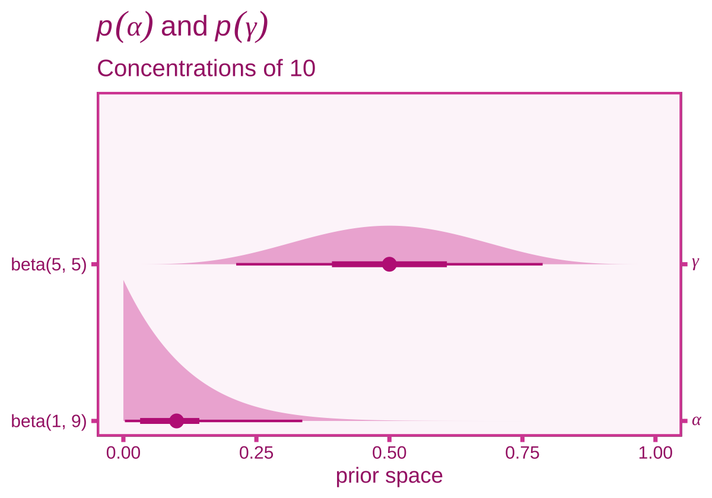
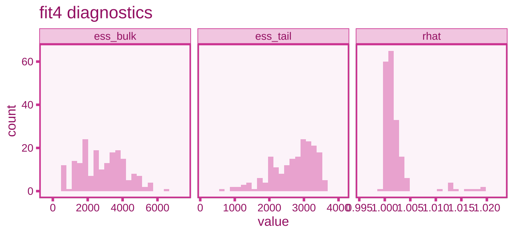

Gaffney et al (2022)
================
A Solomon Kurz
2023-08-14

Gaffney et al (2022;
<https://doi.org/10.1016/j.evolhumbehav.2022.02.004>) used a
pretest-posttest $4 \times 5$ between-person factorial design to compare
competing theories on depression and suicidal behaviors. The authors
made the code and data from their paper available on the OSF. The
`signaling2020mturk` repository contains their code (see
[here](https://github.com/michaelrgaffney/signaling2020mturk)) and the
`signaling2020data` repository contains their data (see
[here](https://github.com/michaelrgaffney/signaling2020data)). Here we
load their primary data, the `signaling2020.rda` file.

``` r
# packages
library(tidyverse)
library(brms)
library(tidybayes)
library(posterior)  # for summarise_draws()
# library(marginaleffects)
library(patchwork)

# load the data
load(file = "data/Gaffney et al (2022)/signaling2020.rda")

# what?
glimpse(signaling2020)
```

    ## Rows: 1,950
    ## Columns: 63
    ## $ MTurkID              <chr> NA, NA, NA, NA, NA, NA, NA, NA, NA, NA, NA, "AUFUUD4WG9CVO", NA, NA, NA, "A2QSV…
    ## $ IPAddress            <chr> "66.56.173.254", "66.142.195.201", "98.25.36.54", "73.252.59.86", "98.214.87.12…
    ## $ Progress             <dbl> 100, 100, 100, 100, 100, 100, 100, 100, 100, 100, 100, 100, 100, 100, 100, 100,…
    ## $ sample               <chr> "American", "American", "American", "American", "American", "American", "Americ…
    ## $ vignette             <chr> NA, NA, NA, NA, NA, "Basketball coach", "Basketball coach", NA, "Basketball coa…
    ## $ signal               <chr> NA, NA, NA, NA, NA, NA, NA, NA, NA, NA, NA, "Verbal request", NA, NA, NA, "Cryi…
    ## $ T1Belief             <dbl> NA, NA, NA, NA, NA, NA, NA, NA, NA, NA, 16, 35, 100, NA, 60, 48, NA, 0, 5, 15, …
    ## $ T1Action             <dbl> NA, NA, NA, NA, NA, NA, NA, NA, NA, NA, 7, 50, 96, NA, 60, 50, NA, 0, 5, 14, NA…
    ## $ T1Divide             <dbl> NA, NA, NA, NA, NA, NA, NA, NA, NA, NA, NA, NA, NA, NA, NA, NA, NA, NA, NA, NA,…
    ## $ T2Belief             <dbl> NA, NA, NA, NA, NA, NA, NA, NA, NA, NA, NA, 35, NA, NA, NA, 0, NA, 0, 5, 18, NA…
    ## $ T2Action             <dbl> NA, NA, NA, NA, NA, NA, NA, NA, NA, NA, NA, 50, NA, NA, NA, 0, NA, 0, 5, 14, NA…
    ## $ T2Divide             <dbl> NA, NA, NA, NA, NA, NA, NA, NA, NA, NA, NA, NA, NA, NA, NA, NA, NA, NA, NA, NA,…
    ## $ T3Action             <dbl> NA, NA, NA, NA, NA, NA, NA, NA, NA, NA, NA, 100, NA, NA, NA, 100, NA, 56, 100, …
    ## $ T1Angry              <dbl> NA, NA, NA, NA, NA, NA, NA, NA, NA, NA, 1, 1, 0, NA, 1, 1, NA, 1, 1, 1, NA, 1, …
    ## $ T1Sad                <dbl> NA, NA, NA, NA, NA, NA, NA, NA, NA, NA, 0, 1, 1, NA, 0, 1, NA, 0, 1, 0, NA, 1, …
    ## $ T1Suicidal           <dbl> NA, NA, NA, NA, NA, NA, NA, NA, NA, NA, 0, 0, 1, NA, 0, 1, NA, 0, 0, 0, NA, 0, …
    ## $ T1MentallyIll        <dbl> NA, NA, NA, NA, NA, NA, NA, NA, NA, NA, 0, 0, 1, NA, 0, 1, NA, 0, 0, 0, NA, 0, …
    ## $ T1Depressed          <dbl> NA, NA, NA, NA, NA, NA, NA, NA, NA, NA, 1, 1, 1, NA, 0, 1, NA, 0, 1, 0, NA, 1, …
    ## $ T1Guilty             <dbl> NA, NA, NA, NA, NA, NA, NA, NA, NA, NA, 0, 1, 0, NA, 0, 0, NA, 0, 1, 0, NA, 0, …
    ## $ T1Calm               <dbl> NA, NA, NA, NA, NA, NA, NA, NA, NA, NA, 0, 0, 0, NA, 0, 0, NA, 0, 0, 0, NA, 0, …
    ## $ T1Neutral            <dbl> NA, NA, NA, NA, NA, NA, NA, NA, NA, NA, 0, 0, 0, NA, 0, 0, NA, 0, 0, 0, NA, 0, …
    ## $ T1Scared             <dbl> NA, NA, NA, NA, NA, NA, NA, NA, NA, NA, 0, 1, 0, NA, 0, 1, NA, 0, 1, 0, NA, 1, …
    ## $ T1Tired              <dbl> NA, NA, NA, NA, NA, NA, NA, NA, NA, NA, 0, 0, 0, NA, 0, 0, NA, 0, 0, 0, NA, 0, …
    ## $ T1Distressed         <dbl> NA, NA, NA, NA, NA, NA, NA, NA, NA, NA, 1, 1, 0, NA, 1, 1, NA, 0, 1, 1, NA, 1, …
    ## $ T1Devious            <dbl> NA, NA, NA, NA, NA, NA, NA, NA, NA, NA, 0, 0, 0, NA, 0, 1, NA, 1, 1, 0, NA, 1, …
    ## $ T1Jealous            <dbl> NA, NA, NA, NA, NA, NA, NA, NA, NA, NA, 0, 1, 0, NA, 1, 0, NA, 1, 1, 1, NA, 0, …
    ## $ T1Confident          <dbl> NA, NA, NA, NA, NA, NA, NA, NA, NA, NA, 0, 0, 0, NA, 0, 0, NA, 0, 0, 0, NA, 0, …
    ## $ T1Traumatized        <dbl> NA, NA, NA, NA, NA, NA, NA, NA, NA, NA, 0, 0, 0, NA, 0, 1, NA, 0, 1, 0, NA, 0, …
    ## $ T1Violated           <dbl> NA, NA, NA, NA, NA, NA, NA, NA, NA, NA, 0, 1, 0, NA, 1, 1, NA, 0, 0, 1, NA, 0, …
    ## $ T1NoneOfAbove        <dbl> NA, NA, NA, NA, NA, NA, NA, NA, NA, NA, 0, 0, 0, NA, 0, 0, NA, 0, 0, 0, NA, 0, …
    ## $ T2Angry              <dbl> NA, NA, NA, NA, NA, NA, NA, NA, NA, NA, NA, 1, NA, NA, NA, 1, NA, 0, 1, 0, NA, …
    ## $ T2Sad                <dbl> NA, NA, NA, NA, NA, NA, NA, NA, NA, NA, NA, 1, NA, NA, NA, 1, NA, 1, 1, 0, NA, …
    ## $ T2Suicidal           <dbl> NA, NA, NA, NA, NA, NA, NA, NA, NA, NA, NA, 0, NA, NA, NA, 1, NA, 0, 1, 0, NA, …
    ## $ T2MentallyIll        <dbl> NA, NA, NA, NA, NA, NA, NA, NA, NA, NA, NA, 0, NA, NA, NA, 1, NA, 0, 1, 0, NA, …
    ## $ T2Depressed          <dbl> NA, NA, NA, NA, NA, NA, NA, NA, NA, NA, NA, 0, NA, NA, NA, 1, NA, 0, 1, 0, NA, …
    ## $ T2Guilty             <dbl> NA, NA, NA, NA, NA, NA, NA, NA, NA, NA, NA, 1, NA, NA, NA, 0, NA, 0, 1, 0, NA, …
    ## $ T2Calm               <dbl> NA, NA, NA, NA, NA, NA, NA, NA, NA, NA, NA, 0, NA, NA, NA, 0, NA, 0, 0, 0, NA, …
    ## $ T2Neutral            <dbl> NA, NA, NA, NA, NA, NA, NA, NA, NA, NA, NA, 0, NA, NA, NA, 0, NA, 0, 0, 0, NA, …
    ## $ T2Scared             <dbl> NA, NA, NA, NA, NA, NA, NA, NA, NA, NA, NA, 0, NA, NA, NA, 1, NA, 0, 1, 0, NA, …
    ## $ T2Tired              <dbl> NA, NA, NA, NA, NA, NA, NA, NA, NA, NA, NA, 0, NA, NA, NA, 0, NA, 0, 1, 0, NA, …
    ## $ T2Distressed         <dbl> NA, NA, NA, NA, NA, NA, NA, NA, NA, NA, NA, 1, NA, NA, NA, 1, NA, 0, 1, 1, NA, …
    ## $ T2Devious            <dbl> NA, NA, NA, NA, NA, NA, NA, NA, NA, NA, NA, 0, NA, NA, NA, 1, NA, 1, 0, 0, NA, …
    ## $ T2Jealous            <dbl> NA, NA, NA, NA, NA, NA, NA, NA, NA, NA, NA, 1, NA, NA, NA, 0, NA, 0, 1, 1, NA, …
    ## $ T2Confident          <dbl> NA, NA, NA, NA, NA, NA, NA, NA, NA, NA, NA, 0, NA, NA, NA, 0, NA, 0, 0, 0, NA, …
    ## $ T2Traumatized        <dbl> NA, NA, NA, NA, NA, NA, NA, NA, NA, NA, NA, 0, NA, NA, NA, 1, NA, 0, 1, 0, NA, …
    ## $ T2Violated           <dbl> NA, NA, NA, NA, NA, NA, NA, NA, NA, NA, NA, 1, NA, NA, NA, 1, NA, 0, 0, 1, NA, …
    ## $ T2NoneOfAbove        <dbl> NA, NA, NA, NA, NA, NA, NA, NA, NA, NA, NA, 0, NA, NA, NA, 0, NA, 0, 0, 0, NA, …
    ## $ Age                  <dbl> NA, NA, NA, NA, NA, NA, NA, NA, NA, NA, NA, 30, NA, NA, NA, 36, NA, 28, 48, 55,…
    ## $ Sex                  <chr> NA, NA, NA, NA, NA, NA, NA, NA, NA, NA, NA, "Male", NA, NA, NA, "Male", NA, "Fe…
    ## $ Sons                 <dbl> NA, NA, NA, NA, NA, NA, NA, NA, NA, NA, NA, 0, NA, NA, NA, 0, NA, 0, 2, 0, NA, …
    ## $ Daughters            <dbl> NA, NA, NA, NA, NA, NA, NA, NA, NA, NA, NA, 0, NA, NA, NA, 0, NA, 0, 1, 0, NA, …
    ## $ RelStatus            <chr> NA, NA, NA, NA, NA, NA, NA, NA, NA, NA, NA, "Single", NA, NA, NA, "Unmarried in…
    ## $ Ed                   <chr> NA, NA, NA, NA, NA, NA, NA, NA, NA, NA, NA, "Bachelor's degree", NA, NA, NA, "D…
    ## $ Income               <dbl> NA, NA, NA, NA, NA, NA, NA, NA, NA, NA, NA, 9200, NA, NA, NA, 50000, NA, 25000,…
    ## $ CurrencyType         <chr> "USD", "USD", "USD", "USD", "USD", "USD", "USD", "USD", "USD", "USD", "USD", "U…
    ## $ Feedback             <chr> NA, NA, NA, NA, NA, NA, NA, NA, NA, NA, NA, "N/A", NA, NA, NA, NA, NA, NA, "Jus…
    ## $ TotalTime            <dbl> 17, 12, 45, 24, 57, 19, 14, 22, 41, 31, 108, 172, 144, 137, 129, 164, 176, 131,…
    ## $ VignetteTime         <dbl> NA, NA, NA, NA, NA, 2.716, 2.443, NA, 3.411, NA, 41.074, 46.647, 35.241, 39.073…
    ## $ SignalTime           <dbl> NA, NA, NA, NA, NA, NA, NA, NA, NA, NA, NA, NA, NA, NA, NA, NA, NA, NA, NA, NA,…
    ## $ T4AttentionCheck     <dbl> NA, NA, NA, NA, NA, NA, NA, NA, NA, NA, NA, 0, NA, NA, NA, 0, NA, 0, 0, 91, NA,…
    ## $ T4AttentionCheckFail <dbl> NA, NA, NA, NA, NA, NA, NA, NA, NA, NA, NA, 0, NA, NA, NA, 0, NA, 0, 0, 1, NA, …
    ## $ CompleteSurvey       <lgl> FALSE, FALSE, FALSE, FALSE, FALSE, FALSE, FALSE, FALSE, FALSE, FALSE, FALSE, TR…
    ## $ years_education      <dbl> NA, NA, NA, NA, NA, NA, NA, NA, NA, NA, NA, 17, NA, NA, NA, 24, NA, 13, 17, 15,…

``` r
head(signaling2020)
```

    ## # A tibble: 6 × 63
    ##   MTurkID IPAddress      Progress sample vignette signal T1Belief T1Action T1Divide T2Belief T2Action T2Divide
    ##   <chr>   <chr>             <dbl> <chr>  <chr>    <chr>     <dbl>    <dbl>    <dbl>    <dbl>    <dbl>    <dbl>
    ## 1 <NA>    66.56.173.254       100 Ameri… <NA>     <NA>         NA       NA       NA       NA       NA       NA
    ## 2 <NA>    66.142.195.201      100 Ameri… <NA>     <NA>         NA       NA       NA       NA       NA       NA
    ## 3 <NA>    98.25.36.54         100 Ameri… <NA>     <NA>         NA       NA       NA       NA       NA       NA
    ## 4 <NA>    73.252.59.86        100 Ameri… <NA>     <NA>         NA       NA       NA       NA       NA       NA
    ## 5 <NA>    98.214.87.121       100 Ameri… <NA>     <NA>         NA       NA       NA       NA       NA       NA
    ## 6 <NA>    172.251.66.24       100 Ameri… Basketb… <NA>         NA       NA       NA       NA       NA       NA
    ## # ℹ 51 more variables: T3Action <dbl>, T1Angry <dbl>, T1Sad <dbl>, T1Suicidal <dbl>, T1MentallyIll <dbl>,
    ## #   T1Depressed <dbl>, T1Guilty <dbl>, T1Calm <dbl>, T1Neutral <dbl>, T1Scared <dbl>, T1Tired <dbl>,
    ## #   T1Distressed <dbl>, T1Devious <dbl>, T1Jealous <dbl>, T1Confident <dbl>, T1Traumatized <dbl>,
    ## #   T1Violated <dbl>, T1NoneOfAbove <dbl>, T2Angry <dbl>, T2Sad <dbl>, T2Suicidal <dbl>, T2MentallyIll <dbl>,
    ## #   T2Depressed <dbl>, T2Guilty <dbl>, T2Calm <dbl>, T2Neutral <dbl>, T2Scared <dbl>, T2Tired <dbl>,
    ## #   T2Distressed <dbl>, T2Devious <dbl>, T2Jealous <dbl>, T2Confident <dbl>, T2Traumatized <dbl>,
    ## #   T2Violated <dbl>, T2NoneOfAbove <dbl>, Age <dbl>, Sex <chr>, Sons <dbl>, Daughters <dbl>, …

I’m publishing this content sketch just a couple weeks after the
[*Barbie* movie](https://www.imdb.com/title/tt1517268/) dropped. In
response of the movie’s cultural and financial success, [Matthew B.
Jané](https://matthewbjane.com) made a custom `theme_barbie()` setting,
which eventually grew into the **ThemePark** package (see
[here](https://github.com/MatthewBJane/theme_park)). So this sketch will
take `theme_barbie()` for its default plot setting, with a few minor
adjustments.

``` r
# install from GitHub
# remotes::install_github("MatthewBJane/theme_park")

# load
library(ThemePark)

# adjust the default plot theme settings
theme_set(
  theme_barbie(barbie_font = FALSE) +
    # a few minor adjustments
    theme(title = element_text(size = 12),
          axis.text = element_text(size = 9),
          axis.title = element_text(size = 11),
          legend.background = element_rect(fill = "white"),
          legend.key = element_rect(fill = barbie_theme_colors["panel"], 
                                    color = barbie_theme_colors["panel"]),
          strip.text = element_text(size = 9, margin = margin(2.5, 2.5, 2.5, 2.5)))
)

# save a few color values
text_color_barbie    <- barbie_theme_colors["text"]    %>% as.character()  # '#a62675ff'
panel_color_barbie   <- barbie_theme_colors["panel"]   %>% as.character()  # '#fdf6faff'
border_color_barbie  <- barbie_theme_colors["border"]  %>% as.character()  # '#d74ea2ff'
lighter_color_barbie <- barbie_theme_colors["lighter"] %>% as.character()  # '#f5d1e6ff'
light_color_barbie   <- barbie_theme_colors["light"]   %>% as.character()  # '#eeb4d7ff'
medium_color_barbie  <- barbie_theme_colors["medium"]  %>% as.character()  # '#d74ea2ff'
dark_color_barbie    <- barbie_theme_colors["dark"]    %>% as.character()  # '#bf2986ff'
```

Here are a couple data wrangling steps based on some of Gaffney and
colleagues’ GitHub files.

``` r
# unclear, but I think they omitted code defining d, which I believe is this:
gaffney2022 <- signaling2020 %>% 
  filter(CompleteSurvey == TRUE) %>% 
  # from analysls.R file
  mutate(
    across(.cols = c(contains('Belief'), contains('Action')), ~.x/100),
    signal = ordered(signal, levels = c('Verbal request', 'Crying', 'Mild depression', 'Depression', 'Suicide attempt'))
  )
```

The number of participants per group range from 58 to 67. Here’s how you
might display those counts in a grid.

``` r
gaffney2022 %>% 
  count(signal, vignette) %>% 
  pivot_wider(names_from = vignette, values_from = n)
```

    ## # A tibble: 5 × 5
    ##   signal          `Basketball coach` `Brother-in-law` `Romantic partner` `Thwarted marriage`
    ##   <ord>                        <int>            <int>              <int>               <int>
    ## 1 Verbal request                  60               60                 66                  61
    ## 2 Crying                          60               60                 67                  58
    ## 3 Mild depression                 62               62                 66                  60
    ## 4 Depression                      61               59                 66                  62
    ## 5 Suicide attempt                 60               61                 67                  62

Participants were randomized into the two factor variables `signal` and
`vignette`, the combination of which make up the 20 conditions in the
study. The `vignette` factor was unordered, and the four levels provide
different contexts in which a female made a claim about adversity that
involved some conflict of interest. For example, in the
`Basketball coach` example:

> Participants were asked to imagine that they are a university athletic
> director. The star player on the women’s basketball team comes to the
> participant and claims she was sexually assaulted by her head coach, a
> physically powerful man. However, there is a history of conflict
> between the star player and the coach over playing time, and police
> are unable to find evidence to corroborate her claims. (p. 247)

After reading their assigned vignette, participants rated how likely
they would help the person in the vignette on a 0-to-100 scale. The
`T1Action` variable is that scale, rescaled to a 0-1 metric, and this
was considered the baseline measurement. Then participants were there
randomized into one of the levels of the `signal` factor. These involved
an extension of the vignette where they encountered the victim sometime
later and observed them exhibiting one of the levels of the `signal`.
The `signal` factor is ordered by the degree of the vignette’s emotional
intensity whereby the `Verbal request` condition was the low-emotional
signaling control condition, and the `Suicide attempt` condition was
meant to convey a strong emotional signal. Thus all levels of `signal`
other than `Verbal request` were conceptualized as active treatment
conditions. Then after reading through this second part of the vignette,
participants once again rated their willingness to help the person on a
0-to-100 scale, the rescaled version of which is the primary outcome in
this content sketch, `T2Action`.

In the original study, there were two focal outcomes: `T2Belief` and
`T2Action`. In this post, we’ll restrict ourselves to the later. Here we
plot the pretest version of those values, `T1Action`, by the 20 cells in
the study.

``` r
gaffney2022 %>% 
  ggplot(aes(x = T1Action)) +
  geom_histogram(fill = medium_color_barbie,
                 boundary = 0, binwidth = 0.05) +
  scale_x_continuous(breaks = 0:3 / 3, labels = c("0", "1/3", "2/3", "1")) +
  ggtitle("Behold the pretest version of the primary outcome, T2Action.") +
  facet_grid(vignette ~ signal)
```


Given the `TxAction` variables are “beta” distributed (see below), we
won’t compute their Pearson’s correlation coefficient. But they are
strongly positively related, which we can see in a scatter plot.

``` r
gaffney2022 %>% 
  ggplot(aes(x = T1Action, y = T2Action)) +
  geom_abline(color = "white") +
  geom_point(color = medium_color_barbie, alpha = 1/2) +
  coord_equal() +
  ggtitle("Strong, positive, and non-linear")
```


### Standardize.

Given the complexity of the models to follow, the `T1Action` variable
will be the sole baseline covariate in this content sketch. However, it
might be easier to set some of our priors if we convert this variable to
a standardized metric. We’ll save that variable as `T1Actionz`.

``` r
gaffney2022 <- gaffney2022 %>% 
  mutate(T1Actionz = (T1Action - mean(T1Action)) / sd(T1Action))
```

## Models

Our focal outcome variable `T2Action` is continuous and ranges from zero
to one. If it were constrained to values between those bounds, $[0, 1]$,
these data would be a great candidate for beta regression. However,
these data also include exact zero’s and ones, which puts them on the
$(0, 1)$ range. To accommodate those values, we’ll switch to the
zero-one-inflated beta (ZOIB) likelihood ([Swearingen et al.,
2012](https://citeseerx.ist.psu.edu/document?repid=rep1&type=pdf&doi=7548f25e1f5902955dd3284ba8a410d117eaa78e)).
Before we dive into our primary ZOIB models, we’ll first introduce the
ZOIB with two simpler warm-up models. After our warm-ups, we’ll fit
three primary models:

- a fixed-effects ANCOVA,
- a hierarchical ANCOVA, and
- a fixed-effects ANCOVA with a monotonic factor.

All three primary models will be fully distributional, with linear
models for all four ZOIB distributional parameters.

### Warm up without predictors.

To warm up, we’ll first fit an unconditional ZOIB model of the form

$$
\begin{align*}
\text{T2Action}_i & \sim \text{ZOIB}(\mu, \phi, \alpha, \gamma) \\
\text{logit}(\mu) & = \beta_0 \\ 
\beta_0 & \sim \text{Normal}(0, 1.25) \\
\phi & \sim \text{Lognormal}(3.469746, 0.57937949) \\
\alpha & \sim \text{Beta}(1, 9) \\
\gamma & \sim \text{Beta}(5, 5) \\
\end{align*}
$$

where we use the logit link for $\mu$ and the identity link for the
remaining three parameters, all of which are the `brm()` defaults. With
this parameterization, $\beta_0$ is the unconditional mean, on the
log-odds scale. Here we’re using my go-to default weakly-regularizing
prior for log-odds intercepts, $\text{Normal}(0, 1.25)$, which will
center $\mu$ at .5 while still allowing for values across the entire
$[0, 1]$ parameter space.

The $\text{Lognormal}(3.469746, 0.57937949)$ prior for $\phi$ may seem
oddly specific. The $\phi$ parameter is constrained to positive real
values, $\mathbb R^+$, and the lognormal is a 2-parameter distribution
distribution constrained to that same range. Though we could also a
prior from another positive real distribution, such as the exponential
or gamma, those will lead to complications for future models. As we will
see, once we start fitting fully conditional ZOIB models, `brm()` will
switch to the log link for $\phi$, and we typically use Gaussian priors
for parameters in linear models using the log link. It turns out that
log transforming a lognormal distribution will return a normal
distribution, and exponentiating a normal distribution will return a
lognormal distribution. Thus, by using a lognormal prior for our
unconditional model, we are setting ourselves up to use an equivalent
normal prior in the conditional models to come. You’ll see. For now,
we’ll want to see why we’ve settled on
$\text{Lognormal}(3.469746, 0.57937949)$. The lognormal distribution is
parameterized in terms of $\mu$ and $\sigma$, which are the population
mean and standard deviations *for the normal distribution that results
after exponentiation*. Thus if you want a lognormal distribution with a
given mean and standard deviation on its own scale, you have to use the
following equations

$$
\begin{align*}
\mu & = \log\left ( \bar y \Bigg / \sqrt{\frac{s^2}{\bar y^2} + 1} \right), \text{and} \\
\sigma & = \sqrt{\log \left(\frac{s^2}{\bar y^2} + 1 \right)}.
\end{align*}
$$

where $\bar y$ is the desired mean and $s$ is the desired standard
deviation. Here we’ll bake those equations into a custom function
`lognormal_mu_sigma_from_mean_sd()`, which will return the necessary
lognormal $\mu$ and $\sigma$ values for a given mean and standard
deviation.

``` r
lognormal_mu_sigma_from_mean_sd <- function(mean, sd) {
  
  if (mean <= 0) stop("mean must be > 0")
  if (sd   <= 0) stop("sd must be > 0")
  
  mu    <- log(mean / sqrt(sd^2 / mean^2 + 1))
  sigma <- sqrt(log(sd^2 / mean^2 + 1))
  
  return(tibble(mu = mu, sigma = sigma))
  
}
```

Here’s what it returns for a mean of 38 and a standard deviation of 24.

``` r
lognormal_mu_sigma_from_mean_sd(mean = 38, sd = 24)
```

    ## # A tibble: 1 × 2
    ##      mu sigma
    ##   <dbl> <dbl>
    ## 1  3.47 0.579

The inner 95% range for a lognormal distribution with those parameters
is about 10 to 100, which encapsulates the range of values I’d generally
expect from a beta variable in a psychology experiment.

``` r
qlnorm(c(.025, .975), 3.469746, 0.5793794)
```

    ## [1]  10.32103 100.01386

Here’s that that looks like in a plot.

``` r
c(prior(lognormal(3.837813, 0.3852532)),
  prior(lognormal(3.469746, 0.57937949))) %>% 
  parse_dist() %>% 
  
  ggplot(aes(xdist = .dist_obj, y = prior)) +
  stat_halfeye(point_interval = mean_qi, .width = c(.5, .95),
               fill = light_color_barbie,
               color = dark_color_barbie) +
  scale_y_discrete(expand = expansion(mult = 0.1)) +
  labs(title = expression(italic(p)(phi)),
       x = expression(phi),
       y = NULL) +
  coord_cartesian(xlim = c(0, 100))
```


Our focal $\text{Lognormal}(3.469746, 0.57937949)$ prior on the bottom
is contrasted with an alternative
$\text{Lognormal}(3.837813, 0.3852532)$ prior, which has a mean of 50
and standard deviation of 20 (execute
`lognormal_mu_sigma_from_mean_sd(mean = 50, sd = 20)`). You might
experiment on your own with the `lognormal_mu_sigma_from_mean_sd()`
function to explore other candidates for the $\phi$ prior.

We have used the $\text{Beta}(1, 9)$ prior for $\alpha$, which puts our
prior mean at 0.1 that the `T2Action` values will be zero’s or one’s.
The concentration for that prior $(1 + 9 = 10)$ is a fairly small value,
indicating we’re not overly confident. Our $\text{Beta}(5, 5)$ prior for
$\gamma$ indicates we expect about a 50/50 split between those zero’s
and one’s, and the small concentration $(5 + 5 = 10)$ indicates we are
also unsure about that split. Here are what those priors look like.

``` r
c(prior(beta(1, 9)),
  prior(beta(5, 5))) %>% 
  parse_dist() %>% 
  mutate(order = 1:2) %>% 
  
  ggplot(aes(xdist = .dist_obj, y = order)) +
  stat_halfeye(point_interval = mean_qi, .width = c(.5, .95),
               fill = light_color_barbie,
               color = dark_color_barbie) +
  scale_y_continuous(breaks = 1:2, labels = c("beta(1, 9)", "beta(5, 5)"),
                     sec.axis = dup_axis(breaks = 1:2,
                                         labels = parse(text = c("alpha", "gamma")))) +
  labs(title = expression(italic(p)(alpha)~and~italic(p)(gamma)),
       subtitle = "Concentrations of 10",
       x = "prior space",
       y = NULL)
```



If you would like stronger or weaker priors with the same means,
increase the values for the hyperparameters so they have the same
ratio’s, but have larger or smaller concentrations, respectively. For
example, here’s what it looks like if we want our priors to be about
half of the strength.

``` r
c(prior(beta(0.5,  4.5)),
  prior(beta(2.5, 2.5))) %>% 
  parse_dist() %>% 
  mutate(order = 1:2) %>% 
  
  ggplot(aes(xdist = .dist_obj, y = order)) +
  stat_halfeye(point_interval = mean_qi, .width = c(.5, .95),
               fill = light_color_barbie,
               color = dark_color_barbie) +
  scale_y_continuous(breaks = 1:2, labels = c("beta(1, 9)", "beta(5, 5)"),
                     sec.axis = dup_axis(breaks = 1:2,
                                         labels = parse(text = c("alpha", "gamma")))) +
  labs(title = expression(italic(p)(alpha)~and~italic(p)(gamma)),
       subtitle = "Concentrations of 5",
       x = "prior space",
       y = NULL)
```


Here’s how to fit the model with `brm()`.

``` r
fit1 <- brm(
  data = gaffney2022,
  family = zero_one_inflated_beta(),
  T2Action ~ 1,
  prior = prior(normal(0, 1.25), class = Intercept) +
    prior(lognormal(3.469746, 0.57937949), class = phi) +
    prior(beta(1, 9), class = zoi) +
    prior(beta(5, 5), class = coi),
  cores = 4, seed = 1,
  file = "fits/fit1.gaffney2022"
)
```

Check the model summary.

``` r
print(fit1)
```

    ##  Family: zero_one_inflated_beta 
    ##   Links: mu = logit; phi = identity; zoi = identity; coi = identity 
    ## Formula: T2Action ~ 1 
    ##    Data: gaffney2022 (Number of observations: 1240) 
    ##   Draws: 4 chains, each with iter = 2000; warmup = 1000; thin = 1;
    ##          total post-warmup draws = 4000
    ## 
    ## Population-Level Effects: 
    ##           Estimate Est.Error l-95% CI u-95% CI Rhat Bulk_ESS Tail_ESS
    ## Intercept    -0.06      0.04    -0.13     0.01 1.00     3980     3249
    ## 
    ## Family Specific Parameters: 
    ##     Estimate Est.Error l-95% CI u-95% CI Rhat Bulk_ESS Tail_ESS
    ## phi     2.08      0.08     1.93     2.23 1.00     4185     2772
    ## zoi     0.22      0.01     0.19     0.24 1.00     4632     3182
    ## coi     0.47      0.03     0.41     0.52 1.00     4371     3245
    ## 
    ## Draws were sampled using sampling(NUTS). For each parameter, Bulk_ESS
    ## and Tail_ESS are effective sample size measures, and Rhat is the potential
    ## scale reduction factor on split chains (at convergence, Rhat = 1).

We can check how the model did with a histogram-based `pp_check()`.

``` r
bayesplot::color_scheme_set("pink")

pp_check(fit1, ndraws = 8, type = "hist", binwidth = 0.05)
```


For an unconditional model, we did pretty okay.

We might further practice with the posterior draws from our
unconditional ZOIB model to compute the population means and variances.
We define the mean of a ZOIB as

$$\mathbb E(y) = \alpha \gamma + \mu (1 - \alpha),$$

and the variance as

$$
\mathbb{Var}(y) = \alpha \gamma (1 - \gamma) + \frac{(1 - \alpha)(\mu - \mu^2)}{\phi + 1} + \alpha(1 - \alpha)(\gamma - \mu)^2.
$$

Further, you can compute the proportion of $0$’s with

$$
p_0 = \alpha (1 - \gamma),
$$

and the proportion of $1$’s with

$$
p_1 = \alpha\gamma.
$$

Now use those equations to compare the population statistics from the
model with the sample statistics.

``` r
stat_order <- c("mean", "variance", "italic(p)[0]", "italic(p)[1]")

# compute sample statistics
sample_stats <- gaffney2022 %>% 
  summarise(mean = mean(T2Action),
            variance = var(T2Action),
            `italic(p)[0]` = mean(T2Action == 0),
            `italic(p)[1]` = mean(T2Action == 1)) %>% 
  pivot_longer(everything()) %>% 
  mutate(name = factor(name, levels = stat_order))

# extract the posterior draws
as_draws_df(fit1) %>% 
  # wrangle
  transmute(mu = plogis(b_Intercept),
            phi = phi,
            alpha = zoi,
            gamma = coi) %>% 
  mutate(mean     = alpha * gamma + (1 - alpha) * mu,
         variance = alpha * gamma * (1 - gamma) + (1 - alpha) * mu * (1 - mu) / (phi + 1) + alpha * (1 - alpha) * (gamma - mu)^2,
         `italic(p)[0]` = alpha * (1 - gamma),
         `italic(p)[1]` = alpha * gamma) %>% 
  pivot_longer(mean:`italic(p)[1]`) %>% 
  mutate(name = factor(name, levels = stat_order)) %>% 
  
  # plot!
  ggplot(aes(x = value)) +
  stat_halfeye(point_interval = mean_qi, .width = c(.5, .95),
               fill = light_color_barbie,
               color = dark_color_barbie,
               normalize = "panels") +
  geom_vline(data = sample_stats,
             aes(xintercept = value),
             linetype = 2, color = medium_color_barbie) +
  scale_x_continuous("statistic space", expand = expansion(mult = 0.2)) +
  scale_y_continuous(NULL, breaks = NULL) +
  facet_wrap(~ name, scales = "free", labeller = label_parsed)
```


The posteriors for all four population values are well centered atop the
sample statistics, as depicted by the dashed vertical lines.

### Warm up further with a curvy baseline covariate.

Now we have a sense of the unconditional ZOIB model, it’s time to talk
about baseline covariates. All our primary models will include the
standardized version of the baseline measure of our primary outcome
variable, `T1Actionz`, as a covariate to improve on the efficiency of
our causal estimands. If this were a simple Gaussian model, we could
model this using the conventional linear approach. However, our
unconditional ZOIB already uses the logit link for $\mu$, and once we
start attaching linear models to the other three parameters in the
models to come, those will all use non-identity link functions too. If
the `T1Action` variable followed a simple beta distribution, it might be
fine to just use a logit transformation to follow the logit links, but
sadly `T1Action` also has zero and one inflation. Those zero’s and one’s
would result in negative and positive infinity values after the logit
transformation, and linear models don’t do well when your predictors
contain infinity values. So to accommodate any nonlinear relations, we
will include `T1Actionz` in a smooth function following the form

$$
\begin{align*}
\text{T2Action}_i & \sim \text{ZOIB}(\mu_i, \phi, \alpha, \gamma) \\
\text{logit}(\mu_i) & = \beta_0 + f(\text{T1Actionz}_i) \\ 
f(\text{T1Actionz}_i) & = \beta_1 \text{T1Actionz}_i + z_j b_j, \;\;\; \text{for}\ 1, \dots, J\ \text{basis terms}\ (b) \\
z_j & \sim \text{Normal}(0, \sigma) \\
\beta_0 & \sim \text{Normal}(0, 1.25) \\
\beta_1 & \sim \text{Normal}(0, 1) \\
\phi & \sim \text{Lognormal}(3.469746, 0.57937949) \\
\alpha & \sim \text{Beta}(1, 9) \\
\gamma & \sim \text{Beta}(5, 5) \\
\sigma & \sim \text{Exponential}(1),
\end{align*}
$$

where, for the sake of practice, we are only adding the covariate to the
$\mu_i$ model at this point. We’ll generalize later. In the second line,
we have indicated our covariate is in a smooth term with the general
function notation $f(\cdot)$. We define that function in the third line,
which shows how **brms** uses the multilevel parameterization for
smooths. The first term on the right side of the third line, $\beta_1$,
is like a fixed effect or grand mean for `T1Actionz`. In the next term,
$z_j b_j$, we see there are $j$ synthetic basis functions $b$, each of
which has it’s own deviation from the $\beta_1$ grand mean allowed by
their $z_i$ coefficients. In the fourth line, we see those $z_i$
coefficients are normally distributed with a population mean of zero and
standard deviation $\sigma$. The remaining lines spell out our priors,
the intercepts for which are the same as before. We have used a generic
weakly-regularizing $\text{Normal}(0, 1)$ prior for our new $\beta_1$
and the weakly-regularizing $\text{Exponential}(1)$ prior for $\sigma$.

In code, we will specify our smooth function with the `s()` helper,
which **brms** imports from the **mgcv** package. Here we are using the
default settings, which means we are using a regularized *thin plate
spline* with the number of dimensions (i.e., number of $b$’s) chosen
automatically. You can change these settings with the `bs` and `k`
arguments.

``` r
fit2 <- brm(
  data = gaffney2022,
  family = zero_one_inflated_beta(),
  T2Action ~ 1 + s(T1Actionz),
  prior = prior(normal(0, 1.25), class = Intercept) +
    prior(normal(0, 1), class = b) +
    prior(exponential(1), class = sds) +
    prior(lognormal(3.469746, 0.57937949), class = phi) +
    prior(beta(1, 9), class = zoi) +
    prior(beta(5, 5), class = coi),
  cores = 4, seed = 1,
  file = "fits/fit2.gaffney2022"
)
```

Check the model summary.

``` r
print(fit2)
```

    ##  Family: zero_one_inflated_beta 
    ##   Links: mu = logit; phi = identity; zoi = identity; coi = identity 
    ## Formula: T2Action ~ 1 + s(T1Actionz) 
    ##    Data: gaffney2022 (Number of observations: 1240) 
    ##   Draws: 4 chains, each with iter = 2000; warmup = 1000; thin = 1;
    ##          total post-warmup draws = 4000
    ## 
    ## Smooth Terms: 
    ##                   Estimate Est.Error l-95% CI u-95% CI Rhat Bulk_ESS Tail_ESS
    ## sds(sT1Actionz_1)     2.13      0.71     1.08     3.77 1.00     1619     2487
    ## 
    ## Population-Level Effects: 
    ##              Estimate Est.Error l-95% CI u-95% CI Rhat Bulk_ESS Tail_ESS
    ## Intercept       -0.10      0.03    -0.16    -0.04 1.00     4713     2901
    ## sT1Actionz_1     0.69      0.98    -1.21     2.61 1.00     4121     3038
    ## 
    ## Family Specific Parameters: 
    ##     Estimate Est.Error l-95% CI u-95% CI Rhat Bulk_ESS Tail_ESS
    ## phi     3.90      0.16     3.59     4.22 1.00     5746     2878
    ## zoi     0.22      0.01     0.19     0.24 1.00     5423     3077
    ## coi     0.47      0.03     0.41     0.53 1.00     5785     2750
    ## 
    ## Draws were sampled using sampling(NUTS). For each parameter, Bulk_ESS
    ## and Tail_ESS are effective sample size measures, and Rhat is the potential
    ## scale reduction factor on split chains (at convergence, Rhat = 1).

The `sT1Actionz_1` line in the `Population-Level Effects` section shows
the summary for $\beta_1$, the fixed effect portion of our thin plate
spline. The standard deviaiton among our $z_J$ deviations is displayed
in the `sds(sT1Actionz_1)` line of the new `Smooth Terms` section. In
the formula, we called that value $\sigma$. Smaller values for $\sigma$
impose greater penalties on wiggliness (i.e., stronger regularization),
and as $\sigma \rightarrow \infty$ the spline becomes unconstrained. We
can get a sense of the shape of the spline with the
`conditional_smooths()` function.

``` r
plot(conditional_smooths(fit2), 
     line_args = list(fill = light_color_barbie,
                      color = dark_color_barbie),
     plot = FALSE)[[1]]
```


In this case, the smooth is a little wiggly, but not impressively so,
and one might wonder if we’d be better off just using a much simpler
liner model. As you’ll see very shortly, this won’t be the case once we
start modeling the other parameters available in the ZOIB distributional
model. Hang tight.

### Primary models.

#### Fixed-effects ANCOVA.

Now we have warmed up with the unconditional ZOIB, we are ready to begin
fitting our primary models. Our first model will be a distributional
ZOIB fixed-effects ANCOVA. Before we describe the statistical model with
an equation, we’ll first show the basic linear model, excluding the
baseline covariate, in the `lm()`-style *design formula* format:

`T2Action ~ 1 + signal + vignette + signal:vignette`

We’ll use a similar version of this code within `brm()` because of how
convenient and compact it is. However, because both our `signal` and
`vignette` variables are composed of more than two categories, the
`brm()` function will decompose them into a series of dummy variables,
much like with the `lm()` function. Thus a full interaction model of
these variables would lead to a linear formula more like

$$
\begin{align*}
\eta & = \beta_0 + \beta_1 \text{signal}_{2i} + \dots + \beta_4 \text{signal}_{5i} \\
& \;\;\; + \beta_5 \text{vignette}_{2i} + \dots + \beta_7 \text{vignette}_{4i} \\
& \;\;\; + \beta_8 \text{signal}_{2i} \text{vignette}_{2i} + \dots + \beta_{19} \text{signal}_{5i} \text{vignette}_{4i},
\end{align*}
$$

where the $\eta$ term on the left side of the equation is the *linear
predictor*, which is a compact notation sometimes used for the
right-hand side of the equation in a GLMM (see McCullagh & Nelder, 1989,
<https://tinyurl.com/5cvv36z2>; Bürkner, 2017,
<https://doi.org/10.18637/jss.v080.i01>). With this formulation,
$\text{signal}_{1i}$ would indicate the dummy variable for the first
category in `signal`, $\text{signal}_{2i}$ would indicate the dummy
variable for the second category, and so on. Notice how we exclude dummy
variables for the first category in both `signal` and `vignette`, which
makes the intercept $\beta_0$ the expected value for the reference
category where participants were in the first category of `signal`
(*Verbal request*) and the first category for `vignette` (*Basketball
coach*). Given the five levels of `signal` and the four levels of
`vignette`, the full ANOVA-type interaction model requires
$5 \times 4 = 20$ regression coefficients for each parameter in the
likelihood. However, we’ll want to add the smooth term for our baseline
covariate to the model too, which expands the linear predictor to

$$
\begin{align*}
\eta & = \beta_0 + \beta_1 \text{signal}_{2i} + \dots + \beta_4 \text{signal}_{5i} \\
& \;\;\; + \beta_5 \text{vignette}_{2i} + \dots + \beta_7 \text{vignette}_{4i} \\
& \;\;\; + \beta_8 \text{signal}_{2i} \text{vignette}_{2i} + \dots + \beta_{19} \text{signal}_{5i} \text{vignette}_{4i} \\
& \;\;\; + f(\text{T1Actionz}_i) \\
f(\text{T1Actionz}_i) & = \beta_{20} \text{T1Actionz}_i + z_j b_j, \;\;\; \text{for}\ 1, \dots, J\ \text{basis terms}\ (b) \\
z_j & \sim \text{Normal}(0, \sigma),
\end{align*}
$$

where what we used to call $\beta_1$ in our last warm-up model, has now
become $\beta_{20}$ after accounting for all the coefficients for the
dummy versions of our focal variables. Thus one way we might express the
full model is

$$
\begin{align*}
\text{T2Action}_i & \sim \text{ZOIB}(\mu_i, \phi_i, \alpha_i, \gamma_i) \\
\text{logit}(\mu_i)    & = \eta^\mu \\
\log(\phi_i)           & = \eta^\phi \\
\text{logit}(\alpha_i) & = \eta^\alpha \\
\text{logit}(\gamma_i) & = \eta^\gamma, \;\;\; \text{where} \\
\eta & = \beta_0  \\
& \;\;\; + \beta_1 \text{signal}_{2i} + \dots + \beta_4 \text{signal}_{5i} \\
& \;\;\; + \beta_5 \text{vignette}_{2i} + \dots + \beta_7 \text{vignette}_{4i} \\
& \;\;\; + \beta_8 \text{signal}_{2i} \text{vignette}_{2i} + \dots + \beta_{19} \text{signal}_{5i} \text{vignette}_{4i} \\
& \;\;\; + f(\text{T1Actionz}_i) \\
f(\text{T1Actionz}_i) & = \beta_{20} \text{T1Actionz}_i + z_j b_j, \;\;\; \text{for}\ 1, \dots, J\ \text{basis terms}\ (b) \\
z_j & \sim \text{Normal}(0, \sigma), \;\;\; \text{and we have the priors} \\
\beta_0^\mu & \sim \text{Normal}(0, 1.25) \\
\beta_0^\phi & \sim \text{Normal}(3.837813, 0.3852532) \\
\beta_0^\alpha & \sim \text{Normal}(-2.55, 1) \\
\beta_0^\gamma & \sim \text{Normal}(0, 0.67) \\
\beta_1^\mu, \dots, \beta_{20}^\mu & \sim \text{Normal}(0, 1) \\
\beta_1^\phi, \dots, \beta_{20}^\mu & \sim \text{Normal}(0, 0.5) \\
\beta_1^\alpha, \dots, \beta_{20}^\mu & \sim \text{Normal}(0, 1) \\
\beta_1^\gamma, \dots, \beta_{20}^\mu & \sim \text{Normal}(0, 1) \\
\sigma^\mu & \sim \text{Exponential}(1) \\
\sigma^\phi & \sim \text{Exponential}(2) \\
\sigma^\alpha & \sim \text{Exponential}(1) \\
\sigma^\gamma & \sim \text{Exponential}(1)
\end{align*}
$$

where the notation of $\eta^\mu$, $\eta^\phi$, $\eta^\alpha$,
$\eta^\gamma$, and $\eta$ is my attempt to convey that the linear
predictors for all four likelihood terms have a common structure called
$\eta$, but the parameters within and across each are allowed to freely
vary. Next we discuss priors.

The priors for all non-intercept $\beta$ parameters are meant to be
weakly regularizing. Since the parameters in $\beta_{1+}^\mu$,
$\beta_{1+}^\alpha$, and $\beta_{1+}^\gamma$ are all on the log-odds
scale, they share a common prior distribution of $\text{Normal}(0, 1)$.
To my mind, the $\text{Normal}(0, 0.5)$ is often a better
weakly-regularizing default for $\beta$ parameters on the log scale,
which is why we use those priors for the $\beta_{1+}^\phi$ parameters.
The exponential priors for the $\sigma$ parameters for the smooth terms
follow a similar default weakly-regularizing logic.

As to the $\beta_0$ intercept parameters, the prior for what we are now
calling $\beta_0^\mu$ is the same as the $\beta_0$ prior we used in the
two warm-up models. As to the $\beta_0^\phi$ prior, note the `brm()`
function defaults to the log link when we attach a linear model to
$\phi$. Recall that the log of a normal distribution with
hyperparameters $\mu$ and $\sigma$ is the same as a lognormal
distribution with hyperparameters $\mu$ and $\sigma$. Thus when we use
the $\text{Normal}(3.837813, 0.3852532)$ prior for $\beta_0^\phi$ on the
log scale, this is equivalent to using the
$\text{Lognormal}(3.837813, 0.3852532)$ prior in our earlier warm-up
models when the unconditional $\phi$ was on the identity scale.

The priors for our new $\beta_0^\alpha$ and $\beta_0^\gamma$ parameters
require a little more explanation. I am not aware of a way to perfectly
convert a beta distribution on the probability scale to an unbounded
distribution on the log-odds scale. However, with a little iteration I
was able to find a couple Gaussian distributions that closely resembled
the beta distributions after the inverse logit transformation. Starting
with $\beta_0^\alpha$, which is on the log-odds scale, the
$\text{Normal}(-2.55, 1)$ prior comes close to the $\text{Beta}(1, 9)$
distribution after the inverse logit transformation. Here’s a plot
comparing the two.

``` r
# left
p1 <- prior(beta(1, 9)) %>% 
  parse_dist() %>% 

  ggplot(aes(xdist = .dist_obj)) +
  stat_halfeye(point_interval = mean_qi, .width = c(.5, .95),
               fill = light_color_barbie,
               color = dark_color_barbie) +
  scale_x_continuous(expression(alpha), breaks = 0:5 / 5, limits = 0:1) +
  scale_y_continuous(NULL, breaks = NULL) +
  labs(title = "Beta(1, 9)",
       subtitle = "From the unconditional model")

# right
n_draw <- 1e6

set.seed(1)

p2 <- tibble(p = rnorm(n = n_draw, mean = -2.55, sd = 1) %>% 
         plogis()) %>% 

  ggplot(aes(x = p)) +
  stat_histinterval(point_interval = mean_qi, .width = c(.5, .95),
                    fill = light_color_barbie,
                    color = dark_color_barbie,
                    align = ggdist::align_boundary(at = 0),
                    breaks = ggdist::breaks_fixed(width = 0.01)) +
  scale_x_continuous(expression(logit^{-1}*(beta[0]^alpha)), breaks = 0:5 / 5, limits = 0:1) +
  scale_y_continuous(NULL, breaks = NULL) +
  labs(title = expression(logit^{-1}*"[Normal(-2.55, 1)]"),
       subtitle = "From the conditional model")

# combine 
p1 + p2 &
  plot_annotation(title = "After inverse logit transformation, Normal(-2.55, 1) on the log-odds\nscale is similar to Beta(1, 9) on the probability scale.") &
  theme(axis.title = element_text(size = 12),
        title = element_text(size = 12, color = text_color_barbie))
```


In a simlar way with our new $\beta_0^\gamma$ parameter, which is also
on the log-odds scale, the $\text{Normal}(0. 0.67)$ prior comes close to
the $\text{Beta}(5, 5)$ distribution after the inverse logit
transformation. Here’s a plot comparing the two.

``` r
# left
p3 <- prior(beta(5, 5)) %>% 
  parse_dist() %>% 

  ggplot(aes(xdist = .dist_obj)) +
  stat_halfeye(point_interval = mean_qi, .width = c(.5, .95),
               fill = light_color_barbie,
               color = dark_color_barbie) +
  scale_x_continuous(expression(gamma), breaks = 0:5 / 5, limits = 0:1) +
  scale_y_continuous(NULL, breaks = NULL) +
  labs(title = "Beta(5, 5)",
       subtitle = "From the unconditional model")

# right
n_draw <- 1e6

set.seed(1)

p4 <- tibble(p = rnorm(n = n_draw, mean = 0, sd = 0.67) %>% 
         plogis()) %>% 

  ggplot(aes(x = p)) +
  stat_histinterval(point_interval = mean_qi, .width = c(.5, .95),
                    fill = light_color_barbie,
                    color = dark_color_barbie,
                    align = ggdist::align_boundary(at = 0),
                    breaks = ggdist::breaks_fixed(width = 0.01)) +
  scale_x_continuous(expression(logit^{-1}*(beta[0]^gamma)), breaks = 0:5 / 5, limits = 0:1) +
  scale_y_continuous(NULL, breaks = NULL) +
  labs(title = expression(logit^{-1}*"[Normal(0, 0.67)]"),
       subtitle = "From the conditional model")

# combine 
p3 + p4 &
  plot_annotation(title = "After inverse logit transformation, Normal(0. 0.67) on the log-odds\nscale is similar to Beta(5, 5) on the probability scale.") &
  theme(axis.title = element_text(size = 12),
        title = element_text(size = 12, color = text_color_barbie))
```


When it comes to fitting the model with `brm()`, we want to use the
`0 + Intercept` syntax to accommodate how our various dummy variables
are not mean centered. Also, note our use of the `bf()` function which
allows for distributional modeling. Otherwise, the main thing to watch
out for is that you make careful use of the `dpar` arguments when
setting the priors.

``` r
fit3 <- brm(
  data = gaffney2022,
  family = zero_one_inflated_beta(),
  bf(T2Action ~ 0 + Intercept + signal + vignette + signal:vignette + s(T1Actionz),
     phi ~ 0 + Intercept + signal + vignette + signal:vignette + s(T1Actionz),
     zoi ~ 0 + Intercept + signal + vignette + signal:vignette + s(T1Actionz),
     coi ~ 0 + Intercept + signal + vignette + signal:vignette + s(T1Actionz)),
  # priors for the log-odds mu model
  prior = prior(normal(0, 1.25), class = b, coef = Intercept) +
    prior(normal(0, 1), class = b) +
    prior(exponential(1), class = sds) +
    # log(phi) model
    prior(normal(3.837813, 0.3852532), class = b, coef = Intercept, dpar = phi) +
    prior(normal(0, 0.5), class = b, dpar = phi) +
    prior(exponential(2), class = sds, dpar = phi) +
    # log-odds zoi model
    prior(normal(-2.55, 1), class = b, coef = Intercept, dpar = zoi) +
    prior(normal(0, 1), class = b, dpar = zoi) +
    prior(exponential(1), class = sds, dpar = zoi) +
    # log-odds coi model
    prior(normal(0, 0.67), class = b, coef = Intercept, dpar = coi) +
    prior(normal(0, 1), class = b, dpar = coi) +
    prior(exponential(1), class = sds, dpar = coi),
  cores = 4, seed = 1,
  file = "fits/fit3.gaffney2022"
)
```

You might check the model summary. Given the large number of parameters,
I will omit this output for the sake of space.

``` r
print(fit3)
```

However, we might make a faceted histogram of our three chain diagnostic
statistics to help examine the quality of the model.

``` r
as_draws_df(fit3) %>% 
  summarise_draws() %>% 
  pivot_longer(rhat:ess_tail) %>% 
  
  ggplot(aes(x = value)) +
  geom_histogram(bins = 20, fill = light_color_barbie, color = NA) +
  scale_x_continuous(expand = expansion(mult = 0.2)) +
  ggtitle("fit3 diagnostics") +
  facet_wrap(~ name, scales = "free_x")
```


#### Hierarchical ANCOVA.

Our second primary model will be a distributional ZOIB hierarchical
ANCOVA. Before we describe the statistical model with an equation, we’ll
first show the basic linear model, excluding the baseline covariate, in
the `lm()`-style design formula format:

`T2Action ~ 1 + (1 | signal) + (1 | vignette) + (1 | signal:vignette)`

This simple version is what you might call a hierarchical ANOVA, as
proposed by Gelman (2005; <https://doi.org/10.1214/009053604000001048>).
Here both factor variables are included as separate random effects, and
the interaction between the two factors is treated as a third random
effect. This structure will impose multilevel partial pooling, resulting
in slightly conservative group differences. When one adds one or more
baseline covariates to this, following the form

`T2Action ~ 1 + covariate(s) + (1 | signal) + (1 | vignette) + (1 | signal:vignette)`

this becomes what you might call a hierarchical ANCOVA. For some
practice with these model types, Kruschke worked through examples of
Bayesian hierarchical ANOVA’s and ANCOVA’s in the latter chapters of his
2014
[textbook](https://sites.google.com/site/doingbayesiandataanalysis/).
Our approach will be to generalize further by fitting a fully
distributional hierarchical ANCOVA, as applied to all four parameters of
the ZOIB likelihood. Our generic linear predictor $\eta$ will follow the
form

$$
\begin{align*}
\eta & = \beta_0 + f(\text{T1Actionz}_i) + u_{0j} + v_{0k} + w_{0jk} \\
f(\text{T1Actionz}_i) & = \beta_1 \text{T1Actionz}_i + z_l b_l, \;\;\; \text{for}\ 1, \dots, L\ \text{basis terms}\ (b) \\
z_j & \sim \text{Normal}(0, \sigma_z) \\
\begin{bmatrix} u_{0j}^\mu, u_{0j}^\phi, u_{0j}^\alpha, u_{0j}^\gamma \end{bmatrix}^\intercal & \sim \text{Normal}( 
  \mathbf 0, \mathbf S_u \mathbf R_u \mathbf S_u ), \;\;\; \text{for}\ 1, \dots, J\ \text{ levels of the signal factor} \\
\begin{bmatrix} v_{0k}^\mu, v_{0k}^\phi, v_{0k}^\alpha, v_{0k}^\gamma \end{bmatrix}^\intercal & \sim \text{Normal}( 
  \mathbf 0, \mathbf S_v \mathbf R_v \mathbf S_v ), \;\;\; \text{for}\ 1, \dots, K\ \text{ levels of the vignette factor} \\
\begin{bmatrix} w_{0jk}^\mu, w_{0jk}^\phi, w_{0jk}^\alpha, w_{0jk}^\gamma \end{bmatrix}^\intercal & \sim \text{Normal}( 
  \mathbf 0, \mathbf S_w \mathbf R_w \mathbf S_w ), \;\;\; \text{for}\ 1, \dots, JK\ \text{ levels of the signal-vignette interaction},
\end{align*}
$$

where $\beta_0$ is now the population grand mean across the various
levels of the `signal` and `vignette` factors, and the fixed effect for
the smooth function for the `T1Actionz` covariate is now $\beta_1$. The
new $u_{0j}$ term is the average deviation for the $j$th level of
`signal` from the grand mean. In a similar way, the new $v_{0k}$ term is
the average deviation for the $k$th level of `vignette` from the grand
mean. The new $w_{0jk}$ term allows for a `signal` and `vignette`
interaction in the deviations from the grand mean. As is typical, we
model these upper-level deviations with zero-mean Gaussian
distributions. Given our distributional model format, the lines of the
linear predictor show we are allowing the $u_{0j}$ deviations to
correlate across the ZOIB parameters which results in a $4 \times 4$
variance covariance matrix, which we decompose into $4 \times 4$
diagonal matrices of standard deviations $(\mathbf S_u)$, and
$4 \times 4$ symmetric correlation matrices $(\mathbf R_u)$. The fifth
and sixth lines in the linear predictor show we allow for the analogous
structure for the $v_{0k}$ and $w_{0jk}$ deviations.

Thus, we might express the full distributional ZOIB hierarchical ANCOVA
as

$$
\begin{align*}
\text{T2Action}_i & \sim \text{ZOIB}(\mu_i, \phi_i, \alpha_i, \gamma_i) \\
\text{logit}(\mu_i)    & = \eta^\mu \\
\log(\phi_i)           & = \eta^\phi \\
\text{logit}(\alpha_i) & = \eta^\alpha \\
\text{logit}(\gamma_i) & = \eta^\gamma, \;\;\; \text{where} \\
\eta & = \beta_0 + f(\text{T1Actionz}_i) + u_{0j} + v_{0k} + w_{0jk} \\
f(\text{T1Actionz}_i) & = \beta_1 \text{T1Actionz}_i + z_l b_l, \;\;\; \text{for}\ 1, \dots, L\ \text{basis terms}\ (b) \\
z_j & \sim \text{Normal}(0, \sigma_z) \\
\begin{bmatrix} u_{0j}^\mu, u_{0j}^\phi, u_{0j}^\alpha, u_{0j}^\gamma \end{bmatrix}^\intercal & \sim \text{Normal}( 
  \mathbf 0, \mathbf S_u \mathbf R_u \mathbf S_u ), \;\;\; \text{for}\ 1, \dots, J\ \text{ levels of the signal factor} \\
\begin{bmatrix} v_{0k}^\mu, v_{0k}^\phi, v_{0k}^\alpha, v_{0k}^\gamma \end{bmatrix}^\intercal & \sim \text{Normal}( 
  \mathbf 0, \mathbf S_v \mathbf R_v \mathbf S_v ), \;\;\; \text{for}\ 1, \dots, K\ \text{ levels of the vignette factor} \\
\begin{bmatrix} w_{0jk}^\mu, w_{0jk}^\phi, w_{0jk}^\alpha, w_{0jk}^\gamma \end{bmatrix}^\intercal & \sim \text{Normal}( 
  \mathbf 0, \mathbf S_w \mathbf R_w \mathbf S_w ), \;\;\; \text{for}\ 1, \dots, JK\ \text{ levels of the signal-vignette interaction} \\
\beta_0^\mu & \sim \text{Normal}(0, 1.25) \\
\beta_0^\phi & \sim \text{Normal}(3.837813, 0.3852532) \\
\beta_0^\alpha & \sim \text{Normal}(-2.55, 1) \\
\beta_0^\gamma & \sim \text{Normal}(0, 0.67) \\
\beta_1^\mu & \sim \text{Normal}(0, 1) \\
\beta_1^\phi & \sim \text{Normal}(0, 0.5) \\
\beta_1^\alpha & \sim \text{Normal}(0, 1) \\
\beta_1^\gamma & \sim \text{Normal}(0, 1) \\
\sigma_z^\mu & \sim \text{Exponential}(1) \\
\sigma_z^\phi & \sim \text{Exponential}(2) \\
\sigma_z^\alpha & \sim \text{Exponential}(1) \\
\sigma_z^\gamma & \sim \text{Exponential}(1) \\
\sigma_u^\mu, \sigma_v^\mu, \sigma_w^\mu & \sim \text{Exponential}(1) \\
\sigma_u^\phi, \sigma_v^\phi, \sigma_w^\phi & \sim \text{Exponential}(2) \\
\sigma_u^\alpha, \sigma_v^\alpha, \sigma_w^\alpha & \sim \text{Exponential}(1) \\
\sigma_u^\gamma, \sigma_v^\gamma, \sigma_w^\gamma & \sim \text{Exponential}(1) \\
\mathbf R & \sim \text{LKJ}(2),
\end{align*}
$$

where we see the priors starting in line 12. We retain the intercept
priors and regularizing smooth priors from the previous model. The
priors for the new $\sigma$ parameters follow the same default
weakly-regularizing ethos. We use the $\text{LKJ}(2)$ prior for the
$(\mathbf R)$ correlation matrices, which will pull the correlations a
bit towards zero.

Here’s how to fit the model with `brm()`. Notice our use of the `|<ID>|`
syntax which allows for correlations across the models for the four
distributional parameters.

``` r
fit4 <- brm(
  data = gaffney2022,
  family = zero_one_inflated_beta(),
  bf(T2Action ~ 1 + s(T1Actionz) + (1 |a| signal) + (1 |b| vignette) + (1 |c| signal:vignette),
     phi ~ 1 + s(T1Actionz) + (1 |a| signal) + (1 |b| vignette) + (1 |c| signal:vignette),
     zoi ~ 1 + s(T1Actionz) + (1 |a| signal) + (1 |b| vignette) + (1 |c| signal:vignette),
     coi ~ 1 + s(T1Actionz) + (1 |a| signal) + (1 |b| vignette) + (1 |c| signal:vignette)),
  prior = prior(normal(0, 1.25), class = Intercept) +
    prior(normal(0, 1), class = b) +
    prior(exponential(1), class = sd) +
    prior(exponential(1), class = sds) +
    # log(phi) model
    prior(normal(3.837813, 0.3852532), class = Intercept, dpar = phi) +
    prior(normal(0, 0.5), class = b, dpar = phi) +
    prior(exponential(2), class = sd, dpar = phi) +
    prior(exponential(2), class = sds, dpar = phi) +
    # log-odds zoi model
    prior(normal(-2.55, 1), class = Intercept, dpar = zoi) +
    prior(normal(0, 1), class = b, dpar = zoi) +
    prior(exponential(1), class = sd, dpar = zoi) +
    prior(exponential(1), class = sds, dpar = zoi) +
    # log-odds coi model
    prior(normal(0, 0.67), class = Intercept, dpar = coi) +
    prior(normal(0, 1), class = b, dpar = coi) +
    prior(exponential(1), class = sd, dpar = coi) +
    prior(exponential(1), class = sds, dpar = coi) +
    prior(lkj(2), class = cor),
  cores = 4, seed = 1,
  control = list(adapt_delta = .9),
  file = "fits/fit4.gaffney2022"
)
```

You might check the model summary. Given the large number of parameters,
I will omit this output for the sake of space.

``` r
print(fit4)
```

However, we might make a faceted histogram of our three chain diagnostic
statistics to help examine the quality of the model.

``` r
as_draws_df(fit4) %>% 
  summarise_draws() %>% 
  pivot_longer(rhat:ess_tail) %>% 
  
  ggplot(aes(x = value)) +
  geom_histogram(bins = 20, fill = light_color_barbie, color = NA) +
  scale_x_continuous(expand = expansion(mult = 0.2)) +
  ggtitle("fit4 diagnostics") +
  facet_wrap(~ name, scales = "free_x")
```



On the whole, the diagnostics look fine, but a few of the parameters
have low ESS values. If you check, these are a few of the upper-level
$\sigma$ and $\rho$ parameters. Given there are only 4, 5, or 20 levels
in the three grouping variables, it’s no surprise we have some
difficulties with those parameters.

#### Fixed effects ANCOVA with an ordinal factor.

A major limitation in our previous two models is they both treated the
`signal` factor as if it was nominal. However, Gaffney and colleagues
designed `signal` to be ordinal. We can even see this in the structure
of the data itself.

``` r
gaffney2022 %>% 
  select(signal) %>% 
  str()
```

    ## tibble [1,240 × 1] (S3: tbl_df/tbl/data.frame)
    ##  $ signal: Ord.factor w/ 5 levels "Verbal request"<..: 1 2 3 5 5 4 2 5 5 4 ...
    ##   ..- attr(*, "names")= chr [1:1240] "VerbalRequest" "Crying" "CryingwithBehaviorChange" "SuicideAttempt" ...

Note how the `signal` vector is an *ordered* factor. **brms** allows
users to capture the ordinal nature of such a predictor with monotonic
effects, which Bürkner outlined the issue in his (2023) vignette,
[*Estimating monotonic effects with with
brms*](https://CRAN.R-project.org/package=brms/vignettes/brms_monotonic.html),
and in his (2020; <https://doi.org/10.1111/bmsp.12195>) article with
Emmanuel Charpentier, *Modelling monotonic effects of ordinal predictors
in Bayesian regression models*. Ben-Shachar recently discussed this
topic in a very nice (2023) blog post called [*Order constraints in
Bayes models (with
brms)*](https://blog.msbstats.info/posts/2023-06-26-order-constraints-in-brms/),
and McElreath covered ordinal predictor variables in Section 12.4 of his
(2020) [textbook](https://xcelab.net/rm/statistical-rethinking/). Before
we describe the statistical model with an equation, we’ll first show the
basic linear model, excluding the baseline covariate, in the
`lm()`-style design formula format:

`T2Action ~ 1 + mo(signal) + vignette + mo(signal):vignette`

The **brms** package includes an `mo()` helper function, the name for
which stands for *monotonic*. A key assumption with the `mo()` approach
is we expect the changes between adjacent categories of the ordered
predictor to be consistently negative or positive across all categories,
which is the definition of the term *monotonic* in this context. For a
given predictor, the `mo()` function decomposes the monotonic effect
into an (a) overall slope which is the average change across adjacent
categories and (b) a simplex which defines the incremental change from
each of the adjacent categories. If we denote the lowest ordinal
category $0$ and the highest category $D$, we can express the full set
of ordinal categories as $\{0, \dots, D \}$. Thus $D$ is equal to the
number of categories minus $1$, and also equal to the number of
differences between two adjacent categories. An additional parameter
vector $\zeta$ contains the normalized distances between adjacent
categories, with the constraint $\zeta_j \in [0, 1]$ and
$\sum_{j = 1}^D \zeta_j = 1$. The linear predictor of this simple ANOVA
with monotonic effects for `signal` would follow the form

$$
\begin{align*}
\eta & = \beta_0 + \beta_1 \text{mo}(\text{signal}_i, \zeta) \\
& \;\;\; + \beta_2 \text{vignette}_{2i} + \dots + \beta_4 \text{vignette}_{4i} \\
& \;\;\; + \beta_5 \text{mo}(\text{signal}_i, \zeta) \text{vignette}_{2i} + \dots + \beta_7 \text{mo}(\text{signal}_i, \zeta) \text{vignette}_{4i}, \text{where} \\
\text{mo}(\text{signal}_i, \zeta) & = D \sum_{j = 1}^{\text{signal}_i} \zeta_j,
\end{align*}
$$

where $\beta_1$ becomes the average effect for a one-category increase
in the `signal` factor given the reference category for the `vignette`
factor, and $\beta_5$ through $\beta_7$ become the difference in those
effects for the other three non-reference categories of `vignette`. The
notation of the $\text{mo}(x, \zeta)$ operator comes from Bürkner &
Charpentier (2020). To add the smooth term for our baseline covariate to
the model too, we expand the linear predictor to

$$
\begin{align*}
\eta & = \beta_0 + \beta_1 \text{mo}(\text{signal}_i, \zeta) \\
& \;\;\; + \beta_2 \text{vignette}_{2i} + \dots + \beta_4 \text{vignette}_{4i} \\
& \;\;\; + \beta_5 \text{mo}(\text{signal}_i, \zeta) \text{vignette}_{2i} + \dots + \beta_7 \text{mo}(\text{signal}_i, \zeta) \text{vignette}_{4i} \\
& \;\;\; + f(\text{T1Actionz}_i), \text{where} \\
\text{mo}(\text{signal}_i, \zeta) & = D \sum_{j = 1}^{\text{signal}_i} \zeta_j \\
f(\text{T1Actionz}_i) & = \beta_8 \text{T1Actionz}_i + z_k b_k, \;\;\; \text{for}\ 1, \dots, K\ \text{basis terms}\ (b) \\
z_k & \sim \text{Normal}(0, \sigma),
\end{align*}
$$

where now we index the elements in the $\zeta$ simplex vector with $j$,
and we index the basis terms from our smooth function with $k$.
Extrapolating, we might express the full model as

$$
\begin{align*}
\text{T2Action}_i & \sim \text{ZOIB}(\mu_i, \phi_i, \alpha_i, \gamma_i) \\
\text{logit}(\mu_i)    & = \eta^\mu \\
\log(\phi_i)           & = \eta^\phi \\
\text{logit}(\alpha_i) & = \eta^\alpha \\
\text{logit}(\gamma_i) & = \eta^\gamma, \;\;\; \text{where} \\
\eta & = \beta_0 + \beta_1 \text{mo}(\text{signal}_i, \zeta) \\
& \;\;\; + \beta_2 \text{vignette}_{2i} + \dots + \beta_4 \text{vignette}_{4i} \\
& \;\;\; + \beta_5 \text{mo}(\text{signal}_i, \zeta) \text{vignette}_{2i} + \dots + \beta_7 \text{mo}(\text{signal}_i, \zeta) \text{vignette}_{4i} \\
& \;\;\; + f(\text{T1Actionz}_i), \text{where} \\
\text{mo}(\text{signal}_i, \zeta) & = D \sum_{j = 1}^{\text{signal}_i} \zeta_j \\
f(\text{T1Actionz}_i) & = \beta_8 \text{T1Actionz}_i + z_k b_k, \;\;\; \text{for}\ 1, \dots, K\ \text{basis terms}\ (b) \\
z_k & \sim \text{Normal}(0, \sigma), \;\;\; \text{and we have the priors} \\
\beta_0^\mu & \sim \text{Normal}(0, 1.25) \\
\beta_0^\phi & \sim \text{Normal}(3.837813, 0.3852532) \\
\beta_0^\alpha & \sim \text{Normal}(-2.55, 1) \\
\beta_0^\gamma & \sim \text{Normal}(0, 0.67) \\
\beta_1^\mu, \dots, \beta_8^\mu & \sim \text{Normal}(0, 1) \\
\beta_1^\phi, \dots, \beta_8^\mu & \sim \text{Normal}(0, 0.5) \\
\beta_1^\alpha, \dots, \beta_8^\mu & \sim \text{Normal}(0, 1) \\
\beta_1^\gamma, \dots, \beta_8^\mu & \sim \text{Normal}(0, 1) \\
\sigma^\mu & \sim \text{Exponential}(1) \\
\sigma^\phi & \sim \text{Exponential}(2) \\
\sigma^\alpha & \sim \text{Exponential}(1) \\
\sigma^\gamma & \sim \text{Exponential}(1) \\
\boldsymbol{\zeta} & \sim \text{Dirichlet}(1, 1, 1, 1),
\end{align*}
$$

where we continue our practice of using the same structure of $\eta$ for
all four ZOIB distributional parameters, though in principle one could
fit models with varying structures for $\eta^\mu$, $\eta^\phi$, and so
on, as desired. The priors are largely the same as in the fixed effects
ANCOVA, with the notable new Dirichlet priors for the $\zeta$ vectors.
The `brm()` default prior for our $\zeta$ simplex vectors is
$\text{Dirichlet}(1, 1, 1, 1)$. The Dirichlet distribution is a
multivariate generalization of the beta distribution. This prior has a
hyperparameter vector the same length as $\zeta$, which is $4$ in the
case of our `signal` variable. But setting all the hyperparameters to
the same value, we are assuming all differences between adjacent
categories are about the same, but with considerably uncertainty. We can
get a sense of the $\text{Dirichlet}(1, 1, 1, 1)$ distribution by
sampling from it with the `brms::rdirichlet()` function. Here we save
those results and display them in a `stat_histinterval()` plot.

``` r
# sample
dprior <- rdirichlet(n = 1e5, alpha = rep(1, times = 4)) %>% 
  # convert to a data frame and rename the columns
  data.frame() %>% 
  set_names(1:4) 

# wrangle
dprior %>% 
  pivot_longer(everything()) %>% 
  mutate(name  = name %>% as.double(),
         zeta = str_c("zeta[", name, "]")) %>% 
  
  # plot
  ggplot(aes(x = value, y = zeta)) +
  stat_histinterval(point_interval = mean_qi, .width = c(.5, .95),
                    fill = light_color_barbie,
                    color = dark_color_barbie,
                    align = ggdist::align_boundary(at = 0),
                    breaks = ggdist::breaks_fixed(width = 0.02)) +
  scale_x_continuous("probability") +
  scale_y_discrete(NULL, labels = ggplot2:::parse_safe, 
                    expand = expansion(mult = 0.05)) +
  labs(title = "100,000 draws from Dirichlet(1, 1, 1, 1)")
```


Thus when you have $\text{Dirichlet}(1, 1, 1, 1)$, each of the four
vectors is distributed as $\text{Beta}(1, 3)$, which has a mean of 0.25
and a concentration of 4. What might not be obvious with this
visualization is that the four vectors are constrained such that each
iteration must sum to $1$. To help clarify, here are the first six rows
of the `dprior` data frame, with a new `sum` vector, which is the
summation of the other four.

``` r
dprior %>% 
  mutate(sum = `1` + `2` + `3` + `4`) %>% 
  head()
```

    ##            1          2          3          4 sum
    ## 1 0.45643646 0.17013486 0.11605939 0.25736929   1
    ## 2 0.65011157 0.02786251 0.21543193 0.10659398   1
    ## 3 0.08140534 0.07336625 0.43631632 0.40891209   1
    ## 4 0.55812409 0.06329134 0.09198119 0.28660338   1
    ## 5 0.25352932 0.01442693 0.42410081 0.30794293   1
    ## 6 0.01465335 0.85721547 0.11360333 0.01452784   1

Before we fit the model with `brm()`, we’ll need to make a new version
of the `vignette` columns. The current version of **brms** will return
an error if you attempt to include an interaction with an `mo()` term
and a factor variable where the levels include spaces in the names. The
virst level of `vignette`, for example, is `Basketball coach`, which
contains a space between the words “Basketball” and “coach.” To avoid
this problem, we’ll make a new variable `vignette2` which only retains
the first words in each factor level. Here’s the new variable and how it
relates to the original.

``` r
gaffney2022 <- gaffney2022 %>% 
  mutate(vignette2 = case_when(
    vignette == "Basketball coach" ~ "Basketball",
    vignette == "Brother-in-law" ~ "Brother",
    vignette == "Romantic partner" ~ "Romantic",
    vignette == "Thwarted marriage" ~ "Thwarted"))

# what?
gaffney2022 %>% 
  distinct(vignette, vignette2)
```

    ## # A tibble: 4 × 2
    ##   vignette          vignette2 
    ##   <chr>             <chr>     
    ## 1 Romantic partner  Romantic  
    ## 2 Brother-in-law    Brother   
    ## 3 Basketball coach  Basketball
    ## 4 Thwarted marriage Thwarted

Finally, here’s how to fit the model with `brm()`. Note how the $\zeta$
priors are of `class = simo`.

``` r
fit5 <- brm(
  data = gaffney2022,
  family = zero_one_inflated_beta(),
  bf(T2Action ~ 0 + Intercept + mo(signal) + vignette2 + mo(signal):vignette2 + s(T1Actionz),
     phi ~ 0 + Intercept + mo(signal) + vignette2 + mo(signal):vignette2 + s(T1Actionz),
     zoi ~ 0 + Intercept + mo(signal) + vignette2 + mo(signal):vignette2 + s(T1Actionz),
     coi ~ 0 + Intercept + mo(signal) + vignette2 + mo(signal):vignette2 + s(T1Actionz)),
  prior = prior(normal(0, 1.25), class = b, coef = Intercept) +
    prior(normal(0, 1), class = b) +
    prior(dirichlet(1), class = simo, coef = mosignal1) +
    prior(exponential(1), class = sds) +
    # log(phi) model
    prior(normal(3.837813, 0.3852532), class = b, coef = Intercept, dpar = phi) +
    prior(normal(0, 0.5), class = b, dpar = phi) +
    prior(dirichlet(1), class = simo, coef = mosignal1, dpar = phi) +
    prior(exponential(2), class = sds, dpar = phi) +
    # log-odds zoi model
    prior(normal(-2.55, 1), class = b, coef = Intercept, dpar = zoi) +
    prior(normal(0, 1), class = b, dpar = zoi) +
    prior(dirichlet(1), class = simo, coef = mosignal1, dpar = zoi) +
    prior(exponential(1), class = sds, dpar = zoi) +
    # log-odds coi model
    prior(normal(0, 0.67), class = b, coef = Intercept, dpar = coi) +
    prior(normal(0, 1), class = b, dpar = coi) +
    prior(dirichlet(1), class = simo, coef = mosignal1, dpar = coi) +
    prior(exponential(1), class = sds, dpar = coi),
  cores = 4, seed = 1,
  file = "fits/fit5.gaffney2022"
)
```

You might check the model summary. Given the large number of parameters,
I will omit this output for the sake of space.

``` r
print(fit5)
```

However, we might make a faceted histogram of our three chain diagnostic
statistics to help examine the quality of the model.

``` r
as_draws_df(fit5) %>% 
  summarise_draws() %>% 
  pivot_longer(rhat:ess_tail) %>% 
  
  ggplot(aes(x = value)) +
  geom_histogram(bins = 20, fill = light_color_barbie, color = NA) +
  scale_x_continuous(expand = expansion(mult = 0.2)) +
  ggtitle("fit5 diagnostics") +
  facet_wrap(~ name, scales = "free_x")
```


## Posterior-predictive checks

Before moving on to the causal estimands, we might practice scrutinizing
the models with a couple posterior-predictive checks. First, we might
check how the models did at a gross level with histogram-based
`pp_check()` plots for each.

``` r
set.seed(1)
pp_check(fit3, ndraws = 8, type = "hist", binwidth = 0.05) +
  ggtitle("Fixed effects")
```


``` r
set.seed(1)
pp_check(fit4, ndraws = 8, type = "hist", binwidth = 0.05) +
  ggtitle("Hierarchical")
```


``` r
set.seed(1)
pp_check(fit5, ndraws = 8, type = "hist", binwidth = 0.05) +
  ggtitle("Fixed effects with mo()")
```


On the whole, each model did a decent job simulating data resembling the
sample data.

Often times we use one of the “\_grouped” settings to see how the models
do across the experimental conditions. However, the `type` argument can
only take one variable at a time, and our experimental conditions are
based on both `signal` and `vignette`. So instead, here’s a
`add_predicted_draws()`-based approach for hand-made
posterior-predictive checks based on posterior-predictive means.

``` r
# compute the sample means
T2Action_sample_means <- gaffney2022 %>% 
  group_by(signal, vignette) %>% 
  summarise(mean = mean(T2Action))

set.seed(1)

p1 <- gaffney2022 %>%
  add_predicted_draws(fit3) %>% 
  group_by(signal, vignette, .draw) %>% 
  summarise(mean = mean(.prediction)) %>% 
  
  ggplot(aes(x = mean, y = signal)) +
  stat_histinterval(point_interval = mean_qi, .width = .95,
                    fill = light_color_barbie,
                    color = dark_color_barbie,
                    align = ggdist::align_boundary(at = 0),
                    breaks = ggdist::breaks_fixed(width = 0.02)) +
  geom_point(data = T2Action_sample_means,
             color = "black") +
  xlim(0, 1) +
  ggtitle("Fixed effects") +
  theme(axis.text.y = element_text(hjust = 0)) +
  facet_wrap(~ vignette)

set.seed(1)

p2 <- gaffney2022 %>%
  add_predicted_draws(fit4) %>% 
  group_by(signal, vignette, .draw) %>% 
  summarise(mean = mean(.prediction)) %>% 
  
  ggplot(aes(x = mean, y = signal)) +
  stat_histinterval(point_interval = mean_qi, .width = .95,
                    fill = light_color_barbie,
                    color = dark_color_barbie,
                    align = ggdist::align_boundary(at = 0),
                    breaks = ggdist::breaks_fixed(width = 0.02)) +
  geom_point(data = T2Action_sample_means,
             color = "black") +
  xlim(0, 1) +
  ggtitle("Hierarchical") +
  theme(axis.text.y = element_text(hjust = 0)) +
  facet_wrap(~ vignette)

set.seed(1)

p3 <- gaffney2022 %>%
  add_predicted_draws(fit5) %>% 
  group_by(signal, vignette, .draw) %>% 
  summarise(mean = mean(.prediction)) %>% 
  
  ggplot(aes(x = mean, y = signal)) +
  stat_histinterval(point_interval = mean_qi, .width = .95,
                    fill = light_color_barbie,
                    color = dark_color_barbie,
                    align = ggdist::align_boundary(at = 0),
                    breaks = ggdist::breaks_fixed(width = 0.02)) +
  geom_point(data = T2Action_sample_means,
             color = "black") +
  xlim(0, 1) +
  ggtitle("Fixed effects with mo()") +
  theme(axis.text.y = element_text(hjust = 0)) +
  facet_wrap(~ vignette)

(p1 / p2 / p3) +
  plot_annotation(title = "Hand-made posterior-predictive check",
                  subtitle = "Each hist-interval is the distribution of means of 4,000 sythetic data sets. The balck\ndots mark the sample means.")
```


Though there are minor differences among the three models, all did an
okay job recapturing the group means.

## Causal estimands

Okay, we’re finally ready to use our three primary models to compute our
causal estimands. For the first batch, we’ll compute various versions of
the average treatment effect (ATE; $\tau_\text{ATE}$). As we’ll see,
we’re swimming in possible ATE’s of interest with a $4 \times 5$
factorial design and part of the challenge for the research team is to
keep track of which estimands they care about most. Since we’re working
with rich distributional models, we’ll compute the differences in the
proportion of zero’s for our second batch of causal estimands. For our
third and final batch, our causal estimands will be differences in the
proportion of one’s.

### Average treatment effects.

Because all three of our focal models are ANCOVA’s using non-identity
links, we’ll need to compute our causal estimands with the
standardization approach. In this content sketch, we’ll do so primarily
with a **tidybayes**-based workflow. As a first step, we’ll want a
counterfactual predictor grid where each case in the data has all
possible combinations of the independent variables. We’ll call our
predictor grid `nd`.

``` r
nd <- gaffney2022 %>% 
  select(MTurkID, T1Action, T1Actionz) %>% 
  cross_join(gaffney2022 %>% 
               distinct(signal, vignette, vignette2))

# what?
glimpse(nd)
```

    ## Rows: 24,800
    ## Columns: 6
    ## $ MTurkID   <chr> "AUFUUD4WG9CVO", "AUFUUD4WG9CVO", "AUFUUD4WG9CVO", "AUFUUD4WG9CVO", "AUFUUD4WG9CVO", "AUFU…
    ## $ T1Action  <dbl> 0.5, 0.5, 0.5, 0.5, 0.5, 0.5, 0.5, 0.5, 0.5, 0.5, 0.5, 0.5, 0.5, 0.5, 0.5, 0.5, 0.5, 0.5, …
    ## $ T1Actionz <dbl> 0.406677, 0.406677, 0.406677, 0.406677, 0.406677, 0.406677, 0.406677, 0.406677, 0.406677, …
    ## $ signal    <ord> Verbal request, Crying, Mild depression, Suicide attempt, Suicide attempt, Depression, Sui…
    ## $ vignette  <chr> "Romantic partner", "Romantic partner", "Brother-in-law", "Romantic partner", "Brother-in-…
    ## $ vignette2 <chr> "Romantic", "Romantic", "Brother", "Romantic", "Brother", "Romantic", "Basketball", "Baske…

Now each of the $N = 1{,}200$ cases in the data, along with their values
for the `T1Action` covariate, have 20 rows in the `nd` data frame where
each of those rows corresponds to one of the 20 unique combinations of
the experimental factors. You can confirm this with `count()`.

``` r
nd %>% 
  count(signal, vignette, vignette2)
```

    ## # A tibble: 20 × 4
    ##    signal          vignette          vignette2      n
    ##    <ord>           <chr>             <chr>      <int>
    ##  1 Verbal request  Basketball coach  Basketball  1240
    ##  2 Verbal request  Brother-in-law    Brother     1240
    ##  3 Verbal request  Romantic partner  Romantic    1240
    ##  4 Verbal request  Thwarted marriage Thwarted    1240
    ##  5 Crying          Basketball coach  Basketball  1240
    ##  6 Crying          Brother-in-law    Brother     1240
    ##  7 Crying          Romantic partner  Romantic    1240
    ##  8 Crying          Thwarted marriage Thwarted    1240
    ##  9 Mild depression Basketball coach  Basketball  1240
    ## 10 Mild depression Brother-in-law    Brother     1240
    ## 11 Mild depression Romantic partner  Romantic    1240
    ## 12 Mild depression Thwarted marriage Thwarted    1240
    ## 13 Depression      Basketball coach  Basketball  1240
    ## 14 Depression      Brother-in-law    Brother     1240
    ## 15 Depression      Romantic partner  Romantic    1240
    ## 16 Depression      Thwarted marriage Thwarted    1240
    ## 17 Suicide attempt Basketball coach  Basketball  1240
    ## 18 Suicide attempt Brother-in-law    Brother     1240
    ## 19 Suicide attempt Romantic partner  Romantic    1240
    ## 20 Suicide attempt Thwarted marriage Thwarted    1240

If our only goal was to plot the results from one of the models, say the
hierarchical ANCOVA `fit4`, this is what the workflow would look like.

``` r
contrast_levels <- c("Crying - Verbal request", "Mild depression - Verbal request", "Depression - Verbal request", "Suicide attempt - Verbal request")

nd %>%
  # this line returns 99,200,000 rows 
  add_epred_draws(fit4) %>% 
  # the next two lines return 80,000 rows
  group_by(signal, vignette, .draw) %>% 
  summarise(.epred = mean(.epred))  %>% 
  # this line returns 64,000 rows
  compare_levels(.epred, by = signal, draw_indices = c("vignette", ".draw"), comparison = "control") %>% 
  # the next two lines return 16 rows
  group_by(vignette, signal) %>% 
  mean_qi(.epred) %>% 
  mutate(signal = factor(signal, levels = contrast_levels)) %>% 

  # finally plot
  ggplot(aes(x = .epred, xmin = .lower, xmax = .upper, y = signal)) +
  geom_vline(xintercept = 0, color = lighter_color_barbie) +
  geom_pointrange(size = 1/4, linewidth = 3/4,
                  color = medium_color_barbie) +
  coord_cartesian(xlim = c(-0.1, 0.5)) +
  labs(title = "Contrasts in signal, relative to the verbal request control (by vignette)",
       x = "difference in mean action rating",
       y = "signal contrast") +
  theme(plot.title.position = "plot") +
  facet_wrap(~ vignette)
```


These are all versions of our $\tau_\text{ATE}$’s where the first level
of `signal`, called `Verbal request`, is the reference condition to
which all subsequent conditions were contrasted. The key parts of the
computation code was how we set `comparison = "control"` within the
`compare_levels()` function. Further, each contrast was computed
separately within each of the four levels of `vignette`, which we
accomplished with the `group_by(vignette, signal)` line that followed
the `compare_levels()` code.

As a technical note, that code block took about half a minute to execute
on my new 2023 MacBook Pro with that sweet M2 Max chip. The reason I
annotated the data-wrangling part of the code was to give a sense of
why. At various stages of the code block, we were computing and
summarizing large numbers of rows. Plan your workflow accordingly.

Here we’ll separate the data-wrangling step for all three primary models
from the plotting step. We save the results of the computation and data
wrangling stage as `couterfactual_e_deltas`.

``` r
model_type <- c("FE", "HI", "FE mo()")
contrast_levels <- c("Crying - Verbal request", "Mild depression - Verbal request", "Depression - Verbal request", "Suicide attempt - Verbal request")

couterfactual_e_deltas <- bind_rows(
  # FE
  nd %>% 
    select(MTurkID, signal, vignette, vignette2, T1Actionz) %>%
    add_epred_draws(fit3) %>% 
    group_by(signal, vignette, .draw) %>% 
    summarise(.epred = mean(.epred)),
  # HI
  nd %>% 
    select(MTurkID, signal, vignette, vignette2, T1Actionz) %>%
    add_epred_draws(fit4) %>% 
    group_by(signal, vignette, .draw) %>% 
    summarise(.epred = mean(.epred)),
  # FE mo()
  nd %>% 
    select(MTurkID, signal, vignette, vignette2, T1Actionz) %>%
    add_epred_draws(fit5) %>% 
    group_by(signal, vignette, .draw) %>% 
    summarise(.epred = mean(.epred))
) %>% 
  mutate(model = rep(model_type, each = n() / 3) %>% factor(levels = model_type)) %>% 
  compare_levels(.epred, by = signal, draw_indices = c("model", "vignette", ".draw"), comparison = "control") %>% 
  group_by(model, vignette, signal) %>% 
  mean_qi(.epred) %>% 
  mutate(signal = factor(signal, levels = contrast_levels))

# what?
print(couterfactual_e_deltas)
```

Now we plot the $\tau_\text{ATE}$ posteriors for all three models.

``` r
couterfactual_e_deltas %>% 
  ggplot(aes(x = .epred, xmin = .lower, xmax = .upper, y = signal)) +
  geom_vline(xintercept = 0, color = lighter_color_barbie) +
  geom_pointrange(aes(color = model),
                  size = 1/4, linewidth = 3/4,
                  position = position_dodge(width = -0.7)) +
  scale_color_manual(values = c(light_color_barbie, medium_color_barbie, dark_color_barbie)) +
  coord_cartesian(xlim = c(-0.1, 0.5)) +
  labs(title = "Contrasts in signal, relative to the verbal request control (by vignette)",
       x = "difference in mean action rating",
       y = "signal contrast") +
  theme(plot.title.position = "plot") +
  facet_wrap(~ vignette)
```


The models all returned similar results, which you may or may not find
reassuring. To my eye, there’s something of a trend for more precise
posteriors from the fixed-effects model with monotonic effects for
`signal`.

This particular set of contrasts, however, is only a subset of those on
which we might want to focus. For example, if we instead set
`comparison = "ordered"` within the `compare_levels()` function we’ll
get contrasts for adjacent levels within the `signal` factor. Here’s
what that looks like in code.

``` r
# note we've updated the contrast levels
contrast_levels <- c("Crying - Verbal request", "Mild depression - Crying", "Depression - Mild depression", "Suicide attempt - Depression")

model_type <- c("FE", "HI", "FE mo()")

bind_rows(
  # FE
  gaffney2022 %>%
    select(MTurkID, signal, vignette, vignette2, T1Actionz) %>%
    add_epred_draws(fit3) %>%
    group_by(signal, vignette, .draw) %>%
    summarise(.epred = mean(.epred)),
  # HI
  gaffney2022 %>%
    select(MTurkID, signal, vignette, vignette2, T1Actionz) %>%
    add_epred_draws(fit4) %>%
    group_by(signal, vignette, .draw) %>%
    summarise(.epred = mean(.epred)),
  # FE mo()
  gaffney2022 %>%
    select(MTurkID, signal, vignette, vignette2, T1Actionz) %>%
    add_epred_draws(fit5) %>%
    group_by(signal, vignette, .draw) %>%
    summarise(.epred = mean(.epred))
) %>%
  mutate(model = rep(model_type, each = n() / 3) %>% factor(levels = model_type)) %>%
  # this line is new
  compare_levels(.epred, by = signal, draw_indices = c("model", "vignette", ".draw"), comparison = "ordered") %>%
  group_by(model, vignette, signal) %>%
  mean_qi(.epred) %>%
  mutate(signal = factor(signal, levels = contrast_levels)) %>% 

  ggplot(aes(x = .epred, xmin = .lower, xmax = .upper, y = signal)) +
  geom_vline(xintercept = 0, color = lighter_color_barbie) +
  geom_pointrange(aes(color = model),
                  size = 1/4, linewidth = 3/4,
                  position = position_dodge(width = -0.7)) +
  scale_color_manual(values = c(light_color_barbie, medium_color_barbie, dark_color_barbie)) +
  coord_cartesian(xlim = c(-0.1, 0.5)) +
  labs(title = "Sequential contrasts in signal, relative to the previous level (by vignette)",
       x = "difference in mean action rating",
       y = "signal contrast") +
  theme(axis.text.y = element_text(hjust = 0),
        plot.title.position = "plot") +
  facet_wrap(~ vignette)
```


I don’t know that this contrast method is better than the previous one.
They answer similar, but distinct, questions. If desired, you could even
do a difference-in-differences type analysis by subtracting each of the
`signal`-level contrasts from one of the levels of `vignette` from the
corresponding contrasts from a different level of `vignette`. Let your
substantive theories guide your analyses. But don’t just compute all
possible contrasts and only report the biggest ones. That’s just a
Bayesian ATE version of $p$-hacking, and it’s a recipe for
unreproducible research.

### Treatment effects for zero $(\tau_{\Pr(Y = 0)})$.

If you recall from above where we introduced the ZOIB likelihood, we
learned we can compute the proportion of $0$’s with

$$
p_0 = \alpha (1 - \gamma).
$$

We can use this formula to compute causal estimands showing differences
in the proportion of zero’s between conditions. I’m not aware there is a
formal notation for such an estimand in the causal inference literature,
so I propose we call it $\tau_{\Pr(Y = 0)}$.

As a first step, we need to set `dpar = c("zoi", "coi")` within the
`add_epred_draws()` function, which will return the linear predictions
for the $\alpha_i$ and $\gamma_i$ portions of the model. Then we use the
formula above to compute $p_{0i}$ for each case in the data, after which
we aggregate, contrast, and summarize as above. Here are the results for
the $\tau_{\Pr(Y = 0)}$ contrasts using the `comparison = "control"`
method. First we compute and save.

``` r
# p0
contrast_levels <- c("Crying - Verbal request", "Mild depression - Verbal request", "Depression - Verbal request", "Suicide attempt - Verbal request")

couterfactual_p0_deltas <- bind_rows(
  # FE
  nd %>%
    add_epred_draws(fit3, dpar = c("zoi", "coi")) %>% 
    rename(alpha = zoi, 
           gamma = coi) %>% 
    mutate(p0 = alpha * (1 - gamma)) %>%
    group_by(signal, vignette, .draw) %>%
    summarise(p0 = mean(p0)),
  # HI
  nd %>%
    add_epred_draws(fit4, dpar = c("zoi", "coi")) %>%
    rename(alpha = zoi, 
           gamma = coi) %>% 
    mutate(p0 = alpha * (1 - gamma)) %>%
    group_by(signal, vignette, .draw) %>%
    summarise(p0 = mean(p0)),
  # FE mo()
  nd %>%
    add_epred_draws(fit5, dpar = c("zoi", "coi")) %>%
    rename(alpha = zoi, 
           gamma = coi) %>% 
    mutate(p0 = alpha * (1 - gamma)) %>%
    group_by(signal, vignette, .draw) %>%
    summarise(p0 = mean(p0))
) %>%
  mutate(model = rep(model_type, each = n() / 3) %>% factor(levels = model_type)) %>%
  # comparison = "control"
  compare_levels(p0, by = signal, draw_indices = c("model", "vignette", ".draw"), comparison = "control") %>%
  group_by(model, vignette, signal) %>%
  mean_qi(p0) %>%
  mutate(signal = factor(signal, levels = contrast_levels)) 
```

Now we plot.

``` r
couterfactual_p0_deltas %>% 
  ggplot(aes(x = p0, xmin = .lower, xmax = .upper, y = signal)) +
  geom_vline(xintercept = 0, color = lighter_color_barbie) +
  geom_pointrange(aes(color = model),
                  size = 1/4, linewidth = 3/4,
                  position = position_dodge(width = -0.7)) +
  scale_x_continuous(breaks = -2:2 / 5) +
  scale_color_manual(values = c(light_color_barbie, medium_color_barbie, dark_color_barbie)) +
  coord_cartesian(xlim = c(-0.5, 0.5)) +
  labs(title = "Contrasts in signal, relative to the verbal request control (by vignette)",
       x = expression("difference in Pr(action = 0) "*(tau[Pr(italic(Y)==0)])),
       y = "signal contrast") +
  theme(plot.title.position = "plot") +
  facet_wrap(~ vignette)
```


For this class of causal estimands in this data set, the results look
unimpressive. So it goes…

### Treatment effects for zero $(\tau_{\Pr(Y = 1)})$.

Generalizing, we also learned we can compute the proportion of $1$’s
with the equation

$$
p_1 = \alpha\gamma.
$$

Much like we did with $p_0$, we can use this formula to compute causal
estimands showing differences in the proportion of one’s between
conditions. I’m not aware there is a received notation for this an
estimand either, so I propose we call it $\tau_{\Pr(Y = 1)}$. This time,
we’ll compute the contrasts using the `comparison = "ordered"` method,
which will return contrasts for adjacent categories in `signal`. First
we compute and save.

``` r
contrast_levels <- c("Crying - Verbal request", "Mild depression - Crying", "Depression - Mild depression", "Suicide attempt - Depression")

couterfactual_p1_deltas <- bind_rows(
  # FE
  nd %>%
    add_epred_draws(fit3, dpar = c("zoi", "coi")) %>% 
    rename(alpha = zoi, 
           gamma = coi) %>% 
    mutate(p1 = alpha * gamma) %>%
    group_by(signal, vignette, .draw) %>%
    summarise(p1 = mean(p1)),
  # HI
  nd %>%
    add_epred_draws(fit4, dpar = c("zoi", "coi")) %>%
    rename(alpha = zoi, 
           gamma = coi) %>% 
    mutate(p1 = alpha * gamma) %>%
    group_by(signal, vignette, .draw) %>%
    summarise(p1 = mean(p1)),
  # FE mo()
  nd %>%
    add_epred_draws(fit5, dpar = c("zoi", "coi")) %>%
    rename(alpha = zoi, 
           gamma = coi) %>% 
    mutate(p1 = alpha * gamma) %>%
    group_by(signal, vignette, .draw) %>%
    summarise(p1 = mean(p1))
) %>%
  mutate(model = rep(model_type, each = n() / 3) %>% factor(levels = model_type)) %>%
  # comparison = "ordered"
  compare_levels(p1, by = signal, draw_indices = c("model", "vignette", ".draw"), comparison = "ordered") %>%
  group_by(model, vignette, signal) %>%
  mean_qi(p1) %>%
  mutate(signal = factor(signal, levels = contrast_levels)) 
```

Now plot.

``` r
couterfactual_p1_deltas %>%
  ggplot(aes(x = p1, xmin = .lower, xmax = .upper, y = signal)) +
  geom_vline(xintercept = 0, color = lighter_color_barbie) +
  geom_pointrange(aes(color = model),
                  size = 1/4, linewidth = 3/4,
                  position = position_dodge(width = -0.7)) +
  scale_x_continuous(breaks = -2:2 / 5) +
  scale_color_manual(values = c(light_color_barbie, medium_color_barbie, dark_color_barbie)) +
  coord_cartesian(xlim = c(-0.5, 0.5)) +
  labs(title = "Sequential contrasts in signal, relative to the previous level (by vignette)",
       x = expression("difference in Pr(action = 1) "*(tau[Pr(italic(Y)==1)])),
       y = "signal contrast") +
  theme(axis.text.y = element_text(hjust = 0),
        plot.title.position = "plot") +
  facet_wrap(~ vignette)
```


These results are slightly more exciting than those above, but they’re
still probably nothing to write home about. Even so, it’s good to know
about your options.

## Session information

``` r
sessionInfo()
```

    ## R version 4.3.0 (2023-04-21)
    ## Platform: aarch64-apple-darwin20 (64-bit)
    ## Running under: macOS Ventura 13.4
    ## 
    ## Matrix products: default
    ## BLAS:   /Library/Frameworks/R.framework/Versions/4.3-arm64/Resources/lib/libRblas.0.dylib 
    ## LAPACK: /Library/Frameworks/R.framework/Versions/4.3-arm64/Resources/lib/libRlapack.dylib;  LAPACK version 3.11.0
    ## 
    ## locale:
    ## [1] en_US.UTF-8/en_US.UTF-8/en_US.UTF-8/C/en_US.UTF-8/en_US.UTF-8
    ## 
    ## time zone: America/Chicago
    ## tzcode source: internal
    ## 
    ## attached base packages:
    ## [1] stats     graphics  grDevices utils     datasets  methods   base     
    ## 
    ## other attached packages:
    ##  [1] ThemePark_0.0.0.9000 patchwork_1.1.2      posterior_1.4.1      tidybayes_3.0.4      brms_2.19.0         
    ##  [6] Rcpp_1.0.11          lubridate_1.9.2      forcats_1.0.0        stringr_1.5.0        dplyr_1.1.2         
    ## [11] purrr_1.0.1          readr_2.1.4          tidyr_1.3.0          tibble_3.2.1         ggplot2_3.4.2       
    ## [16] tidyverse_2.0.0     
    ## 
    ## loaded via a namespace (and not attached):
    ##   [1] gridExtra_2.3        inline_0.3.19        sandwich_3.0-2       rlang_1.1.1          magrittr_2.0.3      
    ##   [6] multcomp_1.4-24      matrixStats_1.0.0    compiler_4.3.0       mgcv_1.8-42          loo_2.6.0           
    ##  [11] callr_3.7.3          vctrs_0.6.3          reshape2_1.4.4       sysfonts_0.8.8       arrayhelpers_1.1-0  
    ##  [16] pkgconfig_2.0.3      crayon_1.5.2         fastmap_1.1.1        backports_1.4.1      ellipsis_0.3.2      
    ##  [21] labeling_0.4.2       utf8_1.2.3           threejs_0.3.3        promises_1.2.0.1     rmarkdown_2.23      
    ##  [26] markdown_1.7         tzdb_0.4.0           nloptr_2.0.3         ps_1.7.5             xfun_0.39           
    ##  [31] showtext_0.9-6       highr_0.10           later_1.3.1          parallel_4.3.0       prettyunits_1.1.1   
    ##  [36] R6_2.5.1             dygraphs_1.1.1.6     stringi_1.7.12       StanHeaders_2.26.27  boot_1.3-28.1       
    ##  [41] numDeriv_2016.8-1.1  estimability_1.4.1   rstan_2.21.8         knitr_1.43           zoo_1.8-12          
    ##  [46] base64enc_0.1-3      bayesplot_1.10.0     httpuv_1.6.11        Matrix_1.5-4         splines_4.3.0       
    ##  [51] igraph_1.5.0         timechange_0.2.0     tidyselect_1.2.0     rstudioapi_0.14      abind_1.4-5         
    ##  [56] yaml_2.3.7           codetools_0.2-19     miniUI_0.1.1.1       processx_3.8.2       pkgbuild_1.4.2      
    ##  [61] lattice_0.21-8       plyr_1.8.8           shiny_1.7.4.1        withr_2.5.0          bridgesampling_1.1-2
    ##  [66] coda_0.19-4          evaluate_0.21        survival_3.5-5       RcppParallel_5.1.7   ggdist_3.3.0        
    ##  [71] xts_0.13.1           pillar_1.9.0         tensorA_0.36.2       checkmate_2.2.0      DT_0.28             
    ##  [76] stats4_4.3.0         shinyjs_2.1.0        distributional_0.3.2 generics_0.1.3       hms_1.1.3           
    ##  [81] rstantools_2.3.1     munsell_0.5.0        scales_1.2.1         minqa_1.2.5          gtools_3.9.4        
    ##  [86] xtable_1.8-4         gamm4_0.2-6          glue_1.6.2           emmeans_1.8.6        projpred_2.6.0      
    ##  [91] tools_4.3.0          shinystan_2.6.0      lme4_1.1-33          colourpicker_1.2.0   mvtnorm_1.2-2       
    ##  [96] grid_4.3.0           crosstalk_1.2.0      colorspace_2.1-0     nlme_3.1-162         showtextdb_3.0      
    ## [101] cli_3.6.1            svUnit_1.0.6         fansi_1.0.4          Brobdingnag_1.2-9    gtable_0.3.3        
    ## [106] digest_0.6.33        TH.data_1.1-2        htmlwidgets_1.6.2    farver_2.1.1         htmltools_0.5.5     
    ## [111] lifecycle_1.0.3      mime_0.12            MASS_7.3-58.4        shinythemes_1.2.0
