Kessler et al (2022)
================
A Solomon Kurz
2022-03-17

Load our primary packages.

``` r
library(tidyverse)
library(brms)
library(tidybayes)
library(patchwork)

# expand <- tidyr::expand
```

Kessler et al (2022) included the results from several studies. The
authors shared their data files and **R** code on the OSF at
<https://osf.io/vt9xk/>. Here we upload the file for the first
experiment.

``` r
# load the data
kessler2022 <- read_csv("/Users/solomonkurz/Dropbox/Experimental-design-and-the-GLMM/sketches/data/Exp1.csv") %>% 
  # remove the one occasion for which RT == 0
  filter(RT != 0) %>% 
  # make a single categorical variable for all combinations of the three IVs (SetSize, Updating, and UpdateSwitch)
  mutate(condition = case_when(
    SetSize == 1 & Updating == "no_update" & UpdateSwitch == "repeat" ~ "a",
    SetSize == 1 & Updating == "no_update" & UpdateSwitch == "switch" ~ "b",
    SetSize == 1 & Updating == "update"    & UpdateSwitch == "repeat" ~ "c",
    SetSize == 1 & Updating == "update"    & UpdateSwitch == "switch" ~ "d",
    SetSize == 2 & Updating == "no_update" & UpdateSwitch == "repeat" ~ "e",
    SetSize == 2 & Updating == "no_update" & UpdateSwitch == "switch" ~ "f",
    SetSize == 2 & Updating == "update"    & UpdateSwitch == "repeat" ~ "g",
    SetSize == 2 & Updating == "update"    & UpdateSwitch == "switch" ~ "h"
  ))

# what is this?
glimpse(kessler2022)
```

    ## Rows: 27,992
    ## Columns: 15
    ## $ Subject      <dbl> 27166, 27166, 27166, 27166, 27166, 27166, 27166, 27166, 27166, 27166, 27166, 27166, 271…
    ## $ Sequence     <dbl> 0, 0, 1, 1, 1, 1, 1, 1, 1, 1, 1, 2, 2, 2, 2, 2, 2, 3, 3, 3, 3, 3, 3, 3, 3, 3, 3, 3, 3, …
    ## $ Trial        <dbl> 1, 2, 1, 2, 3, 4, 5, 6, 7, 8, 9, 1, 2, 3, 4, 5, 6, 1, 2, 3, 4, 5, 6, 7, 8, 9, 10, 11, 1…
    ## $ SetSize      <dbl> 1, 1, 1, 1, 1, 1, 1, 1, 1, 1, 1, 1, 1, 1, 1, 1, 1, 1, 1, 1, 1, 1, 1, 1, 1, 1, 1, 1, 1, …
    ## $ UpdateSwitch <chr> "repeat", "repeat", "repeat", "repeat", "switch", "switch", "switch", "switch", "switch…
    ## $ Updating     <chr> "update", "update", "update", "update", "no_update", "update", "no_update", "update", "…
    ## $ isRecall     <dbl> 0, 1, 0, 0, 0, 0, 0, 0, 0, 0, 1, 0, 0, 0, 0, 0, 1, 0, 0, 0, 0, 0, 0, 0, 0, 0, 0, 0, 0, …
    ## $ Stim         <chr> "o", "o", "o", "o", "o", "o", "x", "x", "x", "x", "x", "o", "o", "x", "o", "x", "x", "x…
    ## $ Side         <chr> NA, NA, NA, NA, NA, NA, NA, NA, NA, NA, NA, NA, NA, NA, NA, NA, NA, NA, NA, NA, NA, NA,…
    ## $ itemSw       <chr> NA, NA, NA, NA, NA, NA, NA, NA, NA, NA, NA, NA, NA, NA, NA, NA, NA, NA, NA, NA, NA, NA,…
    ## $ RT           <dbl> 1294, 1294, 677, 616, 586, 641, 625, 882, 947, 423, 423, 1326, 451, 799, 1091, 718, 718…
    ## $ recall_RT    <dbl> NA, 1840, NA, NA, NA, NA, NA, NA, NA, NA, 1149, NA, NA, NA, NA, NA, 1016, NA, NA, NA, N…
    ## $ ACC          <dbl> 1, NA, 1, 1, 1, 1, 1, 1, 1, 1, NA, 1, 1, 1, 1, 1, NA, 1, 1, 1, 1, 1, 1, 1, 1, 1, 1, 1, …
    ## $ recall_ACC   <dbl> 1, 1, 1, 1, 1, 1, 1, 1, 1, 1, 1, 1, 1, 1, 1, 1, 1, 1, 1, 1, 1, 1, 1, 1, 1, 1, 1, 1, 1, …
    ## $ condition    <chr> "c", "c", "c", "c", "b", "d", "b", "d", "b", "a", "a", "c", "c", "c", "c", "c", "c", "c…

The participant numbers are listed in the `Subject` column. The focal
variable is `RT`, the reaction time in milliseconds. The three focal
independent variables are `SetSize`, `Updating`, and `UpdateSwitch`. As
each is binary and all participants experienced all possible levels
multiple times, this they make this a within-person 2 × 2 × 2 factorial
design. In our `case_when()` code, above, we used those 8 levels to make
`condition` variable.

### EDA.

The participants differed by their total number of trials.

``` r
kessler2022 %>% 
  count(Subject) %>% 
  ggplot(aes(x = n)) +
  geom_histogram(binwidth = 10) +
  xlab(expression(italic(n)~trials))
```

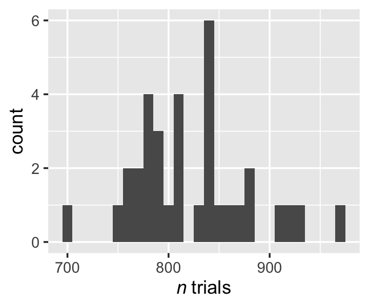

They also differ by their trial numbers, by `condition`.

``` r
kessler2022 %>% 
  count(Subject, condition) %>% 
  ggplot(aes(x = n)) +
  geom_histogram(binwidth = 5) +
  scale_y_continuous(breaks = 0:4 * 2) +
  xlab(expression(italic(n)~trials)) +
  facet_wrap(~ condition, nrow = 2, labeller = label_both)
```

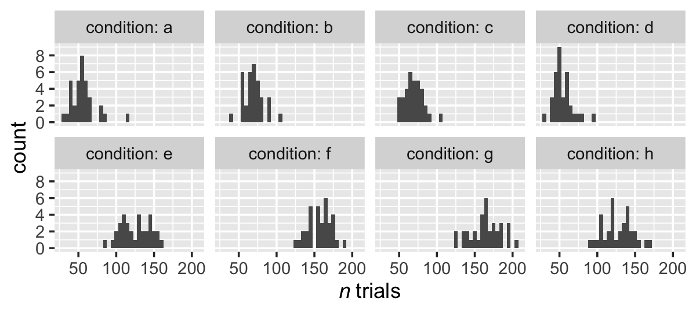

The reaction-time distributions also vary by trial type.

``` r
kessler2022 %>% 
  ggplot(aes(x = RT)) +
  geom_density(size = 0, fill = "black") +
  scale_x_continuous(breaks = 0:2 * 5000, labels = c(0, "5K", "10K")) +
  scale_y_continuous(NULL, breaks = NULL) +
  coord_cartesian(xlim = c(0, 10000)) +
  facet_wrap(~ condition, nrow = 2, labeller = label_both)
```

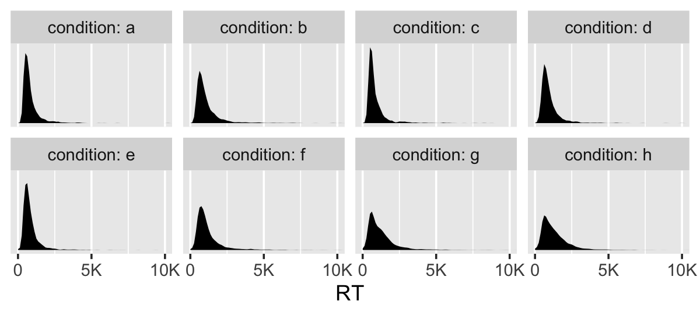

As is often the case, the reaction times (`RT`) have a long right tail,
the tips of which we excluded from the plot. This distribution will
heavily inform out choice of likelihood. Also notice that in every case,
the lower-end of the `RT` distribution nearly touches the lower-limit
zero. In fact, here are the minimum observed `RT` values, by
`condition`.

``` r
kessler2022 %>% 
  group_by(condition) %>% 
  summarise(min = min(RT))
```

    ## # A tibble: 8 × 2
    ##   condition   min
    ##   <chr>     <dbl>
    ## 1 a           275
    ## 2 b           203
    ## 3 c            27
    ## 4 d             8
    ## 5 e             6
    ## 6 f             4
    ## 7 g             5
    ## 8 h            13

It’s also the case these distributions differ across participants. To
get a sense, here are the median and interquartile ranges for the `RT`
distributions, by `condition` and a random subset of 5 of the
participants.

``` r
# define the random subset
set.seed(1)

random_subset <- kessler2022 %>% 
  distinct(Subject) %>% 
  slice_sample(n = 5) %>% 
  pull()

# subset the data
kessler2022 %>% 
  filter(Subject %in% random_subset) %>% 
  # summarise and wrangle
  group_by(Subject, condition) %>% 
  median_qi(RT, .width = .5) %>% 
  mutate(Subject = factor(Subject)) %>% 
  
  # plot
  ggplot(aes(x = RT, xmin = .lower, xmax = .upper, y = Subject)) +
  geom_pointrange(fatten = 1.5) +
  coord_cartesian(xlim = c(0, NA)) +
  ggtitle("Median and interquartile range, by Subject and condition") +
  facet_wrap(~ condition, nrow = 2, labeller = label_both) +
  theme(panel.grid = element_blank())
```

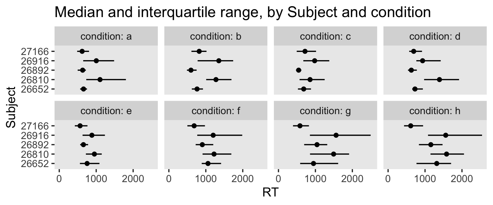

We see systemic difference in both central tendency (median) and spread
(interquartile range). To respect these individual difference, we need a
multilevel distributional model.

## Log-normal

Reaction-time data are positive, continuous, and typically have long
right tails. A variety of likelihoods can accommodate data with these
characteristics, such as the

-   exponential,
-   exponentially modified Gaussian,
-   gamma,
-   inverse-Gaussian,
-   log-normal (a.k.a. lognormal),
-   shifted lognormal, and
-   Weibull.

For these data, I’d like to practice using the log-normal. We can
describe the positive continuous variable *y* as log-normal with the
equation

$$
f(y) = \\frac{\\exp \\left( -\\frac{1}{2} \\left \[\\frac{\\log(y) - \\mu}{\\sigma} \\right\]^2 \\right)}{\\sigma y \\sqrt{2 \\pi}},
$$

where *μ* and *σ* are the mean and standard deviation of the natural
logarithm of *y*, not *y* itself. Thus for the log-normal, you might opt
to call *μ* and *σ* the *location* and *scale* to help make that
distinction. For the log-normal, the mean and standard deviation of *y*
follow the equations

$$
\\begin{align\*}
\\mu_y & = \\exp \\left (\\mu + \\frac{\\sigma^2}{2} \\right), \\text{and} \\\\
\\sigma_y & = \\sqrt{\[\\exp(\\sigma^2) + 1\] \\exp(2\\mu + \\sigma^2)}.
\\end{align\*}
$$

Notice how both *μ* and *σ* parameters define both *μ*<sub>*y*</sub> and
*σ*<sub>*y*</sub> for the log-normal. In other words, the mean and
standard deviation are distinguishable, but correlated with this
distribution. As the mean increases, the spread around the mean tends to
increase, too.

In the previous section, we mentioned the shifted log-normal
distribution another option for reaction-time data. The shifted
log-normal can be great when the bulk of your reaction-times and their
minimum values are a good distance from zero. Since the data from this
experiment are somewhat close to the zero-boundary, I’m not going to
practice with the shifted log-normal, here. But it’s not a bad option
and a critically-minded researcher could still try it out, if desired.

### Shopping models.

Given the log-normal likelihood, a pretty conventional way to model
these data would follow the equation

$$
\\begin{align\*}
\\text{RT}\_{ij} & \\sim \\operatorname{Log-Normal}(\\mu\_{ij}, \\sigma) \\\\
\\mu\_{ij} & = b\_{0i} + b\_{1i} \\text{SetSize}\_{ij} + b\_{2i} \\text{Updating}\_{ij} + b\_{3i} \\text{UpdateSwitch}\_{ij} \\\\
& \\;\\;\\; + b\_{4i} \\text{SetSize}\_{ij}\\text{Updating}\_{ij} + b\_{5i} \\text{SetSize}\_{ij}\\text{UpdateSwitch}\_{ij} + b\_{6i} \\text{Updating}\_{ij}\\text{UpdateSwitch}\_{ij} \\\\
& \\;\\;\\; + b\_{7i} \\text{SetSize}\_{ij}\\text{Updating}\_{ij}\\text{UpdateSwitch}\_{ij} \\\\
b\_{0i} & = \\beta_0 + u\_{0i} \\\\
b\_{1i} & = \\beta_1 + u\_{1i} \\\\
b\_{2i} & = \\beta_2 + u\_{2i} \\\\
b\_{3i} & = \\beta_3 + u\_{3i} \\\\
b\_{4i} & = \\beta_4 + u\_{4i} \\\\
b\_{5i} & = \\beta_5 + u\_{5i} \\\\
b\_{6i} & = \\beta_6 + u\_{6i} \\\\
b\_{7i} & = \\beta_7 + u\_{7i} \\\\
\\begin{bmatrix} u\_{0i} \\\\ \\vdots \\\\ u\_{7i} \\end{bmatrix} & \\sim \\operatorname{Normal}(\\mathbf 0, \\mathbf \\Sigma)
\\end{align\*}
$$

where reaction-times vary across *i* persons and *j* measurement
occasions. The *μ*<sub>*i**j*</sub> model is defined by three levels of
*b* coefficients. At the first level, we have the intercept
*b*<sub>0*i*</sub> and the lower-level coefficients for the three
independent variables, *b*<sub>1*i*</sub> through *b*<sub>3*i*</sub>. At
the next level, *b*<sub>4*i*</sub> through *b*<sub>6*i*</sub> are the
three two-way interaction terms for the independent variables. At the
third level, you have the three-way interaction term *b*<sub>7*i*</sub>.
As indicated by their *i* subscripts, each *b* parameter may be
decomposed to a grand mean *β* and person-level deviation term *u*.
Further, the eight *u* deviation terms are modeled as multivariate
normal with a mean vector of zeros and an 8 × 8 variance/covariance
matrix **Σ**.

With that big 8 × 8 variance/covariance matrix, this is an expensive
model to fit and I’m going to suggest we consider a different kind of
model. Using the `condition` variable in place of our three focal
independent variables, we can fit the model

$$
\\begin{align\*}
\\text{RT}\_{ijk} & \\sim \\operatorname{Log-Normal}(\\mu\_{ijk}, \\sigma) \\\\
\\mu\_{ijk}           & = \\beta_0 + u\_{1i} + u\_{2j} + u\_{3ij} \\\\
u\_{1i}  & \\sim \\operatorname{Normal}(0, \\sigma\_{u_1}) \\\\
u\_{2j}  & \\sim \\operatorname{Normal}(0, \\sigma\_{u_2}) \\\\
u\_{3ij} & \\sim \\operatorname{Normal}(0, \\sigma\_{u_3})
\\end{align\*}
$$

where now reaction times vary across *i* persons, *j* conditions, and
*k* trials. Here *β*<sub>0</sub> is the grand mean and we have three
deviation terms: *u*<sub>1*i*</sub> captures the overall person-level
deviations, *u*<sub>2*i*</sub> captures the overall condition-level
deviations, and *u*<sub>3*i*</sub> captures the interaction between the
person- and condition-level deviations. Each of these deviations is
modeled as normally distributed with a mean at zero (they are
deviations, after all) and standard-deviation parameter $ \_{u_x}$.

An insight still missing from this model is that will not allow us to
detect differences in *σ* the data might contain among persons and
conditions. Thus we can extend the multilevel log-normal model to a
fully distributional model with

$$
\\begin{align\*}
\\text{RT}\_{ijk} & \\sim \\operatorname{Log-Normal}(\\mu\_{ijk}, \\sigma\_{ijk}) \\\\
\\mu\_{ijk}           & = \\beta_0 + u\_{1i} + u\_{2j} + u\_{3ij} \\\\
\\log (\\sigma\_{ijk}) & = \\eta_0 + v\_{1i} + v\_{2j} + v\_{3ij} \\\\
u\_{1i}  & \\sim \\operatorname{Normal}(0, \\sigma\_{u_1}) \\\\
u\_{2j}  & \\sim \\operatorname{Normal}(0, \\sigma\_{u_2}) \\\\
u\_{3ij} & \\sim \\operatorname{Normal}(0, \\sigma\_{u_3}) \\\\
v\_{1i}  & \\sim \\operatorname{Normal}(0, \\sigma\_{v_1}) \\\\
v\_{2j}  & \\sim \\operatorname{Normal}(0, \\sigma\_{v_2}) \\\\
v\_{3ij} & \\sim \\operatorname{Normal}(0, \\sigma\_{v_3}),
\\end{align\*}
$$

where log (*σ*<sub>*i**j**k*</sub>) has its own linear model,
characterized by a grand mean *η*<sub>0</sub> and three deviation terms,
*v*<sub>1*i*</sub> through *v*<sub>3*i*</sub>. As in other contexts, we
model log (*σ*<sub>*i**j**k*</sub>) instead of *σ*<sub>*i**j**k*</sub>
to ensure positive values.

### Pulling priors.

Now we have the basic model in mind, we need to select our priors. As
the multilevel distributional log-normal approach is not commonly used
by reaction-time researchers, we won’t be able to pull our priors from
previous models in the literature. We can, however, get a sense of
typical reaction-time distributions from previous literature. In our
case, we’ll restrict our literature search to the articles Kessler et al
(2022) highlighted in the tail end of their introduction section.
Unfortunately, some of the articles they cited (e.g., Kessler &
Oberauer, 2014, 2015) did not report the sample statistics for the
reaction times. Happily, Oberauer (2002) did report means and standard
deviations for reaction-times in a variety of switch/non-switch
conditions in Table 1 (p. 418). The means range between 1, 200 and
2, 600 and the standard deviations range between 200 and 900. A
difficulty with these sample statistics is they are based on trimmed
samples where low and high values have been omitted (see pp. 414, 417).
As in the paper, a common practice is to trim large reaction-time values
which are some number of standard deviations greater than the mean.
However, with our use of log-normal likelihood, we don’t need to omit
large reaction-time values. The model expects a small number of very
large values. So if we are to use Oberauer’s sample statistics to inform
out priors, we might expect our means and standard deviations will be on
the higher end.

As a place to start, I’d like my priors to describe a population mean at
2, 000 milliseconds and a liberal standard deviation of 900. Here we’ll
save those values as `m` and `s` for further use.

``` r
m <- 2000  # expected mean based on prior literature
s <- 900   # expected standard deviation based on prior literature
```

Our next challenge is to find a way to express these mean and standard
deviation values in terms of the log-normal location *μ* and scale *σ*
parameters. Using the [method of
moments](https://www.real-statistics.com/distribution-fitting/method-of-moments/method-of-moments-lognormal-distribution/),
we can define the best-fitting log-normal *μ* and *σ* parameters for our
mean and standard deviation with the equations

$$
\\begin{align\*}
\\mu & = \\log\\left ( \\bar y \\Bigg / \\sqrt{\\frac{s^2}{\\bar y^2} + 1} \\right), \\text{and} \\\\
\\sigma & = \\sqrt{\\log \\left(\\frac{s^2}{\\bar y^2} + 1 \\right)}.
\\end{align\*}
$$

Here’s what that looks like in code.

``` r
mu    <- log(m / sqrt(s^2 / m^2 + 1))
sigma <- sqrt(log(s^2 / m^2 + 1))

mu 
```

    ## [1] 7.508701

``` r
sigma
```

    ## [1] 0.4294214

Next we need to consider how certain or uncertain our priors should be
around these values. This can be very abstract, at first, and I find
simulating from potential priors can help. For *μ*, I propose a normal
prior centered on 7.5, but with a standard deviation of 0.6. Before we
set the prior for *σ*, recall that the **brms** default will be to model
log (*σ*) to ensure the results are always positive. Thus, I propose a
normal prior for log (*σ*) with a mean of log (0.4) and a standard
deviation of 0.2. Now draw 10, 000 values from the priors and save the
results in a data set called `priors`.

``` r
set.seed(1)

priors <- tibble(
  mu    = rnorm(n = 10000, mean = mu, sd = 0.6),
  sigma = rnorm(n = 10000, mean = log(sigma), sd = 0.2) %>% exp())
```

To convert out priors out of the log-normal location and scale
prarmeters and back into the more-familiar mean and standard deviation
metrics, we’ll make a couple of funcitons based on the equations, above.

``` r
ln_mean <- function(mu, sigma) {
  exp(mu + (0.5 * sigma^2))
}

ln_sd <- function(mu, sigma) {
  v <- (exp(sigma^2) - 1) * exp(2 * mu + sigma^2)
  return(sqrt(v))
}
```

Now we can use our custom `ln_mean()` and `ln_sd()` functions to plot
the prior predictive distributions for our sample statistics.

``` r
priors %>% 
  # compute the sample statistics
  mutate(mean = ln_mean(mu, sigma),
         sd = ln_sd(mu, sigma)) %>% 
  # wrangle
  pivot_longer(mean:sd) %>% 

  # plot
  ggplot(aes(x = value, y = 0)) +
  stat_halfeye(.width = c(.5, .90)) +
  scale_x_continuous("reaction time (milliseconds)", breaks = 0:10 * 2000) +
  scale_y_continuous(NULL, breaks = NULL) +
  ggtitle("Prior predictive distributions for the sample statistics",
          subtitle = "The dots are the medians and the horizontal lines are the percentile-based 50% and 90% intervals.") +
  coord_cartesian(xlim = c(0, 10000)) +
  facet_wrap(~ name)
```

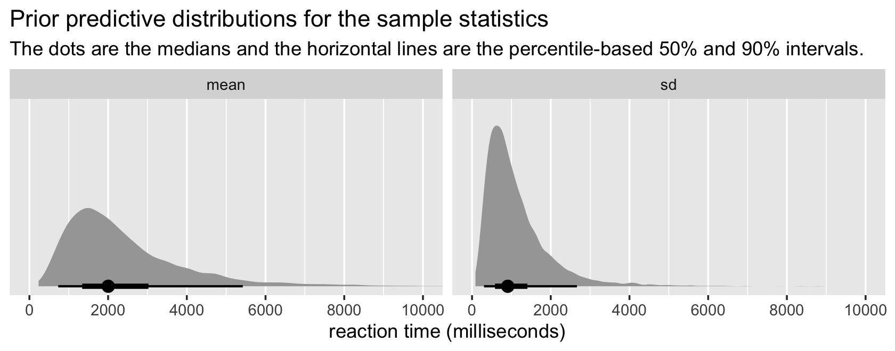

What may have initially seed like narrow priors ended up pretty generous
on the milliseconds scale. If desired, you can use the handy
`median_qi()` function to compute the precise values for the prior
predictive medians, 50% and 90% ranges.

``` r
priors %>% 
  mutate(mean = ln_mean(mu, sigma),
         sd = ln_sd(mu, sigma)) %>% 
  pivot_longer(mean:sd, names_to = "statistic") %>% 
  group_by(statistic) %>% 
  median_qi(value, .width = c(.5, .9)) %>% 
  mutate_at(.vars = vars(value:.upper), round, digits = 0)
```

    ## # A tibble: 4 × 7
    ##   statistic value .lower .upper .width .point .interval
    ##   <chr>     <dbl>  <dbl>  <dbl>  <dbl> <chr>  <chr>    
    ## 1 mean       2003   1342   3024    0.5 median qi       
    ## 2 sd          907    583   1406    0.5 median qi       
    ## 3 mean       2003    733   5422    0.9 median qi       
    ## 4 sd          907    303   2665    0.9 median qi

In addition to focusing on the sample-statistics implications of our
prior predictive distribution, we might also plot several credible
reaction-time distributions implied by our priors. In this case, we’ll
plot 100.

``` r
set.seed(1)

priors %>% 
  mutate(draw = 1:n()) %>% 
  slice_sample(n = 100) %>% 
  expand(nesting(draw, mu, sigma),
         rt = seq(from = 1, to = 11000, by = 10)) %>% 
  mutate(d = dlnorm(rt, mu, sigma)) %>% 
  
  ggplot(aes(x = rt, y = d, group = draw)) +
  geom_line(alpha = 1/2, size = 1/4) +
  scale_x_continuous("reaction time (milliseconds)", breaks = 0:10 * 2000) +
  scale_y_continuous(NULL, breaks = NULL) +
  ggtitle("Prior predictive distributions for reation times (100 draws)") +
  coord_cartesian(xlim = c(0, 10000))
```

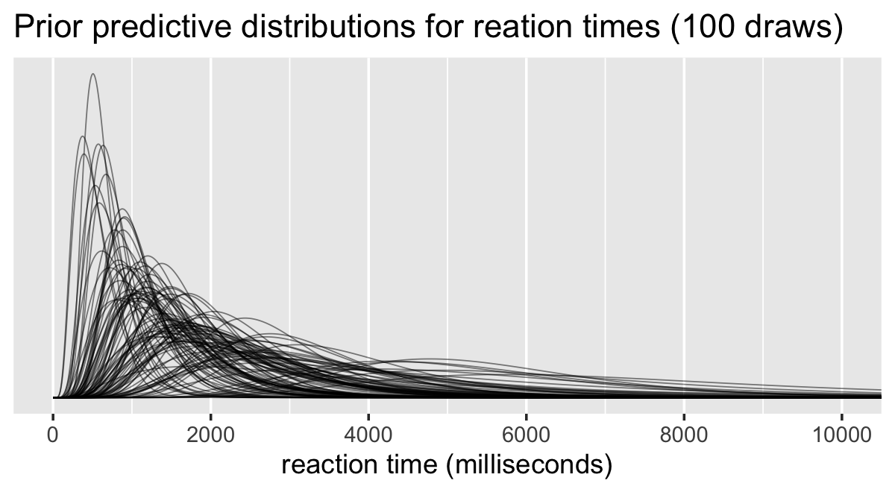

So far, it looks like our priors allow for a variety of response-time
distributions within a credible range. If anything, our priors might be
overly permissive. Feel free to experiment on your own by altering the
code, above.

Now we have our population priors nailed down, the next choice is the
priors for our 6 upper-level *σ*<sub>*u*</sub> and *σ*<sub>*v*</sub>
parameters. Here I’m going to recommend we use the exponential prior
with a rate (i.e., inverse mean) of 1. In my experience, these priors
are good defaults when you’re working with a new model and/or data type.
They put a lot of prior mass between 0 and 1, which is regularizing, but
their gently right-sloping tails esily allow for larger values, if
needed.

Thus, we can express the full model as

$$
\\begin{align\*}
\\text{RT}\_{ijk} & \\sim \\operatorname{Log-Normal}(\\mu\_{ijk}, \\sigma\_{ijk}) \\\\
\\mu\_{ijk}           & = \\beta_0 + u\_{1i} + u\_{2j} + u\_{3ij} \\\\
\\log (\\sigma\_{ijk}) & = \\eta_0 + v\_{1i} + v\_{2j} + v\_{3ij} \\\\
u\_{1i}  & \\sim \\operatorname{Normal}(0, \\sigma\_{u_1}) \\\\
u\_{2j}  & \\sim \\operatorname{Normal}(0, \\sigma\_{u_2}) \\\\
u\_{3ij} & \\sim \\operatorname{Normal}(0, \\sigma\_{u_3}) \\\\
v\_{1i}  & \\sim \\operatorname{Normal}(0, \\sigma\_{v_1}) \\\\
v\_{2j}  & \\sim \\operatorname{Normal}(0, \\sigma\_{v_2}) \\\\
v\_{3ij} & \\sim \\operatorname{Normal}(0, \\sigma\_{v_3}) \\\\
\\beta_0 & \\sim \\operatorname{Normal}(7.508701, 0.6)  \\\\
\\eta_0  & \\sim \\operatorname{Normal}(\\log(0.4294214), 0.2) \\\\
\\sigma\_{u_1}, \\dots, \\sigma\_{v_3} & \\sim \\operatorname{Exponential}(1)
\\end{align\*}
$$

## Fit the log-normal distributional model with **brms**

Here’s how we might use `brms::brm()` to fit our model. Notice how the
submodels for *μ*<sub>*i**j**k*</sub> and log (*σ*<sub>*i**j**k*</sub>)
are both wrapped in the `bf()` function. To stave off a few divergent
transitions, we had to adjust the default `adapt_delta` settings.

``` r
# 1.085278 hours
fit1 <- brm(
  data = kessler2022,
  family = lognormal,
  bf(RT    ~ 1 + (1 | Subject) + (1 | condition) + (1 | Subject:condition),
     sigma ~ 1 + (1 | Subject) + (1 | condition) + (1 | Subject:condition)),
  prior = c(prior(normal(7.508701, 0.6), class = Intercept),
            prior(normal(log(0.4294214), 0.2), class = Intercept, dpar = sigma),
            prior(exponential(1), class = sd)),
  cores = 4, seed = 1,
  control = list(adapt_delta = .9),
  file = "fits/fit1.kessler2022"
)
```

Review the parameter summary.

``` r
print(fit1)
```

    ##  Family: lognormal 
    ##   Links: mu = identity; sigma = log 
    ## Formula: RT ~ 1 + (1 | Subject) + (1 | condition) + (1 | Subject:condition) 
    ##          sigma ~ 1 + (1 | Subject) + (1 | condition) + (1 | Subject:condition)
    ##    Data: kessler2022 (Number of observations: 27992) 
    ##   Draws: 4 chains, each with iter = 2000; warmup = 1000; thin = 1;
    ##          total post-warmup draws = 4000
    ## 
    ## Group-Level Effects: 
    ## ~condition (Number of levels: 8) 
    ##                     Estimate Est.Error l-95% CI u-95% CI Rhat Bulk_ESS Tail_ESS
    ## sd(Intercept)           0.19      0.06     0.10     0.35 1.00      975     1595
    ## sd(sigma_Intercept)     0.15      0.06     0.08     0.30 1.00     1086     2009
    ## 
    ## ~Subject (Number of levels: 34) 
    ##                     Estimate Est.Error l-95% CI u-95% CI Rhat Bulk_ESS Tail_ESS
    ## sd(Intercept)           0.26      0.04     0.21     0.35 1.01      515     1270
    ## sd(sigma_Intercept)     0.23      0.03     0.17     0.30 1.00      716     1268
    ## 
    ## ~Subject:condition (Number of levels: 272) 
    ##                     Estimate Est.Error l-95% CI u-95% CI Rhat Bulk_ESS Tail_ESS
    ## sd(Intercept)           0.14      0.01     0.13     0.16 1.01      994     1825
    ## sd(sigma_Intercept)     0.17      0.01     0.15     0.19 1.00     1055     2110
    ## 
    ## Population-Level Effects: 
    ##                 Estimate Est.Error l-95% CI u-95% CI Rhat Bulk_ESS Tail_ESS
    ## Intercept           6.78      0.08     6.62     6.95 1.01      489      823
    ## sigma_Intercept    -0.76      0.07    -0.90    -0.64 1.00      743     1321
    ## 
    ## Draws were sampled using sampling(NUTS). For each parameter, Bulk_ESS
    ## and Tail_ESS are effective sample size measures, and Rhat is the potential
    ## scale reduction factor on split chains (at convergence, Rhat = 1).

Clearly, this model summary is dominated by the level-2
*σ*<sub>*u*</sub> and *σ*<sub>*v*</sub> parameters. To get a sense,
we’ll plot the population level *μ*<sub>condition</sub> and
*σ*<sub>condition</sub> summaries, the variation in which are what the
*σ*<sub>*u*<sub>2</sub></sub> and *σ*<sub>*v*<sub>2</sub></sub>
parameters are summarizing.

``` r
rbind(
  coef(fit1)$condition[, -2, "Intercept"],
  coef(fit1)$condition[, -2, "sigma_Intercept"] %>% exp()
) %>% 
  data.frame() %>%
  mutate(condition = rep(letters[1:8], times = 2),
         parameter = rep(c("mu[italic(j)]", "sigma[italic(j)]"), each = 8)) %>% 
  
  ggplot(aes(x = Estimate, xmin = Q2.5, xmax = Q97.5, y = condition)) +
  geom_pointrange(fatten = 2) +
  labs(title = expression("Log-normal population parameters, by condition "(italic(j))),
       x = "marginal posterior") +
  facet_wrap(~ parameter, scales = "free_x", labeller = label_parsed) +
  theme(panel.grid = element_blank())
```

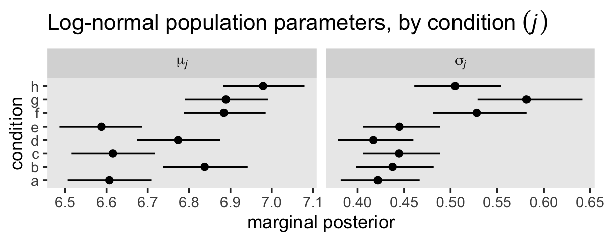

See all the spread in both parameter types? That’s why we have those
level-2 standard-deviation parameters. Though we aren’t showing them,
look back at the `print()` summary above to see that the model expects
even more variation among the participants than the conditions. This is
why we fit multilevel models–to respect the variation.

### Population-level IV contrasts.

Even though it might not be obvious by the parameter summaries in the
`print()` output, our `fit1` model will allow us to compare the various
experimental conditions in any number of ways. Probably the easiest
approach will be with the `fitted()` function. To use `fitte()`, we’ll
want to make a data set with the desired levels of `condition` and/or
`Subject`. If the goal is to compare the different levels of `condition`
at the population level, we’ll first save those levels and their
`SetSize`, `Updating` and `UpdateSwitch` counterparts in a data frame
called `nd_pop`, which stands for the population-level new data.

``` r
nd_pop <- kessler2022 %>% 
  distinct(condition, SetSize, Updating, UpdateSwitch) %>% 
  select(condition, SetSize, Updating, UpdateSwitch) %>% 
  arrange(condition)

# what is this?
nd_pop
```

    ## # A tibble: 8 × 4
    ##   condition SetSize Updating  UpdateSwitch
    ##   <chr>       <dbl> <chr>     <chr>       
    ## 1 a               1 no_update repeat      
    ## 2 b               1 no_update switch      
    ## 3 c               1 update    repeat      
    ## 4 d               1 update    switch      
    ## 5 e               2 no_update repeat      
    ## 6 f               2 no_update switch      
    ## 7 g               2 update    repeat      
    ## 8 h               2 update    switch

To make `nd_pop`, we actually only needed the `condition` column. The
reason we included `SetSize` through `UpdateSwitch` was to make it
easier during some of the data-wrangling phases, to come. If you’re
following along with code on your own, you’ll thank me later.

Next we extract the full posterior distributions of the model-based mean
response-time values for each level of `condition` and format the
results.

``` r
f_pop <- fitted(
  fit1,
  newdata = nd_pop,
  re_formula = ~ (1 | condition),
  summary = F) %>% 
  data.frame() %>% 
  set_names(letters[1:8]) 

# what is this?
glimpse(f_pop)
```

    ## Rows: 4,000
    ## Columns: 8
    ## $ a <dbl> 842.2153, 752.6436, 774.9393, 756.3418, 747.1729, 742.8670, 750.2484, 766.7111, 783.5043, 807.2214…
    ## $ b <dbl> 1000.8036, 1074.3081, 1070.8472, 998.5878, 969.5328, 996.9506, 1023.3745, 1010.6163, 947.9195, 953…
    ## $ c <dbl> 831.1448, 800.6039, 775.8506, 753.6410, 754.9153, 780.9867, 762.3547, 777.6543, 795.6518, 810.7491…
    ## $ d <dbl> 976.6442, 913.3564, 910.5564, 894.8628, 897.1116, 899.2498, 903.1440, 893.4830, 907.2597, 906.8048…
    ## $ e <dbl> 837.1034, 795.5707, 773.5319, 778.2005, 748.3681, 764.9688, 767.4239, 765.5570, 774.6577, 791.8874…
    ## $ f <dbl> 1079.663, 1125.726, 1115.650, 1106.109, 1105.261, 1097.657, 1149.043, 1163.798, 1105.092, 1103.636…
    ## $ g <dbl> 1115.025, 1190.261, 1121.808, 1093.852, 1148.669, 1108.290, 1156.923, 1168.525, 1103.606, 1138.063…
    ## $ h <dbl> 1281.495, 1136.528, 1191.458, 1167.341, 1168.444, 1134.965, 1156.946, 1158.536, 1197.380, 1200.516…

Here’s how we would work with `f_pop` to make the simple contrasts of
the two levels of `SetSize`, the two levels of `Updating`, and the two
levels of `UpdateSwitch`.

``` r
f_pop %>% 
  transmute(`SetSize[2] - SetSize[1]` = (e + f + g + h) / 4 - (a + b + c + d) / 4,
            `update - no update`      = (c + d + g + h) / 4 - (a + b + e + f) / 4,
            `switch - repeat`         = (b + d + f + h) / 4 - (a + c + e + g) / 4) %>% 
  pivot_longer(everything()) %>% 
  group_by(name) %>% 
  mean_qi(value) %>% 
  select(name:.upper) %>% 
  mutate_if(is.double, round, digits = 0)
```

    ## # A tibble: 3 × 4
    ##   name                    value .lower .upper
    ##   <chr>                   <dbl>  <dbl>  <dbl>
    ## 1 SetSize[2] - SetSize[1]   174    134    217
    ## 2 switch - repeat           182    143    225
    ## 3 update - no update        101     63    139

The results are population-level mean differences in milliseconds,
summarized by their posterior means and 95% intervals.

The focal variables in Kessler et al (2022) were `SetSize` and
`Updating`. Here we’ll use `f_pop` to compute the contrasts for
`SetSize`, based on the two levels of `Updating`. Then we’ll compute the
difference in differences. Finally, we’ll plot the results with
`stat_halfeye()`.

``` r
levels <- c("difference[update] - difference[no~update]", "difference[no~update]", "difference[update]")

f_pop %>% 
  transmute(`difference[update]`    = (g + h) / 2 - (c + d) / 2,
            `difference[no~update]` = (e + f) / 2 - (a + b) / 2) %>% 
  mutate(`difference[update] - difference[no~update]` = `difference[update]` - `difference[no~update]`) %>% 
  pivot_longer(everything()) %>% 
  mutate(name = factor(name, levels = levels)) %>% 
  
  ggplot(aes(x = value, y = name)) +
  geom_vline(xintercept = 0, color = "white") +
  stat_halfeye(.width = .95) +
  scale_y_discrete(NULL, labels = ggplot2:::parse_safe) +
  labs(title = "SetSize contrasts, given update or no update",
       subtitle = expression("The two simple contrasts are based on "*SetSize[2]-SetSize[1]*". The final is a difference in differences."),
       x = "difference (milliseconds)") +
  coord_cartesian(xlim = c(-100, 450),
                  ylim = c(1.4, 3.3)) +
  theme(axis.text.y = element_text(hjust = 0),
        axis.ticks.y = element_blank(),
        panel.grid = element_blank(),
        plot.title.position = "plot")
```

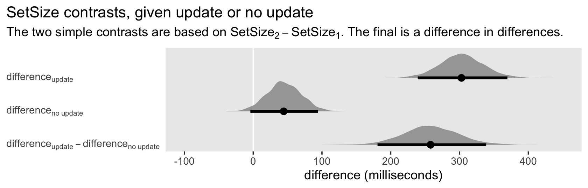

Here are the corresponding contrasts, but this based on `SetSize` and
`UpdateSwitch`.

``` r
# note, you have to put repeat within quotes to render properly with plotmath
levels <- c("difference[switch] - difference['repeat']", "difference['repeat']", "difference[switch]")

f_pop %>% 
  transmute(`difference[switch]`   = (f + h) / 2 - (b + d) / 2,
            `difference['repeat']` = (e + g) / 2 - (a + c) / 2) %>% 
  mutate(`difference[switch] - difference['repeat']` = `difference[switch]` - `difference['repeat']`) %>% 
  pivot_longer(everything()) %>% 
  mutate(name = factor(name, levels = levels)) %>% 
  
  ggplot(aes(x = value, y = name)) +
  geom_vline(xintercept = 0, color = "white") +
  stat_halfeye(.width = .95) +
  scale_y_discrete(NULL, labels = ggplot2:::parse_safe) +
  labs(title = "SetSize contrasts, given switch or repeat",
       subtitle = expression("The two simple contrasts are based on "*SetSize[2]-SetSize[1]*". The final is a difference in differences."),
       x = "difference (milliseconds)") +
  coord_cartesian(xlim = c(-100, 450),
                  ylim = c(1.4, 3.3)) +
  theme(axis.text.y = element_text(hjust = 0),
        axis.ticks.y = element_blank(),
        panel.grid = element_blank(),
        plot.title.position = "plot")
```

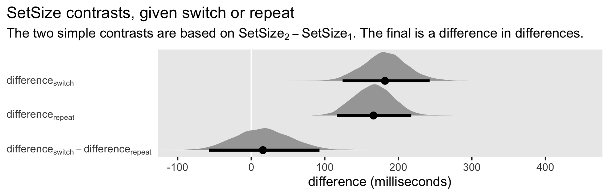

### Participant-level IV contrasts.

An advantage of our multilevel model approach is we can go beyond simple
population contrasts to see how the results hold up within each of our
participants. First, we’ll make a new data object that defines the 8
levels of `condition` for each of the participants.

``` r
nd_sub <- kessler2022 %>% 
  # you only need Subject and condition, but SetSize:UpdateSwitch can help the intermediary data wrangling
  distinct(Subject, condition, SetSize, Updating, UpdateSwitch) %>% 
  select(Subject, condition, SetSize, Updating, UpdateSwitch) %>% 
  arrange(Subject, condition) %>% 
  mutate(row = 1:n())

# what is this?
glimpse(nd_sub)
```

    ## Rows: 272
    ## Columns: 6
    ## $ Subject      <dbl> 25197, 25197, 25197, 25197, 25197, 25197, 25197, 25197, 26634, 26634, 26634, 26634, 266…
    ## $ condition    <chr> "a", "b", "c", "d", "e", "f", "g", "h", "a", "b", "c", "d", "e", "f", "g", "h", "a", "b…
    ## $ SetSize      <dbl> 1, 1, 1, 1, 2, 2, 2, 2, 1, 1, 1, 1, 2, 2, 2, 2, 1, 1, 1, 1, 2, 2, 2, 2, 1, 1, 1, 1, 2, …
    ## $ Updating     <chr> "no_update", "no_update", "update", "update", "no_update", "no_update", "update", "upda…
    ## $ UpdateSwitch <chr> "repeat", "switch", "repeat", "switch", "repeat", "switch", "repeat", "switch", "repeat…
    ## $ row          <int> 1, 2, 3, 4, 5, 6, 7, 8, 9, 10, 11, 12, 13, 14, 15, 16, 17, 18, 19, 20, 21, 22, 23, 24, …

Next we extract the full posterior distributions of the model-based mean
response-time values for each level of `condition` and format the
results.

``` r
# use fitted()
f_sub <- fitted(
  fit1,
  newdata = nd_sub,
  summary = F) %>% 
  data.frame() %>% 
  set_names(1:nrow(nd_sub)) 

# wrangle
f_sub <- f_sub %>% 
  mutate(draw = 1:n()) %>% 
  pivot_longer(-draw, names_to = "row") %>% 
  mutate(row = as.double(row)) %>% 
  left_join(nd_sub %>% select(Subject, condition, row), by = "row") %>% 
  select(-row) %>% 
  pivot_wider(names_from = condition, values_from = value)

# what is this?
glimpse(f_sub)
```

    ## Rows: 136,000
    ## Columns: 10
    ## $ draw    <int> 1, 1, 1, 1, 1, 1, 1, 1, 1, 1, 1, 1, 1, 1, 1, 1, 1, 1, 1, 1, 1, 1, 1, 1, 1, 1, 1, 1, 1, 1, 1,…
    ## $ Subject <dbl> 25197, 26634, 26636, 26646, 26652, 26660, 26669, 26685, 26698, 26702, 26722, 26734, 26744, 2…
    ## $ a       <dbl> 819.9502, 577.9551, 1016.5303, 623.8585, 697.8228, 681.2981, 611.5669, 968.9889, 837.7188, 7…
    ## $ b       <dbl> 840.3565, 674.2906, 1494.2559, 777.8516, 860.8385, 1018.0503, 737.0901, 1138.6069, 1145.2092…
    ## $ c       <dbl> 681.5049, 560.0442, 910.2549, 560.2195, 776.0372, 1017.9613, 606.6934, 963.8398, 983.9635, 6…
    ## $ d       <dbl> 914.1363, 699.9314, 1128.2617, 688.1948, 813.5191, 762.0021, 735.2292, 998.3046, 950.0818, 8…
    ## $ e       <dbl> 826.6023, 612.2776, 808.9260, 610.4807, 886.5184, 707.7526, 605.1085, 984.6174, 904.4136, 83…
    ## $ f       <dbl> 1133.4078, 905.1762, 973.1234, 844.8336, 1268.4275, 1194.0139, 1175.7392, 1390.7115, 1070.65…
    ## $ g       <dbl> 1429.3189, 1015.7757, 1170.3946, 890.6339, 1143.5385, 1092.4913, 1278.8492, 1327.4936, 1429.…
    ## $ h       <dbl> 1535.0874, 1128.3346, 1190.9401, 884.1176, 1293.0494, 952.9073, 1088.7520, 1542.4975, 1407.0…

Now we’ll compute and plot the `SetSize`- and `Updating`-based contrasts
for 34 participants.

``` r
# define the factor levels
levels <- c("difference[update] - difference[no~update]", "difference[no~update]", "difference[update]")

# compute the differences by Subject and summarize
f_update <- f_sub %>% 
  mutate(`difference[update]`    = (g + h) / 2 - (c + d) / 2,
         `difference[no~update]` = (e + f) / 2 - (a + b) / 2) %>% 
  mutate(`difference[update] - difference[no~update]` = `difference[update]` - `difference[no~update]`) %>% 
  pivot_longer(contains("difference")) %>% 
  mutate(name = factor(name, levels = levels)) %>% 
  group_by(Subject, name) %>% 
  mean_qi(value)

# compute a rank ordering by difference[update]
f_update_ranks <- f_update %>% 
  filter(name == "difference[update]") %>% 
  arrange(value) %>% 
  mutate(rank = 1:n()) %>% 
  select(Subject, rank)

# add the rank to the differences
f_update %>% 
  left_join(f_update_ranks, by = "Subject") %>% 
  mutate(name = fct_rev(name)) %>% 
  
  # plot!
  ggplot(aes(x = value, xmin = .lower, xmax = .upper, y = rank)) +
  geom_vline(xintercept = 0, color = "white") +
  geom_pointrange(fatten = 1) +
  scale_y_continuous(expression(rank~by~difference[update]), breaks = NULL) +
  labs(title = "Participant-level SetSize contrasts, given the update or no update condition",
       subtitle = expression("The two simple contrasts are based on "*SetSize[2]-SetSize[1]*". The final is a difference in differences."),
       x = "difference (milliseconds)") +
  coord_cartesian(xlim = c(-950, 1200)) +
  facet_wrap(~ name, labeller = label_parsed) +
  theme(axis.text.y = element_text(hjust = 0),
        axis.ticks.y = element_blank(),
        panel.grid = element_blank(),
        plot.title.position = "plot")
```

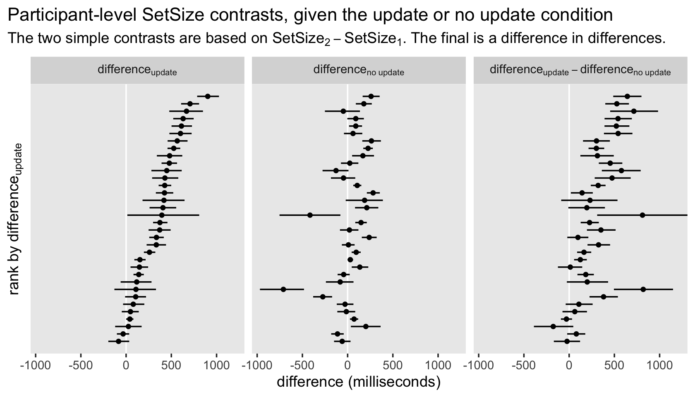

Look at all that heterogeneity!

Here’s the same analysis, but for the `SetSize`- and
`UpdateSwitch`-based contrasts for each participant.

``` r
# define the factor levels
levels <- c("difference[switch] - difference['repeat']", "difference['repeat']", "difference[switch]")

# compute the differences by Subject and summarize
f_update <- f_sub %>% 
  mutate(`difference[switch]`   = (f + h) / 2 - (b + d) / 2,
         `difference['repeat']` = (e + g) / 2 - (a + c) / 2) %>% 
  mutate(`difference[switch] - difference['repeat']` = `difference[switch]` - `difference['repeat']`) %>% 
  pivot_longer(contains("difference")) %>% 
  mutate(name = factor(name, levels = levels)) %>% 
  group_by(Subject, name) %>% 
  mean_qi(value)

# compute a rank ordering by difference[switch]
f_update_ranks <- f_update %>% 
  filter(name == "difference[switch]") %>% 
  arrange(value) %>% 
  mutate(rank = 1:n()) %>% 
  select(Subject, rank)

# add the rank to the differences
f_update %>% 
  left_join(f_update_ranks, by = "Subject") %>% 
  mutate(name = fct_rev(name)) %>% 
  
  # plot!
  ggplot(aes(x = value, xmin = .lower, xmax = .upper, y = rank)) +
  geom_vline(xintercept = 0, color = "white") +
  geom_pointrange(fatten = 1) +
  scale_y_continuous(expression(rank~by~difference[switch]), breaks = NULL) +
  labs(title = "Participant-level SetSize contrasts, given the switch or repeat condition",
       subtitle = expression("The two simple contrasts are based on "*SetSize[2]-SetSize[1]*". The final is a difference in differences."),
       x = "difference (milliseconds)") +
  coord_cartesian(xlim = c(-950, 1200)) +
  facet_wrap(~ name, labeller = label_parsed) +
  theme(axis.text.y = element_text(hjust = 0),
        axis.ticks.y = element_blank(),
        panel.grid = element_blank(),
        plot.title.position = "plot")
```

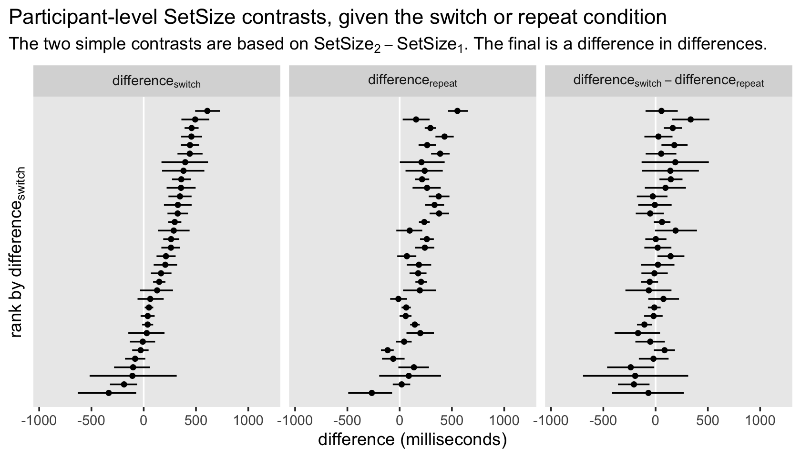

### Line lots.

Another way to examine the output is to plot the results for the
experimental conditions at the population and participant levels. In
addition to the population-means, it might also be interesting to use
`brms::predict()` to show the posterior-predictive distribution.

``` r
set.seed(1)

p_pop <- predict(
  fit1,
  newdata = nd_pop,
  re_formula = ~ (1 | condition),
  summary = F) %>% 
  data.frame() %>% 
  set_names(letters[1:8])

# what is this?
glimpse(p_pop)
```

    ## Rows: 4,000
    ## Columns: 8
    ## $ a <dbl> 589.4710, 750.0667, 517.5824, 1355.1909, 785.6946, 486.7413, 842.9293, 958.9124, 914.8003, 647.255…
    ## $ b <dbl> 556.2976, 1361.6744, 1248.4990, 499.9907, 368.4955, 1172.7761, 489.6265, 1893.1180, 1946.3909, 159…
    ## $ c <dbl> 850.7679, 496.9594, 385.1781, 1382.3524, 359.8211, 655.6878, 1086.9376, 899.3485, 1006.0065, 614.6…
    ## $ d <dbl> 608.4064, 1493.5407, 1577.8765, 972.7407, 789.5701, 900.9382, 795.1717, 677.9161, 1051.7926, 455.5…
    ## $ e <dbl> 1094.6381, 350.2198, 641.3409, 455.5742, 396.5225, 348.9446, 492.8795, 559.3193, 725.2771, 1340.82…
    ## $ f <dbl> 1059.4605, 1107.9259, 699.0820, 347.3139, 1690.7528, 800.7245, 424.0174, 1497.0808, 2834.4512, 141…
    ## $ g <dbl> 1394.3880, 701.5364, 436.2964, 337.9888, 1305.6521, 1048.9537, 3393.8443, 4254.2872, 1858.8810, 60…
    ## $ h <dbl> 1825.1878, 994.6709, 920.4802, 1466.7297, 2870.6749, 819.2534, 1187.6702, 1318.0286, 553.3094, 139…

The output is very much like `f_pop`, but as these are for the
conditional distributions, their widths will be much wider.

Before we plot, we’ll want to redefine our factor `levels` for the
conditions and save a mini `text` data frame which will help annotate
one of the plots.

``` r
levels <- c("SetSize 1\nupdate", "SetSize 2\nupdate", "SetSize 1\nno update", "SetSize 2\nno update")

text <- p_pop %>% 
  transmute(`SetSize 2\nno update` = (e + f) / 2) %>% 
  pivot_longer(everything()) %>% 
  group_by(name) %>% 
  mean_qi(.width = c(.5, .80, .95)) %>% 
  mutate(name = factor(name, levels = levels),
         level = str_c(.width * 100, "%")) 
```

Now we’re ready to use `p_pop` and `text` to plot the population
distribution for the `SetSize` and `Updating` conditions, averaging over
`UpdateSwitch`, which we’ll save as `p1`. Then we’ll use `f_pop` to make
the corresponding plot for the population means, saving the results as
`p2`. Finally, we’ll use `f_sub` to make the participant-level plot of
the same, saving the results as `p3`.

``` r
# Population distribution
p1 <- p_pop %>% 
  transmute(`SetSize 2\nupdate` = (g + h) / 2,
            `SetSize 1\nupdate` = (c + d) / 2,
            `SetSize 2\nno update` = (e + f) / 2,
            `SetSize 1\nno update` = (a + b) / 2) %>% 
  pivot_longer(everything()) %>% 
  group_by(name) %>% 
  mean_qi(.width = c(.5, .80, .95)) %>% 
  mutate(name = factor(name, levels = levels)) %>% 
  
  ggplot(aes(x = name, ymin = .lower, ymax = .upper, group = .width)) +
  geom_ribbon(alpha = 1/4) +
  geom_line(aes(y = value)) +
  geom_text(data = text,
            aes(y = .upper, label = level),
            nudge_x = 0.175, vjust = 1,
            color = "grey33", size = 2.5) +
  scale_x_discrete(expand = c(0.09, 0.09)) +
  labs(title = "Population distribution",
       x = NULL,
       y = "reaction time (milliseconds)") +
  coord_cartesian(ylim = c(500, 2500)) +
  theme(panel.grid = element_blank())

# Population mean
p2 <- f_pop %>% 
  transmute(`SetSize 2\nupdate` = (g + h) / 2,
            `SetSize 1\nupdate` = (c + d) / 2,
            `SetSize 2\nno update` = (e + f) / 2,
            `SetSize 1\nno update` = (a + b) / 2) %>% 
  pivot_longer(everything()) %>% 
  group_by(name) %>% 
  mean_qi(.width = c(.5, .80, .95)) %>% 
  mutate(name = factor(name, levels = levels)) %>% 
  
  ggplot(aes(x = name, ymin = .lower, ymax = .upper, group = .width)) +
  geom_ribbon(alpha = 1/4) +
  geom_line(aes(y = value)) +
  scale_x_discrete(expand = c(0.09, 0.09)) +
  scale_y_continuous(NULL, breaks = NULL) +
  labs(title = "Population mean",
       x = NULL) +
  coord_cartesian(ylim = c(500, 2500)) +
  theme(panel.grid = element_blank())

# Participant means
p3 <- f_sub %>% 
  mutate(`SetSize 2\nupdate` = (g + h) / 2,
         `SetSize 1\nupdate` = (c + d) / 2,
         `SetSize 2\nno update` = (e + f) / 2,
         `SetSize 1\nno update` = (a + b) / 2) %>% 
  pivot_longer(contains("\n")) %>% 
  group_by(Subject, name) %>% 
  mean_qi(value) %>% 
  mutate(name = factor(name, levels = levels)) %>% 
  
  ggplot(aes(x = name, y = value, group = Subject)) +
  geom_line(size = 1/4, alpha = 1/2) +
  scale_x_discrete(expand = c(0.09, 0.09)) +
  scale_y_continuous(NULL, breaks = NULL) +
  labs(title = "Participant means",
       x = NULL) +
  coord_cartesian(ylim = c(500, 2500)) +
  theme(panel.grid = element_blank())
```

Now combine the separate plots and entitle.

``` r
(p1 + p2 + p3) & 
  theme(axis.text.x = element_text(size = 8)) &
  plot_annotation(title = "Bayesian log-normal distributional multilevel model",
                                 subtitle = "Both population-level panels show the posterior mean, along with the 50%, 80%, and 95% intervals. To reduce visual complexity,\nthe participant-level panel only shows the participant means by their posterior means.")
```

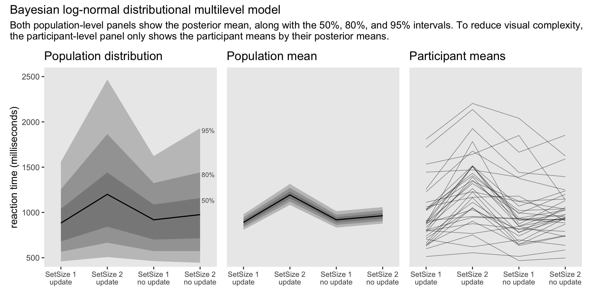

These plots are all focusing in reaction times for `SetSize`,
`Updating`, and their interaction. But these results are averaged over
the two levels of `UpdateSwitch`. If desired, one could make the
analogous set of plots for `SetSize`, `UpdateSwitch` and their
interaction, which I’ll leave as an exercise for the interested reader.

## Session information

``` r
sessionInfo()
```

    ## R version 4.1.2 (2021-11-01)
    ## Platform: x86_64-apple-darwin17.0 (64-bit)
    ## Running under: macOS Catalina 10.15.7
    ## 
    ## Matrix products: default
    ## BLAS:   /Library/Frameworks/R.framework/Versions/4.1/Resources/lib/libRblas.0.dylib
    ## LAPACK: /Library/Frameworks/R.framework/Versions/4.1/Resources/lib/libRlapack.dylib
    ## 
    ## locale:
    ## [1] en_US.UTF-8/en_US.UTF-8/en_US.UTF-8/C/en_US.UTF-8/en_US.UTF-8
    ## 
    ## attached base packages:
    ## [1] stats     graphics  grDevices utils     datasets  methods   base     
    ## 
    ## other attached packages:
    ##  [1] patchwork_1.1.1 tidybayes_3.0.2 brms_2.16.3     Rcpp_1.0.8      forcats_0.5.1   stringr_1.4.0  
    ##  [7] dplyr_1.0.7     purrr_0.3.4     readr_2.0.1     tidyr_1.2.0     tibble_3.1.6    ggplot2_3.3.5  
    ## [13] tidyverse_1.3.1
    ## 
    ## loaded via a namespace (and not attached):
    ##   [1] readxl_1.3.1         backports_1.4.1      plyr_1.8.6           igraph_1.2.6         svUnit_1.0.6        
    ##   [6] splines_4.1.2        crosstalk_1.1.1      TH.data_1.0-10       rstantools_2.1.1     inline_0.3.19       
    ##  [11] digest_0.6.29        htmltools_0.5.2      rsconnect_0.8.24     fansi_1.0.2          magrittr_2.0.2      
    ##  [16] checkmate_2.0.0      tzdb_0.1.2           modelr_0.1.8         RcppParallel_5.1.4   matrixStats_0.61.0  
    ##  [21] vroom_1.5.4          xts_0.12.1           sandwich_3.0-1       prettyunits_1.1.1    colorspace_2.0-2    
    ##  [26] rvest_1.0.1          ggdist_3.0.1         haven_2.4.3          xfun_0.25            callr_3.7.0         
    ##  [31] crayon_1.4.2         jsonlite_1.7.3       lme4_1.1-27.1        survival_3.2-13      zoo_1.8-9           
    ##  [36] glue_1.6.1           gtable_0.3.0         emmeans_1.7.1-1      distributional_0.2.2 pkgbuild_1.2.0      
    ##  [41] rstan_2.21.3         abind_1.4-5          scales_1.1.1         mvtnorm_1.1-2        DBI_1.1.1           
    ##  [46] miniUI_0.1.1.1       xtable_1.8-4         diffobj_0.3.4        bit_4.0.4            stats4_4.1.2        
    ##  [51] StanHeaders_2.21.0-7 DT_0.19              htmlwidgets_1.5.3    httr_1.4.2           threejs_0.3.3       
    ##  [56] arrayhelpers_1.1-0   posterior_1.1.0.9000 ellipsis_0.3.2       pkgconfig_2.0.3      loo_2.4.1           
    ##  [61] farver_2.1.0         dbplyr_2.1.1         utf8_1.2.2           labeling_0.4.2       tidyselect_1.1.1    
    ##  [66] rlang_1.0.1          reshape2_1.4.4       later_1.3.0          munsell_0.5.0        cellranger_1.1.0    
    ##  [71] tools_4.1.2          cli_3.1.1            generics_0.1.2       broom_0.7.10         ggridges_0.5.3      
    ##  [76] evaluate_0.14        fastmap_1.1.0        yaml_2.2.1           bit64_4.0.5          processx_3.5.2      
    ##  [81] knitr_1.33           fs_1.5.0             nlme_3.1-153         mime_0.11            projpred_2.0.2      
    ##  [86] xml2_1.3.2           compiler_4.1.2       bayesplot_1.8.1      shinythemes_1.2.0    rstudioapi_0.13     
    ##  [91] gamm4_0.2-6          reprex_2.0.1         stringi_1.7.4        highr_0.9            ps_1.6.0            
    ##  [96] Brobdingnag_1.2-6    lattice_0.20-45      Matrix_1.3-4         nloptr_1.2.2.2       markdown_1.1        
    ## [101] shinyjs_2.0.0        tensorA_0.36.2       vctrs_0.3.8          pillar_1.7.0         lifecycle_1.0.1     
    ## [106] bridgesampling_1.1-2 estimability_1.3     httpuv_1.6.2         R6_2.5.1             promises_1.2.0.1    
    ## [111] gridExtra_2.3        codetools_0.2-18     boot_1.3-28          colourpicker_1.1.0   MASS_7.3-54         
    ## [116] gtools_3.9.2         assertthat_0.2.1     withr_2.4.3          shinystan_2.5.0      multcomp_1.4-17     
    ## [121] mgcv_1.8-38          parallel_4.1.2       hms_1.1.0            grid_4.1.2           coda_0.19-4         
    ## [126] minqa_1.2.4          rmarkdown_2.10       shiny_1.6.0          lubridate_1.7.10     base64enc_0.1-3     
    ## [131] dygraphs_1.1.1.6
