Lai et al (2016), vivid counterstereotypic scenario versus control
================
A Solomon Kurz
2022-08-01

Load our primary packages.

``` r
library(tidyverse)
library(brms)
library(tidybayes)
library(patchwork)
```

## Brief online interventions and the effects of a pretest

Implicit bias has been a hot topic in social-psychology research in
recent decades. Implicit bias is most frequently studied with the
Implicit Association Test (IAT), one of the most popular versions of
which is designed to assess relative preference for Black faces versus
White faces. In their Study 4, Lai et al (2014;
<https://doi.org/10.1037/a0036260>) used a Solomon “four”-group design
to compare 13 experimental intervention conditions on reducing pro-White
bias in non-Black participants, and to examine to what extent pretesting
may influence the effect sizes for those interventions. The authors have
a large study repository on the OSF at <https://osf.io/lw9e8/> and you
can download their files at <https://osf.io/lw9e8/files/>. Here we load
the data from their Study 4.

``` r
lai2016 <- haven::read_sav(file = "data/LaietalStudy4.sav") %>% 
  # filter based on the authors' exclusion criteria
  filter(SUBEXCL == 0) %>% 
  filter(doneIAT == 1)
```

We call this a Solomon “four”-group design with *four* in quotations
because Study 4 had a

factorial design with 13 experimental conditions, each of which did or
did not have a pre-test. To simplify our analysis, we will restrict the
data to only contain responses from the `Control` and
`Vivid counterstereotypic scenario` conditions, wrangle the columns a
bit, and save the reduced data set as `vivid`.

``` r
vivid <- lai2016 %>% 
  filter(cond %in% c("Control", "Vivid counterstereotypic scenario")) %>% 
  select(session_id, IAT_pre, IAT, cond, cond_prepost) %>% 
  mutate(cond_prepost = as_factor(cond_prepost)) %>% 
  mutate(pretest = ifelse(cond_prepost == "Yes", 1, 0),
         tx      = ifelse(cond == "Control", 0, 1)) %>% 
  rename(id = session_id)

# what?
glimpse(vivid)
```

    ## Rows: 843
    ## Columns: 7
    ## $ id           <dbl> 2350639, 2351418, 2351533, 2352682, 2353932, 2354046, 2354816, 2355017, 2355272, 235527…
    ## $ IAT_pre      <dbl> NA, 0.442357607, NA, 0.923410496, NA, 0.873827762, -0.003373857, NA, -0.170386359, NA, …
    ## $ IAT          <dbl> NA, 0.510124976, 0.787527616, 1.370573497, 1.001857095, 0.841537642, -0.005360473, -0.2…
    ## $ cond         <chr> "Vivid counterstereotypic scenario", "Control", "Vivid counterstereotypic scenario", "C…
    ## $ cond_prepost <fct> Yes, Yes, No, Yes, No, Yes, Yes, No, Yes, No, Yes, Yes, No, Yes, Yes, No, No, No, No, N…
    ## $ pretest      <dbl> 1, 1, 0, 1, 0, 1, 1, 0, 1, 0, 1, 1, 0, 1, 1, 0, 0, 0, 0, 0, 1, 0, 0, 0, 1, 1, 0, 1, 0, …
    ## $ tx           <dbl> 1, 0, 1, 0, 0, 0, 0, 0, 0, 1, 1, 0, 0, 0, 0, 1, 1, 1, 0, 0, 1, 1, 0, 0, 0, 0, 1, 0, 0, …

The `IAT_pre` and `IAT` columns contain each participant’s

score, based on whether it was taken at the pre- or post-intervention
period. The `cond` column contains the text description of whether
participants were in the no-intervention control or experimental
intervention conditions. The `tx` column contains the same information,
transformed into a dummy variable. The `cond_prepost` column is a factor
variable indicating whether each participant had a pretest assessment
(`Yes`) or not (`No`) and the `pretest` column contains the same
information, transformed into a dummy variable.

We’re also going to want a long-formatted version of the data with
respect to time. We’ll call it `vivid_long`.

``` r
vivid_long <- vivid %>% 
  pivot_longer(contains("IAT"), values_to = "d") %>% 
  mutate(time = ifelse(str_detect(name, "_pre"), 0, 1))

# what?
glimpse(vivid_long)
```

    ## Rows: 1,686
    ## Columns: 8
    ## $ id           <dbl> 2350639, 2350639, 2351418, 2351418, 2351533, 2351533, 2352682, 2352682, 2353932, 235393…
    ## $ cond         <chr> "Vivid counterstereotypic scenario", "Vivid counterstereotypic scenario", "Control", "C…
    ## $ cond_prepost <fct> Yes, Yes, Yes, Yes, No, No, Yes, Yes, No, No, Yes, Yes, Yes, Yes, No, No, Yes, Yes, No,…
    ## $ pretest      <dbl> 1, 1, 1, 1, 0, 0, 1, 1, 0, 0, 1, 1, 1, 1, 0, 0, 1, 1, 0, 0, 1, 1, 1, 1, 0, 0, 1, 1, 1, …
    ## $ tx           <dbl> 1, 1, 0, 0, 1, 1, 0, 0, 0, 0, 0, 0, 0, 0, 0, 0, 0, 0, 1, 1, 1, 1, 0, 0, 0, 0, 0, 0, 0, …
    ## $ name         <chr> "IAT_pre", "IAT", "IAT_pre", "IAT", "IAT_pre", "IAT", "IAT_pre", "IAT", "IAT_pre", "IAT…
    ## $ d            <dbl> NA, NA, 0.442357607, 0.510124976, NA, 0.787527616, 0.923410496, 1.370573497, NA, 1.0018…
    ## $ time         <dbl> 0, 1, 0, 1, 0, 1, 0, 1, 0, 1, 0, 1, 0, 1, 0, 1, 0, 1, 0, 1, 0, 1, 0, 1, 0, 1, 0, 1, 0, …

With the `vivid_long` version of the data, the `d` column now contains
all the
-score
information and the timing of the assessment is captured in the new
`time` column, for which the pretesting assessment is coded `0` and the
posttesting assessment is coded `1`.

## EDA

### Sample statistics.

Here are the sample statistics for the IAT

scores at pre- and post-treatment, by the four experimental groups.

``` r
vivid_long %>% 
  group_by(time, pretest, tx) %>% 
  summarise(mean = mean(d, na.rm = T),
            sd   = sd(d, na.rm = T),
            n    = n()) %>% 
  mutate_if(is.double, round, digits = 2)
```

    ## # A tibble: 8 × 6
    ## # Groups:   time, pretest [4]
    ##    time pretest    tx   mean    sd     n
    ##   <dbl>   <dbl> <dbl>  <dbl> <dbl> <int>
    ## 1     0       0     0 NaN    NA      221
    ## 2     0       0     1 NaN    NA      171
    ## 3     0       1     0   0.42  0.48   245
    ## 4     0       1     1   0.37  0.48   206
    ## 5     1       0     0   0.39  0.46   221
    ## 6     1       0     1   0.15  0.52   171
    ## 7     1       1     0   0.45  0.4    245
    ## 8     1       1     1   0.16  0.46   206

Note the consequences for the structural missing data in the first two
rows.

For the two groups with a pretest, you might be curious about the
pre/post correlations for the

scores.

``` r
vivid %>% 
  drop_na(IAT_pre, IAT) %>% 
  group_by(pretest, tx) %>% 
  summarise(`pre-post correlation` = cor(IAT_pre, IAT),
            n                      = n()) %>% 
  mutate_if(is.double, round, digits = 2)
```

    ## # A tibble: 2 × 4
    ## # Groups:   pretest [1]
    ##   pretest    tx `pre-post correlation`     n
    ##     <dbl> <dbl>                  <dbl> <int>
    ## 1       1     0                   0.41   240
    ## 2       1     1                   0.3    202

### Look at the data.

Here’s a plot of the IAT

scores at both time points, by group. While we’re at it, we’ll also
change some of the global plotting settings.

``` r
# adjust the global plot settings
theme_set(
  theme_gray(base_size = 13) +
    theme(panel.grid = element_blank(),
          plot.title.position = "plot",
          strip.background = element_rect(fill = "grey96"),
          strip.text = element_text(color = "black"))
)

# wrangle
vivid_long %>% 
  mutate(bias          = ifelse(d > 0, "pro White", "pro Black"),
         jittered_time = time + rnorm(n(), mean = 0, sd = 0.03)) %>% 
  mutate(bias = factor(bias, levels = c("pro White", "pro Black"))) %>% 
  drop_na(d) %>% 
  
  # plot!
  ggplot(aes(x = jittered_time, y = d, group = id)) +
  geom_hline(yintercept = 0, color = "white") +
  geom_hline(yintercept = c(-1, 1), size = 1/4, color = "white") +
  geom_point(aes(color = bias),
             size = 1, alpha = 1/2) +
  geom_line(size = 1/4, alpha = 1/4) +
  scale_color_viridis_d(begin = .1, end = .6, guide = guide_legend(override.aes = list(size = 4, alpha = 3/4))) +
  scale_x_continuous(NULL, breaks = 0:1, labels = c("pre", "post"), expand = c(0.2, 0.2)) +
  ylab(expression(italic(D)~score)) +
  ylim(-1.5, 1.5) +
  facet_grid(pretest ~ tx, labeller = label_both)
```

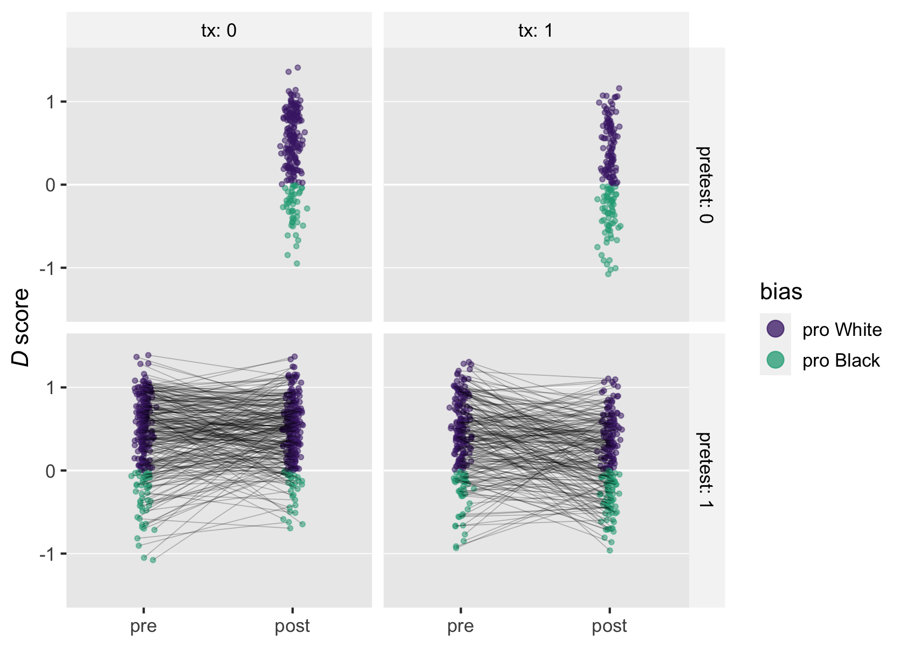

What might not be clear, here, is the

scores are continuous and roughly shaped like a bell.

``` r
vivid %>% 
  ggplot(aes(x = IAT)) +
  stat_slab(aes(fill = stat(x < 0))) +
  scale_fill_viridis_d("bias", begin = .1, end = .6, labels = c("pro White", "pro Black")) +
  scale_y_continuous(NULL, breaks = NULL) +
  scale_x_continuous(expression(italic(D)~score~(posttreatment)), limits = c(-1.5, 1.5)) +
  facet_grid(pretest ~ tx, labeller = label_both)
```

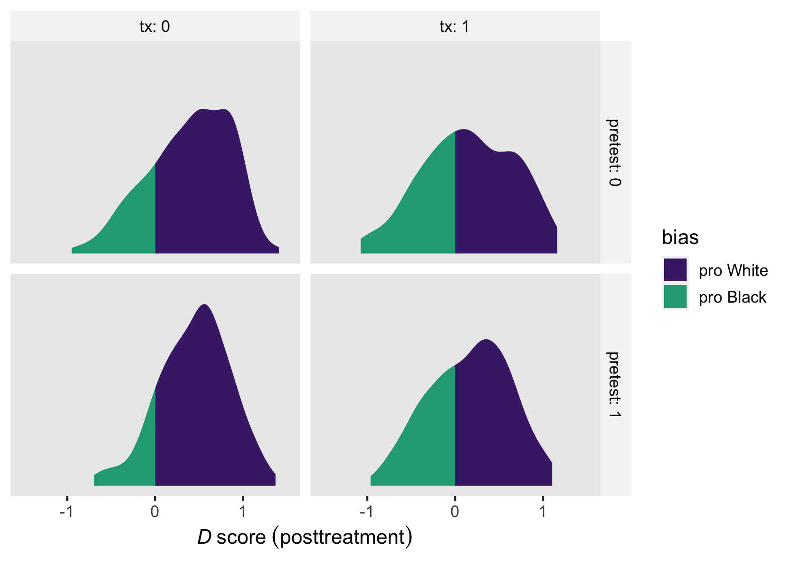

## Models

The Solomon 4-group design presents a major difficulty for classical
statistical approaches. If all you want is an unbiased assessment of the
effect of pretesting on the treatment effect, you can analyze the
post-treatment outcomes with the independent variables as the sole
predictors. However, this method is inefficient in that it fails to
capitalize on the power boost that would come from adding the baseline
scores as a covariate. But because classical statistical methods are not
capable of handling with missing data, adding the baseline scores as a
covariate would traditionally result in the removal of all data from
those from the posttest-only conditions. The contemporary solution is to
model both pre- and posttest assessments with a multilevel model using
full-information (Bayesian) estimation. To highlight the issue, we will
analyze the data with three models:

-   the single-level model of the posttest assessments,
-   the multilevel model of pre- and posttest assessments, and
-   the full distributional model of pre- and posttest assessments.

### Single-level model of the posttest assessments.

Given the IAT

scores are continuous with no clear lower or upper limits, the Gaussian
likelihood is a natural default choice. If we say the posttest
-score
values vary across

participants, we can assess the effects of pretesting and the
experimental treatment with the model

 \\
\mu_i & = \beta_0 + \beta_1 \text{tx}_i + \beta_2 \text{pretest}_i + \beta_3 \text{tx}_i \text{pretest}_i \\
\beta_0                 & \sim \operatorname{Normal}(0.37, 0.215) \\
\beta_1, \dots, \beta_3 & \sim \operatorname{Normal}(0, 0.215) \\
\sigma                  & \sim \operatorname{Exponential}(1 / 0.43)
\end{align*}
")

where the only predictors are the two dummy variables `tx`, `pretest`,
and their interaction. Arguably, the focal parameter is
,
the interaction for `tx` and `pretest`. The

parameter is also what you could describe as a difference in
differences. That is, it answers the question: *To what extent does the
difference in the treatment conditions differ based on whether
participants complete a pretest?*. This model is the Bayesian regression
version of the

ANOVA approaches researchers have often used for Solomon 4-group
studies.

As to the priors, the IAT literature is distinct in psychology in that
is it vast with a good number of large-sample studies, the data for
several of which are openly available online[^1]. In this script, the
priors come primarily from the second row (*Race attitude*) of Table 2
in Nosek et al (2007, p. 11), who summarized the data from more than 2.5
million participants who completed the IAT’s on a variety of topics,
from mid 2000 to mid 2006. The summaries for the Black-White IAT are
from

participants. Their mean

score was 0.37, with a standard deviation of 0.43.

Given the dummy variables in the equation,

is the mean for the control group without a pretest, the prior for which
is
").
The prior is centered on the population mean from Nosek et al. The scale
is half of the standard deviation reported in Nosek et al, and is meant
to indicate we are pretty certain the data from Lai et al will be
similar to those summarized by Nosek at al. The remaining beta
parameters all share the prior
"),
the scale of which is meant to put about 95% of the prior mass of effect
sizes greater than a Cohen’s

of -1 and less than a Cohen’s

of 1. The
")
prior indicates we expect our residual standard deviation

will be near the population standard deviation.

Here’s how to fit the model with `brm()`.

``` r
fit1 <- brm(
  data = vivid,
  family = gaussian,
  IAT ~ 0 + Intercept + tx + pretest + tx:pretest,
  prior = c(prior(normal(0.37, 0.215), class = b, coef = Intercept),
            prior(normal(0, 0.215), class = b),
            prior(exponential(1 / 0.43), class = sigma)),
  cores = 4, 
  seed = 1,
  file = "fits/fit1.lai2016vivid"
)
```

Check the model summary.

``` r
summary(fit1)
```

    ##  Family: gaussian 
    ##   Links: mu = identity; sigma = identity 
    ## Formula: IAT ~ 0 + Intercept + tx + pretest + tx:pretest 
    ##    Data: vivid (Number of observations: 834) 
    ##   Draws: 4 chains, each with iter = 2000; warmup = 1000; thin = 1;
    ##          total post-warmup draws = 4000
    ## 
    ## Population-Level Effects: 
    ##            Estimate Est.Error l-95% CI u-95% CI Rhat Bulk_ESS Tail_ESS
    ## Intercept      0.39      0.03     0.33     0.45 1.00     1698     1864
    ## tx            -0.23      0.04    -0.32    -0.14 1.00     1851     1960
    ## pretest        0.06      0.04    -0.02     0.14 1.00     1787     2050
    ## tx:pretest    -0.05      0.06    -0.17     0.06 1.00     1859     2296
    ## 
    ## Family Specific Parameters: 
    ##       Estimate Est.Error l-95% CI u-95% CI Rhat Bulk_ESS Tail_ESS
    ## sigma     0.46      0.01     0.44     0.48 1.00     2741     2362
    ## 
    ## Draws were sampled using sampling(NUTS). For each parameter, Bulk_ESS
    ## and Tail_ESS are effective sample size measures, and Rhat is the potential
    ## scale reduction factor on split chains (at convergence, Rhat = 1).

As I argued above, the coefficient for the treatment-pretest interaction

is probably the primary coefficient of interest in a Solomon 4-group
design. We can divide the posterior of that coefficient by the
population standard deviation from Nosek et al to convert it to a
Cohen’s

effect size.

``` r
as_draws_df(fit1) %>% 
  mutate(d = `b_tx:pretest` / 0.43) %>% 
  pivot_longer(cols = c(`b_tx:pretest`, d),
               values_to = "beta[3]") %>% 
  mutate(metric = ifelse(name == "d", "standardized", "unstandardized")) %>% 
  
  ggplot(aes(x  = `beta[3]`)) +
  stat_halfeye(.width = .9, normalize = "panels") +
  scale_y_continuous(NULL, breaks = NULL) +
  labs(title = "Behold the difference in differences in two metrics",
       subtitle = "This answers the question: To what extent does the difference in the treatment\nconditions differ based on whether participants complete a pretest? Not much.",
       x = expression(beta[3])) +
  facet_wrap(~ metric, scales = "free_x")
```

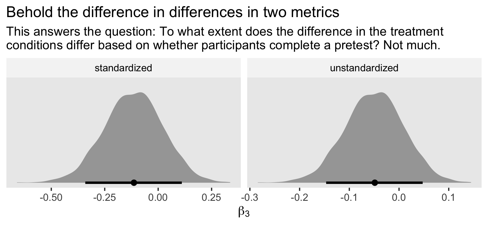

### Multilevel model of pre- and posttest assessments.

The first approach to analyzing Solomon 4-group data is perfectly okay
in that it will return unbiased estimates of the causal effect. But it’s
wasteful in that it fails to capitalize on the power boost that comes
from incorporating the information from the pretest assessments. To
avoid dropping the data from the participants in the posttest-only
conditions, we can fit a multilevel model of the form

![
\\begin{align\*}
\\text{d}\_{it} & \\sim \\operatorname{Normal}(\\mu\_{it}, \\sigma) \\\\
\\mu\_{it} & = \\beta\_{0i} + \\beta_1 \\text{time}\_{it} + (\\beta_2 \\text{tx}\_{it} + \\beta_3 \\text{pretest}\_{it} + \\beta_4 \\text{tx}\_{it} \\text{pretest}\_{it})\\text{time}\_{it} + u\_{0i} \\\\
u\_{0i} & \\sim \\operatorname{Normal}(0, \\sigma_0) \\\\
\\beta_0                 & \\sim \\operatorname{Normal}(0.37, 0.215) \\\\
\\beta_1, \\dots, \\beta_4 & \\sim \\operatorname{Normal}(0, 0.215) \\\\
\\sigma, \\sigma_0 & \\sim \\operatorname{Exponential}(1 / 0.43),
\\end{align\*}
](https://latex.codecogs.com/png.image?%5Cdpi%7B110%7D&space;%5Cbg_white&space;%0A%5Cbegin%7Balign%2A%7D%0A%5Ctext%7Bd%7D_%7Bit%7D%20%26%20%5Csim%20%5Coperatorname%7BNormal%7D%28%5Cmu_%7Bit%7D%2C%20%5Csigma%29%20%5C%5C%0A%5Cmu_%7Bit%7D%20%26%20%3D%20%5Cbeta_%7B0i%7D%20%2B%20%5Cbeta_1%20%5Ctext%7Btime%7D_%7Bit%7D%20%2B%20%28%5Cbeta_2%20%5Ctext%7Btx%7D_%7Bit%7D%20%2B%20%5Cbeta_3%20%5Ctext%7Bpretest%7D_%7Bit%7D%20%2B%20%5Cbeta_4%20%5Ctext%7Btx%7D_%7Bit%7D%20%5Ctext%7Bpretest%7D_%7Bit%7D%29%5Ctext%7Btime%7D_%7Bit%7D%20%2B%20u_%7B0i%7D%20%5C%5C%0Au_%7B0i%7D%20%26%20%5Csim%20%5Coperatorname%7BNormal%7D%280%2C%20%5Csigma_0%29%20%5C%5C%0A%5Cbeta_0%20%20%20%20%20%20%20%20%20%20%20%20%20%20%20%20%20%26%20%5Csim%20%5Coperatorname%7BNormal%7D%280.37%2C%200.215%29%20%5C%5C%0A%5Cbeta_1%2C%20%5Cdots%2C%20%5Cbeta_4%20%26%20%5Csim%20%5Coperatorname%7BNormal%7D%280%2C%200.215%29%20%5C%5C%0A%5Csigma%2C%20%5Csigma_0%20%26%20%5Csim%20%5Coperatorname%7BExponential%7D%281%20%2F%200.43%29%2C%0A%5Cend%7Balign%2A%7D%0A "
\begin{align*}
\text{d}_{it} & \sim \operatorname{Normal}(\mu_{it}, \sigma) \\
\mu_{it} & = \beta_{0i} + \beta_1 \text{time}_{it} + (\beta_2 \text{tx}_{it} + \beta_3 \text{pretest}_{it} + \beta_4 \text{tx}_{it} \text{pretest}_{it})\text{time}_{it} + u_{0i} \\
u_{0i} & \sim \operatorname{Normal}(0, \sigma_0) \\
\beta_0                 & \sim \operatorname{Normal}(0.37, 0.215) \\
\beta_1, \dots, \beta_4 & \sim \operatorname{Normal}(0, 0.215) \\
\sigma, \sigma_0 & \sim \operatorname{Exponential}(1 / 0.43),
\end{align*}
")

where now our criterion variable `d`, varies across

participants and

time points. Structurally, this is a direct extension of the multilevel
ANCOVA model for pre/post RCT data.

is now the grand mean for the pretest assessments, which varies across

participants to account for the nested structure of the
-score
data.

captures the expected deviation from the grand mean for the participants
in the control condition who did not have a pretest. The parameters

are rough analogues to the

parameters from the single-level model. But keep in mind that with the
time structure in the data, they are now expressed as deviations from
the grand mean at pretest.

Our priors are based on the same strategy from the single level model,
`fit1`. They’re moderately informative and regularizing, based on the
population parameters reported in Nosek et al (2007).

Here’s how to fit the model with `brm()`. Note our use of the
long-formatted `vivid_long` data set.

``` r
fit2 <- brm(
  data = vivid_long,
  family = gaussian,
  d ~ 0 + Intercept + time + (tx + pretest + tx:pretest) : time + (1 | id),
  prior = c(prior(normal(0.37, 0.215), class = b, coef = Intercept),
            prior(normal(0, 0.215), class = b),
            prior(exponential(1 / 0.43), class = sd),
            prior(exponential(1 / 0.43), class = sigma)),
  cores = 4, 
  seed = 1,
  file = "fits/fit2.lai2016vivid"
)
```

Check the summary.

``` r
summary(fit2)
```

    ##  Family: gaussian 
    ##   Links: mu = identity; sigma = identity 
    ## Formula: d ~ 0 + Intercept + time + (tx + pretest + tx:pretest):time + (1 | id) 
    ##    Data: vivid_long (Number of observations: 1276) 
    ##   Draws: 4 chains, each with iter = 2000; warmup = 1000; thin = 1;
    ##          total post-warmup draws = 4000
    ## 
    ## Group-Level Effects: 
    ## ~id (Number of levels: 834) 
    ##               Estimate Est.Error l-95% CI u-95% CI Rhat Bulk_ESS Tail_ESS
    ## sd(Intercept)     0.28      0.02     0.24     0.32 1.00      684     1569
    ## 
    ## Population-Level Effects: 
    ##                 Estimate Est.Error l-95% CI u-95% CI Rhat Bulk_ESS Tail_ESS
    ## Intercept           0.40      0.02     0.36     0.44 1.00     3904     2758
    ## time               -0.01      0.04    -0.08     0.06 1.00     3309     3176
    ## time:tx            -0.23      0.04    -0.32    -0.14 1.00     3802     3059
    ## time:pretest        0.05      0.04    -0.03     0.13 1.00     3685     3112
    ## time:tx:pretest    -0.04      0.06    -0.15     0.08 1.00     3937     3116
    ## 
    ## Family Specific Parameters: 
    ##       Estimate Est.Error l-95% CI u-95% CI Rhat Bulk_ESS Tail_ESS
    ## sigma     0.37      0.01     0.35     0.40 1.00      819     1744
    ## 
    ## Draws were sampled using sampling(NUTS). For each parameter, Bulk_ESS
    ## and Tail_ESS are effective sample size measures, and Rhat is the potential
    ## scale reduction factor on split chains (at convergence, Rhat = 1).

It might be useful to compare the posterior means and standard
deviations for the

parameters from the single-level model `fit1` and the multilevel model
`fit2`.

``` r
fixef(fit1)[, 1:2]
```

    ##               Estimate  Est.Error
    ## Intercept   0.38979189 0.03011586
    ## tx         -0.23206786 0.04436667
    ## pretest     0.05735974 0.04102971
    ## tx:pretest -0.04986185 0.05956725

``` r
fixef(fit2)[, 1:2]
```

    ##                     Estimate  Est.Error
    ## Intercept        0.397363641 0.02147095
    ## time            -0.007579477 0.03663545
    ## time:tx         -0.231607742 0.04465309
    ## time:pretest     0.050837641 0.04015521
    ## time:tx:pretest -0.035838799 0.05757296

If you do a simulation study, you’ll find that the interaction
coefficient–
in the single level model and

in the multilevel model–will tend to be a little more precise (i.e., has
a smaller posterior standard deviation) in the multilevel model, which
is the case here. You’ll also find that same pattern for the treatment
coefficient–
in the single level model and

in the multilevel model–, which is not quite the case here[^2]. In
general, the multilevel model approach will return more precise
estimates because it uses more of the data in the analysis.

Given the wealth of parameters, we should spend some time breaking down
the research questions addressed by the multilevel version of the model,
`fit2`. To my eye, we have the following:

-   What is the baseline grand mean for the `d` scores? That’s
    .

``` r
# extract the posterior draws
draws <- as_draws_df(fit2) %>% 
  # subset
  select(b_Intercept:sigma) %>% 
  # rename
  set_names(c(str_c("beta[", 0:4, "]"), "sigma[0]", "sigma"))

draws %>% 
  ggplot(aes(x = `beta[0]`)) +
  stat_halfeye(.width = .9) +
  geom_vline(xintercept = vivid %>% 
               summarise(m = mean(IAT_pre, na.rm = T)) %>% 
               pull(),
             linetype = 2) +
  scale_y_continuous(NULL, breaks = NULL) +
  labs(title = "Grand mean at baseline",
       x = expression(beta[0]))
```

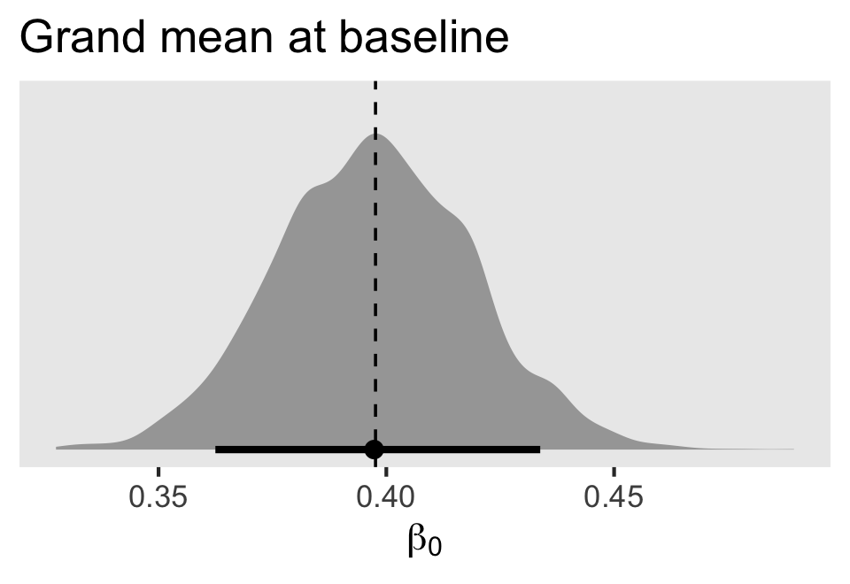

In this plot and the plots to follow, the sample estimates are marked
off by the dashed vertical lines.

-   What is the population mean for the `d` scores at posttest? That is:
    -   
        for those in control without a pretest,
    -   
        for those in treatment without a pretest,
    -   
        for those in control with a pretest, and
    -   
        for those in treatment with a pretest.

``` r
p1 <- draws %>% 
  ggplot(aes(x = `beta[0]` + `beta[1]`)) +
  stat_halfeye(.width = .9) +
  geom_vline(xintercept = vivid %>% 
               filter(tx == 0 & pretest == 0) %>% 
               summarise(m = mean(IAT, na.rm = T)) %>% 
               pull(),
             linetype = 2) +
  scale_y_continuous(NULL, breaks = NULL) +
  labs(subtitle = "control without a pretest",
       x = expression(beta[0]+beta[1]))

p2 <- draws %>% 
  ggplot(aes(x = `beta[0]` + `beta[1]` + `beta[2]`)) +
  stat_halfeye(.width = .9) +
  geom_vline(xintercept = vivid %>% 
               filter(tx == 1 & pretest == 0) %>% 
               summarise(m = mean(IAT, na.rm = T)) %>% 
               pull(),
             linetype = 2) +
  scale_y_continuous(NULL, breaks = NULL) +
  labs(subtitle = "treatment without a pretest",
       x = expression(beta[0]+beta[1]+beta[2]))

p3 <- draws %>% 
  ggplot(aes(x = `beta[0]` + `beta[1]` + `beta[3]`)) +
  stat_halfeye(.width = .9) +
  geom_vline(xintercept = vivid %>% 
               filter(tx == 0 & pretest == 1) %>% 
               summarise(m = mean(IAT, na.rm = T)) %>% 
               pull(),
             linetype = 2) +
  scale_y_continuous(NULL, breaks = NULL) +
  labs(subtitle = "control with a pretest",
       x = expression(beta[0]+beta[1]+beta[3]))

p4 <- draws %>% 
  ggplot(aes(x = `beta[0]` + `beta[1]` + `beta[2]` + `beta[3]` + `beta[4]`)) +
  stat_halfeye(.width = .9) +
  geom_vline(xintercept = vivid %>% 
               filter(tx == 1 & pretest == 1) %>% 
               summarise(m = mean(IAT, na.rm = T)) %>% 
               pull(),
             linetype = 2) +
  scale_y_continuous(NULL, breaks = NULL) +
  labs(subtitle = "treatment with a pretest",
       x = expression(beta[0]+beta[1]+beta[2]+beta[3]+beta[4]))

# combine
(p1 + p2 + p3 + p4) &
  coord_cartesian(xlim = c(0, 0.5)) &
  plot_annotation(title = "Population means at posttest")
```

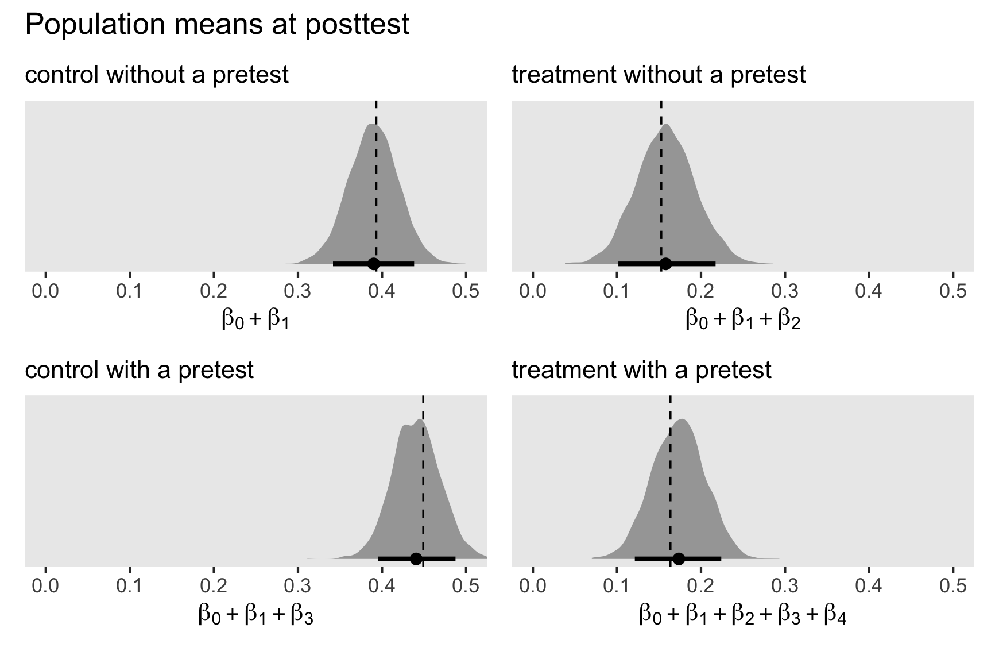

-   What are the within-group unstandardized mean differences from
    pretest to posttest for those with a pretest? That is:
    -   
        for those in control, and
    -   
        for those in treatment.

``` r
p1 <- draws %>% 
  ggplot(aes(x = `beta[1]` + `beta[3]`)) +
  stat_halfeye(.width = .9) +
  geom_vline(xintercept = vivid %>% 
               filter(tx == 0 & pretest == 1) %>% 
               summarise(m0 = mean(IAT_pre, na.rm = T),
                         m1 = mean(IAT, na.rm = T)) %>% 
               mutate(d = m1 - m0) %>% 
               pull(d),
             linetype = 2) +
  scale_y_continuous(NULL, breaks = NULL) +
  labs(subtitle = "control with a pretest",
       x = expression(beta[1]+beta[3]))

p2 <- draws %>% 
  ggplot(aes(x = `beta[1]` + `beta[2]` + `beta[3]` + `beta[4]`)) +
  stat_halfeye(.width = .9) +
  geom_vline(xintercept = vivid %>% 
               filter(tx == 1 & pretest == 1) %>% 
               summarise(m0 = mean(IAT_pre, na.rm = T),
                         m1 = mean(IAT, na.rm = T)) %>% 
               mutate(d = m1 - m0) %>% 
               pull(d),
             linetype = 2) +
  scale_y_continuous(NULL, breaks = NULL) +
  labs(subtitle = "treatment with a pretest",
       x = expression(beta[1]+beta[2]+beta[3]+beta[4]))

# combine
(p1 + p2) &
  coord_cartesian(xlim = c(-0.3, 0.2)) &
  plot_annotation(title = "Population mean within-group unstandardized pre-post differences")
```

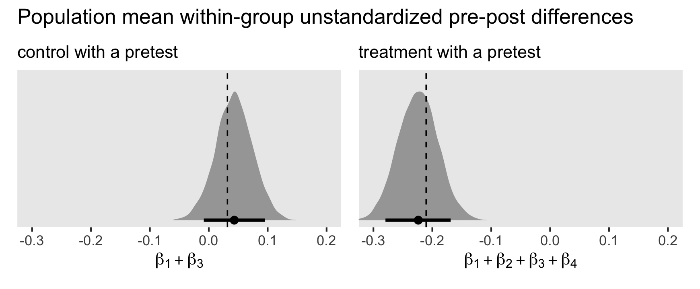

-   What are the between-group differences at posttest for the treatment
    conditions, by pretest status? That is:
    -   
        for treatment versus control for those without a pretest, and
    -   
        for treatment versus control for those with a pretest.

``` r
p1 <- draws %>% 
  ggplot(aes(x = `beta[2]`)) +
  stat_halfeye(.width = .9) +
  geom_vline(xintercept = vivid %>% 
               filter(pretest == 0) %>% 
               group_by(tx) %>% 
               summarise(m = mean(IAT, na.rm = T)) %>% 
               pivot_wider(names_from = tx, values_from = m) %>%
               mutate(d = `1` - `0`) %>% 
               pull(d),
             linetype = 2) +
  scale_y_continuous(NULL, breaks = NULL) +
  labs(subtitle = "without a pretest",
       x = expression(beta[2]))

p2 <- draws %>% 
  ggplot(aes(x = `beta[2]`  + `beta[4]`)) +
  stat_halfeye(.width = .9) +
  geom_vline(xintercept = vivid %>% 
               filter(pretest == 1) %>% 
               group_by(tx) %>% 
               summarise(m = mean(IAT, na.rm = T)) %>% 
               pivot_wider(names_from = tx, values_from = m) %>%
               mutate(d = `1` - `0`) %>% 
               pull(d),
             linetype = 2) +
  scale_y_continuous(NULL, breaks = NULL) +
  labs(subtitle = "with a pretest",
       x = expression(beta[2]+beta[4]))

# combine
(p1 + p2) &
  coord_cartesian(xlim = c(-0.4, 0)) &
  plot_annotation(title = "Population mean between-group unstandardized posttreatment differences",
                  subtitle = "These are the causal estimates for decreases in pro-White bias on the IAT.")
```

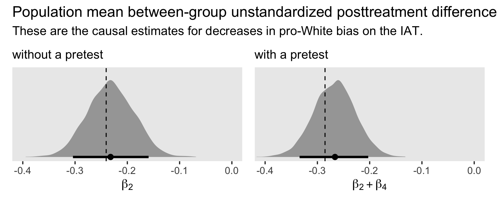

-   What is the difference in differences at posttest for the treatment
    conditions, based on pretest status
    ")?

``` r
draws %>% 
  ggplot(aes(x = `beta[4]`)) +
  stat_halfeye(.width = .9) +
  geom_vline(xintercept = vivid %>% 
               group_by(tx, pretest) %>%
               summarise(m = mean(IAT, na.rm = T)) %>% 
               pivot_wider(names_from = tx, values_from = m) %>%
               mutate(d = `1` - `0`) %>%
               select(pretest, d) %>%
               pivot_wider(names_from = pretest, values_from = d) %>%
               mutate(d = `1` - `0`) %>%
               pull(d),
             linetype = 2) +
  scale_y_continuous(NULL, breaks = NULL) +
  labs(title = "Posttreatment difference in differences for\ntreatment, by pretest status",
       x = expression(beta[4]))
```

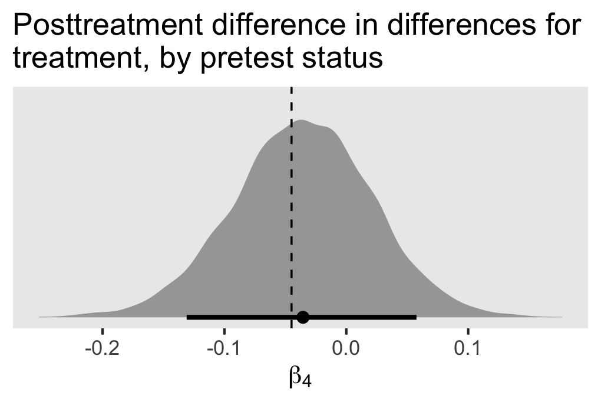

Again, to my mind this posttest difference in differences
(
from the multilevel model `fit2` or

from the single-level model `fit1`) is the primary reason for a Solomon
4-group design. Based on this subset of the Lai et al data, it appears
that the pretest had a small to negligible influence on the size of the
treatment effect.

If we wanted to convert the parameter to a Cohen’s

metric, a typical approach would be dividing difference in differences
by the pooled standard deviation at baseline. Here’s what the baseline
pooled standard deviation is in this data set.

``` r
vivid %>% 
  group_by(tx) %>% 
  summarise(v = var(IAT_pre, na.rm = T)) %>% 
  ungroup() %>% 
  summarise(baseline_pooled_sd = sqrt(sum(v) / 2))
```

    ## # A tibble: 1 × 1
    ##   baseline_pooled_sd
    ##                <dbl>
    ## 1              0.479

But recall that value is a sample estimate. From Table 2 in Nosek et al
(2007, p. 11), we have an

based estimate of the population pooled standard deviation as 0.43. So
in this case, I recommend we use 0.43 for the pooled standard deviation.

``` r
# the value from Nosek et al (2007, Table 2)
sd_pooled_population <- 0.43

draws %>% 
  ggplot(aes(x = `beta[4]` / sd_pooled_population)) +
  stat_halfeye(.width = .9) +
  scale_y_continuous(NULL, breaks = NULL) +
  labs(title = "Posttreatment difference in differences\nfor treatment, by pretest status",
       x = expression("Cohen's "*italic(d)))
```

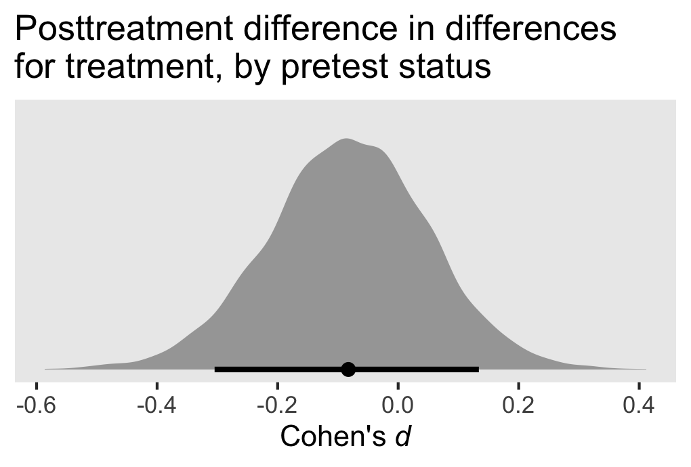

The standardized mean difference is close to zero, but straddles a bit
on either side. You might say it ranges from small to negligible.

### Distributional multilevel model of pre- and posttest assessments.

A lot of our focus, thus far, has been on the means. We can generalize
our approach to see how the conditions in the Lai et al’s Solomon
4-group data influence the residual standard deviations with the model

![
\\begin{align\*}
\\text{d}\_{it} & \\sim \\operatorname{Normal}(\\mu\_{it}, \\sigma\_{it}) \\\\
\\mu\_{it} & = \\beta\_{0i} + \\beta_1 \\text{time}\_{it} + (\\beta_2 \\text{tx}\_{it} + \\beta_3 \\text{pretest}\_{it} + \\beta_4 \\text{tx}\_{it} \\text{pretest}\_{it})\\text{time}\_{it} + u\_{0i} \\\\
\\log(\\sigma\_{it}) & = \\eta\_{0i} + \\eta_1 \\text{time}\_{it} + (\\eta_2 \\text{tx}\_{it} + \\eta_3 \\text{pretest}\_{it} + \\eta_4 \\text{tx}\_{it} \\text{pretest}\_{it})\\text{time}\_{it} + v\_{0i} \\\\
\\begin{bmatrix} u\_{0i} \\\\ v\_{0i} \\end{bmatrix} & \\sim \\operatorname{Normal}(\\mathbf 0, \\mathbf{SRS}) \\\\
\\mathbf S & = \\begin{bmatrix} \\sigma_u \\\\ 0 & \\sigma_v \\end{bmatrix} \\\\
\\mathbf R & = \\begin{bmatrix} 1 \\\\ 0 & 1 \\end{bmatrix},
\\end{align\*}
](https://latex.codecogs.com/png.image?%5Cdpi%7B110%7D&space;%5Cbg_white&space;%0A%5Cbegin%7Balign%2A%7D%0A%5Ctext%7Bd%7D_%7Bit%7D%20%26%20%5Csim%20%5Coperatorname%7BNormal%7D%28%5Cmu_%7Bit%7D%2C%20%5Csigma_%7Bit%7D%29%20%5C%5C%0A%5Cmu_%7Bit%7D%20%26%20%3D%20%5Cbeta_%7B0i%7D%20%2B%20%5Cbeta_1%20%5Ctext%7Btime%7D_%7Bit%7D%20%2B%20%28%5Cbeta_2%20%5Ctext%7Btx%7D_%7Bit%7D%20%2B%20%5Cbeta_3%20%5Ctext%7Bpretest%7D_%7Bit%7D%20%2B%20%5Cbeta_4%20%5Ctext%7Btx%7D_%7Bit%7D%20%5Ctext%7Bpretest%7D_%7Bit%7D%29%5Ctext%7Btime%7D_%7Bit%7D%20%2B%20u_%7B0i%7D%20%5C%5C%0A%5Clog%28%5Csigma_%7Bit%7D%29%20%26%20%3D%20%5Ceta_%7B0i%7D%20%2B%20%5Ceta_1%20%5Ctext%7Btime%7D_%7Bit%7D%20%2B%20%28%5Ceta_2%20%5Ctext%7Btx%7D_%7Bit%7D%20%2B%20%5Ceta_3%20%5Ctext%7Bpretest%7D_%7Bit%7D%20%2B%20%5Ceta_4%20%5Ctext%7Btx%7D_%7Bit%7D%20%5Ctext%7Bpretest%7D_%7Bit%7D%29%5Ctext%7Btime%7D_%7Bit%7D%20%2B%20v_%7B0i%7D%20%5C%5C%0A%5Cbegin%7Bbmatrix%7D%20u_%7B0i%7D%20%5C%5C%20v_%7B0i%7D%20%5Cend%7Bbmatrix%7D%20%26%20%5Csim%20%5Coperatorname%7BNormal%7D%28%5Cmathbf%200%2C%20%5Cmathbf%7BSRS%7D%29%20%5C%5C%0A%5Cmathbf%20S%20%26%20%3D%20%5Cbegin%7Bbmatrix%7D%20%5Csigma_u%20%5C%5C%200%20%26%20%5Csigma_v%20%5Cend%7Bbmatrix%7D%20%5C%5C%0A%5Cmathbf%20R%20%26%20%3D%20%5Cbegin%7Bbmatrix%7D%201%20%5C%5C%200%20%26%201%20%5Cend%7Bbmatrix%7D%2C%0A%5Cend%7Balign%2A%7D%0A "
\begin{align*}
\text{d}_{it} & \sim \operatorname{Normal}(\mu_{it}, \sigma_{it}) \\
\mu_{it} & = \beta_{0i} + \beta_1 \text{time}_{it} + (\beta_2 \text{tx}_{it} + \beta_3 \text{pretest}_{it} + \beta_4 \text{tx}_{it} \text{pretest}_{it})\text{time}_{it} + u_{0i} \\
\log(\sigma_{it}) & = \eta_{0i} + \eta_1 \text{time}_{it} + (\eta_2 \text{tx}_{it} + \eta_3 \text{pretest}_{it} + \eta_4 \text{tx}_{it} \text{pretest}_{it})\text{time}_{it} + v_{0i} \\
\begin{bmatrix} u_{0i} \\ v_{0i} \end{bmatrix} & \sim \operatorname{Normal}(\mathbf 0, \mathbf{SRS}) \\
\mathbf S & = \begin{bmatrix} \sigma_u \\ 0 & \sigma_v \end{bmatrix} \\
\mathbf R & = \begin{bmatrix} 1 \\ 0 & 1 \end{bmatrix},
\end{align*}
")

with priors

 \\
\beta_1, \dots, \beta_4 & \sim \operatorname{Normal}(0, 0.215) \\
\eta_0                & \sim \operatorname{Normal}(\log(0.43), \log(2) / 2) \\
\eta_1, \dots, \eta_4 & \sim \operatorname{Normal}(0, 0.5) \\
\sigma_u & \sim \operatorname{Exponential}(1 / 0.43) \\
\sigma_v & \sim \operatorname{Exponential}(1 / 0.5),
\end{align*}
")

where the within-person residual standard deviation

now varies across

parsons and

time points. The model for
")
mirrors the model for
,
from before.

By centering our prior for

on
"),
we are indicating we expect the residual standard deviation at pretest
to fall near the population standard deviation reported by Nosek et
al. The scale hyperparameter
 / 2")
indicates that after exponentiation, we’d like about 95% of the prior
mass to range between half of the population value
")
and twice the population value
").
If that’s not clear why, here’s a quick simulation.

``` r
set.seed(1)

tibble(prior = rnorm(n = 1e5, mean = log(0.43), sd = log(2) / 2)) %>% 
  mutate(sigma = exp(prior)) %>% 
  mutate(range = sigma > 0.215 & sigma < 0.86) %>% 
  mutate(range = factor(range, levels = c("TRUE", "FALSE"))) %>% 
  
  ggplot(aes(x = sigma, fill = range)) +
  geom_histogram(binwidth = 0.015, boundary = 0.215) +
  scale_fill_viridis_d("inner 95% range\n(approximate)", option = "A", begin = .1, end = .6) +
  scale_y_continuous(NULL, breaks = NULL) +
  labs(title = expression(italic(N)(log(0.43)*', '*log(2)/2)*', exponentiated'),
       x = expression(exp(eta[0])))
```

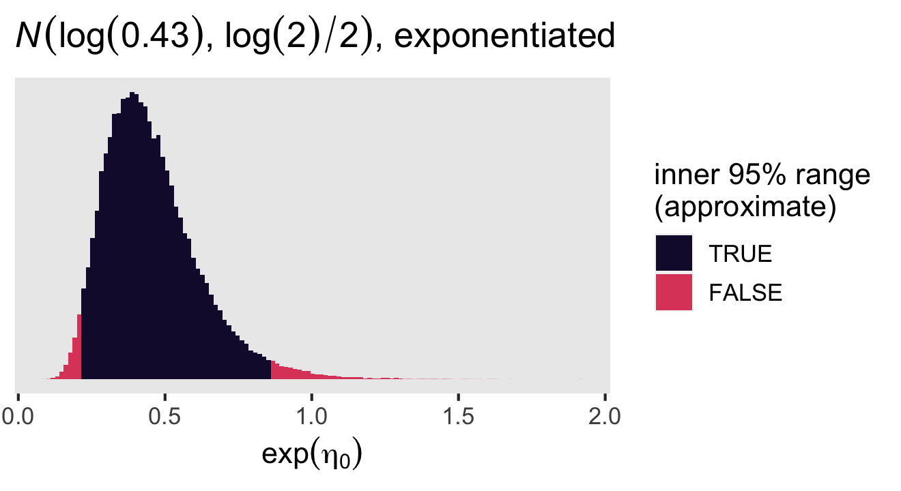

The
")
prior for

is meant to be weakly regularizing and restrain the experimental effects
on the residual standard deviation to within an order of magnitude
(i.e., an change of 1 on the log scale). The
")
prior for

is meant to be similarly regularizing for the person-level differences
in residual standard deviations. Given how participants have a maximum
of two measurement occasions–and how fully half of the participants have
only one–, I could see researchers arguing for a more conservative
prior, like
")
or so.

Here’s how to fit the distributional model to our Solomon 4-group data.

``` r
fit3 <- brm(
  data = vivid_long,
  family = gaussian,
  bf(d     ~ 0 + Intercept + time + (tx + pretest + tx:pretest) : time + (1 | id),
     sigma ~ 0 + Intercept + time + (tx + pretest + tx:pretest) : time + (1 | id)),
  prior = c(# mu model
            prior(normal(0.37, 0.215), class = b, coef = Intercept),
            prior(normal(0, 0.215), class = b),
            prior(exponential(1 / 0.43), class = sd),
            # log(sigma) model
            prior(normal(log(0.43), log(2) / 2), class = b, coef = Intercept, dpar = sigma),
            prior(normal(0, 0.5), class = b, dpar = sigma),
            prior(exponential(1 / 0.5), class = sd, dpar = sigma)),
  cores = 4, 
  seed = 1,
  control = list(adapt_delta = .95),
  file = "fits/fit3.lai2016vivid"
)
```

Check the summary.

``` r
summary(fit3)
```

    ##  Family: gaussian 
    ##   Links: mu = identity; sigma = log 
    ## Formula: d ~ 0 + Intercept + time + (tx + pretest + tx:pretest):time + (1 | id) 
    ##          sigma ~ 0 + Intercept + time + (tx + pretest + tx:pretest):time + (1 | id)
    ##    Data: vivid_long (Number of observations: 1276) 
    ##   Draws: 4 chains, each with iter = 2000; warmup = 1000; thin = 1;
    ##          total post-warmup draws = 4000
    ## 
    ## Group-Level Effects: 
    ## ~id (Number of levels: 834) 
    ##                     Estimate Est.Error l-95% CI u-95% CI Rhat Bulk_ESS Tail_ESS
    ## sd(Intercept)           0.28      0.02     0.24     0.31 1.01      570     1207
    ## sd(sigma_Intercept)     0.07      0.05     0.00     0.18 1.01      499      698
    ## 
    ## Population-Level Effects: 
    ##                       Estimate Est.Error l-95% CI u-95% CI Rhat Bulk_ESS Tail_ESS
    ## Intercept                 0.40      0.02     0.35     0.45 1.00     2859     3123
    ## time                     -0.01      0.04    -0.08     0.06 1.00     2729     2842
    ## time:tx                  -0.23      0.05    -0.32    -0.14 1.00     3409     2466
    ## time:pretest              0.05      0.04    -0.03     0.13 1.00     2807     2874
    ## time:tx:pretest          -0.04      0.06    -0.16     0.08 1.00     3230     2961
    ## sigma_Intercept          -0.94      0.05    -1.02    -0.84 1.00     2461     2766
    ## sigma_time               -0.06      0.09    -0.25     0.10 1.00      994     1726
    ## sigma_time:tx             0.17      0.10    -0.03     0.38 1.00     1773     2586
    ## sigma_time:pretest       -0.24      0.11    -0.45    -0.04 1.00     1732     2619
    ## sigma_time:tx:pretest     0.08      0.14    -0.19     0.37 1.00     2039     2571
    ## 
    ## Draws were sampled using sampling(NUTS). For each parameter, Bulk_ESS
    ## and Tail_ESS are effective sample size measures, and Rhat is the potential
    ## scale reduction factor on split chains (at convergence, Rhat = 1).

Here the ordering of the
")
parameters mirror those for the

parameters. The largest parameters are
,
![0.17\\ 95\\% \\text{CI}\[-0.03, 0.38\]](https://latex.codecogs.com/png.image?%5Cdpi%7B110%7D&space;%5Cbg_white&space;0.17%5C%2095%5C%25%20%5Ctext%7BCI%7D%5B-0.03%2C%200.38%5D "0.17\ 95\% \text{CI}[-0.03, 0.38]"),
and
,
![-0.24\\ \[-0.45, -0.04\]](https://latex.codecogs.com/png.image?%5Cdpi%7B110%7D&space;%5Cbg_white&space;-0.24%5C%20%5B-0.45%2C%20-0.04%5D "-0.24\ [-0.45, -0.04]").
It might be easiest to appreciate the
")
parameters by converting them to the

metric and showing the group estimates. Here we do so with the
`fitted()` function. Note our use of the `re_formula` and `dpar`
arguments.

``` r
# define the new data
nd <- vivid_long %>% 
  distinct(time, tx, pretest)

# pull the posterior draws and wrangle
fitted(
  fit3,
  newdata = nd,
  re_formula = NA,
  dpar = "sigma") %>% 
  data.frame() %>% 
  bind_cols(nd) %>% 
  mutate(time = factor(time, levels = 0:1, labels = c("baseline", "posttreatment"))) %>% 
  
  # plot!
  ggplot(aes(x = Estimate, xmin = Q2.5, xmax = Q97.5, y = time)) +
  geom_pointrange() +
  labs(x = expression(italic(D)~score~residual~standard~deviation~(sigma[italic(i)][italic(t)])),
       y = NULL) +
  xlim(0.2, 0.6) +
  theme(axis.text.y = element_text(hjust = 0)) +
  facet_grid(pretest ~ tx, labeller = label_both)
```

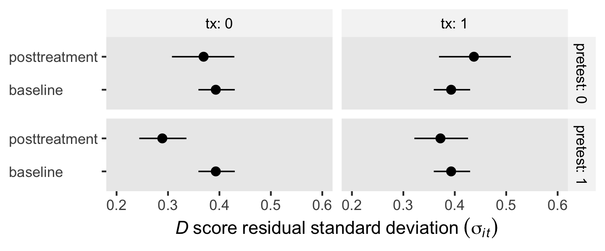

If you wanted to, you could use information criteria to formally compare
the `fit2` and `fit3` models.

``` r
# compute the LOO and WAIC estimates
fit2 <- add_criterion(fit2, criterion = c("loo", "waic"))
fit3 <- add_criterion(fit3, criterion = c("loo", "waic"))

# compare the models
loo_compare(fit2, fit3, criterion = "loo") %>% print(simplify = F)
```

    ##      elpd_diff se_diff elpd_loo se_elpd_loo p_loo  se_p_loo looic  se_looic
    ## fit3    0.0       0.0  -767.4     24.2       362.7   11.1   1534.9   48.5  
    ## fit2  -10.9       4.2  -778.4     24.2       354.7   11.2   1556.7   48.3

``` r
loo_compare(fit2, fit3, criterion = "waic") %>% print(simplify = F)
```

    ##      elpd_diff se_diff elpd_waic se_elpd_waic p_waic se_p_waic waic   se_waic
    ## fit3    0.0       0.0  -735.8      23.2        331.0    9.9    1471.5   46.5 
    ## fit2  -14.5       3.7  -750.3      23.3        326.6   10.3    1500.6   46.6

Both the LOO and the WAIC suggest the full distributional model `fit3`
does a better job capturing the patterns in the data than the simpler
-centric
model `fit2`.

## What are we doing, here?

Whether you analyze Solomon 4-group data with a single-level approach,
as in `fit1`, or a multilevel approach, as in `fit2` and `fit3`, the
analysis returns two versions of the causal effect. You have the
difference between treatment and control for those who had a pretest,
for one, and the difference between treatment and control for those
without a pretest, for the other. Here are those two estimates from the
distributional multilevel model, `fit3`.

``` r
as_draws_df(fit3) %>% 
  transmute(cauasl_effect_without_pretest = `b_time:tx`,
            cauasl_effect_with_pretest    = `b_time:tx` + `b_time:tx:pretest`) %>% 
  pivot_longer(everything()) %>% 
  group_by(name) %>% 
  mean_qi(value)
```

    ## # A tibble: 2 × 7
    ##   name                           value .lower .upper .width .point .interval
    ##   <chr>                          <dbl>  <dbl>  <dbl>  <dbl> <chr>  <chr>    
    ## 1 cauasl_effect_with_pretest    -0.268 -0.347 -0.192   0.95 mean   qi       
    ## 2 cauasl_effect_without_pretest -0.232 -0.324 -0.138   0.95 mean   qi

One may wonder: *Which one is correct?* Personally, I would say
*neither*. They’re both valid estimates of the causal effect, each based
on a different procedure. But if you wanted to simplify how to think
about and communicate the research findings, the causal effect from
those without the pretest should be preferred when there are large
differences between the two estimates. Large differences (i.e., a large
difference in differences) imply a large method effect from pretesting.

However, if your research goal is to rule out pretesting as a major
factor influencing the magnitude of the causal treatment effect, you
might want to adapt something like the ROPE framework. Here, ROPE stands
for *region of practical equivalence*. For a Solomon 4-group design, at
what point is the difference in differences small enough that it’s
ignoble, that it’s practically equivalent to zero? Before collecting or
analyzing their data, Lai and colleagues could decide, for example, that
a difference in differences less than a Cohen’s

ignoble, it’s practically equivalent to zero. Thus they could use the
population standard deviation from Nosek et al (2007) to set a ROPE of
![\[-0.043, 0.043\]](https://latex.codecogs.com/png.image?%5Cdpi%7B110%7D&space;%5Cbg_white&space;%5B-0.043%2C%200.043%5D "[-0.043, 0.043]").
If the difference in differences falls within this range, we would
proclaim the pretesting effect is ignorable. Here’s what that looks like
with the results from `fit2` and `fit3`.

``` r
# wrangle
rbind(fixef(fit2)["time:tx:pretest", -2], 
      fixef(fit3)["time:tx:pretest", -2]) %>% 
  data.frame() %>% 
  mutate(fit = c("fit2", "fit3")) %>% 
  
  # plot!
  ggplot(aes(x = Estimate, xmin = Q2.5, xmax = Q97.5, y = fit)) +
  geom_rect(xmin = -0.1 * sd_pooled_population, xmax = 0.1 * sd_pooled_population,
            ymin = -Inf, ymax = Inf,
            fill = "grey75") +
  geom_pointrange() +
  annotate(geom = "text",
           x = 0, y = 1.5, label = "ROPE",
           color = "white", size = 5) +
  labs(x = expression(beta[4]~('difference in differences')),
       y = NULL) +
  xlim(-0.3, 0.3)
```

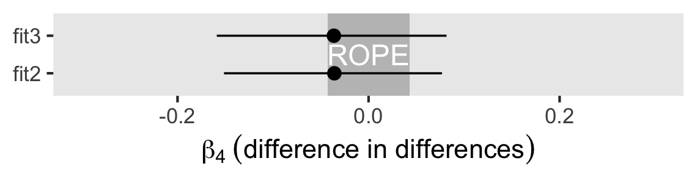

Although the posterior means and a good proportion of the posterior
densities for both models fell inside the ROPE, a lot of the posterior
mass for both models fell outside of the ROPE, as well. In such a case,
Kruschke (2018; <https://doi.org/10.1177/2515245918771304>) recommended
we withhold judgment. That is, the evidence from the present analysis is
not strong enough to conclude whether the pretesting effect is
negligible for our purposes.

## Other concerns

When we made the descriptive plots, you may have noticed some of the IRT
-score
distributions were a little skewed. If those kinds of skew are regular
features of your data, you might consider comparing the conventional
Gaussian likelihood with the skew normal likelihood, which is available
for `brm()` by setting `family = skew_normal()`. For more on the topic,
see the nice (2017; <https://doi.org/10.31234/osf.io/26m49>) preprint by
Martin and Williams, *Outgrowing the procrustean bed of normality: The
utility of the Bayesian modeling for asymmetrical data analysis*.

## Endnote

[^1]: For a generous cache of IAT data sets, see the Project Implicit
    Demo Website Datasets page on the OSF at <https://osf.io/y9hiq/>.
    You can find Race IAT data sets from 2002 through 2021 at
    <https://osf.io/52qxl/>.

[^2]: We should not expect the results from all finite sample data sets
    to conform to the population-level results you’d see in a simulation
    study. Regardless of the results from this one data set, the
    full-information multilevel approach will return more precise
    estimates for at least two of the parameters in the long run.
