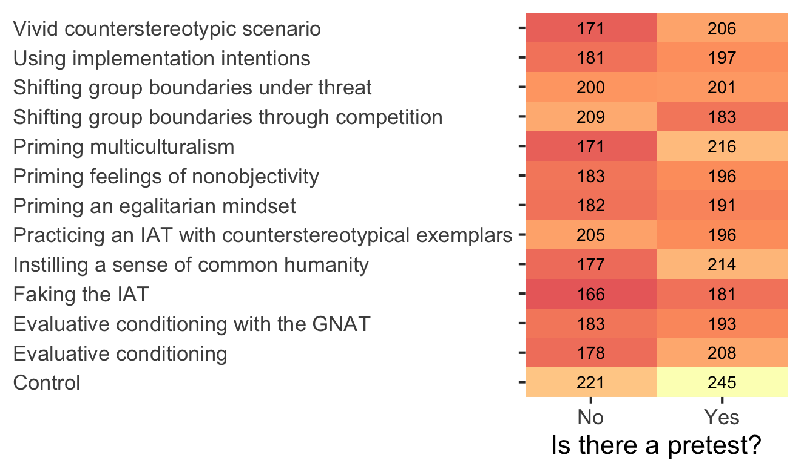
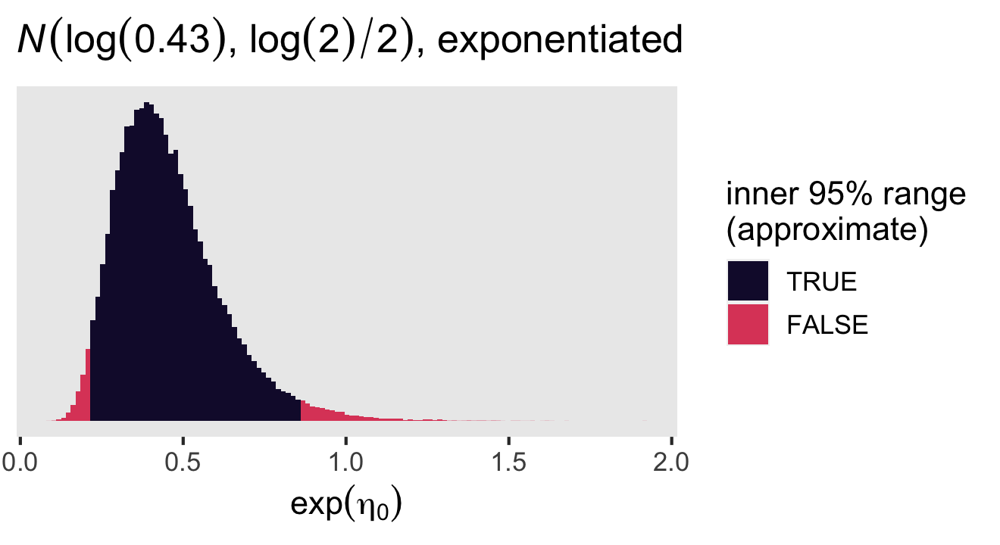

Lai et al (2016)
================
A Solomon Kurz
2022-07-12

Load our primary packages.

``` r
library(tidyverse)
library(brms)
library(tidybayes)
library(patchwork)
```

Before we begin, this content sketch is an extension of an earlier and
simpler content sketch, which you can find
[here](https://github.com/ASKurz/Experimental-design-and-the-GLMM/blob/main/sketches/Lai-et-al--2016-%2C-vivid-counterstereotypic-scenario-versus-control.md).
If you’re new to the Solomon-4 group design, you should really start at
that first sketch.

## Brief online interventions and the effects of a pretest

Implicit bias has been a hot topic in social-psychology research in
recent decades. Implicit bias is most frequently studied with the
Implicit Association Test (IAT), one of the most popular versions of
which is designed to assess relative preference for Black faces versus
White faces. In their Study 4, Lai et al (2014;
<https://doi.org/10.1037/a0036260>) used a Solomon “four”-group design
to compare 13 experimental intervention conditions on reducing pro-White
bias in non-Black participants, and to examine to what extent pretesting
may influence the effect sizes for those interventions. The authors have
a large study repository on the OSF at <https://osf.io/lw9e8/> and you
can download their files at <https://osf.io/lw9e8/files/>. Here we load
the data from their Study 4.

``` r
lai2016 <- haven::read_sav(file = "data/LaietalStudy4.sav") %>% 
  # filter based on the authors' exclusion criteria
  filter(SUBEXCL == 0) %>% 
  filter(doneIAT == 1)

# what?
glimpse(lai2016)
```

    ## Rows: 5,054
    ## Columns: 51
    ## $ session_id   <dbl> 2349258, 2349361, 2349611, 2350331, 2350365, 2350366, 2350370, 2350507, 2350538, 235059…
    ## $ EB3          <dbl> 0.00000000, 0.03125000, 0.03225806, 0.06250000, 0.00000000, 0.00000000, 0.03125000, 0.0…
    ## $ EB5          <dbl> 0.00000000, 0.09375000, 0.03225806, 0.09375000, 0.06250000, 0.00000000, 0.06250000, 0.0…
    ## $ SUBEXCL      <dbl+lbl> 0, 0, 0, 0, 0, 0, 0, 0, 0, 0, 0, 0, 0, 0, 0, 0, 0, 0, 0, 0, 0, 0, 0, 0, 0, 0, 0, 0,…
    ## $ IAT          <dbl> 0.515417774, -0.104030625, -0.297059669, 0.150571254, 0.437533210, 0.094672532, 0.29108…
    ## $ EB3_pre      <dbl> 0.00000000, 0.00000000, 0.00000000, NA, 0.03125000, NA, 0.03225806, 0.28125000, NA, 0.0…
    ## $ EB5_pre      <dbl> 0.03125, 0.09375, 0.09375, NA, 0.03125, NA, 0.03125, 0.12500, NA, 0.03125, 0.59375, 0.0…
    ## $ SUBEXCL_pre  <dbl+lbl>  0,  0,  0, NA,  0, NA,  0,  0, NA,  0,  1,  0,  0, NA,  0, NA, NA,  0,  0,  0,  0,…
    ## $ IAT_pre      <dbl> 0.78762777, 0.89405975, 0.53145878, NA, 0.42864914, NA, -0.30158324, -0.45612161, NA, 0…
    ## $ consented    <dbl+lbl> 1, 1, 1, 1, 1, 1, 1, 1, 1, 1, 1, 1, 1, 1, 1, 1, 1, 1, 1, 1, 1, 1, 1, 1, 1, 1, 1, 1,…
    ## $ debriefed    <dbl+lbl> 1, 1, 1, 1, 1, 1, 1, 1, 1, 1, 1, 1, 1, 1, 1, 1, 1, 1, 1, 1, 1, 1, 1, 1, 1, 1, 1, 1,…
    ## $ judgment1    <dbl+lbl>  1,  1,  0,  0,  0,  0, NA,  1,  0, NA,  0,  0,  1,  0,  0,  1,  1,  0,  0,  0,  0,…
    ## $ judgment2    <dbl+lbl>  0,  0,  0,  1,  0,  0,  0,  1,  0, NA,  0,  0,  1,  0,  0,  1,  0,  0,  0,  0,  0,…
    ## $ sbp10_pe     <dbl> 3, 2, 3, 1, 3, 1, 4, 2, 2, 3, 1, 3, 2, 3, 1, 3, 3, 2, 3, 2, 2, 3, 3, 3, 2, 2, 3, 3, 3, …
    ## $ sbp1_tr      <dbl> 1, 2, 2, 1, 1, 1, 1, 1, 1, 1, 1, 1, 1, 2, 1, 1, 2, 1, 1, 1, 1, 1, 1, 1, 1, 1, 2, 2, 2, …
    ## $ sbp2_tr      <dbl> 1, 1, 1, 1, 1, 1, 1, 1, 1, 1, 3, 1, 2, 1, 1, 2, 2, 1, 1, 2, 1, 1, 3, 1, 3, 1, 1, 1, 2, …
    ## $ sbp3_tr      <dbl> 1, 1, 1, 1, 1, 1, 1, 1, 1, 1, 1, 1, 1, 1, 1, 1, 1, 2, 1, 1, 1, 1, 1, 1, 1, 2, 1, 2, 3, …
    ## $ sbp4_i       <dbl> 1, 1, 2, 1, 1, 1, 1, 1, 1, 1, 1, 1, 1, 1, 1, 1, 1, 1, 1, 1, 1, 1, 1, 1, 1, 1, 2, 1, 1, …
    ## $ sbp5_i       <dbl> 1, 1, 2, 1, 1, 1, 1, 1, 1, 1, 3, 1, 1, 1, 1, 1, 1, 1, 1, 1, 1, 1, 2, 1, 1, 1, 2, 1, 2, …
    ## $ sbp6_tv      <dbl> 3, 4, 3, 1, 3, 2, 3, 1, 1, 1, 3, 3, 1, 3, 2, 2, 3, 4, 2, 3, 2, 2, 4, 3, 2, 1, 2, 3, 4, …
    ## $ sbp7_tv      <dbl> 1, 2, 2, 1, 1, 2, 2, 1, 1, 1, 1, 2, 1, 3, 2, 1, 2, 1, 1, 1, 1, 1, 1, 2, 2, 2, 1, 3, 4, …
    ## $ sbp8_cd      <dbl> 1, 3, 4, 1, 2, 2, 2, 2, 2, 2, 2, 2, 2, 3, 2, 1, 1, 3, 3, 2, 3, 1, 4, 2, 3, 2, 1, 2, 3, …
    ## $ sbp9_cd      <dbl> 1, 1, 3, 1, 1, 1, 1, 2, 2, 1, 3, 1, 1, 3, 2, 2, 1, 2, 2, 1, 3, 1, 2, 3, 3, 2, 4, 1, 3, …
    ## $ major        <dbl> 2, 10, 4, 7, 13, 8, 7, 7, 2, 5, 1, 13, 10, 9, NA, 8, 5, 10, 11, 7, 1, 11, NA, 13, 13, 1…
    ## $ relfamily    <chr> "presbyterian", "agnostic", "atheist", "spiritual, no organized religi", "agnostic", "r…
    ## $ reldenom     <chr> "presbyterian church in the usa", "", "", "", "", "", "", "", "episcopalian", "other ch…
    ## $ edu          <dbl> 7, 9, 8, 8, 10, 9, 13, 7, 14, 8, 9, 5, 7, 10, 4, 7, 8, 9, 9, 9, 5, 5, 3, 8, 8, 9, 6, 5,…
    ## $ politics     <dbl+lbl> -3,  3,  2,  2,  0,  3, -1,  3,  2, -2, -3,  1,  3, -1,  1,  1,  1,  3,  1,  2, -2,…
    ## $ relID        <dbl+lbl>  4,  1,  1,  1,  1,  1,  2,  2,  2,  4,  1,  1,  1,  1,  1,  1,  2,  1,  2,  1,  4,…
    ## $ gender       <chr> "m", "f", "m", "f", "m", "f", "m", "f", "f", "m", "m", "f", "f", "m", "f", "f", "f", "f…
    ## $ work         <chr> "39-1000", "25-9999", "15-1000", "25-9999", "23-1000", "25-9999", "29-1000", "31-1000",…
    ## $ age          <dbl> 51, 26, 34, 38, 42, 33, 34, 44, 58, 29, 77, 39, 23, 37, 21, 29, 33, 34, 25, 36, 22, 18,…
    ## $ race         <chr> "White", "White", "White", "White", "White Hispanic", "White", "White", "White", "White…
    ## $ timeTotal    <chr> "22:27", "15:25", "10:54", "9:22", "20:37", "8:19", "12:53", "13:09", "10:30", "13:13",…
    ## $ TimeManip    <chr> "3:53", "2:55", "3:33", "4:17", "7:09", "2:43", "2:54", "3:56", "3:43", "2:12", "3:58",…
    ## $ TimeIAT      <chr> "3:29", "3:09", "2:10", "2:44", "3:00", "3:15", "2:25", "2:20", "3:55", "2:50", "3:52",…
    ## $ cond_prepost <dbl+lbl> 1, 1, 1, 0, 1, 0, 1, 1, 0, 1, 1, 1, 1, 0, 1, 0, 0, 1, 1, 1, 1, 1, 0, 1, 0, 0, 1, 0,…
    ## $ manip5min    <dbl+lbl> 1, 1, 1, 1, 0, 1, 1, 1, 1, 1, 1, 1, 1, 1, 0, 1, 1, 1, 1, 1, 1, 1, 1, 1, 1, 1, 1, 1,…
    ## $ doneIAT      <dbl+lbl> 1, 1, 1, 1, 1, 1, 1, 1, 1, 1, 1, 1, 1, 1, 1, 1, 1, 1, 1, 1, 1, 1, 1, 1, 1, 1, 1, 1,…
    ## $ doneManip    <dbl+lbl> 1, 1, 1, 1, 1, 1, 1, 1, 1, 1, 1, 1, 1, 1, 1, 1, 1, 1, 1, 1, 1, 1, 1, 1, 1, 1, 1, 1,…
    ## $ sbp          <dbl> 1.4, 1.8, 2.3, 1.0, 1.5, 1.3, 1.7, 1.3, 1.3, 1.3, 1.9, 1.6, 1.3, 2.1, 1.4, 1.5, 1.7, 1.…
    ## $ sbp_b        <dbl> 1.0, 1.2, 1.6, 1.0, 1.0, 1.0, 1.0, 1.0, 1.0, 1.0, 1.8, 1.0, 1.2, 1.2, 1.0, 1.2, 1.4, 1.…
    ## $ sbp_s        <dbl> 1.8, 2.4, 3.0, 1.0, 2.0, 1.6, 2.4, 1.6, 1.6, 1.6, 2.0, 2.2, 1.4, 3.0, 1.8, 1.8, 2.0, 2.…
    ## $ SUBEXCL_ALL  <dbl+lbl> 0, 0, 0, 0, 0, 0, 0, 0, 0, 0, 1, 0, 0, 0, 0, 0, 0, 0, 0, 0, 0, 0, 0, 0, 0, 0, 0, 0,…
    ## $ order        <dbl+lbl> 2, 2, 1, 1, 2, 1, 2, 2, 2, 2, 1, 1, 1, 1, 1, 1, 1, 2, 1, 2, 2, 2, 2, 2, 1, 2, 1, 2,…
    ## $ side         <dbl+lbl> 1, 1, 1, 1, 2, 1, 1, 1, 1, 1, 2, 1, 1, 2, 1, 2, 1, 2, 1, 1, 1, 2, 1, 1, 2, 1, 1, 1,…
    ## $ order_pre    <dbl+lbl>  1,  2,  1, NA,  2, NA,  1,  1, NA,  2,  1,  1,  1, NA,  2, NA, NA,  2,  2,  1,  1,…
    ## $ side_pre     <dbl+lbl>  1,  2,  1, NA,  2, NA,  2,  1, NA,  2,  2,  1,  1, NA,  2, NA, NA,  2,  1,  1,  1,…
    ## $ STUDY        <dbl> 4, 4, 4, 4, 4, 4, 4, 4, 4, 4, 4, 4, 4, 4, 4, 4, 4, 4, 4, 4, 4, 4, 4, 4, 4, 4, 4, 4, 4, …
    ## $ cond         <chr> "Practicing an IAT with counterstereotypical exemplars", "Faking the IAT", "Shifting gr…
    ## $ cond_f       <dbl+lbl>  7,  5, 11,  7,  9, 13,  8, 11,  3,  5, 14,  7,  9,  8, 10,  5,  4,  7, 10, 12,  5,…

We call this a Solomon “four”-group design with *four* in quotations
because Study 4 had a

factorial design with 13 experimental conditions, each of which did or
did not have a pre-test. Here we reduce and reformat the data set a bit.

``` r
lai2016 <- lai2016 %>% 
  select(session_id, IAT_pre, IAT, cond, cond_prepost) %>% 
  mutate(cond_prepost = as_factor(cond_prepost)) %>% 
  mutate(pretest = ifelse(cond_prepost == "Yes", 1, 0),
         tx      = ifelse(cond == "Control", 0, 1)) %>% 
  rename(id = session_id)

# what?
glimpse(lai2016)
```

    ## Rows: 5,054
    ## Columns: 7
    ## $ id           <dbl> 2349258, 2349361, 2349611, 2350331, 2350365, 2350366, 2350370, 2350507, 2350538, 235059…
    ## $ IAT_pre      <dbl> 0.78762777, 0.89405975, 0.53145878, NA, 0.42864914, NA, -0.30158324, -0.45612161, NA, 0…
    ## $ IAT          <dbl> 0.515417774, -0.104030625, -0.297059669, 0.150571254, 0.437533210, 0.094672532, 0.29108…
    ## $ cond         <chr> "Practicing an IAT with counterstereotypical exemplars", "Faking the IAT", "Shifting gr…
    ## $ cond_prepost <fct> Yes, Yes, Yes, No, Yes, No, Yes, Yes, No, Yes, Yes, Yes, Yes, No, Yes, No, No, Yes, Yes…
    ## $ pretest      <dbl> 1, 1, 1, 0, 1, 0, 1, 1, 0, 1, 1, 1, 1, 0, 1, 0, 0, 1, 1, 1, 1, 1, 0, 1, 0, 0, 1, 0, 1, …
    ## $ tx           <dbl> 1, 1, 1, 1, 1, 1, 1, 1, 1, 1, 1, 1, 1, 1, 1, 1, 1, 1, 1, 1, 1, 1, 1, 1, 1, 1, 0, 1, 1, …

The `IAT_pre` and `IAT` columns contain each participant’s

score, based on whether it was taken at the pre- or post-intervention
period. The `cond` column contains the text description of the 13
experimental conditions. The `tx` column contains the same information,
transformed into a dummy variable. The `cond_prepost` column is a factor
variable indicating whether each participant had a pretest assessment
(`Yes`) or not (`No`) and the `pretest` column contains the same
information, transformed into a dummy variable.

We’re also going to want a long-formatted version of the data with
respect to time. We’ll call it `lai2016_long`.

``` r
lai2016_long <- lai2016 %>% 
  pivot_longer(contains("IAT"), values_to = "d") %>% 
  mutate(time = ifelse(str_detect(name, "_pre"), 0, 1))

# what?
glimpse(lai2016_long)
```

    ## Rows: 10,108
    ## Columns: 8
    ## $ id           <dbl> 2349258, 2349258, 2349361, 2349361, 2349611, 2349611, 2350331, 2350331, 2350365, 235036…
    ## $ cond         <chr> "Practicing an IAT with counterstereotypical exemplars", "Practicing an IAT with counte…
    ## $ cond_prepost <fct> Yes, Yes, Yes, Yes, Yes, Yes, No, No, Yes, Yes, No, No, Yes, Yes, Yes, Yes, No, No, Yes…
    ## $ pretest      <dbl> 1, 1, 1, 1, 1, 1, 0, 0, 1, 1, 0, 0, 1, 1, 1, 1, 0, 0, 1, 1, 1, 1, 1, 1, 1, 1, 0, 0, 1, …
    ## $ tx           <dbl> 1, 1, 1, 1, 1, 1, 1, 1, 1, 1, 1, 1, 1, 1, 1, 1, 1, 1, 1, 1, 1, 1, 1, 1, 1, 1, 1, 1, 1, …
    ## $ name         <chr> "IAT_pre", "IAT", "IAT_pre", "IAT", "IAT_pre", "IAT", "IAT_pre", "IAT", "IAT_pre", "IAT…
    ## $ d            <dbl> 0.78762777, 0.51541777, 0.89405975, -0.10403063, 0.53145878, -0.29705967, NA, 0.1505712…
    ## $ time         <dbl> 0, 1, 0, 1, 0, 1, 0, 1, 0, 1, 0, 1, 0, 1, 0, 1, 0, 1, 0, 1, 0, 1, 0, 1, 0, 1, 0, 1, 0, …

With the `lai2016_long` version of the data, the `d` column now contains
all the
-score
information and the timing of the assessment is captured in the new
`time` column, for which the pretesting assessment is coded `0` and the
posttesting assessment is coded `1`.

## EDA

### Sample statistics.

Here are the sample statistics for the IAT

scores at pre- and post-treatment, by the

experimental groups.

``` r
lai2016_long %>% 
  group_by(cond, time, pretest) %>% 
  summarise(mean = mean(d, na.rm = T),
            sd   = sd(d, na.rm = T),
            n    = n()) %>% 
  mutate_if(is.double, round, digits = 2)
```

    ## # A tibble: 52 × 6
    ## # Groups:   cond, time [26]
    ##    cond                                   time pretest   mean    sd     n
    ##    <chr>                                 <dbl>   <dbl>  <dbl> <dbl> <int>
    ##  1 Control                                   0       0 NaN    NA      221
    ##  2 Control                                   0       1   0.42  0.48   245
    ##  3 Control                                   1       0   0.39  0.46   221
    ##  4 Control                                   1       1   0.45  0.4    245
    ##  5 Evaluative conditioning                   0       0 NaN    NA      178
    ##  6 Evaluative conditioning                   0       1   0.41  0.47   208
    ##  7 Evaluative conditioning                   1       0   0.21  0.5    178
    ##  8 Evaluative conditioning                   1       1   0.36  0.43   208
    ##  9 Evaluative conditioning with the GNAT     0       0 NaN    NA      183
    ## 10 Evaluative conditioning with the GNAT     0       1   0.39  0.49   193
    ## # … with 42 more rows

Note the consequences for the structural missing data when `time == 0`
and `pretest == 0`.

### Look at the data.

To get a better sense of the sample sizes, by `cond_prepost` and `cond`,
we might display the numbers in a tile plot.

``` r
# adjust the global plot settings
theme_set(
  theme_gray(base_size = 13) +
    theme(panel.grid = element_blank(),
          plot.title.position = "plot",
          strip.background = element_rect(fill = "grey96"),
          strip.text = element_text(color = "black"))
)

# wrangle
lai2016 %>% 
  count(cond, cond_prepost) %>% 
  
  # plot
  ggplot(aes(x = cond_prepost, y = cond, fill = n, label = n)) +
  geom_tile() +
  geom_text(size = 3) +
  scale_x_discrete("Is there a pretest?", expand = c(0, 0)) +
  scale_y_discrete(NULL, expand = c(0, 0)) +
  scale_fill_viridis_c(option = "A", limits = c(0, NA), breaks = NULL) +
  theme(axis.text.y = element_text(hjust = 0))
```



We can make a similar plot to get a high-level sense of the average
posttest IAT

score, by `cond_prepost` and `cond`

``` r
lai2016 %>% 
  group_by(cond, cond_prepost) %>% 
  summarise(d = mean(IAT, na.rm = T)) %>% 
  mutate(label = round(d, digits = 2)) %>% 
  
  ggplot(aes(x = cond_prepost, y = cond, fill = d, label = label)) +
  geom_tile() +
  geom_text(aes(color = d > 0.2),
            size = 3) +
  scale_fill_viridis_c(expression(widehat(posttest~italic(D)~score)), option = "A", limits = c(0, NA)) +
  scale_color_manual(values = c("white", "black"), breaks = NULL) +
  scale_x_discrete("Is there a pretest?", expand = c(0, 0)) +
  scale_y_discrete(NULL, expand = c(0, 0)) +
  theme(axis.text.y = element_text(hjust = 0))
```


We might want to get a broad sense of the distribution of the posttest

scores with a faceted density plot.

``` r
lai2016 %>% 
  mutate(pretest = cond_prepost) %>% 

  ggplot(aes(x = IAT, y = cond)) +
  stat_slab(aes(fill = stat(x < 0))) +
  scale_fill_viridis_d("bias", begin = .1, end = .6, labels = c("pro White", "pro Black")) +
  labs(x = expression(posttest~italic(D)~score),
       y = NULL) +
  facet_wrap(~ pretest, labeller = label_both) +
  theme(axis.text.y = element_text(hjust = 0))
```


## Models

Given the IAT

scores are continuous with no clear lower or upper limits, the Gaussian
likelihood is a natural default choice. In this script, we’ll entertain
four models:

-   a two-level multilevel model,
-   the corresponding two-level MELSM,
-   a three-level multilevel model, and
-   the corresponding three-level MELSM.

### Two-level model of the posttest assessments.

Given the IAT

scores are continuous with no clear lower or upper limits, the Gaussian
likelihood is a natural default choice. If we say the posttest
-score
values vary across

participants and

experimental conditions, we can assess the effects of pretesting and the
experimental conditions with the model

![
\\begin{align\*}
\\text{IAT}\_{ij} & \\sim \\operatorname{Normal}(\\mu\_{ij}, \\sigma) \\\\
\\mu\_{ij} & = \\beta\_{0j} + \\beta\_{1j} \\text{pretest}\_{ij} + \\left \[u\_{0j} + u\_{1j} \\text{pretest}\_{ij} \\right\] \\\\
\\begin{bmatrix} u\_{0j} \\\\ u\_{1j} \\end{bmatrix} & \\sim \\operatorname{Normal}(\\mathbf 0, \\mathbf{SRS}) \\\\
\\mathbf S & = \\begin{bmatrix} 
  \\sigma_0 \\\\ 0 & \\sigma_1
  \\end{bmatrix} \\\\
\\mathbf R & = \\begin{bmatrix} 
  1 \\\\ \\rho & 1 
  \\end{bmatrix} \\\\
\\beta_0 & \\sim \\operatorname{Normal}(0.37, 0.215) \\\\
\\beta_1 & \\sim \\operatorname{Normal}(0, 0.215) \\\\
\\sigma, \\dots, \\sigma_1  & \\sim \\operatorname{Exponential}(1 / 0.43) \\\\
\\rho & \\sim \\operatorname{LKJ}(2),
\\end{align\*}
](https://latex.codecogs.com/png.image?%5Cdpi%7B110%7D&space;%5Cbg_white&space;%0A%5Cbegin%7Balign%2A%7D%0A%5Ctext%7BIAT%7D_%7Bij%7D%20%26%20%5Csim%20%5Coperatorname%7BNormal%7D%28%5Cmu_%7Bij%7D%2C%20%5Csigma%29%20%5C%5C%0A%5Cmu_%7Bij%7D%20%26%20%3D%20%5Cbeta_%7B0j%7D%20%2B%20%5Cbeta_%7B1j%7D%20%5Ctext%7Bpretest%7D_%7Bij%7D%20%2B%20%5Cleft%20%5Bu_%7B0j%7D%20%2B%20u_%7B1j%7D%20%5Ctext%7Bpretest%7D_%7Bij%7D%20%5Cright%5D%20%5C%5C%0A%5Cbegin%7Bbmatrix%7D%20u_%7B0j%7D%20%5C%5C%20u_%7B1j%7D%20%5Cend%7Bbmatrix%7D%20%26%20%5Csim%20%5Coperatorname%7BNormal%7D%28%5Cmathbf%200%2C%20%5Cmathbf%7BSRS%7D%29%20%5C%5C%0A%5Cmathbf%20S%20%26%20%3D%20%5Cbegin%7Bbmatrix%7D%20%0A%20%20%5Csigma_0%20%5C%5C%200%20%26%20%5Csigma_1%0A%20%20%5Cend%7Bbmatrix%7D%20%5C%5C%0A%5Cmathbf%20R%20%26%20%3D%20%5Cbegin%7Bbmatrix%7D%20%0A%20%201%20%5C%5C%20%5Crho%20%26%201%20%0A%20%20%5Cend%7Bbmatrix%7D%20%5C%5C%0A%5Cbeta_0%20%26%20%5Csim%20%5Coperatorname%7BNormal%7D%280.37%2C%200.215%29%20%5C%5C%0A%5Cbeta_1%20%26%20%5Csim%20%5Coperatorname%7BNormal%7D%280%2C%200.215%29%20%5C%5C%0A%5Csigma%2C%20%5Cdots%2C%20%5Csigma_1%20%20%26%20%5Csim%20%5Coperatorname%7BExponential%7D%281%20%2F%200.43%29%20%5C%5C%0A%5Crho%20%26%20%5Csim%20%5Coperatorname%7BLKJ%7D%282%29%2C%0A%5Cend%7Balign%2A%7D%0A "
\begin{align*}
\text{IAT}_{ij} & \sim \operatorname{Normal}(\mu_{ij}, \sigma) \\
\mu_{ij} & = \beta_{0j} + \beta_{1j} \text{pretest}_{ij} + \left [u_{0j} + u_{1j} \text{pretest}_{ij} \right] \\
\begin{bmatrix} u_{0j} \\ u_{1j} \end{bmatrix} & \sim \operatorname{Normal}(\mathbf 0, \mathbf{SRS}) \\
\mathbf S & = \begin{bmatrix} 
  \sigma_0 \\ 0 & \sigma_1
  \end{bmatrix} \\
\mathbf R & = \begin{bmatrix} 
  1 \\ \rho & 1 
  \end{bmatrix} \\
\beta_0 & \sim \operatorname{Normal}(0.37, 0.215) \\
\beta_1 & \sim \operatorname{Normal}(0, 0.215) \\
\sigma, \dots, \sigma_1  & \sim \operatorname{Exponential}(1 / 0.43) \\
\rho & \sim \operatorname{LKJ}(2),
\end{align*}
")

where

is the grand mean across the

conditions without a pretest and

is the grand mean for the change in

scores when there is a pretest. The

and

terms capture the condition-specific deviations from the grand means,
and those deviations are modeled as bivariate normal.

As to the priors, the IAT literature is distinct in psychology in that
is it vast with a good number of large-sample studies, the data for
several of which are openly available online[^1]. In this script, the
priors come primarily from the second row (*Race attitude*) of Table 2
in Nosek et al (2007, p. 11), who summarized the data from more than 2.5
million participants who completed the IAT’s on a variety of topics,
from mid 2000 to mid 2006. The summaries for the Black-White IAT are
from

participants. Their mean

score was 0.37, with a standard deviation of 0.43.

The
")
prior for

is centered on the population mean from Nosek et al. The scale is half
of the standard deviation reported in Nosek et al, and is meant to
indicate we are pretty certain the data from Lai et al will be similar
to those summarized by Nosek at al. The
")
prior for

puts about 95% of the prior mass of effect sizes greater than a Cohen’s

of -1 and less than a Cohen’s

of 1 for the average difference when there is a pretest. The
")
prior indicates we expect our standard deviation parameters will be near
the population standard deviation. Finally, the
")
prior for the sole level-2 correlation

will weakly regularize the correlation off of the boundaries.

We can extend this to a full MELSM with the equation

![
\\begin{align\*}
\\text{IAT}\_{ij} & \\sim \\operatorname{Normal}(\\mu\_{ij}, \\sigma\_{ij}) \\\\
\\mu\_{ij}          & = \\beta_0 + \\beta_1 \\text{pretest}\_{ij} + \\left \[u\_{0j} + u\_{1j} \\text{pretest}\_{ij} \\right\] \\\\
\\log(\\sigma\_{ij}) & = \\eta_0 + \\eta_1 \\text{pretest}\_{ij} + \\left \[u\_{2j} + u\_{3j} \\text{pretest}\_{ij} \\right\] \\\\
\\begin{bmatrix} u\_{0j} \\\\ u\_{1j} \\\\ u\_{2j} \\\\ u\_{3j} \\end{bmatrix} & \\sim \\operatorname{Normal}(\\mathbf 0, \\mathbf{SRS}) \\\\
\\mathbf S & = \\begin{bmatrix} 
  \\sigma_0 \\\\ 
  0 & \\sigma_1 \\\\
  0 & 0 & \\sigma_2 \\\\
  0 & 0 & 0 & \\sigma_3
  \\end{bmatrix} \\\\
\\mathbf R & = \\begin{bmatrix} 
  1 \\\\ 
  \\rho\_{10} & 1 \\\\ 
  \\rho\_{20} & \\rho\_{21} & 1 \\\\ 
  \\rho\_{30} & \\rho\_{31} & \\rho\_{32} & 1 
  \\end{bmatrix}
  \\end{align\*}
](https://latex.codecogs.com/png.image?%5Cdpi%7B110%7D&space;%5Cbg_white&space;%0A%5Cbegin%7Balign%2A%7D%0A%5Ctext%7BIAT%7D_%7Bij%7D%20%26%20%5Csim%20%5Coperatorname%7BNormal%7D%28%5Cmu_%7Bij%7D%2C%20%5Csigma_%7Bij%7D%29%20%5C%5C%0A%5Cmu_%7Bij%7D%20%20%20%20%20%20%20%20%20%20%26%20%3D%20%5Cbeta_0%20%2B%20%5Cbeta_1%20%5Ctext%7Bpretest%7D_%7Bij%7D%20%2B%20%5Cleft%20%5Bu_%7B0j%7D%20%2B%20u_%7B1j%7D%20%5Ctext%7Bpretest%7D_%7Bij%7D%20%5Cright%5D%20%5C%5C%0A%5Clog%28%5Csigma_%7Bij%7D%29%20%26%20%3D%20%5Ceta_0%20%2B%20%5Ceta_1%20%5Ctext%7Bpretest%7D_%7Bij%7D%20%2B%20%5Cleft%20%5Bu_%7B2j%7D%20%2B%20u_%7B3j%7D%20%5Ctext%7Bpretest%7D_%7Bij%7D%20%5Cright%5D%20%5C%5C%0A%5Cbegin%7Bbmatrix%7D%20u_%7B0j%7D%20%5C%5C%20u_%7B1j%7D%20%5C%5C%20u_%7B2j%7D%20%5C%5C%20u_%7B3j%7D%20%5Cend%7Bbmatrix%7D%20%26%20%5Csim%20%5Coperatorname%7BNormal%7D%28%5Cmathbf%200%2C%20%5Cmathbf%7BSRS%7D%29%20%5C%5C%0A%5Cmathbf%20S%20%26%20%3D%20%5Cbegin%7Bbmatrix%7D%20%0A%20%20%5Csigma_0%20%5C%5C%20%0A%20%200%20%26%20%5Csigma_1%20%5C%5C%0A%20%200%20%26%200%20%26%20%5Csigma_2%20%5C%5C%0A%20%200%20%26%200%20%26%200%20%26%20%5Csigma_3%0A%20%20%5Cend%7Bbmatrix%7D%20%5C%5C%0A%5Cmathbf%20R%20%26%20%3D%20%5Cbegin%7Bbmatrix%7D%20%0A%20%201%20%5C%5C%20%0A%20%20%5Crho_%7B10%7D%20%26%201%20%5C%5C%20%0A%20%20%5Crho_%7B20%7D%20%26%20%5Crho_%7B21%7D%20%26%201%20%5C%5C%20%0A%20%20%5Crho_%7B30%7D%20%26%20%5Crho_%7B31%7D%20%26%20%5Crho_%7B32%7D%20%26%201%20%0A%20%20%5Cend%7Bbmatrix%7D%0A%20%20%5Cend%7Balign%2A%7D%0A "
\begin{align*}
\text{IAT}_{ij} & \sim \operatorname{Normal}(\mu_{ij}, \sigma_{ij}) \\
\mu_{ij}          & = \beta_0 + \beta_1 \text{pretest}_{ij} + \left [u_{0j} + u_{1j} \text{pretest}_{ij} \right] \\
\log(\sigma_{ij}) & = \eta_0 + \eta_1 \text{pretest}_{ij} + \left [u_{2j} + u_{3j} \text{pretest}_{ij} \right] \\
\begin{bmatrix} u_{0j} \\ u_{1j} \\ u_{2j} \\ u_{3j} \end{bmatrix} & \sim \operatorname{Normal}(\mathbf 0, \mathbf{SRS}) \\
\mathbf S & = \begin{bmatrix} 
  \sigma_0 \\ 
  0 & \sigma_1 \\
  0 & 0 & \sigma_2 \\
  0 & 0 & 0 & \sigma_3
  \end{bmatrix} \\
\mathbf R & = \begin{bmatrix} 
  1 \\ 
  \rho_{10} & 1 \\ 
  \rho_{20} & \rho_{21} & 1 \\ 
  \rho_{30} & \rho_{31} & \rho_{32} & 1 
  \end{bmatrix}
  \end{align*}
")

with priors

 \\
\beta_1 & \sim \operatorname{Normal}(0, 0.215) \\
\eta_0 & \sim \operatorname{Normal}(\log(0.43), \log(2) / 2) \\
\eta_1 & \sim \operatorname{Normal}(0, 0.5) \\
\sigma, \sigma_0, \sigma_1  & \sim \operatorname{Exponential}(1 / 0.43) \\
\sigma_2, \sigma_3  & \sim \operatorname{Exponential}(1) \\
\rho & \sim \operatorname{LKJ}(1)
\end{align*}
")

where the within-person residual standard deviation

now varies across

parsons and

experimental conditions. The model for
")
mirrors the model for
,
from before.

By centering our prior for

on
"),
we are indicating we expect the residual standard deviation at pretest
to fall near the population standard deviation reported by Nosek et
al. The scale hyperparameter
 / 2")
indicates that after exponentiation, we’d like about 95% of the prior
mass to range between half of the population value
")
and twice the population value
").
If that’s not clear why, here’s a quick simulation.

``` r
set.seed(1)

tibble(prior = rnorm(n = 1e5, mean = log(0.43), sd = log(2) / 2)) %>% 
  mutate(sigma = exp(prior)) %>% 
  mutate(range = sigma > 0.215 & sigma < 0.86) %>% 
  mutate(range = factor(range, levels = c("TRUE", "FALSE"))) %>% 
  
  ggplot(aes(x = sigma, fill = range)) +
  geom_histogram(binwidth = 0.015, boundary = 0.215) +
  scale_fill_viridis_d("inner 95% range\n(approximate)", option = "A", begin = .1, end = .6) +
  scale_y_continuous(NULL, breaks = NULL) +
  labs(title = expression(italic(N)(log(0.43)*', '*log(2)/2)*', exponentiated'),
       x = expression(exp(eta[0])))
```



The
")
prior for

is meant to be weakly regularizing and restrain the experimental effects
on the residual standard deviation to within an order of magnitude
(i.e., an change of 1 on the log scale). The
")
prior for

and

is meant to be similarly regularizing for the condition-level
differences in residual standard deviations.

Here’s how to fit the two models with `brm()`.

``` r
# 2-level MLM
fit1 <- brm(
  data = lai2016,
  family = gaussian,
  IAT ~ 0 + Intercept + pretest + (1 + pretest | cond),
  prior = c(prior(normal(0.37, 0.215), class = b, coef = Intercept),
            prior(normal(0, 0.215), class = b),
            prior(exponential(1 / 0.43), class = sigma),
            prior(exponential(1 / 0.43), class = sd),
            prior(lkj(2), class = cor)),
  cores = 4, 
  seed = 1,
  file = "fits/fit1.lai2016"
)

# 2-level MELSM
fit2 <- brm(
  data = lai2016,
  family = gaussian,
  bf(IAT   ~ 0 + Intercept + pretest + (1 + pretest |j| cond),
     sigma ~ 0 + Intercept + pretest + (1 + pretest |j| cond)),
  prior = c(# mu model
            prior(normal(0.37, 0.215), class = b, coef = Intercept),
            prior(normal(0, 0.215), class = b),
            prior(exponential(1 / 0.43), class = sd),
            # log(sigma) model
            prior(normal(log(0.43), log(2) / 2), class = b, coef = Intercept, dpar = sigma),
            prior(normal(0, 0.5), class = b, dpar = sigma),
            prior(exponential(1 / 0.5), class = sd, dpar = sigma),
            
            prior(lkj(1), class = cor)),
  cores = 4, 
  seed = 1,
  file = "fits/fit2.lai2016"
)
```

Check the summaries.

``` r
summary(fit1)
```

    ##  Family: gaussian 
    ##   Links: mu = identity; sigma = identity 
    ## Formula: IAT ~ 0 + Intercept + pretest + (1 + pretest | cond) 
    ##    Data: lai2016 (Number of observations: 5018) 
    ##   Draws: 4 chains, each with iter = 2000; warmup = 1000; thin = 1;
    ##          total post-warmup draws = 4000
    ## 
    ## Group-Level Effects: 
    ## ~cond (Number of levels: 13) 
    ##                        Estimate Est.Error l-95% CI u-95% CI Rhat Bulk_ESS Tail_ESS
    ## sd(Intercept)              0.11      0.03     0.07     0.17 1.00     1494     2139
    ## sd(pretest)                0.07      0.03     0.02     0.12 1.00     1330     1248
    ## cor(Intercept,pretest)    -0.22      0.30    -0.72     0.42 1.00     2633     2858
    ## 
    ## Population-Level Effects: 
    ##           Estimate Est.Error l-95% CI u-95% CI Rhat Bulk_ESS Tail_ESS
    ## Intercept     0.29      0.03     0.23     0.36 1.00     1095     1685
    ## pretest       0.01      0.02    -0.04     0.05 1.00     2413     2293
    ## 
    ## Family Specific Parameters: 
    ##       Estimate Est.Error l-95% CI u-95% CI Rhat Bulk_ESS Tail_ESS
    ## sigma     0.48      0.00     0.47     0.49 1.00     5427     2278
    ## 
    ## Draws were sampled using sampling(NUTS). For each parameter, Bulk_ESS
    ## and Tail_ESS are effective sample size measures, and Rhat is the potential
    ## scale reduction factor on split chains (at convergence, Rhat = 1).

``` r
summary(fit2)
```

    ##  Family: gaussian 
    ##   Links: mu = identity; sigma = log 
    ## Formula: IAT ~ 0 + Intercept + pretest + (1 + pretest | j | cond) 
    ##          sigma ~ 0 + Intercept + pretest + (1 + pretest | j | cond)
    ##    Data: lai2016 (Number of observations: 5018) 
    ##   Draws: 4 chains, each with iter = 2000; warmup = 1000; thin = 1;
    ##          total post-warmup draws = 4000
    ## 
    ## Group-Level Effects: 
    ## ~cond (Number of levels: 13) 
    ##                                    Estimate Est.Error l-95% CI u-95% CI Rhat Bulk_ESS Tail_ESS
    ## sd(Intercept)                          0.11      0.03     0.07     0.17 1.00     1058     1858
    ## sd(pretest)                            0.07      0.03     0.02     0.12 1.00     1164     1175
    ## sd(sigma_Intercept)                    0.11      0.03     0.07     0.18 1.01     1725     2143
    ## sd(sigma_pretest)                      0.04      0.03     0.00     0.10 1.00     1722     1916
    ## cor(Intercept,pretest)                -0.26      0.29    -0.75     0.37 1.00     2147     2426
    ## cor(Intercept,sigma_Intercept)        -0.48      0.24    -0.85     0.06 1.00     1764     2597
    ## cor(pretest,sigma_Intercept)          -0.32      0.31    -0.83     0.34 1.00     1740     2681
    ## cor(Intercept,sigma_pretest)           0.01      0.42    -0.78     0.78 1.00     4796     2843
    ## cor(pretest,sigma_pretest)            -0.19      0.43    -0.88     0.68 1.00     3096     2830
    ## cor(sigma_Intercept,sigma_pretest)     0.06      0.42    -0.74     0.81 1.00     4535     2966
    ## 
    ## Population-Level Effects: 
    ##                 Estimate Est.Error l-95% CI u-95% CI Rhat Bulk_ESS Tail_ESS
    ## Intercept           0.29      0.03     0.23     0.35 1.00      937     1573
    ## pretest             0.01      0.02    -0.04     0.05 1.00     1714     2159
    ## sigma_Intercept    -0.68      0.04    -0.75    -0.61 1.00     1416     1996
    ## sigma_pretest      -0.11      0.02    -0.16    -0.07 1.00     4223     2627
    ## 
    ## Draws were sampled using sampling(NUTS). For each parameter, Bulk_ESS
    ## and Tail_ESS are effective sample size measures, and Rhat is the potential
    ## scale reduction factor on split chains (at convergence, Rhat = 1).

You might compare the two versions fo the model with information
criteria.

``` r
fit1 <- add_criterion(fit1, criterion = c("loo", "waic"))
fit2 <- add_criterion(fit2, criterion = c("loo", "waic"))

loo_compare(fit1, fit2, criterion = "loo") %>% print(simplify = F)
```

    ##      elpd_diff se_diff elpd_loo se_elpd_loo p_loo   se_p_loo looic   se_looic
    ## fit2     0.0       0.0 -3422.8     49.3        35.6     1.2   6845.6    98.5 
    ## fit1   -63.7      12.8 -3486.5     50.6        22.7     0.5   6973.0   101.2

``` r
loo_compare(fit1, fit2, criterion = "waic") %>% print(simplify = F)
```

    ##      elpd_diff se_diff elpd_waic se_elpd_waic p_waic  se_p_waic waic    se_waic
    ## fit2     0.0       0.0 -3422.7      49.3         35.5     1.2    6845.5    98.5
    ## fit1   -63.7      12.8 -3486.5      50.6         22.7     0.5    6972.9   101.2

By both the LOO and the WAIC, the full distributional version of the
model provides a decisively better description of the data. To help
clarity why, we might display the various

posteriors in a coefficient plot. To my mind, this will be easiest with
help from `fitted()`.

``` r
# compute the population means for sigma
nd <- lai2016 %>% 
  distinct(pretest)

population_sigma <- fitted(
  fit2, 
  newdata = nd,
  dpar = "sigma",
  re_formula = NA) %>% 
  data.frame() %>% 
  bind_cols(nd) %>% 
  mutate(pretest = factor(pretest, levels = 1:0, labels = c("pretest and posttest", "posttest only")))

# compute the group-specific levels for sigma
nd <- lai2016 %>% 
  distinct(cond, pretest)

fitted(fit2, 
       newdata = nd,
       dpar = "sigma") %>% 
  data.frame() %>% 
  bind_cols(nd) %>% 
  mutate(pretest = factor(pretest, levels = 1:0, labels = c("pretest and posttest", "posttest only"))) %>% 
  
  # plot!
  ggplot(aes(x = Estimate, xmin = Q2.5, xmax = Q97.5)) +
  geom_rect(data = population_sigma,
            aes(ymin = -Inf, ymax = Inf, fill = pretest),
            alpha = 1/6) +
  geom_vline(data = population_sigma,
             aes(xintercept = Estimate, color = pretest),
             alpha = 2/6, show.legend = F) +
  geom_pointinterval(aes(y = reorder(cond, Estimate), color = pretest),
                     point_size = 1.5, position = position_dodge(width = .33)) +
  scale_fill_viridis_d(NULL, option = "C", end = .4) +
  scale_color_viridis_d(NULL, option = "C", end = .4) +
  labs(title = "MELSM residual standard deviations vary by experimental condition and pretest status",
       subtitle = "The semitransparent vertical lines and ribbons depict the population means and their 95% intervals.",
       x = expression(sigma[italic(ij)]),
       y = NULL) +
  xlim(0.3, 0.8) +
  theme(axis.text.y = element_text(hjust = 0),
        legend.position = "top")
```


At the population level, the posttest-only condition produces larger
variability, on average, among the

scores. That pattern replicated across all of the experimental treatment
groups (y-axis). Though most of the experimental groups had very similar
standard deviations within their pretest status, there was some
variability at the extremes, particularly for the `Faking the IAT`
group. If desired, one could make a similar plot for the levels of
.

In a typical Solomon 4-group design, the primary contrast of interest is
the difference in differences for the two levels of treatment the two
levels of pretest status. For Lai et al’s modified Solomon 26-group
design, I’d argue this would translate to 12 differences in differences
where the control group is contrasted with each of the active
experimental conditions. We might use a coefficient plot to display
those contrasts from the distributional model.

``` r
# compute, wrangle, and save
d_in_d_fit2 <- lai2016 %>% 
  distinct(cond, pretest) %>% 
  add_epred_draws(fit2, 
                  dpar = c("mu", "sigma")) %>% 
  ungroup() %>% 
  select(cond:pretest, .draw, mu, sigma) %>% 
  pivot_longer(mu:sigma, names_to = "parameter") %>% 
  pivot_wider(values_from = value, names_from = pretest) %>% 
  mutate(d = `1` - `0`) %>% 
  compare_levels(d, by = cond, draw_indices = c("parameter", ".draw")) %>% 
  filter(str_detect(cond, "Control")) %>%
  mutate(parameter = str_c(parameter, "[italic(ij)]"))

# plot
d_in_d_fit2 %>% 
  ggplot(aes(y = reorder(cond, d), x = d)) +
  geom_vline(xintercept = 0, color = "white") +
  stat_pointinterval(point_interval = mean_qi, .width = .95, size = 1/4) +
  scale_x_continuous(expand = c(0.08, 0.08)) +
  labs(title = expression("Pretesting's minimal influence on the causal effect on IAT "*italic(D)~scores),
       x = "difference in differences",
       y = NULL) +
  theme(panel.grid.major.y = element_blank(),
        panel.grid.minor.x = element_blank(),
        axis.text.y = element_text(hjust = 0)) +
  facet_wrap(~ parameter, labeller = label_parsed, scales = "free_x")
```


Note how the distributional model allows for differences in differences
for both

and
.
As it turns out, the contrasts all hover around zero for both
parameters. Thus, there’s little evidence the pretest matters much for
the causal effect.

Though I’ve given a focused plot of the differences in differences,
researchers could look at all the contrasts among experimental groups,
if desired.

### Three-level model of the posttest assessments.

Those first two approaches to analyzing Lai et al’s Solomon 26-group
data fine in that they will return unbiased estimates of the causal
effects of pretesting. However, they’re wasteful how they fail to
capitalize on the power boost that comes from incorporating the
information from the pretest assessments. To avoid dropping the data
from the participants in the posttest-only conditions, we can fit a
three-level model of the form

![
\\begin{align\*}
\\text{d}\_{ijt} & \\sim \\operatorname{Normal}(\\mu\_{ijt}, \\sigma) \\\\
\\mu\_{ijt} & = \\beta\_{0ij} + \\beta\_{1j} \\text{time}\_{ijt} + \\beta\_{2j} \\text{pretest}\_{ijt}\\text{time}\_{ijt} + \\left\[u\_{0j} + u\_{1j} \\text{time}\_{ijt} + u\_{2j} \\text{pretest}\_{ijt}\\text{time}\_{ijt} \\right\] + \\left\[v\_{0ij} \\right\] \\\\
\\begin{bmatrix} u\_{0j} \\\\ u\_{1j} \\\\ u\_{2j} \\end{bmatrix} & \\sim \\operatorname{Normal}(\\mathbf 0, \\mathbf{SRS}) \\\\
\\mathbf S & = \\begin{bmatrix} 
  \\sigma\_{u0} \\\\ 
  0 & \\sigma\_{u1} \\\\
  0 & 0 & \\sigma\_{u2} 
  \\end{bmatrix} \\\\
\\mathbf R & = \\begin{bmatrix} 
  1 \\\\ 
  \\rho\_{10} & 1 \\\\ 
  \\rho\_{20} & \\rho\_{21} & 1 
  \\end{bmatrix} \\\\
v\_{0ij} & \\sim \\operatorname{Normal}(0, \\sigma\_{v0}) \\\\
\\beta_0                 & \\sim \\operatorname{Normal}(0.37, 0.215) \\\\
\\beta_1, \\beta_2 & \\sim \\operatorname{Normal}(0, 0.215) \\\\
\\sigma, \\dots, \\sigma\_{v0} & \\sim \\operatorname{Exponential}(1 / 0.43) \\\\
\\mathbf R & \\sim \\operatorname{LKJ}(1),
\\end{align\*}
](https://latex.codecogs.com/png.image?%5Cdpi%7B110%7D&space;%5Cbg_white&space;%0A%5Cbegin%7Balign%2A%7D%0A%5Ctext%7Bd%7D_%7Bijt%7D%20%26%20%5Csim%20%5Coperatorname%7BNormal%7D%28%5Cmu_%7Bijt%7D%2C%20%5Csigma%29%20%5C%5C%0A%5Cmu_%7Bijt%7D%20%26%20%3D%20%5Cbeta_%7B0ij%7D%20%2B%20%5Cbeta_%7B1j%7D%20%5Ctext%7Btime%7D_%7Bijt%7D%20%2B%20%5Cbeta_%7B2j%7D%20%5Ctext%7Bpretest%7D_%7Bijt%7D%5Ctext%7Btime%7D_%7Bijt%7D%20%2B%20%5Cleft%5Bu_%7B0j%7D%20%2B%20u_%7B1j%7D%20%5Ctext%7Btime%7D_%7Bijt%7D%20%2B%20u_%7B2j%7D%20%5Ctext%7Bpretest%7D_%7Bijt%7D%5Ctext%7Btime%7D_%7Bijt%7D%20%5Cright%5D%20%2B%20%5Cleft%5Bv_%7B0ij%7D%20%5Cright%5D%20%5C%5C%0A%5Cbegin%7Bbmatrix%7D%20u_%7B0j%7D%20%5C%5C%20u_%7B1j%7D%20%5C%5C%20u_%7B2j%7D%20%5Cend%7Bbmatrix%7D%20%26%20%5Csim%20%5Coperatorname%7BNormal%7D%28%5Cmathbf%200%2C%20%5Cmathbf%7BSRS%7D%29%20%5C%5C%0A%5Cmathbf%20S%20%26%20%3D%20%5Cbegin%7Bbmatrix%7D%20%0A%20%20%5Csigma_%7Bu0%7D%20%5C%5C%20%0A%20%200%20%26%20%5Csigma_%7Bu1%7D%20%5C%5C%0A%20%200%20%26%200%20%26%20%5Csigma_%7Bu2%7D%20%0A%20%20%5Cend%7Bbmatrix%7D%20%5C%5C%0A%5Cmathbf%20R%20%26%20%3D%20%5Cbegin%7Bbmatrix%7D%20%0A%20%201%20%5C%5C%20%0A%20%20%5Crho_%7B10%7D%20%26%201%20%5C%5C%20%0A%20%20%5Crho_%7B20%7D%20%26%20%5Crho_%7B21%7D%20%26%201%20%0A%20%20%5Cend%7Bbmatrix%7D%20%5C%5C%0Av_%7B0ij%7D%20%26%20%5Csim%20%5Coperatorname%7BNormal%7D%280%2C%20%5Csigma_%7Bv0%7D%29%20%5C%5C%0A%5Cbeta_0%20%20%20%20%20%20%20%20%20%20%20%20%20%20%20%20%20%26%20%5Csim%20%5Coperatorname%7BNormal%7D%280.37%2C%200.215%29%20%5C%5C%0A%5Cbeta_1%2C%20%5Cbeta_2%20%26%20%5Csim%20%5Coperatorname%7BNormal%7D%280%2C%200.215%29%20%5C%5C%0A%5Csigma%2C%20%5Cdots%2C%20%5Csigma_%7Bv0%7D%20%26%20%5Csim%20%5Coperatorname%7BExponential%7D%281%20%2F%200.43%29%20%5C%5C%0A%5Cmathbf%20R%20%26%20%5Csim%20%5Coperatorname%7BLKJ%7D%281%29%2C%0A%5Cend%7Balign%2A%7D%0A "
\begin{align*}
\text{d}_{ijt} & \sim \operatorname{Normal}(\mu_{ijt}, \sigma) \\
\mu_{ijt} & = \beta_{0ij} + \beta_{1j} \text{time}_{ijt} + \beta_{2j} \text{pretest}_{ijt}\text{time}_{ijt} + \left[u_{0j} + u_{1j} \text{time}_{ijt} + u_{2j} \text{pretest}_{ijt}\text{time}_{ijt} \right] + \left[v_{0ij} \right] \\
\begin{bmatrix} u_{0j} \\ u_{1j} \\ u_{2j} \end{bmatrix} & \sim \operatorname{Normal}(\mathbf 0, \mathbf{SRS}) \\
\mathbf S & = \begin{bmatrix} 
  \sigma_{u0} \\ 
  0 & \sigma_{u1} \\
  0 & 0 & \sigma_{u2} 
  \end{bmatrix} \\
\mathbf R & = \begin{bmatrix} 
  1 \\ 
  \rho_{10} & 1 \\ 
  \rho_{20} & \rho_{21} & 1 
  \end{bmatrix} \\
v_{0ij} & \sim \operatorname{Normal}(0, \sigma_{v0}) \\
\beta_0                 & \sim \operatorname{Normal}(0.37, 0.215) \\
\beta_1, \beta_2 & \sim \operatorname{Normal}(0, 0.215) \\
\sigma, \dots, \sigma_{v0} & \sim \operatorname{Exponential}(1 / 0.43) \\
\mathbf R & \sim \operatorname{LKJ}(1),
\end{align*}
")

where now our criterion variable `d` varies across

participants,

conditions, and

time points.

is now the grand mean for the pretest assessments, which varies across

participants and

conditions.

captures the grand-mean deviation of the posttests from the pretests,
for those who did not have a pretest, the magnitude of which may vary
across the

conditions. The

parameter is the grand-mean deviation of the posttests from the
pretests, for those who did have a pretest, relative to those who did
not, which may also vary across the

conditions. The
,
,
and

terms capture the condition-specific deviations from the grand means,
and those deviations are modeled as multivariate normal. The

term captures the person-level variation in pretest intercepts, and
accounts for temporal dependencies inherent in longitudinal data. As to
the priors, the sensibilities mirror those from the 2-level `fit1`,
above.

We can extend this framework to a full 3-level MELSM, of the form

![
\\begin{align\*}
\\text{d}\_{ijt} & \\sim \\operatorname{Normal}(\\mu\_{ijt}, \\sigma\_{ijt}) \\\\
\\mu\_{ijt} & = \\beta\_{0ij} + \\beta\_{1j} \\text{time}\_{ijt} + \\beta\_{2j} \\text{pretest}\_{ijt}\\text{time}\_{ijt} + \\left\[u\_{0j} + u\_{1j} \\text{time}\_{ijt} + u\_{2j} \\text{pretest}\_{ijt}\\text{time}\_{ijt} \\right\] + \\left\[v\_{0ij} \\right\] \\\\
\\log(\\sigma\_{ijt}) & = \\eta\_{0ij} + \\eta\_{1j} \\text{time}\_{ijt} + \\eta\_{2j} \\text{pretest}\_{ijt}\\text{time}\_{ijt} + \\left\[u\_{3j} + u\_{4j} \\text{time}\_{ijt} + u\_{5j} \\text{pretest}\_{ijt}\\text{time}\_{ijt} \\right\] + \\left\[v\_{1ij} \\right\],
\\end{align\*}
](https://latex.codecogs.com/png.image?%5Cdpi%7B110%7D&space;%5Cbg_white&space;%0A%5Cbegin%7Balign%2A%7D%0A%5Ctext%7Bd%7D_%7Bijt%7D%20%26%20%5Csim%20%5Coperatorname%7BNormal%7D%28%5Cmu_%7Bijt%7D%2C%20%5Csigma_%7Bijt%7D%29%20%5C%5C%0A%5Cmu_%7Bijt%7D%20%26%20%3D%20%5Cbeta_%7B0ij%7D%20%2B%20%5Cbeta_%7B1j%7D%20%5Ctext%7Btime%7D_%7Bijt%7D%20%2B%20%5Cbeta_%7B2j%7D%20%5Ctext%7Bpretest%7D_%7Bijt%7D%5Ctext%7Btime%7D_%7Bijt%7D%20%2B%20%5Cleft%5Bu_%7B0j%7D%20%2B%20u_%7B1j%7D%20%5Ctext%7Btime%7D_%7Bijt%7D%20%2B%20u_%7B2j%7D%20%5Ctext%7Bpretest%7D_%7Bijt%7D%5Ctext%7Btime%7D_%7Bijt%7D%20%5Cright%5D%20%2B%20%5Cleft%5Bv_%7B0ij%7D%20%5Cright%5D%20%5C%5C%0A%5Clog%28%5Csigma_%7Bijt%7D%29%20%26%20%3D%20%5Ceta_%7B0ij%7D%20%2B%20%5Ceta_%7B1j%7D%20%5Ctext%7Btime%7D_%7Bijt%7D%20%2B%20%5Ceta_%7B2j%7D%20%5Ctext%7Bpretest%7D_%7Bijt%7D%5Ctext%7Btime%7D_%7Bijt%7D%20%2B%20%5Cleft%5Bu_%7B3j%7D%20%2B%20u_%7B4j%7D%20%5Ctext%7Btime%7D_%7Bijt%7D%20%2B%20u_%7B5j%7D%20%5Ctext%7Bpretest%7D_%7Bijt%7D%5Ctext%7Btime%7D_%7Bijt%7D%20%5Cright%5D%20%2B%20%5Cleft%5Bv_%7B1ij%7D%20%5Cright%5D%2C%0A%5Cend%7Balign%2A%7D%0A "
\begin{align*}
\text{d}_{ijt} & \sim \operatorname{Normal}(\mu_{ijt}, \sigma_{ijt}) \\
\mu_{ijt} & = \beta_{0ij} + \beta_{1j} \text{time}_{ijt} + \beta_{2j} \text{pretest}_{ijt}\text{time}_{ijt} + \left[u_{0j} + u_{1j} \text{time}_{ijt} + u_{2j} \text{pretest}_{ijt}\text{time}_{ijt} \right] + \left[v_{0ij} \right] \\
\log(\sigma_{ijt}) & = \eta_{0ij} + \eta_{1j} \text{time}_{ijt} + \eta_{2j} \text{pretest}_{ijt}\text{time}_{ijt} + \left[u_{3j} + u_{4j} \text{time}_{ijt} + u_{5j} \text{pretest}_{ijt}\text{time}_{ijt} \right] + \left[v_{1ij} \right],
\end{align*}
")

with level-3 structure

![
\\begin{align\*}
\\begin{bmatrix} u\_{0j} \\\\ u\_{1j} \\\\ u\_{2j} \\\\ u\_{3j} \\\\ u\_{4j} \\\\ u\_{5j} \\end{bmatrix} & \\sim 
  \\operatorname{Normal} \\left (
    \\begin{bmatrix} 0 \\\\ 0 \\\\ 0 \\\\ 0 \\\\ 0 \\\\ 0 \\end{bmatrix}, 
    \\begin{bmatrix} 
      \\sigma\_{u0}^2 \\\\ 
      \\sigma\_{u1}\\sigma\_{u0}\\rho\_{u1u0} & \\sigma\_{u1}^2 \\\\ 
      \\sigma\_{u2}\\sigma\_{u0}\\rho\_{u2u0} & \\sigma\_{u2}\\sigma\_{u1}\\rho\_{u2u1} & \\sigma\_{u2}^2 \\\\ 
      \\sigma\_{u4}\\sigma\_{u0}\\rho\_{u3u0} & \\sigma\_{u3}\\sigma\_{u1}\\rho\_{u3u1} & \\sigma\_{u3}\\sigma\_{u2}\\rho\_{u3u2} & \\sigma\_{u3}^2 \\\\ 
      \\sigma\_{u5}\\sigma\_{u0}\\rho\_{u4u0} & \\sigma\_{u4}\\sigma\_{u1}\\rho\_{u4u1} & \\sigma\_{u4}\\sigma\_{u2}\\rho\_{u4u2} & \\sigma\_{u4}\\sigma\_{u3}\\rho\_{u4u3} & \\sigma\_{u4}^2 \\\\ 
      \\sigma\_{u6}\\sigma\_{u0}\\rho\_{u5u0} & \\sigma\_{u5}\\sigma\_{u1}\\rho\_{u5u1} & \\sigma\_{u5}\\sigma\_{u2}\\rho\_{u5u2} & \\sigma\_{u5}\\sigma\_{u3}\\rho\_{u5u3} & \\sigma\_{u5}\\sigma\_{u4}\\rho\_{u5u4} & \\sigma\_{u5}^2
    \\end{bmatrix} \\right),
\\end{align\*}
](https://latex.codecogs.com/png.image?%5Cdpi%7B110%7D&space;%5Cbg_white&space;%0A%5Cbegin%7Balign%2A%7D%0A%5Cbegin%7Bbmatrix%7D%20u_%7B0j%7D%20%5C%5C%20u_%7B1j%7D%20%5C%5C%20u_%7B2j%7D%20%5C%5C%20u_%7B3j%7D%20%5C%5C%20u_%7B4j%7D%20%5C%5C%20u_%7B5j%7D%20%5Cend%7Bbmatrix%7D%20%26%20%5Csim%20%0A%20%20%5Coperatorname%7BNormal%7D%20%5Cleft%20%28%0A%20%20%20%20%5Cbegin%7Bbmatrix%7D%200%20%5C%5C%200%20%5C%5C%200%20%5C%5C%200%20%5C%5C%200%20%5C%5C%200%20%5Cend%7Bbmatrix%7D%2C%20%0A%20%20%20%20%5Cbegin%7Bbmatrix%7D%20%0A%20%20%20%20%20%20%5Csigma_%7Bu0%7D%5E2%20%5C%5C%20%0A%20%20%20%20%20%20%5Csigma_%7Bu1%7D%5Csigma_%7Bu0%7D%5Crho_%7Bu1u0%7D%20%26%20%5Csigma_%7Bu1%7D%5E2%20%5C%5C%20%0A%20%20%20%20%20%20%5Csigma_%7Bu2%7D%5Csigma_%7Bu0%7D%5Crho_%7Bu2u0%7D%20%26%20%5Csigma_%7Bu2%7D%5Csigma_%7Bu1%7D%5Crho_%7Bu2u1%7D%20%26%20%5Csigma_%7Bu2%7D%5E2%20%5C%5C%20%0A%20%20%20%20%20%20%5Csigma_%7Bu4%7D%5Csigma_%7Bu0%7D%5Crho_%7Bu3u0%7D%20%26%20%5Csigma_%7Bu3%7D%5Csigma_%7Bu1%7D%5Crho_%7Bu3u1%7D%20%26%20%5Csigma_%7Bu3%7D%5Csigma_%7Bu2%7D%5Crho_%7Bu3u2%7D%20%26%20%5Csigma_%7Bu3%7D%5E2%20%5C%5C%20%0A%20%20%20%20%20%20%5Csigma_%7Bu5%7D%5Csigma_%7Bu0%7D%5Crho_%7Bu4u0%7D%20%26%20%5Csigma_%7Bu4%7D%5Csigma_%7Bu1%7D%5Crho_%7Bu4u1%7D%20%26%20%5Csigma_%7Bu4%7D%5Csigma_%7Bu2%7D%5Crho_%7Bu4u2%7D%20%26%20%5Csigma_%7Bu4%7D%5Csigma_%7Bu3%7D%5Crho_%7Bu4u3%7D%20%26%20%5Csigma_%7Bu4%7D%5E2%20%5C%5C%20%0A%20%20%20%20%20%20%5Csigma_%7Bu6%7D%5Csigma_%7Bu0%7D%5Crho_%7Bu5u0%7D%20%26%20%5Csigma_%7Bu5%7D%5Csigma_%7Bu1%7D%5Crho_%7Bu5u1%7D%20%26%20%5Csigma_%7Bu5%7D%5Csigma_%7Bu2%7D%5Crho_%7Bu5u2%7D%20%26%20%5Csigma_%7Bu5%7D%5Csigma_%7Bu3%7D%5Crho_%7Bu5u3%7D%20%26%20%5Csigma_%7Bu5%7D%5Csigma_%7Bu4%7D%5Crho_%7Bu5u4%7D%20%26%20%5Csigma_%7Bu5%7D%5E2%0A%20%20%20%20%5Cend%7Bbmatrix%7D%20%5Cright%29%2C%0A%5Cend%7Balign%2A%7D%0A "
\begin{align*}
\begin{bmatrix} u_{0j} \\ u_{1j} \\ u_{2j} \\ u_{3j} \\ u_{4j} \\ u_{5j} \end{bmatrix} & \sim 
  \operatorname{Normal} \left (
    \begin{bmatrix} 0 \\ 0 \\ 0 \\ 0 \\ 0 \\ 0 \end{bmatrix}, 
    \begin{bmatrix} 
      \sigma_{u0}^2 \\ 
      \sigma_{u1}\sigma_{u0}\rho_{u1u0} & \sigma_{u1}^2 \\ 
      \sigma_{u2}\sigma_{u0}\rho_{u2u0} & \sigma_{u2}\sigma_{u1}\rho_{u2u1} & \sigma_{u2}^2 \\ 
      \sigma_{u4}\sigma_{u0}\rho_{u3u0} & \sigma_{u3}\sigma_{u1}\rho_{u3u1} & \sigma_{u3}\sigma_{u2}\rho_{u3u2} & \sigma_{u3}^2 \\ 
      \sigma_{u5}\sigma_{u0}\rho_{u4u0} & \sigma_{u4}\sigma_{u1}\rho_{u4u1} & \sigma_{u4}\sigma_{u2}\rho_{u4u2} & \sigma_{u4}\sigma_{u3}\rho_{u4u3} & \sigma_{u4}^2 \\ 
      \sigma_{u6}\sigma_{u0}\rho_{u5u0} & \sigma_{u5}\sigma_{u1}\rho_{u5u1} & \sigma_{u5}\sigma_{u2}\rho_{u5u2} & \sigma_{u5}\sigma_{u3}\rho_{u5u3} & \sigma_{u5}\sigma_{u4}\rho_{u5u4} & \sigma_{u5}^2
    \end{bmatrix} \right),
\end{align*}
")

and level-2 structure

,
\end{align*}
")

and with priors

![
\\begin{align\*}
\\beta_0                 & \\sim \\operatorname{Normal}(0.37, 0.215) \\\\
\\beta_1, \\beta_2 & \\sim \\operatorname{Normal}(0, 0.215) \\\\
\\eta_0 & \\sim \\operatorname{Normal}(\\log(0.43), \\log(2) / 2) \\\\
\\eta_1, \\eta_2 & \\sim \\operatorname{Normal}(0, 0.5) \\\\
\\sigma\_{u0}, \\dots, \\sigma\_{u2}, \\sigma\_{v0} & \\sim \\operatorname{Exponential}(1 / 0.43) \\\\
\\sigma\_{u3}, \\dots, \\sigma\_{u5}, \\sigma\_{v1} & \\sim \\operatorname{Exponential}(1 / 0.5) \\\\
\\mathbf R & \\sim \\operatorname{LKJ}(1),
\\end{align\*}
](https://latex.codecogs.com/png.image?%5Cdpi%7B110%7D&space;%5Cbg_white&space;%0A%5Cbegin%7Balign%2A%7D%0A%5Cbeta_0%20%20%20%20%20%20%20%20%20%20%20%20%20%20%20%20%20%26%20%5Csim%20%5Coperatorname%7BNormal%7D%280.37%2C%200.215%29%20%5C%5C%0A%5Cbeta_1%2C%20%5Cbeta_2%20%26%20%5Csim%20%5Coperatorname%7BNormal%7D%280%2C%200.215%29%20%5C%5C%0A%5Ceta_0%20%26%20%5Csim%20%5Coperatorname%7BNormal%7D%28%5Clog%280.43%29%2C%20%5Clog%282%29%20%2F%202%29%20%5C%5C%0A%5Ceta_1%2C%20%5Ceta_2%20%26%20%5Csim%20%5Coperatorname%7BNormal%7D%280%2C%200.5%29%20%5C%5C%0A%5Csigma_%7Bu0%7D%2C%20%5Cdots%2C%20%5Csigma_%7Bu2%7D%2C%20%5Csigma_%7Bv0%7D%20%26%20%5Csim%20%5Coperatorname%7BExponential%7D%281%20%2F%200.43%29%20%5C%5C%0A%5Csigma_%7Bu3%7D%2C%20%5Cdots%2C%20%5Csigma_%7Bu5%7D%2C%20%5Csigma_%7Bv1%7D%20%26%20%5Csim%20%5Coperatorname%7BExponential%7D%281%20%2F%200.5%29%20%5C%5C%0A%5Cmathbf%20R%20%26%20%5Csim%20%5Coperatorname%7BLKJ%7D%281%29%2C%0A%5Cend%7Balign%2A%7D%0A "
\begin{align*}
\beta_0                 & \sim \operatorname{Normal}(0.37, 0.215) \\
\beta_1, \beta_2 & \sim \operatorname{Normal}(0, 0.215) \\
\eta_0 & \sim \operatorname{Normal}(\log(0.43), \log(2) / 2) \\
\eta_1, \eta_2 & \sim \operatorname{Normal}(0, 0.5) \\
\sigma_{u0}, \dots, \sigma_{u2}, \sigma_{v0} & \sim \operatorname{Exponential}(1 / 0.43) \\
\sigma_{u3}, \dots, \sigma_{u5}, \sigma_{v1} & \sim \operatorname{Exponential}(1 / 0.5) \\
\mathbf R & \sim \operatorname{LKJ}(1),
\end{align*}
")

where, to save space, we’ve combined the standard deviation and
correlation matrices into vairance/covariance matrices. As with the
2-level MELSM `fit2`, the linear model for
")
is a mirror image for the

model.

Here’s how to fit the two 3-level models with `brm()`.

``` r
fit3 <- brm(
  data = lai2016_long,
  family = gaussian,
  d ~ 0 + Intercept + time + pretest:time + (1 + time + pretest:time | cond) + (1 | cond:id),
  prior = c(prior(normal(0.37, 0.215), class = b, coef = Intercept),
            prior(normal(0, 0.215), class = b),
            prior(exponential(1 / 0.43), class = sd),
            prior(exponential(1 / 0.43), class = sigma),
            prior(lkj(1), class = cor)),
  cores = 4, 
  seed = 1,
  file = "fits/fit3.lai2016"
)

fit4 <- brm(
  data = lai2016_long,
  family = gaussian,
  bf(d     ~ 0 + Intercept + time + pretest:time + (1 + time + pretest:time |j| cond) + (1 |i| cond:id),
     sigma ~ 0 + Intercept + time + pretest:time + (1 + time + pretest:time |j| cond) + (1 |i| cond:id)),
  prior = c(# mu model
            prior(normal(0.37, 0.215), class = b, coef = Intercept),
            prior(normal(0, 0.215), class = b),
            prior(exponential(1 / 0.43), class = sd),
            # log(sigma) model
            prior(normal(log(0.43), log(2) / 2), class = b, coef = Intercept, dpar = sigma),
            prior(normal(0, 0.5), class = b, dpar = sigma),
            prior(exponential(1 / 0.5), class = sd, dpar = sigma),
            
            prior(lkj(1), class = cor)),
  cores = 4, 
  seed = 1,
  file = "fits/fit4.lai2016"
)
```

Check the summaries.

``` r
summary(fit3)
```

    ##  Family: gaussian 
    ##   Links: mu = identity; sigma = identity 
    ## Formula: d ~ 0 + Intercept + time + pretest:time + (1 + time + pretest:time | cond) + (1 | cond:id) 
    ##    Data: lai2016_long (Number of observations: 7602) 
    ##   Draws: 4 chains, each with iter = 2000; warmup = 1000; thin = 1;
    ##          total post-warmup draws = 4000
    ## 
    ## Group-Level Effects: 
    ## ~cond (Number of levels: 13) 
    ##                             Estimate Est.Error l-95% CI u-95% CI Rhat Bulk_ESS Tail_ESS
    ## sd(Intercept)                   0.01      0.01     0.00     0.04 1.00     1447     1666
    ## sd(time)                        0.11      0.03     0.07     0.18 1.00     1599     2143
    ## sd(time:pretest)                0.06      0.03     0.02     0.12 1.00     1000      719
    ## cor(Intercept,time)            -0.23      0.48    -0.93     0.78 1.02      448     1107
    ## cor(Intercept,time:pretest)     0.10      0.48    -0.83     0.90 1.00      603     1427
    ## cor(time,time:pretest)         -0.21      0.32    -0.73     0.47 1.00     2807     2655
    ## 
    ## ~cond:id (Number of levels: 5018) 
    ##               Estimate Est.Error l-95% CI u-95% CI Rhat Bulk_ESS Tail_ESS
    ## sd(Intercept)     0.29      0.01     0.27     0.30 1.00      756     1646
    ## 
    ## Population-Level Effects: 
    ##              Estimate Est.Error l-95% CI u-95% CI Rhat Bulk_ESS Tail_ESS
    ## Intercept        0.39      0.01     0.37     0.41 1.00     2661     2984
    ## time            -0.10      0.04    -0.17    -0.03 1.00     1945     2251
    ## time:pretest     0.01      0.02    -0.04     0.05 1.00     2077     1810
    ## 
    ## Family Specific Parameters: 
    ##       Estimate Est.Error l-95% CI u-95% CI Rhat Bulk_ESS Tail_ESS
    ## sigma     0.39      0.01     0.38     0.40 1.00      821     1657
    ## 
    ## Draws were sampled using sampling(NUTS). For each parameter, Bulk_ESS
    ## and Tail_ESS are effective sample size measures, and Rhat is the potential
    ## scale reduction factor on split chains (at convergence, Rhat = 1).

``` r
summary(fit4)
```

    ##  Family: gaussian 
    ##   Links: mu = identity; sigma = log 
    ## Formula: d ~ 0 + Intercept + time + pretest:time + (1 + time + pretest:time | j | cond) + (1 | i | cond:id) 
    ##          sigma ~ 0 + Intercept + time + pretest:time + (1 + time + pretest:time | j | cond) + (1 | i | cond:id)
    ##    Data: lai2016_long (Number of observations: 7602) 
    ##   Draws: 4 chains, each with iter = 2000; warmup = 1000; thin = 1;
    ##          total post-warmup draws = 4000
    ## 
    ## Group-Level Effects: 
    ## ~cond (Number of levels: 13) 
    ##                                         Estimate Est.Error l-95% CI u-95% CI Rhat Bulk_ESS Tail_ESS
    ## sd(Intercept)                               0.01      0.01     0.00     0.03 1.00     1813     2135
    ## sd(time)                                    0.10      0.02     0.07     0.16 1.00     2092     2689
    ## sd(time:pretest)                            0.06      0.02     0.02     0.11 1.00     1158      705
    ## sd(sigma_Intercept)                         0.02      0.02     0.00     0.06 1.00     2510     1994
    ## sd(sigma_time)                              0.15      0.04     0.09     0.24 1.00     2078     2191
    ## sd(sigma_time:pretest)                      0.04      0.03     0.00     0.13 1.00     1878     2409
    ## cor(Intercept,time)                        -0.12      0.37    -0.77     0.61 1.01      601     1647
    ## cor(Intercept,time:pretest)                 0.04      0.37    -0.66     0.73 1.00     1364     1898
    ## cor(time,time:pretest)                     -0.25      0.27    -0.71     0.36 1.00     3809     2674
    ## cor(Intercept,sigma_Intercept)             -0.03      0.38    -0.74     0.69 1.00     5131     2904
    ## cor(time,sigma_Intercept)                  -0.13      0.36    -0.77     0.62 1.00     5547     3197
    ## cor(time:pretest,sigma_Intercept)           0.02      0.38    -0.70     0.73 1.00     4993     3312
    ## cor(Intercept,sigma_time)                   0.10      0.37    -0.64     0.75 1.01      876     1658
    ## cor(time,sigma_time)                       -0.44      0.23    -0.80     0.08 1.00     3084     2951
    ## cor(time:pretest,sigma_time)               -0.23      0.30    -0.74     0.41 1.00     2420     2318
    ## cor(sigma_Intercept,sigma_time)             0.02      0.37    -0.68     0.71 1.00     2151     3032
    ## cor(Intercept,sigma_time:pretest)           0.01      0.38    -0.70     0.71 1.00     4566     2881
    ## cor(time,sigma_time:pretest)               -0.01      0.37    -0.70     0.68 1.00     5397     2982
    ## cor(time:pretest,sigma_time:pretest)       -0.07      0.37    -0.74     0.65 1.00     4228     3305
    ## cor(sigma_Intercept,sigma_time:pretest)     0.03      0.39    -0.68     0.73 1.00     2905     3343
    ## cor(sigma_time,sigma_time:pretest)          0.02      0.37    -0.69     0.71 1.00     4308     3072
    ## 
    ## ~cond:id (Number of levels: 5018) 
    ##                                Estimate Est.Error l-95% CI u-95% CI Rhat Bulk_ESS Tail_ESS
    ## sd(Intercept)                      0.28      0.01     0.26     0.29 1.00      720     1736
    ## sd(sigma_Intercept)                0.24      0.01     0.21     0.27 1.00     2103     2939
    ## cor(Intercept,sigma_Intercept)    -0.99      0.01    -1.00    -0.96 1.01     1141     1939
    ## 
    ## Population-Level Effects: 
    ##                    Estimate Est.Error l-95% CI u-95% CI Rhat Bulk_ESS Tail_ESS
    ## Intercept              0.39      0.01     0.37     0.41 1.00     3550     3181
    ## time                  -0.10      0.03    -0.16    -0.03 1.00     1815     2413
    ## time:pretest           0.00      0.02    -0.04     0.05 1.00     2582     2742
    ## sigma_Intercept       -0.98      0.02    -1.02    -0.94 1.00     2962     3195
    ## sigma_time             0.06      0.05    -0.04     0.17 1.00     2330     2394
    ## sigma_time:pretest    -0.15      0.03    -0.22    -0.08 1.00     2573     2771
    ## 
    ## Draws were sampled using sampling(NUTS). For each parameter, Bulk_ESS
    ## and Tail_ESS are effective sample size measures, and Rhat is the potential
    ## scale reduction factor on split chains (at convergence, Rhat = 1).

As with the 2-level models, you might compare the two versions of the
3-level model with information criteria.

``` r
fit3 <- add_criterion(fit3, criterion = c("loo", "waic"))
fit4 <- add_criterion(fit4, criterion = c("loo", "waic"))

loo_compare(fit3, fit4, criterion = "loo") %>% print(simplify = F)
```

    ##      elpd_diff se_diff elpd_loo se_elpd_loo p_loo   se_p_loo looic   se_looic
    ## fit4     0.0       0.0 -4568.5     57.4      2115.0    23.9   9136.9   114.9 
    ## fit3  -360.6      21.0 -4929.1     61.7      2062.8    28.4   9858.2   123.5

``` r
loo_compare(fit3, fit4, criterion = "waic") %>% print(simplify = F)
```

    ##      elpd_diff se_diff elpd_waic se_elpd_waic p_waic  se_p_waic waic    se_waic
    ## fit4     0.0       0.0 -4345.0      54.1       1891.5    20.7    8690.0   108.2
    ## fit3  -428.8      21.6 -4773.8      59.5       1907.5    26.1    9547.6   119.1

By both the LOO and the WAIC, the full distributional version of the
3-level model provides a decisively better description of the data.
Based on the results from the 2-level models, this should be no
surprise.

To wrap up, we’ll make another coefficient plot for the differences in
differences. This time, we’ll simultaneously display the contrasts from
both 2-level and 3-level versions of the distributional model.

``` r
# compute, wrangle, and save
d_in_d_fit4 <- lai2016_long %>% 
  distinct(cond, pretest) %>% 
  mutate(time = 1) %>% 
  add_epred_draws(fit4, 
                  dpar = c("mu", "sigma"),
                  re_formula = ~ (1 + time + pretest:time | cond)) %>% 
  ungroup() %>% 
  select(cond:pretest, .draw, mu, sigma) %>% 
  pivot_longer(mu:sigma, names_to = "parameter") %>% 
  pivot_wider(values_from = value, names_from = pretest) %>% 
  mutate(d = `1` - `0`) %>% 
  compare_levels(d, by = cond, draw_indices = c("parameter", ".draw")) %>% 
  filter(str_detect(cond, "Control")) %>%
  mutate(parameter = str_c(parameter, "[italic(ij)]"))

# combine
bind_rows(d_in_d_fit2, d_in_d_fit4) %>% 
  mutate(fit = rep(c("2-level", "3-level"), each = n() / 2)) %>% 
  
  # plot!
  ggplot(aes(y = reorder(cond, d), x = d)) +
  geom_vline(xintercept = 0, color = "white") +
  stat_pointinterval(aes(color = fit, group = fit),
                     point_interval = mean_qi, .width = .95, size = 1/3,
                     position = position_dodge(width = -0.45)) +
  scale_color_viridis_d("MELSM", option = "B", begin = .25, end = .55, direction = -1) +
  scale_x_continuous(expand = c(0.08, 0.08)) +
  labs(title = expression("Pretesting's minimal influence on the causal effect on IAT "*italic(D)~scores),
       x = "difference in differences",
       y = NULL) +
  theme(panel.grid.major.y = element_blank(),
        panel.grid.minor.x = element_blank(),
        axis.text.y = element_text(hjust = 0)) +
  facet_wrap(~ parameter, labeller = label_parsed, scales = "free_x")
```


To my eye, two patterns emerge. First, the overall pattern among the
coefficients are about the same between the 2- and 3-level models.
Second, the coefficients are generally narrower in the 3-level model.
This is whey we prefer models that include the pretesting values.

## Session information

``` r
sessionInfo()
```

    ## R version 4.2.0 (2022-04-22)
    ## Platform: x86_64-apple-darwin17.0 (64-bit)
    ## Running under: macOS Catalina 10.15.7
    ## 
    ## Matrix products: default
    ## BLAS:   /Library/Frameworks/R.framework/Versions/4.2/Resources/lib/libRblas.0.dylib
    ## LAPACK: /Library/Frameworks/R.framework/Versions/4.2/Resources/lib/libRlapack.dylib
    ## 
    ## locale:
    ## [1] en_US.UTF-8/en_US.UTF-8/en_US.UTF-8/C/en_US.UTF-8/en_US.UTF-8
    ## 
    ## attached base packages:
    ## [1] stats     graphics  grDevices utils     datasets  methods   base     
    ## 
    ## other attached packages:
    ##  [1] patchwork_1.1.1      tidybayes_3.0.2      brms_2.17.3          Rcpp_1.0.8.3         forcats_0.5.1       
    ##  [6] stringr_1.4.0        dplyr_1.0.9          purrr_0.3.4          readr_2.1.2          tidyr_1.2.0         
    ## [11] tibble_3.1.7         ggplot2_3.3.6        tidyverse_1.3.1.9000
    ## 
    ## loaded via a namespace (and not attached):
    ##   [1] readxl_1.4.0         backports_1.4.1      plyr_1.8.7           igraph_1.3.1         splines_4.2.0       
    ##   [6] svUnit_1.0.6         crosstalk_1.2.0      TH.data_1.1-1        rstantools_2.2.0     inline_0.3.19       
    ##  [11] digest_0.6.29        htmltools_0.5.2      fansi_1.0.3          magrittr_2.0.3       checkmate_2.1.0     
    ##  [16] googlesheets4_1.0.0  tzdb_0.3.0           modelr_0.1.8         dtplyr_1.2.1         RcppParallel_5.1.5  
    ##  [21] matrixStats_0.62.0   xts_0.12.1           sandwich_3.0-1       prettyunits_1.1.1    colorspace_2.0-3    
    ##  [26] rvest_1.0.2          ggdist_3.1.1         haven_2.5.0          xfun_0.31            callr_3.7.0         
    ##  [31] crayon_1.5.1         jsonlite_1.8.0       survival_3.3-1       zoo_1.8-10           glue_1.6.2          
    ##  [36] gtable_0.3.0         gargle_1.2.0         emmeans_1.7.3        V8_4.1.0             distributional_0.3.0
    ##  [41] pkgbuild_1.3.1       rstan_2.26.11        abind_1.4-5          scales_1.2.0         mvtnorm_1.1-3       
    ##  [46] DBI_1.1.2            miniUI_0.1.1.1       viridisLite_0.4.0    xtable_1.8-4         diffobj_0.3.5       
    ##  [51] stats4_4.2.0         StanHeaders_2.26.11  DT_0.22              htmlwidgets_1.5.4    httr_1.4.3          
    ##  [56] threejs_0.3.3        arrayhelpers_1.1-0   posterior_1.2.1      ellipsis_0.3.2       pkgconfig_2.0.3     
    ##  [61] loo_2.5.1            farver_2.1.0         dbplyr_2.1.1.9000    utf8_1.2.2           labeling_0.4.2      
    ##  [66] tidyselect_1.1.2     rlang_1.0.2          reshape2_1.4.4       later_1.3.0          munsell_0.5.0       
    ##  [71] cellranger_1.1.0     tools_4.2.0          cli_3.3.0            generics_0.1.2       broom_0.8.0         
    ##  [76] ggridges_0.5.3       evaluate_0.15        fastmap_1.1.0        yaml_2.3.5           processx_3.5.3      
    ##  [81] knitr_1.39           fs_1.5.2             nlme_3.1-157         mime_0.12            xml2_1.3.3          
    ##  [86] compiler_4.2.0       bayesplot_1.9.0      shinythemes_1.2.0    rstudioapi_0.13      curl_4.3.2          
    ##  [91] reprex_2.0.1         stringi_1.7.6        highr_0.9            ps_1.7.0             Brobdingnag_1.2-8   
    ##  [96] lattice_0.20-45      Matrix_1.4-1         markdown_1.1         shinyjs_2.1.0        tensorA_0.36.2      
    ## [101] vctrs_0.4.1          pillar_1.7.0         lifecycle_1.0.1      bridgesampling_1.1-2 estimability_1.3    
    ## [106] data.table_1.14.2    httpuv_1.6.5         R6_2.5.1             promises_1.2.0.1     gridExtra_2.3       
    ## [111] codetools_0.2-18     colourpicker_1.1.1   MASS_7.3-56          gtools_3.9.2         assertthat_0.2.1    
    ## [116] withr_2.5.0          shinystan_2.6.0      multcomp_1.4-19      parallel_4.2.0       hms_1.1.1           
    ## [121] grid_4.2.0           coda_0.19-4          rmarkdown_2.14       googledrive_2.0.0    shiny_1.7.1         
    ## [126] lubridate_1.8.0      base64enc_0.1-3      dygraphs_1.1.1.6

## Endnote

[^1]: For a generous cache of IAT data sets, see the Project Implicit
    Demo Website Datasets page on the OSF at <https://osf.io/y9hiq/>.
    You can find Race IAT data sets from 2002 through 2021 at
    <https://osf.io/52qxl/>.
