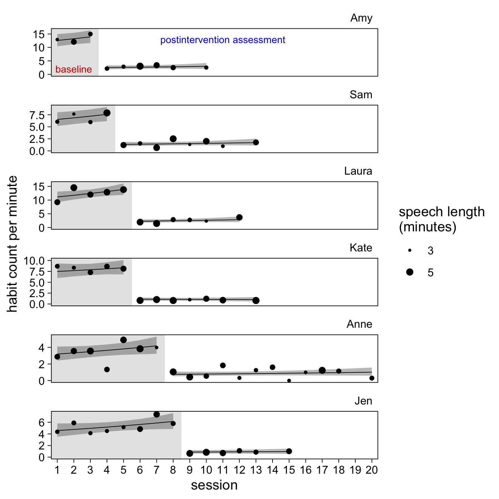

Mancuso & Miltenberger (2016)
================
A Solomon Kurz
2022-02-22

Load our primary packages.

``` r
library(tidyverse)
library(brms)
library(tidybayes)
```

## Bad habbits!

Mancuso & Miltenberger (2015; <https://doi.org/10.1002/jaba.267>) used a
nice multiple baseline AB design to evaluate habit reversal for helping
6 college students use fewer filled pauses when they speak in public.

``` r
# load the data
load(file = "/Users/solomonkurz/Dropbox/Experimental-design-and-the-GLMM/sketches/data/mancuso2016.rda")

mancuso2016 <- mancuso2016

# what is this?
glimpse(mancuso2016)
```

    ## Rows: 120
    ## Columns: 8
    ## $ id        <fct> Amy, Amy, Amy, Amy, Amy, Amy, Amy, Amy, Amy, Amy, Amy, Amy, Amy, Amy, Amy, Amy, Amy, Amy, …
    ## $ session   <int> 1, 2, 3, 4, 5, 6, 7, 8, 9, 10, 11, 12, 13, 14, 15, 16, 17, 18, 19, 20, 1, 2, 3, 4, 5, 6, 7…
    ## $ session01 <dbl> 0, 1, 2, 3, 4, 5, 6, 7, 8, 9, 10, 11, 12, 13, 14, 15, 16, 17, 18, 19, 0, 1, 2, 3, 4, 5, 6,…
    ## $ condition <chr> "baseline", "baseline", "baseline", "postintervention", "postintervention", "postintervent…
    ## $ post      <int> 0, 0, 0, 1, 1, 1, 1, 1, 1, 1, 1, 1, 1, 1, 1, 1, 1, 1, 1, 1, 0, 0, 0, 0, 1, 1, 1, 1, 1, 1, …
    ## $ rate      <dbl> 13.00, 12.00, 15.00, 2.00, 3.00, 3.00, 3.50, 2.50, NA, 2.50, NA, NA, NA, NA, NA, NA, NA, N…
    ## $ minutes   <dbl> 3.019887, 3.899758, 3.274424, 3.255476, 3.143865, 4.956539, 4.125956, 3.598774, NA, 3.1676…
    ## $ count     <dbl> 39, 47, 49, 7, 9, 15, 14, 9, NA, 8, NA, NA, NA, NA, NA, NA, NA, NA, NA, NA, 19, 23, 19, 39…

The participant pseudonyms are listed in the `id` column. The session
number is coded 1, …, *N* in the `session` column and coded the same
minus 1 in the `session01` column. The two phases `baseline` and
`postintervention` are saved as characters in the `condition` column.
The same information is coded in a dummy format in the `post` column.

After a short baseline-assessment period (A), each student met for
individual habit-reversal and competing-response training. Then each
student met for multiple post-intervention assessment periods (B) where
they gave new speeches. All speeches were a minimum of 3 minutes long
and a maximum of 5 minutes long.

The duration of the speeches is in the `minutes` column. The number of
filled pauses is in the `count` column and the number of counts per
minute is in the `rate` column.

### EDA.

Here are the number of baseline and post-intervention sessions, by
student.

``` r
mancuso2016 %>% 
  drop_na(count) %>% 
  count(id, condition) %>% 
  pivot_wider(names_from = condition, values_from = n)
```

    ## # A tibble: 6 × 3
    ##   id    baseline postintervention
    ##   <fct>    <int>            <int>
    ## 1 Amy          3                6
    ## 2 Sam          4                8
    ## 3 Laura        5                6
    ## 4 Kate         5                7
    ## 5 Anne         7               12
    ## 6 Jen          8                6

A complexity of the multiple-baseline design is each student has a
different number of measurement occasions and those occasions were
collected over different combinations of the experimental `condition`.

We can get a sense of that data structure with a quick missing data
analysis plot.

``` r
mancuso2016 %>% 
  mutate(r = ifelse(is.na(count), "missing", "observed")) %>% 
  mutate(r = factor(r, levels = c("observed", "missing"))) %>% 
  
  ggplot(aes(x = session, y = id)) +
  geom_tile(aes(fill = r),
            color = "white") +
  scale_fill_viridis_d("data", option = "D", direction = -1, end = .8) +
  scale_x_continuous(expand = c(0, 0), limits = c(0.5, 20.5)) +
  scale_y_discrete(NULL, expand = c(0, 0)) +
  ggtitle("Missing data analysis")
```


This kind of unevenness in the data over time would be a disaster with
classical statistical procedures such as an analysis of variance
(ANOVA). As we’ll see, it’s no problem at all for a GLMM. In some of our
previous analyses, we handled missing data with multiple imputation.
When we have longitudinal data of this kind, it’s often easier to handle
the missing data with full-information maximum likelihood.

Anyway, here’s a quick descriptive plot of the data.

``` r
mancuso2016 %>% 
  drop_na(count) %>% 
  
  ggplot(aes(x = session, y = count / minutes, color = condition)) +
  geom_point() +
  geom_line() +
  scale_color_manual(NULL, values = c("red3", "blue3")) +
  scale_y_continuous("rate", limits = c(0, NA)) +
  facet_wrap(~ id, scales = "free_y")
```


We could also use the `geom_smooth()` method to get a sense of the
treands across students and conditions.

``` r
mancuso2016 %>% 
  drop_na(count) %>% 
  
  ggplot(aes(x = session, y = count / minutes , color = condition)) +
  geom_point() +
  geom_smooth(method = "lm", se = FALSE, formula = y ~ x, size = 1/2) +
  scale_color_manual(NULL, values = c("red3", "blue3")) +
  scale_y_continuous("rate", limits = c(0, NA)) +
  facet_wrap(~ id, scales = "free_y")
```


We explicitly removed the standard error ribbons from the plot with
`se = FALSE` because, IMO, they would be invalid. They’re based on OLS
estimation, which isn’t particularly appropriate for that of this kind.
However, the lines are okay for quick-and-dirty exploratory plots.

## Models

There are a handful of different ways to analyze these data. We’ll
consider three.

### Option 1. The naïve Gaussian approach.

If you didn’t have a good foundation if the GLMM, I suspect your initial
impulse would be to model the habit rates (i.e., the counts divided by
the minutes) with the normal distribution. The rates are continuous,
after all. The model would be something like

$$
\\begin{align\*}
\\text{rate}\_{ij} & \\sim \\operatorname{Normal}(\\mu\_{ij}, \\sigma\_\\epsilon) \\\\
\\mu\_{ij} & = \\text{\< some parameters >}.
\\end{align\*}
$$

I’m purposefully leaving the details of the model blank because, IMO,
this is not a good idea. This approach ignores that the actual dependent
variables are the number of target behaviors in a given session. We know
that variables like that are counts, which are non-negative integers.
So, let’s instead entertain models that actually acknowledge that.

### Option 2. The multilevel Poisson with random effects for the experimental condition.

Probably the model that will best answer the experimental question is a
conditional Poisson model

$$
\\begin{align\*}
\\text{count}\_{ij} & \\sim \\operatorname{Poisson}(\\lambda\_{ij}) \\\\
\\log(\\lambda\_{ij}) & = \\log(\\text{minutes}\_{ij}) + a_i + b_i \\text{post}\_{ij} \\\\
a_i & = \\alpha + u_i \\\\
b_i & = \\beta + v_i \\\\
\\begin{bmatrix} u_i \\\\ v_i \\end{bmatrix} & \\sim
  \\operatorname{Normal} \\left ( 
    \\begin{bmatrix} 0 \\\\ 0 \\end{bmatrix}, \\mathbf \\Sigma 
    \\right) \\\\
\\mathbf \\Sigma & = \\mathbf{SRS} \\\\
\\mathbf S & =  \\begin{bmatrix} \\sigma_u & 0 \\\\ 0 & \\sigma_v \\end{bmatrix} \\\\
\\mathbf R & =  \\begin{bmatrix} 1 & \\rho \\\\ \\rho & 1 \\end{bmatrix} \\\\
\\alpha & \\sim \\operatorname{Normal}(2.3, 0.5) \\\\
\\beta  & \\sim \\operatorname{Normal}(0, 1) \\\\
\\sigma_u & \\sim \\operatorname{Exponential}(1) \\\\
\\sigma_v & \\sim \\operatorname{Exponential}(1) \\\\
\\rho    & \\sim \\operatorname{LKJ}(2),
\\end{align\*}
$$

where *a*<sub>*i*</sub> is the average rate at baseline and
*b*<sub>*i*</sub> is average change in the rate during the
post-intervention period. Since these are within-person data, both
coefficients can vary across participants, as indicated by their *i*
subscripts. Also notice we have an offset:
log (minutes<sub>*i**j*</sub>). Our offset accounts for the differences
in speech lengths and will express the model in terms of counts per
minute.

Before we jump into the theoretical model, let’s warm up with a simpler
intercept-s and offset-only model

$$
\\begin{align\*}
\\text{count}\_{ij} & \\sim \\operatorname{Poisson}(\\lambda\_{ij}) \\\\
\\log(\\lambda\_{ij}) & = \\log(\\text{minutes}\_{ij}) + a_i \\\\
a_i & = \\alpha + u_i \\\\
u_i & \\sim \\operatorname{Normal}(0, \\sigma_u) \\\\
\\alpha & \\sim \\operatorname{Normal}(2.3, 0.5) \\\\
\\sigma_u & \\sim \\operatorname{Exponential}(1).
\\end{align\*}
$$

``` r
log(10)
```

    ## [1] 2.302585

``` r
exp(2.302585 + c(-2, 0, 2))
```

    ## [1]  1.353353  9.999999 73.890554

Here’s how fit that model with `brm()`.

``` r
# unconditional means model
fit1 <- brm(
  data = mancuso2016,
  family = poisson,
  count ~ 1 + offset(log(minutes)) + (1 | id),
  prior = c(prior(normal(log(10), 1), class = Intercept),
            prior(exponential(1), class = sd)),
  cores = 4,
  seed = 1,
  file = "fits/fit1.mancuso2016"
)

# summarize
summary(fit1)
```

    ## Warning: There were 1 divergent transitions after warmup. Increasing adapt_delta above 0.8 may help. See
    ## http://mc-stan.org/misc/warnings.html#divergent-transitions-after-warmup

    ##  Family: poisson 
    ##   Links: mu = log 
    ## Formula: count ~ 1 + offset(log(minutes)) + (1 | id) 
    ##    Data: mancuso2016 (Number of observations: 77) 
    ##   Draws: 4 chains, each with iter = 2000; warmup = 1000; thin = 1;
    ##          total post-warmup draws = 4000
    ## 
    ## Group-Level Effects: 
    ## ~id (Number of levels: 6) 
    ##               Estimate Est.Error l-95% CI u-95% CI Rhat Bulk_ESS Tail_ESS
    ## sd(Intercept)     0.59      0.22     0.30     1.17 1.00      711      932
    ## 
    ## Population-Level Effects: 
    ##           Estimate Est.Error l-95% CI u-95% CI Rhat Bulk_ESS Tail_ESS
    ## Intercept     1.38      0.24     0.89     1.89 1.01      722      790
    ## 
    ## Draws were sampled using sampling(NUTS). For each parameter, Bulk_ESS
    ## and Tail_ESS are effective sample size measures, and Rhat is the potential
    ## scale reduction factor on split chains (at convergence, Rhat = 1).

Since we used `log.minutes` as the offset variable, that makes the
intercept *α*<sub>0</sub> the log of the population mean, per minute.
Here’s what that is after exponentiating.

``` r
fixef(fit1)[, -2] %>% exp()
```

    ## Estimate     Q2.5    Q97.5 
    ## 3.976443 2.439586 6.616611

Let’s see how that matches up with the sample statistics.

``` r
mancuso2016 %>% 
  summarise(mean = mean(count / minutes, na.rm = TRUE))
```

    ## # A tibble: 1 × 1
    ##    mean
    ##   <dbl>
    ## 1  3.94

Now let’s fit the theory-based model that differentiates between the A
and B conditions.

``` r
# theory-based model
fit2 <- brm(
  data = mancuso2016,
  family = poisson,
  count ~ 0 + Intercept + offset(log(minutes)) + post + (1 + post | id),
  prior = c(prior(normal(log(10), 1), class = b, coef = Intercept),
            prior(normal(0, 1), class = b, coef = post),
            prior(exponential(1), class = sd),
            prior(lkj(2), class = cor)),
  cores = 4,
  seed = 1,
  file = "fits/fit2.mancuso2016"
)

# summarize
summary(fit2)
```

    ##  Family: poisson 
    ##   Links: mu = log 
    ## Formula: count ~ 0 + Intercept + offset(log(minutes)) + post + (1 + post | id) 
    ##    Data: mancuso2016 (Number of observations: 77) 
    ##   Draws: 4 chains, each with iter = 2000; warmup = 1000; thin = 1;
    ##          total post-warmup draws = 4000
    ## 
    ## Group-Level Effects: 
    ## ~id (Number of levels: 6) 
    ##                     Estimate Est.Error l-95% CI u-95% CI Rhat Bulk_ESS Tail_ESS
    ## sd(Intercept)           0.63      0.24     0.33     1.21 1.00     1409     1969
    ## sd(post)                0.26      0.19     0.02     0.72 1.00     1063     1573
    ## cor(Intercept,post)    -0.07      0.39    -0.76     0.67 1.00     2667     2444
    ## 
    ## Population-Level Effects: 
    ##           Estimate Est.Error l-95% CI u-95% CI Rhat Bulk_ESS Tail_ESS
    ## Intercept     2.02      0.26     1.50     2.55 1.00     1101     1410
    ## post         -1.63      0.15    -1.91    -1.31 1.00     1825     1131
    ## 
    ## Draws were sampled using sampling(NUTS). For each parameter, Bulk_ESS
    ## and Tail_ESS are effective sample size measures, and Rhat is the potential
    ## scale reduction factor on split chains (at convergence, Rhat = 1).

We might want to practice working with the fixed effects.

``` r
# population average baseline (per minute)
alpha <- fixef(fit2)[1, 1]
alpha
```

    ## [1] 2.023872

``` r
# population average change for post-intervention (per minute)
beta <- fixef(fit2)[2, 1]
beta
```

    ## [1] -1.634552

``` r
# population average post-intervention (per minute)
alpha + beta
```

    ## [1] 0.3893206

``` r
# in the lambda metric (after exponentiating)
alpha %>% exp()
```

    ## [1] 7.567574

``` r
exp(alpha + beta)
```

    ## [1] 1.475978

``` r
# the difference in the lambda metric
exp(alpha) - exp(alpha + beta)
```

    ## [1] 6.091596

The problem with this approach is you cannot get 95% CIs when you
combine parameters this way. If you want to get 95% CIs for combinations
of the fixed effects, you need to work directly with the posterior
draws.

``` r
# save the posterior draws
post <- as_draws_df(fit2)

# the two means in the log metric
post %>% 
  transmute(`mu[baseline]` = b_Intercept,
            `mu[postintervention]` = b_Intercept + b_post) %>% 
  pivot_longer(everything()) %>% 
  group_by(name) %>% 
  mean_qi(value)
```

    ## # A tibble: 2 × 7
    ##   name                 value .lower .upper .width .point .interval
    ##   <chr>                <dbl>  <dbl>  <dbl>  <dbl> <chr>  <chr>    
    ## 1 mu[baseline]         2.02   1.50   2.55    0.95 mean   qi       
    ## 2 mu[postintervention] 0.389 -0.214  0.980   0.95 mean   qi

``` r
# the two means in the count metric
post %>% 
  transmute(`mu[baseline]` = exp(b_Intercept),
            `mu[postintervention]` = exp(b_Intercept + b_post)) %>% 
  pivot_longer(everything()) %>% 
  group_by(name) %>% 
  mean_qi(value)
```

    ## # A tibble: 2 × 7
    ##   name                 value .lower .upper .width .point .interval
    ##   <chr>                <dbl>  <dbl>  <dbl>  <dbl> <chr>  <chr>    
    ## 1 mu[baseline]          7.84  4.49   12.8    0.95 mean   qi       
    ## 2 mu[postintervention]  1.55  0.807   2.67   0.95 mean   qi

``` r
# the difference between the two means in the count metric
post %>% 
  mutate(`mu[baseline]` = exp(b_Intercept),
         `mu[postintervention]` = exp(b_Intercept + b_post)) %>% 
  mutate(contrast = `mu[postintervention]` - `mu[baseline]`) %>% 
  mean_qi(contrast)
```

    ## # A tibble: 1 × 6
    ##   contrast .lower .upper .width .point .interval
    ##      <dbl>  <dbl>  <dbl>  <dbl> <chr>  <chr>    
    ## 1    -6.30  -10.3  -3.54   0.95 mean   qi

What this is telling us is the population average effect for the
habit-reversal and competing-response training is a reduction in 6.3
counts, per minute, with a 95% credible interval of 3.5 to 10.3 counts.

Compare the results of our multilevel model with the summary of the
results in the original paper:

> The results showed that habit reversal greatly reduced filled pauses
> during public speaking (see Figure 1). In baseline, all six
> participants exhibited a moderate to high rate of the target behaviors
> (*M* = 7.4 responses per minute). Immediately after habit reversal
> training, participants exhibited the target behaviors at a much lower
> frequency (*M* = 1.4 responses per minute). (p. 190)

The major advantage of our GLMM approach is we were able to accompany
both population mean estimates, and their contrast, with 95% credible
intervals. Those 95% CIs allow us to explicitly express the certainty
(and uncertainty) in our estimates and they are in full compliance with
APA recommendations to accompany all effect sizes with 95% CIs.

The behavior analysts in the room will probably want to see the
participant-level results displayed with a plot. Here we’ll use the
`fitted()` method.

``` r
f <- fitted(fit2, newdata = mancuso2016) %>% 
  data.frame() %>% 
  bind_cols(mancuso2016) %>% 
  mutate(rate_hat = Estimate / minutes,
         lwr = Q2.5  / minutes,
         upr = Q97.5 / minutes)

# what have we done?
glimpse(f)
```

    ## Rows: 120
    ## Columns: 15
    ## $ Estimate  <dbl> 39.943236, 51.581059, 43.309931, 8.771821, 8.471089, 13.355305, 11.117314, 9.696833, NaN, …
    ## $ Est.Error <dbl> 3.2529040, 4.2006670, 3.5270815, 1.0016012, 0.9672624, 1.5249615, 1.2694188, 1.1072227, NA…
    ## $ Q2.5      <dbl> 33.780636, 43.622930, 36.627905, 6.970977, 6.731984, 10.613477, 8.834942, 7.706085, NA, 6.…
    ## $ Q97.5     <dbl> 46.553432, 60.117195, 50.477281, 10.902496, 10.528716, 16.599309, 13.817709, 12.052194, NA…
    ## $ id        <fct> Amy, Amy, Amy, Amy, Amy, Amy, Amy, Amy, Amy, Amy, Amy, Amy, Amy, Amy, Amy, Amy, Amy, Amy, …
    ## $ session   <int> 1, 2, 3, 4, 5, 6, 7, 8, 9, 10, 11, 12, 13, 14, 15, 16, 17, 18, 19, 20, 1, 2, 3, 4, 5, 6, 7…
    ## $ session01 <dbl> 0, 1, 2, 3, 4, 5, 6, 7, 8, 9, 10, 11, 12, 13, 14, 15, 16, 17, 18, 19, 0, 1, 2, 3, 4, 5, 6,…
    ## $ condition <chr> "baseline", "baseline", "baseline", "postintervention", "postintervention", "postintervent…
    ## $ post      <int> 0, 0, 0, 1, 1, 1, 1, 1, 1, 1, 1, 1, 1, 1, 1, 1, 1, 1, 1, 1, 0, 0, 0, 0, 1, 1, 1, 1, 1, 1, …
    ## $ rate      <dbl> 13.00, 12.00, 15.00, 2.00, 3.00, 3.00, 3.50, 2.50, NA, 2.50, NA, NA, NA, NA, NA, NA, NA, N…
    ## $ minutes   <dbl> 3.019887, 3.899758, 3.274424, 3.255476, 3.143865, 4.956539, 4.125956, 3.598774, NA, 3.1676…
    ## $ count     <dbl> 39, 47, 49, 7, 9, 15, 14, 9, NA, 8, NA, NA, NA, NA, NA, NA, NA, NA, NA, NA, 19, 23, 19, 39…
    ## $ rate_hat  <dbl> 13.226732, 13.226732, 13.226732, 2.694482, 2.694482, 2.694482, 2.694482, 2.694482, NaN, 2.…
    ## $ lwr       <dbl> 11.186060, 11.186060, 11.186060, 2.141308, 2.141308, 2.141308, 2.141308, 2.141308, NA, 2.1…
    ## $ upr       <dbl> 15.415621, 15.415621, 15.415621, 3.348972, 3.348972, 3.348972, 3.348972, 3.348972, NA, 3.3…

Here’s a version of Figure 1 in the original paper.

``` r
# annotation
baseline <- 
  mancuso2016 %>% 
  filter(id == "Amy" & session %in% c(2, 11)) %>% 
  select(id, session) %>% 
  mutate(rate  = c(2, 13),
         label = c("baseline", "postintervention assessment"))

# for the background fill in geom_rect()
shade <-
  mancuso2016 %>% 
  distinct(id) %>% 
  mutate(xmin = -Inf,
         xmax = c(3.5, 4.5, 5.5, 5.5, 7.5, 8.5),
         ymin = -Inf,
         ymax = Inf)

# wrangle
f %>% 
  drop_na(count) %>% 

  # plot!
  ggplot() +
  geom_rect(data = shade,
            aes(xmin = xmin, xmax = xmax,
                ymin = ymin, ymax = ymax),
            fill = alpha("grey80", alpha = 1/2)) +
  geom_ribbon(aes(x = session, ymin = lwr, ymax = upr, group = post),
              alpha = 1/3) +
  geom_line(aes(x = session, y = rate_hat, group = post),
            size = 1/4) +
  geom_point(aes(x = session, y = count / minutes),
             size = 2/3) +
  geom_text(data = baseline,
            aes(x = session, y = rate, label = label, color = label),
            size = 2.75) +
  scale_color_manual(values = c("red3", "blue3"), breaks = NULL) +
  scale_x_continuous(breaks = 1:20, expand = expansion(mult = 0.02)) +
  ylab("habit count per minute") +
  coord_cartesian(xlim = c(1, 20), ylim = c(0, NA)) +
  theme_linedraw() +
  theme(panel.grid = element_blank(),
        strip.background = element_blank(),
        strip.text = element_text(color = "black", hjust = 1)) +
  facet_wrap(~ id, ncol = 1, scales = "free_y")
```


It might not be clear to see, but there’s still a potentially important
insight missing from this model.

### Option 3. The Poisson conditional multilevel growth model.

That last model did not entertain the possibility there were changes
over time in the target-behavior rates, within each experimental
condition. To do that, we need a full conditional growth model of the
form

$$
\\begin{align\*}
\\text{count}\_{ij} & \\sim \\operatorname{Poisson}(\\lambda\_{ij}) \\\\
\\log(\\lambda\_{ij}) & = \\log(\\text{minutes}\_{ij}) + a_i + b_i \\text{post}\_{ij} + c_i \\text{time01}\_{ij} + d_i \\text{post}\_{ij} \\times \\text{time01}\_{ij} \\\\
a_i & = \\alpha + u_i \\\\
b_i & = \\beta + v_i \\\\
c_i & = \\gamma + w_i \\\\
d_i & = \\delta + x_i \\\\
\\begin{bmatrix} u_i \\\\ v_i \\\\ w_i \\\\ x_i \\end{bmatrix} & \\sim
  \\operatorname{Normal}(\\mathbf 0, \\mathbf \\Sigma) \\\\
\\mathbf \\Sigma & = \\mathbf{SRS} \\\\
\\mathbf S & =  
  \\begin{bmatrix} 
    \\sigma_u & 0 & 0 & 0 \\\\ 
    0 & \\sigma_v & 0 & 0 \\\\ 
    0 & 0 & \\sigma_w & 0 \\\\ 
    0 & 0 & 0 & \\sigma_x 
  \\end{bmatrix} \\\\
\\mathbf R & = 
  \\begin{bmatrix} 
    1 & \\rho\_{uv} & \\rho\_{uw} & \\rho\_{ux} \\\\ 
    \\rho\_{vu} & 1 & \\rho\_{vw} & \\rho\_{vx} \\\\ 
    \\rho\_{wu} & \\rho\_{wv} & 1 & \\rho\_{wx} \\\\ 
    \\rho\_{xu} & \\rho\_{xv} & \\rho\_{xw} & 1
  \\end{bmatrix} \\\\
\\alpha & \\sim \\operatorname{Normal}(2.3, 0.5) \\\\
\\beta, \\dots, \\delta & \\sim \\operatorname{Normal}(0, 1) \\\\
\\sigma_u, \\dots, \\sigma_x & \\sim \\operatorname{Exponential}(1) \\\\
\\rho    & \\sim \\operatorname{LKJ}(1) \\\\
\\end{align\*}
$$

where now

-   *a*<sub>*i*</sub> are the intercepts at the beginning of the
    baseline period,
-   *b*<sub>*i*</sub> are the changes in intercepts for the beginning of
    the post-intervention period,
-   *c*<sub>*i*</sub> are the time-slopes for the baseline period, and
-   *d*<sub>*i*</sub> are the changes in time-slopes for the
    post-intervention period.

As indicated by their *i* subscripts, all these are allowed to vary
across students, which is the major advantage of a within-person design.
Here’s how to fit the model with `brm()`.

``` r
# fit
fit3 <- brm(
  data = mancuso2016,
  family = poisson,
  count ~ 0 + Intercept + offset(log(minutes)) + post + session01 + post:session01 + 
    (1 + post + session01 + post:session01 | id),
  prior = c(prior(normal(log(10), 1), class = b, coef = Intercept),
            prior(normal(0, 1), class = b, coef = post),
            prior(exponential(1), class = sd),
            prior(lkj(1), class = cor)),
  cores = 4,
  seed = 1,
  control = list(adapt_delta = .95),
  file = "fits/fit3.mancuso2016"
)

# summarize
summary(fit3)
```

    ## Warning: There were 2 divergent transitions after warmup. Increasing adapt_delta above 0.95 may help. See
    ## http://mc-stan.org/misc/warnings.html#divergent-transitions-after-warmup

    ##  Family: poisson 
    ##   Links: mu = log 
    ## Formula: count ~ 0 + Intercept + offset(log(minutes)) + post + session01 + post:session01 + (1 + post + session01 + post:session01 | id) 
    ##    Data: mancuso2016 (Number of observations: 77) 
    ##   Draws: 4 chains, each with iter = 2000; warmup = 1000; thin = 1;
    ##          total post-warmup draws = 4000
    ## 
    ## Group-Level Effects: 
    ## ~id (Number of levels: 6) 
    ##                               Estimate Est.Error l-95% CI u-95% CI Rhat Bulk_ESS Tail_ESS
    ## sd(Intercept)                     0.71      0.28     0.35     1.41 1.00     1537     2316
    ## sd(post)                          0.24      0.22     0.01     0.80 1.00     2079     2088
    ## sd(session01)                     0.03      0.03     0.00     0.10 1.00     2019     2346
    ## sd(post:session01)                0.03      0.03     0.00     0.10 1.00     1713     1900
    ## cor(Intercept,post)              -0.07      0.43    -0.83     0.76 1.00     4396     2323
    ## cor(Intercept,session01)          0.02      0.43    -0.76     0.81 1.00     4205     2844
    ## cor(post,session01)              -0.01      0.44    -0.82     0.80 1.00     3473     2884
    ## cor(Intercept,post:session01)     0.00      0.44    -0.81     0.80 1.00     4823     2896
    ## cor(post,post:session01)         -0.08      0.46    -0.87     0.78 1.00     3082     3060
    ## cor(session01,post:session01)    -0.06      0.46    -0.85     0.79 1.00     2456     3057
    ## 
    ## Population-Level Effects: 
    ##                Estimate Est.Error l-95% CI u-95% CI Rhat Bulk_ESS Tail_ESS
    ## Intercept          1.94      0.29     1.36     2.54 1.00     1155     1598
    ## post              -1.70      0.25    -2.18    -1.20 1.00     2860     2454
    ## session01          0.04      0.03    -0.01     0.10 1.00     2772     2177
    ## post:session01    -0.03      0.04    -0.10     0.04 1.00     2836     2858
    ## 
    ## Draws were sampled using sampling(NUTS). For each parameter, Bulk_ESS
    ## and Tail_ESS are effective sample size measures, and Rhat is the potential
    ## scale reduction factor on split chains (at convergence, Rhat = 1).

Focusing just on the `Population-Level Effects` section, our estimate
for *γ* is small and primarily positive, suggesting there is a modest
increase over time in the baseline condition, on average. The estimate
for *δ* is a little smaller and mostly negative, suggesting that the
changes over time in the post-intervention period will be similar to or
perhaps somewhat smaller than those during the baseline period.

As far as the variance parameters listed in the `Group-Level Effects`
section, those for *σ*<sub>*w*</sub> and *σ*<sub>*x*</sub> (i.e., the
rows for `sd(session01)` and `sd(post:session01)`) are pretty small. On
the whole, this tells us our six students differed more in their
intercepts than in their slopes.

This is all very abstract. Let’s flesh this out with another version of
Figure 1. Again, we’ll use the `fitted()` method to display the
student-level trajectories.

``` r
# compute
f <- fitted(fit3, newdata = mancuso2016) %>% 
  data.frame() %>% 
  bind_cols(mancuso2016) %>% 
  mutate(rate_hat = Estimate / minutes,
         lwr = Q2.5  / minutes,
         upr = Q97.5 / minutes)

# wrangle
f %>% 
  drop_na(count) %>% 

  # plot!
  ggplot() +
  geom_rect(data = shade,
            aes(xmin = xmin, xmax = xmax,
                ymin = ymin, ymax = ymax),
            fill = alpha("grey80", alpha = 1/2)) +
  geom_ribbon(aes(x = session, ymin = lwr, ymax = upr, group = post),
              alpha = 1/3) +
  geom_line(aes(x = session, y = rate_hat, group = post),
            size = 1/4) +
  # this is new
  geom_point(aes(x = session, y = count / minutes, size = minutes)) +
  geom_text(data = baseline,
            aes(x = session, y = rate, label = label, color = label),
            size = 2.75) +
  # this is new
  scale_size_continuous("speech length\n(minutes)", range = c(1/2, 2), 
                        breaks = c(3, 5), limits = c(3, 5)) +
  scale_color_manual(values = c("red3", "blue3"), breaks = NULL) +
  scale_x_continuous(breaks = 1:20, expand = expansion(mult = 0.02)) +
  ylab("habit count per minute") +
  coord_cartesian(xlim = c(1, 20), ylim = c(0, NA)) +
  theme_linedraw() +
  theme(panel.grid = element_blank(),
        strip.background = element_blank(),
        strip.text = element_text(color = "black", hjust = 1)) +
  facet_wrap(~ id, ncol = 1, scales = "free_y")
```



The major insight from the full model `fit3` is that, in all cases, it
appears our students showed increases in their target-behaviors during
the baseline period. I’m not sure how to interpret that, but it might
well be of interest and I’m glad we have statistical frameworks that can
formally sniff this out.

This version of the model also explicitly shows the students’
performances during the post-intervention period were remarkably stable.
This is generally a very good thing. It suggests that the treatment had
lasting effects on their behavior, which we’d hope it would.

Also, notice how in this version of the figure, we allowed the size of
the data point dots to vary by their `minutes` values. Since each
student’s speech was somewhere between 3 and 5 minutes long, why not try
to find a way to explicitly show that? Recall that since these are not
the real data from the study, you can’t trust any apparent patterns in
the duration of these speeches. But if we had access to the real data,
interesting insights might pop out. The main point is that you should
always be on the lookout to find ways to squeeze more information out of
your data.

## Session information

``` r
sessionInfo()
```

    ## R version 4.1.2 (2021-11-01)
    ## Platform: x86_64-apple-darwin17.0 (64-bit)
    ## Running under: macOS Catalina 10.15.7
    ## 
    ## Matrix products: default
    ## BLAS:   /Library/Frameworks/R.framework/Versions/4.1/Resources/lib/libRblas.0.dylib
    ## LAPACK: /Library/Frameworks/R.framework/Versions/4.1/Resources/lib/libRlapack.dylib
    ## 
    ## locale:
    ## [1] en_US.UTF-8/en_US.UTF-8/en_US.UTF-8/C/en_US.UTF-8/en_US.UTF-8
    ## 
    ## attached base packages:
    ## [1] stats     graphics  grDevices utils     datasets  methods   base     
    ## 
    ## other attached packages:
    ##  [1] tidybayes_3.0.2 brms_2.16.3     Rcpp_1.0.8      forcats_0.5.1   stringr_1.4.0   dplyr_1.0.7    
    ##  [7] purrr_0.3.4     readr_2.0.1     tidyr_1.2.0     tibble_3.1.6    ggplot2_3.3.5   tidyverse_1.3.1
    ## 
    ## loaded via a namespace (and not attached):
    ##   [1] readxl_1.3.1         backports_1.4.1      plyr_1.8.6           igraph_1.2.6         svUnit_1.0.6        
    ##   [6] splines_4.1.2        crosstalk_1.1.1      TH.data_1.0-10       rstantools_2.1.1     inline_0.3.19       
    ##  [11] digest_0.6.29        htmltools_0.5.2      rsconnect_0.8.24     fansi_1.0.2          magrittr_2.0.2      
    ##  [16] checkmate_2.0.0      tzdb_0.1.2           modelr_0.1.8         RcppParallel_5.1.4   matrixStats_0.61.0  
    ##  [21] xts_0.12.1           sandwich_3.0-1       prettyunits_1.1.1    colorspace_2.0-2     rvest_1.0.1         
    ##  [26] ggdist_3.0.1         haven_2.4.3          xfun_0.25            callr_3.7.0          crayon_1.4.2        
    ##  [31] jsonlite_1.7.3       lme4_1.1-27.1        survival_3.2-13      zoo_1.8-9            glue_1.6.1          
    ##  [36] gtable_0.3.0         emmeans_1.7.1-1      distributional_0.2.2 pkgbuild_1.2.0       rstan_2.21.3        
    ##  [41] abind_1.4-5          scales_1.1.1         mvtnorm_1.1-2        DBI_1.1.1            miniUI_0.1.1.1      
    ##  [46] viridisLite_0.4.0    xtable_1.8-4         diffobj_0.3.4        stats4_4.1.2         StanHeaders_2.21.0-7
    ##  [51] DT_0.19              htmlwidgets_1.5.3    httr_1.4.2           threejs_0.3.3        arrayhelpers_1.1-0  
    ##  [56] posterior_1.1.0.9000 ellipsis_0.3.2       pkgconfig_2.0.3      loo_2.4.1            farver_2.1.0        
    ##  [61] dbplyr_2.1.1         utf8_1.2.2           labeling_0.4.2       tidyselect_1.1.1     rlang_1.0.1         
    ##  [66] reshape2_1.4.4       later_1.3.0          munsell_0.5.0        cellranger_1.1.0     tools_4.1.2         
    ##  [71] cli_3.1.1            generics_0.1.2       broom_0.7.10         ggridges_0.5.3       evaluate_0.14       
    ##  [76] fastmap_1.1.0        yaml_2.2.1           processx_3.5.2       knitr_1.33           fs_1.5.0            
    ##  [81] nlme_3.1-153         mime_0.11            projpred_2.0.2       xml2_1.3.2           compiler_4.1.2      
    ##  [86] bayesplot_1.8.1      shinythemes_1.2.0    rstudioapi_0.13      gamm4_0.2-6          reprex_2.0.1        
    ##  [91] stringi_1.7.4        highr_0.9            ps_1.6.0             Brobdingnag_1.2-6    lattice_0.20-45     
    ##  [96] Matrix_1.3-4         nloptr_1.2.2.2       markdown_1.1         shinyjs_2.0.0        tensorA_0.36.2      
    ## [101] vctrs_0.3.8          pillar_1.7.0         lifecycle_1.0.1      bridgesampling_1.1-2 estimability_1.3    
    ## [106] httpuv_1.6.2         R6_2.5.1             promises_1.2.0.1     gridExtra_2.3        codetools_0.2-18    
    ## [111] boot_1.3-28          colourpicker_1.1.0   MASS_7.3-54          gtools_3.9.2         assertthat_0.2.1    
    ## [116] withr_2.4.3          shinystan_2.5.0      multcomp_1.4-17      mgcv_1.8-38          parallel_4.1.2      
    ## [121] hms_1.1.0            grid_4.1.2           coda_0.19-4          minqa_1.2.4          rmarkdown_2.10      
    ## [126] shiny_1.6.0          lubridate_1.7.10     base64enc_0.1-3      dygraphs_1.1.1.6
