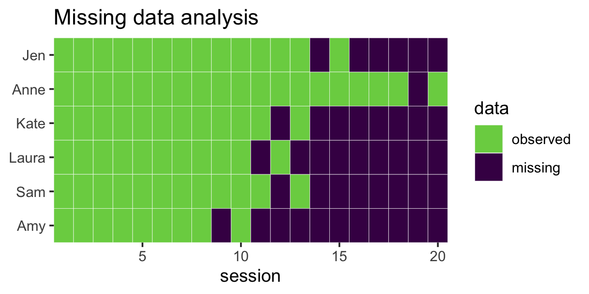
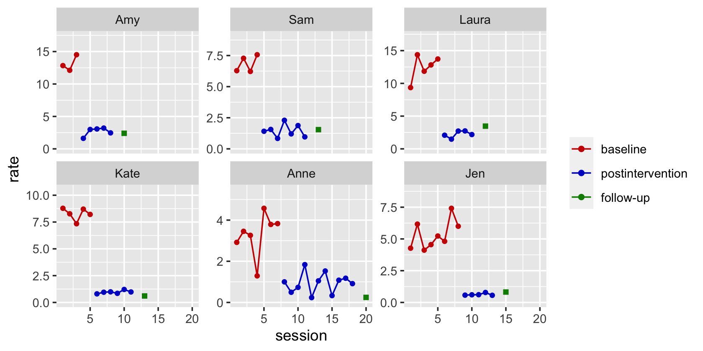
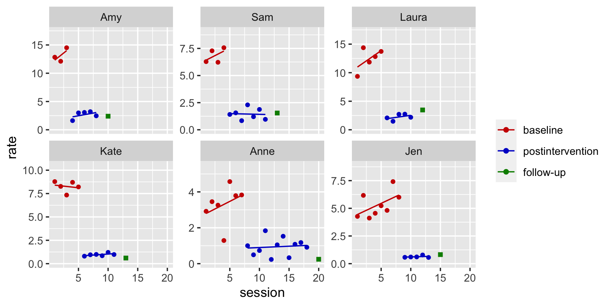
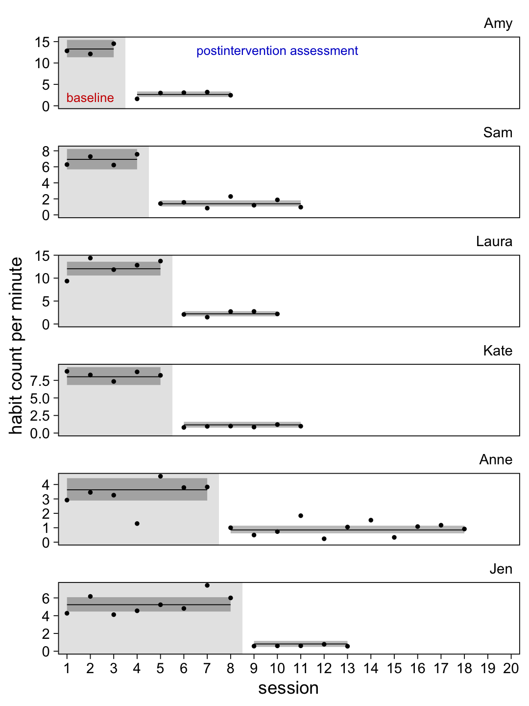
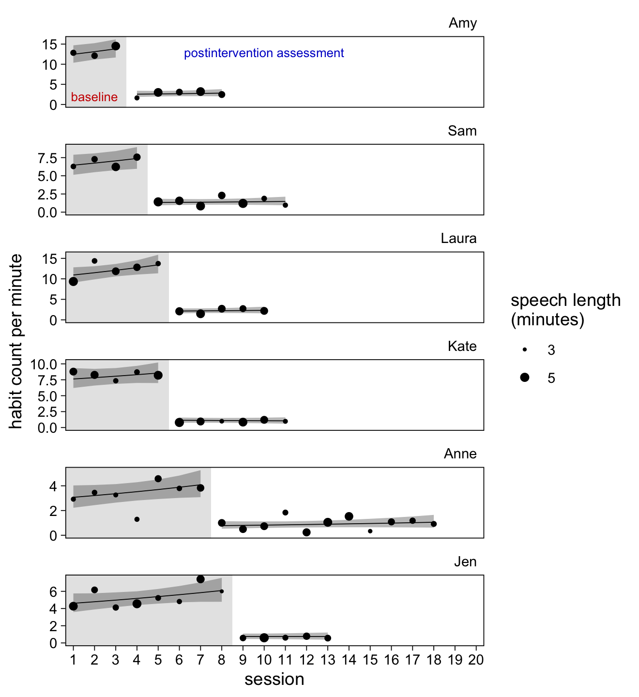
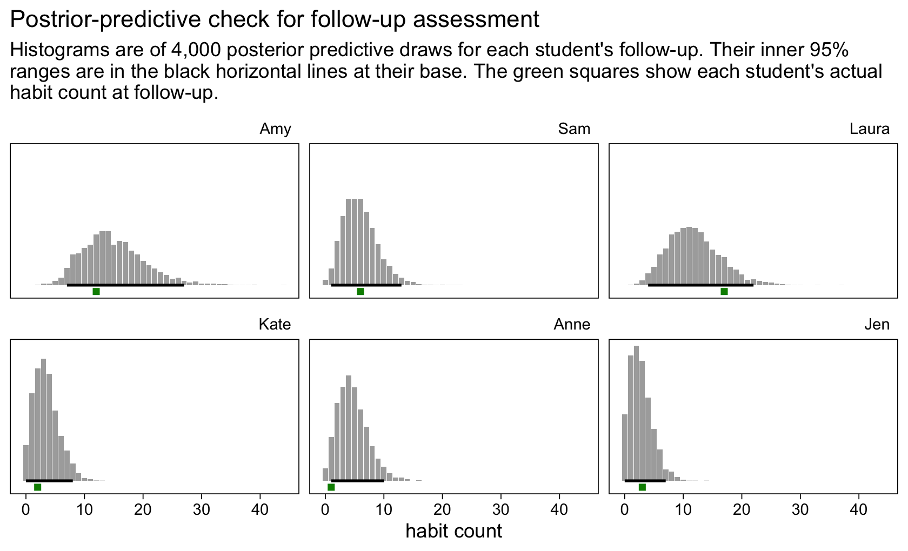

Mancuso & Miltenberger (2016)
================
A Solomon Kurz
2022-11-04

Load our primary packages.

``` r
library(tidyverse)
library(brms)
library(tidybayes)
```

## Bad habbits!

Mancuso & Miltenberger (2015; <https://doi.org/10.1002/jaba.267>) used a
nice multiple baseline AB design to evaluate habit reversal for helping
6 college students use fewer filled pauses when they speak in public.

``` r
# load the data
load(file = "/Users/solomonkurz/Dropbox/Experimental-design-and-the-GLMM/sketches/data/mancuso2016.rda")

# what is this?
glimpse(mancuso2016)
```

    ## Rows: 77
    ## Columns: 9
    ## $ sn       <dbl> 1, 1, 1, 1, 1, 1, 1, 1, 1, 1, 1, 1, 1, 1, 2, 2, 2, 2, 2, 2, 2, 2, 2, 2, 2, 2, 2, 2, 2, 2, 2…
    ## $ id       <fct> Jen, Jen, Jen, Jen, Jen, Jen, Jen, Jen, Jen, Jen, Jen, Jen, Jen, Jen, Anne, Anne, Anne, Ann…
    ## $ session  <dbl> 1, 2, 3, 4, 5, 6, 7, 8, 9, 10, 11, 12, 13, 15, 1, 2, 3, 4, 5, 6, 7, 8, 9, 10, 11, 12, 13, 1…
    ## $ session0 <dbl> 0, 1, 2, 3, 4, 5, 6, 7, 8, 9, 10, 11, 12, 14, 0, 1, 2, 3, 4, 5, 6, 7, 8, 9, 10, 11, 12, 13,…
    ## $ phase    <chr> "a", "a", "a", "a", "a", "a", "a", "a", "b", "b", "b", "b", "b", "c", "a", "a", "a", "a", "…
    ## $ count    <dbl> 20, 22, 14, 22, 17, 15, 32, 18, 2, 3, 2, 3, 2, 3, 9, 11, 10, 4, 17, 12, 15, 4, 2, 3, 6, 1, …
    ## $ seconds  <dbl> 281, 214, 204, 290, 195, 187, 259, 180, 209, 299, 197, 230, 214, 220, 185, 191, 184, 186, 2…
    ## $ minutes  <dbl> 4.683333, 3.566667, 3.400000, 4.833333, 3.250000, 3.116667, 4.316667, 3.000000, 3.483333, 4…
    ## $ rate     <dbl> 4.2704626, 6.1682243, 4.1176471, 4.5517241, 5.2307692, 4.8128342, 7.4131274, 6.0000000, 0.5…

The participant numbers are listed in the `sn` column and their
pseudonyms are in the `id` column. The session number is coded
$1, \dots, N$ in the `session` column and coded the same minus $1$ in
the `session0` column. The three experimental phases0–`a` (baseline),
`b` (postintervention assessment), and `c` (follow-up)– are saved as
characters in the `phase` column.

After a short baseline-assessment period (A), each student met for
individual habit-reversal and competing-response training. Then each
student met for multiple post-intervention assessment periods (B) where
they gave new speeches. All speeches were a minimum of 3 minutes long
and a maximum of 5 minutes long.

Each student also had one follow-up assessment, during which they gave a
final 3-to-5-minute speech. According to the authors, these occurred
some 2 to 5 weeks after their final postintervention session and the
exact times were not provided in the paper. In the `mancuso2016` data
set, as well as in the paper, we have simply assigned these follow-up
assessments as two sessions after each student’s final postintervention
session.

The duration of the speeches is expressed in the `seconds` and `minutes`
columns. The number of filled pauses is in the `count` column. Finally,
the number of counts per minute is in the `rate` column.

### EDA.

Here are the number of baseline and post-intervention sessions, by
student.

``` r
mancuso2016 %>% 
  count(id, phase) %>% 
  pivot_wider(names_from = phase, values_from = n)
```

    ## # A tibble: 6 × 4
    ##   id        a     b     c
    ##   <fct> <int> <int> <int>
    ## 1 Amy       3     5     1
    ## 2 Sam       4     7     1
    ## 3 Laura     5     5     1
    ## 4 Kate      5     6     1
    ## 5 Anne      7    11     1
    ## 6 Jen       8     5     1

A complexity of the multiple-baseline design is each student has a
different number of measurement occasions and those occasions were
collected over different combinations of the experimental phases.

We can get a sense of that data structure with a quick missing data
analysis plot.

``` r
mancuso2016 %>% 
  full_join(mancuso2016 %>% expand(id, session = 1:20),
            by = c("id", "session")) %>% 
  mutate(r = ifelse(is.na(count), "missing", "observed")) %>% 
  mutate(r = factor(r, levels = c("observed", "missing")))  %>% 
  
  ggplot(aes(x = session, y = id)) +
  geom_tile(aes(fill = r),
            color = "white") +
  scale_fill_viridis_d("data", option = "D", direction = -1, end = .8) +
  scale_x_continuous(expand = c(0, 0), limits = c(0.5, 20.5)) +
  scale_y_discrete(NULL, expand = c(0, 0)) +
  ggtitle("Missing data analysis")
```



This kind of unevenness in the data over time would be a disaster with
classical statistical procedures such as an analysis of variance
(ANOVA). As we’ll see, it’s no problem at all for a GLMM.

Anyway, here’s a quick descriptive plot of the data.

``` r
mancuso2016 %>% 
  mutate(phase = factor(phase,
                        labels = c("baseline", "postintervention", "follow-up"))) %>% 
  ggplot(aes(x = session, y = rate, color = phase, shape = phase)) +
  geom_point() +
  geom_line() +
  scale_color_manual(NULL, values = c("red3", "blue3", "green4")) +
  scale_shape_manual(values = c(16, 16, 15), breaks = NULL) +
  scale_y_continuous("rate", limits = c(0, NA), expand = expansion(mult = c(0.05, 0.25))) +
  facet_wrap(~ id, scales = "free_y")
```



We could also use the `geom_smooth()` method to get a sense of the
treands across students and conditions.

``` r
mancuso2016 %>% 
  mutate(phase = factor(phase,
                        labels = c("baseline", "postintervention", "follow-up"))) %>% 
  ggplot(aes(x = session, y = rate, color = phase, shape = phase)) +
  geom_point() +
  geom_smooth(method = "lm", se = FALSE, formula = y ~ x, size = 1/2) +
  scale_color_manual(NULL, values = c("red3", "blue3", "green4")) +
  scale_shape_manual(values = c(16, 16, 15), breaks = NULL) +
  scale_y_continuous("rate", limits = c(0, NA), expand = expansion(mult = c(0.05, 0.25))) +
  facet_wrap(~ id, scales = "free_y")
```



We explicitly removed the standard error ribbons from the plot with
`se = FALSE` because, IMO, they would be invalid. They’re based on OLS
estimation, which isn’t particularly appropriate for that of this kind.
However, the lines are okay for quick-and-dirty exploratory plots.

### Subset.

``` r
mancuso2016_ab <- mancuso2016 %>% 
  filter(phase != "c")

mancuso2016_ab
```

    ## # A tibble: 71 × 9
    ##       sn id    session session0 phase count seconds minutes  rate
    ##    <dbl> <fct>   <dbl>    <dbl> <chr> <dbl>   <dbl>   <dbl> <dbl>
    ##  1     1 Jen         1        0 a        20     281    4.68 4.27 
    ##  2     1 Jen         2        1 a        22     214    3.57 6.17 
    ##  3     1 Jen         3        2 a        14     204    3.4  4.12 
    ##  4     1 Jen         4        3 a        22     290    4.83 4.55 
    ##  5     1 Jen         5        4 a        17     195    3.25 5.23 
    ##  6     1 Jen         6        5 a        15     187    3.12 4.81 
    ##  7     1 Jen         7        6 a        32     259    4.32 7.41 
    ##  8     1 Jen         8        7 a        18     180    3    6    
    ##  9     1 Jen         9        8 b         2     209    3.48 0.574
    ## 10     1 Jen        10        9 b         3     299    4.98 0.602
    ## # … with 61 more rows

## Models

There are a handful of different ways to analyze these data. We’ll
consider three.

### Option 1. The naïve Gaussian approach.

If you didn’t have a good foundation if the GLMM, I suspect your initial
impulse would be to model the habit rates (i.e., the counts divided by
the minutes) with the normal distribution. The rates are continuous,
after all. The model would be something like

$$
\begin{align*}
\text{rate}_{ij} & \sim \operatorname{Normal}(\mu_{ij}, \sigma_\epsilon) \\
\mu_{ij} & = \text{< some parameters >}.
\end{align*}
$$

I’m purposefully leaving the details of the model blank because, IMO,
this is not a good idea. This approach ignores that the actual dependent
variables are the number of target behaviors in a given session. We know
that variables like that are counts, which are non-negative integers.
So, let’s instead entertain models designed for those characteristics.

### Option 2. The multilevel Poisson with random effects for the experimental condition.

Probably the model that will best answer the experimental question is a
conditional Poisson model

$$
\begin{align*}
\text{count}_{ij} & \sim \operatorname{Poisson}(\lambda_{ij}) \\
\log(\lambda_{ij}) & = \log(\text{minutes}_{ij}) + a_i + b_i \text{phase}_{ij} \\
a_i & = \alpha + u_i \\
b_i & = \beta + v_i \\
\begin{bmatrix} u_i \\ v_i \end{bmatrix} & \sim
  \operatorname{Normal} \left ( 
    \begin{bmatrix} 0 \\ 0 \end{bmatrix}, \mathbf \Sigma 
    \right) \\
\mathbf \Sigma & = \mathbf{SRS} \\
\mathbf S & =  \begin{bmatrix} \sigma_u & 0 \\ 0 & \sigma_v \end{bmatrix} \\
\mathbf R & =  \begin{bmatrix} 1 & \rho \\ \rho & 1 \end{bmatrix} \\
\alpha & \sim \operatorname{Normal}(2.3, 0.5) \\
\beta  & \sim \operatorname{Normal}(0, 1) \\
\sigma_u & \sim \operatorname{Exponential}(1) \\
\sigma_v & \sim \operatorname{Exponential}(1) \\
\rho    & \sim \operatorname{LKJ}(2),
\end{align*}
$$

where $a_i$ is the average rate at baseline and $b_i$ is average change
in the rate during the post-intervention period. Since these are
within-person data, both coefficients can vary across participants, as
indicated by their $i$ subscripts. Also notice we have an offset:
$\log(\text{minutes}_{ij})$. Our offset accounts for the differences in
speech lengths and will express the model in terms of counts per minute.

Before we jump into the theoretical model, let’s warm up with a simpler
intercept-s and offset-only model

$$
\begin{align*}
\text{count}_{ij} & \sim \operatorname{Poisson}(\lambda_{ij}) \\
\log(\lambda_{ij}) & = \log(\text{minutes}_{ij}) + a_i \\
a_i & = \alpha + u_i \\
u_i & \sim \operatorname{Normal}(0, \sigma_u) \\
\alpha & \sim \operatorname{Normal}(2.3, 0.5) \\
\sigma_u & \sim \operatorname{Exponential}(1).
\end{align*}
$$

``` r
log(10)
```

    ## [1] 2.302585

``` r
exp(2.302585 + c(-2, 0, 2))
```

    ## [1]  1.353353  9.999999 73.890554

Here’s how fit that model with `brm()`.

``` r
# unconditional means model
fit1 <- brm(
  data = mancuso2016_ab,
  family = poisson,
  count ~ 1 + offset(log(minutes)) + (1 | id),
  prior = c(prior(normal(log(10), 1), class = Intercept),
            prior(exponential(1), class = sd)),
  cores = 4,
  seed = 1,
  file = "fits/fit1.mancuso2016"
)

# summarize
summary(fit1)
```

    ##  Family: poisson 
    ##   Links: mu = log 
    ## Formula: count ~ 1 + offset(log(minutes)) + (1 | id) 
    ##    Data: mancuso2016_ab (Number of observations: 71) 
    ##   Draws: 4 chains, each with iter = 2000; warmup = 1000; thin = 1;
    ##          total post-warmup draws = 4000
    ## 
    ## Group-Level Effects: 
    ## ~id (Number of levels: 6) 
    ##               Estimate Est.Error l-95% CI u-95% CI Rhat Bulk_ESS Tail_ESS
    ## sd(Intercept)     0.60      0.23     0.31     1.21 1.01      610      985
    ## 
    ## Population-Level Effects: 
    ##           Estimate Est.Error l-95% CI u-95% CI Rhat Bulk_ESS Tail_ESS
    ## Intercept     1.42      0.26     0.91     1.94 1.01      632      703
    ## 
    ## Draws were sampled using sampling(NUTS). For each parameter, Bulk_ESS
    ## and Tail_ESS are effective sample size measures, and Rhat is the potential
    ## scale reduction factor on split chains (at convergence, Rhat = 1).

Since we used `log.minutes` as the offset variable, that makes the
intercept $\alpha_0$ the log of the population mean, per minute. Here’s
what that is after exponentiating.

``` r
fixef(fit1)[, -2] %>% exp()
```

    ## Estimate     Q2.5    Q97.5 
    ## 4.152993 2.472325 6.964245

Let’s see how that matches up with the sample statistics.

``` r
mancuso2016_ab %>% 
  summarise(mean = mean(count / minutes, na.rm = TRUE))
```

    ## # A tibble: 1 × 1
    ##    mean
    ##   <dbl>
    ## 1  4.08

Now let’s fit the theory-based model that differentiates between the A
and B conditions.

``` r
# theory-based model
fit2 <- brm(
  data = mancuso2016_ab,
  family = poisson,
  count ~ 0 + Intercept + offset(log(minutes)) + phase + (1 + phase | id),
  prior = c(prior(normal(log(10), 1), class = b, coef = Intercept),
            prior(normal(0, 1), class = b, coef = phaseb),
            prior(exponential(1), class = sd),
            prior(lkj(2), class = cor)),
  cores = 4,
  seed = 1,
  control = list(adapt_delta = .99),
  file = "fits/fit2.mancuso2016"
)

# summarize
summary(fit2)
```

    ##  Family: poisson 
    ##   Links: mu = log 
    ## Formula: count ~ 0 + Intercept + offset(log(minutes)) + phase + (1 + phase | id) 
    ##    Data: mancuso2016_ab (Number of observations: 71) 
    ##   Draws: 4 chains, each with iter = 2000; warmup = 1000; thin = 1;
    ##          total post-warmup draws = 4000
    ## 
    ## Group-Level Effects: 
    ## ~id (Number of levels: 6) 
    ##                       Estimate Est.Error l-95% CI u-95% CI Rhat Bulk_ESS Tail_ESS
    ## sd(Intercept)             0.64      0.26     0.32     1.31 1.01     1361     2038
    ## sd(phaseb)                0.30      0.21     0.02     0.81 1.00     1126     1786
    ## cor(Intercept,phaseb)    -0.09      0.39    -0.76     0.67 1.00     2562     2622
    ## 
    ## Population-Level Effects: 
    ##           Estimate Est.Error l-95% CI u-95% CI Rhat Bulk_ESS Tail_ESS
    ## Intercept     2.03      0.27     1.52     2.60 1.00     1075     1477
    ## phaseb       -1.67      0.17    -2.00    -1.31 1.00     1722     1481
    ## 
    ## Draws were sampled using sampling(NUTS). For each parameter, Bulk_ESS
    ## and Tail_ESS are effective sample size measures, and Rhat is the potential
    ## scale reduction factor on split chains (at convergence, Rhat = 1).

We might want to practice working with the fixed effects.

``` r
# population average baseline (per minute)
alpha <- fixef(fit2)[1, 1]
alpha
```

    ## [1] 2.025553

``` r
# population average change for post-intervention (per minute)
beta <- fixef(fit2)[2, 1]
beta
```

    ## [1] -1.672936

``` r
# population average post-intervention (per minute)
alpha + beta
```

    ## [1] 0.3526172

``` r
# in the lambda metric (after exponentiating)
alpha %>% exp()
```

    ## [1] 7.580305

``` r
exp(alpha + beta)
```

    ## [1] 1.422786

``` r
# the difference in the lambda metric
exp(alpha) - exp(alpha + beta)
```

    ## [1] 6.157518

The problem with this approach is you cannot get 95% CIs when you
combine parameters this way. If you want to get 95% CIs for combinations
of the fixed effects, you need to work directly with the posterior
draws.

``` r
# save the posterior draws
post <- as_draws_df(fit2)

# the two means in the log metric
post %>% 
  transmute(`mu[baseline]` = b_Intercept,
            `mu[postintervention]` = b_Intercept + b_phaseb) %>% 
  pivot_longer(everything()) %>% 
  group_by(name) %>% 
  mean_qi(value)
```

    ## # A tibble: 2 × 7
    ##   name                 value .lower .upper .width .point .interval
    ##   <chr>                <dbl>  <dbl>  <dbl>  <dbl> <chr>  <chr>    
    ## 1 mu[baseline]         2.03   1.52   2.60    0.95 mean   qi       
    ## 2 mu[postintervention] 0.353 -0.205  0.974   0.95 mean   qi

``` r
# the two means in the count metric
post %>% 
  transmute(`mu[baseline]` = exp(b_Intercept),
            `mu[postintervention]` = exp(b_Intercept + b_phaseb)) %>% 
  pivot_longer(everything()) %>% 
  group_by(name) %>% 
  mean_qi(value)
```

    ## # A tibble: 2 × 7
    ##   name                 value .lower .upper .width .point .interval
    ##   <chr>                <dbl>  <dbl>  <dbl>  <dbl> <chr>  <chr>    
    ## 1 mu[baseline]          7.86  4.58   13.5    0.95 mean   qi       
    ## 2 mu[postintervention]  1.49  0.815   2.65   0.95 mean   qi

``` r
# the difference between the two means in the count metric
post %>% 
  mutate(`mu[baseline]` = exp(b_Intercept),
         `mu[postintervention]` = exp(b_Intercept + b_phaseb)) %>% 
  mutate(contrast = `mu[postintervention]` - `mu[baseline]`) %>% 
  mean_qi(contrast)
```

    ## # A tibble: 1 × 6
    ##   contrast .lower .upper .width .point .interval
    ##      <dbl>  <dbl>  <dbl>  <dbl> <chr>  <chr>    
    ## 1    -6.37  -11.0  -3.60   0.95 mean   qi

What this is telling us is the population average effect for the
habit-reversal and competing-response training is a reduction in 6.4
counts, per minute, with a 95% credible interval of 3.6 to 11.0 counts.

Compare the results of our multilevel model with the summary of the
results in the original paper:

> The results showed that habit reversal greatly reduced filled pauses
> during public speaking (see Figure 1). In baseline, all six
> participants exhibited a moderate to high rate of the target behaviors
> ($M = 7.4$ responses per minute). Immediately after habit reversal
> training, participants exhibited the target behaviors at a much lower
> frequency ($M = 1.4$ responses per minute). (p. 190)

The major advantage of our GLMM approach is we were able to accompany
both population mean estimates, and their contrast, with 95% credible
intervals. Those 95% CIs allow us to explicitly express the certainty
(and uncertainty) in our estimates and they are in full compliance with
APA recommendations to accompany all effect sizes with 95% CIs.

The behavior analysts in the room will probably want to see the
participant-level results displayed with a plot. Here we’ll use the
`fitted()` method.

``` r
f <- fitted(fit2, newdata = mancuso2016_ab) %>% 
  data.frame() %>% 
  bind_cols(mancuso2016_ab) %>% 
  mutate(rate_hat = Estimate / minutes,
         lwr = Q2.5  / minutes,
         upr = Q97.5 / minutes)

# what have we done?
glimpse(f)
```

    ## Rows: 71
    ## Columns: 16
    ## $ Estimate  <dbl> 24.513489, 18.668636, 17.796270, 25.298619, 17.011140, 16.313247, 22.594284, 15.702591, 2.…
    ## $ Est.Error <dbl> 1.9189861, 1.4614342, 1.3931429, 1.9804482, 1.3316807, 1.2770477, 1.7687452, 1.2292437, 0.…
    ## $ Q2.5      <dbl> 20.910836, 15.924978, 15.180820, 21.580578, 14.511078, 13.915752, 19.273689, 13.394841, 1.…
    ## $ Q97.5     <dbl> 28.474268, 21.685030, 20.671711, 29.386256, 19.759724, 18.949068, 26.244966, 18.239745, 4.…
    ## $ sn        <dbl> 1, 1, 1, 1, 1, 1, 1, 1, 1, 1, 1, 1, 1, 2, 2, 2, 2, 2, 2, 2, 2, 2, 2, 2, 2, 2, 2, 2, 2, 2, …
    ## $ id        <fct> Jen, Jen, Jen, Jen, Jen, Jen, Jen, Jen, Jen, Jen, Jen, Jen, Jen, Anne, Anne, Anne, Anne, A…
    ## $ session   <dbl> 1, 2, 3, 4, 5, 6, 7, 8, 9, 10, 11, 12, 13, 1, 2, 3, 4, 5, 6, 7, 8, 9, 10, 11, 12, 13, 14, …
    ## $ session0  <dbl> 0, 1, 2, 3, 4, 5, 6, 7, 8, 9, 10, 11, 12, 0, 1, 2, 3, 4, 5, 6, 7, 8, 9, 10, 11, 12, 13, 14…
    ## $ phase     <chr> "a", "a", "a", "a", "a", "a", "a", "a", "b", "b", "b", "b", "b", "a", "a", "a", "a", "a", …
    ## $ count     <dbl> 20, 22, 14, 22, 17, 15, 32, 18, 2, 3, 2, 3, 2, 9, 11, 10, 4, 17, 12, 15, 4, 2, 3, 6, 1, 5,…
    ## $ seconds   <dbl> 281, 214, 204, 290, 195, 187, 259, 180, 209, 299, 197, 230, 214, 185, 191, 184, 186, 223, …
    ## $ minutes   <dbl> 4.683333, 3.566667, 3.400000, 4.833333, 3.250000, 3.116667, 4.316667, 3.000000, 3.483333, …
    ## $ rate      <dbl> 4.2704626, 6.1682243, 4.1176471, 4.5517241, 5.2307692, 4.8128342, 7.4131274, 6.0000000, 0.…
    ## $ rate_hat  <dbl> 5.2341970, 5.2341970, 5.2341970, 5.2341970, 5.2341970, 5.2341970, 5.2341970, 5.2341970, 0.…
    ## $ lwr       <dbl> 4.4649472, 4.4649472, 4.4649472, 4.4649472, 4.4649472, 4.4649472, 4.4649472, 4.4649472, 0.…
    ## $ upr       <dbl> 6.079915, 6.079915, 6.079915, 6.079915, 6.079915, 6.079915, 6.079915, 6.079915, 1.162679, …

Here’s a version of Figure 1 in the original paper.

``` r
# annotation
baseline <- 
  mancuso2016 %>% 
  filter(id == "Amy" & session %in% c(2, 10)) %>% 
  select(id, session) %>% 
  mutate(rate  = c(2, 13),
         label = c("baseline", "postintervention assessment"))

# for the background fill in geom_rect()
shade <-
  mancuso2016 %>% 
  distinct(id) %>% 
  mutate(xmin = -Inf,
         xmax = c(8.5, 7.5, 5.5, 5.5, 4.5, 3.5),
         ymin = -Inf,
         ymax = Inf)

# plot!
f %>% 
  ggplot() +
  geom_rect(data = shade,
            aes(xmin = xmin, xmax = xmax,
                ymin = ymin, ymax = ymax),
            fill = alpha("grey80", alpha = 1/2)) +
  geom_ribbon(aes(x = session, ymin = lwr, ymax = upr, group = phase),
              alpha = 1/3) +
  geom_line(aes(x = session, y = rate_hat, group = phase),
            size = 1/4) +
  geom_point(aes(x = session, y = count / minutes),
             size = 2/3) +
  geom_text(data = baseline,
            aes(x = session, y = rate, label = label, color = label),
            size = 2.75) +
  scale_color_manual(values = c("red3", "blue3"), breaks = NULL) +
  scale_x_continuous(breaks = 1:20, expand = expansion(mult = 0.02)) +
  ylab("habit count per minute") +
  coord_cartesian(xlim = c(1, 20), ylim = c(0, NA)) +
  theme_linedraw() +
  theme(panel.grid = element_blank(),
        strip.background = element_blank(),
        strip.text = element_text(color = "black", hjust = 1)) +
  facet_wrap(~ id, ncol = 1, scales = "free_y")
```



It might not be clear to see, but there’s still a potentially important
insight missing from this model.

### Option 3. The Poisson conditional multilevel growth model.

That last model did not entertain the possibility there were changes
over time in the target-behavior rates, within each experimental
condition. To do that, we need a full conditional growth model of the
form

$$
\begin{align*}
\text{count}_{ij} & \sim \operatorname{Poisson}(\lambda_{ij}) \\
\log(\lambda_{ij}) & = \log(\text{minutes}_{ij}) + a_i + b_i \text{phase}_{ij} + c_i \text{time01}_{ij} + d_i \text{phase}_{ij} \times \text{time01}_{ij} \\
a_i & = \alpha + u_i \\
b_i & = \beta + v_i \\
c_i & = \gamma + w_i \\
d_i & = \delta + x_i \\
\begin{bmatrix} u_i \\ v_i \\ w_i \\ x_i \end{bmatrix} & \sim
  \operatorname{Normal}(\mathbf 0, \mathbf \Sigma) \\
\mathbf \Sigma & = \mathbf{SRS} \\
\mathbf S & =  
  \begin{bmatrix} 
    \sigma_u & 0 & 0 & 0 \\ 
    0 & \sigma_v & 0 & 0 \\ 
    0 & 0 & \sigma_w & 0 \\ 
    0 & 0 & 0 & \sigma_x 
  \end{bmatrix} \\
\mathbf R & = 
  \begin{bmatrix} 
    1 & \rho_{uv} & \rho_{uw} & \rho_{ux} \\ 
    \rho_{vu} & 1 & \rho_{vw} & \rho_{vx} \\ 
    \rho_{wu} & \rho_{wv} & 1 & \rho_{wx} \\ 
    \rho_{xu} & \rho_{xv} & \rho_{xw} & 1
  \end{bmatrix} \\
\alpha & \sim \operatorname{Normal}(2.3, 0.5) \\
\beta, \dots, \delta & \sim \operatorname{Normal}(0, 1) \\
\sigma_u, \dots, \sigma_x & \sim \operatorname{Exponential}(1) \\
\rho    & \sim \operatorname{LKJ}(1) \\
\end{align*}
$$

where now

-   $a_i$ are the intercepts at the beginning of the baseline period,
-   $b_i$ are the changes in intercepts for the beginning of the
    post-intervention period,
-   $c_i$ are the time-slopes for the baseline period, and
-   $d_i$ are the changes in time-slopes for the post-intervention
    period.

As indicated by their $i$ subscripts, all these are allowed to vary
across students, which is the major advantage of a within-person design.
Here’s how to fit the model with `brm()`.

``` r
# fit
fit3 <- brm(
  data = mancuso2016_ab,
  family = poisson,
  count ~ 0 + Intercept + offset(log(minutes)) + phase + session0 + phase:session0 + 
    (1 + phase + session0 + phase:session0 | id),
  prior = c(prior(normal(log(10), 1), class = b, coef = Intercept),
            prior(normal(0, 1), class = b, coef = phaseb),
            prior(normal(0, 0.1), class = b, coef = session0),
            prior(normal(0, 0.1), class = b, coef = "phaseb:session0"),
            prior(exponential(1), class = sd),
            prior(lkj(1), class = cor)),
  cores = 4,
  seed = 1,
  control = list(adapt_delta = .96),
  file = "fits/fit3.mancuso2016"
)

# summarize
summary(fit3)
```

    ##  Family: poisson 
    ##   Links: mu = log 
    ## Formula: count ~ 0 + Intercept + offset(log(minutes)) + phase + session0 + phase:session0 + (1 + phase + session0 + phase:session0 | id) 
    ##    Data: mancuso2016_ab (Number of observations: 71) 
    ##   Draws: 4 chains, each with iter = 2000; warmup = 1000; thin = 1;
    ##          total post-warmup draws = 4000
    ## 
    ## Group-Level Effects: 
    ## ~id (Number of levels: 6) 
    ##                                Estimate Est.Error l-95% CI u-95% CI Rhat Bulk_ESS Tail_ESS
    ## sd(Intercept)                      0.72      0.30     0.35     1.46 1.00     1814     2305
    ## sd(phaseb)                         0.25      0.22     0.01     0.81 1.00     2061     2273
    ## sd(session0)                       0.03      0.03     0.00     0.10 1.00     2227     2326
    ## sd(phaseb:session0)                0.04      0.03     0.00     0.12 1.00     1812     2151
    ## cor(Intercept,phaseb)             -0.05      0.43    -0.80     0.76 1.00     4828     3392
    ## cor(Intercept,session0)            0.01      0.44    -0.81     0.80 1.00     4603     2829
    ## cor(phaseb,session0)              -0.00      0.45    -0.81     0.82 1.00     3407     3327
    ## cor(Intercept,phaseb:session0)    -0.04      0.43    -0.82     0.77 1.00     4659     3212
    ## cor(phaseb,phaseb:session0)       -0.08      0.46    -0.84     0.78 1.00     3154     2726
    ## cor(session0,phaseb:session0)     -0.06      0.46    -0.86     0.80 1.00     2892     3309
    ## 
    ## Population-Level Effects: 
    ##                 Estimate Est.Error l-95% CI u-95% CI Rhat Bulk_ESS Tail_ESS
    ## Intercept           1.94      0.29     1.39     2.56 1.00     1357     1572
    ## phaseb             -1.68      0.27    -2.21    -1.12 1.00     3167     2952
    ## session0            0.04      0.03    -0.01     0.09 1.00     3173     2319
    ## phaseb:session0    -0.03      0.04    -0.11     0.04 1.00     3202     2450
    ## 
    ## Draws were sampled using sampling(NUTS). For each parameter, Bulk_ESS
    ## and Tail_ESS are effective sample size measures, and Rhat is the potential
    ## scale reduction factor on split chains (at convergence, Rhat = 1).

Focusing just on the `Population-Level Effects` section, our estimate
for $\gamma$ is small and primarily positive, suggesting there is a
modest increase over time in the baseline condition, on average. The
estimate for $\delta$ is a little smaller and mostly negative,
suggesting that the changes over time in the post-intervention period
will be similar to or perhaps somewhat smaller than those during the
baseline period.

As far as the variance parameters listed in the `Group-Level Effects`
section, those for $\sigma_w$ and $\sigma_x$ (i.e., the rows for
`sd(session01)` and `sd(post:session01)`) are pretty small. On the
whole, this tells us our six students differed more in their intercepts
than in their slopes.

This is all very abstract. Let’s flesh this out with another version of
Figure 1. Again, we’ll use the `fitted()` method to display the
student-level trajectories.

``` r
# compute
f <- fitted(fit3, newdata = mancuso2016_ab) %>% 
  data.frame() %>% 
  bind_cols(mancuso2016_ab) %>% 
  mutate(rate_hat = Estimate / minutes,
         lwr = Q2.5  / minutes,
         upr = Q97.5 / minutes)

# plot!
f %>% 
  ggplot() +
  geom_rect(data = shade,
            aes(xmin = xmin, xmax = xmax,
                ymin = ymin, ymax = ymax),
            fill = alpha("grey80", alpha = 1/2)) +
  geom_ribbon(aes(x = session, ymin = lwr, ymax = upr, group = phase),
              alpha = 1/3) +
  geom_line(aes(x = session, y = rate_hat, group = phase),
            size = 1/4) +
  # this is new
  geom_point(aes(x = session, y = count / minutes, size = minutes)) +
  geom_text(data = baseline,
            aes(x = session, y = rate, label = label, color = label),
            size = 2.75) +
  # this is new
  scale_size_continuous("speech length\n(minutes)", range = c(1/2, 2), 
                        breaks = c(3, 5), limits = c(3, 5)) +
  scale_color_manual(values = c("red3", "blue3"), breaks = NULL) +
  scale_x_continuous(breaks = 1:20, expand = expansion(mult = 0.02)) +
  ylab("habit count per minute") +
  coord_cartesian(xlim = c(1, 20), ylim = c(0, NA)) +
  theme_linedraw() +
  theme(panel.grid = element_blank(),
        strip.background = element_blank(),
        strip.text = element_text(color = "black", hjust = 1)) +
  facet_wrap(~ id, ncol = 1, scales = "free_y")
```



The major insight from the full model `fit3` is that, in all cases, it
appears our students showed increases in their target-behaviors during
the baseline period. I’m not sure how to interpret that, but it might
well be of interest and I’m glad we have statistical frameworks that can
formally sniff this out.

This version of the model also explicitly shows the students’
performances during the post-intervention period were remarkably stable.
This is generally a very good thing. It suggests that the treatment had
lasting effects on their behavior, which we’d hope it would.

Also, notice how in this version of the figure, we allowed the size of
the data point dots to vary by their `minutes` values. Since each
student’s speech was somewhere between 3 and 5 minutes long, why not try
to find a way to explicitly show that? Recall that since these are not
the real data from the study, you can’t trust any apparent patterns in
the duration of these speeches. But if we had access to the real data,
interesting insights might pop out. The main point is that you should
always be on the lookout to find ways to squeeze more information out of
your data.

### What about follow-up?

So far, we have restricted our analyses to the data in the
`phase == "a"` (baseline) and `phase == "b"` (postintervention
assessment). We might also want to see how well the trends in the
postintervention assessment period extend to the follow-up assessments.
Since the follow-up assessments occurred some 2 to 5 weeks after each
students’ final postintervention session, and the exact times were not
provided in the paper, it’s not completely clear how to use the model to
predict the follow-up performance. Ideally, we’d have exact measurement
points. For the sake of pedagogy, we’ll take a cue from the way the
authors presented the data in their original Figure 1: We’ll treat the
follow-up assessments as if they were one `session` removed from the
last postintervention session.

As a first step, we’ll define the data set we’ll feed into the `newdata`
argument.

``` r
# define the new data
nd <- mancuso2016 %>% 
  filter(phase == "c") %>% 
  mutate(phase = "b")

# what is this?
nd
```

    ## # A tibble: 6 × 9
    ##      sn id    session session0 phase count seconds minutes  rate
    ##   <dbl> <fct>   <dbl>    <dbl> <chr> <dbl>   <dbl>   <dbl> <dbl>
    ## 1     1 Jen        15       14 b         3     220    3.67 0.818
    ## 2     2 Anne       20       19 b         1     245    4.08 0.245
    ## 3     3 Kate       13       12 b         2     199    3.32 0.603
    ## 4     4 Laura      12       11 b        17     294    4.9  3.47 
    ## 5     5 Sam        13       12 b         6     233    3.88 1.55 
    ## 6     6 Amy        10        9 b        12     300    5    2.4

Here we use the `predict()` function to compute the posterior-predictive
distribution for the values specified in our `nd` data. By setting
`summary = FALSE`, we’re asking for an array of `count` values. Since we
have 6 students and there were 4,000 post-warmup posterior draws in the
`fit3` model, predict will return an $4{,}000 \times 6$ numerical array.
The rest of the code below `predict()` converts the results into a more
useful format.

``` r
# compute predicted range
set.seed(1)

p <- predict(fit3, newdata = nd, summary = FALSE) %>% 
  # wrangle
  data.frame() %>% 
  set_names(pull(nd, sn)) %>% 
  pivot_longer(everything()) %>% 
  mutate(sn = as.double(name)) %>% 
  left_join(nd %>% select(sn, id), by = "sn")

# what is this?
glimpse(p)
```

    ## Rows: 24,000
    ## Columns: 4
    ## $ name  <chr> "1", "2", "3", "4", "5", "6", "1", "2", "3", "4", "5", "6", "1", "2", "3", "4", "5", "6", "1",…
    ## $ value <int> 2, 2, 0, 15, 2, 17, 2, 5, 2, 11, 3, 13, 3, 1, 6, 18, 4, 12, 7, 3, 3, 17, 5, 17, 1, 8, 1, 9, 6,…
    ## $ sn    <dbl> 1, 2, 3, 4, 5, 6, 1, 2, 3, 4, 5, 6, 1, 2, 3, 4, 5, 6, 1, 2, 3, 4, 5, 6, 1, 2, 3, 4, 5, 6, 1, 2…
    ## $ id    <fct> Jen, Anne, Kate, Laura, Sam, Amy, Jen, Anne, Kate, Laura, Sam, Amy, Jen, Anne, Kate, Laura, Sa…

Now we plot.

``` r
p %>% 
  ggplot(aes(x = value)) +
  geom_bar(fill = "gray67") +
  stat_interval(.width = .95, size = 3/4, color = "black") +
  geom_point(data = nd,
             aes(x = count, y = -40),
             color = "green4", shape = 15) +
  scale_x_continuous("habit count", limits = c(-0.5, NA)) +
  scale_y_continuous(NULL, breaks = NULL) +
  labs(title = "Postrior-predictive check for follow-up assessment",
       subtitle = "Histograms are of 4,000 posterior predictive draws for each student's follow-up. Their inner 95%\nranges are in the black horizontal lines at their base. The green squares show each student's actual\nhabit count at follow-up.") +
  theme_linedraw() +
  theme(panel.grid = element_blank(),
        strip.background = element_blank(),
        strip.text = element_text(color = "black", hjust = 1)) +
  facet_wrap(~ id)
```



Here we see that the number of poor speaking habits each student
displayed during their follow-up speech was largely consistent with
their performance during their postintervention assessment phases.

## Session information

``` r
sessionInfo()
```

    ## R version 4.2.0 (2022-04-22)
    ## Platform: x86_64-apple-darwin17.0 (64-bit)
    ## Running under: macOS Big Sur/Monterey 10.16
    ## 
    ## Matrix products: default
    ## BLAS:   /Library/Frameworks/R.framework/Versions/4.2/Resources/lib/libRblas.0.dylib
    ## LAPACK: /Library/Frameworks/R.framework/Versions/4.2/Resources/lib/libRlapack.dylib
    ## 
    ## locale:
    ## [1] en_US.UTF-8/en_US.UTF-8/en_US.UTF-8/C/en_US.UTF-8/en_US.UTF-8
    ## 
    ## attached base packages:
    ## [1] stats     graphics  grDevices utils     datasets  methods   base     
    ## 
    ## other attached packages:
    ##  [1] tidybayes_3.0.2 brms_2.18.0     Rcpp_1.0.9      forcats_0.5.1   stringr_1.4.1   dplyr_1.0.10   
    ##  [7] purrr_0.3.4     readr_2.1.2     tidyr_1.2.1     tibble_3.1.8    ggplot2_3.3.6   tidyverse_1.3.2
    ## 
    ## loaded via a namespace (and not attached):
    ##   [1] readxl_1.4.1         backports_1.4.1      plyr_1.8.7           igraph_1.3.4         svUnit_1.0.6        
    ##   [6] splines_4.2.0        crosstalk_1.2.0      TH.data_1.1-1        rstantools_2.2.0     inline_0.3.19       
    ##  [11] digest_0.6.29        htmltools_0.5.3      fansi_1.0.3          magrittr_2.0.3       checkmate_2.1.0     
    ##  [16] googlesheets4_1.0.1  tzdb_0.3.0           modelr_0.1.8         RcppParallel_5.1.5   matrixStats_0.62.0  
    ##  [21] xts_0.12.1           sandwich_3.0-2       prettyunits_1.1.1    colorspace_2.0-3     rvest_1.0.2         
    ##  [26] ggdist_3.2.0         haven_2.5.1          xfun_0.33            callr_3.7.1          crayon_1.5.1        
    ##  [31] jsonlite_1.8.0       lme4_1.1-30          survival_3.4-0       zoo_1.8-10           glue_1.6.2          
    ##  [36] gtable_0.3.1         gargle_1.2.0         emmeans_1.8.0        distributional_0.3.1 pkgbuild_1.3.1      
    ##  [41] rstan_2.21.7         abind_1.4-5          scales_1.2.1         mvtnorm_1.1-3        DBI_1.1.3           
    ##  [46] miniUI_0.1.1.1       viridisLite_0.4.1    xtable_1.8-4         stats4_4.2.0         StanHeaders_2.21.0-7
    ##  [51] DT_0.24              htmlwidgets_1.5.4    httr_1.4.4           threejs_0.3.3        arrayhelpers_1.1-0  
    ##  [56] posterior_1.3.1      ellipsis_0.3.2       pkgconfig_2.0.3      loo_2.5.1            farver_2.1.1        
    ##  [61] dbplyr_2.2.1         utf8_1.2.2           labeling_0.4.2       tidyselect_1.1.2     rlang_1.0.6         
    ##  [66] reshape2_1.4.4       later_1.3.0          munsell_0.5.0        cellranger_1.1.0     tools_4.2.0         
    ##  [71] cli_3.4.0            generics_0.1.3       broom_1.0.1          ggridges_0.5.3       evaluate_0.16       
    ##  [76] fastmap_1.1.0        yaml_2.3.5           processx_3.7.0       knitr_1.40           fs_1.5.2            
    ##  [81] nlme_3.1-159         mime_0.12            projpred_2.2.1       xml2_1.3.3           compiler_4.2.0      
    ##  [86] bayesplot_1.9.0      shinythemes_1.2.0    rstudioapi_0.13      gamm4_0.2-6          reprex_2.0.2        
    ##  [91] stringi_1.7.8        highr_0.9            ps_1.7.1             Brobdingnag_1.2-8    lattice_0.20-45     
    ##  [96] Matrix_1.4-1         nloptr_2.0.3         markdown_1.1         shinyjs_2.1.0        tensorA_0.36.2      
    ## [101] vctrs_0.4.1          pillar_1.8.1         lifecycle_1.0.2      bridgesampling_1.1-2 estimability_1.4.1  
    ## [106] httpuv_1.6.5         R6_2.5.1             promises_1.2.0.1     gridExtra_2.3        codetools_0.2-18    
    ## [111] boot_1.3-28          colourpicker_1.1.1   MASS_7.3-58.1        gtools_3.9.3         assertthat_0.2.1    
    ## [116] withr_2.5.0          shinystan_2.6.0      multcomp_1.4-20      mgcv_1.8-40          parallel_4.2.0      
    ## [121] hms_1.1.1            grid_4.2.0           coda_0.19-4          minqa_1.2.4          rmarkdown_2.16      
    ## [126] googledrive_2.0.0    shiny_1.7.2          lubridate_1.8.0      base64enc_0.1-3      dygraphs_1.1.1.6
