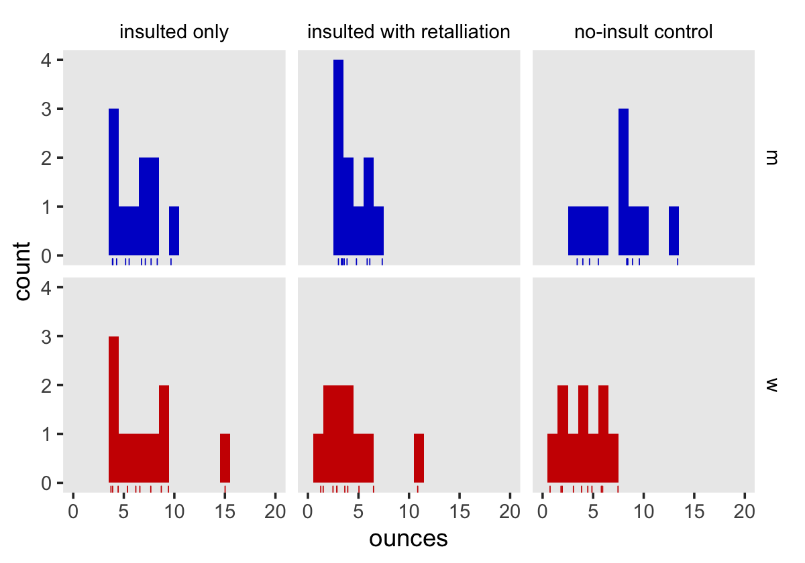
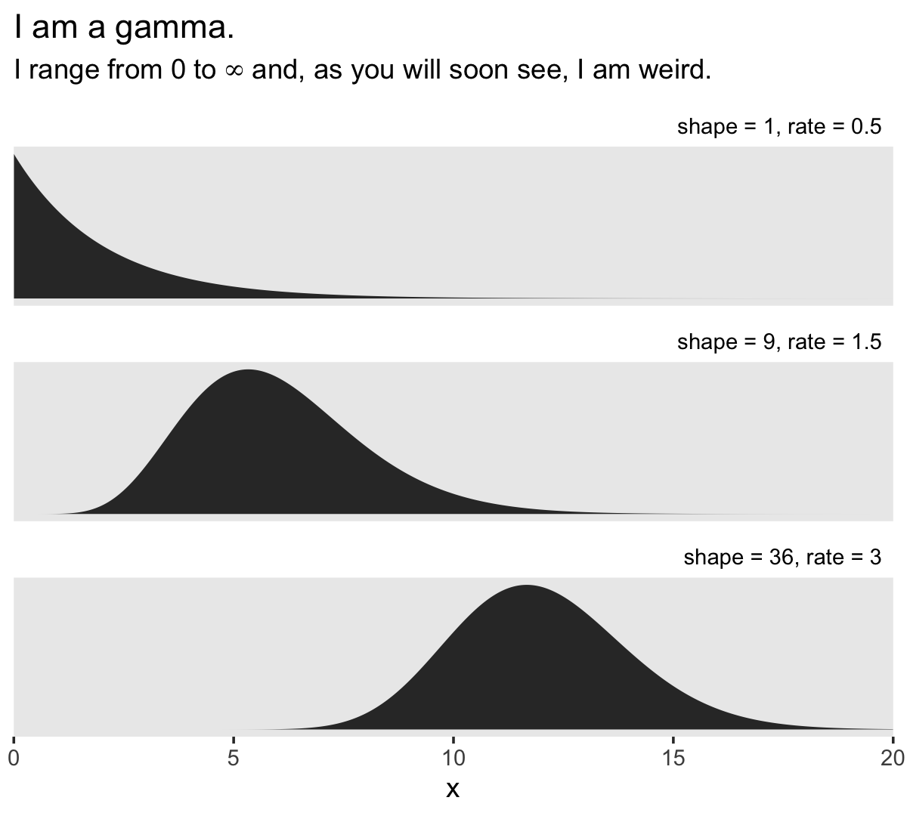
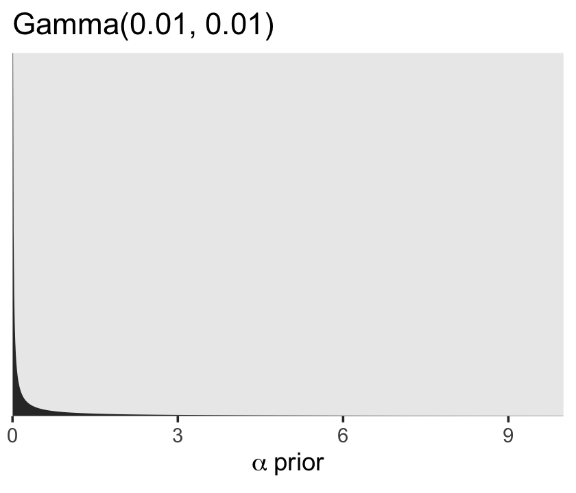
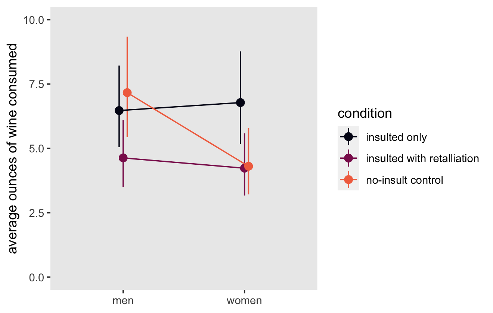
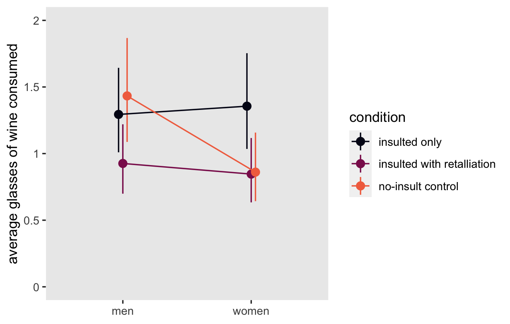
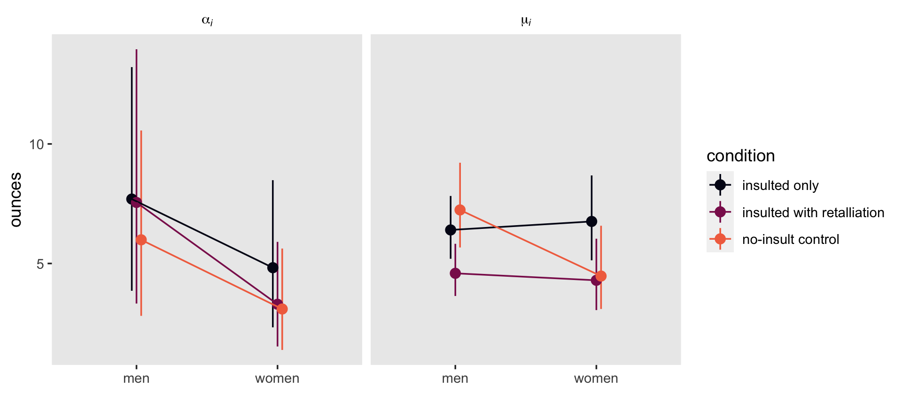
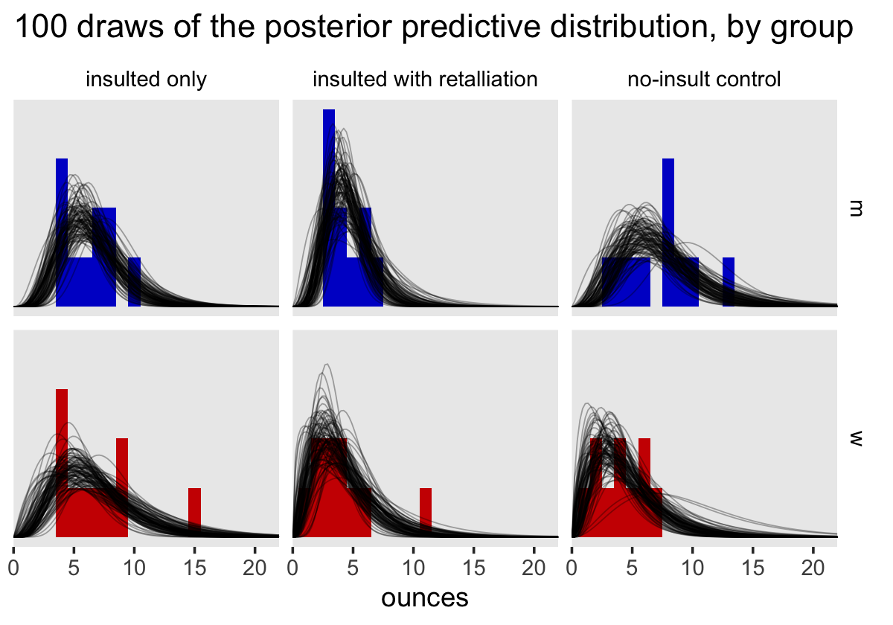

Marlatt et al (1975)
================
A Solomon Kurz
2022-02-28

Load our primary packages.

``` r
library(tidyverse)
library(brms)
library(tidybayes)
```

## An example from the drinking literature

Marlatt, Kosturn, and Lang (1975;
<https://doi.org/10.1037/0021-843X.84.6.652>) reported the results of a
bar-lab type study on elicited anger and the opportunity for retaliation
on the consumption of alcohol in male and female social drinkers. I have
simulated data that resemble those from Marlatt et al and saved them in
a file called `marlatt1975.rda`. Here we load the `marlatt1975` data.

``` r
# load the data
load(file = "/Users/solomonkurz/Dropbox/Experimental-design-and-the-GLMM/sketches/data/marlatt1975.rda")

# what is this?
glimpse(marlatt1975)
```

    ## Rows: 60
    ## Columns: 3
    ## $ sex       <chr> "m", "m", "m", "w", "w", "w", "m", "m", "m", "w", "w", "w", "m", "m", "m", "w", "w", "w", …
    ## $ condition <fct> insulted only, insulted with retalliation, no-insult control, insulted only, insulted with…
    ## $ ounces    <dbl> 4.29, 6.12, 3.42, 6.59, 5.05, 4.47, 5.53, 7.35, 9.57, 3.73, 2.87, 5.94, 3.88, 5.86, 5.51, …

After screening the drinking habits of 1,300 undergraduate students,
Marlatt and colleagues recruited 30 men and 30 women from a subset of
358 who were identified as heavy social drinkers. The participants were
then randomized into one of three levels of the experimental
`condition`, by `sex`. After the several-stage experimental procedure,
the amount of wine each student drank was recorded in `ounces`.

## EDA

### Sample statistics.

Here are the sample statistics.

``` r
marlatt1975 %>% 
  group_by(sex, condition) %>% 
  summarise(m = mean(ounces) %>% round(digits = 2),
            s = sd(ounces) %>% round(digits = 2),
            n = n())
```

    ## # A tibble: 6 × 5
    ## # Groups:   sex [2]
    ##   sex   condition                      m     s     n
    ##   <chr> <fct>                      <dbl> <dbl> <int>
    ## 1 m     insulted only               6.24  1.99    10
    ## 2 m     insulted with retalliation  4.47  1.49    10
    ## 3 m     no-insult control           7.45  3.06    10
    ## 4 w     insulted only               7.1   3.39    10
    ## 5 w     insulted with retalliation  4.1   2.85    10
    ## 6 w     no-insult control           4     2.12    10

If you compare these values with those presented in Table 1 of the
original article (p. 656), you’ll see they’re pretty similar.

### Look at the data.

Here’s a quick plot of the `marlatt1975` data.

``` r
# adjust the global plot settings
theme_set(
  theme_gray() +
    theme(panel.grid = element_blank(),
          plot.title.position = "plot",
          strip.background = element_blank(),
          strip.text = element_text(color = "black"))
  
)

# plot
marlatt1975 %>% 
  ggplot(aes(x = ounces, fill = sex)) +
  geom_histogram(binwidth = 1) +
  geom_rug(aes(color = sex),
           size = 1/4) +
  scale_fill_manual(values = c("blue3", "red3"), breaks = NULL) +
  scale_color_manual(values = c("blue3", "red3"), breaks = NULL) +
  coord_cartesian(xlim = c(0, 20)) +
  facet_grid(sex ~ condition)
```



## How to model non-negative continuous data

Conventional regression with the Gaussian likelihood isn’t great for
modeling non-negative continuous data because there’s nothing to keep
the algorithm from predicting negative values. There are a many
different likelihoods we could use to model data of this kind, such as
the:

-   gamma,
-   exponential,
-   inverse-Gaussian,
-   log-normal, and
-   Weibull.

A reasonable place to start is with *gamma regression*.

## Gamma regression

To get a sense of the gamma distribution, here are what three gamma
densities look like, with different parameter settings.

``` r
tibble(shape = c(1, 9, 36),
       rate = c(0.5, 1.5, 3)) %>% 
  expand(x = seq(from = 0, to = 20, by = 0.05),
         nesting(shape, rate)) %>% 
  mutate(label = str_c("shape = ", shape, ", rate = ", rate),
         density = dgamma(x = x, shape = shape, rate = rate)) %>% 
  ggplot(aes(x = x, y = density)) +
  geom_area() +
  scale_x_continuous(expand = c(0, 0)) +
  scale_y_continuous(NULL, breaks = NULL) +
  facet_wrap(~ reorder(label, shape), ncol = 1, scales = "free_y") +
  ggtitle("I am a gamma.",
          subtitle = expression("I range from 0 to "*infinity*" and, as you will soon see, I am weird.")) +
  theme(strip.text = element_text(hjust = 1))
```



The gamma distribution takes on continuous values ranging from zero to
positive infinity. Holding the standard deviation constant, the gamma
distribution becomes increasingly symmetric and Gaussian looking as the
mean increases. As the mean goes to zero, the gamma distribution becomes
increasingly skewed and, as in the top row of the plot, it eventually
bunches up at the zero boundary like a wedge.

It turns out there are a lot of ways to define the gamma distribution.
Two of these ways are canonical.

### The two canonical ways to define the gamma distribution.

If we have some variable *y*, we can describe it as gamma-distributed
with a *shape* parameter *α* and a *rate* parameter *β* using the
formula

$$
f(y; \\alpha, \\beta) = \\frac{y^{\\alpha - 1} \\exp(-\\beta y) \\beta^\\alpha}{\\Gamma(\\alpha)},
$$

where *Γ*(⋅) is the gamma function. The second canonical way to define
the gamma function is with a *shape* parameter *k* and *scale* parameter
*θ*:

$$
f(y; k, \\theta) = \\frac{y^{k - 1} \\exp \\left (-\\frac{y}{\\theta} \\right )}{\\theta^k \\Gamma(k)}.
$$

Both canonical formulas for the gamma distribution used a *shape*
parameter. Even though shape was either called *α* in the first instance
or *k* in the second instance, these were both the same thing. *α* and
*k* are both the shape.

The *β* rate parameter in the first formula is the reciprocal of the *θ*
scale parameter in the second formula. That is,

$$
\\begin{align\*}
\\beta & = \\frac{1}{\\theta}, \\text{ and thus} \\\\
\\theta & = \\frac{1}{\\beta}.
\\end{align\*}
$$

It’s important to become somewhat fluent with the shape, rate, and/or
scale parameters because these are the inputs in the typical **R**
functions like `dgamma()` and `rgamma()`. If we want to simulate
gamma-distributed data with the `rgamma()` function, for example, we can
define the gamma distribution with either

-   the `shape` and `rate` arguments, or
-   the `shape` and `scale` arguments.

``` r
?rgamma
```

No matter what, you always need to have the `shape` argument. Once you
have that, you can use either the `rate` or the `scale`. Both are fine.

### Mean and standard deviation.

You can define the *mean* of the gamma distribution as

$$
\\begin{align\*}
\\mu & = \\frac{\\alpha}{\\beta}, \\text{or} \\\\
    & = k\\theta.
\\end{align\*}
$$

If you would like the *standard deviation* of the gamma distribution,
you can define it with the shape and rate as

$$
\\begin{align\*}
\\sigma & = \\sqrt{\\frac{\\alpha}{\\beta^2}}, \\text{or} \\\\
       & = \\sqrt{k\\theta^2}.
\\end{align\*}
$$

What’s important to notice is whether your using the first or second
canonical forms of the gamma, the mean and standard deviation are
functions of both of the gamma parameters. As a consequence, the mean
and standard deviation for a gamma distribution are correlated.

### The two canonical formulas won’t work.

One of the reason’s I’m torturing you with all this is that neither of
the two canonical formulas for the gamma distribution work well with
regression models. However, there is a third way to define gamma, which
uses the *mean* *μ* and the *shape* *α*. When you parameterize gamma in
terms of the mean and dispersion, it follows the formula

$$
f(y; \\mu, \\alpha) = \\frac{ \\left (\\frac{\\alpha}{\\mu} \\right)^\\alpha y^{\\alpha - 1} \\exp(-\\frac{\\alpha y}{\\mu})}{\\Gamma(\\alpha)},
$$

which is admittedly awful. However, you will never have to work with
that formula directly. It will be there working hard for you in the
background.

## Conditional means model

The basic statistical model for our 2 × 3 factorial data is

$$
\\begin{align\*}
\\text{ounces}\_i & \\sim \\operatorname{Gamma}(\\mu_i, \\alpha) \\\\
\\log(\\mu_i) & = \\beta_0 + \\beta_1 \\text{condition}\_i + \\beta_2 \\text{sex}\_i + \\beta_3 \\text{condition}\_i \\times \\text{sex}\_i,
\\end{align\*}
$$

where we’re using the log link to constrain the model for
*μ*<sub>*i*</sub> to the non-negative space. You should know that
`brms::brm()`, as other functions in **R**, uses the inverse link for
gamma regression as a default. However, it’s generally a better idea to
use the log link.

As to priors, we’ll first want to think about our intercept
*β*<sub>0</sub>. The way the `sex` and `condition` variables are coded,
this will be the mean for men in the `insulted only` condition. Recall
these are undergraduates who drink heavily on occasion, but who are
being monitored in a psychology experiment. How many ounces of wine will
they drink? Also keep in mind that 5 ounces is the typical size for a
single glass of wine. Further recall that *β*<sub>0</sub> will be on the
log scale. A reasonable place to start might be 5 ounces (i.e., one
glass of wine). If we were to set a normal prior with a mean of log (5)
and a standard deviation of 0.4581, that would put about 95% of the
prior mass between 2 and 12.5 ounces, with the center of the mass around
5 ounces.

``` r
exp(log(5) + 0.468 * c(-1.96, 0, 1.96)) 
```

    ## [1]  1.998022  5.000000 12.512372

The remaining *β* coefficients are all deviations around this reference
group. Assigning a simple Normal (0,0.5) prior to each would allow for
modest group differences, but rule out dramatic ones. Our final prior to
contend with is for the shape parameter, *α*. The current **brms**
default prior for that *α* parameter is Gamma (0.01,0.01). To get a
sense of that that might be, let’s plot.

``` r
tibble(x = seq(from = 0, to = 10, by = 0.01)) %>% 
  mutate(density = dgamma(x, shape = 0.01, rate = 0.01)) %>% 
  
  ggplot(aes(x = x, y = density)) +
  geom_area() +
  scale_x_continuous(expression(alpha~prior), breaks = 0:3 * 3, expand = c(0, 0)) +
  scale_y_continuous(NULL, breaks = NULL, expand = c(0, 0)) +
  ggtitle("Gamma(0.01, 0.01)")
```



The default Gamma (0.01,0.01) places the prior probability across a wide
range of values. As this is our first gamma regression model, it might
make sense to go with the default. Thus, we can write our full
statistical model as

$$
\\begin{align\*}
\\text{ounces}\_i & \\sim \\operatorname{Gamma}(\\mu_i, \\alpha) \\\\
\\log(\\mu_i) & = \\beta_0 + \\beta_1 \\text{condition}\_i + \\beta_2 \\text{sex}\_i + \\beta_3 \\text{condition}\_i \\times \\text{sex}\_i \\\\
\\beta_0 & \\sim \\operatorname{Normal}(\\log 5, 0.468) \\\\
\\beta_1, \\dots, \\beta_3 & \\sim \\operatorname{Normal}(0, 0.5) \\\\
\\alpha & \\sim \\operatorname{Gamma}(0.01, 0.01).
\\end{align\*}
$$

Here’s how to fit the model with `brm()`.

``` r
fit1 <- brm(
  data = marlatt1975,
  family = Gamma(link = "log"),
  ounces ~ 0 + Intercept + sex + condition + condition:sex,
  prior = c(prior(normal(log(5), 0.468), class = b, coef = Intercept),
            prior(normal(0, 0.5), class = b),
            # this is the default
            prior(gamma(0.01, 0.01), class = shape)),
  cores = 4,
  seed = 1,
  file = "fits/fit1.marlatt1975"
)
```

Check the summary.

``` r
summary(fit1)
```

    ##  Family: gamma 
    ##   Links: mu = log; shape = identity 
    ## Formula: ounces ~ 0 + Intercept + sex + condition + condition:sex 
    ##    Data: marlatt1975 (Number of observations: 60) 
    ##   Draws: 4 chains, each with iter = 2000; warmup = 1000; thin = 1;
    ##          total post-warmup draws = 4000
    ## 
    ## Population-Level Effects: 
    ##                                        Estimate Est.Error l-95% CI u-95% CI Rhat Bulk_ESS Tail_ESS
    ## Intercept                                  1.86      0.12     1.62     2.11 1.00     1997     2548
    ## sexw                                       0.05      0.17    -0.29     0.37 1.00     1916     2360
    ## conditioninsultedwithretalliation         -0.34      0.17    -0.68     0.01 1.00     2506     2882
    ## conditionnoMinsultcontrol                  0.10      0.17    -0.24     0.43 1.00     2243     2856
    ## sexw:conditioninsultedwithretalliation    -0.14      0.23    -0.60     0.33 1.00     2395     2533
    ## sexw:conditionnoMinsultcontrol            -0.56      0.24    -1.01    -0.08 1.00     2328     2462
    ## 
    ## Family Specific Parameters: 
    ##       Estimate Est.Error l-95% CI u-95% CI Rhat Bulk_ESS Tail_ESS
    ## shape     4.48      0.83     3.02     6.27 1.00     3028     2737
    ## 
    ## Draws were sampled using sampling(NUTS). For each parameter, Bulk_ESS
    ## and Tail_ESS are effective sample size measures, and Rhat is the potential
    ## scale reduction factor on split chains (at convergence, Rhat = 1).

The results for the *β* parameters are all on the log metric. Rather
than going through the summary output, we might just plot. Here we’ll
use the `fitted()` function to pull the marginal means for the six
groups.

``` r
nd <- marlatt1975 %>% 
  distinct(sex, condition) %>% 
  mutate(code = str_c(sex, ".", as.integer(condition)),
         row = 1:6)

f <- fitted(fit1, newdata = nd) %>% 
  data.frame() %>% 
  bind_cols(nd)

# what is this?
print(f)
```

    ##   Estimate Est.Error     Q2.5    Q97.5 sex                  condition code row
    ## 1 6.470026 0.8096153 5.048284 8.218838   m              insulted only  m.1   1
    ## 2 4.629694 0.6576005 3.495501 6.099576   m insulted with retalliation  m.2   2
    ## 3 7.165236 1.0015442 5.438303 9.337764   m          no-insult control  m.3   3
    ## 4 6.779743 0.9174325 5.174719 8.768051   w              insulted only  w.1   4
    ## 5 4.230404 0.6252760 3.169221 5.584444   w insulted with retalliation  w.2   5
    ## 6 4.304321 0.6530735 3.215120 5.788406   w          no-insult control  w.3   6

Here’s one way to plot the results.

``` r
f %>% 
  ggplot(aes(x = sex, y = Estimate, ymin = Q2.5, ymax = Q97.5,
             group = condition, color = condition)) +
  geom_pointrange(position = position_dodge(width = 0.1)) +
  geom_line(position = position_dodge(width = 0.1)) +
  scale_color_viridis_d(option = "F", end = .7) +
  scale_x_discrete(NULL, labels = c("men", "women")) +
  scale_y_continuous("average ounces of wine consumed", limits = c(0, 10))
```



If it’s difficult to interpret the effects in terms of ounces, recall
that a typical glass of wine is about 5 ounces. Here’s a different
version of the same plot that uses that simple algebraic transformation.

``` r
f %>% 
  ggplot(aes(x = sex, y = Estimate, ymin = Q2.5, ymax = Q97.5,
             group = condition, color = condition)) +
  geom_pointrange(position = position_dodge(width = 0.1)) +
  geom_line(position = position_dodge(width = 0.1)) +
  scale_color_viridis_d(option = "F", end = .7) +
  scale_x_discrete(NULL, labels = c("men", "women")) +
  # this is the new part
  scale_y_continuous("average glasses of wine consumed",
                     breaks = c(0, 2.5, 5, 7.5, 10),
                     # here's the algebraic transformation,
                     # yep, you can just change the labels!
                     labels = c(0, 2.5, 5, 7.5, 10) / 5,
                     limits = c(0, 10))
```



For data of this kind, you could use the differences in ounces or in
glasses wine as the effect size. A difference in ounces might be easy
for alcohol researchers to understand. A differences in glasses of wine
would be easy for most adults to understand.

## Full distributional model

Since the gamma distribution also has a *α* parameter, we could fit a
distributional model by assigning a linear model to that, too. Be
default, **brms** will model *α* with the log link to insure positive
values. Ignoring priors for a moment, we might express the full
distributional model as

$$
\\begin{align\*}
\\text{ounces}\_i & \\sim \\operatorname{Gamma}(\\mu_i, \\alpha_i) \\\\
\\log(\\mu_i) & = \\beta_0 + \\beta_1 \\text{condition}\_i + \\beta_2 \\text{sex}\_i + \\beta_3 \\text{condition}\_i \\times \\text{sex}\_i\\\\
\\log(\\alpha_i) & = \\eta_0 + \\eta_1 \\text{condition}\_i + \\eta_2 \\text{sex}\_i + \\eta_3 \\text{condition}\_i \\times \\text{sex}\_i,
\\end{align\*}
$$

where the four *β* parameters define the linear model for
log (*μ*<sub>*i*</sub>), and the four *η* parameters define the new
linear model for log (*α*<sub>*i*</sub>). You don’t have to call those
new parameters by *η*, but doing so might help differentiate them from
the *β* parameters.

Anyway, the **brms** default for our new intercept *η*<sub>1</sub> is
Student-t (3,0,2.5), which will allow for a wide range of posterior
values on the log scale. Given this is our first distributional gamma
model, we might just stick with that. However, since we might expect the
six conditions will not have radically different shape values, we might
assign weakly-regularizing Normal (0,0.5) priors to the remaining *η*
parameters. Thus, we can write the full model as

$$
\\begin{align\*}
\\text{ounces}\_i & \\sim \\operatorname{Gamma}(\\mu_i, \\alpha_i) \\\\
\\log(\\mu_i) & = \\beta_0 + \\beta_1 \\text{condition}\_i + \\beta_2 \\text{sex}\_i + \\beta_3 \\text{condition}\_i \\times \\text{sex}\_i\\\\
\\log(\\alpha_i) & = \\eta_0 + \\eta_1 \\text{condition}\_i + \\eta_2 \\text{sex}\_i + \\eta_3 \\text{condition}\_i \\times \\text{sex}\_i \\\\
\\beta_0 & \\sim \\operatorname{Normal}(\\log 5, 0.468) \\\\
\\beta_1, \\dots, \\beta_3 & \\sim \\operatorname{Normal}(0, 0.5) \\\\
\\eta_0 & \\sim \\operatorname{Student-t}(3, 0, 2.5) \\\\
\\eta_1, \\dots, \\eta_3 & \\sim \\operatorname{Normal}(0, 0.5).
\\end{align\*}
$$

As with other distributional models, we fit this in **brms** with help
from the `bf()` function.

``` r
fit2 <- brm(
  data = marlatt1975,
  family = Gamma(link = "log"),
  bf(ounces ~ 0 + Intercept + sex + condition + condition:sex,
     # this is new
     shape  ~ 0 + Intercept + sex + condition + condition:sex),
  prior = c(prior(normal(log(5), 0.468), class = b, coef = Intercept),
            prior(normal(0, 0.5), class = b),
            # this is new
            prior(student_t(3, 0, 2.5), class = b, coef = Intercept, dpar = shape),
            prior(normal(0, 0.5), class = b, dpar = shape)),
  cores = 4,
  seed = 1,
  file = "fits/fit2.marlatt1975"
)
```

Check the results.

``` r
print(fit2)
```

    ##  Family: gamma 
    ##   Links: mu = log; shape = log 
    ## Formula: ounces ~ 0 + Intercept + sex + condition + condition:sex 
    ##          shape ~ 0 + Intercept + sex + condition + condition:sex
    ##    Data: marlatt1975 (Number of observations: 60) 
    ##   Draws: 4 chains, each with iter = 2000; warmup = 1000; thin = 1;
    ##          total post-warmup draws = 4000
    ## 
    ## Population-Level Effects: 
    ##                                              Estimate Est.Error l-95% CI u-95% CI Rhat Bulk_ESS Tail_ESS
    ## Intercept                                        1.85      0.10     1.65     2.06 1.00     2668     2878
    ## sexw                                             0.05      0.16    -0.26     0.36 1.00     2802     2785
    ## conditioninsultedwithretalliation               -0.33      0.15    -0.62    -0.04 1.00     2946     2966
    ## conditionnoMinsultcontrol                        0.12      0.15    -0.19     0.42 1.00     2893     2677
    ## sexw:conditioninsultedwithretalliation          -0.13      0.23    -0.58     0.33 1.00     3096     2878
    ## sexw:conditionnoMinsultcontrol                  -0.54      0.24    -1.01    -0.05 1.00     3550     2869
    ## shape_Intercept                                  1.99      0.32     1.35     2.58 1.00     3693     3033
    ## shape_sexw                                      -0.47      0.34    -1.13     0.18 1.00     4287     2743
    ## shape_conditioninsultedwithretalliation         -0.03      0.36    -0.73     0.68 1.00     3922     3205
    ## shape_conditionnoMinsultcontrol                 -0.26      0.35    -0.93     0.43 1.00     4197     2850
    ## shape_sexw:conditioninsultedwithretalliation    -0.35      0.39    -1.10     0.42 1.00     4161     2743
    ## shape_sexw:conditionnoMinsultcontrol            -0.20      0.39    -0.95     0.55 1.00     4509     2640
    ## 
    ## Draws were sampled using sampling(NUTS). For each parameter, Bulk_ESS
    ## and Tail_ESS are effective sample size measures, and Rhat is the potential
    ## scale reduction factor on split chains (at convergence, Rhat = 1).

Here’s a version of our earlier plots, updated to showcase both
distributional parameters.

``` r
rbind(fitted(fit2, newdata = nd),
      fitted(fit2, newdata = nd, dpar = "shape")) %>% 
  data.frame() %>% 
  bind_cols(bind_rows(nd, nd)) %>% 
  mutate(parameter = rep(c("mu[italic(i)]", "alpha[italic(i)]"), each = n() / 2)) %>% 
  
  ggplot(aes(x = sex, y = Estimate, ymin = Q2.5, ymax = Q97.5,
             group = condition, color = condition)) +
  geom_pointrange(position = position_dodge(width = 0.1)) +
  geom_line(position = position_dodge(width = 0.1)) +
  scale_color_viridis_d(option = "F", end = .7) +
  scale_x_discrete(NULL, labels = c("men", "women")) +
  ylab("ounces") +
  facet_wrap(~ parameter, labeller = label_parsed) 
```



In this case, our conditions differed more markedly in the means than
their shapes. So it goes…

Since we have full posteriors for both *μ*<sub>*i*</sub> and
*α*<sub>*i*</sub>, this might be a good opportunity to practice
depicting the posterior predictive distributions for our `ounces` data.
First, we redo the `fitted()` code and wrangle.

``` r
# we don't need all 4,000 posterior draws
n_draws <- 1000

set.seed(1)

f <- rbind(
  fitted(fit2, newdata = nd, summary = F, ndraws = n_draws),
  fitted(fit2, newdata = nd, summary = F, ndraws = n_draws, dpar = "shape")
) %>% 
  data.frame() %>% 
  set_names(nd %>% pull(code)) %>% 
  mutate(draw = rep(1:n_draws, times = 2),
         dpar = rep(c("mu", "alpha"), each = n_draws)) %>% 
  pivot_longer(m.1:w.3, names_to = "code") %>% 
  pivot_wider(values_from = value, names_from = dpar) %>% 
  mutate(beta = alpha / mu)
```

Plot our posterior predictive distributions along with the data.

``` r
set.seed(1)

f %>% 
  # take a ransom sample of 100 from the 1000 draws
  filter(draw %in% sample(1:n_draws, size = 100)) %>% 
  expand(ounces = seq(from = 0, to = 22, length.out = 100),
         nesting(draw, code, alpha, beta)) %>% 
  mutate(density = dgamma(x = ounces, shape = alpha, rate = beta)) %>% 
  left_join(nd, by = "code") %>% 
  
  ggplot(aes(x = ounces)) +
  geom_histogram(data = marlatt1975,
                 aes(y = ..density.., fill = sex),
                 binwidth = 1, size = 0) +
  geom_line(aes(y = density, group = draw), 
            size = 1/4, alpha = 1/3) +
  scale_fill_manual(values = c("blue3", "red3"), breaks = NULL) +
  scale_color_manual(values = c("blue3", "red3"), breaks = NULL) +
  scale_x_continuous(expand = c(0, 0)) +
  scale_y_continuous(NULL, breaks = NULL) +
  ggtitle("100 draws of the posterior predictive distribution, by group") +
  coord_cartesian(xlim = c(0, 22)) +
  facet_grid(sex ~ condition)
```



Each of the black lines depicts a credible estimate of the posterior
predictive distribution for each group. The differences among the lines
express the uncertainty in the posterior. There were only 60 cases in
the data, after all.

As we discussed earlier, *μ* and *σ* are correlated for the gamma
distribution. We can demonstrate that with our posterior draws from
`fit2`.

``` r
f %>% 
  mutate(sigma = sqrt(alpha / beta^2)) %>% 
  group_by(code) %>% 
  summarise(correlation = cor(mu, sigma) %>% round(digits = 2))
```

    ## # A tibble: 6 × 2
    ##   code  correlation
    ##   <chr>       <dbl>
    ## 1 m.1          0.55
    ## 2 m.2          0.55
    ## 3 m.3          0.59
    ## 4 w.1          0.62
    ## 5 w.2          0.71
    ## 6 w.3          0.75

Within each of the six groups, *μ* and *σ* were always correlated above
.5.

## Session information

``` r
sessionInfo()
```

    ## R version 4.1.2 (2021-11-01)
    ## Platform: x86_64-apple-darwin17.0 (64-bit)
    ## Running under: macOS Catalina 10.15.7
    ## 
    ## Matrix products: default
    ## BLAS:   /Library/Frameworks/R.framework/Versions/4.1/Resources/lib/libRblas.0.dylib
    ## LAPACK: /Library/Frameworks/R.framework/Versions/4.1/Resources/lib/libRlapack.dylib
    ## 
    ## locale:
    ## [1] en_US.UTF-8/en_US.UTF-8/en_US.UTF-8/C/en_US.UTF-8/en_US.UTF-8
    ## 
    ## attached base packages:
    ## [1] stats     graphics  grDevices utils     datasets  methods   base     
    ## 
    ## other attached packages:
    ##  [1] tidybayes_3.0.2 brms_2.16.3     Rcpp_1.0.8      forcats_0.5.1   stringr_1.4.0   dplyr_1.0.7    
    ##  [7] purrr_0.3.4     readr_2.0.1     tidyr_1.2.0     tibble_3.1.6    ggplot2_3.3.5   tidyverse_1.3.1
    ## 
    ## loaded via a namespace (and not attached):
    ##   [1] readxl_1.3.1         backports_1.4.1      plyr_1.8.6           igraph_1.2.6         svUnit_1.0.6        
    ##   [6] splines_4.1.2        crosstalk_1.1.1      TH.data_1.0-10       rstantools_2.1.1     inline_0.3.19       
    ##  [11] digest_0.6.29        htmltools_0.5.2      rsconnect_0.8.24     fansi_1.0.2          magrittr_2.0.2      
    ##  [16] checkmate_2.0.0      tzdb_0.1.2           modelr_0.1.8         RcppParallel_5.1.4   matrixStats_0.61.0  
    ##  [21] xts_0.12.1           sandwich_3.0-1       prettyunits_1.1.1    colorspace_2.0-2     rvest_1.0.1         
    ##  [26] ggdist_3.0.1         haven_2.4.3          xfun_0.25            callr_3.7.0          crayon_1.4.2        
    ##  [31] jsonlite_1.7.3       lme4_1.1-27.1        survival_3.2-13      zoo_1.8-9            glue_1.6.1          
    ##  [36] gtable_0.3.0         emmeans_1.7.1-1      distributional_0.2.2 pkgbuild_1.2.0       rstan_2.21.3        
    ##  [41] abind_1.4-5          scales_1.1.1         mvtnorm_1.1-2        DBI_1.1.1            miniUI_0.1.1.1      
    ##  [46] viridisLite_0.4.0    xtable_1.8-4         diffobj_0.3.4        stats4_4.1.2         StanHeaders_2.21.0-7
    ##  [51] DT_0.19              htmlwidgets_1.5.3    httr_1.4.2           threejs_0.3.3        arrayhelpers_1.1-0  
    ##  [56] posterior_1.1.0.9000 ellipsis_0.3.2       pkgconfig_2.0.3      loo_2.4.1            farver_2.1.0        
    ##  [61] dbplyr_2.1.1         utf8_1.2.2           labeling_0.4.2       tidyselect_1.1.1     rlang_1.0.1         
    ##  [66] reshape2_1.4.4       later_1.3.0          munsell_0.5.0        cellranger_1.1.0     tools_4.1.2         
    ##  [71] cli_3.1.1            generics_0.1.2       broom_0.7.10         ggridges_0.5.3       evaluate_0.14       
    ##  [76] fastmap_1.1.0        yaml_2.2.1           processx_3.5.2       knitr_1.33           fs_1.5.0            
    ##  [81] nlme_3.1-153         mime_0.11            projpred_2.0.2       xml2_1.3.2           compiler_4.1.2      
    ##  [86] bayesplot_1.8.1      shinythemes_1.2.0    rstudioapi_0.13      gamm4_0.2-6          reprex_2.0.1        
    ##  [91] stringi_1.7.4        highr_0.9            ps_1.6.0             Brobdingnag_1.2-6    lattice_0.20-45     
    ##  [96] Matrix_1.3-4         nloptr_1.2.2.2       markdown_1.1         shinyjs_2.0.0        tensorA_0.36.2      
    ## [101] vctrs_0.3.8          pillar_1.7.0         lifecycle_1.0.1      bridgesampling_1.1-2 estimability_1.3    
    ## [106] httpuv_1.6.2         R6_2.5.1             promises_1.2.0.1     gridExtra_2.3        codetools_0.2-18    
    ## [111] boot_1.3-28          colourpicker_1.1.0   MASS_7.3-54          gtools_3.9.2         assertthat_0.2.1    
    ## [116] withr_2.4.3          shinystan_2.5.0      multcomp_1.4-17      mgcv_1.8-38          parallel_4.1.2      
    ## [121] hms_1.1.0            grid_4.1.2           coda_0.19-4          minqa_1.2.4          rmarkdown_2.10      
    ## [126] shiny_1.6.0          lubridate_1.7.10     base64enc_0.1-3      dygraphs_1.1.1.6
