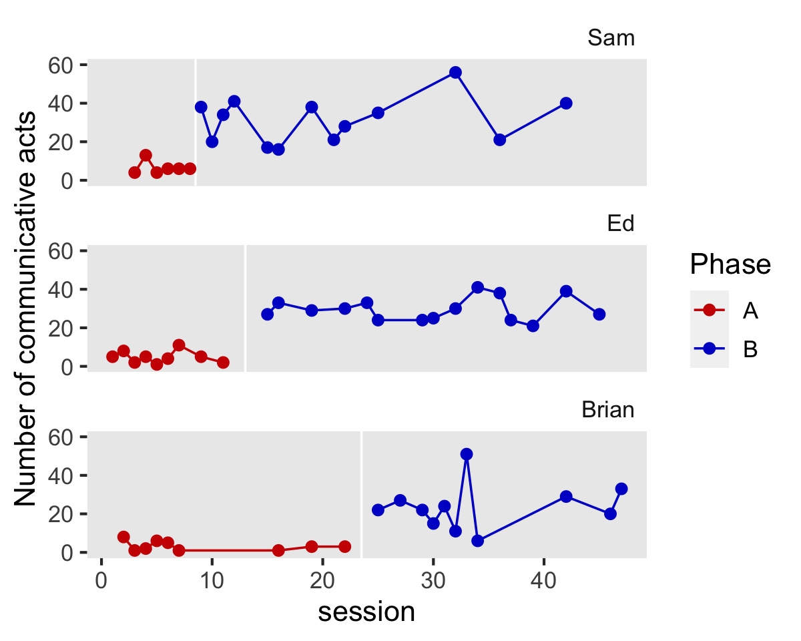
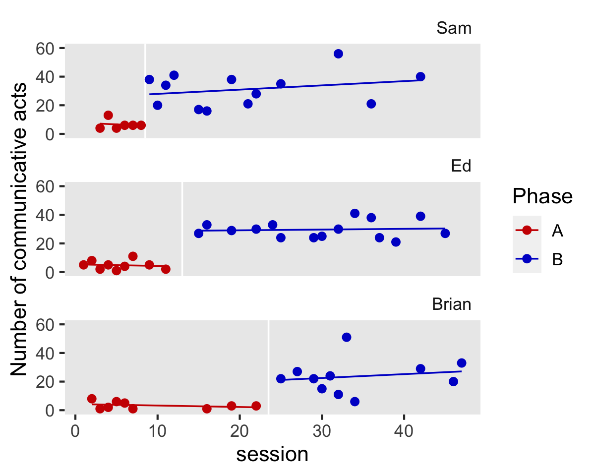
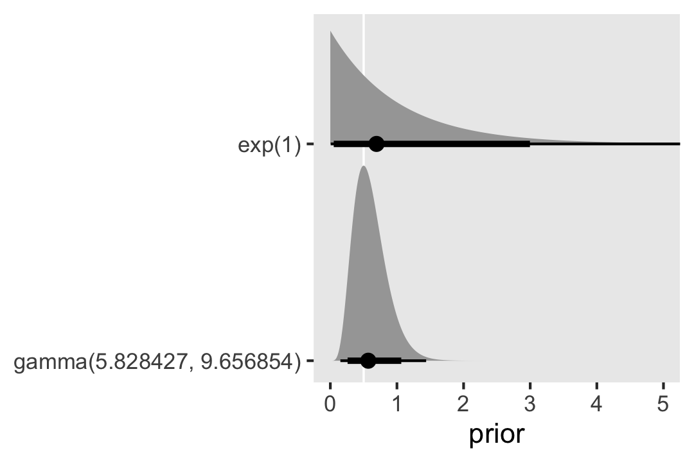
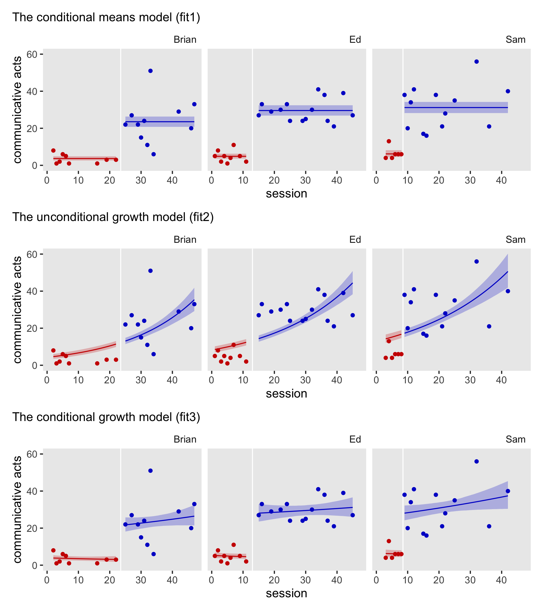
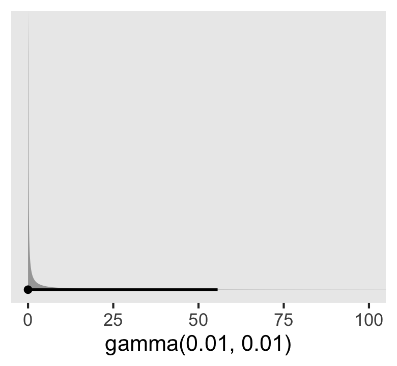

Mason et al (2014)
================
A Solomon Kurz
2022-03-08

Load our primary packages.

``` r
library(tidyverse)
library(brms)
library(tidybayes)
library(patchwork)
```

## Communication at recess

School-aged children diagnosed with autism spectrum disorder often miss
opportunities to play with other children during recess. Mason et al
(2014; <https://doi.org/10.1016/j.rasd.2013.12.014>) used a nice
multiple baseline AB design to evaluate a social skills instructional
program to increase the frequency three children diagnosed with ASD
displayed communicative acts during recess.

``` r
# load the data
load(file = "/Users/solomonkurz/Dropbox/Experimental-design-and-the-GLMM/sketches/data/mason2014.rda")

mason2014 <- mason2014 %>% 
  mutate(session01 = session0 / max(session0))

# what is this?
glimpse(mason2014)
```

    ## Rows: 63
    ## Columns: 6
    ## $ id        <fct> Sam, Sam, Sam, Sam, Sam, Sam, Sam, Sam, Sam, Sam, Sam, Sam, Sam, Sam, Sam, Sam, Sam, Sam, …
    ## $ session   <dbl> 3, 4, 5, 6, 7, 8, 9, 10, 11, 12, 15, 16, 19, 21, 22, 25, 32, 36, 42, 1, 2, 3, 4, 5, 6, 7, …
    ## $ session0  <dbl> 2, 3, 4, 5, 6, 7, 8, 9, 10, 11, 14, 15, 18, 20, 21, 24, 31, 35, 41, 0, 1, 2, 3, 4, 5, 6, 8…
    ## $ phase     <fct> A, A, A, A, A, A, B, B, B, B, B, B, B, B, B, B, B, B, B, A, A, A, A, A, A, A, A, A, B, B, …
    ## $ count     <dbl> 4, 13, 4, 6, 6, 6, 38, 20, 34, 41, 17, 16, 38, 21, 28, 35, 56, 21, 40, 5, 8, 2, 5, 1, 4, 1…
    ## $ session01 <dbl> 0.04347826, 0.06521739, 0.08695652, 0.10869565, 0.13043478, 0.15217391, 0.17391304, 0.1956…

The participant pseudonyms are listed in the `id` column. The session
number is coded 1, …, *N* in the `session` column and coded the same
minus 1 in the `session0` column. The two phases `A` and `B` are saved
in the `phase` column. The number of filled pauses is in the `count`
column and the number of times the children displayed communicative acts
during recess is recorded in the `count` column.

### EDA.

We can look at the data with a version of Figure 2 from the original
article.

``` r
# adjust the global plotting theme
theme_set(
  theme_gray(base_size = 13) +
  theme(panel.grid = element_blank(),
        strip.background= element_blank(),
        strip.text.x = element_text(hjust = 1))
)

lines <- mason2014 %>% 
  distinct(id) %>% 
  mutate(xintercept = c(8.5, 13, 23.5))

mason2014 %>% 
  ggplot(aes(x = session, y = count, color = phase)) +
  geom_vline(data = lines,
             aes(xintercept = xintercept),
             color = "white") +
  geom_point(size = 2) +
  geom_line() +
  scale_color_manual("Phase", values = c("red3", "blue3")) +
  scale_y_continuous("Number of communicative acts", limits = c(0, 60)) +
  facet_wrap(~ id, ncol = 1)
```



We could also use the `geom_smooth()` method to get a sense of the
trends across students and conditions.

``` r
mason2014 %>% 
  ggplot(aes(x = session, y = count, color = phase)) +
  geom_vline(data = lines,
             aes(xintercept = xintercept),
             color = "white") +
  geom_point(size = 2) +
  geom_smooth(method = "lm", se = FALSE, formula = y ~ x, size = 1/2) +
  scale_color_manual("Phase", values = c("red3", "blue3")) +
  scale_y_continuous("Number of communicative acts", limits = c(0, 60)) +
  facet_wrap(~ id, ncol = 1)
```



We explicitly removed the standard error ribbons from the plot with
`se = FALSE` because, IMO, they would be invalid. They’re based on OLS
estimation, which isn’t particularly appropriate for that of this kind.
However, the lines are okay for quick-and-dirty exploratory plots.

## Models: First round

The first model will be the simple conditional-means model with the
Poisson likelihood. If we let the outcome variable `count` vary across
*i* kids and *j* time points, we can express the model as

$$
\\begin{align\*}
\\text{count}\_{ij} & \\sim \\operatorname{Poisson}(\\lambda\_{ij}) \\\\
\\log(\\lambda\_{ij}) & = \\beta_0 + \\beta_1 \\text{phase}\_{ij} + u\_{0i} + u\_{1i} \\\\
\\begin{bmatrix} u\_{0i} \\\\ u\_{1i} \\end{bmatrix} & \\sim
  \\operatorname{Normal} \\left ( 
    \\begin{bmatrix} 0 \\\\ 0 \\end{bmatrix}, \\mathbf \\Sigma 
    \\right) \\\\
\\mathbf \\Sigma & = \\mathbf{SRS} \\\\
\\mathbf S & =  \\begin{bmatrix} \\sigma_0 & \\\\ 0 & \\sigma_1 \\end{bmatrix} \\\\
\\mathbf R & =  \\begin{bmatrix} 1 & \\\\ \\rho & 1 \\end{bmatrix},
\\end{align\*}
$$

where the left side of the equation in the second line,
log (*λ*<sub>*i**j*</sub>), clarifies we are using the conventional log
link to ensure the model only predicts positive average counts. The
*β*<sub>0</sub> parameter is the population average number of counts at
baseline A phase and *β*<sub>1</sub> is population average change in
counts during the post-intervention B phase. The kid-specific deviations
around the population means are depicted by the *u*<sub>0*i*</sub> and
*u*<sub>1*i*</sub> terms, which are modeled as bivariate normal with
means of zero and the variance/covariance matrix **Σ**. Following the
**brms** convention, we decompose **Σ** into the matrix of standard
deviations **S** and the correlation matrix **R** which, though somewhat
confusing at first, will make it easier for the software to fit the
model and ultimately easier for us to assign the priors.

The next issue is how to contend with the priors. Since this is a small
data set with only three kids, I recommend we use some domain knowledge
and a little courage of heart to set moderately-informative and
regularizing priors. Let’s start with the population average during the
A phase, *β*<sub>0</sub>. We know from the outset that this intervention
is designed to increase counts in a population of kids for whom the
number of counts is typically low. If you peruse the behavior-analytic
literature a bit, you’ll also notice that in cases like this, counts of
this kind tend to be near zero, but not necessarily all at zero. As a
start, we could propose the average count might be 5, which we will
express as log (5) because we are modeling on the log scale. It’s
typical to use Gaussian priors for parameters of this kind. If we were
to use 𝒩(log(5),0.89392), that would give us a 99% prior probability the
mean was between 0.5 and 50, and a 90% probability it’s between 1.15 and
21.75, which seems like a good place to start.

``` r
# what is the z-value for the 99% intervals for the standard normal?
qnorm(p = c(.005, .995), mean = 0, sd = 1)
```

    ## [1] -2.575829  2.575829

``` r
# what is the z-value for the 90% intervals for the standard normal?
qnorm(p = c(.05, .95), mean = 0, sd = 1)
```

    ## [1] -1.644854  1.644854

``` r
# save the values and check
z99 <- 2.575829
pnorm(z99) - pnorm(-z99)
```

    ## [1] 0.99

``` r
z90 <- 1.644854
pnorm(z90) - pnorm(-z90)
```

    ## [1] 0.9000001

``` r
# now save the candidate hyper parameter for sigma
sigma <- 0.89392

# what are the 99% limits for N(log(5), sigma)?
exp(log(5) + z99 * c(-sigma, 0, sigma))
```

    ## [1]  0.5  5.0 50.0

``` r
# what are the 90% limits for N(log(5), sigma)?
exp(log(5) + z90 * c(-sigma, 0, sigma))
```

    ## [1]  1.149205  5.000000 21.754177

Next we consider *β*<sub>1</sub>, the change in average counts for the B
phase. We know that behavior analysts often go for effect sizes that are
large enough to see plainly with your eyes. A difference in 1 on the log
scale is pretty good. For example, assuming a populaiton mean of
log (5), an estimate of *β*<sub>1</sub> = 1 would mean an average
increase of 8.6 counts to a new average of 13.6 counts, which seems
generous.

``` r
b0 <- log(5)
b1 <- 1

# average increase
exp(b0 + b1) - exp(b0)
```

    ## [1] 8.591409

``` r
# phase B average
exp(b0 + b1)
```

    ## [1] 13.59141

If we set *β*<sub>1</sub> ∼ 𝒩(0,1), that would rule out outrageously
large changes, but easily allow for moderately large like we might
expect. If you wanted to be more conservative, I could easily see a
justification for something as small as *β*<sub>1</sub> ∼ 𝒩(0,0.5).

Our next issue has to do with the level-2 variance parameters
*σ*<sub>0</sub> and *σ*<sub>1</sub>. When we have many more upper-level
groups (i.e., kids), a nice default is the exponential distribution with
a mean of 1, which puts a lot of prior mass betwen zero and 1, but
gently tapers off to the right. With only 3 kids in the data, we might
want to use a little bit of theory to motivate a stronger prior. We know
that from the outset, behavior analysts believe that people are not
exchangable in the way hydrogen atoms are. Individual differences are
inportant and behavior analysts prefer modela and analytic strategies
which highlight them. In the case of our model, this suggests we should
use priors that push the variance parameters away from zero. However, we
also know that given this is a study of children from a well-defined
psyshiatric subpopulation, we probably shouldn’t epect to se massive
differences among the kids. So we want a prior that can both nudge the
variance parameters away from zero, but still keep the model from
entertaining very large values. The gamma distribution can fit this
criteria. In text, Kruschke provided a few convience functions that
allow researchers to derive the *α* and *β* parameters taht corresopnd
to gamma distributions with pre-defined means and standard deviaitons or
modes and standard deviations. Here we’ll use the function that uses the
mode and standard deviation and request a gamma with a mode of 0.5 and a
standard deviation of 0.25.

``` r
gamma_a_b_from_omega_sigma <- function(mode, sd) {
  
  if (mode <= 0) stop("mode must be > 0")
  if (sd   <= 0) stop("sd must be > 0")
  rate <- (mode + sqrt(mode^2 + 4 * sd^2)) / (2 * sd^2)
  shape <- 1 + mode * rate
  
  return(list(shape = shape, rate = rate))
  
}

gamma_a_b_from_omega_sigma(mode = 0.5, sd = 0.25)
```

    ## $shape
    ## [1] 5.828427
    ## 
    ## $rate
    ## [1] 9.656854

We can use functions from **ggdist** to plot the this gamma prior and
compare it with the familiar exponential prior for which *λ* = 1.

``` r
c(prior(exp(1), class = sd),
  prior(gamma(5.828427, 9.656854), class = sd)) %>% 
  parse_dist(prior) %>%
  mutate(prior = fct_rev(prior)) %>% 
  
  ggplot(aes(y = prior, dist = .dist, args = .args)) +
  geom_vline(xintercept = 0.5, color = "white") +
  stat_dist_halfeye(.width = c(.9, .99)) +
  labs(x = "prior",
       y = NULL) +
  coord_cartesian(xlim = c(0, 5),
                  ylim = c(1.5, 2))
```



This gamma prior would put 99% of the prior mas between 0.15 and 1.44
and 90% of the mass between 0.26 and 1.06.

``` r
g <- gamma_a_b_from_omega_sigma(mode = 0.5, sd = 0.25)

# what is the 99% interval for this gamma?
qgamma(p = c(.005, .995), shape = g$shape, rate = g$rate)
```

    ## [1] 0.1506647 1.4379874

``` r
# what is the 90% interval for this gamma?
qgamma(p = c(.050, .950), shape = g$shape, rate = g$rate)
```

    ## [1] 0.2589262 1.0647510

To my eye, this prior would allow for kid-level differences to range
anywhere form small to moderately large while also fulfilling our
desires to keep the posterior off of the zero boundary and discourage
outrageously large differences. Finally, we’ll need to set a prior for
the correlation *ρ* between the two level-2 variance parameters. Here
we’ll use an LKJ (4), which will regularize towards zero. With those
priors in place, we can specify the full model as

$$
\\begin{align\*}
\\text{count}\_{ij} & \\sim \\operatorname{Poisson}(\\lambda\_{ij}) \\\\
\\log(\\lambda\_{ij}) & = \\beta_0 + \\beta_1 \\text{phase}\_{ij} + u\_{0i} + u\_{1i} \\\\
\\begin{bmatrix} u\_{0i} \\\\ u\_{1i} \\end{bmatrix} & \\sim
  \\operatorname{Normal} \\left ( 
    \\begin{bmatrix} 0 \\\\ 0 \\end{bmatrix}, \\mathbf{SRS} 
    \\right) \\\\
\\mathbf S & =  \\begin{bmatrix} \\sigma_0 & \\\\ 0 & \\sigma_1 \\end{bmatrix} \\\\
\\mathbf R & =  \\begin{bmatrix} 1 & \\\\ \\rho & 1 \\end{bmatrix} \\\\
\\beta_0 & \\sim \\operatorname{Normal}(\\log(5), 0.89392) \\\\
\\beta_1  & \\sim \\operatorname{Normal}(0, 1) \\\\
\\sigma_0\\ \\&\\ \\sigma_1 & \\sim \\operatorname{Gamma}(5.828427, 9.656854) \\\\
\\rho    & \\sim \\operatorname{LKJ}(4).
\\end{align\*}
$$

Here’s how to fit the model with `brm()`.

``` r
# conditional means model
fit1 <- brm(
  data = mason2014,
  family = poisson,
  count ~ 0 + Intercept + phase + (1 + phase | id),
  prior = c(prior(normal(log(5), 0.89392), class = b, coef = Intercept),
            prior(normal(0, 1), class = b),
            prior(gamma(5.828427, 9.656854), class = sd),
            prior(lkj(4), class = cor)),
  cores = 4,
  seed = 1,
  control = list(adapt_delta = .95),
  file = "fits/fit1.mason2014"
)
```

You’ll note that even with our carefully-chosen priors, we still had to
adjust the `adapt_delta` settings. In my experience, this is not
uncommon with so few level-2 groups.

Before we start interpreting the model, let’s fit the next two
alternative models. The first is the unconditional growth model

$$
\\begin{align\*}
\\text{count}\_{ij} & \\sim \\operatorname{Poisson}(\\lambda\_{ij}) \\\\
\\log(\\lambda\_{ij}) & = \\beta_0 + \\beta_1 \\text{session01}\_{ij} + u\_{0i} + u\_{1i} \\\\
\\begin{bmatrix} u\_{0i} \\\\ u\_{1i} \\end{bmatrix} & \\sim
  \\operatorname{Normal} \\left ( 
    \\begin{bmatrix} 0 \\\\ 0 \\end{bmatrix}, \\mathbf{SRS} 
    \\right) \\\\
\\mathbf S & =  \\begin{bmatrix} \\sigma_0 & \\\\ 0 & \\sigma_1 \\end{bmatrix} \\\\
\\mathbf R & =  \\begin{bmatrix} 1 & \\\\ \\rho & 1 \\end{bmatrix} \\\\
\\beta_0 & \\sim \\operatorname{Normal}(\\log(5), 0.89392) \\\\
\\beta_1  & \\sim \\operatorname{Normal}(0, 1) \\\\
\\sigma_0\\ \\&\\ \\sigma_1 & \\sim \\operatorname{Gamma}(5.828427, 9.656854) \\\\
\\rho    & \\sim \\operatorname{LKJ}(4),
\\end{align\*}
$$

which has the same basic structure as the conditional means model we
just fit. The only difference is we have switched out the `phase`
variable for a continuous measure of time, `session01`. This variable
has been scales so that the first session is 0, the last session (47)
has been scaled to 1, all the intermediary sessions are the
corresponding factions. In principle, you could use the `session`
variable, instead, but `session01` will make it easer for the HMC
algorithm to fit the model and it will make it easier to set the prior
on *β*<sub>1</sub>, which is now interpreted as the average change in
counts from the first session to the last. In this case, we will just
continue using the regularizing 𝒩(0,1).

Our third model is the conditional growth model

$$
\\begin{align\*}
\\text{count}\_{ij} & \\sim \\operatorname{Poisson}(\\lambda\_{ij}) \\\\
\\log(\\lambda\_{ij}) & = \\beta_0 + \\beta_1 \\text{session01}\_{ij} + \\beta_2 \\text{phase}\_{ij} + \\beta_3 \\text{session01}\_{ij}\\text{phase}\_{ij} \\\\
                   & \\;\\;\\; + u\_{0i} + u\_{1i} + u\_{2i} + u\_{3i} \\\\
\\begin{bmatrix} u\_{0i} \\\\ u\_{1i} \\\\ u\_{2i} \\\\ u\_{3i} \\end{bmatrix} & \\sim
  \\operatorname{Normal} \\left ( 
    \\mathbf 0, \\mathbf{SRS} 
    \\right) \\\\
\\mathbf S & = 
  \\begin{bmatrix} 
    \\sigma_0 \\\\ 
    0 & \\sigma_1 \\\\ 
    0 & 0 & \\sigma_2 \\\\ 
    0 & 0 & 0 & \\sigma_3 
  \\end{bmatrix} \\\\
\\mathbf R & = 
  \\begin{bmatrix} 
    1 & \\\\ 
    \\rho\_{21} & 1 \\\\ 
    \\rho\_{31} & \\rho\_{32} & 1 \\\\ 
    \\rho\_{41} & \\rho\_{42} & \\rho\_{43} & 1 
  \\end{bmatrix} \\\\
\\beta_0 & \\sim \\operatorname{Normal}(\\log(5), 0.89392) \\\\
\\beta_1, \\dots, \\beta_3  & \\sim \\operatorname{Normal}(0, 1) \\\\
\\sigma_0, \\dots,  \\sigma_3 & \\sim \\operatorname{Gamma}(5.828427, 9.656854) \\\\
\\rho    & \\sim \\operatorname{LKJ}(2),
\\end{align\*}
$$

where *β*<sub>0</sub> is the population average count at the first
session within the A `phase`; *β*<sub>1</sub> is the population average
change by the final session (47), presuming the A `phase`;
*β*<sub>2</sub> is the population average change in counts for the B
`phase`, from the perspective of the first trial; and *β*<sub>3</sub> is
the population average interaction for `phase` and `session01`, which
allows the growth trajectories to differ by `phase`. As we allow all
four parameters to vary by kid, we end up with four *u*<sub>*i*</sub>
parameters and a corresponding 4 × 4 matrix for both **S** and **R**.
Given the size of the **R** matrix, we have reduced the prior to
LKJ (2).

Here’s how to fit both models.

``` r
# unconditional growth model
fit2 <- brm(
  data = mason2014,
  family = poisson,
  count ~ 0 + Intercept + session01 + (1 + session01 | id),
  prior = c(prior(normal(log(5), 0.89392), class = b, coef = Intercept),
            prior(normal(0, 1), class = b),
            prior(gamma(5.828427, 9.656854), class = sd),
            prior(lkj(4), class = cor)),
  cores = 4,
  seed = 1,
  file = "fits/fit2.mason2014"
)

# conditional growth model
fit3 <- brm(
  data = mason2014,
  family = poisson,
  count ~ 0 + Intercept + session01 + phase + session01:phase + (1 + session01 + phase + session01:phase | id),
  prior = c(prior(normal(log(5), 0.805), class = b, coef = Intercept),
            prior(normal(0, 1), class = b),
            prior(gamma(5.828427, 9.656854), class = sd),
            prior(lkj(2), class = cor)),
  cores = 4,
  seed = 1,
  file = "fits/fit3.mason2014"
)
```

### Summarize and compare.

Behold the model summaries.

``` r
summary(fit1)
```

    ##  Family: poisson 
    ##   Links: mu = log 
    ## Formula: count ~ 0 + Intercept + phase + (1 + phase | id) 
    ##    Data: mason2014 (Number of observations: 63) 
    ##   Draws: 4 chains, each with iter = 2000; warmup = 1000; thin = 1;
    ##          total post-warmup draws = 4000
    ## 
    ## Group-Level Effects: 
    ## ~id (Number of levels: 3) 
    ##                       Estimate Est.Error l-95% CI u-95% CI Rhat Bulk_ESS Tail_ESS
    ## sd(Intercept)             0.50      0.19     0.20     0.95 1.00     2091     2293
    ## sd(phaseB)                0.47      0.21     0.16     0.97 1.00     2305     2584
    ## cor(Intercept,phaseB)    -0.08      0.35    -0.72     0.59 1.00     2203     2381
    ## 
    ## Population-Level Effects: 
    ##           Estimate Est.Error l-95% CI u-95% CI Rhat Bulk_ESS Tail_ESS
    ## Intercept     1.57      0.31     0.95     2.21 1.00     1306     1675
    ## phaseB        1.63      0.30     1.00     2.16 1.00     2011     2232
    ## 
    ## Draws were sampled using sampling(NUTS). For each parameter, Bulk_ESS
    ## and Tail_ESS are effective sample size measures, and Rhat is the potential
    ## scale reduction factor on split chains (at convergence, Rhat = 1).

``` r
summary(fit2)
```

    ##  Family: poisson 
    ##   Links: mu = log 
    ## Formula: count ~ 0 + Intercept + session01 + (1 + session01 | id) 
    ##    Data: mason2014 (Number of observations: 63) 
    ##   Draws: 4 chains, each with iter = 2000; warmup = 1000; thin = 1;
    ##          total post-warmup draws = 4000
    ## 
    ## Group-Level Effects: 
    ## ~id (Number of levels: 3) 
    ##                          Estimate Est.Error l-95% CI u-95% CI Rhat Bulk_ESS Tail_ESS
    ## sd(Intercept)                0.62      0.20     0.32     1.09 1.00     2028     2421
    ## sd(session01)                0.52      0.21     0.20     1.02 1.00     1875     2569
    ## cor(Intercept,session01)    -0.15      0.32    -0.73     0.47 1.00     2701     2609
    ## 
    ## Population-Level Effects: 
    ##           Estimate Est.Error l-95% CI u-95% CI Rhat Bulk_ESS Tail_ESS
    ## Intercept     2.03      0.34     1.32     2.69 1.00     1248     1800
    ## session01     1.61      0.35     0.82     2.23 1.00     1605     1501
    ## 
    ## Draws were sampled using sampling(NUTS). For each parameter, Bulk_ESS
    ## and Tail_ESS are effective sample size measures, and Rhat is the potential
    ## scale reduction factor on split chains (at convergence, Rhat = 1).

``` r
summary(fit3)
```

    ##  Family: poisson 
    ##   Links: mu = log 
    ## Formula: count ~ 0 + Intercept + session01 + phase + session01:phase + (1 + session01 + phase + session01:phase | id) 
    ##    Data: mason2014 (Number of observations: 63) 
    ##   Draws: 4 chains, each with iter = 2000; warmup = 1000; thin = 1;
    ##          total post-warmup draws = 4000
    ## 
    ## Group-Level Effects: 
    ## ~id (Number of levels: 3) 
    ##                                 Estimate Est.Error l-95% CI u-95% CI Rhat Bulk_ESS Tail_ESS
    ## sd(Intercept)                       0.50      0.20     0.20     0.96 1.00     3861     3363
    ## sd(session01)                       0.52      0.22     0.18     1.03 1.00     4938     2770
    ## sd(phaseB)                          0.48      0.20     0.18     0.97 1.00     4001     3083
    ## sd(session01:phaseB)                0.53      0.22     0.19     1.03 1.00     4836     2578
    ## cor(Intercept,session01)           -0.00      0.39    -0.72     0.74 1.00     5229     2186
    ## cor(Intercept,phaseB)              -0.05      0.40    -0.76     0.70 1.00     4295     3053
    ## cor(session01,phaseB)              -0.04      0.39    -0.75     0.69 1.00     3659     2970
    ## cor(Intercept,session01:phaseB)    -0.03      0.38    -0.72     0.69 1.00     5838     2883
    ## cor(session01,session01:phaseB)    -0.12      0.38    -0.78     0.64 1.00     3998     3115
    ## cor(phaseB,session01:phaseB)       -0.04      0.39    -0.74     0.72 1.00     3674     2634
    ## 
    ## Population-Level Effects: 
    ##                  Estimate Est.Error l-95% CI u-95% CI Rhat Bulk_ESS Tail_ESS
    ## Intercept            1.61      0.30     1.02     2.18 1.00     1747     2419
    ## session01           -0.44      0.61    -1.65     0.75 1.00     3442     3257
    ## phaseB               1.41      0.31     0.75     2.00 1.00     2295     2523
    ## session01:phaseB     0.75      0.63    -0.48     2.00 1.00     3377     3291
    ## 
    ## Draws were sampled using sampling(NUTS). For each parameter, Bulk_ESS
    ## and Tail_ESS are effective sample size measures, and Rhat is the potential
    ## scale reduction factor on split chains (at convergence, Rhat = 1).

As you look through the parameter summaries, you’ll notice all of the
posteriors are will within the expected ranges we set with our priors.
Though we’ll come back to it in more detail, later, notice how the *σ*
posteriors compare with their priors.

We might compare how well the models make sense of the data from a
cross-validation perspective with the LOO-CV estimates.

``` r
fit1 <- add_criterion(fit1, criterion = "loo")
fit2 <- add_criterion(fit2, criterion = "loo")
fit3 <- add_criterion(fit3, criterion = "loo")

loo_compare(fit1, fit2, fit3, criterion = "loo") %>% 
  print(simplify = FALSE)
```

    ##      elpd_diff se_diff elpd_loo se_elpd_loo p_loo  se_p_loo looic  se_looic
    ## fit1    0.0       0.0  -234.4     20.4        15.3    3.6    468.7   40.9  
    ## fit3   -1.0       4.0  -235.4     20.0        20.1    4.1    470.7   40.0  
    ## fit2 -108.9      26.0  -343.2     28.4        31.2    5.2    686.5   56.7

Numerically, there is very little difference between the conditional
means model and the conditional growth models, but both are clearly
superior to the unconditional growth model, which might be seen as the
null model in this case. Thus we appear to be on good footing to presume
statistical evidence for the effectiveness of the intervention.

### Compare the models with plots.

We might want to compare the three models in a series of plots. The
first step is to define a data set containing the `id`, `phase` and
`session01` values we want to compute the model predictions from. In
this case, I found it conceptually easier to define three sub-data sets
by the levels of `id` and then combine them at the end with the `nd`
data frame.

``` r
# Sam
# length(seq(from = 3, to = 8, by = 0.5))
# length(seq(from = 9, to = 42, by = 0.5))
nd_sam <- tibble(
  id      = "Sam",
  phase   = rep(LETTERS[1:2], times = c(11, 67)),
  session = c(seq(from = 3, to = 8,  by = 0.5),
              seq(from = 9, to = 42, by = 0.5))
)

# Ed
# length(seq(from = 1, to = 11, by = 0.5))
# length(seq(from = 15, to = 45, by = 0.5))
nd_ed <- tibble(
  id      = "Ed",
  phase   = rep(LETTERS[1:2], times = c(21, 61)),
  session = c(seq(from = 1,  to = 11, by = 0.5),
              seq(from = 15, to = 45, by = 0.5))
)

# Brian
# length(seq(from = 2, to = 22, by = 0.5))
# length(seq(from = 25, to = 47, by = 0.5))
nd_brian <- tibble(
  id      = "Brian",
  phase   = rep(LETTERS[1:2], times = c(41, 45)),
  session = c(seq(from = 2,  to = 22, by = 0.5),
              seq(from = 25, to = 47, by = 0.5))
)

# combine
nd <- bind_rows(
  nd_sam, nd_ed, nd_brian
) %>% 
  mutate(session01 = (session - 1) / max(session - 1))

# take a look
glimpse(nd)
```

    ## Rows: 246
    ## Columns: 4
    ## $ id        <chr> "Sam", "Sam", "Sam", "Sam", "Sam", "Sam", "Sam", "Sam", "Sam", "Sam", "Sam", "Sam", "Sam",…
    ## $ phase     <chr> "A", "A", "A", "A", "A", "A", "A", "A", "A", "A", "A", "B", "B", "B", "B", "B", "B", "B", …
    ## $ session   <dbl> 3.0, 3.5, 4.0, 4.5, 5.0, 5.5, 6.0, 6.5, 7.0, 7.5, 8.0, 9.0, 9.5, 10.0, 10.5, 11.0, 11.5, 1…
    ## $ session01 <dbl> 0.04347826, 0.05434783, 0.06521739, 0.07608696, 0.08695652, 0.09782609, 0.10869565, 0.1195…

Now use the `nd` data to compute the fitted lines for each of the three
models with `fitted()`, saving the resutls as `f1` through `f3`.

``` r
f1 <- fitted(fit1, newdata = nd) %>% 
  data.frame() %>% 
  bind_cols(nd)

f2 <- fitted(fit2, newdata = nd) %>% 
  data.frame() %>% 
  bind_cols(nd)

f3 <- fitted(fit3, newdata = nd) %>% 
  data.frame() %>% 
  bind_cols(nd)
```

We’re ready to make the subplot for each model separately and then
combine them into one large plot.

``` r
p1 <- f1 %>% 
  ggplot(aes(x = session, group = phase, fill = phase, color = phase)) +
  geom_vline(data = lines,
             aes(xintercept = xintercept),
             color = "white") +
  geom_ribbon(aes(ymin = Q2.5, ymax = Q97.5),
              alpha = 1/4, size = 0) +
  geom_line(aes(y = Estimate)) +
  geom_point(data = mason2014,
             aes(y = count)) +
  scale_fill_manual("Phase", values = c("red3", "blue3"), breaks = NULL) +
  scale_color_manual("Phase", values = c("red3", "blue3"), breaks = NULL) +
  coord_cartesian(ylim = c(0, 60)) +
  labs(subtitle = "The conditional means model (fit1)",
       y = "communicative acts") +
  facet_wrap(~ id)

p2 <- f2 %>% 
  ggplot(aes(x = session, group = phase, fill = phase, color = phase)) +
  geom_vline(data = lines,
             aes(xintercept = xintercept),
             color = "white") +
  geom_ribbon(aes(ymin = Q2.5, ymax = Q97.5),
              alpha = 1/4, size = 0) +
  geom_line(aes(y = Estimate)) +
  geom_point(data = mason2014,
             aes(y = count)) +
  scale_fill_manual("Phase", values = c("red3", "blue3"), breaks = NULL) +
  scale_color_manual("Phase", values = c("red3", "blue3"), breaks = NULL) +
  coord_cartesian(ylim = c(0, 60)) +
  labs(subtitle = "The unconditional growth model (fit2)",
       y = "communicative acts") +
  facet_wrap(~ id)

p3 <- f3 %>% 
  ggplot(aes(x = session, group = phase, fill = phase, color = phase)) +
  geom_vline(data = lines,
             aes(xintercept = xintercept),
             color = "white") +
  geom_ribbon(aes(ymin = Q2.5, ymax = Q97.5),
              alpha = 1/4, size = 0) +
  geom_line(aes(y = Estimate)) +
  geom_point(data = mason2014,
             aes(y = count)) +
  scale_fill_manual("Phase", values = c("red3", "blue3"), breaks = NULL) +
  scale_color_manual("Phase", values = c("red3", "blue3"), breaks = NULL) +
  coord_cartesian(ylim = c(0, 60)) +
  labs(subtitle = "The conditional growth model (fit3)",
       y = "communicative acts") +
  facet_wrap(~ id)

# combine
(p1 / p2 / p3) & theme(plot.title.position = "plot")
```



The plot help clarify the similar LOO-CV results for `fit1` and `fit3`.
Within each phase of the intervention, there was relatively little
linear change across the three kids. The bulk of the change in the mean
count occurred in the transition between the phases of the intervention,
for all three kids. However, it was only the full model `fit3` that
allowed us to see this clearly.

## Models: Second round

The plots above and the earlier exploratory plots all show how the
behavioral counts varied around their central tendencies less in the A
phase than in the B phase. As its sole parameter *λ* controls both the
mean and the variance, the Poisson distribution naturally accounts for
this difference in variation. However, yoking the mean and variance is
restrictive in that sometimes behavioral counts have more variation than
expected simply by their mean. In such cases, the negative-binomial
distribution is a good alternative. We can generalize the full
conditional Poisson growth model `fit3` to a conditional
negative-binomial growth model as

$$
\\begin{align\*}
\\text{count}\_{ij} & \\sim \\operatorname{Negative Binomial}(\\lambda\_{ij}, \\phi) \\\\
\\log(\\lambda\_{ij}) & = \\beta_0 + \\beta_1 \\text{session01}\_{ij} + \\beta_2 \\text{phase}\_{ij} + \\beta_3 \\text{session01}\_{ij}\\text{phase}\_{ij} \\\\
                   & \\;\\;\\; + u\_{0i} + u\_{1i} + u\_{2i} + u\_{3i} \\\\
\\begin{bmatrix} u\_{0i} \\\\ u\_{1i} \\\\ u\_{2i} \\\\ u\_{3i} \\end{bmatrix} & \\sim
  \\operatorname{Normal} \\left ( 
    \\mathbf 0, \\mathbf{SRS} 
    \\right) \\\\
\\mathbf S & = 
  \\begin{bmatrix} 
    \\sigma_0 & & & \\\\ 
    0 & \\sigma_1 & &\\\\ 
    0 & 0 & \\sigma_2 \\\\ 
    0 & 0 & 0 & \\sigma_3 
  \\end{bmatrix} \\\\
\\mathbf R & = 
  \\begin{bmatrix} 
    1 & \\\\ 
    \\rho\_{21} & 1 \\\\ 
    \\rho\_{31} & \\rho\_{32} & 1 \\\\ 
    \\rho\_{41} & \\rho\_{42} & \\rho\_{43} & 1 
  \\end{bmatrix} \\\\
\\beta_0 & \\sim \\operatorname{Normal}(\\log(5), 0.89392) \\\\
\\beta_1, \\dots, \\beta_3 & \\sim \\operatorname{Normal}(0, 1) \\\\
\\sigma_0, \\dots, \\sigma_3 & \\sim \\operatorname{Gamma}(5.828427, 9.656854) \\\\
\\rho & \\sim \\operatorname{LKJ}(2) \\\\
\\phi & \\sim \\operatorname{Gamma}(0.01, 0.01),
\\end{align\*}
$$

where all parameters are the same, except for the dispersion precision
*ϕ*, to which we have assigned the **brms** default prior
Gamma (0.01,0.01). To get a sense of that prior, we might plot.

``` r
prior(gamma(0.01, 0.01), class = sd)%>% 
  parse_dist(prior) %>%

  ggplot(aes(y = 0, dist = .dist, args = .args)) +
  stat_dist_halfeye(.width = .99, size = 2, n = 2e3) +
  scale_y_continuous(NULL, breaks = NULL) +
  xlab("gamma(0.01, 0.01)") +
  coord_cartesian(xlim = c(0, 100))
```



The Gamma (0.01,0.01) prior places 99% of the prior mass between about 0
and 56, but has a very long right tail, which can allow for quite large
values of *ϕ*.

``` r
qgamma(p = c(.005, .995), shape = 0.01, rate = 0.01) %>% round(digits = 1)
```

    ## [1]  0.0 55.6

With this parameterization, lower values of *ϕ* (say in the single-digit
range), indicate relatively large deviations from the Poisson
distribution. As *ϕ* increases into the double-digit range, those
deviations decrease. As *ϕ* approaches the triple-digit range and
beyond, the negative-binomial distribution merges into the Poisson. The
**brms** default *ϕ* ∼ Gamma (0.01,0.01) allows the precision to take on
values form any of those ranges, as needed, and is a fine place to
start.

This first negative-binomial model is limited in that it holds *ϕ*
constant across our three kids. We can relax that assumption by fitting
a distributional negative-binomial model

$$
\\begin{align\*}
\\text{count}\_{ij} & \\sim \\operatorname{Negative Binomial}(\\lambda\_{ij}, \\phi_i) \\\\
\\log(\\lambda\_{ij}) & = \\beta_0 + \\beta_1 \\text{session01}\_{ij} + \\beta_2 \\text{phase}\_{ij} + \\beta_3 \\text{session01}\_{ij}\\text{phase}\_{ij} \\\\
                   & \\;\\;\\; + u\_{\\beta_0i} + u\_{\\beta_1i} + u\_{\\beta_2i} + u\_{\\beta_3i} \\\\
\\log(\\phi_i) & = \\eta_0 + u\_{\\eta_0 i} \\\\
\\begin{bmatrix} u\_{\\beta_0i} \\\\ u\_{\\beta_1i} \\\\ u\_{\\beta_2i} \\\\ u\_{\\beta_3i} \\\\ u\_{\\eta_0i} \\\\ \\end{bmatrix} & \\sim
  \\operatorname{Normal} \\left ( 
    \\mathbf 0, \\mathbf{SRS} 
    \\right) \\\\
\\mathbf S & = 
  \\begin{bmatrix} 
    \\sigma\_{\\beta_0} \\\\ 
    0 & \\sigma\_{\\beta_1} \\\\ 
    0 & 0 & \\sigma\_{\\beta_2} \\\\ 
    0 & 0 & 0 & \\sigma\_{\\beta_3} \\\\ 
    0 & 0 & 0 & 0 & \\sigma\_{\\eta_0} 
  \\end{bmatrix} \\\\
\\mathbf R & = 
  \\begin{bmatrix} 
    1 & \\\\ 
    \\rho\_{21} & 1 \\\\ 
    \\rho\_{31} & \\rho\_{32} & 1 \\\\ 
    \\rho\_{41} & \\rho\_{42} & \\rho\_{43} & 1 \\\\ 
    0 & 0 & 0 & 0 & 1 
  \\end{bmatrix} \\\\
\\beta_0 & \\sim \\operatorname{Normal}(\\log(5), 0.89392) \\\\
\\beta_1, \\dots, \\beta_3 & \\sim \\operatorname{Normal}(0, 1) \\\\
\\eta_0 & \\sim \\operatorname{Student-t}(3, 0, 2.5) \\\\ 
\\sigma\_{\\beta_0}, \\dots, \\sigma\_{\\eta_0} & \\sim \\operatorname{Gamma}(5.828427, 9.656854) \\\\
\\rho & \\sim \\operatorname{LKJ}(2),
\\end{align\*}
$$

where log (*ϕ*<sub>*i*</sub>) now varies across kids via a linear model
with a grand mean *η*<sub>0</sub> and kid-specific deviations around the
mean *u*<sub>*η*<sub>0</sub>*i*</sub>. This increases both **S** and
**R** matrices to a 5 × 5 structure and the
*u*<sub>*η*<sub>0</sub>*i*</sub> deviations are orthogonal to the other
four deviation terms. We have used the **brms** default for
*η*<sub>0</sub>, which will allow for a large range of *ϕ* values on the
log scale. For simplicity, we extend the Gamma (5.828427,9.656854) prior
to the new *σ*<sub>*η*<sub>0</sub></sub> variance parameter, to match
the others. This specification indicates our uncertainty about where the
central tendency for *ϕ* might be, but where ever it ends up, it should
not vary drastically by kid.

Our final model extends the distributional approach further in that we
also allow log (*ϕ*) to vary by `phase` within each kid.

$$
\\begin{align\*}
\\text{count}\_{ij} & \\sim \\operatorname{Negative Binomial}(\\lambda\_{ij}, \\phi_i) \\\\
\\log(\\lambda\_{ij}) & = \\beta_0 + \\beta_1 \\text{session01}\_{ij} + \\beta_2 \\text{phase}\_{ij} + \\beta_3 \\text{session01}\_{ij}\\text{phase}\_{ij} \\\\
                   & \\;\\;\\; + u\_{\\beta_0i} + u\_{\\beta_1i} + u\_{\\beta_2i} + u\_{\\beta_3i} \\\\
\\log(\\phi_i) & = \\eta_0 + \\eta_1 \\text{phase}\_{ij} + u\_{\\eta_0 i} + u\_{\\eta_1 i} \\\\
\\begin{bmatrix} u\_{\\beta_0i} \\\\ u\_{\\beta_1i} \\\\ u\_{\\beta_2i} \\\\ u\_{\\beta_3i} \\\\ u\_{\\eta_0i} \\\\ u\_{\\eta_1i} \\\\ \\end{bmatrix} & \\sim
  \\operatorname{Normal} \\left ( 
    \\mathbf 0, \\mathbf{SRS} 
    \\right) \\\\
\\mathbf S & = 
  \\begin{bmatrix} 
    \\sigma\_{\\beta_0} \\\\ 
    0 & \\sigma\_{\\beta_1} \\\\ 
    0 & 0 & \\sigma\_{\\beta_2} \\\\ 
    0 & 0 & 0 & \\sigma\_{\\beta_3} \\\\ 
    0 & 0 & 0 & 0 & \\sigma\_{\\eta_0}  \\\\ 
    0 & 0 & 0 & 0 & 0 & \\sigma\_{\\eta_1} 
  \\end{bmatrix} \\\\
\\mathbf R & = 
  \\begin{bmatrix} 
    1 & \\\\ 
    \\rho\_{21} & 1 \\\\ 
    \\rho\_{31} & \\rho\_{32} & 1 \\\\ 
    \\rho\_{41} & \\rho\_{42} & \\rho\_{43} & 1 \\\\ 
    0 & 0 & 0 & 0 & 1 \\\\ 
    0 & 0 & 0 & 0 & \\rho\_{65} & 1 
  \\end{bmatrix} \\\\
\\beta_0 & \\sim \\operatorname{Normal}(\\log(5), 0.89392) \\\\
\\beta_1, \\dots, \\beta_3 & \\sim \\operatorname{Normal}(0, 1) \\\\
\\eta_0 & \\sim \\operatorname{Student-t}(3, 0, 2.5) \\\\ 
\\eta_1 & \\sim \\operatorname{Normal}(0, 1) \\\\
\\sigma\_{\\beta_0}, \\dots, \\sigma\_{\\eta_1} & \\sim \\operatorname{Gamma}(5.828427, 9.656854) \\\\
\\rho & \\sim \\operatorname{LKJ}(2).
\\end{align\*}
$$

For simplicity, we assigned the weakly-regularizing 𝒩(0,1) prior to
*η*<sub>1</sub>, much like with the *β*<sub>1</sub> through
*β*<sub>3</sub> parameters. The new free parameter in the **R** matrix,
*ρ*<sub>65</sub>, will allow the random intercepts and slopes for the
log (*ϕ*<sub>*i*</sub>) model to correlate with each other.

Here’s how to fit the three new models with `brm()`.

``` r
# NB conditional growth model
fit4 <- brm(
  data = mason2014,
  family = negbinomial,
  count ~ 0 + Intercept + session01 + phase + session01:phase + (1 + session01 + phase + session01:phase | id),
  prior = c(prior(normal(log(5), 0.89392), class = b, coef = Intercept),
            prior(normal(0, 1), class = b),
            prior(gamma(5.828427, 9.656854), class = sd),
            prior(gamma(0.01, 0.01), class = shape),
            prior(lkj(2), class = cor)),
  cores = 4,
  seed = 1,
  file = "fits/fit4.mason2014"
)

# random NB conditional growth model
fit5 <- brm(
  data = mason2014,
  family = negbinomial,
  bf(count ~ 0 + Intercept + session01 + phase + session01:phase + (1 + session01 + phase + session01:phase | id),
     shape ~ 1 + (1 | id)),
  prior = c(prior(normal(log(5), 0.89392), class = b, coef = Intercept),
            prior(student_t(3, 0, 2.5), class = Intercept, dpar = shape),
            prior(normal(0, 1), class = b),
            prior(gamma(5.828427, 9.656854), class = sd),
            prior(gamma(5.828427, 9.656854), class = sd, dpar = shape),
            prior(lkj(2), class = cor)),
  cores = 4,
  seed = 1,
  file = "fits/fit5.mason2014"
)

# conditional random NB conditional growth model
fit6 <- brm(
  data = mason2014,
  family = negbinomial,
  bf(count ~ 0 + Intercept + session01 + phase + session01:phase + (1 + session01 + phase + session01:phase | id),
     shape ~ 0 + Intercept + phase + (1 + phase | id)),
  prior = c(prior(normal(log(5), 0.89392), class = b, coef = Intercept),
            prior(student_t(3, 0, 2.5), class = b, coef = Intercept, dpar = shape),
            prior(normal(0, 1), class = b),
            prior(normal(0, 1), class = b, dpar = shape),
            prior(gamma(5.828427, 9.656854), class = sd),
            prior(gamma(5.828427, 9.656854), class = sd, dpar = shape),
            prior(lkj(2), class = cor)),
  cores = 4,
  seed = 1,
  file = "fits/fit6.mason2014"
)
```

### Summarize and compare: Round 2.

Behold the summaries for our three new models.

``` r
summary(fit4)
```

    ##  Family: negbinomial 
    ##   Links: mu = log; shape = identity 
    ## Formula: count ~ 0 + Intercept + session01 + phase + session01:phase + (1 + session01 + phase + session01:phase | id) 
    ##    Data: mason2014 (Number of observations: 63) 
    ##   Draws: 4 chains, each with iter = 2000; warmup = 1000; thin = 1;
    ##          total post-warmup draws = 4000
    ## 
    ## Group-Level Effects: 
    ## ~id (Number of levels: 3) 
    ##                                 Estimate Est.Error l-95% CI u-95% CI Rhat Bulk_ESS Tail_ESS
    ## sd(Intercept)                       0.51      0.20     0.20     0.98 1.00     3456     2949
    ## sd(session01)                       0.53      0.22     0.20     1.04 1.00     4294     2651
    ## sd(phaseB)                          0.49      0.21     0.17     1.00 1.00     3618     2936
    ## sd(session01:phaseB)                0.53      0.22     0.20     1.03 1.00     5711     2906
    ## cor(Intercept,session01)            0.00      0.38    -0.72     0.71 1.00     5348     2903
    ## cor(Intercept,phaseB)              -0.05      0.40    -0.78     0.69 1.00     4707     2889
    ## cor(session01,phaseB)              -0.05      0.39    -0.75     0.69 1.00     3507     3244
    ## cor(Intercept,session01:phaseB)    -0.02      0.39    -0.74     0.73 1.00     4537     2616
    ## cor(session01,session01:phaseB)    -0.10      0.38    -0.78     0.66 1.00     3819     3098
    ## cor(phaseB,session01:phaseB)       -0.06      0.39    -0.75     0.68 1.00     3377     3048
    ## 
    ## Population-Level Effects: 
    ##                  Estimate Est.Error l-95% CI u-95% CI Rhat Bulk_ESS Tail_ESS
    ## Intercept            1.61      0.31     1.00     2.24 1.00     1769     2236
    ## session01           -0.31      0.67    -1.62     0.97 1.00     3824     3357
    ## phaseB               1.41      0.37     0.61     2.07 1.00     2495     2111
    ## session01:phaseB     0.64      0.68    -0.67     2.00 1.00     3348     2973
    ## 
    ## Family Specific Parameters: 
    ##       Estimate Est.Error l-95% CI u-95% CI Rhat Bulk_ESS Tail_ESS
    ## shape    10.04      3.27     5.17    17.69 1.00     5530     2859
    ## 
    ## Draws were sampled using sampling(NUTS). For each parameter, Bulk_ESS
    ## and Tail_ESS are effective sample size measures, and Rhat is the potential
    ## scale reduction factor on split chains (at convergence, Rhat = 1).

``` r
summary(fit5)
```

    ##  Family: negbinomial 
    ##   Links: mu = log; shape = log 
    ## Formula: count ~ 0 + Intercept + session01 + phase + session01:phase + (1 + session01 + phase + session01:phase | id) 
    ##          shape ~ 1 + (1 | id)
    ##    Data: mason2014 (Number of observations: 63) 
    ##   Draws: 4 chains, each with iter = 2000; warmup = 1000; thin = 1;
    ##          total post-warmup draws = 4000
    ## 
    ## Group-Level Effects: 
    ## ~id (Number of levels: 3) 
    ##                                 Estimate Est.Error l-95% CI u-95% CI Rhat Bulk_ESS Tail_ESS
    ## sd(Intercept)                       0.50      0.20     0.19     0.97 1.00     3043     2549
    ## sd(session01)                       0.54      0.22     0.20     1.06 1.00     4459     3061
    ## sd(phaseB)                          0.49      0.21     0.18     0.99 1.00     2916     2821
    ## sd(session01:phaseB)                0.53      0.22     0.19     1.04 1.00     4387     2769
    ## sd(shape_Intercept)                 0.66      0.25     0.26     1.24 1.00     3595     2543
    ## cor(Intercept,session01)           -0.01      0.38    -0.72     0.70 1.00     4848     2353
    ## cor(Intercept,phaseB)              -0.05      0.39    -0.75     0.70 1.00     3767     2508
    ## cor(session01,phaseB)              -0.05      0.38    -0.74     0.68 1.00     3597     2944
    ## cor(Intercept,session01:phaseB)    -0.02      0.38    -0.71     0.70 1.00     4969     2902
    ## cor(session01,session01:phaseB)    -0.11      0.38    -0.78     0.66 1.00     3805     3108
    ## cor(phaseB,session01:phaseB)       -0.06      0.38    -0.74     0.67 1.00     3487     3035
    ## 
    ## Population-Level Effects: 
    ##                  Estimate Est.Error l-95% CI u-95% CI Rhat Bulk_ESS Tail_ESS
    ## shape_Intercept      2.28      0.53     1.24     3.35 1.00     2312     2347
    ## Intercept            1.61      0.31     0.96     2.20 1.00     1985     2286
    ## session01           -0.29      0.66    -1.58     0.97 1.00     2878     2901
    ## phaseB               1.43      0.36     0.67     2.11 1.00     2340     2270
    ## session01:phaseB     0.58      0.67    -0.71     1.86 1.00     2932     2694
    ## 
    ## Draws were sampled using sampling(NUTS). For each parameter, Bulk_ESS
    ## and Tail_ESS are effective sample size measures, and Rhat is the potential
    ## scale reduction factor on split chains (at convergence, Rhat = 1).

``` r
summary(fit6)
```

    ##  Family: negbinomial 
    ##   Links: mu = log; shape = log 
    ## Formula: count ~ 0 + Intercept + session01 + phase + session01:phase + (1 + session01 + phase + session01:phase | id) 
    ##          shape ~ 0 + Intercept + phase + (1 + phase | id)
    ##    Data: mason2014 (Number of observations: 63) 
    ##   Draws: 4 chains, each with iter = 2000; warmup = 1000; thin = 1;
    ##          total post-warmup draws = 4000
    ## 
    ## Group-Level Effects: 
    ## ~id (Number of levels: 3) 
    ##                                   Estimate Est.Error l-95% CI u-95% CI Rhat Bulk_ESS Tail_ESS
    ## sd(Intercept)                         0.49      0.20     0.19     0.95 1.00     3288     2645
    ## sd(session01)                         0.54      0.22     0.20     1.03 1.00     4253     1973
    ## sd(phaseB)                            0.50      0.21     0.19     1.01 1.00     2909     2703
    ## sd(session01:phaseB)                  0.53      0.22     0.20     1.03 1.00     4321     2731
    ## sd(shape_Intercept)                   0.60      0.24     0.22     1.14 1.00     3727     2617
    ## sd(shape_phaseB)                      0.64      0.26     0.24     1.22 1.00     3551     2484
    ## cor(Intercept,session01)             -0.00      0.38    -0.72     0.70 1.00     4995     2655
    ## cor(Intercept,phaseB)                -0.06      0.39    -0.77     0.67 1.00     3936     2677
    ## cor(session01,phaseB)                -0.05      0.38    -0.74     0.69 1.00     3036     2928
    ## cor(Intercept,session01:phaseB)      -0.03      0.38    -0.71     0.70 1.00     4363     2942
    ## cor(session01,session01:phaseB)      -0.10      0.39    -0.77     0.66 1.00     3290     2906
    ## cor(phaseB,session01:phaseB)         -0.06      0.39    -0.76     0.69 1.00     3286     3038
    ## cor(shape_Intercept,shape_phaseB)     0.06      0.44    -0.77     0.83 1.00     3009     2762
    ## 
    ## Population-Level Effects: 
    ##                  Estimate Est.Error l-95% CI u-95% CI Rhat Bulk_ESS Tail_ESS
    ## Intercept            1.60      0.30     0.98     2.19 1.00     1770     2363
    ## session01           -0.29      0.66    -1.61     1.01 1.00     3083     2707
    ## phaseB               1.42      0.35     0.69     2.09 1.00     2371     2234
    ## session01:phaseB     0.58      0.68    -0.75     1.89 1.00     2662     2544
    ## shape_Intercept      2.08      0.80     0.69     3.81 1.00     2769     2709
    ## shape_phaseB         0.28      0.70    -1.15     1.56 1.00     3278     2925
    ## 
    ## Draws were sampled using sampling(NUTS). For each parameter, Bulk_ESS
    ## and Tail_ESS are effective sample size measures, and Rhat is the potential
    ## scale reduction factor on split chains (at convergence, Rhat = 1).

You’ll notice that for all of them, the posteriors for *ϕ* tended toward
the low to moderately-low end of the scale.

We might compute the LOO-CV estimates and compare these models with the
simpler Poisson `fit3`.

``` r
fit4 <- add_criterion(fit4, criterion = "loo")
fit5 <- add_criterion(fit5, criterion = "loo")
fit6 <- add_criterion(fit6, criterion = "loo")

loo_compare(fit3, fit4, fit5, fit6,
            criterion = "loo") %>% 
  print(simplify = FALSE)
```

    ##      elpd_diff se_diff elpd_loo se_elpd_loo p_loo  se_p_loo looic  se_looic
    ## fit6    0.0       0.0  -206.4      7.9         9.4    1.6    412.8   15.7  
    ## fit5   -0.1       0.5  -206.5      7.9         8.8    1.5    413.0   15.9  
    ## fit4   -1.8       1.5  -208.2      8.4         8.3    1.6    416.4   16.8  
    ## fit3  -28.9      13.7  -235.4     20.0        20.1    4.1    470.7   40.0

Although all of our negative binomial models show similar LOO-IC values,
all three are clearly better fits for the data than the Poisson model
`fit3`.

### Compare the models with plots: Round 2.

This time we’ll compute both the trajectories for the conditional means
with `fitted()` and the posterior predictive distributions with
`predict()`.

``` r
f4 <- fitted(fit4, newdata = nd) %>% 
  data.frame() %>% 
  bind_cols(nd)

f5 <- fitted(fit5, newdata = nd) %>% 
  data.frame() %>% 
  bind_cols(nd)

f6 <- fitted(fit6, newdata = nd) %>% 
  data.frame() %>% 
  bind_cols(nd)

set.seed(1)
p3 <- predict(fit3, newdata = nd) %>% 
  data.frame() %>% 
  bind_cols(nd)

set.seed(1)
p4 <- predict(fit4, newdata = nd) %>% 
  data.frame() %>% 
  bind_cols(nd)

set.seed(1)
p5 <- predict(fit5, newdata = nd) %>% 
  data.frame() %>% 
  bind_cols(nd)

set.seed(1)
p6 <- predict(fit6, newdata = nd) %>% 
  data.frame() %>% 
  bind_cols(nd)
```

Now plot.

``` r
plot1 <- f3 %>% 
  ggplot(aes(x = session, group = phase, fill = phase, color = phase)) +
  geom_vline(data = lines,
             aes(xintercept = xintercept),
             color = "white") +
  geom_ribbon(data = p3,
              aes(ymin = Q2.5, ymax = Q97.5),
              alpha = 1/4, size = 0) +
  geom_ribbon(aes(ymin = Q2.5, ymax = Q97.5),
              alpha = 1/4, size = 0) +
  geom_line(aes(y = Estimate)) +
  geom_point(data = mason2014,
             aes(y = count)) +
  scale_fill_manual("Phase", values = c("red3", "blue3"), breaks = NULL) +
  scale_color_manual("Phase", values = c("red3", "blue3"), breaks = NULL) +
  coord_cartesian(ylim = c(0, 60)) +
  labs(subtitle = "Poisson (fit3)",
       y = "communicative\nacts") +
  facet_wrap(~ id)

plot2 <- f4 %>% 
  ggplot(aes(x = session, group = phase, fill = phase, color = phase)) +
  geom_vline(data = lines,
             aes(xintercept = xintercept),
             color = "white") +
  geom_ribbon(data = p4,
              aes(ymin = Q2.5, ymax = Q97.5),
              alpha = 1/4, size = 0) +
  geom_ribbon(aes(ymin = Q2.5, ymax = Q97.5),
              alpha = 1/4, size = 0) +
  geom_line(aes(y = Estimate)) +
  geom_point(data = mason2014,
             aes(y = count)) +
  scale_fill_manual("Phase", values = c("red3", "blue3"), breaks = NULL) +
  scale_color_manual("Phase", values = c("red3", "blue3"), breaks = NULL) +
  coord_cartesian(ylim = c(0, 60)) +
  labs(subtitle = "Simple negative-binomial (fit4)",
       y = "communicative\nacts") +
  facet_wrap(~ id)

plot3 <- f5 %>% 
  ggplot(aes(x = session, group = phase, fill = phase, color = phase)) +
  geom_vline(data = lines,
             aes(xintercept = xintercept),
             color = "white") +
  geom_ribbon(data = p5,
              aes(ymin = Q2.5, ymax = Q97.5),
              alpha = 1/4, size = 0) +
  geom_ribbon(aes(ymin = Q2.5, ymax = Q97.5),
              alpha = 1/4, size = 0) +
  geom_line(aes(y = Estimate)) +
  geom_point(data = mason2014,
             aes(y = count)) +
  scale_fill_manual("Phase", values = c("red3", "blue3"), breaks = NULL) +
  scale_color_manual("Phase", values = c("red3", "blue3"), breaks = NULL) +
  coord_cartesian(ylim = c(0, 60)) +
  labs(subtitle = "Simple distributional negative-binomial (fit5)",
       y = "communicative\nacts") +
  facet_wrap(~ id)

plot4 <- f6 %>% 
  ggplot(aes(x = session, group = phase, fill = phase, color = phase)) +
  geom_vline(data = lines,
             aes(xintercept = xintercept),
             color = "white") +
  geom_ribbon(data = p6,
              aes(ymin = Q2.5, ymax = Q97.5),
              alpha = 1/4, size = 0) +
  geom_ribbon(aes(ymin = Q2.5, ymax = Q97.5),
              alpha = 1/4, size = 0) +
  geom_line(aes(y = Estimate)) +
  geom_point(data = mason2014,
             aes(y = count)) +
  scale_fill_manual("Phase", values = c("red3", "blue3"), breaks = NULL) +
  scale_color_manual("Phase", values = c("red3", "blue3"), breaks = NULL) +
  coord_cartesian(ylim = c(0, 60)) +
  labs(subtitle = "Conditional distributional negative-binomial (fit6)",
       y = "communicative\nacts") +
  facet_wrap(~ id)

# combine
(plot1 / plot2 / plot3 / plot4) & theme(plot.title.position = "plot")
```


The jagged outer bands in each plot depict the posterior-predictive
distributions. In good-fitting models, those bands should contain about
95% of the data. The bands from the Poisson model (top row) are a little
too narrow and more data points are outside of their bounds than
expected. The wider bands in each of the negative-binomial models do a
much better job capturing the data. Although the distributional models
`fit5` and `fit6` are interesting from a theoretical perspective, the
simpler conventional negative-binomial model `fit4` does a pretty good
job, too.

### Plot *σ* posteriors agains the priors.

We spent a lot of time earlier in the section reasoning about how we
might set the priors for the *σ* parameters. We can plot the posteriors
for those parameters against their prior distributions to get a sense of
how much the data updated the priors. Here we’ll practice with the
largest model, `fit6`.

``` r
as_draws_df(fit6) %>% 
  select(starts_with("sd_")) %>% 
  rename(`sigma[beta[0]]` = sd_id__Intercept,
         `sigma[beta[1]]` = sd_id__session01,
         `sigma[beta[2]]` = sd_id__phaseB,
         `sigma[beta[3]]` = `sd_id__session01:phaseB`,
         `sigma[eta[0]]` = sd_id__shape_Intercept,
         `sigma[eta[1]]` = sd_id__shape_phaseB) %>% 
  pivot_longer(everything()) %>% 
  
  ggplot(aes(x = value, y = ..density..)) +
  geom_histogram(boundary = 0, binwidth = 0.05) +
  geom_line(data = tibble(value = seq(0, 2, by = 0.01),
       density = dgamma(value, 5.828427, 9.656854)),
       aes(y = density),
       color = "red") +
  scale_y_continuous(NULL, breaks = NULL) +
  labs(title = "How much did the posterior update relative to the prior?",
       subtitle = "The fit6 posteriors are in dark gray. The priors are the red lines.",
       x = "marginal posterior") +
  coord_cartesian(xlim = c(0, 2)) +
  facet_wrap(~ name, labeller = label_parsed) +
  theme(panel.grid = element_blank())
```


The marginal posteriors for the *σ* parameters connected to the mean
model, *σ*<sub>*β*<sub>0</sub></sub>, …, *σ*<sub>*β*<sub>3</sub></sub>,
all shrank a little towards zero. The marginal posteriors for the *σ*
parameters connected to the dispersion model are almost identical to the
priors. In both cases, the results help clarify we need data from more
than 3 kids to return high-quality data-informed posteriors for the
level-2 variance parameters. This is why it’s wise to fret about your
*σ* priors when fitting multilevel growth models to small-*n* data sets.
You can still fit the models, but the priors will be doing some heavy
lifting.

## Session information

``` r
sessionInfo()
```

    ## R version 4.1.2 (2021-11-01)
    ## Platform: x86_64-apple-darwin17.0 (64-bit)
    ## Running under: macOS Catalina 10.15.7
    ## 
    ## Matrix products: default
    ## BLAS:   /Library/Frameworks/R.framework/Versions/4.1/Resources/lib/libRblas.0.dylib
    ## LAPACK: /Library/Frameworks/R.framework/Versions/4.1/Resources/lib/libRlapack.dylib
    ## 
    ## locale:
    ## [1] en_US.UTF-8/en_US.UTF-8/en_US.UTF-8/C/en_US.UTF-8/en_US.UTF-8
    ## 
    ## attached base packages:
    ## [1] stats     graphics  grDevices utils     datasets  methods   base     
    ## 
    ## other attached packages:
    ##  [1] patchwork_1.1.1 tidybayes_3.0.2 brms_2.16.3     Rcpp_1.0.8      forcats_0.5.1   stringr_1.4.0  
    ##  [7] dplyr_1.0.7     purrr_0.3.4     readr_2.0.1     tidyr_1.2.0     tibble_3.1.6    ggplot2_3.3.5  
    ## [13] tidyverse_1.3.1
    ## 
    ## loaded via a namespace (and not attached):
    ##   [1] readxl_1.3.1         backports_1.4.1      plyr_1.8.6           igraph_1.2.6         svUnit_1.0.6        
    ##   [6] splines_4.1.2        crosstalk_1.1.1      TH.data_1.0-10       rstantools_2.1.1     inline_0.3.19       
    ##  [11] digest_0.6.29        htmltools_0.5.2      rsconnect_0.8.24     fansi_1.0.2          magrittr_2.0.2      
    ##  [16] checkmate_2.0.0      tzdb_0.1.2           modelr_0.1.8         RcppParallel_5.1.4   matrixStats_0.61.0  
    ##  [21] xts_0.12.1           sandwich_3.0-1       prettyunits_1.1.1    colorspace_2.0-2     rvest_1.0.1         
    ##  [26] ggdist_3.0.1         haven_2.4.3          xfun_0.25            callr_3.7.0          crayon_1.4.2        
    ##  [31] jsonlite_1.7.3       lme4_1.1-27.1        survival_3.2-13      zoo_1.8-9            glue_1.6.1          
    ##  [36] gtable_0.3.0         emmeans_1.7.1-1      distributional_0.2.2 pkgbuild_1.2.0       rstan_2.21.3        
    ##  [41] abind_1.4-5          scales_1.1.1         mvtnorm_1.1-2        DBI_1.1.1            miniUI_0.1.1.1      
    ##  [46] xtable_1.8-4         diffobj_0.3.4        stats4_4.1.2         StanHeaders_2.21.0-7 DT_0.19             
    ##  [51] htmlwidgets_1.5.3    httr_1.4.2           threejs_0.3.3        arrayhelpers_1.1-0   posterior_1.1.0.9000
    ##  [56] ellipsis_0.3.2       pkgconfig_2.0.3      loo_2.4.1            farver_2.1.0         dbplyr_2.1.1        
    ##  [61] utf8_1.2.2           labeling_0.4.2       tidyselect_1.1.1     rlang_1.0.1          reshape2_1.4.4      
    ##  [66] later_1.3.0          munsell_0.5.0        cellranger_1.1.0     tools_4.1.2          cli_3.1.1           
    ##  [71] generics_0.1.2       broom_0.7.10         ggridges_0.5.3       evaluate_0.14        fastmap_1.1.0       
    ##  [76] yaml_2.2.1           processx_3.5.2       knitr_1.33           fs_1.5.0             nlme_3.1-153        
    ##  [81] mime_0.11            projpred_2.0.2       xml2_1.3.2           compiler_4.1.2       bayesplot_1.8.1     
    ##  [86] shinythemes_1.2.0    rstudioapi_0.13      gamm4_0.2-6          reprex_2.0.1         stringi_1.7.4       
    ##  [91] highr_0.9            ps_1.6.0             Brobdingnag_1.2-6    lattice_0.20-45      Matrix_1.3-4        
    ##  [96] nloptr_1.2.2.2       markdown_1.1         shinyjs_2.0.0        tensorA_0.36.2       vctrs_0.3.8         
    ## [101] pillar_1.7.0         lifecycle_1.0.1      bridgesampling_1.1-2 estimability_1.3     httpuv_1.6.2        
    ## [106] R6_2.5.1             promises_1.2.0.1     gridExtra_2.3        codetools_0.2-18     boot_1.3-28         
    ## [111] colourpicker_1.1.0   MASS_7.3-54          gtools_3.9.2         assertthat_0.2.1     withr_2.4.3         
    ## [116] shinystan_2.5.0      multcomp_1.4-17      mgcv_1.8-38          parallel_4.1.2       hms_1.1.0           
    ## [121] grid_4.1.2           coda_0.19-4          minqa_1.2.4          rmarkdown_2.10       shiny_1.6.0         
    ## [126] lubridate_1.7.10     base64enc_0.1-3      dygraphs_1.1.1.6
