Resetar & Noell (2008)
================
A Solomon Kurz
2022-11-19

Load our primary packages.

``` r
library(tidyverse)
library(brms)
library(tidybayes)

theme_set(
  theme_linedraw() +
  theme(panel.grid = element_blank(),
        strip.background = element_rect(fill = "grey92", color = "grey92"),
        strip.text = element_text(color = "black"))
)
```

## Can we better identify reinforcers?

Resetar & Noell (2008; <https://doi.org/10.1901/jaba.2008.41-447>) used
an $N = 4$ an ABC alternating treatments design to compare “the
effectiveness of a multiple-stimulus-without-replacement (MSWO)
preference assessment and teacher preference ranking in identifying
reinforcers for use in a general education setting with typically
developing elementary-school children” (p. 447). The children in the
study were all in the first or second grade who were identified by their
teacher as doing poorly in math.

These data are noteworthy in that Shadish and colleagues (2013;
<https://doi.org/10.1037/a0032964>) showcased how one might use the
frequentist GLMM to analyze them (pp. 394–396). Here we’ll take a
complimentary Bayesian approach.

Load the data.

``` r
# load the data
load(file = "data (digitized)/resetar2008.rda")

# what is this?
glimpse(resetar2008)
```

    ## Rows: 81
    ## Columns: 7
    ## $ sn        <int> 1, 1, 1, 1, 1, 1, 1, 1, 1, 1, 1, 1, 1, 1, 1, 1, 1, 1, 1, 1, 1, 1, 1, 1, 2, 2, 2, 2, 2, 2, …
    ## $ id        <fct> Kailey, Kailey, Kailey, Kailey, Kailey, Kailey, Kailey, Kailey, Kailey, Kailey, Kailey, Ka…
    ## $ session   <dbl> 1, 2, 3, 4, 5, 6, 7, 8, 9, 10, 11, 12, 13, 14, 15, 16, 17, 18, 19, 20, 21, 22, 23, 24, 1, …
    ## $ session0  <dbl> 0, 1, 2, 3, 4, 5, 6, 7, 8, 9, 10, 11, 12, 13, 14, 15, 16, 17, 18, 19, 20, 21, 22, 23, 0, 1…
    ## $ phase     <chr> "a", "b", "c", "a", "b", "c", "a", "b", "c", "a", "b", "c", "a", "b", "c", "a", "b", "c", …
    ## $ condition <fct> No reward, Teacher selected, MSWO selected, No reward, Teacher selected, MSWO selected, No…
    ## $ count     <dbl> 27, 28, 38, 41, 37, 29, 16, 15, 26, 16, 31, 25, 17, 26, 28, 0, 14, 36, 23, 23, 17, 0, 20, …

The generic subject numbers are in the `sn` column and the participant
pseudonyms are in the `id` column. Assessmend occasions are in the
`session` column, and the `session0` column contains the same
information, but starts at `0` rather than `1`. The generic letters for
the three experimental phases are in the `phase` column and their
descriptive names are saved as a factor in the `condition` column. The
primary dependent variable is the number of digits correct during a
2-minute math assessment, which is saved in the `count` column. These
data are not the original data as analyzed by Resetar and Noell, but are
close approximations which have digitized based on their Figure 1
(p. 450).

## EDA

Compute the basic descriptive statistics by child and experimental
condition.

``` r
resetar2008 %>% 
  group_by(id, condition) %>% 
  summarise(mean     = mean(count),
            sd       = sd(count),
            variance = var(count),
            n        = n()) %>% 
  mutate_if(is.double, round, digits = 0)
```

    ## # A tibble: 12 × 6
    ## # Groups:   id [4]
    ##    id     condition         mean    sd variance     n
    ##    <fct>  <fct>            <dbl> <dbl>    <dbl> <int>
    ##  1 Kailey No reward           18    14      184     8
    ##  2 Kailey Teacher selected    24     8       62     8
    ##  3 Kailey MSWO selected       29     7       43     8
    ##  4 Heidi  No reward           18     8       69     6
    ##  5 Heidi  Teacher selected    23     5       21     6
    ##  6 Heidi  MSWO selected       23     7       48     6
    ##  7 Emma   No reward           16    13      177     7
    ##  8 Emma   Teacher selected    23     9       84     7
    ##  9 Emma   MSWO selected       30    11      132     7
    ## 10 Kaleb  No reward            0     1        1     6
    ## 11 Kaleb  Teacher selected    14     2        5     6
    ## 12 Kaleb  MSWO selected       15     6       30     6

Although we have different number of measurement occasions per child,
the condition was always presented in the same order. It might be
easiest to explore that in a plot.

``` r
resetar2008 %>% 
  ggplot(aes(x = session, y = condition, label = phase)) +
  geom_tile(aes(fill = phase),
            show.legend = FALSE, alpha = 2/3) +
  geom_text() +
  scale_fill_brewer(NULL, palette = "Dark2") +
  ylab(NULL) +
  facet_wrap(~ id, ncol = 1)
```

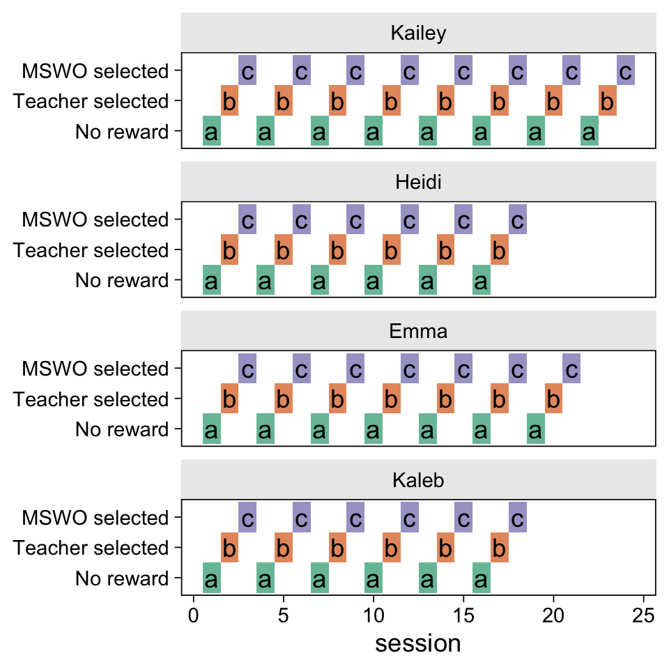

This is admittedly an odd plot. The main thing to notice is the shaded
blocks follow the same pattern within and between children. Thus, the
order of the alternating treatments were fixed within and between
participants. It always starts with A (No reward), which is followed by
B (Teacher selected), which is followed by C (MSWO selected).

Now let’s visualize the data more like Resetar and Noell did in their
Figure 1 (p. 450).

``` r
resetar2008 %>% 
  ggplot(aes(x = session, y = count, 
             group = condition, shape = condition, color = condition)) +
  geom_point(size = 2) +
  geom_path(linewidth = 1/4) +
  scale_shape_manual(NULL, values = c(18, 15, 17)) +
  scale_color_brewer(NULL, palette = "Dark2") +
  scale_x_continuous(breaks = 0:12 * 2, limits = c(0, 24)) +
  scale_y_continuous(limits = c(0, NA)) +
  facet_wrap(~ id, ncol = 1)
```

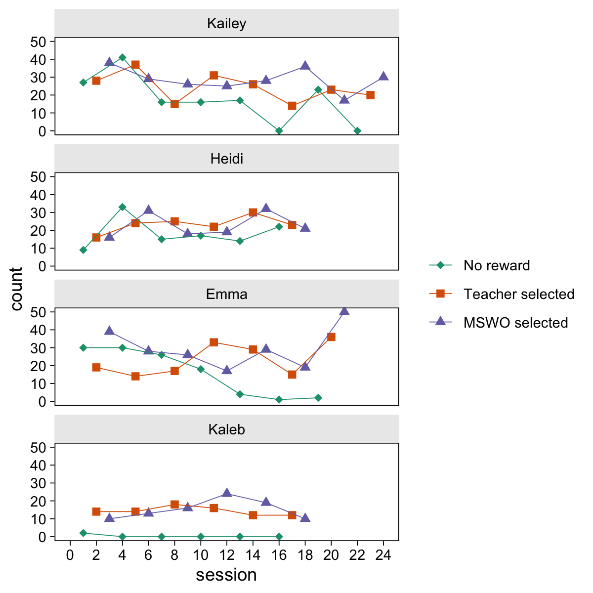

From the paper, we read: “The dependent measure was the number of digits
correctly answered in 2 min during each grade-level math probe”
(p. 448). Thus, the way these data are presented to us, they are
unbounded counts.

### Dummies.

Here we make dummy variables for the different levels of `phase`, which
will help clarify the statistical formulas to come.

``` r
resetar2008 <- resetar2008 %>% 
  mutate(a = ifelse(phase == "a", 1, 0),
         b = ifelse(phase == "b", 1, 0),
         c = ifelse(phase == "c", 1, 0))

# what did we do?
resetar2008 %>% 
  distinct(phase, a, b, c) %>% 
  arrange(phase)
```

    ## # A tibble: 3 × 4
    ##   phase     a     b     c
    ##   <chr> <dbl> <dbl> <dbl>
    ## 1 a         1     0     0
    ## 2 b         0     1     0
    ## 3 c         0     0     1

### Time.

To help with the HMC algorithm, we’re going to want to rescale the time
variable so it starts at zero and ends near 1. The `session0` variable
satisfies the first criteria. To get a sense of how to scale the
variable further, we’ll want to get a sense of the last values, by each
child.

``` r
resetar2008 %>% 
  group_by(sn) %>% 
  summarise(max_session0 = max(session0))
```

    ## # A tibble: 4 × 2
    ##      sn max_session0
    ##   <int>        <dbl>
    ## 1     1           23
    ## 2     2           17
    ## 3     3           20
    ## 4     4           17

Since the last common `session0` value for all four children was 17, we
might scale the variable by dividing by 17 and name the results as
`session01`.

``` r
resetar2008 <- resetar2008 %>% 
  mutate(session01 = session0 / 17)
```

To help get a sense, here are the number of cases in the data for which
`session01 >= 1`, along with the corresponding `session` and `session0`
values.

``` r
resetar2008 %>% 
  count(session, session0, session01) %>% 
  filter(session01 >= 1)
```

    ## # A tibble: 7 × 4
    ##   session session0 session01     n
    ##     <dbl>    <dbl>     <dbl> <int>
    ## 1      18       17      1        4
    ## 2      19       18      1.06     2
    ## 3      20       19      1.12     2
    ## 4      21       20      1.18     2
    ## 5      22       21      1.24     1
    ## 6      23       22      1.29     1
    ## 7      24       23      1.35     1

## Models

In this file, we’ll fit one model with the Poisson likelihood, and we’ll
then relax the equidispersion assumption with a negative-binomial
version of the same.

### Poisson.

If we say our outcome variable `count` varies across $i$ children and
$j$ measurement occasions, we analyze the data with the Poisson
multilevel model following the equation

$$
\begin{align*}
\text{count}_{ij} & \sim \operatorname{Poisson}(\lambda_{ij}) \\
\log(\lambda_{ij}) & = b_{0i} + b_{1i} \text{session01}_{ij} + b_{2i} \text{B}_{ij} + b_{3i} \text{session01}_{ij}\text{B}_{ij} + b_{4i} \text{C}_{ij} + b_{5i} \text{session01}_{ij}\text{C}_{ij} \\
b_{0i} & = \beta_0 + u_{0i} \\
b_{1i} & = \beta_1 + u_{1i} \\
b_{2i} & = \beta_2 + u_{2i} \\
b_{3i} & = \beta_3 + u_{3i} \\
b_{4i} & = \beta_4 + u_{4i} \\
b_{5i} & = \beta_5 + u_{5i} \\
\begin{bmatrix} u_{0i} \\ \vdots \\ u_{5i} \end{bmatrix} & = \operatorname{Normal}( \mathbf 0, \mathbf S \mathbf R \mathbf S ),
\end{align*}
$$

where the time variable `session01` and the two dummy variables `b` and
`c` are all time-varying covariates, as indicated by their $i$ and $j$
subscripts. The reference category is `a`. The six parameters $b_{0i}$
through $b_{5i}$ all vary across children, as indicated by their $i$
subscripts. Each of those $b$ parameters is decomposed in to a
population mean $\beta_0, \dots , \beta_5$ and the child-specific
deviation around that mean $u_{0i}, \dots , u_{5i}$. Those six $u_i$
deviation parameters are modeled as multivariate normal with a mean
vector of 0’s and a $6 \times 6$ variance/covariance matrix. As per
**brms** convention, we decompose the variance/covariance matrix into a
diagonal matrix for the standard deviations $\mathbf S$ and a
correlation matrix $\mathbf R$.

As to priors, we might want to choose a broad prior for the A-phase
intercept $\beta_0$, with a mean centered near low behavioral counts.
Given the children in this study were selected for their poor math
performance, we might center the prior on 10 digits. Though we typically
use the Normal distribution for $\beta$ parameters, keep in mind Poisson
models typically use the log link. Thus a Normal prior on the log space
will equate to a lognormal prior on the count space. If we were to use
$\operatorname{Normal}(\log 10, 1)$ on the log scale, here’s what the
corresponding lognormal distribution would be on the count scale.

``` r
# log(10) is about 2.302585
prior(lognormal(2.302585, 1)) %>% 
  parse_dist() %>%

  ggplot(aes(y = 0, dist = .dist, args = .args)) +
  stat_halfeye(.width = c(.9, .99)) +
  scale_x_continuous("count", breaks = c(0, 10, 52, 131)) +
  scale_y_discrete(NULL, breaks = NULL, expand = expansion(add = 0.06)) +
  labs(title = "That sweet lognormal(log 10, 1)") +
  coord_cartesian(xlim = c(0, 131))
```

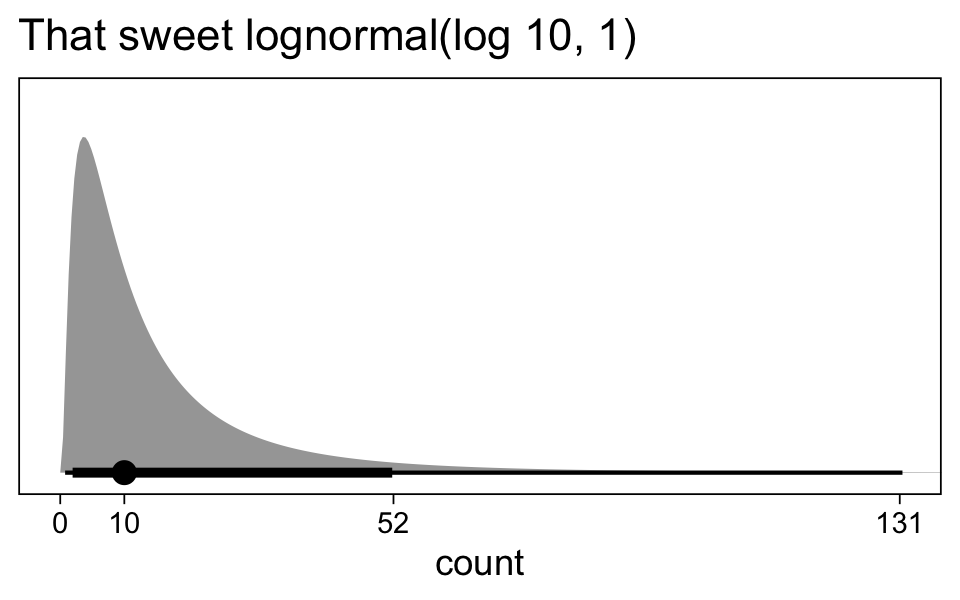

The median is marked off by the dot and the 99% and 90% intervals are
depicted by the thinner an thicker horizontal lines at the base. Such a
prior expects baseline counts to be low, but allows for a pleasant
surprise if the children end up performing well. Here’s how one might
compute the exact inner 90% and 99% ranges.

``` r
# what is the 99% interval for this lognormal?
qlnorm(c(0.005, 0.995), meanlog = log(10), sdlog = 1)
```

    ## [1]   0.7609069 131.4221152

``` r
# what is the 90% interval for this lognormal?
qlnorm(c(0.05, 0.95), meanlog = log(10), sdlog = 1)
```

    ## [1]  1.930408 51.802516

For the remaining $\beta$ parameters, we might rely on the good old
weakly-regularizing $\operatorname{Normal}(0, 1)$. A researcher who was
confident there would be only small linear trends in performance over
time might use something like the $\operatorname{Normal}(0, 0.5)$ or
even the $\operatorname{Normal}(0, 0.1)$ prior for $\beta_1$, $\beta_3$,
and $\beta_5$.

When unsure about how to set the priors for your level-2 $\sigma$
parameters, McElreath’s $\operatorname{Exponential}(1)$ prior is a good
place to start when modeling count data. We have used this approach
before and it will work reasonably well here. As a refresher, here’s
what that prior looks like.

``` r
prior(exponential(1)) %>% 
  parse_dist() %>% 
  
  ggplot(aes(y = 0, dist = .dist, args = .args)) +
  stat_halfeye(point_interval = mean_qi, .width = c(.9, .99)) +
  scale_y_continuous(NULL, breaks = NULL) +
  labs(title = "Behold exponential(1)!",
       x = "Prior space") +
  coord_cartesian(xlim = c(0, 5.2))
```

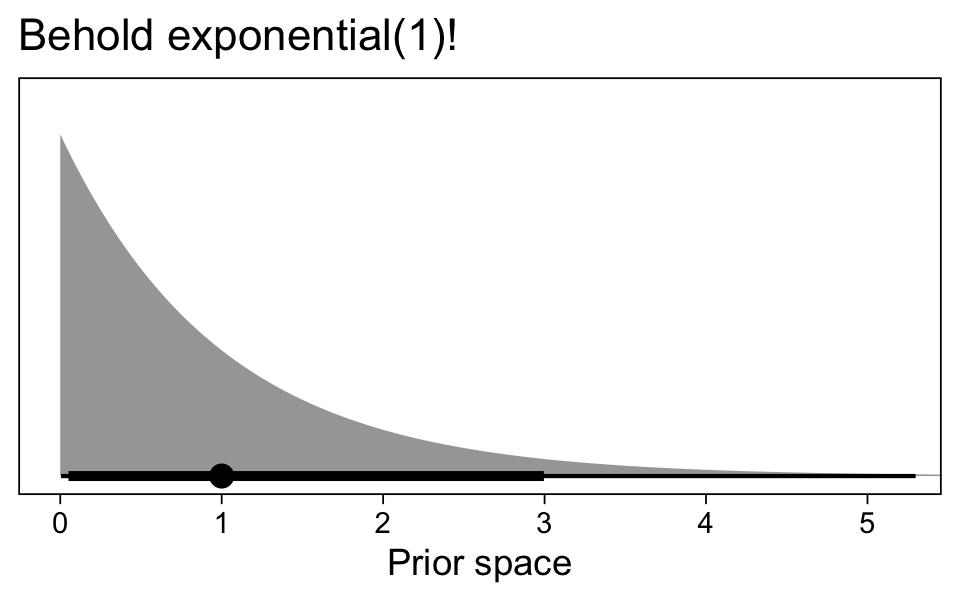

With $\operatorname{Exponential}(1)$, the mean and standard deviation
are both 1. The inner 99% interval is about 0.005 to 5.3 and the inner
90% interval is about 0.05 to 3.0.

``` r
# what is the 99% interval for this exponential?
qexp(p = c(.005, .995), rate = 1)
```

    ## [1] 0.005012542 5.298317367

``` r
# what is the 90% interval for this exponential?
qexp(p = c(.050, .950), rate = 1)
```

    ## [1] 0.05129329 2.99573227

However, with such a modest $N = 4$ participants, we might want a prior
that nudges the posterior a little away from the zero left boundary. The
gamma distribution might be a good alternative, and it turns the
exponential distribution can be seen as a special case of the gamma
distribution. If we say some variable $y$ is distributed
$\operatorname{Gamma}(1, \lambda)$ (in the shape–rate parametrization),
then we can also say $Y$ follows the exponential distribution with a
rate parameter $\lambda$. For example, we can use this to see
$\operatorname{Gamma}(1, 1)$ is the same as
$\operatorname{Exponential}(1)$.

``` r
c(prior(exponential(1)),
  prior(gamma(1, 1))) %>% 
  parse_dist() %>% 
  
  ggplot(aes(y = prior, dist = .dist, args = .args)) +
  stat_halfeye(point_interval = mean_qi, .width = c(.9, .99)) +
  scale_y_discrete(NULL, expand = expansion(add = 0.1)) +
  labs(title = "Sometimes gamma looks exponential.",
       x = "Prior space") +
  coord_cartesian(xlim = c(0, 5.2))
```

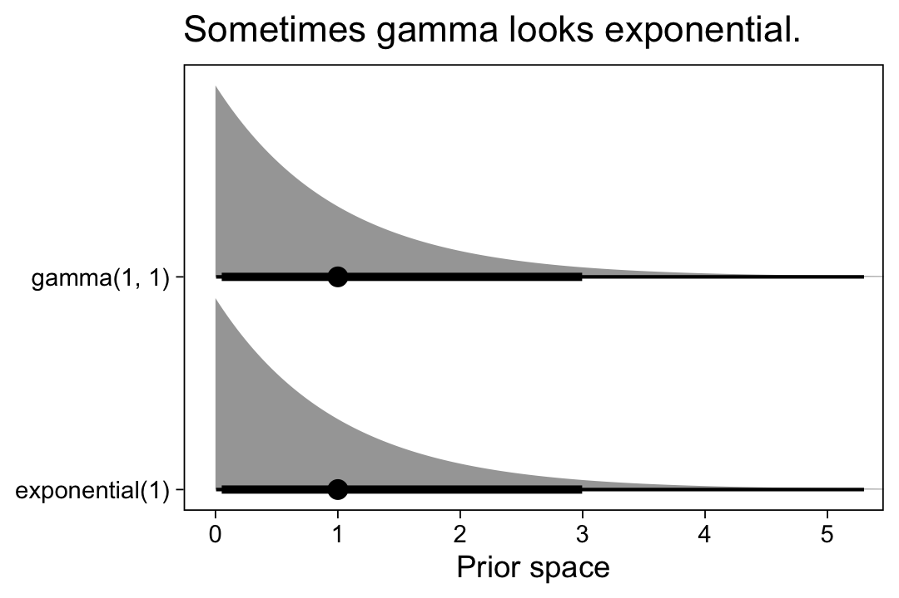

What if we wanted a gamma distribution with the same mean at 1, but with
a smaller standard deviation? Since the gamma shape and rate parameters
$(\alpha$ and $\beta)$ aren’t the most intuitive, we can use a
convenience function from Kruschke’s
[text](https://sites.google.com/site/doingbayesiandataanalysis/?pli=1)
to compute the $\alpha$ and $\beta$ parameters for a given mean and
standard deviation. Here we’ll call that function
`gamma_a_b_from_mean_sd()`.

``` r
gamma_a_b_from_mean_sd <- function(mean, sd) {
  if (mean <= 0) stop("mean must be > 0")
  if (sd   <= 0) stop("sd must be > 0")
  shape <- mean^2 / sd^2
  rate  <- mean / sd^2
  
  return(tibble(shape = shape, rate = rate))
}
```

Now use `gamma_a_b_from_mean_sd()` to make several gamma distributions,
all of which have a mean of 1 and vary by their standard deviations.

``` r
tibble(sd = 1:6 / 5) %>% 
  mutate(gamma = map(sd, gamma_a_b_from_mean_sd, mean = 1)) %>% 
  unnest(gamma) %>% 
  expand(nesting(sd, shape, rate),
         x = seq(from = 0.01, to = 5.5, by = 0.01)) %>% 
  mutate(d = dgamma(x = x, shape = shape, rate = rate)) %>% 
  
  ggplot(aes(x = x, y = d)) +
  geom_vline(xintercept = c(1), color = "white") +
  geom_area() +
  scale_y_continuous(NULL, breaks = NULL) +
  labs(title = "All these gamma's have a mean of 1, but vary by their SD's.",
       x = "domain") +
  coord_cartesian(xlim = c(0, 5.2),
                  ylim = c(0, 2)) +
  facet_wrap(~ sd, labeller = label_both)
```

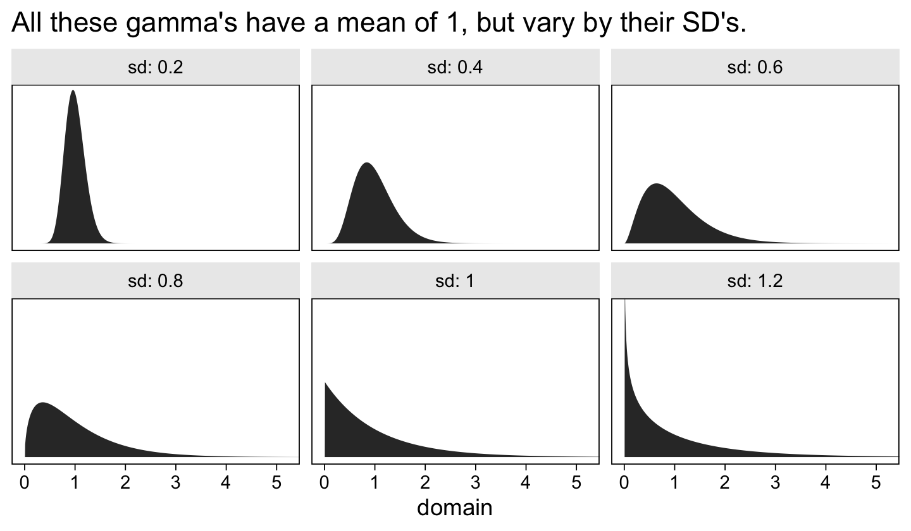

For the sake of practice, let’s use a gamma prior with a mean of 1 and
standard deviation of 0.8, which will nudge the $\sigma$ posteriors away
from the zero boundary. Here we use the `gamma_a_b_from_mean_sd()`
function to compute the $\alpha$ and $\beta$ parameters for that prior.

``` r
gamma_a_b_from_mean_sd(mean = 1, sd = 0.8)
```

    ## # A tibble: 1 × 2
    ##   shape  rate
    ##   <dbl> <dbl>
    ## 1  1.56  1.56

For simplicity, we will use $\operatorname{Gamma}(1.5625, 1.5625)$ for
all $\sigma$ parameters. As to the correlation matrix $(\mathbf R)$,
even the $\operatorname{LKJ}(1)$ will be moderately regularizing for a
$6 \times 6$ matrix. Thus, we might express the full prior distribution
as

$$
\begin{align*}
\beta_0 & \sim \operatorname{Normal}(\log 10, 1) \\
\beta_1, \dots, \beta_5  & \sim \operatorname{Normal}(0, 1) \\
\sigma_0, \dots, \sigma_5 & \sim \operatorname{Gamma}(1.5625, 1.5625) \\
\mathbf R & \sim \operatorname{LKJ}(1).
\end{align*}
$$

Here’s how to fit the model with `brm()`.

``` r
fit1 <- brm(
  data = resetar2008,
  family = poisson,
  count ~ 0 + Intercept + session01 + phase + session01:phase + ((1 + session01) * phase | id),
  prior = c(prior(normal(log(10), 1), class = b, coef = Intercept),
            prior(normal(0, 1), class = b),
            prior(gamma(1.5625, 1.5625), class = sd),
            prior(lkj(1), class = cor)),
  cores = 4, seed = 1,
  control = list(adapt_delta = .95),
  file = "fits/fit1.resetar2008"
  )
```

Check the parameter summary.

``` r
summary(fit1)
```

    ##  Family: poisson 
    ##   Links: mu = log 
    ## Formula: count ~ 0 + Intercept + session01 + phase + session01:phase + ((1 + session01) * phase | id) 
    ##    Data: resetar2008 (Number of observations: 81) 
    ##   Draws: 4 chains, each with iter = 2000; warmup = 1000; thin = 1;
    ##          total post-warmup draws = 4000
    ## 
    ## Group-Level Effects: 
    ## ~id (Number of levels: 4) 
    ##                                        Estimate Est.Error l-95% CI u-95% CI Rhat Bulk_ESS Tail_ESS
    ## sd(Intercept)                              1.32      0.47     0.69     2.48 1.00     2227     2877
    ## sd(session01)                              1.06      0.47     0.41     2.24 1.00     1985     2216
    ## sd(phaseb)                                 1.17      0.43     0.58     2.26 1.00     2755     3154
    ## sd(phasec)                                 1.01      0.41     0.43     2.05 1.00     3060     2900
    ## sd(session01:phaseb)                       1.11      0.50     0.41     2.34 1.00     2254     2247
    ## sd(session01:phasec)                       0.97      0.48     0.27     2.15 1.00     2009     2014
    ## cor(Intercept,session01)                  -0.01      0.31    -0.59     0.57 1.00     3213     3115
    ## cor(Intercept,phaseb)                     -0.41      0.30    -0.88     0.25 1.00     3295     2882
    ## cor(session01,phaseb)                     -0.05      0.31    -0.62     0.53 1.00     2789     2907
    ## cor(Intercept,phasec)                     -0.41      0.30    -0.88     0.26 1.00     3700     2653
    ## cor(session01,phasec)                     -0.10      0.32    -0.68     0.52 1.00     2708     3304
    ## cor(phaseb,phasec)                         0.42      0.31    -0.27     0.90 1.00     3195     2788
    ## cor(Intercept,session01:phaseb)           -0.01      0.31    -0.61     0.56 1.00     4040     2944
    ## cor(session01,session01:phaseb)           -0.29      0.32    -0.82     0.38 1.00     3205     3066
    ## cor(phaseb,session01:phaseb)              -0.08      0.30    -0.65     0.52 1.00     3510     3298
    ## cor(phasec,session01:phaseb)               0.01      0.32    -0.60     0.62 1.00     3418     3221
    ## cor(Intercept,session01:phasec)           -0.10      0.31    -0.67     0.52 1.00     4108     3358
    ## cor(session01,session01:phasec)           -0.35      0.33    -0.87     0.35 1.00     3627     3141
    ## cor(phaseb,session01:phasec)               0.08      0.32    -0.56     0.68 1.00     4459     3128
    ## cor(phasec,session01:phasec)               0.11      0.32    -0.52     0.69 1.00     4066     3621
    ## cor(session01:phaseb,session01:phasec)     0.34      0.32    -0.36     0.87 1.00     2963     3106
    ## 
    ## Population-Level Effects: 
    ##                  Estimate Est.Error l-95% CI u-95% CI Rhat Bulk_ESS Tail_ESS
    ## Intercept            2.65      0.53     1.56     3.66 1.00     1585     2370
    ## session01           -0.90      0.50    -1.78     0.18 1.00     2143     2564
    ## phaseb               0.25      0.49    -0.71     1.23 1.00     2106     2370
    ## phasec               0.33      0.44    -0.54     1.25 1.00     2422     2643
    ## session01:phaseb     0.96      0.52    -0.21     1.85 1.00     2289     2313
    ## session01:phasec     1.02      0.48    -0.02     1.88 1.00     2398     2614
    ## 
    ## Draws were sampled using sampling(NUTS). For each parameter, Bulk_ESS
    ## and Tail_ESS are effective sample size measures, and Rhat is the potential
    ## scale reduction factor on split chains (at convergence, Rhat = 1).

### Negative binomial.

Poisson models are great for unbounded count data, but they carry the
strong eqidispersion assumption, which constrains the conditional mean
and the variance to equality. If we suspect our data have extra
variability beyond those expected by the mean value, we might model them
as negative binomial, which adds a $\phi$ parameter. A conventional
approach is to simply estimate $\phi$ without attaching a conditional
model. Here we’ll go beyond convention and allow $\phi$ to vary across
the $i$ children with the model

$$
\begin{align*}
\text{count}_{ij} & \sim \operatorname{NegativeBinomial}(\mu_{ij}, \phi_i) \\
\log(\mu_{ij}) & = b_{0i} + b_{1i} \text{session01}_{ij} + b_{2i} \text{B}_{ij} + b_{3i} \text{session01}_{ij}\text{B}_{ij} + b_{4i} \text{C}_{ij} + b_{5i} \text{session01}_{ij}\text{C}_{ij} \\
\log(\phi_i) & = e_{0i} \\
b_{0i} & = \beta_0 + u_{0i} \\
b_{1i} & = \beta_1 + u_{1i} \\
b_{2i} & = \beta_2 + u_{2i} \\
b_{3i} & = \beta_3 + u_{3i} \\
b_{4i} & = \beta_4 + u_{4i} \\
b_{5i} & = \beta_5 + u_{5i} \\
e_{0i} & = \eta_0 + v_{0i} \\
\begin{bmatrix} u_{0i} \\ \vdots \\ v_{0i} \end{bmatrix} & = \operatorname{Normal}( \mathbf 0, \mathbf S \mathbf R \mathbf S ),
\end{align*}
$$

where we use the log link to ensure the values for $\phi_i$ stay above
zero. The new $e_{0i}$ parameter is the log dispersion, which varies
across the $j$ children. We decompose $e_{0i}$ into a population mean
$\eta_0$ and child-specific deviation from the mean $v_{0i}$. Along with
$b_{0i}, \dots, b_{5i}$, we model $v_{0i}$ as multivariate normal with a
mean vector of zeros, a $7 \times 7$ a diagonal matrix for the standard
deviations $\mathbf S$, and a $7 \times 7$ correlation matrix
$\mathbf R$. Otherwise, the negative-binomial version of the model is
the essentially the same as the Poisson version, above. The only other
noteworthy change is we now refer to the mean as $\mu$ instead of
$\lambda$.

The priors remain largely the same as before. The main issue is how to
contend with the new parameters related to $\phi$. As is typical for
parameters on the log scale, we will use a normal prior for $\eta_0$. If
we consider $\operatorname{Normal}(\log(20), 0.5)$, that would
correspond to a log normal distribution on the exponentiated $\phi$
space which looks like so:

``` r
# log(20) is about 2.995732
prior(lognormal(2.995732, 0.5)) %>% 
  parse_dist() %>%

  ggplot(aes(y = 0, dist = .dist, args = .args)) +
  stat_halfeye(.width = c(.9, .99), p_limits = c(0, .9996)) +
  scale_y_discrete(NULL, breaks = NULL, expand = expansion(add = 0.06)) +
  labs(title = "Exponentiated normal(log 20, 0.5) is the same\nas lognormal(log 20, 0.5).",
       x = expression(italic(p)(exp~eta[0]))) +
  coord_cartesian(xlim = c(0, 100))
```

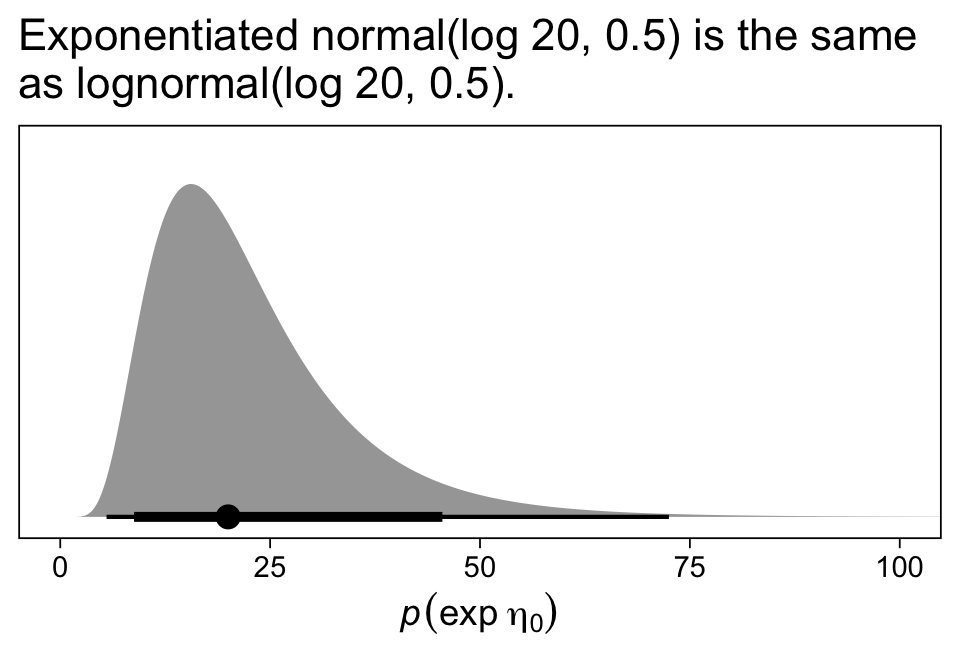

The $\operatorname{Normal}(\log 20, 0.5)$ prior puts most of the prior
mass in the double-digit range. It has a 99% range of about 5.5 to 72.5
and a 90% range of about 8.8 to 45.5.

``` r
# what is the 99% interval for this lognormal?
qlnorm(c(0.005, 0.995), meanlog = log(20), sdlog = 0.5)
```

    ## [1]  5.516908 72.504376

``` r
# what is the 90% interval for this lognormal?
qlnorm(c(0.050, 0.950), meanlog = log(20), sdlog = 0.5)
```

    ## [1]  8.787282 45.520332

Such a prior will all for small to moderate-sized $\phi$
values–corresponding to a lot more variability than expected by the
Poison–, but will also allow for moderately-large values for
$\phi$–corresponding to variability very similar to those expected by
the Poisson. For simplicity, we will continue with the
$\operatorname{Gamma}(1.5625, 1.5625)$ for our new deviation parameter
$v_{0i}$, which will allow for small to moderate sized differences in
$e_{0i}$ among our four children.

Before we fit the model, we should acknowledge that one could expand
this model to include more predictors for $\log(\phi_{ij})$. A full
version of the $\log(\phi_{ij})$ model might mirror the model for
$\log(\mu_{ij})$.

Here’s how to fit the model with `brm()`.

``` r
fit2 <- brm(
  data = resetar2008,
  family = negbinomial,
  bf(count ~ 0 + Intercept + session01 + phase + session01:phase + ((1 + session01) * phase |i| id),
     shape ~ 1 + (1 |i| id)),
  prior = c(prior(normal(0, 1), class = b),
            prior(normal(log(10), 1), class = b, coef = Intercept),
            prior(normal(log(20), 0.5), class = Intercept, dpar = shape),
            # gamma_a_b_from_mean_sd(mean = 1, sd = 0.8)
            prior(gamma(1.5625, 1.5625), class = sd),
            prior(gamma(1.5625, 1.5625), class = sd, dpar = shape),
            prior(lkj(1), class = cor)),
  cores = 4, seed = 1,
  control = list(adapt_delta = .9),
  file = "fits/fit2.resetar2008"
  )
```

Note how the `|i|` syntax in the model formula allows the new $v_{0i}$
deviations to covary with the $u_{i}$ deviations. Without that syntax,
they would have been modeled as orthogonal.

Check the parameter summary.

``` r
summary(fit2)
```

    ##  Family: negbinomial 
    ##   Links: mu = log; shape = log 
    ## Formula: count ~ 0 + Intercept + session01 + phase + session01:phase + ((1 + session01) * phase | i | id) 
    ##          shape ~ 1 + (1 | i | id)
    ##    Data: resetar2008 (Number of observations: 81) 
    ##   Draws: 4 chains, each with iter = 2000; warmup = 1000; thin = 1;
    ##          total post-warmup draws = 4000
    ## 
    ## Group-Level Effects: 
    ## ~id (Number of levels: 4) 
    ##                                        Estimate Est.Error l-95% CI u-95% CI Rhat Bulk_ESS Tail_ESS
    ## sd(Intercept)                              1.27      0.44     0.65     2.36 1.00     2105     2811
    ## sd(session01)                              0.68      0.44     0.07     1.77 1.00     1826     1725
    ## sd(phaseb)                                 1.13      0.45     0.52     2.30 1.00     2040     2852
    ## sd(phasec)                                 1.05      0.46     0.41     2.19 1.00     2472     2590
    ## sd(session01:phaseb)                       0.62      0.46     0.06     1.80 1.00     1916     2471
    ## sd(session01:phasec)                       0.61      0.46     0.05     1.77 1.00     2211     2486
    ## sd(shape_Intercept)                        0.84      0.56     0.10     2.23 1.00     2558     2314
    ## cor(Intercept,session01)                   0.01      0.32    -0.59     0.62 1.00     3763     3315
    ## cor(Intercept,phaseb)                     -0.37      0.29    -0.86     0.26 1.00     3104     2564
    ## cor(session01,phaseb)                     -0.06      0.32    -0.66     0.58 1.00     3590     3230
    ## cor(Intercept,phasec)                     -0.36      0.29    -0.83     0.26 1.00     3537     3026
    ## cor(session01,phasec)                     -0.09      0.34    -0.69     0.59 1.00     3655     2914
    ## cor(phaseb,phasec)                         0.33      0.31    -0.33     0.83 1.00     3640     3250
    ## cor(Intercept,session01:phaseb)           -0.01      0.33    -0.63     0.62 1.00     5165     3080
    ## cor(session01,session01:phaseb)           -0.12      0.35    -0.73     0.58 1.00     4205     3109
    ## cor(phaseb,session01:phaseb)              -0.03      0.34    -0.66     0.63 1.00     4327     3308
    ## cor(phasec,session01:phaseb)               0.04      0.34    -0.61     0.69 1.00     4020     3550
    ## cor(Intercept,session01:phasec)           -0.10      0.34    -0.71     0.56 1.00     5476     3145
    ## cor(session01,session01:phasec)           -0.15      0.36    -0.76     0.58 1.00     4615     2971
    ## cor(phaseb,session01:phasec)               0.11      0.34    -0.55     0.73 1.00     3711     3103
    ## cor(phasec,session01:phasec)               0.09      0.34    -0.59     0.70 1.00     3625     3375
    ## cor(session01:phaseb,session01:phasec)     0.10      0.36    -0.61     0.74 1.00     2953     2948
    ## cor(Intercept,shape_Intercept)            -0.20      0.33    -0.77     0.47 1.00     4593     3052
    ## cor(session01,shape_Intercept)             0.07      0.34    -0.58     0.68 1.00     4004     3354
    ## cor(phaseb,shape_Intercept)                0.15      0.33    -0.54     0.74 1.00     4353     3734
    ## cor(phasec,shape_Intercept)                0.11      0.34    -0.56     0.73 1.00     3658     3258
    ## cor(session01:phaseb,shape_Intercept)     -0.04      0.35    -0.70     0.63 1.00     2917     3316
    ## cor(session01:phasec,shape_Intercept)      0.01      0.35    -0.65     0.67 1.00     3062     3398
    ## 
    ## Population-Level Effects: 
    ##                  Estimate Est.Error l-95% CI u-95% CI Rhat Bulk_ESS Tail_ESS
    ## shape_Intercept      2.58      0.41     1.84     3.47 1.00     3248     2666
    ## Intercept            2.54      0.53     1.44     3.57 1.00     1898     2412
    ## session01           -0.97      0.42    -1.72    -0.05 1.00     2142     2433
    ## phaseb               0.35      0.51    -0.71     1.33 1.00     2191     2428
    ## phasec               0.41      0.49    -0.60     1.37 1.00     2263     2380
    ## session01:phaseb     1.01      0.46     0.05     1.87 1.00     3038     2344
    ## session01:phasec     1.06      0.45     0.08     1.88 1.00     2925     2415
    ## 
    ## Draws were sampled using sampling(NUTS). For each parameter, Bulk_ESS
    ## and Tail_ESS are effective sample size measures, and Rhat is the potential
    ## scale reduction factor on split chains (at convergence, Rhat = 1).

The new `shape_Intercept` line in the `Population-Level Effects` section
of the output is our summary for $\eta_0$. We might exponentiate to put
it back into the natural $\phi$ scale.

``` r
fixef(fit2)["shape_Intercept", -2] %>% exp()
```

    ##  Estimate      Q2.5     Q97.5 
    ## 13.176556  6.293744 32.022202

The width of the 95% intervals suggests a lot of uncertainty in the
population mean, which shouldn’t be terribly surprising with an $N = 4$
data set. But the posterior is centered around 13, which is a fairly low
value, and indicates there is indeed more variability in the data than
expected from a simple Poisson process. We can use `coef()` to pull the
$e_{0i}$ summaries.

``` r
coef(fit2)$id[, -2, "shape_Intercept"] %>% exp()
```

    ##         Estimate     Q2.5     Q97.5
    ## Kailey  7.011560 2.737584  16.71578
    ## Heidi  11.733501 4.860812  35.36861
    ## Emma    7.213156 2.888322  17.18722
    ## Kaleb  23.954047 5.281525 405.91926

Based on the summaries, Kailey’s and Emma’s data were the most
overdispersed. The large and uncertain posterior for Kaleb suggests his
data were close to a Poisson process.

## Plots

Most of our model interpretation will come by way of a series of plots.

### Population-level plots.

One question one might want to ask of the models is: *What do the
population-level trajectories look like for the three conditions?* To
answer, we first need a tibble with a sequence of `session01` values
across each level of `phase`. To help with the plot to come, we’ll add
in a few other variables.

``` r
nd <- resetar2008 %>% 
  distinct(phase, condition) %>% 
  expand(nesting(phase, condition),
         session01 = seq(from = 0, to = 1, length.out = 100)) %>% 
  mutate(session0 = session01 * 17) %>% 
  mutate(session = session0 + 1)

# what is this?
glimpse(nd)
```

    ## Rows: 300
    ## Columns: 5
    ## $ phase     <chr> "a", "a", "a", "a", "a", "a", "a", "a", "a", "a", "a", "a", "a", "a", "a", "a", "a", "a", …
    ## $ condition <fct> No reward, No reward, No reward, No reward, No reward, No reward, No reward, No reward, No…
    ## $ session01 <dbl> 0.00000000, 0.01010101, 0.02020202, 0.03030303, 0.04040404, 0.05050505, 0.06060606, 0.0707…
    ## $ session0  <dbl> 0.0000000, 0.1717172, 0.3434343, 0.5151515, 0.6868687, 0.8585859, 1.0303030, 1.2020202, 1.…
    ## $ session   <dbl> 1.000000, 1.171717, 1.343434, 1.515152, 1.686869, 1.858586, 2.030303, 2.202020, 2.373737, …

Now we can compute the `fitted()` draws from the two models. Note how we
set `re_formula = NA` to return only population-level results.

``` r
f1 <- fitted(fit1, newdata = nd, re_formula = NA) %>% 
  data.frame() %>% 
  bind_cols(nd)

f2 <- fitted(fit2, newdata = nd, re_formula = NA) %>% 
  data.frame() %>% 
  bind_cols(nd)
```

Now we wrangle and plot.

``` r
bind_rows(f1, f2) %>% 
  mutate(likelihood = rep(c("Poisson", "Negative binomial"), each = n() / 2) %>% 
           factor(., levels = c("Poisson", "Negative binomial"))) %>% 
  
  ggplot(aes(x = session)) +
  geom_ribbon(aes(ymin = Q2.5, ymax = Q97.5, fill = condition),
              alpha = 1/3) +
  geom_line(aes(y = Estimate, color = condition)) +
  scale_shape_manual(NULL, values = c(18, 15, 17)) +
  scale_fill_brewer(NULL, palette = "Dark2") +
  scale_color_brewer(NULL, palette = "Dark2") +
  scale_x_continuous(breaks = c(1, 1:3 * 6)) +
  labs(title = "Population-level trajectories, by behavioral contingency and likelihood",
       y = "count") +
  facet_wrap( ~ likelihood)
```

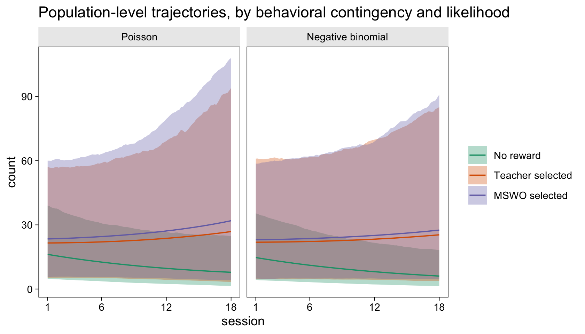

Across both likelihoods, the population-level trajectories appear
uncertain. One my be tempted to conclude that because they are all
overlapping, there are no meaningful differences among the conditions.
However, than kind of comparison can be misleading because it ignores
the correlation structure among the parameters. To formally compare the
population trajectories, we need the corresponding contrast
distributions. Though we can do this with a `fitted()`-based workflow,
the handy `add_epred_draws()` function will save us a lot of code. First
we compute the fitted values with `add_epred_draws()` for each model,
and save the results as `e1` and `e2`.

``` r
e1 <- nd %>% 
  add_epred_draws(fit1, re_formula = NA)

e2 <- nd %>% 
  add_epred_draws(fit2, re_formula = NA)
```

Now we combine the two objects, wrangle, and plot the contrast
distributions.

``` r
contrast <- c("Teacher selected - No reward", "MSWO selected - No reward", "MSWO selected - Teacher selected")

bind_rows(e1, e2) %>% 
  ungroup() %>% 
  select(condition, session, .draw, .epred) %>% 
  mutate(likelihood = rep(c("Poisson", "Negative binomial"), each = n() / 2) %>% 
           factor(., levels = c("Poisson", "Negative binomial"))) %>% 
  compare_levels(.epred, by = condition, draw_indices = c(".draw", "session", "likelihood")) %>% 
  mutate(condition = factor(condition, levels = contrast)) %>% 
  group_by(likelihood, session, condition) %>% 
  mean_qi(.epred) %>% 
  
  ggplot(aes(x = session)) +
  geom_ribbon(aes(ymin = .lower, ymax = .upper),
              alpha = 1/3) +
  geom_line(aes(y = .epred)) +
  geom_hline(yintercept = 0, color = "grey92", linetype = 2) +
  scale_color_brewer(NULL, palette = "Dark2") +
  scale_x_continuous(breaks = c(1, 1:3 * 6)) +
  coord_cartesian(ylim = c(-80, 80)) +
  labs(title = "Population-level trajectory contrasts, by likelihood",
       y = "unstandardized mean difference") +
  facet_grid(condition ~ likelihood)
```

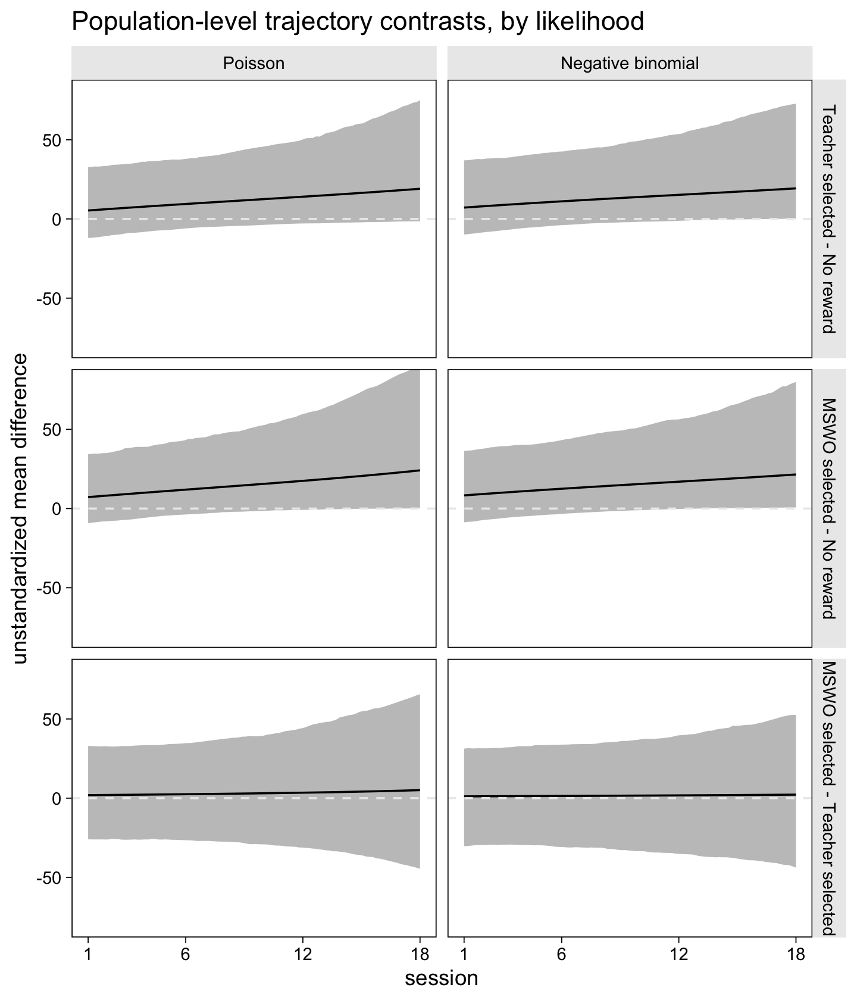

The contrast distributions are still rather uncertain, but this plot
provides stronger evidence for meaningful differences between the two
contingent conditions and the no-reward condition, particularly towards
the latter sessions.

### Child-level plots.

Before we compute the child-level plots, we’ll first need to update the
`nd` data grid. Then we can pump those values into `fitted()`.

``` r
nd <- resetar2008 %>% 
  group_by(id) %>% 
  summarise(min = min(session01),
            max = max(session01)) %>% 
  mutate(session01 = map2(min, max, seq, length.out = 100)) %>% 
  unnest(session01) %>% 
  expand(nesting(id, session01),
         phase = letters[1:3]) %>% 
  mutate(session0 = session01 * 17) %>% 
  mutate(session = session0 + 1) %>% 
  left_join(resetar2008 %>% distinct(phase, condition),
            by = "phase") 

f1 <- fitted(fit1, newdata = nd) %>% 
  data.frame() %>% 
  bind_cols(nd)

f2 <- fitted(fit2, newdata = nd) %>% 
  data.frame() %>% 
  bind_cols(nd)
```

Now we plot the child-level trajectories.

``` r
bind_rows(f1, f2) %>% 
  mutate(likelihood = rep(c("Poisson", "Negative-binomial"), each = n() / 2) %>% 
           factor(., levels = c("Poisson", "Negative-binomial"))) %>% 
  
  ggplot(aes(x = session)) +
  geom_ribbon(aes(ymin = Q2.5, ymax = Q97.5, fill = condition),
              alpha = 1/3) +
  geom_line(aes(y = Estimate, color = condition)) +
  geom_point(data = resetar2008,
             aes(y = count, color = condition, shape = condition)) +
  scale_shape_manual(NULL, values = c(18, 15, 17)) +
  scale_fill_brewer(NULL, palette = "Dark2") +
  scale_color_brewer(NULL, palette = "Dark2") +
  scale_x_continuous(breaks = c(1, 1:3 * 8)) +
  labs(title = "Child-level trajectories, by behavioral contingency and likelihood",
       subtitle = "The original data are in the different-shaped dots.",
       y = "count") +
  facet_grid(id ~ likelihood)
```

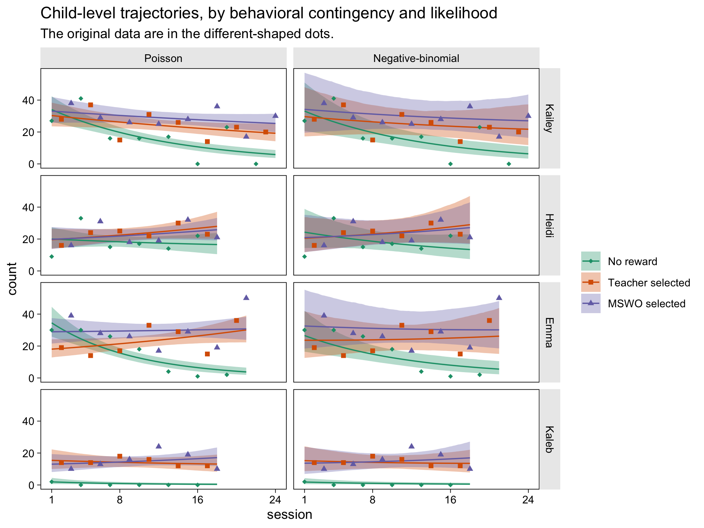

Now the contrast distributions. For the sake of space, we’ll just focus
on the NB contrasts.

``` r
e2 <- nd %>% 
  add_epred_draws(fit2)
```

Now we wrangle and plot!

``` r
e2 %>% 
  ungroup() %>% 
  select(id, condition, session, .draw, .epred) %>% 
  compare_levels(.epred, by = condition, draw_indices = c(".draw", "session", "id")) %>% 
  mutate(condition = factor(condition, levels = contrast)) %>% 
  group_by(id, session, condition) %>% 
  mean_qi(.epred) %>% 
  
  ggplot(aes(x = session)) +
  geom_ribbon(aes(ymin = .lower, ymax = .upper),
              alpha = 1/3) +
  geom_line(aes(y = .epred)) +
  geom_hline(yintercept = 0, color = "grey92", linetype = 2) +
  scale_x_continuous(breaks = c(1, 1:3 * 8)) +
  coord_cartesian(ylim = c(-35, 35)) +
  labs(title = "Child-level trajectory contrasts (NB model only)",
       y = "unstandardized mean difference") +
  facet_grid(id ~ condition)
```

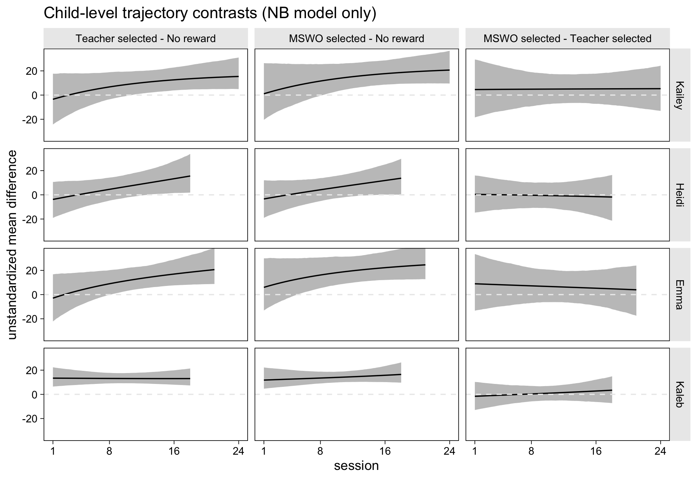

### How much did the $\sigma$ posteriors update the priors?

We spent a lot of time fretting over setting the gamma priors for the
$\sigma$ parameters. Given our modest $N = 4$ design, it might be
interesting to compare the $\sigma$ posteriors with their priors. Here
we’ll do so with some faceted plots.

``` r
sigmas <- str_c("sigma[", c("Intercept", "session01", "b", "c", "session01:b", "session01:c", "shape_Intercept"), "]")

as_draws_df(fit1) %>% 
  select(starts_with("sd_")) %>% 
  mutate(likelihood = "Poisson") %>% 
  pivot_longer(-likelihood) %>% 
  bind_rows(
    as_draws_df(fit2) %>% 
      select(starts_with("sd_")) %>% 
      mutate(likelihood = "Negative binomial") %>% 
      pivot_longer(-likelihood) 
  ) %>% 
  mutate(name = str_remove(name, "sd_id__")) %>% 
  mutate(name = str_remove(name, "phase")) %>% 
  mutate(name = str_c("sigma[", name, "]")) %>% 
  mutate(name       = factor(name, levels = sigmas),
         likelihood = factor(likelihood, levels = c("Poisson", "Negative binomial"))) %>% 
  
  ggplot(aes(x = value, y = ..density..)) +
  geom_area(data = tibble(value = seq(0, 5, by = 0.01),
                          density = dgamma(value, 1.5625, 1.5625)),
            aes(y = density),
            fill = "black") +
  geom_histogram(aes(fill = likelihood),
                 boundary = 0, binwidth = 0.1, 
                 position = "identity", alpha = 2/3) +
  scale_fill_manual(NULL, values = c("dodgerblue", "red")) +
  scale_x_continuous(NULL, expand = expansion(add = c(0, 0.2))) +
  scale_y_continuous(NULL, breaks = NULL) +
  labs(title = "How much did the posterior update relative to the prior?",
       subtitle = "The posteriors are semitransparent colored histograms. The gamma(1.56, 1.56) priors are in black.") +
  coord_cartesian(xlim = c(0, 4)) +
  facet_wrap(~ name, labeller = label_parsed) +
  theme(legend.position = c(0.85, 0.15))
```

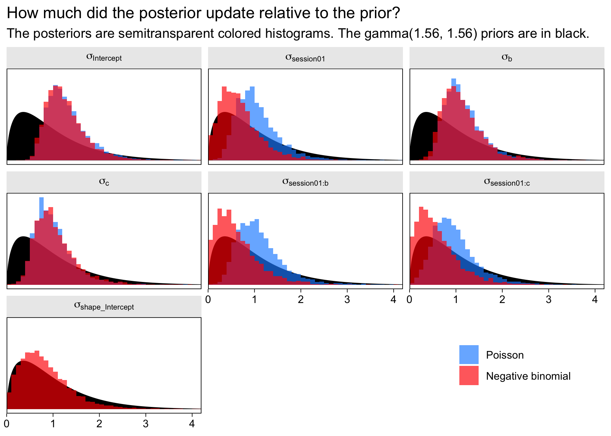

Even with just 4 children, the $\sigma$ posteriors for the $\mu$ models
updated from their priors. The $\sigma$ posterior for the
negative-binomial $\phi$ model, however, strayed little from its prior.
Perhaps that prior was expertly chosen, or perhaps we just need more
data before we can expect to do a good job modeling the overdispersion.

## Session information

``` r
sessionInfo()
```

    ## R version 4.2.0 (2022-04-22)
    ## Platform: x86_64-apple-darwin17.0 (64-bit)
    ## Running under: macOS Big Sur/Monterey 10.16
    ## 
    ## Matrix products: default
    ## BLAS:   /Library/Frameworks/R.framework/Versions/4.2/Resources/lib/libRblas.0.dylib
    ## LAPACK: /Library/Frameworks/R.framework/Versions/4.2/Resources/lib/libRlapack.dylib
    ## 
    ## locale:
    ## [1] en_US.UTF-8/en_US.UTF-8/en_US.UTF-8/C/en_US.UTF-8/en_US.UTF-8
    ## 
    ## attached base packages:
    ## [1] stats     graphics  grDevices utils     datasets  methods   base     
    ## 
    ## other attached packages:
    ##  [1] tidybayes_3.0.2 brms_2.18.0     Rcpp_1.0.9      forcats_0.5.1   stringr_1.4.1   dplyr_1.0.10   
    ##  [7] purrr_0.3.4     readr_2.1.2     tidyr_1.2.1     tibble_3.1.8    ggplot2_3.4.0   tidyverse_1.3.2
    ## 
    ## loaded via a namespace (and not attached):
    ##   [1] readxl_1.4.1         backports_1.4.1      plyr_1.8.7           igraph_1.3.4         svUnit_1.0.6        
    ##   [6] splines_4.2.0        crosstalk_1.2.0      TH.data_1.1-1        rstantools_2.2.0     inline_0.3.19       
    ##  [11] digest_0.6.30        htmltools_0.5.3      fansi_1.0.3          magrittr_2.0.3       checkmate_2.1.0     
    ##  [16] googlesheets4_1.0.1  tzdb_0.3.0           modelr_0.1.8         RcppParallel_5.1.5   matrixStats_0.62.0  
    ##  [21] xts_0.12.1           sandwich_3.0-2       prettyunits_1.1.1    colorspace_2.0-3     rvest_1.0.2         
    ##  [26] ggdist_3.2.0         haven_2.5.1          xfun_0.33            callr_3.7.3          crayon_1.5.2        
    ##  [31] jsonlite_1.8.3       lme4_1.1-31          survival_3.4-0       zoo_1.8-10           glue_1.6.2          
    ##  [36] gtable_0.3.1         gargle_1.2.0         emmeans_1.8.0        distributional_0.3.1 pkgbuild_1.3.1      
    ##  [41] rstan_2.21.7         abind_1.4-5          scales_1.2.1         mvtnorm_1.1-3        DBI_1.1.3           
    ##  [46] miniUI_0.1.1.1       xtable_1.8-4         stats4_4.2.0         StanHeaders_2.21.0-7 DT_0.24             
    ##  [51] htmlwidgets_1.5.4    httr_1.4.4           threejs_0.3.3        RColorBrewer_1.1-3   arrayhelpers_1.1-0  
    ##  [56] posterior_1.3.1      ellipsis_0.3.2       pkgconfig_2.0.3      loo_2.5.1            farver_2.1.1        
    ##  [61] dbplyr_2.2.1         utf8_1.2.2           labeling_0.4.2       tidyselect_1.1.2     rlang_1.0.6         
    ##  [66] reshape2_1.4.4       later_1.3.0          munsell_0.5.0        cellranger_1.1.0     tools_4.2.0         
    ##  [71] cli_3.4.1            generics_0.1.3       broom_1.0.1          ggridges_0.5.3       evaluate_0.18       
    ##  [76] fastmap_1.1.0        yaml_2.3.5           processx_3.8.0       knitr_1.40           fs_1.5.2            
    ##  [81] nlme_3.1-159         mime_0.12            projpred_2.2.1       xml2_1.3.3           compiler_4.2.0      
    ##  [86] bayesplot_1.9.0      shinythemes_1.2.0    rstudioapi_0.13      gamm4_0.2-6          reprex_2.0.2        
    ##  [91] stringi_1.7.8        highr_0.9            ps_1.7.2             Brobdingnag_1.2-8    lattice_0.20-45     
    ##  [96] Matrix_1.4-1         nloptr_2.0.3         markdown_1.1         shinyjs_2.1.0        tensorA_0.36.2      
    ## [101] vctrs_0.5.0          pillar_1.8.1         lifecycle_1.0.3      bridgesampling_1.1-2 estimability_1.4.1  
    ## [106] httpuv_1.6.5         R6_2.5.1             promises_1.2.0.1     gridExtra_2.3        codetools_0.2-18    
    ## [111] boot_1.3-28          colourpicker_1.1.1   MASS_7.3-58.1        gtools_3.9.3         assertthat_0.2.1    
    ## [116] withr_2.5.0          shinystan_2.6.0      multcomp_1.4-20      mgcv_1.8-40          parallel_4.2.0      
    ## [121] hms_1.1.1            grid_4.2.0           coda_0.19-4          minqa_1.2.5          rmarkdown_2.16      
    ## [126] googledrive_2.0.0    numDeriv_2016.8-1.1  shiny_1.7.2          lubridate_1.8.0      base64enc_0.1-3     
    ## [131] dygraphs_1.1.1.6
