Sarafoglou et al (2023) rnb
================
A Solomon Kurz
2023-07-03

Sarafoglou et al (2023; <https://doi.org/10.1177/25152459221128319>)
used a 2-group design ($n$ = 61 and $n$ = 59). Their preregistration
lives at <https://osf.io/2cdht>. The team preregistered 4 specific
hypothesis, and their fourth hypothesis (called “Hypothesis 4” in the
paper) originally read:

> Analysis teams in the preregistration condition should (1) deviate
> more often from their planned analysis than analysis teams in the
> blinding condition and (2) when they deviate from their analysis plan,
> analysis teams in the preregistration condition should deviate on more
> items than analysis teams in the blinding condition. We will test this
> hypothesis against the null hypothesis that both groups (1) deviate
> the same number of times from their analysis plan and (2) when they
> deviate from their analysis plan they do so for the same number of
> items..

This is a compound hypothesis, and in this sketch we will focus on the
first part. We will compare the number of deviations by group.

## Data

Sarafoglou and colleagues made their materials, data, and code available
on the OSF at <https://osf.io/gkxqy/files/osfstorage>. In this sketch,
we will be using their `data_prereg_blinding_unblinded.csv` file, which
can be downloaded directly from <https://osf.io/6qyvw>. The file has
also been uploaded to this repository, which is how we will upload the
data here.

Load the data and the primary **R** packages.

``` r
# packages
library(tidyverse)
library(brms)
library(tidybayes)
library(patchwork)
library(marginaleffects)

# drop gridlines
theme_set(
  theme_gray() +
    theme(panel.grid = element_blank())
)

# load the data
sarafoglou2023 <- read_csv("data/data_prereg_blinding_unblinded.csv") %>% 
  rename(id = ...1) %>% 
  mutate(blinding = ifelse(condition == "blinding", 1, 0))

# what is this?
glimpse(sarafoglou2023)
```

    ## Rows: 120
    ## Columns: 42
    ## $ id                   <dbl> 3, 4, 5, 6, 7, 8, 9, 10, 11, 12, 13, 14, 16, 19, …
    ## $ condition            <chr> "blinding", "preregistration", "blinding", "blind…
    ## $ work                 <dbl> 46, NA, 70, 17, 9, 100, 9, 12, 20, 13, 35, 48, 50…
    ## $ effort               <dbl> 9, NA, 11, 9, 7, 12, 7, 9, 7, 8, 11, 11, 11, 10, …
    ## $ frustration          <dbl> 4, NA, 6, 9, 5, 5, 2, 8, 5, 8, 12, 10, 9, 6, 5, 8…
    ## $ time_anticipated     <dbl> 8, NA, 7, 5, 6, 7, 6, 6, 6, 8, 5, 8, 6, 7, 8, 6, …
    ## $ deviation_count      <dbl> 0, 0, 0, 0, 0, 1, 0, 1, 0, 0, 0, 0, 0, 1, 0, 0, 0…
    ## $ HoursS1              <dbl> 40, NA, 30, 12, 2, 20, 2, 4, 10, 7, 30, 12, 30, 5…
    ## $ HoursS2              <dbl> 6, 30, 40, 5, 7, 80, 7, 8, 10, 6, 5, 36, 20, 5, 5…
    ## $ EffortS1             <dbl> 5, NA, 5, 4, 2, 6, 3, 4, 3, 4, 6, 5, 6, 5, 3, 6, …
    ## $ EffortS2             <dbl> 4, 7, 6, 5, 5, 6, 4, 5, 4, 4, 5, 6, 5, 5, 5, 3, 4…
    ## $ FrustrationS1        <dbl> 2, NA, 3, 5, 1, 1, 1, 5, 2, 1, 5, 6, 5, 3, 3, 4, …
    ## $ FrustrationS2        <dbl> 2, 5, 3, 4, 4, 4, 1, 3, 3, 7, 7, 4, 4, 3, 2, 4, 5…
    ## $ TimeAnticipatedS1    <dbl> 5, NA, 4, 2, 3, 3, 3, 3, 3, 3, 2, 4, 4, 3, 4, 3, …
    ## $ TimeAnticipatedS2    <dbl> 3, 5, 3, 3, 3, 4, 3, 3, 3, 5, 3, 4, 2, 4, 4, 3, 3…
    ## $ DeviateHypotheses    <dbl> 0, 0, 0, 0, 0, 0, 0, 0, 0, 0, 0, 0, 0, 0, 0, 0, 0…
    ## $ DeviateVariables     <dbl> 0, 0, 0, 0, 0, 0, 0, 0, 0, 0, 0, 0, 0, 0, 0, 0, 0…
    ## $ DeviateDV            <dbl> 0, 0, 0, 0, 0, 0, 0, 0, 0, 0, 0, 0, 0, 0, 0, 0, 0…
    ## $ DeviateExclusions    <dbl> 0, 0, 0, 0, 0, 0, 0, 1, 0, 0, 0, 0, 0, 1, 0, 0, 0…
    ## $ DeviateModel         <dbl> 0, 0, 0, 0, 0, 0, 0, 0, 0, 0, 0, 0, 0, 0, 0, 0, 0…
    ## $ DeviateDirection     <dbl> 0, 0, 0, 0, 0, 0, 0, 0, 0, 0, 0, 0, 0, 0, 0, 0, 0…
    ## $ DeviateTest          <dbl> 0, 0, 0, 0, 0, 0, 0, 0, 0, 0, 0, 0, 0, 0, 0, 0, 0…
    ## $ DeviateIV            <dbl> 0, 0, 0, 0, 0, 1, 0, 0, 0, 0, 0, 0, 0, 0, 0, 0, 0…
    ## $ DeviateWhy           <chr> NA, NA, NA, NA, NA, "We included further data tra…
    ## $ NumberOfPeople       <dbl> 5, 1, 6, 1, 2, 3, 2, 1, 1, 2, 1, 1, 2, 1, 1, 2, 1…
    ## $ Domain               <chr> "Psychology (Other)", "Cognition", "Religion and …
    ## $ Positions            <chr> "Doctoral student, Assistant professor, Associate…
    ## $ TheoreticalKnowledge <dbl> 2, 3, 4, 5, 5, 3, 4, 2, 1, 2, 1, 1, 5, 3, 4, 2, 2…
    ## $ MethodsKnowledge     <dbl> 4, 5, 4, 5, 5, 4, 4, 3, 3, 3, 3, 4, 4, 4, 5, 4, 4…
    ## $ Standardized_ES_1    <dbl> 0.130, 0.084, 0.307, NA, 0.090, 0.130, 0.078, 0.0…
    ## $ lower_CI_1           <dbl> 0.111, 0.065, 0.115, NA, 0.060, 0.103, 0.076, 0.0…
    ## $ upper_CI_1           <dbl> 0.149, 0.103, 0.509, NA, 0.120, 0.156, 0.082, 0.0…
    ## $ MARP_ES_type_1       <chr> "beta", "beta", "beta", NA, "beta", "beta", "beta…
    ## $ Standardized_ES_2    <dbl> 0.016, NA, 0.050, NA, 0.030, 0.130, 0.027, 0.020,…
    ## $ lower_CI_2           <dbl> -0.002, NA, -0.018, NA, 0.000, 0.103, 0.026, 0.00…
    ## $ upper_CI_2           <dbl> 0.035, NA, 0.119, NA, 0.050, 0.156, 0.028, 0.039,…
    ## $ MARP_ES_type_2       <chr> "beta", NA, "beta", NA, "beta", "beta", "beta", "…
    ## $ EstimationRQ1        <dbl> 2, 5, 6, 5, 7, 4, 6, 5, 5, 4, 5, 4, 5, 7, 6, 4, 2…
    ## $ EstimationRQ2        <dbl> 5, 7, 7, 3, 6, 4, 5, 4, 6, 6, 5, 5, 5, 6, 6, 5, 6…
    ## $ AnswerRQ1            <dbl> 4, 6, 7, 1, 4, 6, 6, 5, 7, 4, 5, 5, 6, 5, 6, 6, 6…
    ## $ AnswerRQ2            <dbl> 4, NA, 3, NA, 2, 4, 5, 4, 6, 4, 4, 4, 2, 5, 6, 2,…
    ## $ blinding             <dbl> 1, 0, 1, 1, 0, 0, 0, 0, 1, 1, 1, 0, 0, 0, 1, 0, 0…

In the `sarafoglou2023` data, the number of deviations is recorded in
the `deviation_count` column, and the experimental groups are
differentiated by the `condition` column. To get a sense of the data,
here’s a descriptive plot recreating the visualization in Figure 4
(p. 10).

``` r
sarafoglou2023 %>% 
  ggplot(aes(x = deviation_count, group = condition, fill = condition)) +
  geom_bar(position = position_dodge()) +
  scale_fill_viridis_d(NULL, option = "C", end = .7) +
  theme(legend.background = element_blank() ,
        legend.position = c(.80, .85))
```

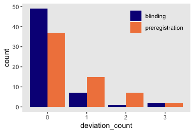<!-- -->

I’m not the hugest fan of paired bar plots like this. Here’s a dumbbell
plot alternative.

``` r
sarafoglou2023 %>% 
  count(condition, deviation_count) %>% 
  
  ggplot(aes(x = deviation_count, y = n, group = deviation_count)) +
  geom_line(color = "white", linewidth = 1) +
  geom_point(aes(color = condition, shape = condition),
             size = 6) +
  scale_color_viridis_d(NULL, option = "C", end = .7) +
  scale_shape_manual(NULL, values = c(15, 16)) +
  theme(legend.background = element_blank() ,
        legend.position = c(.80, .85))
```

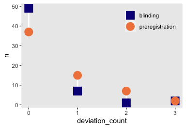<!-- -->

The `sarafoglou2023` data set also contains a handful of baseline
covariates we might use to help increase the precision of the analyses.
In this sketch, we’ll focus on `TheoreticalKnowledge` and
`MethodsKnowledge`.

``` r
sarafoglou2023 %>% 
  ggplot(aes(x = TheoreticalKnowledge, y = deviation_count)) +
  geom_jitter(width = 0.2, height = 0.2)
```

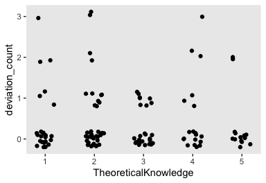<!-- -->

``` r
sarafoglou2023 %>% 
  ggplot(aes(x = MethodsKnowledge, y = deviation_count)) +
  geom_jitter(width = 0.2, height = 0.2)
```

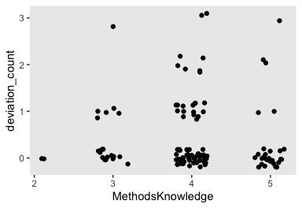<!-- -->

Here we’ll make and save standardized versions of `TheoreticalKnowledge`
and `MethodsKnowledge`, which will help with the models down the line.

``` r
sarafoglou2023 <- sarafoglou2023 %>% 
  mutate(tz = (TheoreticalKnowledge - mean(TheoreticalKnowledge)) / sd(TheoreticalKnowledge),
         mz = (MethodsKnowledge - mean(MethodsKnowledge)) / sd(MethodsKnowledge))

# what?
sarafoglou2023 %>% 
  select(TheoreticalKnowledge, MethodsKnowledge, tz, mz) %>% 
  head()
```

    ## # A tibble: 6 × 4
    ##   TheoreticalKnowledge MethodsKnowledge     tz      mz
    ##                  <dbl>            <dbl>  <dbl>   <dbl>
    ## 1                    2                4 -0.526 -0.0486
    ## 2                    3                5  0.253  1.41  
    ## 3                    4                4  1.03  -0.0486
    ## 4                    5                5  1.81   1.41  
    ## 5                    5                5  1.81   1.41  
    ## 6                    3                4  0.253 -0.0486

## Models

In this sketch, we’ll be fitting 7 models to the data. Three models will
follow an ANOVA specification, and another three will be their ANCOVA
analogues. But before we go into ANOVA and ANCOVA mode, we’ll first warm
up with an unconditional ZIP model to familiarize ourselves with the
parameters of the ZIP.

### ZIP warmup.

Our unconditional ZIP model will follow the form

$$
\begin{align}
\text{deviation count}_i & \sim \text{ZIP}(\lambda, \pi) \\
\log(\lambda) & = \beta_0 \\
\beta_0 & \sim \text{Normal}(-0.2228555, 0.9444565) \\
\pi & \sim \text{Beta}(1, 4),
\end{align}
$$

where, because we have no predictor variables in the model, the two
parameters $\lambda$ and $\pi$ are constants without $i$ subscripts. As
with conventional Poisson models, we use the log link for $\lambda$,
which is the `brm()` default. The $\beta_0$ parameter, then, is the
intercept for $\lambda$ on the log scale. When you estimate $\pi$
without predictor variables, the `brm()` default is the identity link,
which we’ve retained here. The third and fourth lines in the equation
show the priors, which may seem oddly specific. Before we discuss the
priors in detail, we should what the $\lambda$ and $\pi$ parameters mean
for the ZIP distribution.

The $\lambda$ parameter in a simple Poisson distribution controls both
the mean and the variance. However, the ZIP is a mixture of a Poisson
count and a proportion of zero’s in addition to what you would typically
expect from a Poisson count with a given $\lambda$. The $\pi$ parameter,
also sometimes called $\theta$ by the Stan team
(<https://mc-stan.org/docs/stan-users-guide/zero-inflated.html>) or $z$
by Bürkner
(<https://cran.r-project.org/web/packages/brms/vignettes/brms_families.html#zero-inflated-and-hurdle-models>),
is the proportion of extra zero’s/ As a consequence, the mean of the
mixture distribution is not simply $\lambda$, but is defined as

$$
\mathbb E(y_i) = \lambda (1 - \pi),
$$

and the variance is

$$
\mathbb{Var}(y_i) = \lambda (1 - \pi) (1 + \pi \lambda).
$$

Thus, when we set our priors for $\lambda$, we can’t just base them on
our expected value for our criterion variable. We need to account for
the expected value for the proportion of zero’s, too. Before we discuss
our prior for $\lambda$, then, I think we should first discuss $\pi$.

When I looked through the paper, preregistration and supporting
materials from Sarafoglou and colleagues, it was not clear to me how
many extra zero’s they expected for `deviation_count`. This is a new
topic in meta science, and I found the prior research generally
unhelpful, too. But Sarafoglou colleagues were confident enough
`deviation_count` would have extra zero’s to justify planning on a ZIP
model in their preregistration, we want a prior to assume some
proportion greater than zero. The `brms()` default prior for this model
is $\text{Beta}(1, 1)$, which is flat. My proposed $\text{Beta}(1, 4)$
prior has a mean of 0.2, and a wide spread around that mean. Here are
those two priors in a plot.

``` r
c(prior(beta(1, 1)),      # brms default
  prior(beta(1, 4))) %>%  # Solomon's alternative 
  parse_dist() %>% 
  
  ggplot(aes(xdist = .dist_obj, y = prior)) + 
  stat_halfeye(point_interval = mean_qi, .width = c(.5, .95)) +
  scale_x_continuous(expression(italic(p)(pi)), breaks = 0:5 / 5) +
  scale_y_discrete(NULL, expand = expansion(add = 0.1))
```

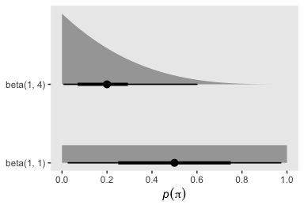<!-- -->

In case you didn’t know, the mean of the beta distribution is
$\alpha / (\alpha + \beta)$, and the degree of *concentration* (aka
*sample size*) around that mean can be expressed as $\alpha + \beta$.
Thus, an alternative $\text{Beta}(10, 40)$ prior would have the same
prior mean if 0.2, but with much greater concentration around that mean.
Try it out in another plot like the one above and see.

Now we have settled on a prior for $\pi$, we’re almost ready to discuss
$\lambda$. Modelers used to the ZIP might be able to think in terms of
$\lambda$ directly, but I suspect those newer to the ZIP will find it
easier to think in terms of the mean of the criterion variable
`deviation_count` as a whole. Much like with $\pi$, the prior literature
on this meta-science topic is sparse. Given the authors in this study
were already interested in meta-science and they were aware their
analyses were going to be scrutinized by others, my guess is they would,
on average, deviate infrequently from their analysis plans. For the sake
of the example, let’s suppose we expected an average value of 1 for
`deviation_count`. With a little algebra, we can use the formula for
$\mathbb E(y_i)$, above to compute $\lambda$ given fixed values for
$\pi$ and $\mathbb E(y_i)$. Here’s the computation in code.

``` r
m <- 1     # expected mean for deviation_count
pi <- 0.2  # expected proportion of extra 0's for deviation_count

# compute lambda
m / (1 - pi)
```

    ## [1] 1.25

Thus I propose a prior mean of 1.25 for $\lambda$. However, recall we
are using the log link for $\lambda$, which we’re calling $\beta_0$ in
the model. Also recall we typically use Gaussian or other Student-t
priors for $\beta$ coefficients. This means that a normal prior on the
log scale is equivalent to a lognormal prior on the actual count scale.
Thus when we are thinking about the parameters on the normal prior for
$\beta_0$, we should consider what kind of lognormal distribution they
imply on the count scale. The lognormal distribution is strange in that
its two parameters $\mu$ and $\sigma$ are the mean and standard
deviation of the log of the lognormal distribution, which is itself
normal. However, if we want to pick the lognormal distribution for a
given mean $m$ and standard deviation $s$, we can use the equations

$$
\begin{align*}
\mu & = \log\left ( \bar y \Bigg / \sqrt{\frac{s^2}{\bar y^2} + 1} \right), \text{and} \\
\sigma & = \sqrt{\log \left(\frac{s^2}{\bar y^2} + 1 \right)}.
\end{align*}
$$

If we want our mean of 1 and, say, a standard deviation of 1.5, here’s
what those equations look like in code.

Here’s what that looks like in code.

``` r
m <- 1.25  # desired mean for the ZIP lambda
s <- 1.5   # desired SD for the ZIP lambda

# use the equations
mu    <- log(m / sqrt(s^2 / m^2 + 1))
sigma <- sqrt(log(s^2 / m^2 + 1))

# what are the lognormal parameter values?
mu; sigma
```

    ## [1] -0.2228555

    ## [1] 0.9444565

Thus if we set $\beta_0 \sim \text{Normal}(-0.2228555, 0.9444565)$, this
is what the corresponding lognormal distribution on the count metric
looks like.

``` r
prior(lognormal(-0.2228555, 0.9444565)) %>% 
  parse_dist() %>% 
  
  ggplot(aes(xdist = .dist_obj, y = prior)) + 
  stat_halfeye(point_interval = mean_qi, .width = c(.5, .95)) +
  scale_x_continuous(expression(exp(italic(p)(beta[0]))), breaks = 0:4 * 3) +
  scale_y_discrete(NULL, breaks = NULL, expand = expansion(add = 0.1)) +
  coord_cartesian(xlim = c(0, 9))
```

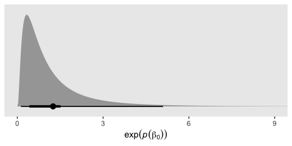<!-- -->

Thus the $\text{Normal}(-0.2228555, 0.9444565)$ prior for $\beta_0$,
which is on the log scale, implies a lognormal distribution with a mean
of 1.25 and standard deviation of 1.5 after exponentiation back to the
count scale. Such a distribution has an interquartile range of about 0.4
to 1.5, and a 95% range of about 0 to 5. For my money, this is about
what I’m looking for for $\lambda$.

We’re finally ready to our unconditional ZIP model. The only other new
coding bit to note is how to indicate the likelihood function by setting
`family = zero_inflated_poisson()`.

``` r
# unconditional ZIP
fit0 <- brm(
  data = sarafoglou2023,
  family = zero_inflated_poisson(),
  deviation_count ~ 1,
  prior = prior(normal(-0.2228555, 0.9444565), class = Intercept) +
    prior(beta(1, 4), class = zi),
  cores = 4, seed = 1,
  file = "fits/fit0.sarafoglou2023"
)
```

Check the model summary.

``` r
print(fit0)
```

    ##  Family: zero_inflated_poisson 
    ##   Links: mu = log; zi = identity 
    ## Formula: deviation_count ~ 1 
    ##    Data: sarafoglou2023 (Number of observations: 120) 
    ##   Draws: 4 chains, each with iter = 2000; warmup = 1000; thin = 1;
    ##          total post-warmup draws = 4000
    ## 
    ## Population-Level Effects: 
    ##           Estimate Est.Error l-95% CI u-95% CI Rhat Bulk_ESS Tail_ESS
    ## Intercept    -0.38      0.25    -0.89     0.09 1.01      812     1116
    ## 
    ## Family Specific Parameters: 
    ##    Estimate Est.Error l-95% CI u-95% CI Rhat Bulk_ESS Tail_ESS
    ## zi     0.37      0.14     0.06     0.60 1.00      791      551
    ## 
    ## Draws were sampled using sampling(NUTS). For each parameter, Bulk_ESS
    ## and Tail_ESS are effective sample size measures, and Rhat is the potential
    ## scale reduction factor on split chains (at convergence, Rhat = 1).

The ESS values are a little low, but not concerningly so. Otherwise the
parameter summaries look fine. It will probably be easiest to evaluate
the model with a posterior-predictive check.

``` r
set.seed(1)
pp_check(fit0, type = "bars",  ndraws = 500) +
  ggtitle("ZIP (intercepts only)") +
  coord_cartesian(xlim = c(-0.25, 5),
                  ylim = c(0, NA))
```

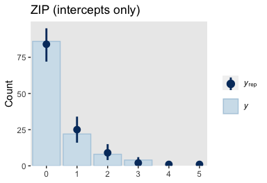<!-- -->

This looks like a success. Our simple ZIP model does a fine job
simulating data resembling the sample data. To get more comfortable with
the ZIP model, it may be worth it to practice converting the posterior
draws for $\beta_0$ and $\pi$ to the model implied estimates for the
population mean and variance for `deviation_count`. Since the ZIP model
is sensitive to zero values, we might also be interested in the total
proportion of zero values in the distribution, which we can define by
the equation

$$
\Pr(y = 0) = \pi + (1 - \pi)  \exp(-\lambda).
$$

Here’s how to work with the posterior draws from the `as_draws_df()`
output to compute the population mean, variance and proportion of 0’s,
and plot those results against the sample values.

``` r
# mean
p1 <- as_draws_df(fit0) %>% 
  transmute(lambda = exp(b_Intercept),
            pi = zi) %>% 
  mutate(m = lambda * (1 - pi)) %>% 
  
  ggplot(aes(x = m)) +
  stat_halfeye(.width = .95) +
  # sample mean
  geom_vline(xintercept = mean(sarafoglou2023$deviation_count),
             linetype = 2, color = "blue") +
  scale_x_continuous(expression(E(italic(y))), limits = c(0, NA)) +
  scale_y_continuous(NULL, breaks = NULL)

# variance
p2 <- as_draws_df(fit0) %>% 
  transmute(lambda = exp(b_Intercept),
            pi = zi) %>% 
  mutate(v = lambda * (1 - pi) * (1 + pi * lambda)) %>% 
  
  ggplot(aes(x = v)) +
  stat_halfeye(.width = .95) +
  # sample variance
  geom_vline(xintercept = var(sarafoglou2023$deviation_count),
             linetype = 2, color = "blue") +
  scale_x_continuous(expression(Var(italic(y))), limits = c(0, 1.3)) +
  scale_y_continuous(NULL, breaks = NULL)


# proportion 0
p3 <- as_draws_df(fit0) %>% 
  transmute(lambda = exp(b_Intercept),
            pi = zi) %>% 
  mutate(p = pi + (1 - pi) * exp(-lambda)) %>% 
  
  ggplot(aes(x = p)) +
  stat_halfeye(.width = .95) +
  geom_vline(xintercept = mean(sarafoglou2023$deviation_count == 0),
             linetype = 2, color = "blue") +
  scale_x_continuous(expression(Pr(italic(y)==0)), limits = c(0, 1)) +
  scale_y_continuous(NULL, breaks = NULL)

# combine and display
p1 + p2 + p3 +
  plot_annotation(title = "How do the ZIP posteriors compare to the sample statistics?",
                  subtitle = "The dashed blue lines mark the sample statistics.")
```

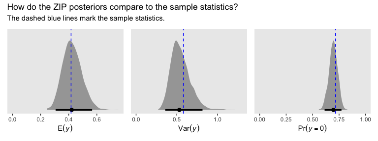<!-- -->

In the sections to come, you’ll see how these exercises pay off when we
want to make substantive inferences about the experimental conditions.

### ANOVA models.

For the Poisson ANOVA, I propose the model

$$
\begin{align*}
\text{deviation count}_i & \sim \text{Poisson}(\lambda_i) \\
\log(\lambda_i) & = \beta_0 + \beta_1 \text{blinding}_i \\
\beta_0 & \sim \text{Normal}(-0.5893275, 1.085659) \\
\beta_1 & \sim \text{Normal}(0, 0.5),
\end{align*}
$$

where the $\lambda$ parameter now has an $i$ subscript indicating it can
vary as a function of predictor variables. Because we are now using a
conventional Poisson model, $\lambda$ is once again the population mean
of the `deviation_count` variable itself, but modeled on the log scale
per convention. The new $\beta_1$ parameter is the difference in the
analysis blinding condition, relative to the preregistration condition,
on the log scale.

Because the $\lambda$ parameter is now the mean unconditioned on
additional zero’s, we probably don’t want to use the same prior as with
the unconditional ZIP model `fit0`. Rather, I propose a more analogous
prior would translate to a lognormal distribution for
$p(\lambda \mid \text{preregistration})$ with a mean of 1 and a standard
deviation of 1.5. Here’s how we compute the $\mu$ and $\sigma$
parameters for such a lognormal distribution.

``` r
m <- 1    # desired mean for the Poisson lambda
s <- 1.5  # desired SD for lambda

# use the equations
mu    <- log(m / sqrt(s^2 / m^2 + 1))
sigma <- sqrt(log(s^2 / m^2 + 1))

# what are the lognormal parameter values?
mu; sigma
```

    ## [1] -0.5893275

    ## [1] 1.085659

Thus if we set $\beta_0 \sim \text{Normal}(-0.5893275, 1.085659)$, this
is what the corresponding lognormal distribution on the count metric
looks like.

``` r
prior(lognormal(-0.5893275, 1.085659)) %>% 
  parse_dist() %>% 
  
  ggplot(aes(xdist = .dist_obj, y = prior)) + 
  stat_halfeye(point_interval = mean_qi, .width = c(.5, .95)) +
  scale_x_continuous(expression(exp(italic(p)(beta[0]))), breaks = 0:4 * 3) +
  scale_y_discrete(NULL, breaks = NULL, expand = expansion(add = 0.1)) +
  coord_cartesian(xlim = c(0, 9))
```

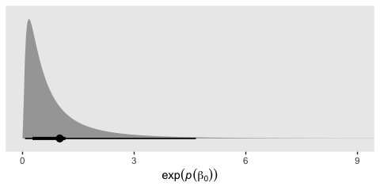<!-- -->

As to the $\beta_1$ prior, $\text{Normal}(0, 0.5)$ is a generic
weakly-regularizing distribution meant to rule out group differences
much more than plus or minus 1 on the log scale.

The ZIP ANOVA of the model is of the form

$$
\begin{align*}
\text{deviation count}_i & \sim \text{ZIP}(\lambda_i, \pi) \\
\log(\lambda_i) & = \beta_0 + \beta_1 \text{blinding}_i \\
\beta_0 & \sim \text{Normal}(-0.2228555, 0.9444565) \\
\beta_1 & \sim \text{Normal}(0, 0.5) \\
\pi & \sim \text{Beta}(1, 4),
\end{align*}
$$

where we have retained the same priors for $\beta_0$ and $\pi$ from the
earlier unconditional ZIP model, and we have added the same
$\text{Normal}(0, 0.5)$ prior for $\beta_1$ as in the Poisson ANOVA.

We will also fit a distributional ZIP ANOVA model of the form

$$
\begin{align*}
\text{deviation count}_i & \sim \text{ZIP}(\lambda_i, \pi_i) \\
\log(\lambda_i) & = \beta_0 + \beta_1 \text{blinding}_i \\
\text{logit}(\pi_i) & = \gamma_0 + \gamma_1 \text{blinding}_i  \\
\beta_0 & \sim \text{Normal}(-0.2228555, 0.9444565) \\
\beta_1 & \sim \text{Normal}(0, 0.5) \\
\gamma_0 & \sim \text{Normal}(-1.7, 1.1) \\
\gamma_1 & \sim \text{Normal}(0, 1),
\end{align*}
$$

where $\pi$ now has an $i$ subscript indicating it can vary as a
function of predictor variables. To ensure the $\pi_i$ only makes
predictions within the 0-to-1 range, we use the logit link, which is the
`brm()` default. To help differentiate the parameters in the $\pi$ model
from those for the $\lambda_i$ model, we use $\beta$ coefficients for
the latter, and $\gamma$ coefficients for the former.

When I set priors for the intercept of a typical logistic regression
model, I like $\text{Normal}(0, 1.25)$ as a weakly-regularizing default,
which is why we might consider it for $\gamma_0$ in a distributional ZIP
model. However, our unconditional ZIP model used a $\text{Gamma}(1, 4)$
prior for $\pi$ on the identity scale, which was designed to reflect our
admittedly vague theory that lower probabilities were more plausible
than higher probabilities, with a prior mean at 0.2. I am not aware of
an exact way to convert beta-distributed priors on the identity scale to
normal-distributed priors on the log-odds scale. But after some
iterating, the $\text{Normal}(-1.7, 1.1)$ looks like a good candidate.
Here is a simulation of draws from the $\text{Normal}(0, 1.25)$ and
$\text{Normal}(-1.7, 1.1)$ priors, transformed back onto the probability
scale with the inverse logit link.

``` r
# how many draws do you want?
n <- 1e6

# simulate
set.seed(1)

tibble(`normal(0, 1.25)`   = rnorm(n = n, mean = 0,    sd = 1.25),     # Solomon's default
       `normal(-1.7, 1.1)` = rnorm(n = n, mean = -1.7, sd = 1.1)) %>%  # the alternative
  pivot_longer(everything()) %>% 
  # transform
  mutate(pi = plogis(value)) %>% 
  
  # plot
  ggplot(aes(x = pi, y = name)) +
  stat_histinterval(point_interval = mean_qi, .width = c(.5, .95),
                    breaks = ggdist::breaks_fixed(width = 0.025),
                    align = ggdist::align_boundary(at = 0)) +
  scale_x_continuous(expression(logit^{-1}*(italic(p)(gamma[0]))), breaks = 0:5 / 5) +
  scale_y_discrete(NULL, expand = expansion(add = 0.1))
```

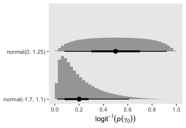<!-- -->

When transformed back onto the probability space, my default
$\text{Normal}(0, 1.25)$ prior for $\gamma_0$ is centered at 0.5, but
extends across the full parameter space. However, the
$\text{Normal}(-1.7, 1.1)$ looks remarkably similar to the
$\text{Beta}(1, 4)$ prior in terms of gross shape, mean, and
interquartile and 95% ranges.

The $\text{Normal}(0, 1)$ prior for $\gamma_1$ is my default
weakly-regularizing prior for non-intercept $\beta$ coefficients in
logistic regression models, and I think it’s a good option for
$\gamma_1$ in the $\pi_i$ submodel of our distributional ZIP ANOVA. It
will allow for moderately large group differences, but rule out
outrageously large differences.

Here’s how to fit the ANOVA models with `brm()`.

``` r
# Poisson ANOVA
fit1 <- brm(
  data = sarafoglou2023,
  family = poisson(),
  deviation_count ~ 0 + Intercept + blinding,
  prior = prior(normal(-0.5893275, 1.085659), class = b, coef = Intercept) +
    prior(normal(0, 0.5), class = b, coef = blinding),
  cores = 4, seed = 1,
  file = "fits/fit1.sarafoglou2023"
)

# ZI-Poisson ANOVA
fit2 <- brm(
  data = sarafoglou2023,
  family = zero_inflated_poisson(),
  deviation_count ~ 0 + Intercept + blinding,
  prior = prior(normal(-0.2228555, 0.9444565), class = b, coef = Intercept) +
    prior(normal(0, 0.5), class = b, coef = blinding) +
    prior(beta(1, 4), class = zi),
  cores = 4, seed = 1,
  file = "fits/fit2.sarafoglou2023"
)

# Distributional ZI-Poisson ANOVA
fit3 <- brm(
  data = sarafoglou2023,
  family = zero_inflated_poisson(),
  bf(deviation_count ~ 0 + Intercept + blinding,
     zi              ~ 0 + Intercept + blinding),
  prior = prior(normal(-0.2228555, 0.9444565), class = b, coef = Intercept) +
    prior(normal(0, 0.5), class = b, coef = blinding) +
    prior(normal(-1.7, 1.1), class = b, coef = Intercept, dpar = zi) +
    prior(normal(0, 1), class = b, coef = blinding, dpar = zi),
  cores = 4, seed = 1,
  file = "fits/fit3.sarafoglou2023"
)
```

Check the model summaries.

``` r
print(fit1)
```

    ##  Family: poisson 
    ##   Links: mu = log 
    ## Formula: deviation_count ~ 0 + Intercept + blinding 
    ##    Data: sarafoglou2023 (Number of observations: 120) 
    ##   Draws: 4 chains, each with iter = 2000; warmup = 1000; thin = 1;
    ##          total post-warmup draws = 4000
    ## 
    ## Population-Level Effects: 
    ##           Estimate Est.Error l-95% CI u-95% CI Rhat Bulk_ESS Tail_ESS
    ## Intercept    -0.64      0.17    -0.98    -0.34 1.00     1647     1809
    ## blinding     -0.61      0.26    -1.12    -0.10 1.00     1784     1915
    ## 
    ## Draws were sampled using sampling(NUTS). For each parameter, Bulk_ESS
    ## and Tail_ESS are effective sample size measures, and Rhat is the potential
    ## scale reduction factor on split chains (at convergence, Rhat = 1).

``` r
print(fit2)
```

    ##  Family: zero_inflated_poisson 
    ##   Links: mu = log; zi = identity 
    ## Formula: deviation_count ~ 0 + Intercept + blinding 
    ##    Data: sarafoglou2023 (Number of observations: 120) 
    ##   Draws: 4 chains, each with iter = 2000; warmup = 1000; thin = 1;
    ##          total post-warmup draws = 4000
    ## 
    ## Population-Level Effects: 
    ##           Estimate Est.Error l-95% CI u-95% CI Rhat Bulk_ESS Tail_ESS
    ## Intercept    -0.27      0.24    -0.75     0.19 1.01     1525     1963
    ## blinding     -0.54      0.28    -1.11    -0.01 1.00     1740     1772
    ## 
    ## Family Specific Parameters: 
    ##    Estimate Est.Error l-95% CI u-95% CI Rhat Bulk_ESS Tail_ESS
    ## zi     0.31      0.14     0.04     0.55 1.01     1481     1154
    ## 
    ## Draws were sampled using sampling(NUTS). For each parameter, Bulk_ESS
    ## and Tail_ESS are effective sample size measures, and Rhat is the potential
    ## scale reduction factor on split chains (at convergence, Rhat = 1).

``` r
print(fit3)
```

    ##  Family: zero_inflated_poisson 
    ##   Links: mu = log; zi = logit 
    ## Formula: deviation_count ~ 0 + Intercept + blinding 
    ##          zi ~ 0 + Intercept + blinding
    ##    Data: sarafoglou2023 (Number of observations: 120) 
    ##   Draws: 4 chains, each with iter = 2000; warmup = 1000; thin = 1;
    ##          total post-warmup draws = 4000
    ## 
    ## Population-Level Effects: 
    ##              Estimate Est.Error l-95% CI u-95% CI Rhat Bulk_ESS Tail_ESS
    ## Intercept       -0.26      0.22    -0.70     0.17 1.00     1996     2364
    ## blinding        -0.22      0.35    -0.89     0.48 1.00     1951     2153
    ## zi_Intercept    -1.01      0.64    -2.51     0.03 1.00     1938     1712
    ## zi_blinding      1.08      0.74    -0.53     2.36 1.00     2171     1901
    ## 
    ## Draws were sampled using sampling(NUTS). For each parameter, Bulk_ESS
    ## and Tail_ESS are effective sample size measures, and Rhat is the potential
    ## scale reduction factor on split chains (at convergence, Rhat = 1).

### ANCOVA models.

For the Poisson ANCOVA, I propose the model

$$
\begin{align*}
\text{deviation count}_i & \sim \text{Poisson}(\lambda_i) \\
\log(\lambda_i) & = \beta_0 + \beta_1 \text{blinding}_i + \beta_2 \text{tz}_i + \beta_3 \text{mz}_i \\
\beta_0 & \sim \text{Normal}(-0.5893275, 1.085659) \\
\beta_1, \dots, \beta_3 & \sim \text{Normal}(0, 0.5),
\end{align*}
$$

where the $\lambda$ parameter now has an $i$ subscript indicating it can
vary as a function of predictor variables. Because we are now using a
conventional Poisson model, $\lambda$ is once again the population mean
of the `deviation_count` variable itself, but modeled on the log scale
per convention. The new $\beta_1$ parameter is the difference in the
analysis blinding condition, relative to the preregistration condition,
on the log scale.

BLAH

``` r
# Poisson ANCOVA
fit4 <- brm(
  data = sarafoglou2023,
  family = poisson(),
  deviation_count ~ 0 + Intercept + blinding + tz + mz,
  prior = prior(normal(-0.5893275, 1.085659), class = b, coef = Intercept) +
    prior(normal(0, 0.5), class = b),
  cores = 4, seed = 1,
  file = "fits/fit4.sarafoglou2023"
)

# ZI-Poisson ANCOVA
fit5 <- brm(
  data = sarafoglou2023,
  family = zero_inflated_poisson(),
  deviation_count ~ 0 + Intercept + blinding + tz + mz,
  prior = prior(normal(-0.2228555, 0.9444565), class = b, coef = Intercept) +
    prior(normal(0, 0.5), class = b) +
    prior(beta(1, 4), class = zi),
  cores = 4, seed = 1,
  file = "fits/fit5.sarafoglou2023"
)

# Distributional ZI-Poisson ANCOVA
fit6 <- brm(
  data = sarafoglou2023,
  family = zero_inflated_poisson(),
  bf(deviation_count ~ 0 + Intercept + blinding + tz + mz,
     zi              ~ 0 + Intercept + blinding + tz + mz),
  prior = prior(normal(-0.2228555, 0.9444565), class = b, coef = Intercept) +
    prior(normal(0, 0.5), class = b) +
    prior(normal(-1.7, 1.1), class = b, coef = Intercept, dpar = zi) +
    prior(normal(0, 1), class = b, dpar = zi),
  cores = 4, seed = 1,
  file = "fits/fit6.sarafoglou2023"
)
```

Check the model summaries.

``` r
print(fit4)
```

    ##  Family: poisson 
    ##   Links: mu = log 
    ## Formula: deviation_count ~ 0 + Intercept + blinding + tz + mz 
    ##    Data: sarafoglou2023 (Number of observations: 120) 
    ##   Draws: 4 chains, each with iter = 2000; warmup = 1000; thin = 1;
    ##          total post-warmup draws = 4000
    ## 
    ## Population-Level Effects: 
    ##           Estimate Est.Error l-95% CI u-95% CI Rhat Bulk_ESS Tail_ESS
    ## Intercept    -0.66      0.17    -1.00    -0.35 1.00     3297     3277
    ## blinding     -0.62      0.26    -1.12    -0.12 1.00     3262     2588
    ## tz           -0.03      0.15    -0.32     0.25 1.00     3938     2776
    ## mz           -0.03      0.15    -0.33     0.27 1.00     3637     2708
    ## 
    ## Draws were sampled using sampling(NUTS). For each parameter, Bulk_ESS
    ## and Tail_ESS are effective sample size measures, and Rhat is the potential
    ## scale reduction factor on split chains (at convergence, Rhat = 1).

``` r
print(fit5)
```

    ##  Family: zero_inflated_poisson 
    ##   Links: mu = log; zi = identity 
    ## Formula: deviation_count ~ 0 + Intercept + blinding + tz + mz 
    ##    Data: sarafoglou2023 (Number of observations: 120) 
    ##   Draws: 4 chains, each with iter = 2000; warmup = 1000; thin = 1;
    ##          total post-warmup draws = 4000
    ## 
    ## Population-Level Effects: 
    ##           Estimate Est.Error l-95% CI u-95% CI Rhat Bulk_ESS Tail_ESS
    ## Intercept    -0.27      0.25    -0.76     0.19 1.00     2213     2592
    ## blinding     -0.53      0.28    -1.07     0.03 1.00     2832     2562
    ## tz           -0.01      0.16    -0.32     0.32 1.00     3482     2890
    ## mz           -0.02      0.17    -0.34     0.31 1.00     3355     2855
    ## 
    ## Family Specific Parameters: 
    ##    Estimate Est.Error l-95% CI u-95% CI Rhat Bulk_ESS Tail_ESS
    ## zi     0.33      0.14     0.05     0.57 1.00     2027     1488
    ## 
    ## Draws were sampled using sampling(NUTS). For each parameter, Bulk_ESS
    ## and Tail_ESS are effective sample size measures, and Rhat is the potential
    ## scale reduction factor on split chains (at convergence, Rhat = 1).

``` r
print(fit6)
```

    ##  Family: zero_inflated_poisson 
    ##   Links: mu = log; zi = logit 
    ## Formula: deviation_count ~ 0 + Intercept + blinding + tz + mz 
    ##          zi ~ 0 + Intercept + blinding + tz + mz
    ##    Data: sarafoglou2023 (Number of observations: 120) 
    ##   Draws: 4 chains, each with iter = 2000; warmup = 1000; thin = 1;
    ##          total post-warmup draws = 4000
    ## 
    ## Population-Level Effects: 
    ##              Estimate Est.Error l-95% CI u-95% CI Rhat Bulk_ESS Tail_ESS
    ## Intercept       -0.30      0.22    -0.72     0.12 1.00     2430     2759
    ## blinding        -0.26      0.38    -0.98     0.49 1.00     2139     2211
    ## tz              -0.02      0.24    -0.48     0.44 1.00     1874     2508
    ## mz               0.15      0.23    -0.33     0.60 1.00     2305     2511
    ## zi_Intercept    -1.38      0.74    -3.08    -0.18 1.00     2075     2127
    ## zi_blinding      1.05      0.87    -0.86     2.62 1.00     2078     2115
    ## zi_tz           -0.00      0.70    -1.45     1.38 1.00     1797     2227
    ## zi_mz            0.61      0.65    -0.75     1.81 1.00     2011     2250
    ## 
    ## Draws were sampled using sampling(NUTS). For each parameter, Bulk_ESS
    ## and Tail_ESS are effective sample size measures, and Rhat is the potential
    ## scale reduction factor on split chains (at convergence, Rhat = 1).

### Model comparison: Information criteria.

We might compare the models by their LOO and WAIC estimates. First, we
compute and save.

``` r
fit1 <- add_criterion(fit1, criterion = c("loo", "waic"))
fit2 <- add_criterion(fit2, criterion = c("loo", "waic"))
fit3 <- add_criterion(fit3, criterion = c("loo", "waic"))
fit4 <- add_criterion(fit4, criterion = c("loo", "waic"))
fit5 <- add_criterion(fit5, criterion = c("loo", "waic"))
fit6 <- add_criterion(fit6, criterion = c("loo", "waic"))
```

Here are the LOO and WAIC compasrisons for the ANOVA models.

``` r
loo_compare(fit1, fit2, fit3, criterion = "loo") %>% print(simplify = F)
```

    ##      elpd_diff se_diff elpd_loo se_elpd_loo p_loo  se_p_loo looic  se_looic
    ## fit3    0.0       0.0  -102.0     10.6         3.1    0.7    204.1   21.1  
    ## fit2   -1.2       1.1  -103.3     10.7         2.9    0.7    206.6   21.5  
    ## fit1   -3.0       2.4  -105.1     11.4         2.5    0.6    210.2   22.8

``` r
loo_compare(fit1, fit2, fit3, criterion = "waic") %>% print(simplify = F)
```

    ##      elpd_diff se_diff elpd_waic se_elpd_waic p_waic se_p_waic waic   se_waic
    ## fit3    0.0       0.0  -102.0      10.6          3.1    0.7     204.1   21.1 
    ## fit2   -1.2       1.1  -103.3      10.7          2.9    0.7     206.6   21.5 
    ## fit1   -3.0       2.4  -105.1      11.4          2.5    0.6     210.2   22.8

Next we compare the ANCOVA models.

``` r
loo_compare(fit4, fit5, fit6, criterion = "loo") %>% print(simplify = F)
```

    ##      elpd_diff se_diff elpd_loo se_elpd_loo p_loo  se_p_loo looic  se_looic
    ## fit6    0.0       0.0  -104.4     11.2         6.7    1.4    208.8   22.3  
    ## fit5   -1.0       1.1  -105.4     11.1         5.2    1.3    210.7   22.2  
    ## fit4   -3.0       2.1  -107.3     11.8         5.1    1.2    214.7   23.7

``` r
loo_compare(fit4, fit5, fit6, criterion = "waic") %>% print(simplify = F)
```

    ##      elpd_diff se_diff elpd_waic se_elpd_waic p_waic se_p_waic waic   se_waic
    ## fit6    0.0       0.0  -104.3      11.1          6.6    1.4     208.6   22.3 
    ## fit5   -1.1       1.1  -105.4      11.1          5.2    1.3     210.7   22.2 
    ## fit4   -3.0       2.1  -107.3      11.8          5.1    1.2     214.6   23.7

Finally, we compare all ANOVA and ANCOVA models.

``` r
loo_compare(fit1, fit2, fit3, fit4, fit5, fit6, criterion = "loo") %>% print(simplify = F)
```

    ##      elpd_diff se_diff elpd_loo se_elpd_loo p_loo  se_p_loo looic  se_looic
    ## fit3    0.0       0.0  -102.0     10.6         3.1    0.7    204.1   21.1  
    ## fit2   -1.2       1.1  -103.3     10.7         2.9    0.7    206.6   21.5  
    ## fit6   -2.3       1.4  -104.4     11.2         6.7    1.4    208.8   22.3  
    ## fit1   -3.0       2.4  -105.1     11.4         2.5    0.6    210.2   22.8  
    ## fit5   -3.3       1.3  -105.4     11.1         5.2    1.3    210.7   22.2  
    ## fit4   -5.3       2.7  -107.3     11.8         5.1    1.2    214.7   23.7

``` r
loo_compare(fit1, fit2, fit3, fit4, fit5, fit6, criterion = "waic") %>% print(simplify = F)
```

    ##      elpd_diff se_diff elpd_waic se_elpd_waic p_waic se_p_waic waic   se_waic
    ## fit3    0.0       0.0  -102.0      10.6          3.1    0.7     204.1   21.1 
    ## fit2   -1.2       1.1  -103.3      10.7          2.9    0.7     206.6   21.5 
    ## fit6   -2.3       1.3  -104.3      11.1          6.6    1.4     208.6   22.3 
    ## fit1   -3.0       2.4  -105.1      11.4          2.5    0.6     210.2   22.8 
    ## fit5   -3.3       1.3  -105.4      11.1          5.2    1.3     210.7   22.2 
    ## fit4   -5.3       2.7  -107.3      11.8          5.1    1.2     214.6   23.7

Within the ANOVA paradigm, the models got incrementally better as they
became more complex, but the differences were pretty small. The same
pattern emerged among the ANCOVA models. Taken as a whole, the ANCOVA
models fared slightly worse than the simpler ANOVA models. If you look
closely at the $\beta$ and $\gamma$ coefficients for the baseline
covariates in the ANCOVA models, you’ll see their magnitudes were
generally pretty small, and fairly uncertain, which indicates the `tz`
and `mz` variables were poor predictors for the criterion variable.

### Model comparison: Posterior-predictive checks.

Instead of displaying the typical `pp_check()` output for 6 models,
we’ll first save those outputs as objects.

``` r
# ANOVA's
set.seed(1)
p1 <- pp_check(fit1, type = "bars_grouped", group = "blinding",  ndraws = 1000)
set.seed(1)
p2 <- pp_check(fit2, type = "bars_grouped", group = "blinding",  ndraws = 1000)
set.seed(1)
p3 <- pp_check(fit3, type = "bars_grouped", group = "blinding",  ndraws = 1000)

# ANCOVA's
set.seed(1)
p4 <- pp_check(fit4, type = "bars_grouped", group = "blinding",  ndraws = 1000)
set.seed(1)
p5 <- pp_check(fit5, type = "bars_grouped", group = "blinding",  ndraws = 1000)
set.seed(1)
p6 <- pp_check(fit6, type = "bars_grouped", group = "blinding",  ndraws = 1000)
```

Now we’ll combine the data frames from the `px` objects, wrangle, and
present a customized pp-check plot.

``` r
# combine
bind_rows(
  p1$data, p2$data, p3$data, p4$data, p5$data, p6$data
  ) %>% 
  # wrangle
  filter(x < 5) %>% 
  mutate(y_obs = ifelse(is.na(y_obs), 0, y_obs),
         fit   = rep(str_c("fit", 1:6), each = n() / 6) %>% 
           factor(levels = str_c("fit", 1:6),
                  labels = c("Poisson ANOVA", "ZIP ANOVA", "Distributional ZIP ANOVA",
                   "Poisson ANCOVA", "ZIP ANCOVA", "Distributional ZIP ANCOVA")),
         group = ifelse(group == 0, "preregistration", "blinding") %>% 
           factor(levels = c("preregistration", "blinding"),
                  labels = c("control", "experimental"))) %>% 
  
  # plot
  ggplot(aes(x = x)) +
  geom_col(data = . %>% filter(fit == "Poisson ANOVA"),
           aes(y = y_obs),
           fill = "grey75") +
  geom_pointrange(aes(y = m, ymin = l, ymax = h, color = fit),
                  size = 0.25, linewidth = 0.8,
                  position = position_dodge(width = 0.9)) +
  scale_color_viridis_d(NULL, option = "B", end = .6) +
  scale_x_continuous("dependent variable", limits = c(-0.5, 4.5)) +
  labs(title = "6-model pp-check",
       subtitle = "Gray bars in the background show the observed counts.\nColored point intervals in the foreground show the models' posterior-predictive counts.",
       y = "count") +
  theme(legend.background = element_blank(),
        legend.key.size = unit(0.13, 'in'),
        legend.position = c(.85, .85)) +
  facet_wrap(~ group)
```

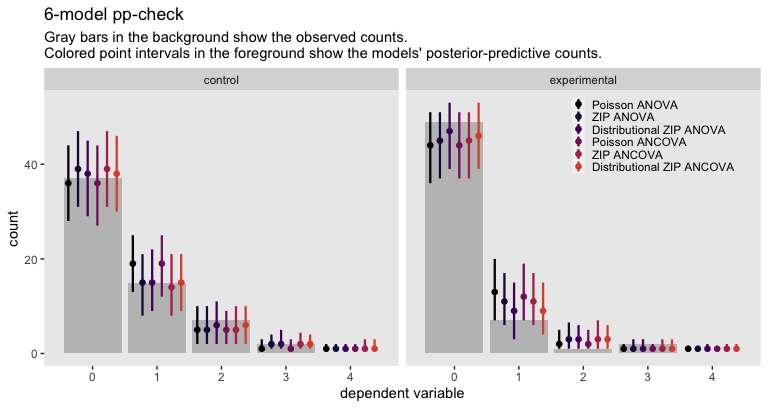<!-- -->

As the models were all similar by their information criterion estimates,
they are similar in their posterior-predictive checks, too. To my eye,
three overall patterns emerged. First, the ZIP models were a little
better at capturing the overall distributions than the Poisson models,
particularly with respect to the zero inflation. Second, the overall
pattern among the ANOVA models was largely replicated by the ANCOVA
models. Third, the ANCOVA models showed minimal differences from their
ANOVA counterparts, again showing our baseline covariates were of little
help in this case.

## Causal estimands

For this data set, we will explore three causal estimands. The first
will be the typical average treatment effect (ATE). The second will be
the average difference in $\mathbb{Var}(\text{deviation count}_i)$. The
final will be the average difference in the proportion of zero’s.

### $\tau_\text{ATE}$.

The `avg_comparisons()` function from **marginaleffects** makes it easy
to compute the ATE. Here we’ll compute the full posterior distributions
from each of the 6 models with help from the `posterior_draws()`
function, and save the summaries from each in an object called
`tau_ate`.

``` r
tau_ate <- bind_rows(
  # compute and combine
  avg_comparisons(fit1, variables = "blinding") %>% posterior_draws(),
  avg_comparisons(fit2, variables = "blinding") %>% posterior_draws(),
  avg_comparisons(fit3, variables = "blinding") %>% posterior_draws(),
  avg_comparisons(fit4, variables = "blinding") %>% posterior_draws(),
  avg_comparisons(fit5, variables = "blinding") %>% posterior_draws(),
  avg_comparisons(fit6, variables = "blinding") %>% posterior_draws()
  ) %>% 
  # wrangle
  mutate(fit = rep(str_c("fit", 1:6), each = n() / 6)) %>% 
  # summarize
  group_by(fit) %>% 
  summarise(mean = mean(draw),
            sd = sd(draw),
            ll = quantile(draw, probs = .025),
            ul = quantile(draw, probs = .975))

# what?
print(tau_ate)
```

    ## # A tibble: 6 × 5
    ##   fit     mean    sd     ll       ul
    ##   <chr>  <dbl> <dbl>  <dbl>    <dbl>
    ## 1 fit1  -0.239 0.103 -0.447 -0.0430 
    ## 2 fit2  -0.215 0.113 -0.444 -0.00464
    ## 3 fit3  -0.271 0.117 -0.505 -0.0426 
    ## 4 fit4  -0.244 0.102 -0.449 -0.0479 
    ## 5 fit5  -0.212 0.116 -0.443  0.0154 
    ## 6 fit6  -0.258 0.120 -0.495 -0.0313

The `sd` column shows the posterior standard deviation for each
$\hat \tau_\text{ATE}$. They are all pretty similar, but the overall
pattern appears that they are larger for more complex models, both
within ANOVA’s and ANCOVA’s, and between ANOVA’s and ANCOVA’s. Here are
the results in a coefficient plot.

``` r
tau_ate %>% 
  mutate(fit = factor(fit,
                      levels = str_c("fit", 1:6),
                      labels = c("Poisson ANOVA", "ZIP ANOVA", "Distributional ZIP ANOVA",
                                 "Poisson ANCOVA", "ZIP ANCOVA", "Distributional ZIP ANCOVA"))) %>% 
  
  ggplot(aes(x = mean, xmin = ll, xmax = ul, y = fit)) +
  geom_pointrange() +
  scale_x_continuous(expand = expansion(mult = 0.3)) +
  labs(x = expression(tau[ATE]),
       y = NULL) +
  theme(axis.text.y = element_text(hjust = 0))
```

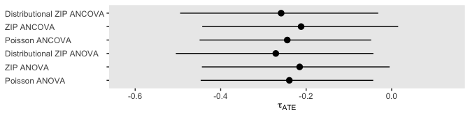<!-- -->

Overall, they’re all very similar.

### Differences in variance

As we learned before, we can define the variance for the criterion
variable of a ZIP model as

$$
\mathbb{Var}(y_i) = \lambda (1 - \pi) (1 + \pi \lambda).
$$

If you think of a conventional Poisson model as one for which $\pi = 0$,
this formula can apply to Poisson models, too. If you follow the
algebra, you’ll see the equation then simplifies to $\lambda$:

$$
\begin{align*}
\mathbb{Var}(y_i) & = \lambda (1 - \pi) (1 + \pi \lambda) \\
& = \lambda (1 - 0) (1 + 0 \lambda) \\
& = \lambda (1) (1) \\
& = \lambda.
\end{align*}
$$

For this section, I think it will be easiest to take an
`add_linpred_draws()` based workflow. As a first step, we’ll define the
predictor grid.

``` r
nd <- sarafoglou2023 %>% 
  select(id, tz, mz) %>% 
  expand_grid(blinding = 0:1)

# what?
glimpse(nd)
```

    ## Rows: 240
    ## Columns: 4
    ## $ id       <dbl> 3, 3, 4, 4, 5, 5, 6, 6, 7, 7, 8, 8, 9, 9, 10, 10, 11, 11, 12,…
    ## $ tz       <dbl> -0.5255202, -0.5255202, 0.2530283, 0.2530283, 1.0315768, 1.03…
    ## $ mz       <dbl> -0.04864922, -0.04864922, 1.41082727, 1.41082727, -0.04864922…
    ## $ blinding <int> 0, 1, 0, 1, 0, 1, 0, 1, 0, 1, 0, 1, 0, 1, 0, 1, 0, 1, 0, 1, 0…

Each case in the data now has two rows in the `nd` predictor grid, one
for each level of `blinding`. Now we feed the `nd` data into the
`add_linpred_draws()` function for each of the 6 models, define the
`lambda` and `pi` values for each case, wrangle, and save the results in
an object called `lambda_pi`.

``` r
lambda_pi <- bind_rows(
  # ANOVA's
  # fit1
  nd %>% 
    add_linpred_draws(fit1) %>% 
    ungroup() %>% 
    mutate(lambda = exp(.linpred),
           pi = 0,
           fit = "fit1") %>% 
    select(fit, id, blinding, .draw, lambda, pi),
  # fit2
  nd %>% 
    add_linpred_draws(fit2, dpar = "zi") %>% 
    ungroup() %>% 
    mutate(lambda = exp(.linpred),
           pi = plogis(zi),
           fit = "fit2") %>% 
    select(fit, id, blinding, .draw, lambda, pi),  
  # fit3
  nd %>% 
    add_linpred_draws(fit3, dpar = "zi") %>% 
    ungroup() %>% 
    mutate(lambda = exp(.linpred),
           pi = plogis(zi),
           fit = "fit3") %>% 
    select(fit, id, blinding, .draw, lambda, pi),
  # ANCVA's
  # fit4
  nd %>% 
    add_linpred_draws(fit4) %>% 
    ungroup() %>% 
    mutate(lambda = exp(.linpred),
           pi = 0,
           fit = "fit4") %>% 
    select(fit, id, blinding, .draw, lambda, pi),
  # fit5
  nd %>% 
    add_linpred_draws(fit5, dpar = "zi") %>% 
    ungroup() %>% 
    mutate(lambda = exp(.linpred),
           pi = plogis(zi),
           fit = "fit5") %>% 
    select(fit, id, blinding, .draw, lambda, pi),  
  # fit6
  nd %>% 
    add_linpred_draws(fit6, dpar = "zi") %>% 
    ungroup() %>% 
    mutate(lambda = exp(.linpred),
           pi = plogis(zi),
           fit = "fit6") %>% 
    select(fit, id, blinding, .draw, lambda, pi)
) 

# what?
glimpse(lambda_pi)
```

    ## Rows: 5,760,000
    ## Columns: 6
    ## $ fit      <chr> "fit1", "fit1", "fit1", "fit1", "fit1", "fit1", "fit1", "fit1…
    ## $ id       <dbl> 3, 3, 3, 3, 3, 3, 3, 3, 3, 3, 3, 3, 3, 3, 3, 3, 3, 3, 3, 3, 3…
    ## $ blinding <int> 0, 0, 0, 0, 0, 0, 0, 0, 0, 0, 0, 0, 0, 0, 0, 0, 0, 0, 0, 0, 0…
    ## $ .draw    <int> 1, 2, 3, 4, 5, 6, 7, 8, 9, 10, 11, 12, 13, 14, 15, 16, 17, 18…
    ## $ lambda   <dbl> 0.4874169, 0.4482759, 0.5538688, 0.5363352, 0.5504218, 0.5422…
    ## $ pi       <dbl> 0, 0, 0, 0, 0, 0, 0, 0, 0, 0, 0, 0, 0, 0, 0, 0, 0, 0, 0, 0, 0…

With the rather long `lambda_pi` data frame, we can make group summaries
for the counterfactual differences in variance, by each model. Here we
save those summary values as `v`, and then display the results.

``` r
v <- lambda_pi %>% 
  mutate(v = lambda * (1 - pi) * (1 + pi * lambda)) %>% 
  select(fit, id, blinding, .draw, v) %>% 
  pivot_wider(names_from = blinding, values_from = v) %>% 
  mutate(d = `1` - `0`) %>% 
  # first compute the contrast within each MCMC draw, by fit
  group_by(fit, .draw) %>% 
  summarise(d = mean(d)) %>% 
  select(fit, d) %>% 
  # now summarize the ATE across the MCMC draws
  group_by(fit) %>% 
  summarise(mean = mean(d),
            sd = sd(d),
            ll = quantile(d, probs = .025),
            ul = quantile(d, probs = .975))

# what?
print(v)
```

    ## # A tibble: 6 × 5
    ##   fit     mean    sd     ll       ul
    ##   <chr>  <dbl> <dbl>  <dbl>    <dbl>
    ## 1 fit1  -0.239 0.103 -0.447 -0.0430 
    ## 2 fit2  -0.232 0.135 -0.527 -0.00541
    ## 3 fit3  -0.293 0.179 -0.651  0.0627 
    ## 4 fit4  -0.244 0.102 -0.449 -0.0479 
    ## 5 fit5  -0.241 0.148 -0.571  0.0176 
    ## 6 fit6  -0.303 0.196 -0.703  0.0594

Now these summaries are the causal effects for the differences in
variances for `deviation_count`, expressed as
$\mathbb{E}\left[\mathbb{Var}(y_i^1) - \mathbb{Var}(y_i^0) \mid \mathbf C_i \right]$.
You’ll note that because they are both conventional Poisson models, the
results for `fit1` and `fit4` are identical, here, to those from the
last section where we considered $\hat \tau_\text{ATE}$ because, with
the Poisson, the mean is the same as the variance. For the ZIP models,
the results differ.

Here we compute and save the sample difference in variances.

``` r
d_v <- sarafoglou2023 %>% 
  group_by(blinding) %>% 
  summarise(v = var(deviation_count)) %>% 
  pivot_wider(names_from = blinding, values_from = v) %>% 
  mutate(d = `1` - `0`) %>% 
  pull(d)

# what?
d_v
```

    ## [1] -0.2477182

Here are the results in a coefficient plot.

``` r
v %>% 
  mutate(fit = factor(fit,
                      levels = str_c("fit", 1:6),
                      labels = c("Poisson ANOVA", "ZIP ANOVA", "Distributional ZIP ANOVA",
                                 "Poisson ANCOVA", "ZIP ANCOVA", "Distributional ZIP ANCOVA"))) %>% 
  
  ggplot(aes(x = mean, xmin = ll, xmax = ul, y = fit)) +
  geom_vline(xintercept = d_v, linetype = 2) +
  geom_pointrange() +
  scale_x_continuous(expand = expansion(mult = 0.3)) +
  labs(title = expression(Group~variances~computed~with~lambda(1-pi)(1+pi*lambda)),
       x = expression(tau[Var]),
       y = NULL) +
  theme(axis.text.y = element_text(hjust = 0))
```

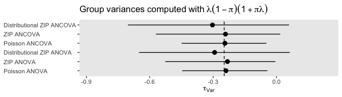<!-- -->

The Poisson models are very confident about the variance differences.
The ZIP model are less so.

### Differences in proportion of zero’s

Since we know know Poisson models can be expressed in terms of $\lambda$
and $\pi$, given we set $\pi = 0$, we can also use the following formula
to compute the proportion of expected zero’s for each model as

$$
\Pr(y = 0) = \pi + (1 - \pi)  \exp(-\lambda),
$$

which just simplifies to $\exp(-\lambda)$ for the Poisson models.
Starting with the `lambda_pi` data frame from above, here we compute
that value for each level of `blinding` across all 6 models, compute the
contrasts, summarize, and save the results as `z`. Then we display the
`z` summaries.

``` r
z <- lambda_pi %>% 
  mutate(z = pi + (1 - pi) * exp(-lambda)) %>% 
  select(fit, id, blinding, .draw, z) %>% 
  pivot_wider(names_from = blinding, values_from = z) %>% 
  mutate(d = `1` - `0`) %>% 
  # first compute the contrast within each MCMC draw, by fit
  group_by(fit, .draw) %>% 
  summarise(d = mean(d)) %>% 
  select(fit, d) %>% 
  # now summarize the ATE across the MCMC draws
  group_by(fit) %>% 
  summarise(mean = mean(d),
            sd = sd(d),
            ll = quantile(d, probs = .025),
            ul = quantile(d, probs = .975))

# what?
print(z)
```

    ## # A tibble: 6 × 5
    ##   fit     mean     sd       ll    ul
    ##   <chr>  <dbl>  <dbl>    <dbl> <dbl>
    ## 1 fit1  0.158  0.0656  0.0282  0.285
    ## 2 fit2  0.0720 0.0362  0.00153 0.143
    ## 3 fit3  0.175  0.0666  0.0417  0.300
    ## 4 fit4  0.159  0.0642  0.0313  0.282
    ## 5 fit5  0.0689 0.0362 -0.00466 0.138
    ## 6 fit6  0.159  0.0657  0.0333  0.285

Here is the sample difference.

``` r
d_z <- sarafoglou2023 %>% 
  group_by(blinding) %>% 
  summarise(z = mean(deviation_count == 0)) %>% 
  pivot_wider(names_from = blinding, values_from = z) %>% 
  mutate(d = `1` - `0`) %>% 
  pull(d)

# what?
d_z
```

    ## [1] 0.2239511

Now here are the summaries in a coefficient plot.

``` r
z %>% 
  mutate(fit = factor(fit,
                      levels = str_c("fit", 1:6),
                      labels = c("Poisson ANOVA", "ZIP ANOVA", "Distributional ZIP ANOVA",
                                 "Poisson ANCOVA", "ZIP ANCOVA", "Distributional ZIP ANCOVA"))) %>% 
  
  ggplot(aes(x = mean, xmin = ll, xmax = ul, y = fit)) +
  geom_vline(xintercept = d_z, linetype = 2) +
  geom_pointrange() +
  scale_x_continuous(limits = c(-0.5, 0.5)) +
  labs(title = expression(Group~proportions~computed~with~pi+(1-pi)*exp(-lambda)),
       x = expression(tau[Pr(italic(Y)==0)]),
       y = NULL) +
  theme(axis.text.y = element_text(hjust = 0))
```

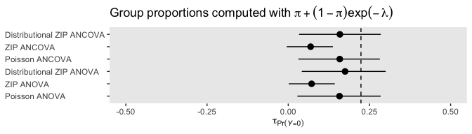<!-- -->

Interestingly, this time the simple ZIP models differ from the other
kinds of models. In all cases, it appears we should expect more zero’s
for the analysis blinding group, though there’s considerable uncertainty
about the magnitude of the difference.

## Other extensions

The ZIP model a fine strategy to have at your disposal when you have a
lot of zero’s in your counts, and it seems like it was a decent fit for
the `sarafoglou2023` data. We have even more options. For example, the
zero-inflated negative binomial (ZINB) is a great choice if you have
both extra zero’s and overdispersion. Hurdle models provide an
alternative approach when all the non-zero counts are seen as part of a
fundamentally different process than all the zero’s, and you can fit
either hurdle Poisson (HP) or hurdle negative binomial (HNB) models.
These options are all available in **brms** by setting
`family = zero_inflated_negbinomial()`, `family = hurdle_poisson()` or
`family = hurdle_negbinomial()`, and I’d even recommend trying these out
on the `sarafoglou2023` data for practice.

Do note that similar to the ZIP, the parameters in these three
alternative models have complex relations with the population mean and
variance. You can compute the means for each model with the following
formulas:

$$
\mathbb{E}(y_i)_\text{ZINB} = \mu (1 - \pi)
$$

$$
\mathbb{E}(y_i)_\text{HP} = \mu\frac{1 - \pi}{1 - \exp(-\mu)}
$$

$$
\mathbb{E}(y_i)_\text{HNB} = \mu (1 - \pi) \left [1 - \left ( \frac{\phi}{\mu + \phi} \right )^\phi \right ]^{-1},
$$

where $\pi$ is the zero-inflation parameter for the ZINB, but stands for
the total proportion of zero’s in the HP and HNB models, and the $\phi$
parameter is the typical **brms** precision parameter for the negative
binomial likelihood. You can compute the variances with the formulas:

$$
\mathbb{Var}(y_i)_\text{ZINB} = \mu (1 - \pi) (1 + (\pi + 1/\phi)\mu)
$$

$$
\mathbb{Var}(y_i)_\text{HP} = \left [ (\mu + \mu^2)\frac{1 - \pi}{1 - \exp(-\mu)}  \right ] - \left [ \mu \frac{1 - \pi}{1 - \exp(-\mu)} \right ]^2
$$ $$
\mathbb{Var}(y_i)_\text{HNB} = \mu (1 - \pi) \left [1 - \left ( \frac{\phi}{\mu + \phi} \right )^\phi \right ]^{-1} \left \{ \frac{\phi + \mu (\phi + 1)}{\phi} - \mu (1 - \pi) \left [1 - \left ( \frac{\phi}{\mu + \phi} \right )^\phi \right ]^{-1}  \right \},
$$

which are admittedly baffling at first glance. This all just takes
practice. If you’re curious, you can find these formulas scattered in
the literature, such as in part in Feng (2021;
<https://doi.org/10.1186/s40488-021-00121-4>), Zou et al (2021;
<https://doi.org/10.3390/e23091206>) and the dissertation by Bhaktha
(2018; [link
here](https://etd.ohiolink.edu/apexprod/rws_etd/send_file/send?accession=osu1543573678017356&disposition=inline)),
or more completely, but in a somewhat different format, in the text by
Zuur et al (2009; [*Mixed Effects Models and Extensions in Ecology with
R*](https://link.springer.com/book/10.1007/978-0-387-87458-6)).

## Session information

``` r
sessionInfo()
```

    ## R version 4.3.0 (2023-04-21)
    ## Platform: aarch64-apple-darwin20 (64-bit)
    ## Running under: macOS Ventura 13.4
    ## 
    ## Matrix products: default
    ## BLAS:   /Library/Frameworks/R.framework/Versions/4.3-arm64/Resources/lib/libRblas.0.dylib 
    ## LAPACK: /Library/Frameworks/R.framework/Versions/4.3-arm64/Resources/lib/libRlapack.dylib;  LAPACK version 3.11.0
    ## 
    ## locale:
    ## [1] en_US.UTF-8/en_US.UTF-8/en_US.UTF-8/C/en_US.UTF-8/en_US.UTF-8
    ## 
    ## time zone: America/Chicago
    ## tzcode source: internal
    ## 
    ## attached base packages:
    ## [1] stats     graphics  grDevices utils     datasets  methods   base     
    ## 
    ## other attached packages:
    ##  [1] marginaleffects_0.12.0 patchwork_1.1.2        tidybayes_3.0.4       
    ##  [4] brms_2.19.0            Rcpp_1.0.10            lubridate_1.9.2       
    ##  [7] forcats_1.0.0          stringr_1.5.0          dplyr_1.1.2           
    ## [10] purrr_1.0.1            readr_2.1.4            tidyr_1.3.0           
    ## [13] tibble_3.2.1           ggplot2_3.4.2          tidyverse_2.0.0       
    ## 
    ## loaded via a namespace (and not attached):
    ##   [1] tensorA_0.36.2       rstudioapi_0.14      magrittr_2.0.3      
    ##   [4] TH.data_1.1-2        estimability_1.4.1   farver_2.1.1        
    ##   [7] nloptr_2.0.3         rmarkdown_2.22       vctrs_0.6.3         
    ##  [10] minqa_1.2.5          base64enc_0.1-3      htmltools_0.5.5     
    ##  [13] distributional_0.3.2 StanHeaders_2.26.27  htmlwidgets_1.6.2   
    ##  [16] plyr_1.8.8           sandwich_3.0-2       emmeans_1.8.6       
    ##  [19] zoo_1.8-12           igraph_1.4.3         mime_0.12           
    ##  [22] lifecycle_1.0.3      pkgconfig_2.0.3      colourpicker_1.2.0  
    ##  [25] Matrix_1.5-4         R6_2.5.1             fastmap_1.1.1       
    ##  [28] collapse_1.9.6       shiny_1.7.4          digest_0.6.31       
    ##  [31] numDeriv_2016.8-1.1  colorspace_2.1-0     ps_1.7.5            
    ##  [34] crosstalk_1.2.0      projpred_2.6.0       labeling_0.4.2      
    ##  [37] fansi_1.0.4          timechange_0.2.0     abind_1.4-5         
    ##  [40] mgcv_1.8-42          compiler_4.3.0       bit64_4.0.5         
    ##  [43] withr_2.5.0          backports_1.4.1      inline_0.3.19       
    ##  [46] shinystan_2.6.0      gamm4_0.2-6          pkgbuild_1.4.1      
    ##  [49] highr_0.10           MASS_7.3-58.4        gtools_3.9.4        
    ##  [52] loo_2.6.0            tools_4.3.0          httpuv_1.6.11       
    ##  [55] threejs_0.3.3        glue_1.6.2           callr_3.7.3         
    ##  [58] nlme_3.1-162         promises_1.2.0.1     grid_4.3.0          
    ##  [61] checkmate_2.2.0      reshape2_1.4.4       generics_0.1.3      
    ##  [64] gtable_0.3.3         tzdb_0.4.0           data.table_1.14.8   
    ##  [67] hms_1.1.3            utf8_1.2.3           pillar_1.9.0        
    ##  [70] ggdist_3.3.0         markdown_1.7         vroom_1.6.3         
    ##  [73] posterior_1.4.1      later_1.3.1          splines_4.3.0       
    ##  [76] lattice_0.21-8       survival_3.5-5       bit_4.0.5           
    ##  [79] tidyselect_1.2.0     miniUI_0.1.1.1       knitr_1.43          
    ##  [82] arrayhelpers_1.1-0   gridExtra_2.3        stats4_4.3.0        
    ##  [85] xfun_0.39            bridgesampling_1.1-2 matrixStats_1.0.0   
    ##  [88] DT_0.28              rstan_2.21.8         stringi_1.7.12      
    ##  [91] yaml_2.3.7           boot_1.3-28.1        evaluate_0.21       
    ##  [94] codetools_0.2-19     cli_3.6.1            RcppParallel_5.1.7  
    ##  [97] shinythemes_1.2.0    xtable_1.8-4         munsell_0.5.0       
    ## [100] processx_3.8.1       coda_0.19-4          svUnit_1.0.6        
    ## [103] parallel_4.3.0       rstantools_2.3.1     ellipsis_0.3.2      
    ## [106] prettyunits_1.1.1    dygraphs_1.1.1.6     bayesplot_1.10.0    
    ## [109] Brobdingnag_1.2-9    lme4_1.1-33          viridisLite_0.4.2   
    ## [112] mvtnorm_1.2-2        scales_1.2.1         xts_0.13.1          
    ## [115] insight_0.19.2       crayon_1.5.2         rlang_1.1.1         
    ## [118] multcomp_1.4-24      shinyjs_2.1.0
