Wagenmakers et al (2016), Albohn only
================
A Solomon Kurz
2022-06-22

Using a registered replication report approach, Wagenmakers and
colleagues (2016; <https://doi.org/10.1177/1745691616674458>) replicated
Study 1 from the highly-cited paper by Strack, Martin, and Stepper
(1988; <https://doi.org/10.1037/0022-3514.54.5.768>). In 17 labs across
several countries, participants were randomized into the *pout* or
*smile* conditions. The primary variable is the ratings on 4
moderately-funny cartoons. Within our experimental design framework, we
can think of this as a posttest-only two-group design.

For the sake of this file, we will analyze the data from one of the
labs.

## Data

Wagenmakers and colleagues kindly made their data, materials, and code
public on the OSF at <https://osf.io/hgi2y/>.

Load the data and the primary **R** packages.

``` r
# packages
# library(tidyverse)

library(ggplot2)
library(tibble)
library(dplyr)
library(tidyr)
library(stringr)
library(purrr)
library(readr)
library(forcats)

library(brms)
library(tidybayes)
library(patchwork)

# load the data
load(file = "data/wagenmakers2016.rda")

# what is this?
glimpse(wagenmakers2016)
```

    ## Rows: 2,612
    ## Columns: 24
    ## $ lab                                   <chr> "Albohn", "Albohn", "Albohn", "Albohn", "Albohn", "Albohn", "A…
    ## $ sn                                    <int> 1, 2, 3, 4, 5, 6, 7, 8, 9, 10, 11, 12, 13, 14, 15, 16, 17, 18,…
    ## $ subject_no                            <dbl> 1, 2, 3, 4, 5, 6, 7, 8, 9, 10, 11, 12, 13, 14, 15, 16, 17, 18,…
    ## $ participant_id                        <chr> "1001", "1002", "1003", "1004", "1005", "1006", "1007", "1008"…
    ## $ condition                             <dbl> 1, 0, 0, 0, 1, 1, NA, 0, 0, 0, 1, 1, 0, 0, 1, 0, 1, 1, 0, 1, 1…
    ## $ correct1                              <dbl> 0, 1, 1, 0, 1, 1, NA, 1, 1, 1, 1, 1, 0, 1, 1, 1, 1, 1, 1, 1, 1…
    ## $ correct2                              <dbl> 0, 1, 1, 0, 1, 1, NA, 1, 1, 1, 1, 1, 0, 1, 1, 1, 1, 1, 1, 1, 1…
    ## $ correct3                              <dbl> 0, 1, 1, 0, 1, 1, NA, 1, 1, 1, 1, 1, 0, 1, 1, 1, 1, 1, 1, 1, 1…
    ## $ correct4                              <dbl> 0, 1, 1, 0, 1, 1, NA, 1, 1, 1, 1, 1, 0, 1, 1, 1, 1, 1, 1, 1, 1…
    ## $ correct_total                         <dbl> 0, 4, 4, 0, 4, 4, NA, 4, 4, 4, 4, 4, 0, 4, 4, 4, 4, 4, 4, 4, 4…
    ## $ task1                                 <dbl> 3, 5, 9, 1, 6, 6, NA, 7, 5, 5, 6, 6, 3, 6, 9, 3, 7, 6, 7, 7, 1…
    ## $ task2                                 <dbl> 2, 7, 7, 1, 3, 2, NA, 4, 4, 6, 3, 6, 6, 5, 4, 5, 3, 2, 8, 8, 1…
    ## $ rating1                               <dbl> 8, 5, 0, 3, 4, 5, NA, 2, 5, 3, 3, 3, 1, 5, 4, 1, 7, 3, 2, 5, 2…
    ## $ rating2                               <dbl> NA, 4, 0, 4, 7, 5, NA, 5, 6, 3, 3, 6, 0, 6, 8, 1, 6, 6, 5, 6, …
    ## $ rating3                               <dbl> NA, 6, 1, 3, 5, 4, NA, 3, 3, 2, 3, 5, 0, 5, 0, 1, 3, 3, 3, 6, …
    ## $ rating4                               <dbl> NA, 7, 0, 2, 3, 6, NA, 0, 5, 5, 5, 7, 0, 5, 1, 2, 5, 5, 2, 8, …
    ## $ self_reported_task_performance        <dbl> NA, 7, 5, 4, 7, 4, NA, 8, 4, 3, 3, 4, 7, 9, 8, 7, 2, 9, 7, 4, …
    ## $ comprehended_cartoons                 <dbl> 1, 1, 1, 2, 1, 1, NA, 1, 1, 1, 1, 1, 2, 1, 1, 1, 1, 1, 1, 1, 1…
    ## $ aware_of_the_goal                     <dbl> NA, 0, 0, 0, 0, 0, NA, 0, 0, 0, 0, 0, 1, 0, 0, 0, 0, 0, 0, 0, …
    ## $ participants_guess_of_the_studys_goal <chr> NA, "To track how well people listen / take odd requests serio…
    ## $ age                                   <dbl> 18, 18, 21, 18, 19, 18, NA, 18, 18, 18, 19, 18, 18, 18, 18, 18…
    ## $ gender                                <dbl> 1, 0, 0, 0, 1, 1, NA, 1, 0, 0, 0, 0, 0, 0, 0, 0, 0, 0, 1, 1, 1…
    ## $ student                               <dbl> 1, 1, 1, 1, 1, 1, NA, 1, 1, 1, 1, 1, 1, 1, 1, 1, 1, 1, 1, 1, 1…
    ## $ occupation_or_field_of_study          <chr> "Business", "Business", "Psychology", "Biology", "Finance", "E…

The full `wagenmakers2016` data set contains data from 17 reserach labs.
In this file, we’ll focus on the data collected by the Albohn lab. Here
we subset the `wagenmakers2016` data frame and save the results as
`albohn`.

``` r
albohn <- wagenmakers2016 %>% 
  filter(lab == "Albohn")
```

Wagenmakers and colleagues had several exclusion criteria, which they
detailed in the *Exclusion criteria* subsection of their *Method*
(pp. 4-5). They excluded the data from participants

-   whose average cartoon rating exceeded 2.5 standard deviations from
    the group mean in their condition,
-   who correctly guessed the goal of the study,
-   who answered “No” to the question “Did you understand the
    cartoons?”, and
-   who held the pen incorrectly for two or more of the four cartoons.

In this analysis, we will exclude participants based on the latter three
criteria. However, I am apposed to removing data from those whose
average ratings are 2.5 standard deviations from the group mean. A good
model should be able to handle unusual observations, like that. Here we
prune the data.

``` r
# start with n = 166
albohn <- albohn %>% 
  # n = 161 (drop 2 who were 1 and 3 who were NA)
  filter(aware_of_the_goal == 0) %>% 
  # n = 151 (drop 8 who were 2 and 2 who were NA)
  filter(comprehended_cartoons == 1) %>% 
  # n = 140 (drop 11 who were 0)
  filter(correct_total > 2)

# new sample size, by condition
albohn %>% 
  count(condition)
```

    ## # A tibble: 2 × 2
    ##   condition     n
    ##       <dbl> <int>
    ## 1         0    72
    ## 2         1    68

Data from 140 participants remain. Happily, the group sizes are similar.

Now we’ll simplify the data by removing the unnecessary columns and then
make the data long with respect to the four cartoons.

``` r
albohn <- albohn %>% 
  select(sn, rating1:rating4, condition) %>% 
  # convert to the long format W/R/T cartoon
  pivot_longer(rating1:rating4,
               names_to = "cartoon",
               values_to = "rating") %>% 
  mutate(cartoon = str_remove(cartoon, "rating") %>% as.double()) %>% 
  mutate(ratingf    = factor(rating, levels = 0:9, ordered = TRUE),
         conditionf = ifelse(condition == 0, "pout", "smile"))

# what is this?
head(albohn)
```

    ## # A tibble: 6 × 6
    ##      sn condition cartoon rating ratingf conditionf
    ##   <int>     <dbl>   <dbl>  <dbl> <ord>   <chr>     
    ## 1     2         0       1      5 5       pout      
    ## 2     2         0       2      4 4       pout      
    ## 3     2         0       3      6 6       pout      
    ## 4     2         0       4      7 7       pout      
    ## 5     3         0       1      0 0       pout      
    ## 6     3         0       2      0 0       pout

The remaining columns in the data are:

-   `sn` is the participant index.
-   `condition` is the dummy-coded experimental index for which `0` is
    the pout condition and `1` is the smiling condition.
-   `cartoon` is the index for the four *Far Side* cartoons.
-   `rating` is the rating for the cartoons on the 0-9 Likert-type
    scale, saved as a numeral.
-   `ratingf` is the ordered factor version of `rating`.
-   `conditionf` is the factor version of `condition`.

### EDA.

For our exploratory data analyses, it might help if we start with
faceted bar plot.

``` r
albohn %>% 
  mutate(cartoon = str_c("cartoon: ", cartoon)) %>% 
  
  ggplot(aes(x = rating)) +
  geom_bar() +
  scale_x_continuous(breaks = 0:9) +
  facet_grid(conditionf ~ cartoon) +
  theme(panel.grid = element_blank())
```

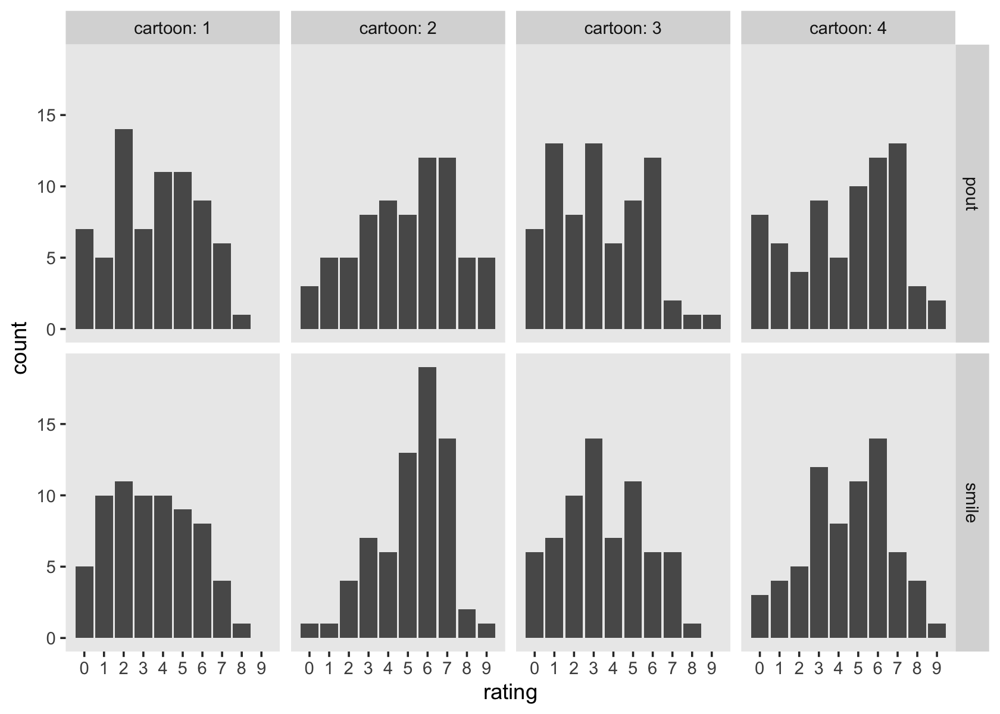

Here are some of the descriptive statistics.

``` r
albohn %>% 
  group_by(condition, cartoon) %>% 
  summarise(mean = mean(rating, na.rm = T),
            sd = sd(rating, na.rm = T),
            min = min(rating, na.rm = T),
            max = max(rating, na.rm = T),
            n = n(),
            n_missing = sum(is.na(rating)))
```

    ## # A tibble: 8 × 8
    ## # Groups:   condition [2]
    ##   condition cartoon  mean    sd   min   max     n n_missing
    ##       <dbl>   <dbl> <dbl> <dbl> <dbl> <dbl> <int>     <int>
    ## 1         0       1  3.62  2.16     0     8    72         1
    ## 2         0       2  4.94  2.45     0     9    72         0
    ## 3         0       3  3.33  2.25     0     9    72         0
    ## 4         0       4  4.39  2.57     0     9    72         0
    ## 5         1       1  3.40  2.09     0     8    68         0
    ## 6         1       2  5.24  1.80     0     9    68         0
    ## 7         1       3  3.5   2.12     0     8    68         0
    ## 8         1       4  4.47  2.15     0     9    68         0

To get a sense of the participant- and condition-level variation in
these, we’ll plot.

``` r
albohn %>% 
  group_by(conditionf, sn) %>% 
  summarise(mean = mean(rating, na.rm = T),
            sd = sd(rating, na.rm = T),
            min = min(rating, na.rm = T),
            max = max(rating, na.rm = T)) %>% 
  pivot_longer(mean:max, names_to = "statistic") %>% 
  mutate(statistic = factor(statistic, levels = c("mean", "sd", "min", "max"))) %>% 
  
  ggplot(aes(x = value)) +
  geom_histogram(binwidth = 0.25) +
  facet_grid(conditionf ~ statistic, scales = "free_x") +
  theme(panel.grid = element_blank())
```

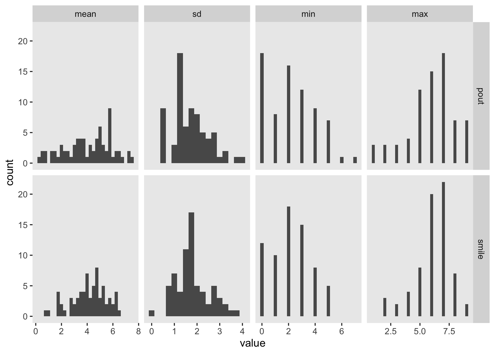

So some of the challenges for these data are:

-   one missing value,
-   differences in variances across cartoons and participants,
-   clear lower and upper boundaries, and
-   a multi-factorial multilevel structure.

## Modeling strategy

In this file, we’ll explore two broad analytic strategies:

1)  The first class of strategies include modeling the data as
    approximately continuous with the conventional Gaussian likelihood.
    After first fitting a simple multilevel model, we will then expand
    to a full mixed-effects location and scale (MELSM) model.
2)  The second class of strategies include modeling the data as ordinal.
    After first fitting a multilevel cumulative probit model, we will
    then expand to a cumulative-probit variant of the MELSM.

## Gaussian models

### Conventional multilevel model.

If were to think of the `rating` values as varying across

persons,

experimental trials and

cartoons, we could describe them as approximately-normally distributed
with the model

![
\\begin{align\*}
\\text{rating}\_{ijk} & \\sim \\mathcal N(\\mu\_{ijk}, \\sigma\_\\epsilon) \\\\
\\mu\_{ijk} & = \\beta_0 + \\beta_1 \\text{condition}\_{ik} + u_i + v\_{0k} + v\_{1k} \\text{condition}\_{ik} \\\\
u_i & \\sim \\mathcal N(0, \\sigma_u) \\\\
\\begin{bmatrix} v\_{0k} \\\\ v\_{1k} \\end{bmatrix} & \\sim \\mathcal N \\left ( 
  \\mathbf 0, \\mathbf{SRS}
  \\right) \\\\
\\mathbf S & = \\begin{bmatrix} \\sigma\_{0k} \\\\ 1 & \\sigma\_{1k} \\end{bmatrix} \\\\
\\mathbf R & = \\begin{bmatrix} 1 \\\\ \\rho & 1 \\end{bmatrix},
\\end{align\*}
](https://latex.codecogs.com/png.image?%5Cdpi%7B110%7D&space;%5Cbg_white&space;%0A%5Cbegin%7Balign%2A%7D%0A%5Ctext%7Brating%7D_%7Bijk%7D%20%26%20%5Csim%20%5Cmathcal%20N%28%5Cmu_%7Bijk%7D%2C%20%5Csigma_%5Cepsilon%29%20%5C%5C%0A%5Cmu_%7Bijk%7D%20%26%20%3D%20%5Cbeta_0%20%2B%20%5Cbeta_1%20%5Ctext%7Bcondition%7D_%7Bik%7D%20%2B%20u_i%20%2B%20v_%7B0k%7D%20%2B%20v_%7B1k%7D%20%5Ctext%7Bcondition%7D_%7Bik%7D%20%5C%5C%0Au_i%20%26%20%5Csim%20%5Cmathcal%20N%280%2C%20%5Csigma_u%29%20%5C%5C%0A%5Cbegin%7Bbmatrix%7D%20v_%7B0k%7D%20%5C%5C%20v_%7B1k%7D%20%5Cend%7Bbmatrix%7D%20%26%20%5Csim%20%5Cmathcal%20N%20%5Cleft%20%28%20%0A%20%20%5Cmathbf%200%2C%20%5Cmathbf%7BSRS%7D%0A%20%20%5Cright%29%20%5C%5C%0A%5Cmathbf%20S%20%26%20%3D%20%5Cbegin%7Bbmatrix%7D%20%5Csigma_%7B0k%7D%20%5C%5C%201%20%26%20%5Csigma_%7B1k%7D%20%5Cend%7Bbmatrix%7D%20%5C%5C%0A%5Cmathbf%20R%20%26%20%3D%20%5Cbegin%7Bbmatrix%7D%201%20%5C%5C%20%5Crho%20%26%201%20%5Cend%7Bbmatrix%7D%2C%0A%5Cend%7Balign%2A%7D%0A "
\begin{align*}
\text{rating}_{ijk} & \sim \mathcal N(\mu_{ijk}, \sigma_\epsilon) \\
\mu_{ijk} & = \beta_0 + \beta_1 \text{condition}_{ik} + u_i + v_{0k} + v_{1k} \text{condition}_{ik} \\
u_i & \sim \mathcal N(0, \sigma_u) \\
\begin{bmatrix} v_{0k} \\ v_{1k} \end{bmatrix} & \sim \mathcal N \left ( 
  \mathbf 0, \mathbf{SRS}
  \right) \\
\mathbf S & = \begin{bmatrix} \sigma_{0k} \\ 1 & \sigma_{1k} \end{bmatrix} \\
\mathbf R & = \begin{bmatrix} 1 \\ \rho & 1 \end{bmatrix},
\end{align*}
")

where

is the grand mean for the pout condition (`condition == 0`) and

is the deviation in the grand mean for the smile condition
(`condition == 1`), relative to the pout condition. The

parameter captures person-level deviations around the grand mean, across
conditions, which is modeled as normal with a standard deviation
.
The

parameter captures cartoon-level deviations around the grand mean in the
pout condition and

captures cartoon-level deviations around the difference in the grand
mean for the smile condition. The two cartoon-level deviation parameters
are modeled as bivariate normal with a variance/covariance matrix that
has been decomposed into

matrix for the standard deviations
")
and a

matrix for their correlation
").

Note that we have grouped our three deviation parameters into one
parameter capturing person-level differences and two parameters
capturing cartoon-level differences. These two groups are modeled as
orthogonal in that

does not covary with

or
.
Thus, you could describe this model as *cross-classified*.

The next challenge is determining how to set the priors. On page 3,
Wagenmakers and colleagues reported their four cartoons were based on
pilot data from

students of the University of Amsterdam. If you look through the
supplemental materials on the OSF, you will find the means and standard
deviations for those cartoons at <https://osf.io/6qnhg/>. Here we use
those to compute the grand mean and pooled standard deviation.

``` r
# grand mean
mean(c(4.37, 4.05, 4.53, 4.64))
```

    ## [1] 4.3975

``` r
# pooled standard deviation
sqrt((2.42^2 + 2.08^2 + 2.37^2 + 2.31^2) / 4)
```

    ## [1] 2.298684

If you look at the Table 1 (p. 772), you’ll see the means are similar to
those reported in the original study by Strack and colleagues. You’ll
further learn that in the original study, the grand mean for the pout
condition was 4.32 and the grand mean for the smile condition was 5.14,
for a mean difference of 0.82.

One way to use this information would be be to set a
")
prior on the grand mean for the frown condition
")
and a fairly permissive
")
prior on the difference in the smile condition
").
In this model,

is our analogue to the pooled standard deviation, so we might use
").
To give a sense, here are the area plots for
")
and
")
on the scale of the data.

``` r
tibble(rating = seq(from = 0, to = 9, by = 0.05)) %>% 
  mutate(density = dnorm(rating, mean = 4.4, sd = 1)) %>% 
  ggplot(aes(x = rating, y = density)) +
  geom_area() +
  scale_x_continuous(breaks = 0:9) +
  theme(panel.grid = element_blank())
```

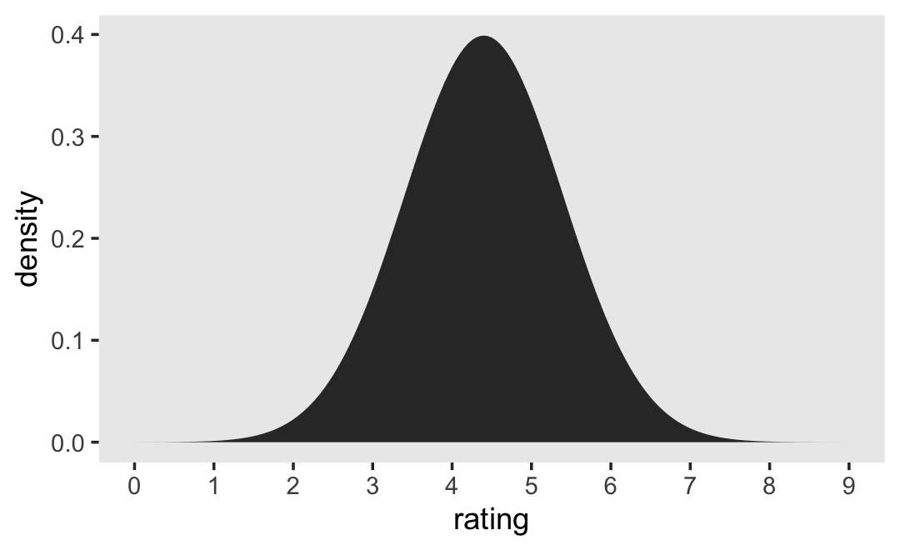

``` r
# 1 / 2.298684 is about 0.435
tibble(sd = seq(from = 0, to = 5, by = 0.05)) %>% 
  mutate(density = dexp(sd, rate = 0.435)) %>% 
  ggplot(aes(x = sd, y = density)) +
  geom_area() +
  scale_x_continuous(expression(sigma),
                     breaks = c(0, 2.298684, 4.5),
                     labels = c("0", 2.298684, "4.5")) +
  coord_cartesian(xlim = c(0, 4.5)) +
  theme(panel.grid = element_blank())
```

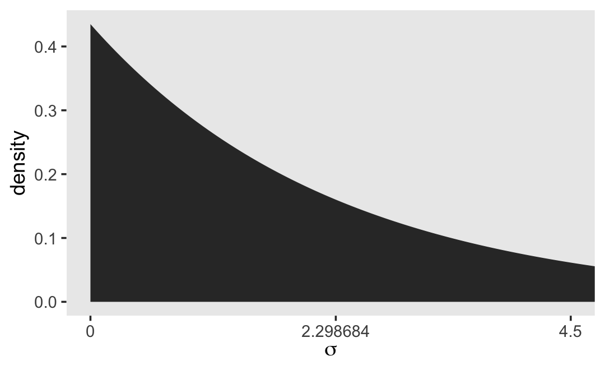

Notice the restricted range in the plot for the

prior. Based on [Popoviciu’s
inequality](https://en.wikipedia.org/wiki/Popoviciu%27s_inequality_on_variances),
we can compute the upper bound for a variance parameter for data with
clearly-defined lower and upper bounds. With our 0-9 rating scale, the
largest variance possible is 20.25 which means the largest standard
deviation possible is 4.5.

``` r
highest <- 9
lowest <- 0

# max variance
(highest - lowest)^2 / 4
```

    ## [1] 20.25

``` r
# max SD
sqrt((highest - lowest)^2 / 4)
```

    ## [1] 4.5

With the
")
prior, 86% of the prior mass is below the upper limit.

``` r
pexp(q = 4.5, rate = 0.435)
```

    ## [1] 0.858789

We might further use the
")
prior for the level-2

parameters, though one could argue for using a more conservative prior,
like
").
Finally, we might use the weakly-regularizing LKJ with

for the

matrix. That would make the full model

![
\\begin{align\*}
\\text{rating}\_{ijk} & \\sim \\mathcal N(\\mu\_{ijk}, \\sigma\_\\epsilon) \\\\
\\mu\_{ijk} & = \\beta_0 + \\beta_1 \\text{condition}\_{ik} + u_i + v\_{0k} + v\_{1k} \\text{condition}\_{ik} \\\\
u_i & \\sim \\mathcal N(0, \\sigma_u) \\\\
\\begin{bmatrix} v\_{0k} \\\\ v\_{1k} \\end{bmatrix} & \\sim \\mathcal N(\\mathbf 0, \\mathbf{SRS}) \\\\
\\mathbf S & = \\begin{bmatrix} \\sigma\_{0k} \\\\ 1 & \\sigma\_{1k} \\end{bmatrix} \\\\
\\mathbf R & = \\begin{bmatrix} 1 \\\\ \\rho & 1 \\end{bmatrix} \\\\
\\beta_0 & \\sim \\mathcal N(4.4, 1) \\\\ 
\\beta_1 & \\sim \\mathcal N(0, 1) \\\\ 
\\sigma\_\\epsilon, \\dots, \\sigma\_{1k} & \\sim \\operatorname{Exponential}(1 / 2.3) \\\\
\\mathbf R & \\sim \\operatorname{LKJ}(2).
\\end{align\*}
](https://latex.codecogs.com/png.image?%5Cdpi%7B110%7D&space;%5Cbg_white&space;%0A%5Cbegin%7Balign%2A%7D%0A%5Ctext%7Brating%7D_%7Bijk%7D%20%26%20%5Csim%20%5Cmathcal%20N%28%5Cmu_%7Bijk%7D%2C%20%5Csigma_%5Cepsilon%29%20%5C%5C%0A%5Cmu_%7Bijk%7D%20%26%20%3D%20%5Cbeta_0%20%2B%20%5Cbeta_1%20%5Ctext%7Bcondition%7D_%7Bik%7D%20%2B%20u_i%20%2B%20v_%7B0k%7D%20%2B%20v_%7B1k%7D%20%5Ctext%7Bcondition%7D_%7Bik%7D%20%5C%5C%0Au_i%20%26%20%5Csim%20%5Cmathcal%20N%280%2C%20%5Csigma_u%29%20%5C%5C%0A%5Cbegin%7Bbmatrix%7D%20v_%7B0k%7D%20%5C%5C%20v_%7B1k%7D%20%5Cend%7Bbmatrix%7D%20%26%20%5Csim%20%5Cmathcal%20N%28%5Cmathbf%200%2C%20%5Cmathbf%7BSRS%7D%29%20%5C%5C%0A%5Cmathbf%20S%20%26%20%3D%20%5Cbegin%7Bbmatrix%7D%20%5Csigma_%7B0k%7D%20%5C%5C%201%20%26%20%5Csigma_%7B1k%7D%20%5Cend%7Bbmatrix%7D%20%5C%5C%0A%5Cmathbf%20R%20%26%20%3D%20%5Cbegin%7Bbmatrix%7D%201%20%5C%5C%20%5Crho%20%26%201%20%5Cend%7Bbmatrix%7D%20%5C%5C%0A%5Cbeta_0%20%26%20%5Csim%20%5Cmathcal%20N%284.4%2C%201%29%20%5C%5C%20%0A%5Cbeta_1%20%26%20%5Csim%20%5Cmathcal%20N%280%2C%201%29%20%5C%5C%20%0A%5Csigma_%5Cepsilon%2C%20%5Cdots%2C%20%5Csigma_%7B1k%7D%20%26%20%5Csim%20%5Coperatorname%7BExponential%7D%281%20%2F%202.3%29%20%5C%5C%0A%5Cmathbf%20R%20%26%20%5Csim%20%5Coperatorname%7BLKJ%7D%282%29.%0A%5Cend%7Balign%2A%7D%0A "
\begin{align*}
\text{rating}_{ijk} & \sim \mathcal N(\mu_{ijk}, \sigma_\epsilon) \\
\mu_{ijk} & = \beta_0 + \beta_1 \text{condition}_{ik} + u_i + v_{0k} + v_{1k} \text{condition}_{ik} \\
u_i & \sim \mathcal N(0, \sigma_u) \\
\begin{bmatrix} v_{0k} \\ v_{1k} \end{bmatrix} & \sim \mathcal N(\mathbf 0, \mathbf{SRS}) \\
\mathbf S & = \begin{bmatrix} \sigma_{0k} \\ 1 & \sigma_{1k} \end{bmatrix} \\
\mathbf R & = \begin{bmatrix} 1 \\ \rho & 1 \end{bmatrix} \\
\beta_0 & \sim \mathcal N(4.4, 1) \\ 
\beta_1 & \sim \mathcal N(0, 1) \\ 
\sigma_\epsilon, \dots, \sigma_{1k} & \sim \operatorname{Exponential}(1 / 2.3) \\
\mathbf R & \sim \operatorname{LKJ}(2).
\end{align*}
")

Here is how to fit the model with `brm()`.

``` r
fit1 <- brm(
  data = albohn,
  family = gaussian,
  rating ~ 0 + Intercept + condition + (1 | sn) + (1 + condition | cartoon),
  prior = c(prior(normal(4.4, 1), class = b, coef = Intercept),
            prior(normal(0, 1), class = b, coef = condition),
            prior(exponential(0.435), class = sd), 
            prior(exponential(0.435), class = sigma),
            prior(lkj(2), class = cor)),
  chains = 4, cores = 4, 
  seed = 1,
  control = list(adapt_delta = .95),
  file = "fits/fit1.wagenmakers2016albohn"
)
```

### Gaussian MELSM.

A major limitation of the conventional approach is it ignores
heterogeneity across persons and cartoons. We can relax that assumption
by assigning a linear model to
,
which would bring us into the MELSM paradigm. To ensure the model always
predicts non-negative values, we will actually model
").
This would look like

![
\\begin{align\*}
\\text{rating}\_{ijk} & \\sim \\mathcal N(\\mu\_{ijk}, \\sigma\_{ijk}) \\\\
\\mu\_{ijk} & = \\beta_0 + \\beta_1 \\text{condition}\_{ik} + u_i + v\_{0k} + v\_{1k} \\text{condition}\_{ik} \\\\
\\log(\\sigma\_{ijk}) & = \\eta_0 + \\eta_1 \\text{condition}\_{ik} + w_i + x\_{0k} + x\_{1k} \\text{condition}\_{ik} \\\\
u_i & \\sim \\mathcal N(0, \\sigma_u) \\\\
\\begin{bmatrix} v\_{0k} \\\\ v\_{1k} \\end{bmatrix} & \\sim \\mathcal N(\\mathbf 0, \\mathbf{S_vR_vS_v}) \\\\
\\mathbf{S_v} & = \\begin{bmatrix} \\sigma\_{0k} \\\\ 1 & \\sigma\_{1k} \\end{bmatrix} \\\\
\\mathbf{R_v} & = \\begin{bmatrix} 1 \\\\ \\rho_v & 1 \\end{bmatrix} \\\\
w_i & \\sim \\mathcal N(0, \\sigma_w) \\\\
\\begin{bmatrix} x\_{0k} \\\\ x\_{1k} \\end{bmatrix} & \\sim \\mathcal N(\\mathbf 0, \\mathbf{S_xR_xS_x}) \\\\
\\mathbf{S_x} & = \\begin{bmatrix} \\sigma\_{2k} \\\\ 1 & \\sigma\_{3k} \\end{bmatrix} \\\\
\\mathbf{R_x} & = \\begin{bmatrix} 1 \\\\ \\rho_x & 1 \\end{bmatrix} \\\\
\\end{align\*}
](https://latex.codecogs.com/png.image?%5Cdpi%7B110%7D&space;%5Cbg_white&space;%0A%5Cbegin%7Balign%2A%7D%0A%5Ctext%7Brating%7D_%7Bijk%7D%20%26%20%5Csim%20%5Cmathcal%20N%28%5Cmu_%7Bijk%7D%2C%20%5Csigma_%7Bijk%7D%29%20%5C%5C%0A%5Cmu_%7Bijk%7D%20%26%20%3D%20%5Cbeta_0%20%2B%20%5Cbeta_1%20%5Ctext%7Bcondition%7D_%7Bik%7D%20%2B%20u_i%20%2B%20v_%7B0k%7D%20%2B%20v_%7B1k%7D%20%5Ctext%7Bcondition%7D_%7Bik%7D%20%5C%5C%0A%5Clog%28%5Csigma_%7Bijk%7D%29%20%26%20%3D%20%5Ceta_0%20%2B%20%5Ceta_1%20%5Ctext%7Bcondition%7D_%7Bik%7D%20%2B%20w_i%20%2B%20x_%7B0k%7D%20%2B%20x_%7B1k%7D%20%5Ctext%7Bcondition%7D_%7Bik%7D%20%5C%5C%0Au_i%20%26%20%5Csim%20%5Cmathcal%20N%280%2C%20%5Csigma_u%29%20%5C%5C%0A%5Cbegin%7Bbmatrix%7D%20v_%7B0k%7D%20%5C%5C%20v_%7B1k%7D%20%5Cend%7Bbmatrix%7D%20%26%20%5Csim%20%5Cmathcal%20N%28%5Cmathbf%200%2C%20%5Cmathbf%7BS_vR_vS_v%7D%29%20%5C%5C%0A%5Cmathbf%7BS_v%7D%20%26%20%3D%20%5Cbegin%7Bbmatrix%7D%20%5Csigma_%7B0k%7D%20%5C%5C%201%20%26%20%5Csigma_%7B1k%7D%20%5Cend%7Bbmatrix%7D%20%5C%5C%0A%5Cmathbf%7BR_v%7D%20%26%20%3D%20%5Cbegin%7Bbmatrix%7D%201%20%5C%5C%20%5Crho_v%20%26%201%20%5Cend%7Bbmatrix%7D%20%5C%5C%0Aw_i%20%26%20%5Csim%20%5Cmathcal%20N%280%2C%20%5Csigma_w%29%20%5C%5C%0A%5Cbegin%7Bbmatrix%7D%20x_%7B0k%7D%20%5C%5C%20x_%7B1k%7D%20%5Cend%7Bbmatrix%7D%20%26%20%5Csim%20%5Cmathcal%20N%28%5Cmathbf%200%2C%20%5Cmathbf%7BS_xR_xS_x%7D%29%20%5C%5C%0A%5Cmathbf%7BS_x%7D%20%26%20%3D%20%5Cbegin%7Bbmatrix%7D%20%5Csigma_%7B2k%7D%20%5C%5C%201%20%26%20%5Csigma_%7B3k%7D%20%5Cend%7Bbmatrix%7D%20%5C%5C%0A%5Cmathbf%7BR_x%7D%20%26%20%3D%20%5Cbegin%7Bbmatrix%7D%201%20%5C%5C%20%5Crho_x%20%26%201%20%5Cend%7Bbmatrix%7D%20%5C%5C%0A%5Cend%7Balign%2A%7D%0A "
\begin{align*}
\text{rating}_{ijk} & \sim \mathcal N(\mu_{ijk}, \sigma_{ijk}) \\
\mu_{ijk} & = \beta_0 + \beta_1 \text{condition}_{ik} + u_i + v_{0k} + v_{1k} \text{condition}_{ik} \\
\log(\sigma_{ijk}) & = \eta_0 + \eta_1 \text{condition}_{ik} + w_i + x_{0k} + x_{1k} \text{condition}_{ik} \\
u_i & \sim \mathcal N(0, \sigma_u) \\
\begin{bmatrix} v_{0k} \\ v_{1k} \end{bmatrix} & \sim \mathcal N(\mathbf 0, \mathbf{S_vR_vS_v}) \\
\mathbf{S_v} & = \begin{bmatrix} \sigma_{0k} \\ 1 & \sigma_{1k} \end{bmatrix} \\
\mathbf{R_v} & = \begin{bmatrix} 1 \\ \rho_v & 1 \end{bmatrix} \\
w_i & \sim \mathcal N(0, \sigma_w) \\
\begin{bmatrix} x_{0k} \\ x_{1k} \end{bmatrix} & \sim \mathcal N(\mathbf 0, \mathbf{S_xR_xS_x}) \\
\mathbf{S_x} & = \begin{bmatrix} \sigma_{2k} \\ 1 & \sigma_{3k} \end{bmatrix} \\
\mathbf{R_x} & = \begin{bmatrix} 1 \\ \rho_x & 1 \end{bmatrix} \\
\end{align*}
")

with priors

 \\ 
\beta_1 & \sim \mathcal N(0, 1) \\ 
\eta_0 & \sim \mathcal N(\log(2.3), 1/3) \\ 
\eta_1 & \sim \mathcal N(0, 0.5) \\ 
\sigma_\epsilon, \dots, \sigma_{3k} & \sim \operatorname{Exponential}(1 / 2.3) \\
\mathbf R & \sim \operatorname{LKJ}(2),
\end{align*}
")

where the model for

is the same as before, but we now have a similar model for
").
For the sake of clarity, we call the two population parameters for the
new model

and
,
but you could call them something like

and
,
if you wanted. In a similar way, the three deviation parameters for the
")
model are
,
,
and
.
For simplicity, we’ve kept the
")
prior for all the level-2

parameters, but you could use a different prior for the new level-2

parameters, if desired.

Probably of greater interest are the priors for

and
.
Centering the prior for

on
")
is very similar to how we used
")
in the first model for
.
By setting the the standard deviation of the prior to
,
we set the 95% range of the prior mass to about half of the mean to 2
times the mean, on the natural scale.

``` r
sigma <- 2.298684

exp(log(sigma) + c(-2/3, 0, 2/3))
```

    ## [1] 1.180184 2.298684 4.477225

Here’s what that looks like in a plot.

``` r
set.seed(1)

tibble(prior = rnorm(n = 1e6, mean = log(sigma), sd = 1/3)) %>% 
  mutate(sigma = exp(prior)) %>% 
  
  ggplot(aes(x = sigma)) +
  geom_histogram(binwidth = 0.05) +
  scale_x_continuous(expression(eta[0]),
                     breaks = c(0, 2.298684, 4.5),
                     labels = c("0", 2.298684, "4.5")) +
  coord_cartesian(xlim = c(0, 4.5)) +
  theme(panel.grid = element_blank())
```

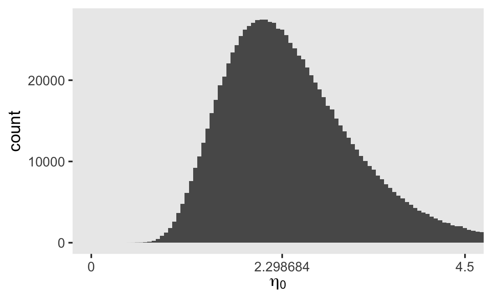

The
")
prior for

suggests we expect the difference in standard deviations for the smile
condition, versus the pout condition, to be within a one-unit decrease
or increase on the log scale, which is seems generous, to me. Since
researchers don’t often model
,
one might argue in favor of a more conservative prior for
,
like
")
or even
").

Here’s how to fit the model with `brm()`.

``` r
fit2 <- brm(
  data = albohn,
  family = gaussian,
  bf(rating ~ 0 + Intercept + condition + (1 | sn) + (1 + condition | cartoon),
     sigma  ~ 0 + Intercept + condition + (1 | sn) + (1 + condition | cartoon)),
  prior = c(prior(normal(4.4, 1), class = b, coef = Intercept),
            prior(normal(0, 1),   class = b, coef = condition),
            prior(normal(log(2.298684), 0.333), class = b, coef = Intercept, dpar = sigma),
            prior(normal(0, 0.5),               class = b, coef = condition, dpar = sigma),
            prior(exponential(0.435), class = sd),
            prior(lkj(2), class = cor)),
  chains = 4, cores = 4, 
  seed = 1,
  control = list(adapt_delta = .99),
  file = "fits/fit2.wagenmakers2016albohn"
)
```

### Summarize.

Here are the parameter summaries for both versions of the model.

``` r
print(fit1)
```

    ##  Family: gaussian 
    ##   Links: mu = identity; sigma = identity 
    ## Formula: rating ~ 0 + Intercept + condition + (1 | sn) + (1 + condition | cartoon) 
    ##    Data: albohn (Number of observations: 559) 
    ##   Draws: 4 chains, each with iter = 2000; warmup = 1000; thin = 1;
    ##          total post-warmup draws = 4000
    ## 
    ## Group-Level Effects: 
    ## ~cartoon (Number of levels: 4) 
    ##                          Estimate Est.Error l-95% CI u-95% CI Rhat Bulk_ESS Tail_ESS
    ## sd(Intercept)                1.06      0.58     0.42     2.68 1.00     1921     2211
    ## sd(condition)                0.30      0.33     0.01     1.15 1.00     1794     1888
    ## cor(Intercept,condition)     0.10      0.43    -0.73     0.83 1.00     5889     2787
    ## 
    ## ~sn (Number of levels: 140) 
    ##               Estimate Est.Error l-95% CI u-95% CI Rhat Bulk_ESS Tail_ESS
    ## sd(Intercept)     1.36      0.12     1.14     1.61 1.00     1503     2670
    ## 
    ## Population-Level Effects: 
    ##           Estimate Est.Error l-95% CI u-95% CI Rhat Bulk_ESS Tail_ESS
    ## Intercept     4.16      0.49     3.19     5.16 1.00     1776     1881
    ## condition     0.07      0.31    -0.57     0.69 1.00     2061     2074
    ## 
    ## Family Specific Parameters: 
    ##       Estimate Est.Error l-95% CI u-95% CI Rhat Bulk_ESS Tail_ESS
    ## sigma     1.75      0.06     1.64     1.88 1.00     4197     3260
    ## 
    ## Draws were sampled using sampling(NUTS). For each parameter, Bulk_ESS
    ## and Tail_ESS are effective sample size measures, and Rhat is the potential
    ## scale reduction factor on split chains (at convergence, Rhat = 1).

``` r
print(fit2)
```

    ##  Family: gaussian 
    ##   Links: mu = identity; sigma = log 
    ## Formula: rating ~ 0 + Intercept + condition + (1 | sn) + (1 + condition | cartoon) 
    ##          sigma ~ 0 + Intercept + condition + (1 | sn) + (1 + condition | cartoon)
    ##    Data: albohn (Number of observations: 559) 
    ##   Draws: 4 chains, each with iter = 2000; warmup = 1000; thin = 1;
    ##          total post-warmup draws = 4000
    ## 
    ## Group-Level Effects: 
    ## ~cartoon (Number of levels: 4) 
    ##                                      Estimate Est.Error l-95% CI u-95% CI Rhat Bulk_ESS Tail_ESS
    ## sd(Intercept)                            1.05      0.56     0.42     2.45 1.00     1984     2300
    ## sd(condition)                            0.30      0.30     0.01     1.06 1.00     2086     2356
    ## sd(sigma_Intercept)                      0.14      0.16     0.01     0.55 1.00     1128     1329
    ## sd(sigma_condition)                      0.14      0.16     0.00     0.56 1.00     1541     1835
    ## cor(Intercept,condition)                 0.10      0.44    -0.75     0.85 1.00     5792     3041
    ## cor(sigma_Intercept,sigma_condition)    -0.07      0.47    -0.87     0.80 1.00     4961     2833
    ## 
    ## ~sn (Number of levels: 140) 
    ##                     Estimate Est.Error l-95% CI u-95% CI Rhat Bulk_ESS Tail_ESS
    ## sd(Intercept)           1.38      0.12     1.16     1.63 1.00     1708     2879
    ## sd(sigma_Intercept)     0.13      0.07     0.01     0.26 1.00      726     1210
    ## 
    ## Population-Level Effects: 
    ##                 Estimate Est.Error l-95% CI u-95% CI Rhat Bulk_ESS Tail_ESS
    ## Intercept           4.16      0.49     3.21     5.21 1.00     1831     1947
    ## condition           0.08      0.32    -0.56     0.72 1.00     2382     2535
    ## sigma_Intercept     0.57      0.10     0.39     0.80 1.00     1679     1068
    ## sigma_condition    -0.01      0.11    -0.24     0.21 1.00     2614     2236
    ## 
    ## Draws were sampled using sampling(NUTS). For each parameter, Bulk_ESS
    ## and Tail_ESS are effective sample size measures, and Rhat is the potential
    ## scale reduction factor on split chains (at convergence, Rhat = 1).

As the big difference between the two models is whether we included a
linear model on the level-1 standard deviation, we might explore those
differences in a couple plots. Here’s a look at the posteriors for the
level-1 standard deviation parameter

from `fit1` and the conditional parameters from the MELSM `fit2`, what
we might call

and
.

``` r
bind_cols(
  as_draws_df(fit1) %>% 
    transmute(`sigma[epsilon]` = sigma),
  as_draws_df(fit2) %>% 
    transmute(`sigma[pout]`  = exp(b_sigma_Intercept),
              `sigma[smile]` = exp(b_sigma_Intercept + b_sigma_condition))
) %>% 
  pivot_longer(everything()) %>% 
  mutate(fit = ifelse(name == "sigma[epsilon]", "fit1", "fit2")) %>% 
  
  ggplot(aes(x = value, y = name, fill = fit)) +
  geom_vline(xintercept = 2.298684, color = "white") +
  stat_halfeye(.width = .95, size = 2) +
  scale_fill_viridis_d(option = "H", begin = .1, end = .9, alpha = .8) +
  scale_y_discrete(NULL, labels = ggplot2:::parse_safe) +
  labs(title = "The (conditional) level-1 standard deviation parameter",
       subtitle = "The vertical white line marks the expected value from the pilot data.",
       x = "marginal posterior") +
  coord_cartesian(xlim = c(0, 4.5)) +
  theme(panel.grid = element_blank())
```

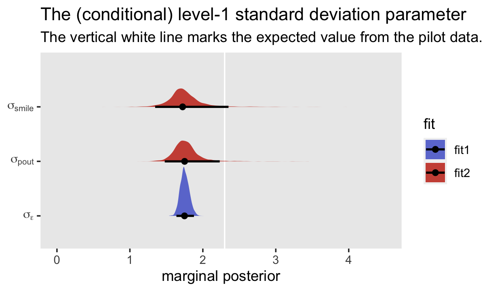

In this case, the difference between

and

was trivial, and both are centered around the same parameter space as
.
In all three cases, the posteriors were smaller than our pilot data led
us to expect, but not alarmingly so. Here are the coefficient plots for
the level-2

parameters.

``` r
sigma_names <- c(
  "sigma[0][italic(k)]", "sigma[1][italic(k)]", "sigma[italic(u)]", 
  "sigma[2][italic(k)]", "sigma[3][italic(k)]", "sigma[italic(w)]"
  )

rbind(
  posterior_summary(fit1)[3:5, -2],
  posterior_summary(fit2)[5:10, -2]
  ) %>% 
  data.frame() %>% 
  mutate(fit   = rep(str_c("fit", 1:2), times = c(3, 6)),
         param = c(sigma_names[1:3], sigma_names)) %>% 
  mutate(param = factor(param, levels = sigma_names[c(3, 1, 2, 6, 4, 5)])) %>% 
  
  ggplot(aes(x = param, y = Estimate, ymin = Q2.5, ymax = Q97.5,
             color = fit, group = fit)) +
  geom_pointrange(fatten = 1.25, position = position_dodge2(width = 0.5)) + 
  scale_color_viridis_d(option = "H", begin = .1, end = .9) +
  scale_x_discrete(NULL, labels = ggplot2:::parse_safe) +
  labs(title = "The level-2 standard deviation parameters",
       y = "marginal posterior") +
  coord_flip() +
  theme(panel.grid = element_blank())
```

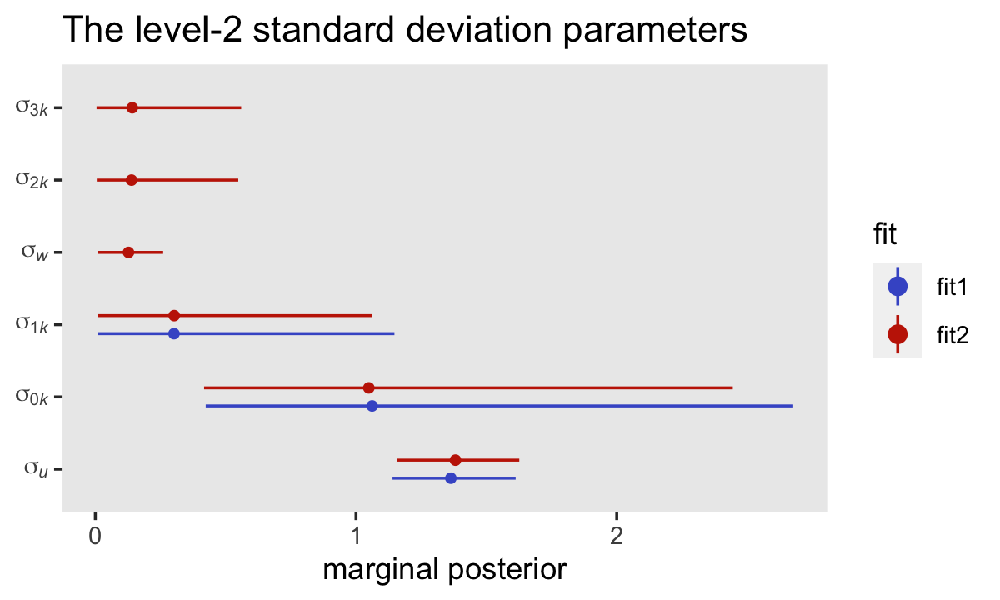

The three new parameters for the
MELSM–,
,
and
–are
all rather small. This suggests that in the population, persons are not
expected to vary greatly in how variable their ratings are for the
cartoons. In a similar way, this suggests that in the population of
similar Far Side cartoons, the way people rate them will not vary
greatly across cartoons. Note, however, that the participants in this
study were relatively homogeneous and the cartoons were specifically
chosen for their similarity. If future studies increased the
heterogeneity in either or both, we would expect increases in the
level-2

parameters.

If desired, we could compare the two models by their LOO-CV estimates

``` r
# compute
fit1 <- add_criterion(fit1, criterion = "loo")
fit2 <- add_criterion(fit2, criterion = "loo")

# compare
loo_compare(fit1, fit2, criterion = "loo") %>% print(simplify = F)
```

    ##      elpd_diff se_diff elpd_loo se_elpd_loo p_loo   se_p_loo looic   se_looic
    ## fit2     0.0       0.0 -1163.1     14.9       113.5     5.1   2326.2    29.8 
    ## fit1    -1.4       1.7 -1164.5     14.9        98.8     4.8   2329.0    29.7

In this case, the MELSM is numerically superior, but by a very small
degree. We would expect the models to predict new data values with a
similar degree of success.

### Effect sizes.

For approximately-continuous data of this kind, we might express the
effect sizes in terms of un-standardized mean differences and
standardized mean differences. For either approach, one could focus on
the population-level mean difference across the cartoons, the
cartoon-specific mean differences, or both.

For the un-standardized mean differences, the approach is the same for
`fit1` or `fit2`. The overall mean difference across cartoons is
captured by the

parameter. For the cartoon-specific mean differences, we compute the
value with
.
Here are those values with the `fit2` MELSM.

``` r
k <- c("Population mean", str_c("Cartoon ", 1:4))

# compute
dif <- data.frame(dif = c(
  fixef(fit2, summary = F)[, "condition"],
  coef(fit2, summary = F)$cartoon[, 1, "condition"],
  coef(fit2, summary = F)$cartoon[, 2, "condition"],
  coef(fit2, summary = F)$cartoon[, 3, "condition"],
  coef(fit2, summary = F)$cartoon[, 4, "condition"]
)) %>% 
  mutate(population = rep(k, each = n() / 5)) %>% 
  mutate(population = factor(population, levels = k))

# plot
dif %>% 
  ggplot(aes(x = dif, y = population)) +
  geom_vline(xintercept = 0, color = "white") +
  stat_halfeye(.width = .95, size = 1/2) +
  scale_x_continuous(breaks = c(-9, -4.5, 0, 4.5, 9), 
                     labels = c(-9, "-4.5", 0, "4.5", 9),
                     limits = c(-9, 9)) +
  labs(x = "unstandardized mean difference (0-9 Likert-type scale)",
       y = NULL) +
  theme(axis.text.y = element_text(hjust = 0),
        panel.grid = element_blank())
```

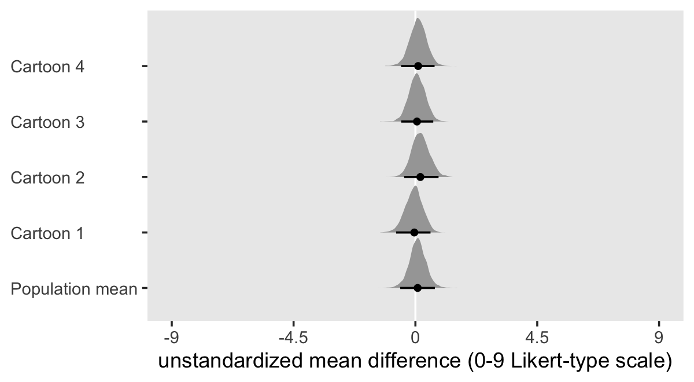

If you needed them for a table or prose, here are the exact values for
their posterior means and 95% intervals.

``` r
dif %>% 
  group_by(population) %>% 
  mean_qi(dif)
```

    ## # A tibble: 5 × 7
    ##   population          dif .lower .upper .width .point .interval
    ##   <fct>             <dbl>  <dbl>  <dbl>  <dbl> <chr>  <chr>    
    ## 1 Population mean  0.0834 -0.560  0.720   0.95 mean   qi       
    ## 2 Cartoon 1       -0.0542 -0.713  0.558   0.95 mean   qi       
    ## 3 Cartoon 2        0.192  -0.416  0.854   0.95 mean   qi       
    ## 4 Cartoon 3        0.0621 -0.525  0.660   0.95 mean   qi       
    ## 5 Cartoon 4        0.0999 -0.528  0.708   0.95 mean   qi

Whether you focus on the population mean
")
or the cartoon-specific results
"),
the differences are much smaller than those Strack and colleagues
reported in their original (1988) study.

As far as the standardized mean differences go, we can compute a
model-based Cohen’s
-like
effect size for the overall population with the equation

![
d = \\frac{\\beta_1}{\\sqrt{\\big\[\\exp(\\eta_0)^2 + \\exp(\\eta_0 + \\eta_1)^2 \\big\] / 2}},
](https://latex.codecogs.com/png.image?%5Cdpi%7B110%7D&space;%5Cbg_white&space;%0Ad%20%3D%20%5Cfrac%7B%5Cbeta_1%7D%7B%5Csqrt%7B%5Cbig%5B%5Cexp%28%5Ceta_0%29%5E2%20%2B%20%5Cexp%28%5Ceta_0%20%2B%20%5Ceta_1%29%5E2%20%5Cbig%5D%20%2F%202%7D%7D%2C%0A "
d = \frac{\beta_1}{\sqrt{\big[\exp(\eta_0)^2 + \exp(\eta_0 + \eta_1)^2 \big] / 2}},
")

where the bottom term is the pooled standard deviation in the
population. In this case, we’re *pooling* the standard deviation across
the two levels of the experimental manipulation. If we want to compute
the model-based Cohen’s

like effect size for each of the cartoons, the equation expands to

![
d_k = \\frac{\\beta_1 + v\_{1k}}{\\sqrt{\\big\[\\exp(\\eta_0 + x\_{0k})^2 + \\exp(\\eta_0 + \\eta_1 + x\_{0k} + x\_{1k})^2 \\big\] / 2}}.
](https://latex.codecogs.com/png.image?%5Cdpi%7B110%7D&space;%5Cbg_white&space;%0Ad_k%20%3D%20%5Cfrac%7B%5Cbeta_1%20%2B%20v_%7B1k%7D%7D%7B%5Csqrt%7B%5Cbig%5B%5Cexp%28%5Ceta_0%20%2B%20x_%7B0k%7D%29%5E2%20%2B%20%5Cexp%28%5Ceta_0%20%2B%20%5Ceta_1%20%2B%20x_%7B0k%7D%20%2B%20x_%7B1k%7D%29%5E2%20%5Cbig%5D%20%2F%202%7D%7D.%0A "
d_k = \frac{\beta_1 + v_{1k}}{\sqrt{\big[\exp(\eta_0 + x_{0k})^2 + \exp(\eta_0 + \eta_1 + x_{0k} + x_{1k})^2 \big] / 2}}.
")

You can use a simple `as_draws_df()`-based workflow to compute the
overall
.

``` r
as_draws_df(fit2) %>% 
  select(b_Intercept:b_sigma_condition) %>% 
  transmute(d = b_condition / sqrt( (exp(b_sigma_Intercept)^2 + exp(b_sigma_Intercept + b_sigma_condition)^2) / 2)) %>% 
  
  ggplot(aes(x = d, y = 0)) +
  stat_halfeye(.width = .95) +
  scale_y_continuous(NULL, breaks = NULL) +
  labs(x = expression("Cohen's "*italic(d))) +
  coord_cartesian(xlim = c(-1, 1)) +
  theme(panel.grid = element_blank())
```

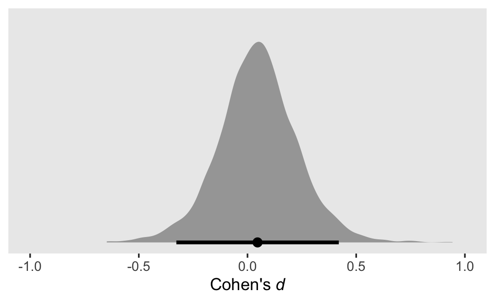

The workflow for the

effect sizes require more work. To my mind, the `fitted()` approach is
probably the easiest.

``` r
nd <- albohn %>% 
  distinct(cartoon, condition) %>% 
  mutate(row = 1:n())

fitted(fit2, 
       newdata = nd,
       re_formula = ~ (1 + condition | cartoon),
       dpar = "sigma",
       summary = F) %>% 
  data.frame() %>% 
  set_names(nd %>% pull(row)) %>% 
  mutate(draw = 1:n()) %>% 
  pivot_longer(-draw, names_to = "row", values_to = "sigma") %>% 
  mutate(row = as.double(row)) %>% 
  left_join(nd, by = "row") %>% 
  mutate(condition = str_c("sigma", condition)) %>% 
  select(-row) %>%
  pivot_wider(names_from = condition, values_from = sigma) %>% 
  mutate(sigma_pooled = sqrt((sigma0^2 + sigma1^2) / 2)) %>% 
  left_join(coef(fit2, summary = F)$cartoon[, , "condition"] %>% 
              data.frame() %>% 
              set_names(1:4) %>% 
              mutate(draw = 1:n()) %>% 
              pivot_longer(-draw, names_to = "cartoon", values_to = "delta") %>% 
              mutate(cartoon = as.double(cartoon)),
            by = c("draw", "cartoon")) %>% 
  mutate(d = delta / sigma_pooled) %>% 
  
  ggplot(aes(x = d, y = factor(cartoon))) +
  stat_halfeye(.width = .95) +
  labs(x = expression("Cohen's "*italic(d)[italic(k)]),
       y = "cartoon") +
  coord_cartesian(xlim = c(-1, 1)) +
  theme(panel.grid = element_blank())
```

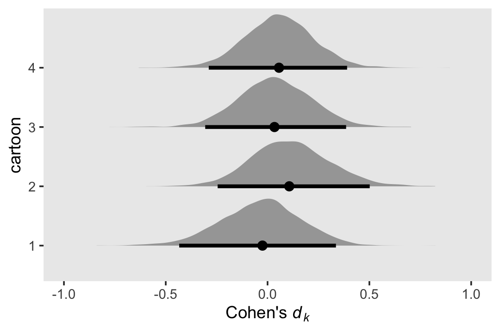

Much like the un-standardized mean differences, the standardized mean
differences are all centered around zero.

### Shortcommings.

If all you care about are model-based conditional means, the Gaussian
approaches we used for `fit1` and `fit2` do a descent job describing the
data. For example, here’s a plot of the model-based means and their 95%
intervals from `fit1` versus the means computed with simple sample
statistics.

``` r
nd <- albohn %>% 
  distinct(cartoon, condition, conditionf)

fitted(fit1,
       re_formula = ~ (1 + condition | cartoon),
       newdata = nd) %>% 
  data.frame() %>% 
  bind_cols(nd) %>% 
  left_join(albohn %>% 
              group_by(cartoon, condition) %>% 
              summarise(mean = mean(rating, na.rm = T)),
            by = c("condition", "cartoon")) %>% 
  
  ggplot(aes(y = cartoon)) +
  geom_pointrange(aes(x = Estimate, xmin = Q2.5, xmax = Q97.5),
                  fatten = 1.5) +
  geom_point(aes(x = mean),
             shape = 4, size = 4, color = "red3") +
  scale_x_continuous("rating (0-9 Likert-type scale)", 
                     breaks = 0:9, limits = c(0, 9)) +
  labs(title = "MLM-based conditional means versus sample statistics",
       subtitle = "The black dots and horizontal lines are the fit1-based population estimates.\nThe red X's are the corresponding sample means.") +
  facet_wrap(~ conditionf) +
  theme(panel.grid = element_blank())
```

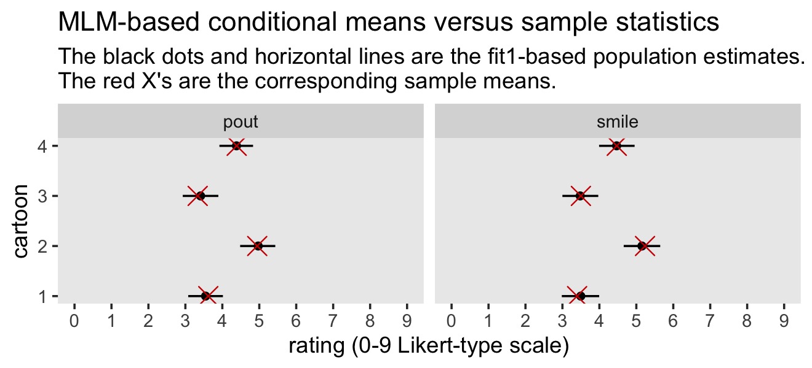

However, both models presume the data can be legitimately described
using the normal distribution. Given the data can only take on integer
values between 0 and 9, this isn’t a great assumption. For example, take
a look at the posterior-predictive distributions from the two models.

``` r
# fit1
set.seed(1)
p1 <- pp_check(fit1, type = "hist", ndraws = 3, binwidth = 0.5) +
  geom_vline(xintercept = c(-0.5, 9.5), linetype = 2, size = 1/4) +
  scale_x_continuous(breaks = 0:9) +
  coord_cartesian(xlim = c(-3, 12)) +
  ggtitle("Conventional Gaussian multilevel model\n(fit1)") +
  theme(title = element_text(size = 9))

# fit2
set.seed(1)
p2 <- pp_check(fit2, type = "hist", ndraws = 3, binwidth = 0.5) +
  geom_vline(xintercept = c(-0.5, 9.5), linetype = 2, size = 1/4) +
  scale_x_continuous(breaks = 0:9) +
  coord_cartesian(xlim = c(-3, 12)) +
  ggtitle("Gaussian MELSM\n(fit2)") +
  theme(title = element_text(size = 9))

# combine
p1 + p2 + 
  plot_layout(guides = "collect") +
  plot_annotation(title = "Posterior-predictive checks",
                  theme = theme(plot.title = element_text(family = "Times")))
```

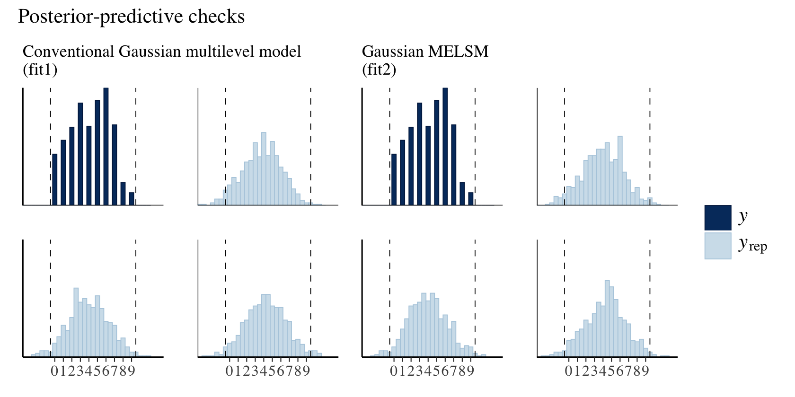

Simulated data from both versions of the model exceed below and above
the boundaries of the original data. Further, all simulated data sets
are markedly more bell-shaped than the original data. When possible,
it’s generally a good idea to analyze experimental data with models that
produce data resembling the original data. In next section, we consider
ordinal models which do.

## Ordinal models

With **brms**, there are multiple ways to model data with ordinal
likelihoods. In the next sections, we’ll practice with the cumulative
probit likelihood, which has desirable qualities for the data at hand.
Though we won’t do so, here, it wouldn’t be unreasonable to use the
cumulative-*logit* framework, instead.

### Conventional multilevel ordinal model.

For the ordinal models, we’ll switch from the numeric `rating` variable
to the ordered factor variable `ratingf`. As in the models from the last
section, we can think of the `ratinfg` values as varying across

persons,

experimental trials, and

cartoons. Now we further describe the `ratingf` values as having

response options, given they are from questions which used a 0-to-9
Likert-type scale. With the cumulative probit model, you can model the
relative probability of each ordinal category as

 = \Phi(\tau_l) - \Phi(\tau_{l - 1}),")

where

is the

threshold,

is a shorthand for the set of nine thresholds
,
and

is the cumulative standard normal distribution. As our ultimate goal is
to examine meaningful differences in the mean and variances of the
`ratingf` values across the

persons,

experimental trials and

cartoons in the data, we will expand the above equation to

![p(\\text{ratingf} = l \| \\{ \\tau_l \\}, \\mu, \\alpha) = \\Phi(\\alpha\[\\tau_l - \\mu\]) - \\Phi(\\alpha\[\\tau\_{l - 1} - \\mu\]),](https://latex.codecogs.com/png.image?%5Cdpi%7B110%7D&space;%5Cbg_white&space;p%28%5Ctext%7Bratingf%7D%20%3D%20l%20%7C%20%5C%7B%20%5Ctau_l%20%5C%7D%2C%20%5Cmu%2C%20%5Calpha%29%20%3D%20%5CPhi%28%5Calpha%5B%5Ctau_l%20-%20%5Cmu%5D%29%20-%20%5CPhi%28%5Calpha%5B%5Ctau_%7Bl%20-%201%7D%20-%20%5Cmu%5D%29%2C "p(\text{ratingf} = l | \{ \tau_l \}, \mu, \alpha) = \Phi(\alpha[\tau_l - \mu]) - \Phi(\alpha[\tau_{l - 1} - \mu]),")

where

is the mean of the cumulative normal distribution and

is the *discrimination* parameter, which is the reciprocal of the
standard deviation of the cumulative normal distribution, such that
.
In the empty model,

and

for identification purposes and if you substitute those values into the
equation, above, you’ll see the terms on the right-side of the equation
drop out and you end up with the simplified version of the equation from
earlier.

With this parameterization, we can analyze our experimental data with
the model

![
\\begin{align\*}
p(\\text{ratingf} = l \| \\{ \\tau_l \\}, \\mu\_{ijk}, \\alpha = 1) & = \\Phi(\\alpha\[\\tau_l - \\mu\_{ijk}\]) - \\Phi(\\alpha\[\\tau\_{l - 1} - \\mu\_{ijk}\]) \\\\
\\mu\_{ijk} & = 0 + \\beta_1 \\text{condition}\_{ik} + u_i + v\_{0k} + v\_{1k} \\text{condition}\_{ik} \\\\ 
u_i & \\sim \\mathcal N(0, \\sigma_u) \\\\
\\begin{bmatrix} v\_{0k} \\\\ v\_{1k} \\end{bmatrix} & \\sim \\mathcal N(\\mathbf 0, \\mathbf{SRS}) \\\\
\\mathbf S & = \\begin{bmatrix} \\sigma\_{0k} \\\\ 1 & \\sigma\_{1k} \\end{bmatrix} \\\\
\\mathbf R & = \\begin{bmatrix} 1 \\\\ \\rho & 1 \\end{bmatrix}, \\\\
\\end{align\*}
](https://latex.codecogs.com/png.image?%5Cdpi%7B110%7D&space;%5Cbg_white&space;%0A%5Cbegin%7Balign%2A%7D%0Ap%28%5Ctext%7Bratingf%7D%20%3D%20l%20%7C%20%5C%7B%20%5Ctau_l%20%5C%7D%2C%20%5Cmu_%7Bijk%7D%2C%20%5Calpha%20%3D%201%29%20%26%20%3D%20%5CPhi%28%5Calpha%5B%5Ctau_l%20-%20%5Cmu_%7Bijk%7D%5D%29%20-%20%5CPhi%28%5Calpha%5B%5Ctau_%7Bl%20-%201%7D%20-%20%5Cmu_%7Bijk%7D%5D%29%20%5C%5C%0A%5Cmu_%7Bijk%7D%20%26%20%3D%200%20%2B%20%5Cbeta_1%20%5Ctext%7Bcondition%7D_%7Bik%7D%20%2B%20u_i%20%2B%20v_%7B0k%7D%20%2B%20v_%7B1k%7D%20%5Ctext%7Bcondition%7D_%7Bik%7D%20%5C%5C%20%0Au_i%20%26%20%5Csim%20%5Cmathcal%20N%280%2C%20%5Csigma_u%29%20%5C%5C%0A%5Cbegin%7Bbmatrix%7D%20v_%7B0k%7D%20%5C%5C%20v_%7B1k%7D%20%5Cend%7Bbmatrix%7D%20%26%20%5Csim%20%5Cmathcal%20N%28%5Cmathbf%200%2C%20%5Cmathbf%7BSRS%7D%29%20%5C%5C%0A%5Cmathbf%20S%20%26%20%3D%20%5Cbegin%7Bbmatrix%7D%20%5Csigma_%7B0k%7D%20%5C%5C%201%20%26%20%5Csigma_%7B1k%7D%20%5Cend%7Bbmatrix%7D%20%5C%5C%0A%5Cmathbf%20R%20%26%20%3D%20%5Cbegin%7Bbmatrix%7D%201%20%5C%5C%20%5Crho%20%26%201%20%5Cend%7Bbmatrix%7D%2C%20%5C%5C%0A%5Cend%7Balign%2A%7D%0A "
\begin{align*}
p(\text{ratingf} = l | \{ \tau_l \}, \mu_{ijk}, \alpha = 1) & = \Phi(\alpha[\tau_l - \mu_{ijk}]) - \Phi(\alpha[\tau_{l - 1} - \mu_{ijk}]) \\
\mu_{ijk} & = 0 + \beta_1 \text{condition}_{ik} + u_i + v_{0k} + v_{1k} \text{condition}_{ik} \\ 
u_i & \sim \mathcal N(0, \sigma_u) \\
\begin{bmatrix} v_{0k} \\ v_{1k} \end{bmatrix} & \sim \mathcal N(\mathbf 0, \mathbf{SRS}) \\
\mathbf S & = \begin{bmatrix} \sigma_{0k} \\ 1 & \sigma_{1k} \end{bmatrix} \\
\mathbf R & = \begin{bmatrix} 1 \\ \rho & 1 \end{bmatrix}, \\
\end{align*}
")

with priors

![
\\begin{align\*}
\\tau\_{1} & \\sim \\mathcal N(-1.7506861, 0.5) \\\\
\\tau\_{2} & \\sim \\mathcal N(-1.2265281, 0.5) \\\\
\\tau\_{3} & \\sim \\mathcal N(-0.8064212, 0.5) \\\\
\\tau\_{4} & \\sim \\mathcal N(-0.4124631, 0.5) \\\\
\\tau\_{5} & \\sim \\mathcal N(0, 0.5) \\\\
\\tau\_{6} & \\sim \\mathcal N(0.4124631, 0.5) \\\\
\\tau\_{7} & \\sim \\mathcal N(0.8064212, 0.5) \\\\
\\tau\_{8} & \\sim \\mathcal N(1.2265281, 0.5) \\\\
\\tau\_{9} & \\sim \\mathcal N(1.7506861, 0.5) \\\\
\\beta_1 & \\sim \\mathcal N(0, 1) \\\\ 
\\sigma_u, \\dots, \\sigma\_{1k} & \\sim \\operatorname{Exponential}(1) \\\\
\\mathbf R & \\sim \\operatorname{LKJ}(2),
\\end{align\*}
](https://latex.codecogs.com/png.image?%5Cdpi%7B110%7D&space;%5Cbg_white&space;%0A%5Cbegin%7Balign%2A%7D%0A%5Ctau_%7B1%7D%20%26%20%5Csim%20%5Cmathcal%20N%28-1.7506861%2C%200.5%29%20%5C%5C%0A%5Ctau_%7B2%7D%20%26%20%5Csim%20%5Cmathcal%20N%28-1.2265281%2C%200.5%29%20%5C%5C%0A%5Ctau_%7B3%7D%20%26%20%5Csim%20%5Cmathcal%20N%28-0.8064212%2C%200.5%29%20%5C%5C%0A%5Ctau_%7B4%7D%20%26%20%5Csim%20%5Cmathcal%20N%28-0.4124631%2C%200.5%29%20%5C%5C%0A%5Ctau_%7B5%7D%20%26%20%5Csim%20%5Cmathcal%20N%280%2C%200.5%29%20%5C%5C%0A%5Ctau_%7B6%7D%20%26%20%5Csim%20%5Cmathcal%20N%280.4124631%2C%200.5%29%20%5C%5C%0A%5Ctau_%7B7%7D%20%26%20%5Csim%20%5Cmathcal%20N%280.8064212%2C%200.5%29%20%5C%5C%0A%5Ctau_%7B8%7D%20%26%20%5Csim%20%5Cmathcal%20N%281.2265281%2C%200.5%29%20%5C%5C%0A%5Ctau_%7B9%7D%20%26%20%5Csim%20%5Cmathcal%20N%281.7506861%2C%200.5%29%20%5C%5C%0A%5Cbeta_1%20%26%20%5Csim%20%5Cmathcal%20N%280%2C%201%29%20%5C%5C%20%0A%5Csigma_u%2C%20%5Cdots%2C%20%5Csigma_%7B1k%7D%20%26%20%5Csim%20%5Coperatorname%7BExponential%7D%281%29%20%5C%5C%0A%5Cmathbf%20R%20%26%20%5Csim%20%5Coperatorname%7BLKJ%7D%282%29%2C%0A%5Cend%7Balign%2A%7D%0A "
\begin{align*}
\tau_{1} & \sim \mathcal N(-1.7506861, 0.5) \\
\tau_{2} & \sim \mathcal N(-1.2265281, 0.5) \\
\tau_{3} & \sim \mathcal N(-0.8064212, 0.5) \\
\tau_{4} & \sim \mathcal N(-0.4124631, 0.5) \\
\tau_{5} & \sim \mathcal N(0, 0.5) \\
\tau_{6} & \sim \mathcal N(0.4124631, 0.5) \\
\tau_{7} & \sim \mathcal N(0.8064212, 0.5) \\
\tau_{8} & \sim \mathcal N(1.2265281, 0.5) \\
\tau_{9} & \sim \mathcal N(1.7506861, 0.5) \\
\beta_1 & \sim \mathcal N(0, 1) \\ 
\sigma_u, \dots, \sigma_{1k} & \sim \operatorname{Exponential}(1) \\
\mathbf R & \sim \operatorname{LKJ}(2),
\end{align*}
")

where the model for

is similar to the model in `fit1`. The big difference is that
,
the population mean for the pout condition, is fixed to zero for
identification purposes.

As to the priors, we should walk out how we came to the unusually
specific values for the

priors. If you navigate to the `PanelPlot_SelectedCartoons.pdf` file on
the OSF at <https://osf.io/6qnhg/>, you can look at the histograms of
the four cartoons from the pilot trial. To my eye, the histograms are
all similar in that the rating distributions are roughly symmetric and
triangular with modes near the middle of the 0-to-9 scale and lesser
response frequencies at the ends of the scale. They also show the
pattern that the options in the middle of the scale are about 4 times
more frequent than those at the ends. To give a sense, here’s a
histogram of the idealized shape.

``` r
pilot_ratings <- tibble(rating = 0:9) %>% 
  mutate(weight = c(seq(from = 1, to = 4, length.out = 5),
                    seq(from = 4, to = 1, length.out = 5)))

pilot_ratings %>% 
  ggplot(aes(x = rating, y = weight)) +
  geom_col() +
  scale_x_continuous(breaks = 0:9) +
  theme(panel.grid = element_blank()) +
  ylim(0, 5) +
  ggtitle("Idealized distribution of the pilot ratings")
```

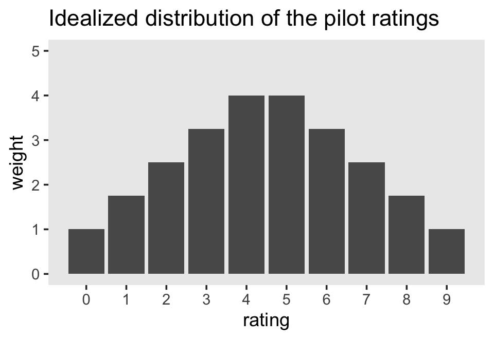

If you divide each `weight` value by the sum of all `weight` values, you
will have a vector of proportions. If you insert those `proportion`
values into the `cumsum()` function, you will have a vector of
cumulative proportions. You can then use the cumulative proportions to
compute your prior thresholds with the `qnorm()` function, which will be
on the scale of the link function
.

``` r
pilot_ratings %>% 
  mutate(proportion = weight / sum(weight)) %>% 
  mutate(cumulative_proportion = cumsum(proportion)) %>% 
  mutate(right_hand_threshold = qnorm(cumulative_proportion, mean = 0, sd = 1))
```

    ## # A tibble: 10 × 5
    ##    rating weight proportion cumulative_proportion right_hand_threshold
    ##     <int>  <dbl>      <dbl>                 <dbl>                <dbl>
    ##  1      0   1          0.04                  0.04               -1.75 
    ##  2      1   1.75       0.07                  0.11               -1.23 
    ##  3      2   2.5        0.1                   0.21               -0.806
    ##  4      3   3.25       0.13                  0.34               -0.412
    ##  5      4   4          0.16                  0.5                 0    
    ##  6      5   4          0.16                  0.66                0.412
    ##  7      6   3.25       0.13                  0.79                0.806
    ##  8      7   2.5        0.1                   0.89                1.23 
    ##  9      8   1.75       0.07                  0.96                1.75 
    ## 10      9   1          0.04                  1                 Inf

Those `right_hand_threshold` values in the right-most column are where
we got the

hyperparameters for our Gaussian

priors. Setting the

hyperparameter for each to

might seem strong at first, but it still allows the posterior for each
to veer about

to the left or right of the

scale. Given the quality of these pilot data, I think that’s pretty
generous.

Here’s how to fit the model with `brm()`.

``` r
# 1.163268 mins
fit3 <- brm(
  data = albohn,
  family = cumulative(probit),
  ratingf ~ 1 + condition + (1 | sn) + (1 + condition | cartoon),
  prior = c(prior(normal(-1.7506861, 0.5), class = Intercept, coef = 1),
            prior(normal(-1.2265281, 0.5), class = Intercept, coef = 2),
            prior(normal(-0.8064212, 0.5), class = Intercept, coef = 3),
            prior(normal(-0.4124631, 0.5), class = Intercept, coef = 4),
            prior(normal(0.0000000, 0.5), class = Intercept, coef = 5),
            prior(normal(0.4124631, 0.5), class = Intercept, coef = 6),
            prior(normal(0.8064212, 0.5), class = Intercept, coef = 7),
            prior(normal(1.2265281, 0.5), class = Intercept, coef = 8),
            prior(normal(1.7506861, 0.5), class = Intercept, coef = 9),
            prior(normal(0, 1), class = b, coef = condition),
            prior(exponential(1), class = sd),
            prior(lkj(2), class = cor)),
  chains = 4, cores = 4,
  seed = 1,
  control = list(adapt_delta = .99),
  init_r = 0.1,
  file = "fits/fit3.wagenmakers2016albohn"
)
```

Another way of describing this model is through the lens of item
response theory (IRT). Following sensibilities in Bürkner’s IRT paper
(<https://arxiv.org/pdf/1905.09501.pdf>), this is an conditional ordinal
probit IRT model.

### A cumulative probit MELSM.

A shortcomming of the multilevel cumulative probit model in the last
section is that although the latent means are allowed to vary across
persons and cartoons, the latent standard deviations are all constrained
to equality. However, we can relax that assumption by modeling the
discrimination parameter
,
which would return what you might call a cumulative probit MELSM or
distributional multilevel cumulative probit model. We might describe the
model as

![
\\begin{align\*}
p(\\text{ratingf} = l \| \\{ \\tau_l \\}, \\mu\_{ijk}, \\alpha\_{ijk}) & = \\Phi(\\alpha\_{ijk}\[\\tau_l - \\mu\_{ijk}\]) - \\Phi(\\alpha\_{ijk}\[\\tau\_{l - 1} - \\mu\_{ijk}\]) \\\\
\\mu\_{ijk} & = 0 + \\beta_1 \\text{condition}\_{ik} + u_i + v\_{0k} + v\_{1k} \\text{condition}\_{ik} \\\\ 
\\log(\\alpha\_{ijk}) & = 0 + \\eta_1 \\text{condition}\_{ik} + w_i + x\_{0k} + x\_{1k} \\text{condition}\_{ik} \\\\ 
u_i & \\sim \\mathcal N(0, \\sigma_u) \\\\
\\begin{bmatrix} v\_{0k} \\\\ v\_{1k} \\end{bmatrix} & \\sim \\mathcal N(\\mathbf 0, \\mathbf{S_vR_vS_v}) \\\\
\\mathbf{S_v} & = \\begin{bmatrix} \\sigma\_{0k} \\\\ 1 & \\sigma\_{1k} \\end{bmatrix} \\\\
\\mathbf{R_v} & = \\begin{bmatrix} 1 \\\\ \\rho_v & 1 \\end{bmatrix} \\\\
w_i & \\sim \\mathcal N(0, \\sigma_w) \\\\
\\begin{bmatrix} x\_{0k} \\\\ x\_{1k} \\end{bmatrix} & \\sim \\mathcal N(\\mathbf 0, \\mathbf{S_xR_xS_x}) \\\\
\\mathbf{S_x} & = \\begin{bmatrix} \\sigma\_{2k} \\\\ 1 & \\sigma\_{3k} \\end{bmatrix} \\\\
\\mathbf{R_x} & = \\begin{bmatrix} 1 \\\\ \\rho_x & 1 \\end{bmatrix}, \\\\
\\end{align\*}
](https://latex.codecogs.com/png.image?%5Cdpi%7B110%7D&space;%5Cbg_white&space;%0A%5Cbegin%7Balign%2A%7D%0Ap%28%5Ctext%7Bratingf%7D%20%3D%20l%20%7C%20%5C%7B%20%5Ctau_l%20%5C%7D%2C%20%5Cmu_%7Bijk%7D%2C%20%5Calpha_%7Bijk%7D%29%20%26%20%3D%20%5CPhi%28%5Calpha_%7Bijk%7D%5B%5Ctau_l%20-%20%5Cmu_%7Bijk%7D%5D%29%20-%20%5CPhi%28%5Calpha_%7Bijk%7D%5B%5Ctau_%7Bl%20-%201%7D%20-%20%5Cmu_%7Bijk%7D%5D%29%20%5C%5C%0A%5Cmu_%7Bijk%7D%20%26%20%3D%200%20%2B%20%5Cbeta_1%20%5Ctext%7Bcondition%7D_%7Bik%7D%20%2B%20u_i%20%2B%20v_%7B0k%7D%20%2B%20v_%7B1k%7D%20%5Ctext%7Bcondition%7D_%7Bik%7D%20%5C%5C%20%0A%5Clog%28%5Calpha_%7Bijk%7D%29%20%26%20%3D%200%20%2B%20%5Ceta_1%20%5Ctext%7Bcondition%7D_%7Bik%7D%20%2B%20w_i%20%2B%20x_%7B0k%7D%20%2B%20x_%7B1k%7D%20%5Ctext%7Bcondition%7D_%7Bik%7D%20%5C%5C%20%0Au_i%20%26%20%5Csim%20%5Cmathcal%20N%280%2C%20%5Csigma_u%29%20%5C%5C%0A%5Cbegin%7Bbmatrix%7D%20v_%7B0k%7D%20%5C%5C%20v_%7B1k%7D%20%5Cend%7Bbmatrix%7D%20%26%20%5Csim%20%5Cmathcal%20N%28%5Cmathbf%200%2C%20%5Cmathbf%7BS_vR_vS_v%7D%29%20%5C%5C%0A%5Cmathbf%7BS_v%7D%20%26%20%3D%20%5Cbegin%7Bbmatrix%7D%20%5Csigma_%7B0k%7D%20%5C%5C%201%20%26%20%5Csigma_%7B1k%7D%20%5Cend%7Bbmatrix%7D%20%5C%5C%0A%5Cmathbf%7BR_v%7D%20%26%20%3D%20%5Cbegin%7Bbmatrix%7D%201%20%5C%5C%20%5Crho_v%20%26%201%20%5Cend%7Bbmatrix%7D%20%5C%5C%0Aw_i%20%26%20%5Csim%20%5Cmathcal%20N%280%2C%20%5Csigma_w%29%20%5C%5C%0A%5Cbegin%7Bbmatrix%7D%20x_%7B0k%7D%20%5C%5C%20x_%7B1k%7D%20%5Cend%7Bbmatrix%7D%20%26%20%5Csim%20%5Cmathcal%20N%28%5Cmathbf%200%2C%20%5Cmathbf%7BS_xR_xS_x%7D%29%20%5C%5C%0A%5Cmathbf%7BS_x%7D%20%26%20%3D%20%5Cbegin%7Bbmatrix%7D%20%5Csigma_%7B2k%7D%20%5C%5C%201%20%26%20%5Csigma_%7B3k%7D%20%5Cend%7Bbmatrix%7D%20%5C%5C%0A%5Cmathbf%7BR_x%7D%20%26%20%3D%20%5Cbegin%7Bbmatrix%7D%201%20%5C%5C%20%5Crho_x%20%26%201%20%5Cend%7Bbmatrix%7D%2C%20%5C%5C%0A%5Cend%7Balign%2A%7D%0A "
\begin{align*}
p(\text{ratingf} = l | \{ \tau_l \}, \mu_{ijk}, \alpha_{ijk}) & = \Phi(\alpha_{ijk}[\tau_l - \mu_{ijk}]) - \Phi(\alpha_{ijk}[\tau_{l - 1} - \mu_{ijk}]) \\
\mu_{ijk} & = 0 + \beta_1 \text{condition}_{ik} + u_i + v_{0k} + v_{1k} \text{condition}_{ik} \\ 
\log(\alpha_{ijk}) & = 0 + \eta_1 \text{condition}_{ik} + w_i + x_{0k} + x_{1k} \text{condition}_{ik} \\ 
u_i & \sim \mathcal N(0, \sigma_u) \\
\begin{bmatrix} v_{0k} \\ v_{1k} \end{bmatrix} & \sim \mathcal N(\mathbf 0, \mathbf{S_vR_vS_v}) \\
\mathbf{S_v} & = \begin{bmatrix} \sigma_{0k} \\ 1 & \sigma_{1k} \end{bmatrix} \\
\mathbf{R_v} & = \begin{bmatrix} 1 \\ \rho_v & 1 \end{bmatrix} \\
w_i & \sim \mathcal N(0, \sigma_w) \\
\begin{bmatrix} x_{0k} \\ x_{1k} \end{bmatrix} & \sim \mathcal N(\mathbf 0, \mathbf{S_xR_xS_x}) \\
\mathbf{S_x} & = \begin{bmatrix} \sigma_{2k} \\ 1 & \sigma_{3k} \end{bmatrix} \\
\mathbf{R_x} & = \begin{bmatrix} 1 \\ \rho_x & 1 \end{bmatrix}, \\
\end{align*}
")

with priors

![
\\begin{align\*}
\\tau\_{1} & \\sim \\mathcal N(-1.7506861, 0.5) \\\\
\\tau\_{2} & \\sim \\mathcal N(-1.2265281, 0.5) \\\\
\\tau\_{3} & \\sim \\mathcal N(-0.8064212, 0.5) \\\\
\\tau\_{4} & \\sim \\mathcal N(-0.4124631, 0.5) \\\\
\\tau\_{5} & \\sim \\mathcal N(0, 0.5) \\\\
\\tau\_{6} & \\sim \\mathcal N(0.4124631, 0.5) \\\\
\\tau\_{7} & \\sim \\mathcal N(0.8064212, 0.5) \\\\
\\tau\_{8} & \\sim \\mathcal N(1.2265281, 0.5) \\\\
\\tau\_{9} & \\sim \\mathcal N(1.7506861, 0.5) \\\\
\\beta_1 & \\sim \\mathcal N(0, 1) \\\\ 
\\eta_1 & \\sim \\mathcal N(0, \\log(2) / 2) \\\\ 
\\sigma_u, \\dots, \\sigma\_{1k} & \\sim \\operatorname{Exponential}(1) \\\\
\\mathbf R & \\sim \\operatorname{LKJ}(2),
\\end{align\*}
](https://latex.codecogs.com/png.image?%5Cdpi%7B110%7D&space;%5Cbg_white&space;%0A%5Cbegin%7Balign%2A%7D%0A%5Ctau_%7B1%7D%20%26%20%5Csim%20%5Cmathcal%20N%28-1.7506861%2C%200.5%29%20%5C%5C%0A%5Ctau_%7B2%7D%20%26%20%5Csim%20%5Cmathcal%20N%28-1.2265281%2C%200.5%29%20%5C%5C%0A%5Ctau_%7B3%7D%20%26%20%5Csim%20%5Cmathcal%20N%28-0.8064212%2C%200.5%29%20%5C%5C%0A%5Ctau_%7B4%7D%20%26%20%5Csim%20%5Cmathcal%20N%28-0.4124631%2C%200.5%29%20%5C%5C%0A%5Ctau_%7B5%7D%20%26%20%5Csim%20%5Cmathcal%20N%280%2C%200.5%29%20%5C%5C%0A%5Ctau_%7B6%7D%20%26%20%5Csim%20%5Cmathcal%20N%280.4124631%2C%200.5%29%20%5C%5C%0A%5Ctau_%7B7%7D%20%26%20%5Csim%20%5Cmathcal%20N%280.8064212%2C%200.5%29%20%5C%5C%0A%5Ctau_%7B8%7D%20%26%20%5Csim%20%5Cmathcal%20N%281.2265281%2C%200.5%29%20%5C%5C%0A%5Ctau_%7B9%7D%20%26%20%5Csim%20%5Cmathcal%20N%281.7506861%2C%200.5%29%20%5C%5C%0A%5Cbeta_1%20%26%20%5Csim%20%5Cmathcal%20N%280%2C%201%29%20%5C%5C%20%0A%5Ceta_1%20%26%20%5Csim%20%5Cmathcal%20N%280%2C%20%5Clog%282%29%20%2F%202%29%20%5C%5C%20%0A%5Csigma_u%2C%20%5Cdots%2C%20%5Csigma_%7B1k%7D%20%26%20%5Csim%20%5Coperatorname%7BExponential%7D%281%29%20%5C%5C%0A%5Cmathbf%20R%20%26%20%5Csim%20%5Coperatorname%7BLKJ%7D%282%29%2C%0A%5Cend%7Balign%2A%7D%0A "
\begin{align*}
\tau_{1} & \sim \mathcal N(-1.7506861, 0.5) \\
\tau_{2} & \sim \mathcal N(-1.2265281, 0.5) \\
\tau_{3} & \sim \mathcal N(-0.8064212, 0.5) \\
\tau_{4} & \sim \mathcal N(-0.4124631, 0.5) \\
\tau_{5} & \sim \mathcal N(0, 0.5) \\
\tau_{6} & \sim \mathcal N(0.4124631, 0.5) \\
\tau_{7} & \sim \mathcal N(0.8064212, 0.5) \\
\tau_{8} & \sim \mathcal N(1.2265281, 0.5) \\
\tau_{9} & \sim \mathcal N(1.7506861, 0.5) \\
\beta_1 & \sim \mathcal N(0, 1) \\ 
\eta_1 & \sim \mathcal N(0, \log(2) / 2) \\ 
\sigma_u, \dots, \sigma_{1k} & \sim \operatorname{Exponential}(1) \\
\mathbf R & \sim \operatorname{LKJ}(2),
\end{align*}
")

where now

varies across

persons,

experimental trials, and

cartoons. Much like when we modeled
")
with the Gaussian MELSM, we model
")
here to ensure the model only predicts positive

values. For identification purposes, the

parameter is fixed to zero, which is the same as fixing it to one after
exponentiating out of the log scale. This is why that parameter is
absent from the equation and why it does not receive a prior. Speaking
of priors, notice how we used
 / 2)").
If you simulate, that distribution puts 95% of the prior mass on the
possibility the discrimination parameter for the smile condition will be
between half and 2 time the size of the pout condition.

``` r
set.seed(1)

prior <- tibble(prior = rnorm(n = 1e6, mean = 0, sd = log(2) / 2)) %>% 
  mutate(alpha = exp(prior)) 

prior %>% 
  ggplot(aes(x = alpha)) +
  geom_histogram(binwidth = 0.1, boundary = 0) +
  coord_cartesian(xlim = c(0, 4)) +
  theme(panel.grid = element_blank())
```

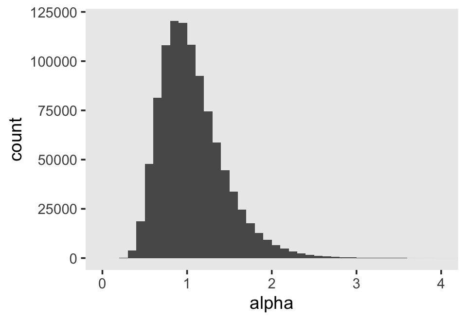

``` r
prior %>% 
  median_qi(alpha)
```

    ## # A tibble: 1 × 6
    ##   alpha .lower .upper .width .point .interval
    ##   <dbl>  <dbl>  <dbl>  <dbl> <chr>  <chr>    
    ## 1  1.00  0.507   1.98   0.95 median qi

Since

is just the reciprocal of
,
the
 / 2)")
has the same consequences on the

scale.

Here’s how to fit the model with `brm()`.

``` r
# 2.575521 mins
fit4 <- brm(
  data = albohn,
  family = cumulative(probit),
  bf(ratingf ~ 1 + condition + (1 | sn) + (1 + condition | cartoon)) +
    lf(disc  ~ 0 + condition + (1 | sn) + (1 + condition | cartoon),
       # this is really important
       cmc = FALSE),
  prior = c(prior(normal(-1.7506861, 0.5), class = Intercept, coef = 1),
            prior(normal(-1.2265281, 0.5), class = Intercept, coef = 2),
            prior(normal(-0.8064212, 0.5), class = Intercept, coef = 3),
            prior(normal(-0.4124631, 0.5), class = Intercept, coef = 4),
            prior(normal(0.0000000, 0.5), class = Intercept, coef = 5),
            prior(normal(0.4124631, 0.5), class = Intercept, coef = 6),
            prior(normal(0.8064212, 0.5), class = Intercept, coef = 7),
            prior(normal(1.2265281, 0.5), class = Intercept, coef = 8),
            prior(normal(1.7506861, 0.5), class = Intercept, coef = 9),
            prior(normal(0, 1),          class = b, coef = condition),
            prior(normal(0, log(2) / 2), class = b, dpar = disc),
            prior(exponential(1), class = sd),
            prior(lkj(2), class = cor)),
  chains = 4, cores = 4,
  seed = 1,
  control = list(adapt_delta = .995),
  init_r = 0.1,
  file = "fits/fit4.wagenmakers2016albohn"
)
```

### Summarize the ordinal models.

Here are the parameter summaries for both versions of the cumulative
probit model.

``` r
print(fit3)
```

    ##  Family: cumulative 
    ##   Links: mu = probit; disc = identity 
    ## Formula: ratingf ~ 1 + condition + (1 | sn) + (1 + condition | cartoon) 
    ##    Data: albohn (Number of observations: 559) 
    ##   Draws: 4 chains, each with iter = 2000; warmup = 1000; thin = 1;
    ##          total post-warmup draws = 4000
    ## 
    ## Group-Level Effects: 
    ## ~cartoon (Number of levels: 4) 
    ##                          Estimate Est.Error l-95% CI u-95% CI Rhat Bulk_ESS Tail_ESS
    ## sd(Intercept)                0.61      0.33     0.25     1.43 1.00     1679     2448
    ## sd(condition)                0.16      0.18     0.00     0.62 1.00     2283     2136
    ## cor(Intercept,condition)     0.05      0.44    -0.77     0.84 1.00     5544     2509
    ## 
    ## ~sn (Number of levels: 140) 
    ##               Estimate Est.Error l-95% CI u-95% CI Rhat Bulk_ESS Tail_ESS
    ## sd(Intercept)     0.78      0.08     0.63     0.94 1.00     1377     2443
    ## 
    ## Population-Level Effects: 
    ##              Estimate Est.Error l-95% CI u-95% CI Rhat Bulk_ESS Tail_ESS
    ## Intercept[1]    -2.14      0.20    -2.54    -1.76 1.00     2497     2731
    ## Intercept[2]    -1.48      0.19    -1.87    -1.14 1.00     2564     2657
    ## Intercept[3]    -0.96      0.18    -1.33    -0.63 1.00     2716     2762
    ## Intercept[4]    -0.43      0.18    -0.79    -0.10 1.00     2733     2869
    ## Intercept[5]    -0.06      0.17    -0.42     0.27 1.00     2731     2867
    ## Intercept[6]     0.44      0.17     0.07     0.77 1.00     2745     2730
    ## Intercept[7]     1.12      0.18     0.76     1.45 1.00     2633     2635
    ## Intercept[8]     1.93      0.19     1.54     2.28 1.00     3459     3104
    ## Intercept[9]     2.50      0.21     2.07     2.91 1.00     4293     3330
    ## condition        0.06      0.19    -0.30     0.45 1.00     2122     2189
    ## 
    ## Family Specific Parameters: 
    ##      Estimate Est.Error l-95% CI u-95% CI Rhat Bulk_ESS Tail_ESS
    ## disc     1.00      0.00     1.00     1.00   NA       NA       NA
    ## 
    ## Draws were sampled using sampling(NUTS). For each parameter, Bulk_ESS
    ## and Tail_ESS are effective sample size measures, and Rhat is the potential
    ## scale reduction factor on split chains (at convergence, Rhat = 1).

``` r
print(fit4)
```

    ##  Family: cumulative 
    ##   Links: mu = probit; disc = log 
    ## Formula: ratingf ~ 1 + condition + (1 | sn) + (1 + condition | cartoon) 
    ##          disc ~ 0 + condition + (1 | sn) + (1 + condition | cartoon)
    ##    Data: albohn (Number of observations: 559) 
    ##   Draws: 4 chains, each with iter = 2000; warmup = 1000; thin = 1;
    ##          total post-warmup draws = 4000
    ## 
    ## Group-Level Effects: 
    ## ~cartoon (Number of levels: 4) 
    ##                                    Estimate Est.Error l-95% CI u-95% CI Rhat Bulk_ESS Tail_ESS
    ## sd(Intercept)                          0.56      0.29     0.22     1.30 1.00     1643     2094
    ## sd(condition)                          0.14      0.15     0.00     0.53 1.00     2222     1970
    ## sd(disc_Intercept)                     0.19      0.19     0.01     0.67 1.00      990     1600
    ## sd(disc_condition)                     0.18      0.20     0.01     0.72 1.00     1488     2184
    ## cor(Intercept,condition)               0.08      0.44    -0.75     0.83 1.00     6434     3203
    ## cor(disc_Intercept,disc_condition)    -0.10      0.45    -0.86     0.77 1.00     4866     2808
    ## 
    ## ~sn (Number of levels: 140) 
    ##                    Estimate Est.Error l-95% CI u-95% CI Rhat Bulk_ESS Tail_ESS
    ## sd(Intercept)          0.72      0.09     0.55     0.91 1.00     1182     1705
    ## sd(disc_Intercept)     0.31      0.07     0.17     0.46 1.00      974     1234
    ## 
    ## Population-Level Effects: 
    ##                Estimate Est.Error l-95% CI u-95% CI Rhat Bulk_ESS Tail_ESS
    ## Intercept[1]      -2.05      0.25    -2.54    -1.56 1.00     1387     1464
    ## Intercept[2]      -1.39      0.21    -1.81    -0.98 1.00     1723     2176
    ## Intercept[3]      -0.89      0.19    -1.28    -0.54 1.00     2158     2547
    ## Intercept[4]      -0.40      0.18    -0.76    -0.07 1.00     2692     2989
    ## Intercept[5]      -0.07      0.17    -0.42     0.27 1.00     2908     2921
    ## Intercept[6]       0.38      0.18     0.03     0.73 1.00     3015     2907
    ## Intercept[7]       1.03      0.19     0.65     1.40 1.00     2735     2757
    ## Intercept[8]       1.88      0.23     1.43     2.33 1.00     2057     2177
    ## Intercept[9]       2.53      0.28     2.01     3.08 1.00     2196     2119
    ## condition          0.05      0.17    -0.29     0.41 1.00     1826     2312
    ## disc_condition     0.11      0.13    -0.15     0.36 1.00     2656     2380
    ## 
    ## Draws were sampled using sampling(NUTS). For each parameter, Bulk_ESS
    ## and Tail_ESS are effective sample size measures, and Rhat is the potential
    ## scale reduction factor on split chains (at convergence, Rhat = 1).

As with the two Gaussian models, here are the coefficient plots for the
level-2

parameters for our ordinal models.

``` r
sigma_names <- c(
  "sigma[0][italic(k)]", "sigma[1][italic(k)]", "sigma[italic(u)]", 
  "sigma[2][italic(k)]", "sigma[3][italic(k)]", "sigma[italic(w)]"
  )

rbind(
  posterior_summary(fit3)[11:13, -2],
  posterior_summary(fit4)[12:17, -2]
  ) %>% 
  data.frame() %>% 
  mutate(fit   = rep(str_c("fit", 3:4), times = c(3, 6)),
         param = c(sigma_names[1:3], sigma_names)) %>% 
  mutate(param = factor(param, levels = sigma_names[c(3, 1, 2, 6, 4, 5)])) %>% 
  
  ggplot(aes(x = param, y = Estimate, ymin = Q2.5, ymax = Q97.5,
             color = fit, group = fit)) +
  geom_pointrange(fatten = 1.25, position = position_dodge2(width = 0.5)) + 
  scale_color_viridis_d(option = "H", begin = .1, end = .9) +
  scale_x_discrete(NULL, labels = ggplot2:::parse_safe) +
  labs(title = "The level-2 standard deviation parameters",
       y = "marginal posterior") +
  coord_flip() +
  theme(panel.grid = element_blank())
```

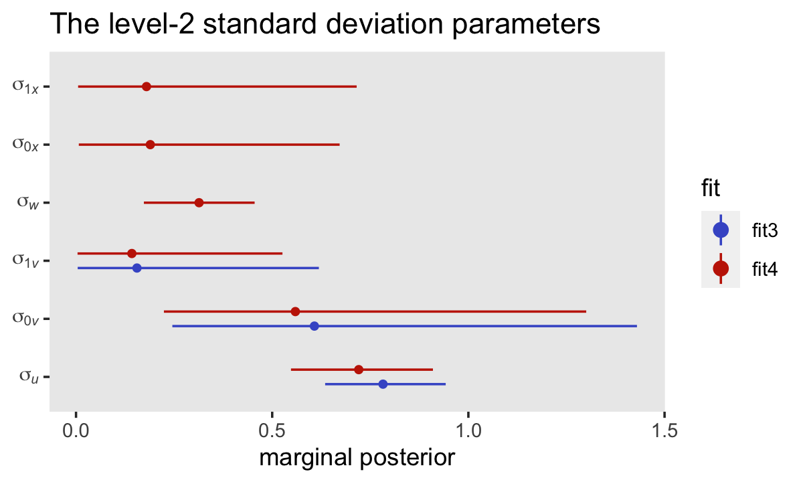

Comparatively speaking, the parameters unique to the
MELSM–,
,
and
–are
larger in the ordinal version of the model (`fit4`) than they were for
the more-conventional Gaussian version of the model (`fit2`). Yet,
they’re still on the small side relative to the others.

We might compare the two ordinal models by their LOO-CV estimates.

``` r
# compute
fit3 <- add_criterion(fit3, criterion = "loo")
fit4 <- add_criterion(fit4, criterion = "loo")

# compare
loo_compare(fit3, fit4, criterion = "loo") %>% print(simplify = F)
```

    ##      elpd_diff se_diff elpd_loo se_elpd_loo p_loo   se_p_loo looic   se_looic
    ## fit4     0.0       0.0 -1119.5     13.3       141.6     5.6   2238.9    26.5 
    ## fit3   -10.5       4.9 -1129.9     13.7       102.6     5.1   2259.8    27.5

For the ordinal models, the MELSM `fit4` was more clearly superior than
the simpler version of the model `fit3`.

### Effect sizes for the ordinal models.

The ordinal models will allow for standardized and un-standardized
effect sizes, not unlike with the Gaussian models. However, it’s perhaps
more natural to first compute the standardized effect sizes.

#### Standardized mean differences.

Since there is one common

parameter for the simpler `fit3` version of the model, that means there
is also one common latent standard deviation
.
As a consequence, this puts the overall

parameter in a standardized mean difference metric. It’s basically a
latent Cohen’s
.

``` r
fixef(fit3)["condition", ] %>% round(digits = 2)
```

    ##  Estimate Est.Error      Q2.5     Q97.5 
    ##      0.06      0.19     -0.30      0.45

Thus, the overall effect of the smile versus pout condition is a modest
standardized mean difference of 0.06, 95% CI \[-0.30, 0.45\]. To get the
cartoon-specific effect size,
,
it’s probably easiest to use the `coef()` approach.

``` r
coef(fit3)$cartoon[, , "condition"] %>% round(digits = 2)
```

    ##   Estimate Est.Error  Q2.5 Q97.5
    ## 1    -0.01      0.18 -0.38  0.35
    ## 2     0.08      0.18 -0.27  0.44
    ## 3     0.05      0.18 -0.29  0.41
    ## 4     0.05      0.18 -0.30  0.40

The varying discrimination parameters in the full `fit4` model
complicate our workflow. To compute the overall latent Cohen’s
,
we now use the equation

![
d = \\frac{\\beta_1}{\\sqrt{\\big(\[1 /\\exp(0)\]^2 + \[1/\\exp(0 + \\eta_1)\]^2 \\big) \\big/ 2}},
](https://latex.codecogs.com/png.image?%5Cdpi%7B110%7D&space;%5Cbg_white&space;%0Ad%20%3D%20%5Cfrac%7B%5Cbeta_1%7D%7B%5Csqrt%7B%5Cbig%28%5B1%20%2F%5Cexp%280%29%5D%5E2%20%2B%20%5B1%2F%5Cexp%280%20%2B%20%5Ceta_1%29%5D%5E2%20%5Cbig%29%20%5Cbig%2F%202%7D%7D%2C%0A "
d = \frac{\beta_1}{\sqrt{\big([1 /\exp(0)]^2 + [1/\exp(0 + \eta_1)]^2 \big) \big/ 2}},
")

where
![\[1 /\\exp(0)\]](https://latex.codecogs.com/png.image?%5Cdpi%7B110%7D&space;%5Cbg_white&space;%5B1%20%2F%5Cexp%280%29%5D "[1 /\exp(0)]")
is the latent standard deviation for the pout condition and
![\[1/\\exp(0 + \\eta_1)\]](https://latex.codecogs.com/png.image?%5Cdpi%7B110%7D&space;%5Cbg_white&space;%5B1%2F%5Cexp%280%20%2B%20%5Ceta_1%29%5D "[1/\exp(0 + \eta_1)]")
is the latent standard deviation for the smile condition. In a similar
way, the equations for the cartoon-specific latent
’s
now become

![
d_k = \\frac{\\beta_1 + v\_{1k}}{\\sqrt{\\big(\[1/\\exp(0 + x\_{0k})\]^2 + \[1 / \\exp(0 + \\eta_1 + x\_{0k} + x\_{1k})\]^2 \\big) \\big/ 2}},
](https://latex.codecogs.com/png.image?%5Cdpi%7B110%7D&space;%5Cbg_white&space;%0Ad_k%20%3D%20%5Cfrac%7B%5Cbeta_1%20%2B%20v_%7B1k%7D%7D%7B%5Csqrt%7B%5Cbig%28%5B1%2F%5Cexp%280%20%2B%20x_%7B0k%7D%29%5D%5E2%20%2B%20%5B1%20%2F%20%5Cexp%280%20%2B%20%5Ceta_1%20%2B%20x_%7B0k%7D%20%2B%20x_%7B1k%7D%29%5D%5E2%20%5Cbig%29%20%5Cbig%2F%202%7D%7D%2C%0A "
d_k = \frac{\beta_1 + v_{1k}}{\sqrt{\big([1/\exp(0 + x_{0k})]^2 + [1 / \exp(0 + \eta_1 + x_{0k} + x_{1k})]^2 \big) \big/ 2}},
")

where
![\[1/\\exp(0 + x\_{0k})\]^2](https://latex.codecogs.com/png.image?%5Cdpi%7B110%7D&space;%5Cbg_white&space;%5B1%2F%5Cexp%280%20%2B%20x_%7B0k%7D%29%5D%5E2 "[1/\exp(0 + x_{0k})]^2")
is the latent standard deviation for the
th
cartoon in the pout condition and
![\[1 / \\exp(0 + \\eta_1 + x\_{0k} + x\_{1k})\]^2](https://latex.codecogs.com/png.image?%5Cdpi%7B110%7D&space;%5Cbg_white&space;%5B1%20%2F%20%5Cexp%280%20%2B%20%5Ceta_1%20%2B%20x_%7B0k%7D%20%2B%20x_%7B1k%7D%29%5D%5E2 "[1 / \exp(0 + \eta_1 + x_{0k} + x_{1k})]^2")
is the latent standard deviation for the
th
cartoon in the smile condition.

Here’s an example of how to compute the population

manually with the `as_draws_df()` output.

``` r
draws <- as_draws_df(fit4)

population <- draws %>% 
  rename(`beta[1]` = b_condition, 
         `eta[1]`  = b_disc_condition) %>% 
  mutate(d = `beta[1]` / sqrt((1 + (1 / exp(`eta[1]`))^2) / 2)) %>% 
  select(d) %>% 
  mean_qi(d)

population
```

    ## # A tibble: 1 × 6
    ##        d .lower .upper .width .point .interval
    ##    <dbl>  <dbl>  <dbl>  <dbl> <chr>  <chr>    
    ## 1 0.0515 -0.302  0.429   0.95 mean   qi

Here’s how to compute the

effects manually with the `as_draws_df()` output.

``` r
k <- draws %>% 
  select(.draw, 
         b_condition, b_disc_condition,
         `r_cartoon[1,condition]`:`r_cartoon[4,condition]`,
         `r_cartoon__disc[1,Intercept]`:`r_cartoon__disc[4,Intercept]`, 
         `r_cartoon__disc[1,condition]`:`r_cartoon__disc[4,condition]`) %>% 
  set_names(c(".draw", 
              "beta[1]", "eta[1]",
              str_c(1:4, "_v[1]"), 
              str_c(1:4, "_x[0]"), 
              str_c(1:4, "_x[1]"))) %>% 
  pivot_longer(contains("_")) %>% 
  separate(name, into = c("k", "name"), sep = "_") %>% 
  pivot_wider(names_from = name, values_from = value) %>% 
  mutate(d = (`beta[1]` + `v[1]`) / sqrt(((1 / exp(`x[0]`))^2 + (1 / exp(`eta[1]` + `x[0]` + `x[1]`))^2) / 2)) %>% 
  group_by(k) %>% 
  mean_qi(d)

k
```

    ## # A tibble: 4 × 7
    ##   k           d .lower .upper .width .point .interval
    ##   <chr>   <dbl>  <dbl>  <dbl>  <dbl> <chr>  <chr>    
    ## 1 1     -0.0231 -0.434  0.377   0.95 mean   qi       
    ## 2 2      0.0721 -0.297  0.456   0.95 mean   qi       
    ## 3 3      0.0312 -0.345  0.412   0.95 mean   qi       
    ## 4 4      0.0676 -0.260  0.422   0.95 mean   qi

Here we combine the two and visualize them in a coefficient plot.

``` r
bind_rows(
  population %>% select(d:.upper),
  k %>% select(d:.upper)
  ) %>% 
  mutate(effect = c("italic(d)[population]", str_c("italic(d)[", 1:4, "]"))) %>% 
  mutate(effect = fct_rev(effect)) %>% 
  
  ggplot(aes(x = d, xmin = .lower, xmax = .upper, y = effect)) +
  geom_vline(xintercept = 0, color = "white") +
  geom_pointrange() +
  scale_x_continuous("latent effect size", limits = c(-0.5, 0.5)) +
  scale_y_discrete(NULL, labels = ggplot2:::parse_safe) +
  theme(panel.grid = element_blank())
```

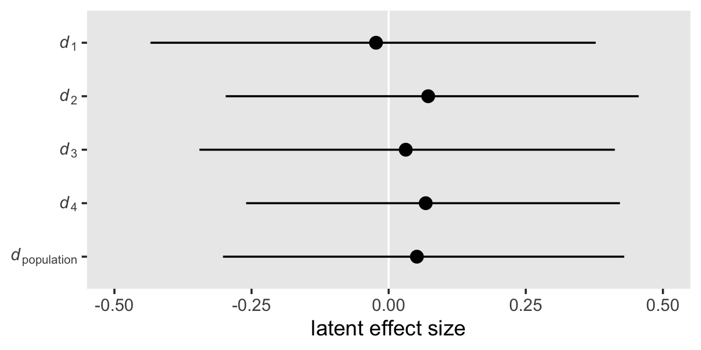

#### Unstandardized mean differences.

Even with the complicated `fit4` model, the latent Cohen’s

approach is attractive in it returns an effect size in a familiar
metric. However, some may feel uneasy about leaning into the
latent-variable interpretation of the cumulative-probit model. Happily,
the cumulative-probit model can also return unstandardized mean
differences in the original metric of the 0-9 Likert-type ratings. You
just need to know how to work with the thresholds.

Probably the easiest way to compute the unstandardized mean differences
is with the `fitted()` approach. Here we’ll demonstrate with `fit3`.
First, we’ll compute the overall means by experimental condition and
their difference.

``` r
nd <- albohn %>% 
  distinct(condition)


f <- fitted(fit3,
            newdata = nd,
            re_formula = NA,
            type = "response",
            summary = F)

# what do we have?
f %>% str()
```

    ##  num [1:4000, 1:2, 1:10] 0.0171 0.01585 0.01088 0.01521 0.00847 ...
    ##  - attr(*, "dimnames")=List of 3
    ##   ..$ : chr [1:4000] "1" "2" "3" "4" ...
    ##   ..$ : NULL
    ##   ..$ : chr [1:10] "0" "1" "2" "3" ...

Here’s how to work with the `fitted()` output to compute the overall
means, by condition, and their difference.

``` r
rbind(f[, 1, ],
      f[, 2, ]) %>% 
  data.frame() %>% 
  set_names(str_c("p", 0:9)) %>% 
  mutate(draw = rep(1:4000, times = 2),
         condition = rep(c("pout", "smile"), each = 4000)) %>% 
  pivot_longer(p0:p9, values_to = "p") %>% 
  mutate(rating = str_remove(name, "p") %>% as.double()) %>% 
  mutate(`p * rating` = p * rating) %>% 
  group_by(draw, condition) %>% 
  summarise(mean_rating = sum(`p * rating`)) %>% 
  ungroup(condition) %>% 
  pivot_wider(names_from = condition, values_from = mean_rating) %>% 
  mutate(dif = smile - pout) %>% 
  pivot_longer(-draw, values_to = "mu") %>% 
  group_by(name) %>% 
  mean_qi(mu)
```

    ## # A tibble: 3 × 7
    ##   name     mu .lower .upper .width .point .interval
    ##   <chr> <dbl>  <dbl>  <dbl>  <dbl> <chr>  <chr>    
    ## 1 dif   0.106 -0.547  0.804   0.95 mean   qi       
    ## 2 pout  4.43   3.83   5.07    0.95 mean   qi       
    ## 3 smile 4.53   3.89   5.20    0.95 mean   qi

Here’s the same, by cartoon.

``` r
nd <- albohn %>% 
  distinct(condition, cartoon) %>%
  mutate(row = 1:n())

f <- fitted(fit3,
            newdata = nd,
            re_formula = ~ (1 + condition | cartoon),
            type = "response",
            summary = F)

rbind(
  f[, 1, ],
  f[, 2, ],
  f[, 3, ],
  f[, 4, ],
  f[, 5, ],
  f[, 6, ],
  f[, 7, ],
  f[, 8, ]) %>% 
  data.frame() %>% 
  set_names(str_c("p", 0:9)) %>% 
  mutate(draw      = rep(1:4000, times = 4 * 2),
         condition = rep(c("pout", "smile"), each = n() / 2),
         cartoon   = rep(c(1:4, 1:4), each = 4000)) %>% 
  pivot_longer(p0:p9, values_to = "p") %>% 
  mutate(rating = str_remove(name, "p") %>% as.double()) %>% 
  mutate(`p * rating` = p * rating) %>% 
  group_by(draw, condition, cartoon) %>% 
  summarise(mean_rating = sum(`p * rating`)) %>% 
  ungroup() %>% 
  group_by(condition, cartoon) %>% 
  pivot_wider(names_from = condition, values_from = mean_rating) %>% 
  mutate(dif = smile - pout) %>% 
  pivot_longer(cols = pout:dif, values_to = "mu") %>% 
  group_by(name, cartoon) %>% 
  mean_qi(mu)
```

    ## # A tibble: 12 × 8
    ##    name  cartoon      mu .lower .upper .width .point .interval
    ##    <chr>   <int>   <dbl>  <dbl>  <dbl>  <dbl> <chr>  <chr>    
    ##  1 dif         1 -0.0143 -0.696  0.641   0.95 mean   qi       
    ##  2 dif         2  0.138  -0.470  0.784   0.95 mean   qi       
    ##  3 dif         3  0.0915 -0.531  0.755   0.95 mean   qi       
    ##  4 dif         4  0.0951 -0.535  0.735   0.95 mean   qi       
    ##  5 pout        1  3.51    3.01   4.02    0.95 mean   qi       
    ##  6 pout        2  5.05    4.56   5.54    0.95 mean   qi       
    ##  7 pout        3  3.39    2.89   3.90    0.95 mean   qi       
    ##  8 pout        4  4.41    3.92   4.92    0.95 mean   qi       
    ##  9 smile       1  3.50    2.97   4.02    0.95 mean   qi       
    ## 10 smile       2  5.19    4.70   5.69    0.95 mean   qi       
    ## 11 smile       3  3.48    2.97   4.00    0.95 mean   qi       
    ## 12 smile       4  4.51    3.99   5.01    0.95 mean   qi

You could follow the same basic workflow to compute the overall and
cartoon-specific mean differences for the full cumulative-probit model
`fit4`. However, it might be instructive to show how to compute the
unstandardized mean differences with the `as_draws_df()` output. Here’s
how to compute the population-level means and their difference.

``` r
as_draws_df(fit4) %>% 
  select(.draw, starts_with("b_")) %>% 
  set_names(".draw", str_c("tau[", 1:9, "]"), "beta[1]", "eta[1]") %>% 
  bind_rows(., .) %>% 
  mutate(condition = rep(0:1, each = n() / 2)) %>% 
  # compute the conditional mu and sigma values
  mutate(mu_i    = 0 + condition * `beta[1]`,
         sigma_i = 1 / exp(0 + condition * `eta[1]`)) %>%
  # compute the p_k values conditional on the condition dummy and the mu_i and sigma_i values
  mutate(p1 = pnorm(`tau[1]`, mean = mu_i, sd = sigma_i),
         p2 = pnorm(`tau[2]`, mean = mu_i, sd = sigma_i) - pnorm(`tau[1]`, mean = mu_i, sd = sigma_i),
         p3 = pnorm(`tau[3]`, mean = mu_i, sd = sigma_i) - pnorm(`tau[2]`, mean = mu_i, sd = sigma_i),
         p4 = pnorm(`tau[4]`, mean = mu_i, sd = sigma_i) - pnorm(`tau[3]`, mean = mu_i, sd = sigma_i),
         p5 = pnorm(`tau[5]`, mean = mu_i, sd = sigma_i) - pnorm(`tau[4]`, mean = mu_i, sd = sigma_i),
         p6 = pnorm(`tau[6]`, mean = mu_i, sd = sigma_i) - pnorm(`tau[5]`, mean = mu_i, sd = sigma_i),
         p7 = pnorm(`tau[7]`, mean = mu_i, sd = sigma_i) - pnorm(`tau[6]`, mean = mu_i, sd = sigma_i),
         p8 = pnorm(`tau[8]`, mean = mu_i, sd = sigma_i) - pnorm(`tau[7]`, mean = mu_i, sd = sigma_i),
         p9 = pnorm(`tau[9]`, mean = mu_i, sd = sigma_i) - pnorm(`tau[8]`, mean = mu_i, sd = sigma_i),
         p10 = 1 - pnorm(`tau[9]`, mean = mu_i, sd = sigma_i)) %>%
  # the rest is now the same as before
  pivot_longer(starts_with("p"), values_to = "p") %>% 
  mutate(rating = (str_extract(name, "\\d+") %>% as.double()) - 1) %>% 
  mutate(`p * rating` = p * rating) %>% 
  group_by(.draw, condition) %>% 
  summarise(mean_rating = sum(`p * rating`)) %>% 
  mutate(condition = ifelse(condition == 0, "pout", "smile")) %>% 
  pivot_wider(names_from = condition, values_from = mean_rating) %>% 
  mutate(dif = smile - pout) %>% 
  pivot_longer(-.draw, values_to = "mu") %>% 
  group_by(name) %>% 
  mean_qi(mu)
```

    ## # A tibble: 3 × 7
    ##   name     mu .lower .upper .width .point .interval
    ##   <chr> <dbl>  <dbl>  <dbl>  <dbl> <chr>  <chr>    
    ## 1 dif   0.114 -0.541  0.800   0.95 mean   qi       
    ## 2 pout  4.43   3.82   5.07    0.95 mean   qi       
    ## 3 smile 4.55   3.87   5.25    0.95 mean   qi

The cartoon-specific means and their differences requires a generalized
workflow that accounts for the
,
,
,
,
,
and

parameters from the `as_draws_df()` output.

``` r
unstandardized_means <- draws %>% 
  select(.draw, 
         starts_with("b_"),
         `r_cartoon[1,Intercept]`:`r_cartoon[4,Intercept]`,
         `r_cartoon[1,condition]`:`r_cartoon[4,condition]`,
         `r_cartoon__disc[1,Intercept]`:`r_cartoon__disc[4,Intercept]`, 
         `r_cartoon__disc[1,condition]`:`r_cartoon__disc[4,condition]`)  %>% 
  set_names(c(".draw", 
              str_c("tau[", 1:9, "]"),
              "beta[1]", "eta[1]",
              str_c(1:4, "_v[0]"), 
              str_c(1:4, "_v[1]"), 
              str_c(1:4, "_x[0]"), 
              str_c(1:4, "_x[1]"))) %>% 
  pivot_longer(contains("_")) %>% 
  separate(name, into = c("k", "name"), sep = "_") %>% 
  pivot_wider(names_from = name, values_from = value) %>% 
  bind_rows(., .) %>% 
  mutate(condition = rep(0:1, each = n() / 2)) %>% 
  # compute the conditional mu and sigma values
  mutate(mu_ik    = 0 + `beta[1]` * condition + `v[0]` + `v[1]` * condition,
         sigma_ik = 1 / exp(0 + `eta[1]` * condition + `x[0]` + `x[1]` * condition)) %>%
  # compute the p_l values conditional on the condition dummy and the mu_ik and sigma_ik values
  mutate(p1 = pnorm(`tau[1]`, mean = mu_ik, sd = sigma_ik),
         p2 = pnorm(`tau[2]`, mean = mu_ik, sd = sigma_ik) - pnorm(`tau[1]`, mean = mu_ik, sd = sigma_ik),
         p3 = pnorm(`tau[3]`, mean = mu_ik, sd = sigma_ik) - pnorm(`tau[2]`, mean = mu_ik, sd = sigma_ik),
         p4 = pnorm(`tau[4]`, mean = mu_ik, sd = sigma_ik) - pnorm(`tau[3]`, mean = mu_ik, sd = sigma_ik),
         p5 = pnorm(`tau[5]`, mean = mu_ik, sd = sigma_ik) - pnorm(`tau[4]`, mean = mu_ik, sd = sigma_ik),
         p6 = pnorm(`tau[6]`, mean = mu_ik, sd = sigma_ik) - pnorm(`tau[5]`, mean = mu_ik, sd = sigma_ik),
         p7 = pnorm(`tau[7]`, mean = mu_ik, sd = sigma_ik) - pnorm(`tau[6]`, mean = mu_ik, sd = sigma_ik),
         p8 = pnorm(`tau[8]`, mean = mu_ik, sd = sigma_ik) - pnorm(`tau[7]`, mean = mu_ik, sd = sigma_ik),
         p9 = pnorm(`tau[9]`, mean = mu_ik, sd = sigma_ik) - pnorm(`tau[8]`, mean = mu_ik, sd = sigma_ik),
         p10 = 1 - pnorm(`tau[9]`, mean = mu_ik, sd = sigma_ik)) %>%
  # the rest is now the same as before
  pivot_longer(starts_with("p"), values_to = "p") %>% 
  mutate(rating = (str_extract(name, "\\d+") %>% as.double()) - 1) %>% 
  mutate(`p * rating` = p * rating) %>% 
  group_by(.draw, k, condition) %>% 
  summarise(mean_rating = sum(`p * rating`)) %>% 
  mutate(condition = ifelse(condition == 0, "pout", "smile")) %>% 
  pivot_wider(names_from = condition, values_from = mean_rating) %>% 
  mutate(dif = smile - pout) %>% 
  pivot_longer(cols = pout:dif, values_to = "mu") %>% 
  group_by(name, k) %>% 
  mean_qi(mu)

unstandardized_means
```

    ## # A tibble: 12 × 8
    ##    name  k          mu .lower .upper .width .point .interval
    ##    <chr> <chr>   <dbl>  <dbl>  <dbl>  <dbl> <chr>  <chr>    
    ##  1 dif   1     -0.0461 -0.741  0.635   0.95 mean   qi       
    ##  2 dif   2      0.174  -0.451  0.814   0.95 mean   qi       
    ##  3 dif   3      0.0481 -0.613  0.718   0.95 mean   qi       
    ##  4 dif   4      0.149  -0.471  0.820   0.95 mean   qi       
    ##  5 pout  1      3.54    3.05   4.05    0.95 mean   qi       
    ##  6 pout  2      4.99    4.50   5.48    0.95 mean   qi       
    ##  7 pout  3      3.38    2.88   3.91    0.95 mean   qi       
    ##  8 pout  4      4.44    3.94   4.93    0.95 mean   qi       
    ##  9 smile 1      3.50    2.99   3.99    0.95 mean   qi       
    ## 10 smile 2      5.17    4.67   5.64    0.95 mean   qi       
    ## 11 smile 3      3.43    2.94   3.94    0.95 mean   qi       
    ## 12 smile 4      4.59    4.06   5.11    0.95 mean   qi

Here’s an example of how these model-based posteriors compare with the
sample means.

``` r
unstandardized_means %>% 
  filter(name != "dif") %>% 
  rename(condition = name) %>% 
  mutate(cartoon = as.double(k)) %>% 
  left_join(
    albohn %>%
      mutate(condition = ifelse(condition == 0, "pout", "smile")) %>% 
      group_by(cartoon, condition) %>%
      summarise(mean = mean(rating, na.rm = T)),
    by = c("condition", "cartoon")
  ) %>% 
  
  ggplot(aes(y = cartoon)) +
  geom_pointrange(aes(x = mu, xmin = .lower, xmax = .upper),
                  fatten = 1.5) +
  geom_point(aes(x = mean),
             shape = 4, size = 4, color = "red3") +
  scale_x_continuous("rating (0-9 Likert-type scale)", 
                     breaks = 0:9, limits = c(0, 9)) +
  labs(title = "Distributional cumulative-probit model versus sample statistics",
       subtitle = "The black dots and horizontal lines are the fit4-based population estimates.\nThe red X's are the corresponding sample means.") +
  facet_wrap(~ condition) +
  theme(panel.grid = element_blank())
```

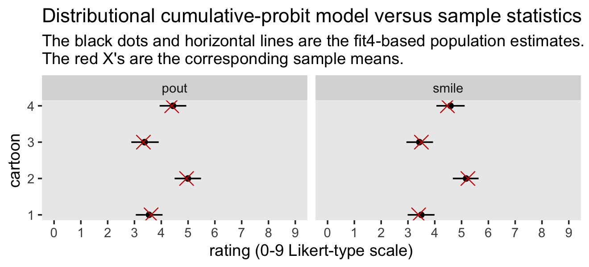

#### Major strength.

Whereas the Gaussian models were limited by their presumption data might
be legitimately described using the normal distribution, the
cumulative-probit models are fully capable of presuming the data can
only take on integer values between 0 and 9. To highlight this strength,
take a look at the posterior-predictive distributions from the two
models.

``` r
# fit3
set.seed(1)
p1 <- pp_check(fit3, type = "hist", ndraws = 3, binwidth = 0.5) +
  geom_vline(xintercept = c(0.5, 10.5), linetype = 2, size = 1/4) +
  scale_x_continuous(breaks = 1:10, labels = 0:9) +
  ggtitle("Conventional cumulative-probit multilevel\nmodel (fit3)") +
  theme(title = element_text(size = 9))

# fit4
set.seed(1)
p2 <- pp_check(fit4, type = "hist", ndraws = 3, binwidth = 0.5) +
  geom_vline(xintercept = c(0.5, 10.5), linetype = 2, size = 1/4) +
  scale_x_continuous(breaks = 1:10, labels = 0:9) +
  ggtitle("Cumulative-probit MELSM\n(fit4)") +
  theme(title = element_text(size = 9))

# combine
p1 + p2 + 
  plot_layout(guides = "collect") +
  plot_annotation(title = "Posterior-predictive checks",
                  theme = theme(plot.title = element_text(family = "Times")))
```

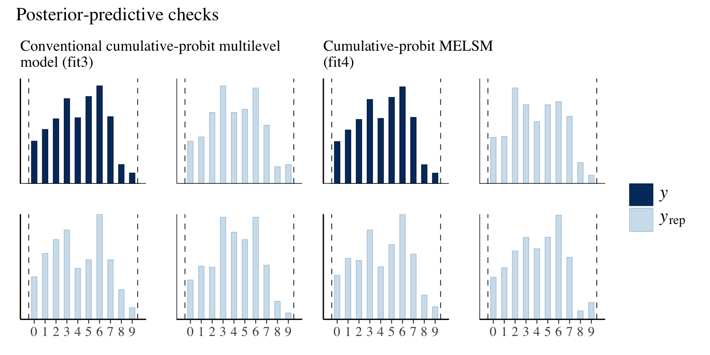

Both versions of the cumulative-probit model do a great job simulating
new data boasting the same basic characteristics as the empirical data.
Both models respected the ordinal nature of the data, including the
lower and upper limits. They also respected the asymmetric shape of the
overall distribution.

#### Kicks and giggles.

Jut for kicks and giggles, here’s how you might pot the conditional
means from the full cumulative-probit MELSM along with the sample data.
For reference, the layout of this plot came from a nice twitter
discussion, which you can find
[here](https://twitter.com/SolomonKurz/status/1517871041271549955).

``` r
# update
unstandardized_means <- unstandardized_means %>% 
  filter(name != "dif") %>% 
  mutate(cartoon = as.double(k))

# wrangle
albohn %>% 
  mutate(condition = ifelse(condition == 1, "smile", "pout")) %>% 

  # plot!
  ggplot(aes(x = rating)) +
  geom_bar(data = . %>% filter(condition == "smile"),
           aes(fill = condition)) +
  geom_bar(data = . %>% filter(condition == "pout"),
           aes(y = -..count.., fill = condition)) +
  geom_hline(yintercept = 0, size = 1, color = "gray96") +
  geom_pointrange(data = unstandardized_means %>% filter(name == "smile"),
                  aes(x = mu, xmin = .lower, xmax = .upper, y = -0.7),
                  fatten = 1, size = .65) +
  geom_pointrange(data = unstandardized_means %>% filter(name == "pout"),
                  aes(x = mu, xmin = .lower, xmax = .upper, y = 0.7),
                  fatten = 1, size = .65) +
  scale_fill_viridis_d("condition:", option = "D", begin = .4, end = .7, alpha = .6) +
  scale_x_continuous("funniness rating", breaks = 0:9) +
  scale_y_continuous("count",
                     breaks = -2:2 * 10, labels = c(2:1, 0:2) * 10,
                     limits = c(-20, 20)) +
  labs(title = "(2016) Strack [failed] replication results (Albohn lab only)",
       subtitle = "The sideways histograms show the sample data. The black point-intervals show the conditional\nmeans and their 95% intervals from the cumulative-probit MELSM. The similarity of the two point-\nintervals within each facet go against the predictions from the original Strack study. Tricking\nparticipants into smiling or frowning did not meaningfully effect how they rated the cratoons.") +
  theme(panel.grid = element_blank(),
        legend.position = "bottom") +
  facet_wrap(~ cartoon, labeller = label_both, nrow = 1) +
  coord_flip()
```

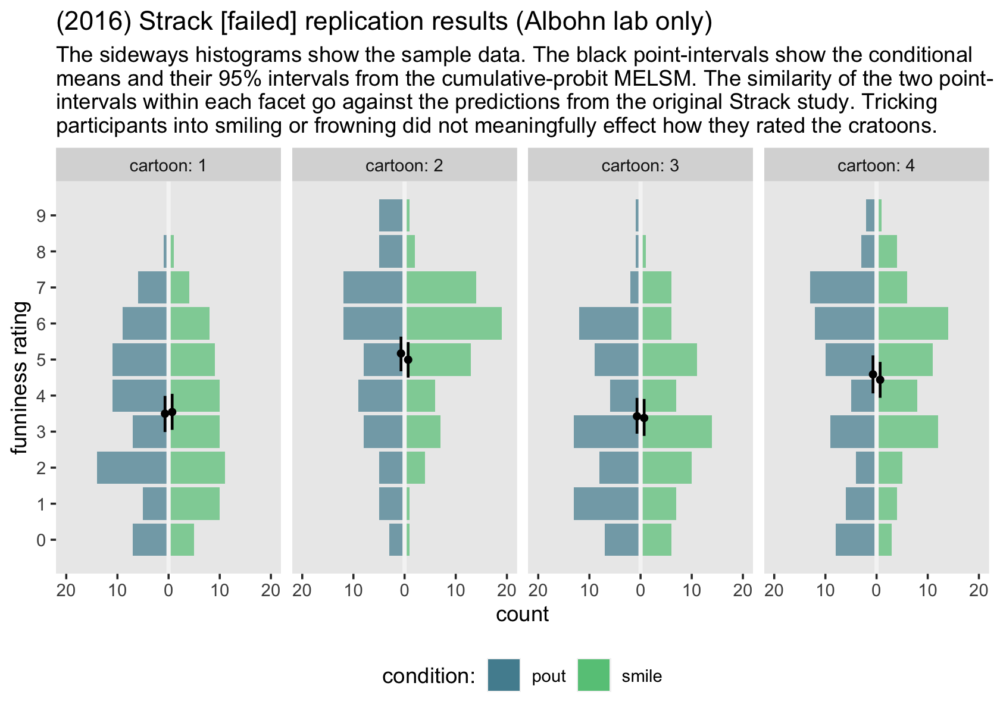

#### Next steps.

As complicated as it is, our distributional cumulative-probit model
could be made more general in a couple ways. First, did you notice that
the thresholds

were held constant across the four cartoons and the two experimental
conditions? You could allow them to vary with the `thres()` function and
its `gr` argument. For this data set, the differences were so small
between the experimental conditions an across the four cartoons that
this would have made very little difference. But in cases with greater
heterogeneity, you might explore this option.

Another option is category-specific effects. That is, the linear models
for

and
")
allowed for overall or averaged effects of the experimental condition on
the latent mean and standard deviation. The `cs()` helper function can
allow predictor variables in an ordinal **brms** model have
rating-specific effects, instead.

## Session information

``` r
sessionInfo()
```

    ## R version 4.2.0 (2022-04-22)
    ## Platform: x86_64-apple-darwin17.0 (64-bit)
    ## Running under: macOS Catalina 10.15.7
    ## 
    ## Matrix products: default
    ## BLAS:   /Library/Frameworks/R.framework/Versions/4.2/Resources/lib/libRblas.0.dylib
    ## LAPACK: /Library/Frameworks/R.framework/Versions/4.2/Resources/lib/libRlapack.dylib
    ## 
    ## locale:
    ## [1] en_US.UTF-8/en_US.UTF-8/en_US.UTF-8/C/en_US.UTF-8/en_US.UTF-8
    ## 
    ## attached base packages:
    ## [1] stats     graphics  grDevices utils     datasets  methods   base     
    ## 
    ## other attached packages:
    ##  [1] patchwork_1.1.1 tidybayes_3.0.2 brms_2.17.3     Rcpp_1.0.8.3    forcats_0.5.1   readr_2.1.2    
    ##  [7] purrr_0.3.4     stringr_1.4.0   tidyr_1.2.0     dplyr_1.0.9     tibble_3.1.7    ggplot2_3.3.6  
    ## 
    ## loaded via a namespace (and not attached):
    ##   [1] TH.data_1.1-1        colorspace_2.0-3     ellipsis_0.3.2       ggridges_0.5.3       estimability_1.3    
    ##   [6] markdown_1.1         base64enc_0.1-3      rstudioapi_0.13      farver_2.1.0         rstan_2.26.11       
    ##  [11] svUnit_1.0.6         DT_0.22              lubridate_1.8.0      fansi_1.0.3          mvtnorm_1.1-3       
    ##  [16] diffobj_0.3.5        bridgesampling_1.1-2 codetools_0.2-18     splines_4.2.0        knitr_1.39          
    ##  [21] shinythemes_1.2.0    bayesplot_1.9.0      jsonlite_1.8.0       ggdist_3.1.1         shiny_1.7.1         
    ##  [26] compiler_4.2.0       emmeans_1.7.3        backports_1.4.1      assertthat_0.2.1     Matrix_1.4-1        
    ##  [31] fastmap_1.1.0        cli_3.3.0            later_1.3.0          htmltools_0.5.2      prettyunits_1.1.1   
    ##  [36] tools_4.2.0          igraph_1.3.1         coda_0.19-4          gtable_0.3.0         glue_1.6.2          
    ##  [41] reshape2_1.4.4       posterior_1.2.1      V8_4.1.0             vctrs_0.4.1          nlme_3.1-157        
    ##  [46] crosstalk_1.2.0      tensorA_0.36.2       xfun_0.31            ps_1.7.0             mime_0.12           
    ##  [51] miniUI_0.1.1.1       lifecycle_1.0.1      gtools_3.9.2         MASS_7.3-56          zoo_1.8-10          
    ##  [56] scales_1.2.0         colourpicker_1.1.1   hms_1.1.1            promises_1.2.0.1     Brobdingnag_1.2-7   
    ##  [61] parallel_4.2.0       sandwich_3.0-1       inline_0.3.19        shinystan_2.6.0      yaml_2.3.5          
    ##  [66] curl_4.3.2           gridExtra_2.3        loo_2.5.1            StanHeaders_2.26.11  stringi_1.7.6       
    ##  [71] highr_0.9            dygraphs_1.1.1.6     checkmate_2.1.0      pkgbuild_1.3.1       rlang_1.0.2         
    ##  [76] pkgconfig_2.0.3      matrixStats_0.62.0   distributional_0.3.0 evaluate_0.15        lattice_0.20-45     
    ##  [81] labeling_0.4.2       rstantools_2.2.0     htmlwidgets_1.5.4    processx_3.5.3       tidyselect_1.1.2    
    ##  [86] plyr_1.8.7           magrittr_2.0.3       R6_2.5.1             generics_0.1.2       multcomp_1.4-19     
    ##  [91] DBI_1.1.2            pillar_1.7.0         withr_2.5.0          xts_0.12.1           survival_3.3-1      
    ##  [96] abind_1.4-5          crayon_1.5.1         arrayhelpers_1.1-0   utf8_1.2.2           tzdb_0.3.0          
    ## [101] rmarkdown_2.14       grid_4.2.0           callr_3.7.0          threejs_0.3.3        digest_0.6.29       
    ## [106] xtable_1.8-4         httpuv_1.6.5         RcppParallel_5.1.5   stats4_4.2.0         munsell_0.5.0       
    ## [111] viridisLite_0.4.0    shinyjs_2.1.0
