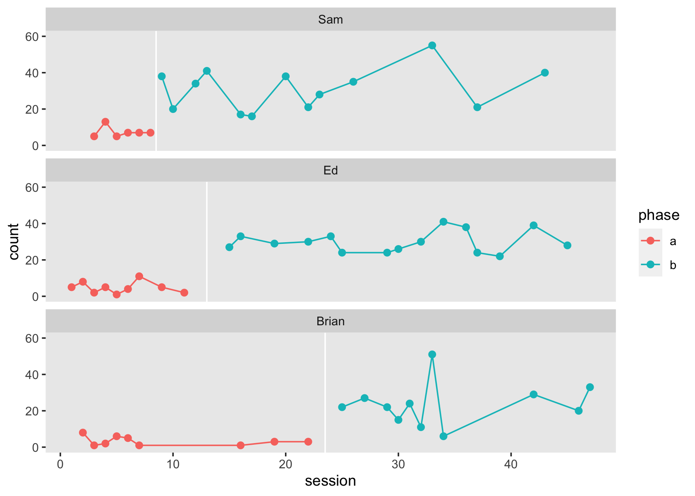

mason2014
================
A Solomon Kurz
2022-11-21

The purpose of this file is to make a data set resembling those in Mason
et al (2014; <https://doi.org/10.1016/j.rasd.2013.12.014>). In the
`Digitize Mason et al (2014).Rmd` file, we digitized the data which
Mason and colleagues displayed in their Figure 2 (p. 340) and saved the
results in a series of `.csv` files. Here we’ll collect those files and
wrangle the data into a useful format.

Load the **tidyverse**.

``` r
library(tidyverse)
```

As a first step, we load collect the data from the four `.csv` files
into a single data frame.

``` r
d <- tibble(sn = 1:3) %>% 
  mutate(file = str_c("Mason et al (2014)/count0", sn, "_juicr_extracted_points.csv")) %>% 
  mutate(data = map(file, read_csv, show_col_types = FALSE)) %>% 
  unnest(data)

# what is this?
glimpse(d)
```

    ## Rows: 63
    ## Columns: 11
    ## $ sn           <int> 1, 1, 1, 1, 1, 1, 1, 1, 1, 1, 1, 1, 1, 1, 1, 1, 1, 1, 1, 1, 2, 2, 2, 2, 2, 2, 2, 2, 2, …
    ## $ file         <chr> "Mason et al (2014)/count01_juicr_extracted_points.csv", "Mason et al (2014)/count01_ju…
    ## $ x.calibrated <dbl> 1.9987230, 2.9974460, 3.9961690, 5.0536400, 5.9348660, 6.9923370, 15.9808400, 18.977010…
    ## $ x.label      <chr> "x", "x", "x", "x", "x", "x", "x", "x", "x", "x", "x", "x", "x", "x", "x", "x", "x", "x…
    ## $ x.units      <lgl> NA, NA, NA, NA, NA, NA, NA, NA, NA, NA, NA, NA, NA, NA, NA, NA, NA, NA, NA, NA, NA, NA,…
    ## $ x.coord      <dbl> 128, 145, 162, 180, 195, 213, 366, 417, 468, 520, 554, 588, 605, 623, 639, 655, 673, 80…
    ## $ y.calibrated <dbl> 8.0446930, 0.8379888, 2.0111730, 6.0335200, 4.8603350, 1.0055870, 1.0055870, 3.0167600,…
    ## $ y.label      <chr> "y", "y", "y", "y", "y", "y", "y", "y", "y", "y", "y", "y", "y", "y", "y", "y", "y", "y…
    ## $ y.units      <lgl> NA, NA, NA, NA, NA, NA, NA, NA, NA, NA, NA, NA, NA, NA, NA, NA, NA, NA, NA, NA, NA, NA,…
    ## $ y.coord      <dbl> 339, 382, 375, 351, 358, 381, 381, 369, 369, 256, 226, 256, 300, 244, 322, 81, 352, 215…
    ## $ group        <chr> "orangeGrp", "orangeGrp", "orangeGrp", "orangeGrp", "orangeGrp", "orangeGrp", "orangeGr…

A few of the columns are of interest:

-   `sn` contains the generic participants identifiers, ranging from `1`
    to `3`.
-   `x.calibrated` contains the digitized session numbers from the
    x-axis of Figure 2. This will need to be rounded to integer values.
-   `y.calibrated` contains the digitized behavioral counts from the
    y-axis of Figure 2. This will also need to be rounded to integer
    values.
-   `group` contains generic grouping names for the three experimental
    conditions. This will need to be converted to more sensible
    non-default names.

Here we wrangle the data into a more useful format and save the results
as `mason2014`.

``` r
mason2014 <- d %>% 
  # wrangle the columns of interest and drop the unnecessary ones
  transmute(sn      = sn,
            session = round(x.calibrated, digits = 0),
            count   = round(y.calibrated, digits = 0),
            group   = str_remove(group, "Grp")) %>% 
  # make a version of session that starts with zero
  mutate(session0 = session - 1) %>%
  # we need to reverse the order of the sn values
  mutate(sn = 4 - sn) %>% 
  # sort the data by sn and session
  arrange(sn, session)  %>% 
  # assign the pseudonyms as displayed in Figure 1
  mutate(id = case_when(
    sn == 1 ~ "Sam",
    sn == 2 ~ "Ed",
    sn == 3 ~ "Brian") %>% 
      fct_reorder(., sn)) %>% 
  # convert the generic groupings into behavioral phases
  mutate(phase = case_when(
    group == "orange" ~ "a",
    group == "cherry" ~ "b")
    ) %>% 
  # reorder the columns
  # select(sn, id, session, session0, phase, count)
  select(sn, id, session, phase, count)
```

Take a look at the data.

``` r
glimpse(mason2014)
```

    ## Rows: 63
    ## Columns: 5
    ## $ sn      <dbl> 1, 1, 1, 1, 1, 1, 1, 1, 1, 1, 1, 1, 1, 1, 1, 1, 1, 1, 1, 2, 2, 2, 2, 2, 2, 2, 2, 2, 2, 2, 2,…
    ## $ id      <fct> Sam, Sam, Sam, Sam, Sam, Sam, Sam, Sam, Sam, Sam, Sam, Sam, Sam, Sam, Sam, Sam, Sam, Sam, Sa…
    ## $ session <dbl> 3, 4, 5, 6, 7, 8, 9, 10, 12, 13, 16, 17, 20, 22, 23, 26, 33, 37, 43, 1, 2, 3, 4, 5, 6, 7, 9,…
    ## $ phase   <chr> "a", "a", "a", "a", "a", "a", "b", "b", "b", "b", "b", "b", "b", "b", "b", "b", "b", "b", "b…
    ## $ count   <dbl> 5, 13, 5, 7, 7, 7, 38, 20, 34, 41, 17, 16, 38, 21, 28, 35, 55, 21, 40, 5, 8, 2, 5, 1, 4, 11,…

We can look at the data with a version of Figure 2 from the original
article.

``` r
lines <- mason2014 %>% 
  distinct(sn, id) %>% 
  mutate(xintercept = c(8.5, 13, 23.5))

mason2014 %>% 
  ggplot(aes(x = session, y = count, color = phase)) +
  geom_vline(data = lines,
             aes(xintercept = xintercept),
             color = "white") +
  geom_point(size = 2) +
  geom_line() +
  xlim(1, NA) +
  ylim(0, 60) +
  facet_wrap(~ id, ncol = 1) +
  theme(panel.grid = element_blank())
```



Now save the results in an external file.

``` r
save(mason2014, file = "mason2014.rda")
```

## Session information

``` r
sessionInfo()
```

    ## R version 4.2.0 (2022-04-22)
    ## Platform: x86_64-apple-darwin17.0 (64-bit)
    ## Running under: macOS Big Sur/Monterey 10.16
    ## 
    ## Matrix products: default
    ## BLAS:   /Library/Frameworks/R.framework/Versions/4.2/Resources/lib/libRblas.0.dylib
    ## LAPACK: /Library/Frameworks/R.framework/Versions/4.2/Resources/lib/libRlapack.dylib
    ## 
    ## locale:
    ## [1] en_US.UTF-8/en_US.UTF-8/en_US.UTF-8/C/en_US.UTF-8/en_US.UTF-8
    ## 
    ## attached base packages:
    ## [1] stats     graphics  grDevices utils     datasets  methods   base     
    ## 
    ## other attached packages:
    ## [1] forcats_0.5.1   stringr_1.4.1   dplyr_1.0.10    purrr_0.3.4     readr_2.1.2     tidyr_1.2.1    
    ## [7] tibble_3.1.8    ggplot2_3.4.0   tidyverse_1.3.2
    ## 
    ## loaded via a namespace (and not attached):
    ##  [1] lubridate_1.8.0     assertthat_0.2.1    digest_0.6.30       utf8_1.2.2          R6_2.5.1           
    ##  [6] cellranger_1.1.0    backports_1.4.1     reprex_2.0.2        evaluate_0.18       httr_1.4.4         
    ## [11] highr_0.9           pillar_1.8.1        rlang_1.0.6         googlesheets4_1.0.1 readxl_1.4.1       
    ## [16] rstudioapi_0.13     rmarkdown_2.16      labeling_0.4.2      googledrive_2.0.0   bit_4.0.4          
    ## [21] munsell_0.5.0       broom_1.0.1         compiler_4.2.0      modelr_0.1.8        xfun_0.33          
    ## [26] pkgconfig_2.0.3     htmltools_0.5.3     tidyselect_1.1.2    fansi_1.0.3         crayon_1.5.2       
    ## [31] tzdb_0.3.0          dbplyr_2.2.1        withr_2.5.0         grid_4.2.0          jsonlite_1.8.3     
    ## [36] gtable_0.3.1        lifecycle_1.0.3     DBI_1.1.3           magrittr_2.0.3      scales_1.2.1       
    ## [41] cli_3.4.1           stringi_1.7.8       vroom_1.5.7         farver_2.1.1        fs_1.5.2           
    ## [46] xml2_1.3.3          ellipsis_0.3.2      generics_0.1.3      vctrs_0.5.0         tools_4.2.0        
    ## [51] bit64_4.0.5         glue_1.6.2          hms_1.1.1           parallel_4.2.0      fastmap_1.1.0      
    ## [56] yaml_2.3.5          colorspace_2.0-3    gargle_1.2.0        rvest_1.0.2         knitr_1.40         
    ## [61] haven_2.5.1

``` r
d <- mason2014 %>% 
  mutate(session0 = session - 1) %>% 
  mutate(session01 = session0 / max(session0),
         b = ifelse(phase == "b", 1, 0))
```

``` r
library(lme4)
```

    ## Loading required package: Matrix

    ## 
    ## Attaching package: 'Matrix'

    ## The following objects are masked from 'package:tidyr':
    ## 
    ##     expand, pack, unpack

``` r
library(marginaleffects)
```

``` r
fit1 <- glmer(
  data = d, 
  family = poisson,
  count ~ 1 + session01 + phase + session01:phase + (1 + session01 + phase + session01:phase | id)
)
```

    ## boundary (singular) fit: see help('isSingular')

``` r
summary(fit1)
```

    ## Generalized linear mixed model fit by maximum likelihood (Laplace Approximation) ['glmerMod']
    ##  Family: poisson  ( log )
    ## Formula: count ~ 1 + session01 + phase + session01:phase + (1 + session01 +  
    ##     phase + session01:phase | id)
    ##    Data: d
    ## 
    ##      AIC      BIC   logLik deviance df.resid 
    ##    475.8    505.8   -223.9    447.8       49 
    ## 
    ## Scaled residuals: 
    ##     Min      1Q  Median      3Q     Max 
    ## -3.7464 -1.0624  0.0631  0.9271  5.3620 
    ## 
    ## Random effects:
    ##  Groups Name             Variance Std.Dev. Corr             
    ##  id     (Intercept)      0.06016  0.2453                    
    ##         session01        0.04082  0.2020    1.00            
    ##         phaseb           0.02306  0.1519   -1.00 -1.00      
    ##         session01:phaseb 0.01882  0.1372   -1.00 -1.00  1.00
    ## Number of obs: 63, groups:  id, 3
    ## 
    ## Fixed effects:
    ##                  Estimate Std. Error z value Pr(>|z|)    
    ## (Intercept)        1.7271     0.2207   7.826 5.05e-15 ***
    ## session01         -1.2063     1.4337  -0.841    0.400    
    ## phaseb             1.4584     0.2209   6.604 4.02e-11 ***
    ## session01:phaseb   1.4675     1.4380   1.021    0.307    
    ## ---
    ## Signif. codes:  0 '***' 0.001 '**' 0.01 '*' 0.05 '.' 0.1 ' ' 1
    ## 
    ## Correlation of Fixed Effects:
    ##             (Intr) sssn01 phaseb
    ## session01   -0.578              
    ## phaseb      -0.832  0.586       
    ## sssn01:phsb  0.591 -0.993 -0.652
    ## optimizer (Nelder_Mead) convergence code: 0 (OK)
    ## boundary (singular) fit: see help('isSingular')

``` r
fit2 <- glmer.nb(
  data = d, 
  count ~ 1 + session01 + phase + session01:phase + (1 + session01 + phase + session01:phase | id)
)
```

    ## boundary (singular) fit: see help('isSingular')

``` r
summary(fit2)
```

    ## Generalized linear mixed model fit by maximum likelihood (Laplace Approximation) ['glmerMod']
    ##  Family: Negative Binomial(11.3003)  ( log )
    ## Formula: count ~ 1 + session01 + phase + session01:phase + (1 + session01 +  
    ##     phase + session01:phase | id)
    ##    Data: d
    ## 
    ##      AIC      BIC   logLik deviance df.resid 
    ##    434.3    466.4   -202.2    404.3       48 
    ## 
    ## Scaled residuals: 
    ##     Min      1Q  Median      3Q     Max 
    ## -2.1439 -0.7115  0.0056  0.5205  2.7872 
    ## 
    ## Random effects:
    ##  Groups Name             Variance Std.Dev. Corr             
    ##  id     (Intercept)      0.052722 0.22961                   
    ##         session01        0.004896 0.06997   1.00            
    ##         phaseb           0.031416 0.17724  -1.00 -1.00      
    ##         session01:phaseb 0.000681 0.02610   1.00  1.00 -1.00
    ## Number of obs: 63, groups:  id, 3
    ## 
    ## Fixed effects:
    ##                  Estimate Std. Error z value Pr(>|z|)    
    ## (Intercept)        1.7536     0.2398   7.312 2.63e-13 ***
    ## session01         -1.4644     1.6267  -0.900    0.368    
    ## phaseb             1.4778     0.2928   5.047 4.50e-07 ***
    ## session01:phaseb   1.6586     1.6416   1.010    0.312    
    ## ---
    ## Signif. codes:  0 '***' 0.001 '**' 0.01 '*' 0.05 '.' 0.1 ' ' 1
    ## 
    ## Correlation of Fixed Effects:
    ##             (Intr) sssn01 phaseb
    ## session01   -0.670              
    ## phaseb      -0.739  0.524       
    ## sssn01:phsb  0.677 -0.983 -0.641
    ## optimizer (Nelder_Mead) convergence code: 0 (OK)
    ## boundary (singular) fit: see help('isSingular')

``` r
predictions(fit1) %>% 
  ggplot(aes(x = session01, y = predicted, group = phase)) +
  geom_point(data = d,
             aes(y = count)) +
  geom_line() +
  facet_wrap(~ id)
```


``` r
predictions(fit2) %>% 
  ggplot(aes(x = session01, y = predicted, group = phase)) +
  geom_point(data = d,
             aes(y = count)) +
  geom_line() +
  facet_wrap(~ id)
```


``` r
d %>% 
 filter(phase == "a") %>% 
  group_by(id) %>% 
  filter(session == max(session)) %>% 
  ungroup() %>% 
  summarise(mean_session = mean(session))
```

    ## # A tibble: 1 × 1
    ##   mean_session
    ##          <dbl>
    ## 1         13.7

``` r
max(d$session)
```

    ## [1] 47

``` r
max(d$session0)
```

    ## [1] 46

``` r
nd <- tibble(session = 1:47) %>% 
  mutate(session0 = session - 1) %>% 
  mutate(session01 = session0 / max(session0)) %>% 
  mutate(phase = ifelse(session <= 14, "a", "b"),
         id = NA)

predictions(fit1,
            newdata = nd,
            include_random = FALSE) %>% 
  
  ggplot(aes(x = session, y = predicted, 
             ymin = conf.low, ymax = conf.high,
             group = phase)) +
  geom_ribbon(alpha = 1/3) +
  geom_line() +
  coord_cartesian(ylim = c(0, 60))
```


``` r
predictions(fit2,
            newdata = nd,
            include_random = FALSE) %>% 
  
  ggplot(aes(x = session, y = predicted, 
             ymin = conf.low, ymax = conf.high,
             group = phase)) +
  geom_ribbon(alpha = 1/3) +
  geom_line() +
  coord_cartesian(ylim = c(0, 60))
```


