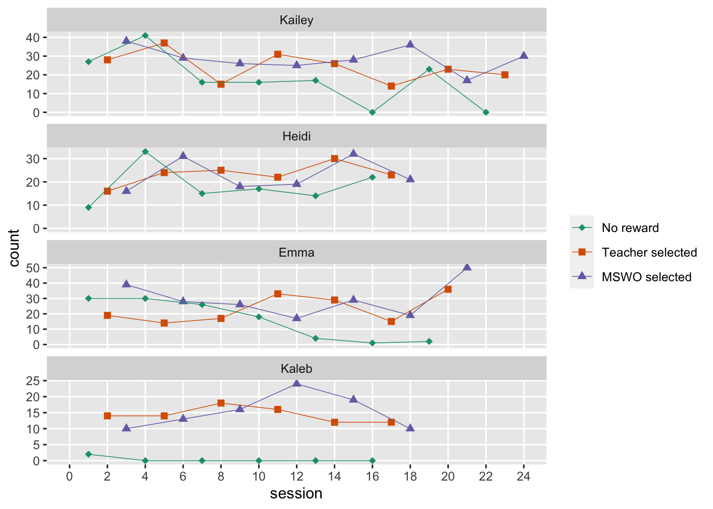

resetar2008
================
A Solomon Kurz
2022-11-14

The purpose of this file is to make a data set resembling those in
Resetar & Noell (2008; <https://doi.org/10.1901/jaba.2008.41-447>). In
the `Digitize Resetar & Noell (2008).Rmd` file, we digitized the data
which Resetar and Noell displayed in their Figure 1 (p. 450) and saved
the results in a series of `.csv` files. Here we’ll collect those files
and wrangle the data into a useful format.

Load the **tidyverse**.

``` r
library(tidyverse)
```

As a first step, we load collect the data from the four `.csv` files
into a single data frame.

``` r
d <- tibble(sn = 1:4) %>% 
  mutate(file = str_c("Resetar & Noell (2008)/count0", sn, "_juicr_extracted_points.csv")) %>% 
  mutate(data = map(file, read_csv, show_col_types = FALSE)) %>% 
  unnest(data)

# what is this?
glimpse(d)
```

    ## Rows: 81
    ## Columns: 11
    ## $ sn           <int> 1, 1, 1, 1, 1, 1, 1, 1, 1, 1, 1, 1, 1, 1, 1, 1, 1, 1, 1, 1, 1, 1, 1, 1, 2, 2, 2, 2, 2, …
    ## $ file         <chr> "Resetar & Noell (2008)/count01_juicr_extracted_points.csv", "Resetar & Noell (2008)/co…
    ## $ x.calibrated <dbl> 1.024719, 3.991011, 7.011236, 9.977528, 12.997750, 15.991010, 19.011240, 21.977530, 1.9…
    ## $ x.label      <chr> "x", "x", "x", "x", "x", "x", "x", "x", "x", "x", "x", "x", "x", "x", "x", "x", "x", "x…
    ## $ x.units      <lgl> NA, NA, NA, NA, NA, NA, NA, NA, NA, NA, NA, NA, NA, NA, NA, NA, NA, NA, NA, NA, NA, NA,…
    ## $ x.coord      <dbl> 110, 220, 332, 442, 554, 665, 777, 887, 146, 256, 368, 478, 591, 701, 813, 923, 185, 29…
    ## $ y.calibrated <dbl> 27.155170, 41.379310, 16.163790, 16.163790, 17.025860, 0.000000, 23.275860, 0.000000, 2…
    ## $ y.label      <chr> "y", "y", "y", "y", "y", "y", "y", "y", "y", "y", "y", "y", "y", "y", "y", "y", "y", "y…
    ## $ y.units      <lgl> NA, NA, NA, NA, NA, NA, NA, NA, NA, NA, NA, NA, NA, NA, NA, NA, NA, NA, NA, NA, NA, NA,…
    ## $ y.coord      <dbl> 140, 74, 191, 191, 187, 266, 158, 266, 135, 93, 195, 124, 147, 199, 157, 173, 88, 132, …
    ## $ group        <chr> "orangeGrp", "orangeGrp", "orangeGrp", "orangeGrp", "orangeGrp", "orangeGrp", "orangeGr…

A few of the columns are of interest:

-   `sn` contains the generic participants identifiers, ranging from `1`
    to `4`.
-   `x.calibrated` contains the digitized session numbers from the
    x-axis of Figure 1. This will need to be rounded to integer values.
-   `y.calibrated` contains the digitized behavioral counts from the
    y-axis of Figure 1. This will also need to be rounded to integer
    values.
-   `group` contains generic grouping names for the three experimental
    conditions. This will need to be converted to more sensible
    non-default names.

Here we wrangle the data into a more useful format and save the results
as `resetar2008`.

``` r
resetar2008 <- d %>% 
  # wrangle the columns of interest and drop the unnecessary ones
  transmute(sn      = sn,
            session = round(x.calibrated, digits = 0),
            count   = round(y.calibrated, digits = 0),
            group   = str_remove(group, "Grp")) %>% 
  # make a version of session that starts with zero
  mutate(session0 = session - 1) %>% 
  # sort the data by sn and session
  arrange(sn, session)  %>% 
  # assign the pseudonyms as displayed in Figure 1
  mutate(id = case_when(
    sn == 1 ~ "Kailey",
    sn == 2 ~ "Heidi",
    sn == 3 ~ "Emma",
    sn == 4 ~ "Kaleb") %>% 
      fct_reorder(., sn)) %>% 
  # convert the generic groupings into behavioral phases
  mutate(phase = case_when(
    group == "orange" ~ "a",
    group == "cherry" ~ "b",
    group == "kiwi"   ~ "c")
    ) %>% 
  # convert the experimental phaess into descriptive experimental conditions
  mutate(condition = factor(phase, labels = c("No reward", "Teacher selected", "MSWO selected"))) %>% 
  # reorder the columns
  select(sn, id, session, session0, phase, condition, count)
```

Take a look at the data.

``` r
glimpse(resetar2008)
```

    ## Rows: 81
    ## Columns: 7
    ## $ sn        <int> 1, 1, 1, 1, 1, 1, 1, 1, 1, 1, 1, 1, 1, 1, 1, 1, 1, 1, 1, 1, 1, 1, 1, 1, 2, 2, 2, 2, 2, 2, …
    ## $ id        <fct> Kailey, Kailey, Kailey, Kailey, Kailey, Kailey, Kailey, Kailey, Kailey, Kailey, Kailey, Ka…
    ## $ session   <dbl> 1, 2, 3, 4, 5, 6, 7, 8, 9, 10, 11, 12, 13, 14, 15, 16, 17, 18, 19, 20, 21, 22, 23, 24, 1, …
    ## $ session0  <dbl> 0, 1, 2, 3, 4, 5, 6, 7, 8, 9, 10, 11, 12, 13, 14, 15, 16, 17, 18, 19, 20, 21, 22, 23, 0, 1…
    ## $ phase     <chr> "a", "b", "c", "a", "b", "c", "a", "b", "c", "a", "b", "c", "a", "b", "c", "a", "b", "c", …
    ## $ condition <fct> No reward, Teacher selected, MSWO selected, No reward, Teacher selected, MSWO selected, No…
    ## $ count     <dbl> 27, 28, 38, 41, 37, 29, 16, 15, 26, 16, 31, 25, 17, 26, 28, 0, 14, 36, 23, 23, 17, 0, 20, …

Now we can make a version of Figure 1 from the original paper.

``` r
resetar2008 %>% 
  ggplot(aes(x = session, y = count, 
             group = condition, shape = condition, color = condition)) +
  geom_point(size = 2) +
  geom_path(linewidth = 1/4) +
  scale_shape_manual(NULL, values = c(18, 15, 17)) +
  scale_color_brewer(NULL, palette = "Dark2") +
  scale_x_continuous(breaks = 0:12 * 2, limits = c(0, 24)) +
  scale_y_continuous(limits = c(0, NA)) +
  theme(panel.grid.minor = element_blank()) +
  facet_wrap(~ id, scales = "free_y", ncol = 1)
```



Now save the results in an external file.

``` r
save(resetar2008, file = "resetar2008.rda")
```

## Session information

``` r
sessionInfo()
```

    ## R version 4.2.0 (2022-04-22)
    ## Platform: x86_64-apple-darwin17.0 (64-bit)
    ## Running under: macOS Big Sur/Monterey 10.16
    ## 
    ## Matrix products: default
    ## BLAS:   /Library/Frameworks/R.framework/Versions/4.2/Resources/lib/libRblas.0.dylib
    ## LAPACK: /Library/Frameworks/R.framework/Versions/4.2/Resources/lib/libRlapack.dylib
    ## 
    ## locale:
    ## [1] en_US.UTF-8/en_US.UTF-8/en_US.UTF-8/C/en_US.UTF-8/en_US.UTF-8
    ## 
    ## attached base packages:
    ## [1] stats     graphics  grDevices utils     datasets  methods   base     
    ## 
    ## other attached packages:
    ## [1] forcats_0.5.1   stringr_1.4.1   dplyr_1.0.10    purrr_0.3.4     readr_2.1.2     tidyr_1.2.1    
    ## [7] tibble_3.1.8    ggplot2_3.4.0   tidyverse_1.3.2
    ## 
    ## loaded via a namespace (and not attached):
    ##  [1] lubridate_1.8.0     assertthat_0.2.1    digest_0.6.30       utf8_1.2.2          R6_2.5.1           
    ##  [6] cellranger_1.1.0    backports_1.4.1     reprex_2.0.2        evaluate_0.18       highr_0.9          
    ## [11] httr_1.4.4          pillar_1.8.1        rlang_1.0.6         googlesheets4_1.0.1 readxl_1.4.1       
    ## [16] rstudioapi_0.13     rmarkdown_2.16      labeling_0.4.2      googledrive_2.0.0   bit_4.0.4          
    ## [21] munsell_0.5.0       broom_1.0.1         compiler_4.2.0      modelr_0.1.8        xfun_0.33          
    ## [26] pkgconfig_2.0.3     htmltools_0.5.3     tidyselect_1.1.2    fansi_1.0.3         crayon_1.5.2       
    ## [31] tzdb_0.3.0          dbplyr_2.2.1        withr_2.5.0         grid_4.2.0          jsonlite_1.8.3     
    ## [36] gtable_0.3.1        lifecycle_1.0.3     DBI_1.1.3           magrittr_2.0.3      scales_1.2.1       
    ## [41] cli_3.4.1           stringi_1.7.8       vroom_1.5.7         farver_2.1.1        fs_1.5.2           
    ## [46] xml2_1.3.3          ellipsis_0.3.2      generics_0.1.3      vctrs_0.5.0         RColorBrewer_1.1-3 
    ## [51] tools_4.2.0         bit64_4.0.5         glue_1.6.2          hms_1.1.1           parallel_4.2.0     
    ## [56] fastmap_1.1.0       yaml_2.3.5          colorspace_2.0-3    gargle_1.2.0        rvest_1.0.2        
    ## [61] knitr_1.40          haven_2.5.1
