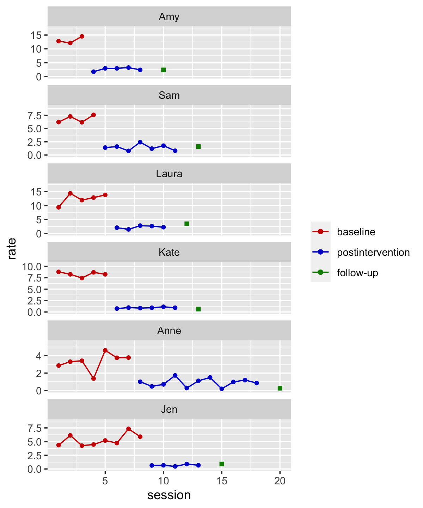

mancuso2016
================
A Solomon Kurz
2022-11-04

The purpose of this file is to simulate the data from Mancuso &
Miltenberger (2016; <https://doi.org/10.1002/jaba.267>). We don’t have
their actual data file, they displayed their data in Figure 1 (p. 191).
Here we’ll work through that figure to make a data file that
approximates their original data.

Load the **tidyverse** and **juicr**.

``` r
library(tidyverse)
library(juicr)
```

First use the `juicr::GUI_juicr()` function to digitize the data, one
participant at a time, from Figure 1 in Mancuso & Miltenberger (p. 191).

``` r
GUI_juicr("pics/rate01.png")
GUI_juicr("pics/rate02.png")
GUI_juicr("pics/rate03.png")
GUI_juicr("pics/rate04.png")
GUI_juicr("pics/rate05.png")
GUI_juicr("pics/rate06.png")
```

Now we combine the data in the .csv files, round the `session` values to
integers, round the `rate` values to the third decimal place, and add
participant identifiers.

``` r
d <- tibble(files = list.files(pattern = "rate0[1-6]*_juicr_extracted_points")) %>% 
  mutate(data = map(files, read_csv)) %>% 
  unnest(data) %>% 
  transmute(sn      = str_extract(files, "\\d+") %>% as.double(),
            session = round(x.calibrated, digits = 0),
            rate    = round(y.calibrated, digits = 3)) %>% 
  mutate(session0 = session - 1) %>% 
  arrange(sn, session) %>% 
  mutate(id = case_when(
    sn == 1 ~ "Jen",
    sn == 2 ~ "Anne",
    sn == 3 ~ "Kate",
    sn == 4 ~ "Laura",
    sn == 5 ~ "Sam",
    sn == 6 ~ "Amy"
  )) %>% 
  # convert id to an ordered factor
  mutate(id = fct_reorder(id, sn)) %>% 
  mutate(id = fct_rev(id))

# what?
head(d)
```

    ## # A tibble: 6 × 5
    ##      sn session  rate session0 id   
    ##   <dbl>   <dbl> <dbl>    <dbl> <fct>
    ## 1     1       1  4.35        0 Jen  
    ## 2     1       2  6.13        1 Jen  
    ## 3     1       3  4.26        2 Jen  
    ## 4     1       4  4.47        3 Jen  
    ## 5     1       5  5.20        4 Jen  
    ## 6     1       6  4.73        5 Jen

We need to manually add a `phase` variable, which will vary across
participants and over time. I’m not aware of an elegant way to do this,
so we’ll just use brute force.

``` r
d <- d %>% 
  mutate(phase = c(rep(letters[1:3], times = c(8, 5, 1)),
                   rep(letters[1:3], times = c(7, 11, 1)),
                   rep(letters[1:3], times = c(5, 6, 1)),
                   rep(letters[1:3], times = c(5, 5, 1)),
                   rep(letters[1:3], times = c(4, 7, 1)),
                   rep(letters[1:3], times = c(3, 5, 1))))
```

Here the `phase == "a"` is the baseline period, `phase == "b"` is the
post-intervention assessment period, and `phase == "c"` is the
follow-up.

Though the dependent variable was displayed as a rate in Figure 1, the
underlying data were behavioral counts divided by the time periods in
which they were measured. The difficulty is the authors did not report
the actual durations of each student’s speach, other than the general
statement:

> All sessions included 3- to 5-min speeches. (p. 189)

A little further, we read:

> The researcher did not provide any guidelines for the speech outline.
> Each participant was allowed to use her outline during her speech. At
> 4 min into the speech, the researcher signaled that the participant
> had 1 min left to speak, and when 5 min had elapsed, the researcher
> signaled the end of the speech. If the participant attempted to end
> the speech before 3 min had elapsed or stopped speaking for more than
> 15 s, the researcher said, “please continue.” Speeches ended when 5
> min had elapsed or when at least 3 min had elapsed and the participant
> ended the speech. (pp. 189–190)

Here we’ll use modified beta distributions to simulate the speech
durations. $\operatorname{Beta}(0.5, 0.7)$ will make for speech
durations slightly biased toward the lower limit and
$\operatorname{Beta}(0.5, 0.7)$ will make for speech durations slightly
biased toward the upper limit. Here are what those modified beta
densities look like in a plot.

``` r
tibble(x = c(seq(from = 0.001, to = 0.999, by = 0.001),
             seq(from = 0.001, to = 0.999, by = 0.001))) %>% 
  mutate(phase = rep(c("baseline", "post baseline"), each = n() / 2)) %>% 
  mutate(d = ifelse(phase == "baseline",
                    dbeta(x = x, shape1 = 0.5, shape2 = 0.7),
                    dbeta(x = x, shape1 = 0.7, shape2 = 0.5))) %>% 
  mutate(seconds = x * 120 + 180) %>% 
  
  ggplot(aes(x = seconds, y = d)) +
  geom_area() +
  coord_cartesian(ylim = c(0, 8)) +
  facet_wrap(~ phase)
```


Simulate and save.

``` r
set.seed(1)

d <- d %>% 
  mutate(beta = ifelse(phase == "a", 
                       rbeta(n = n(), shape1 = 0.5, shape2 = 0.7),
                       rbeta(n = n(), shape1 = 0.7, shape2 = 0.5))) %>% 
  mutate(seconds = round(beta * 120 + 180, digits = 0)) %>% 
  mutate(minutes = seconds / 60) %>% 
  # compute the counts
  mutate(count = round(rate * (seconds / 60), digits = 0))
```

Now rearrange the columns in the `d` data and save the results as
`mancuso2016`.

``` r
mancuso2016 <- d %>% 
  select(sn, id, session, session0, phase, count, seconds, minutes, rate)

# what is this?
head(mancuso2016)
```

    ## # A tibble: 6 × 9
    ##      sn id    session session0 phase count seconds minutes  rate
    ##   <dbl> <fct>   <dbl>    <dbl> <chr> <dbl>   <dbl>   <dbl> <dbl>
    ## 1     1 Jen         1        0 a        20     281    4.68  4.35
    ## 2     1 Jen         2        1 a        22     214    3.57  6.13
    ## 3     1 Jen         3        2 a        14     204    3.4   4.26
    ## 4     1 Jen         4        3 a        22     290    4.83  4.47
    ## 5     1 Jen         5        4 a        17     195    3.25  5.20
    ## 6     1 Jen         6        5 a        15     187    3.12  4.73

We can now make a version of Figure 1 from the paper.

``` r
mancuso2016 %>% 
  mutate(phase = factor(phase,
                        labels = c("baseline", "postintervention", "follow-up"))) %>% 
  ggplot(aes(x = session, y = rate, color = phase, shape = phase)) +
  geom_point() +
  geom_line() +
  scale_color_manual(NULL, values = c("red3", "blue3", "green4")) +
  scale_shape_manual(values = c(16, 16, 15), breaks = NULL) +
  scale_y_continuous("rate", limits = c(0, NA), expand = expansion(mult = c(0.05, 0.25))) +
  facet_wrap(~ id, scales = "free_y", ncol = 1)
```



## Save

Now save the results in an external file.

``` r
save(mancuso2016, file = "/Users/solomonkurz/Dropbox/Experimental-design-and-the-GLMM/sketches/data/mancuso2016.rda")
```

## Session information

``` r
sessionInfo()
```

    ## R version 4.2.0 (2022-04-22)
    ## Platform: x86_64-apple-darwin17.0 (64-bit)
    ## Running under: macOS Big Sur/Monterey 10.16
    ## 
    ## Matrix products: default
    ## BLAS:   /Library/Frameworks/R.framework/Versions/4.2/Resources/lib/libRblas.0.dylib
    ## LAPACK: /Library/Frameworks/R.framework/Versions/4.2/Resources/lib/libRlapack.dylib
    ## 
    ## locale:
    ## [1] en_US.UTF-8/en_US.UTF-8/en_US.UTF-8/C/en_US.UTF-8/en_US.UTF-8
    ## 
    ## attached base packages:
    ## [1] stats     graphics  grDevices utils     datasets  methods   base     
    ## 
    ## other attached packages:
    ##  [1] juicr_0.1       forcats_0.5.1   stringr_1.4.1   dplyr_1.0.10    purrr_0.3.4     readr_2.1.2    
    ##  [7] tidyr_1.2.1     tibble_3.1.8    ggplot2_3.3.6   tidyverse_1.3.2
    ## 
    ## loaded via a namespace (and not attached):
    ##  [1] httr_1.4.4          bit64_4.0.5         vroom_1.5.7         jsonlite_1.8.0      modelr_0.1.8       
    ##  [6] assertthat_0.2.1    highr_0.9           googlesheets4_1.0.1 cellranger_1.1.0    tiff_0.1-11        
    ## [11] yaml_2.3.5          pillar_1.8.1        backports_1.4.1     lattice_0.20-45     glue_1.6.2         
    ## [16] digest_0.6.29       rvest_1.0.2         colorspace_2.0-3    htmltools_0.5.3     XML_3.99-0.10      
    ## [21] pkgconfig_2.0.3     broom_1.0.1         haven_2.5.1         fftwtools_0.9-11    scales_1.2.1       
    ## [26] jpeg_0.1-9          tzdb_0.3.0          googledrive_2.0.0   farver_2.1.1        EBImage_4.38.0     
    ## [31] generics_0.1.3      ellipsis_0.3.2      withr_2.5.0         BiocGenerics_0.42.0 cli_3.4.0          
    ## [36] magrittr_2.0.3      crayon_1.5.1        readxl_1.4.1        evaluate_0.16       fs_1.5.2           
    ## [41] fansi_1.0.3         xml2_1.3.3          tools_4.2.0         hms_1.1.1           gargle_1.2.0       
    ## [46] lifecycle_1.0.2     munsell_0.5.0       reprex_2.0.2        locfit_1.5-9.6      compiler_4.2.0     
    ## [51] rlang_1.0.6         grid_4.2.0          RCurl_1.98-1.8      rstudioapi_0.13     htmlwidgets_1.5.4  
    ## [56] bitops_1.0-7        tcltk_4.2.0         labeling_0.4.2      rmarkdown_2.16      gtable_0.3.1       
    ## [61] abind_1.4-5         DBI_1.1.3           R6_2.5.1            lubridate_1.8.0     knitr_1.40         
    ## [66] fastmap_1.1.0       bit_4.0.4           utf8_1.2.2          stringi_1.7.8       parallel_4.2.0     
    ## [71] vctrs_0.4.1         png_0.1-7           dbplyr_2.2.1        tidyselect_1.1.2    xfun_0.33
