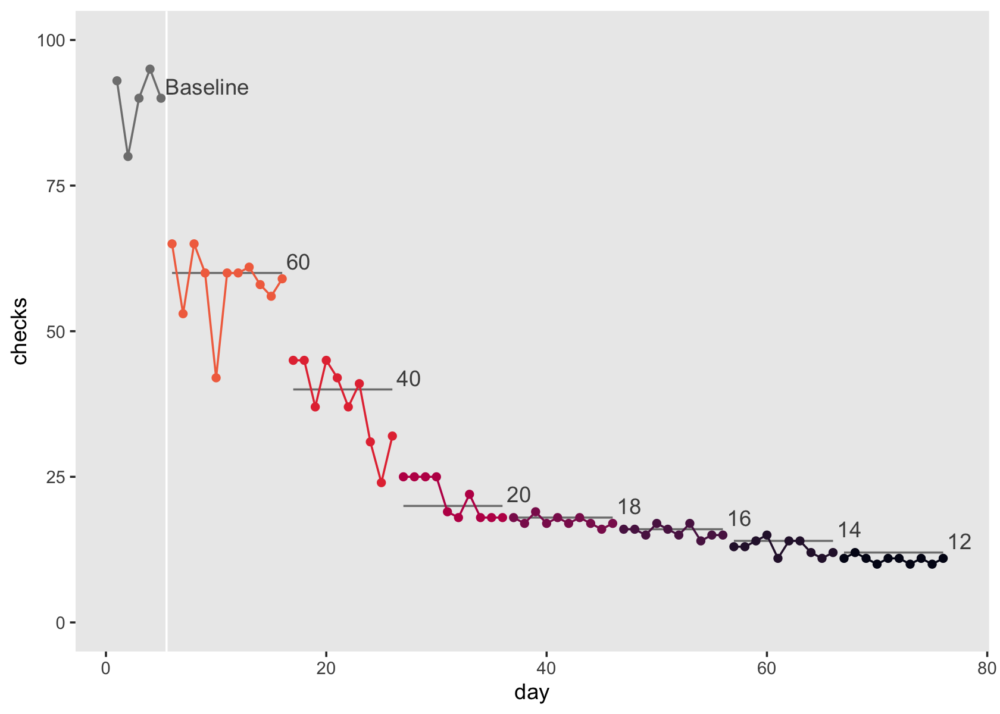

allen2001
================
A Solomon Kurz
2022-03-22

The purpose of this file is to simulate the data from Allen & Evans
(2001; <https://doi.org/10.1901/jaba.2001.34-497>). We don’t have their
actual data file, they displayed their data in Figure 1 (p. 499). Here
we’ll work through that figure to make a data file that approximates
their original data.

Load the **tidyverse**.

``` r
library(tidyverse)
```

Compute the individual values from Figure 1 and wrangle.

``` r
allen2001 <- tibble(
 checks = c(93, 80, 90, 95, 90,
            65, 53, 65, 60, 42, 60, 60, 61, 58, 56, 59,
            45, 45, 37, 45, 42, 37, 41, 31, 24, 32, 
            25, 25, 25, 25, 19, 18, 22, 18, 18, 18,
            18, 17, 19, 17, 18, 17, 18, 17, 16, 17,
            16, 16, 15, 17, 16, 15, 17, 14, 15, 15,
            13, 13, 14, 15, 11, 14, 14, 12, 11, 12,
            11, 12, 11, 10, 11, 11, 10, 11, 10, 11),
 phase = rep(c("A", "B1", "B2", "B3", "B4", "B5", "B6", "B7"), times = c(5, 11, 10, 10, 10, 10, 10, 10)),
 criterion = rep(c(NA, 60, 40, 20, 18, 16, 14, 12), times = c(5, 11, 10, 10, 10, 10, 10, 10))
) %>% 
  mutate(day          = 1:n(),
         baseline     = ifelse(phase == "A", 1, 0),
         intervention = ifelse(phase == "A", 0, 1)) %>% 
  mutate(lcriterion = ifelse(is.na(criterion), 0, log(criterion))) %>% 
  select(day, phase, criterion, baseline, intervention, lcriterion, checks)
```

Take a look at the data.

``` r
glimpse(allen2001)
```

    ## Rows: 76
    ## Columns: 7
    ## $ day          <int> 1, 2, 3, 4, 5, 6, 7, 8, 9, 10, 11, 12, 13, 14, 15, 16, 17…
    ## $ phase        <chr> "A", "A", "A", "A", "A", "B1", "B1", "B1", "B1", "B1", "B…
    ## $ criterion    <dbl> NA, NA, NA, NA, NA, 60, 60, 60, 60, 60, 60, 60, 60, 60, 6…
    ## $ baseline     <dbl> 1, 1, 1, 1, 1, 0, 0, 0, 0, 0, 0, 0, 0, 0, 0, 0, 0, 0, 0, …
    ## $ intervention <dbl> 0, 0, 0, 0, 0, 1, 1, 1, 1, 1, 1, 1, 1, 1, 1, 1, 1, 1, 1, …
    ## $ lcriterion   <dbl> 0.000000, 0.000000, 0.000000, 0.000000, 0.000000, 4.09434…
    ## $ checks       <dbl> 93, 80, 90, 95, 90, 65, 53, 65, 60, 42, 60, 60, 61, 58, 5…

If you look closely at the x-axis in Figure 1, you’ll see the data are
not evenly spaced over time and the way the authors have annotated the
figure makes it very difficulty to fully recapture the original spacing.
Thus, our synthetic `allen2001` take a simplified approach where the
time variable `day` starts at `1` and increases sequentially until the
final value `76`. If you look very carefully at the y-axis of Figure 1
and compare the values at the horizontal dashed lines marking off the
criterion levels, it appears as if some of those values are off, which
makes it difficult to determine what the exact counts are. We will have
to settle for approximate values.

Anyway, the `phase` value marks off the different periods in the
experiment where `A` is the baseline period, `B1` is the period for the
first criterion level, `B2` is the period for the second criterion
level, and so on through `B7`. The criterion levels during the B phases
are listed in the `criterion` column, which has `NA` values during the
baseline period. The `baseline` column is a dummy indicator which is `1`
during baseline and `0` otherwise. In a similar way, the `intervention`
column is a dummy indicator which is `0` during baseline and `1`
otherwise. To help with modeling, we the `lcriterion` column is the log
of the `criterion` values where, to anticipate down-the-road technical
difficulties, we have `0` values where the corresponding `criterion`
values were `NA`. Finally, the `checks` column has the behavioral counts
for the checking behavior.

Here we visualize the `allen2001` data in a similar way to Figure 1.

``` r
# for the annotation
label <- allen2001 %>% 
  group_by(phase) %>% 
  arrange(desc(day)) %>% 
  slice(1) %>% 
  mutate(label  = ifelse(phase == "A", "Baseline", as.character(criterion)),
         checks = ifelse(is.na(criterion), checks, criterion))

# plot
allen2001 %>% 
  ggplot(aes(x = day, y = checks, group = criterion, color = factor(criterion))) +
  geom_vline(xintercept = 5.5, color = "white") +
  geom_line(aes(y = criterion),
            color = "grey50") +
  geom_point() +
  geom_line() +
  geom_text(data = label,
            aes(y = checks, label = label),
            hjust = 0, nudge_x = 0.4, nudge_y = 2, color = "grey30") +
  scale_color_viridis_d(option = "F", end = .7, na.value = "grey50", breaks = NULL) +
  ylim(0, 100) +
  theme(panel.grid = element_blank())
```



Now save the results in an external file.

``` r
save(allen2001, file = "/Users/solomonkurz/Dropbox/Experimental-design-and-the-GLMM/sketches/data/allen2001.rda")
```

## Session information

``` r
sessionInfo()
```

    ## R version 4.1.2 (2021-11-01)
    ## Platform: x86_64-apple-darwin17.0 (64-bit)
    ## Running under: macOS Catalina 10.15.7
    ## 
    ## Matrix products: default
    ## BLAS:   /Library/Frameworks/R.framework/Versions/4.1/Resources/lib/libRblas.0.dylib
    ## LAPACK: /Library/Frameworks/R.framework/Versions/4.1/Resources/lib/libRlapack.dylib
    ## 
    ## locale:
    ## [1] en_US.UTF-8/en_US.UTF-8/en_US.UTF-8/C/en_US.UTF-8/en_US.UTF-8
    ## 
    ## attached base packages:
    ## [1] stats     graphics  grDevices utils     datasets  methods   base     
    ## 
    ## other attached packages:
    ## [1] forcats_0.5.1   stringr_1.4.0   dplyr_1.0.7     purrr_0.3.4    
    ## [5] readr_2.0.1     tidyr_1.2.0     tibble_3.1.6    ggplot2_3.3.5  
    ## [9] tidyverse_1.3.1
    ## 
    ## loaded via a namespace (and not attached):
    ##  [1] tidyselect_1.1.1  xfun_0.25         haven_2.4.3       colorspace_2.0-2 
    ##  [5] vctrs_0.3.8       generics_0.1.2    viridisLite_0.4.0 htmltools_0.5.2  
    ##  [9] yaml_2.2.1        utf8_1.2.2        rlang_1.0.1       pillar_1.7.0     
    ## [13] withr_2.4.3       glue_1.6.1        DBI_1.1.1         dbplyr_2.1.1     
    ## [17] modelr_0.1.8      readxl_1.3.1      lifecycle_1.0.1   munsell_0.5.0    
    ## [21] gtable_0.3.0      cellranger_1.1.0  rvest_1.0.1       evaluate_0.14    
    ## [25] labeling_0.4.2    knitr_1.33        tzdb_0.1.2        fastmap_1.1.0    
    ## [29] fansi_1.0.2       highr_0.9         broom_0.7.10      Rcpp_1.0.8       
    ## [33] backports_1.4.1   scales_1.1.1      jsonlite_1.7.3    farver_2.1.0     
    ## [37] fs_1.5.0          hms_1.1.0         digest_0.6.29     stringi_1.7.4    
    ## [41] grid_4.1.2        cli_3.1.1         tools_4.1.2       magrittr_2.0.2   
    ## [45] crayon_1.4.2      pkgconfig_2.0.3   ellipsis_0.3.2    xml2_1.3.2       
    ## [49] reprex_2.0.1      lubridate_1.7.10  assertthat_0.2.1  rmarkdown_2.10   
    ## [53] httr_1.4.2        rstudioapi_0.13   R6_2.5.1          compiler_4.1.2
