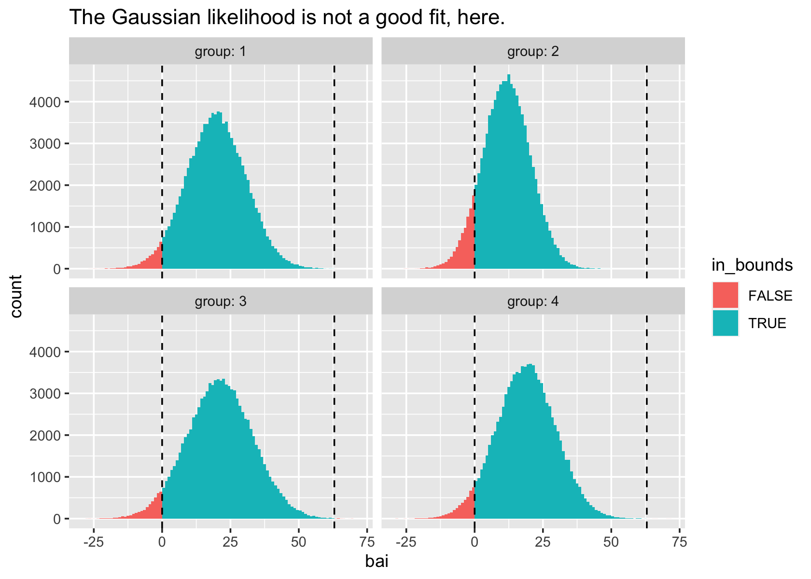
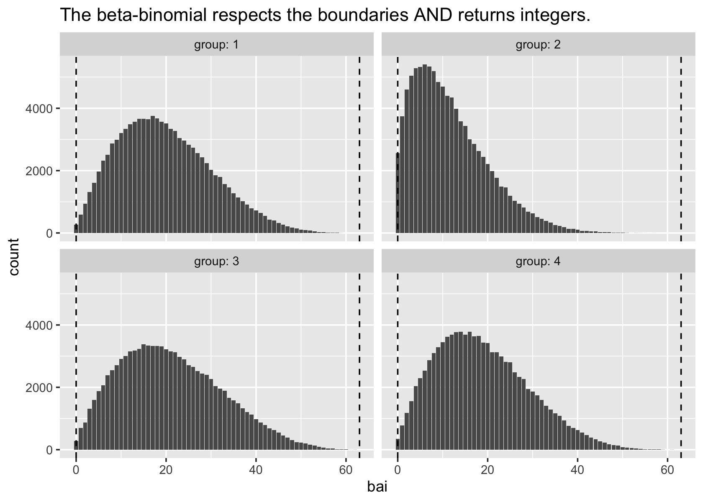
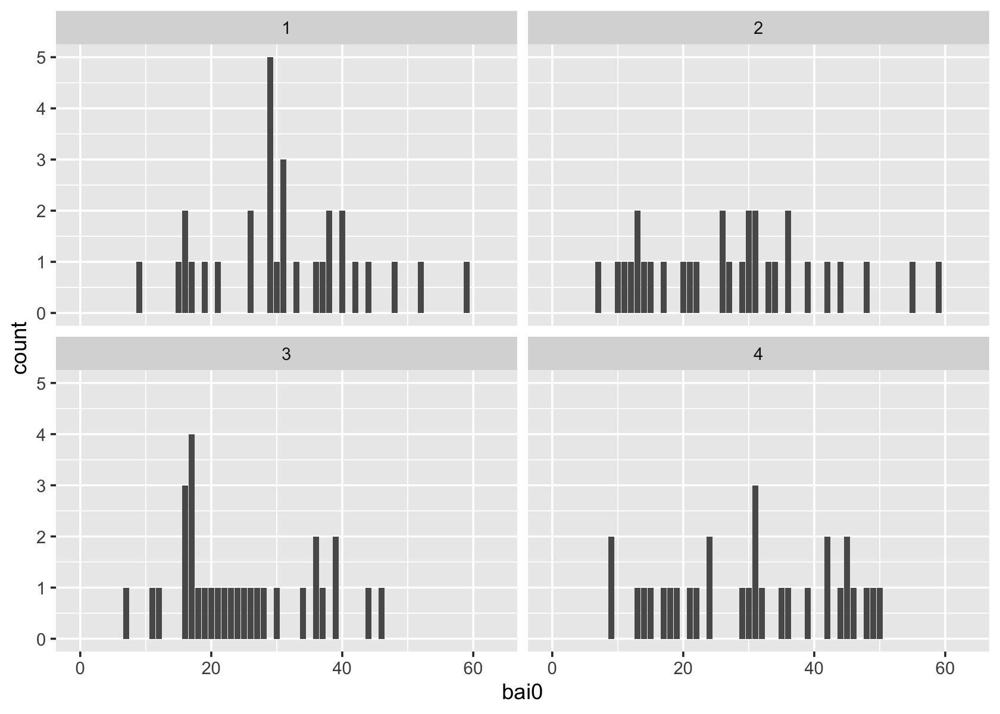
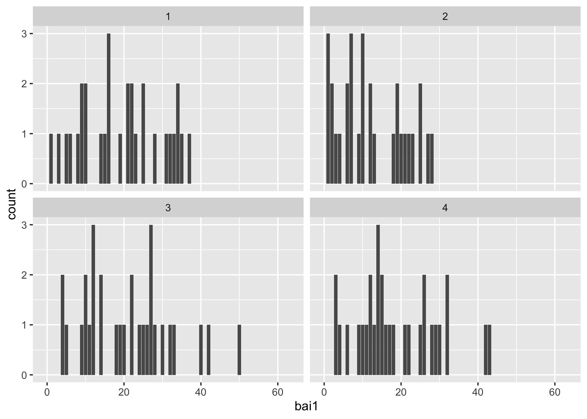
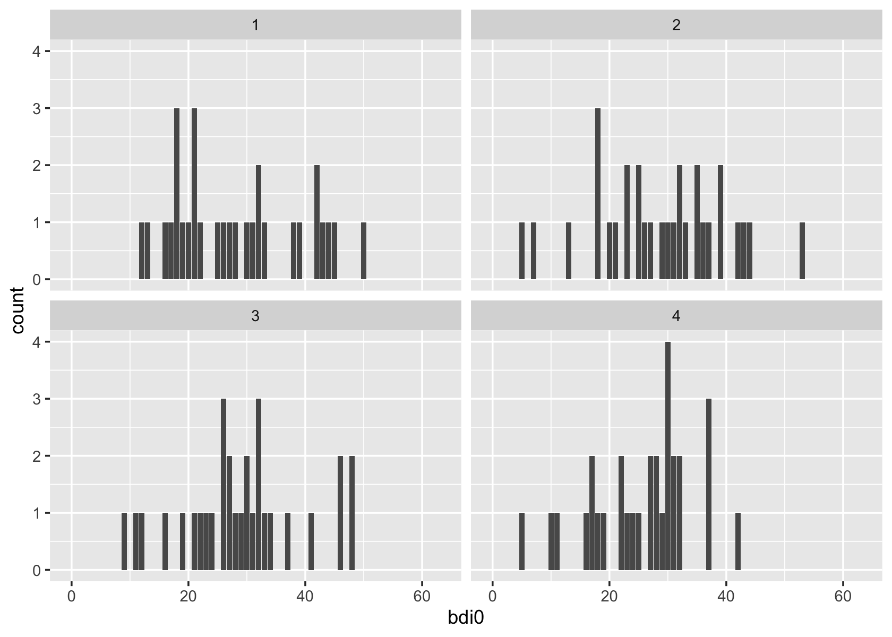
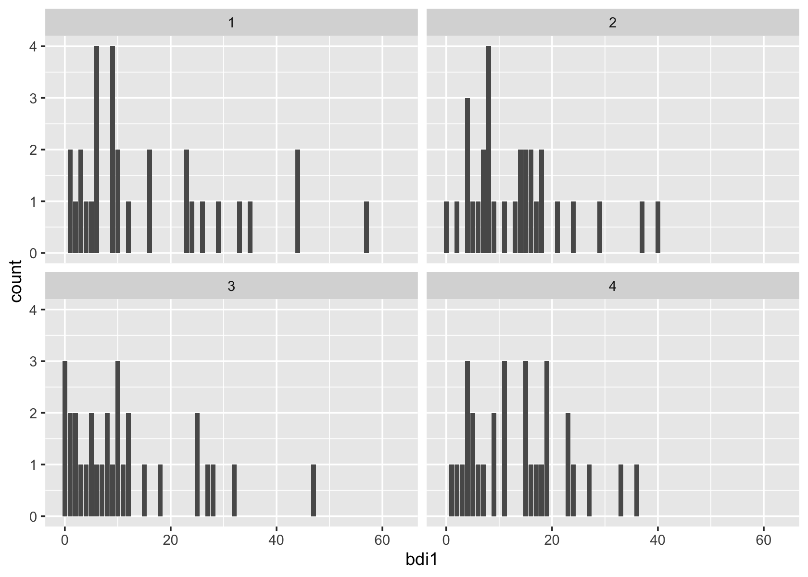
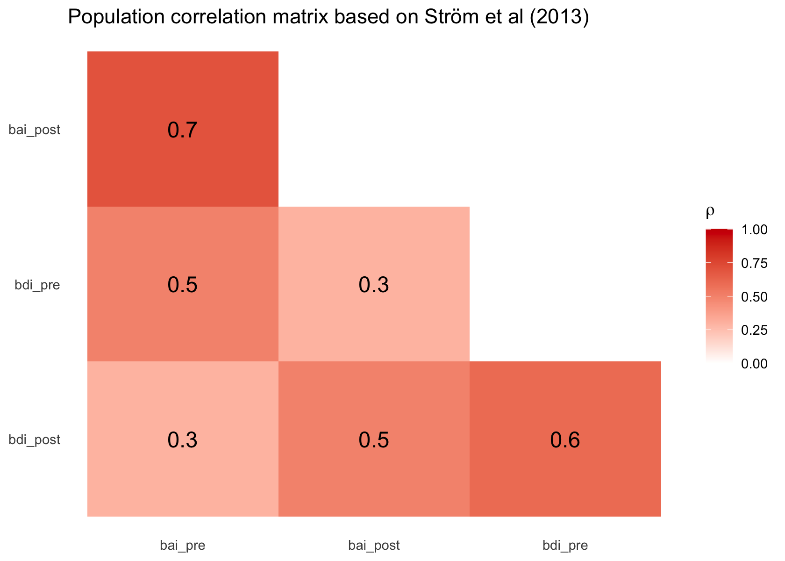

berg2020
================
A Solomon Kurz
2022-06-19

The purpose of this file is to simulate the data from Berg et al (2020;
<https://doi.org/10.3389/fpsyt.2020.00503>). We don’t have their actual
data file, but they displayed information about sample size, mean, and
standard deviations for the primary outcomes in Figure 2 (p. 4) and
Table 2 (p. 9).

Participants were adolescents (15 to 19 years old, with a mean age of
about 17; 81% female) in Sweden with elevated levels of anxiety and
comorbid depression. Participants were randomized into four groups and
data were collected at three time points. The four groups were:

-   Standard internet-based cognitive behavioural therapy (ICBT),
-   ICBT with learning support,
-   ICBT with chat sessions, and
-   ICBT with both learning support and chat sessions.

The primary outcomes were

-   the Beck Anxiety Inventory (BAI) and
-   the Beck Depression Inventory-II (BDI-II).

Both measures contain 21 items rated on Likert-type scales ranging from
0 to 3. In this study, the primary outcomes were measured at the
sum-score level, with each sum score ranging from 0 to 63, where the
largest value 63 indicates very high levels of anxiety/depression.

The three time points in the study were

-   pre-treatment;
-   post-treatment, which was 8 weeks later, directly on completion of
    the 8-week intervention; and
-   at a 6-month follow-up period.

For our purposes, we will focus on the pre- and post-treatment
assessment periods.

Load the **tidyverse**, **faux**, and **VGAM**.

``` r
# library(tidyverse)

library(ggplot2)
library(tibble)
library(dplyr)
library(tidyr)
library(stringr)
library(readr)
library(forcats)
library(purrr)

library(faux)
library(VGAM)
```

## Simulate

### Beta-binomial.

If you look at the sample statistics in Table 2 (p. 9) and try
simulating Gaussian data with the `rnorm()` function, you’ll find the
simulated data extend past the lower and upper limits of the BAI,
particularly the lower limit of 0. Here’s a quick demonstration using
the sample means and standard deviations of the four groups for the BAI
at the post-intervention assessment.

``` r
tibble(group = 1:4,
       m = c(19.71, 11.70, 21.14, 18.87),
       s = c(10.85, 8.74, 12.03, 10.83)) %>% 
  mutate(bai = map2(m, s, ~ rnorm(n = 1e5, mean = .x, sd = .y))) %>% 
  unnest(bai) %>% 
  mutate(in_bounds = ifelse(bai < 0 | bai > 63, FALSE, TRUE)) %>% 
  
  ggplot(aes(x = bai, fill = in_bounds)) +
  geom_histogram(boundary = 0, binwidth = 1) +
  geom_vline(xintercept = c(0, 63), linetype = 2) +
  ggtitle("The Gaussian likelihood is not a good fit, here.") +
  facet_wrap(~ group, labeller = label_both)
```



If you wanted to get very precise, you could simulate the BAI/BDI-II
data at the item level with a hierarchical ordinal IRT model. A less
intense pragmatic solution is to simulate the sum-score values with the
beta-binomial distribution. Using the conventional
--
parameterization, you can define the beta-binomial function for

as

 = \binom{n}{y} \frac{\operatorname{B}(y + \alpha, n - y + \beta)}{\operatorname{B}(\alpha, \beta)},
")

where
")
is the beta function. However, regression paradigms often parameterize
the beta-binomial in terms of
,
the mean
,
and precision
.
In that way, the beta-binomial follows the equation

![
f(y \| n, \\mu, \\phi) = \\binom{n}{y} \\frac{\\operatorname{B}(y + \\mu \\phi, n - y + \[1 - \\mu\]\\phi)}{\\operatorname{B}(\\mu \\phi, \[1 - \\mu\]\\phi)}.
](https://latex.codecogs.com/png.image?%5Cdpi%7B110%7D&space;%5Cbg_white&space;%0Af%28y%20%7C%20n%2C%20%5Cmu%2C%20%5Cphi%29%20%3D%20%5Cbinom%7Bn%7D%7By%7D%20%5Cfrac%7B%5Coperatorname%7BB%7D%28y%20%2B%20%5Cmu%20%5Cphi%2C%20n%20-%20y%20%2B%20%5B1%20-%20%5Cmu%5D%5Cphi%29%7D%7B%5Coperatorname%7BB%7D%28%5Cmu%20%5Cphi%2C%20%5B1%20-%20%5Cmu%5D%5Cphi%29%7D.%0A "
f(y | n, \mu, \phi) = \binom{n}{y} \frac{\operatorname{B}(y + \mu \phi, n - y + [1 - \mu]\phi)}{\operatorname{B}(\mu \phi, [1 - \mu]\phi)}.
")

Thus, we can connect this parameterization to the canonical
parameterization with the formulas

\phi,
\end{align*}
")

and the reverse formulas


For beta-binomial data, the mean is defined as

 = n\mu")

and the variance is defined as

 = n\mu(1 - \mu) \frac{\phi + n}{\phi + 1}.
")

Thus using the moment of methods, you can use a sample mean

and known value for

to estimate the population

with the equation


You can also use the sample mean and standard deviation

to estimate the population
.
The best method for this is under some dispute, but an okay place to
start is with

 M (n - M)}{n S^2 - M (n - M)}.
")

In **R**, one can simulate beta-binomial data with the
`VGAM::rbetabinom()` or `VGAM::rbetabinom.ab()` functions. I prefer
`VGAM::rbetabinom.ab()`. To give a sense of how to use sample statistics
to compute the necessary

and

parameters for `rbetabinom.ab()`, here’s a quick example with the same
sample statistics as from above.

``` r
tibble(group = 1:4,
       m = c(19.71, 11.70, 21.14, 18.87),
       s = c(10.85, 8.74, 12.03, 10.83),
       n = 63) %>% 
  # method of moments
  mutate(mu = m / n,
         phi = ((n - 1) * m * (n - m)) / (n * s^2 - m * (n - m))) %>% 
  mutate(alpha = mu * phi,
         beta  = (1 - mu) * phi) %>% 
  mutate(bai = map2(alpha, beta, ~ rbetabinom.ab(n = 1e5, size = 63, shape1 = .x, shape2 = .y))) %>% 
  unnest(bai) %>% 
  
  ggplot(aes(x = bai)) +
  geom_bar() +
  geom_vline(xintercept = c(0, 63), linetype = 2) +
  ggtitle("The beta-binomial respects the boundaries AND returns integers.") +
  facet_wrap(~ group, labeller = label_both)
```



### Sample size.

A strength of Berg et al (2020) is each group had

at the post-intervention assessment. Here we set that sample size for
the simulations to come.

``` r
# how many per group?
n_group <- 30
```

### pre-intervention BAI.

As the pre-intervention measurements were take prior to random
assignment, we can treat them as having come from a single population.
Here we use the sample statistics for the BAI at the pre-intervention
assessment to compute the weighted mean and pooled standard deviation.

``` r
tibble(group = 1:4,
       mean  = c(26.57, 22.22, 28.89, 28.44),
       sd    = c(12.25, 11.16, 12.62, 9.67)) %>% 
  # for equal sample sizes, the simple mean is the same as the weighted mean
  summarise(weighted_mean = mean(mean),
            pooled_sd = sqrt(sum(sd^2) / 4))
```

    ## # A tibble: 1 × 2
    ##   weighted_mean pooled_sd
    ##           <dbl>     <dbl>
    ## 1          26.5      11.5

Now we’ll use those values and the methods from above to simulate

beta-binomial values for the BAI. A difficulty, however, is that the
inclusion criteria for the study required participants have a score of

on the BAI, resulting in a truncated distribution (see the
*Participants* section of the *Method*, p. 3). Thus, one will have to
iterate to find the right combination of

and

to return those same sample statistics with a truncated beta-binomial
distribution. When using a large sample size, the methods below return a
truncated beta-binomial distribution with sample statistics
approximating the weighted mean and pooled standard deviation, above.

``` r
set.seed(1)

pre_bai <- tibble(
  group = 1:4,
  m     = 26.53,
  s     = 11.48239,
  n     = 63) %>% 
  # these adjustments correct for the truncation
  mutate(m = m - 1,
         s = s + 1.52) %>% 
  mutate(mu  = m / n,
         phi = ((n - 1) * m * (n - m)) / (n * s^2 - m * (n - m))) %>% 
  mutate(alpha = mu * phi,
         beta  = (1 - mu) * phi) %>% 
  mutate(bai0 = pmap(list(n, alpha, beta), ~ rbetabinom.ab(n = n_group * 10, size = ..1, shape1 = ..2, shape2 = ..3))) %>% 
  unnest(bai0) %>% 
  # truncate
  filter(bai0 >= 7) %>% 
  group_by(group) %>% 
  slice_sample(n = n_group) %>% 
  ungroup() %>% 
  select(group, bai0)
```

We might look at the sample statistics and take a look at the results in
a plot.

``` r
# sample statistics
pre_bai %>% 
  group_by(group) %>% 
  summarise(m = mean(bai0),
            s = sd(bai0),
            n = n())
```

    ## # A tibble: 4 × 4
    ##   group     m     s     n
    ##   <int> <dbl> <dbl> <int>
    ## 1     1  31.3  11.5    30
    ## 2     2  27.7  13.5    30
    ## 3     3  24.7  10.2    30
    ## 4     4  30.3  12.8    30

``` r
# plot
pre_bai %>% 
  ggplot(aes(x = bai0)) +
  geom_bar() +
  xlim(-0.5, 63.5) +
  facet_wrap(~ group)
```



### post-intervention BAI.

Happily, the post-intervention values do not have truncation
complications. However, the equation above for computing the population

with sample statistics returns slightly biased results (at least with
finite samples up to
).
Thus, I worked in a quick and dirty correction which works reasonably
well.

``` r
# simulate
set.seed(2)

post_bai <- tibble(
  group = 1:4,
  m     = c(19.71, 11.70, 21.14, 18.87),
  s     = c(10.85, 08.74, 12.03, 10.83),
  n     = 63) %>% 
  mutate(mu  = m / n,
         phi = ((n - 1) * m * (n - m)) / (n * s^2 - m * (n - m))) %>% 
  # this corrects for the slight bias in the equation for phi
  mutate(phi = phi * 0.87) %>% 
  mutate(alpha = mu * phi,
         beta  = (1 - mu) * phi) %>% 
  mutate(bai1 = pmap(list(n, alpha, beta), ~ rbetabinom.ab(n = n_group * 10, size = ..1, shape1 = ..2, shape2 = ..3))) %>% 
  unnest(bai1) %>% 
  group_by(group) %>% 
  slice_sample(n = n_group) %>% 
  ungroup() %>% 
  select(group, bai1)
```

Summarize and plot.

``` r
# summarize
post_bai %>% 
  group_by(group) %>% 
  summarise(m = mean(bai1),
            s = sd(bai1),
            n = n())
```

    ## # A tibble: 4 × 4
    ##   group     m     s     n
    ##   <int> <dbl> <dbl> <int>
    ## 1     1  19.3 10.5     30
    ## 2     2  12.3  8.70    30
    ## 3     3  21.0 11.6     30
    ## 4     4  18.7 10.7     30

``` r
# plot
post_bai %>% 
  ggplot(aes(x = bai1)) +
  geom_bar() +
  xlim(-0.5, 63.5) +
  facet_wrap(~ group)
```



### pre-intervention BDI-II.

As with the BAI, we can think of the pre-intervention measurements for
the BDI-II as coming from a single population. Here we use the BDI-II
sample statistics to compute the weighted mean and pooled standard
deviation.

``` r
tibble(group = 1:4,
       mean  = c(29.26, 25.37, 27.70, 30.70),
       sd    = c(10.12, 10.08, 12.15, 9.51)) %>% 
  # for equal sample sizes, the simple mean is the same as the weighted mean
  summarise(weighted_mean = mean(mean),
            pooled_sd = sqrt(sum(sd^2) / 4))
```

    ## # A tibble: 1 × 2
    ##   weighted_mean pooled_sd
    ##           <dbl>     <dbl>
    ## 1          28.3      10.5

Happily, there are no truncation issues for the BDI-II.

``` r
set.seed(3)

pre_bdi <- tibble(
  group = 1:4,
  m     = 28.2575,
  s     = 10.51289,
  n     = 63) %>% 
  mutate(mu  = m / n,
         phi = ((n - 1) * m * (n - m)) / (n * s^2 - m * (n - m))) %>% 
  # this corrects for the slight bias in the equation for phi
  mutate(phi = phi * 0.9) %>% 
  mutate(alpha = mu * phi,
         beta  = (1 - mu) * phi) %>% 
  mutate(bdi0 = pmap(list(n, alpha, beta), ~ rbetabinom.ab(n = n_group * 10, size = ..1, shape1 = ..2, shape2 = ..3))) %>% 
  unnest(bdi0) %>% 
  group_by(group) %>% 
  slice_sample(n = n_group) %>% 
  ungroup() %>% 
  select(group, bdi0)
```

Summarize and plot.

``` r
# summarize
pre_bdi %>% 
  group_by(group) %>% 
  summarise(m = mean(bdi0),
            s = sd(bdi0),
            n = n())
```

    ## # A tibble: 4 × 4
    ##   group     m     s     n
    ##   <int> <dbl> <dbl> <int>
    ## 1     1  28.1 10.7     30
    ## 2     2  28.6 11.0     30
    ## 3     3  28.9 10.3     30
    ## 4     4  25.6  8.63    30

``` r
# plot
pre_bdi %>% 
  ggplot(aes(x = bdi0)) +
  geom_bar() +
  xlim(-0.5, 63.5) +
  facet_wrap(~ group)
```



### post-intervention BDI-II.

Simulate.

``` r
set.seed(4)

post_bdi <- tibble(
  group = 1:4,
  m     = c(19.56, 11.70, 16.96, 15.70),
  s     = c(14.91, 08.20, 15.70, 9.78),
  n     = 63) %>% 
  mutate(mu  = m / n,
         phi = ((n - 1) * m * (n - m)) / (n * s^2 - m * (n - m))) %>% 
  # this corrects for the slight bias in the equation for phi
  mutate(phi = phi * 0.87) %>% 
  mutate(alpha = mu * phi,
         beta  = (1 - mu) * phi) %>% 
  mutate(bdi1 = pmap(list(n, alpha, beta), ~ rbetabinom.ab(n = n_group * 10, size = ..1, shape1 = ..2, shape2 = ..3))) %>% 
  unnest(bdi1) %>% 
  group_by(group) %>% 
  slice_sample(n = n_group) %>% 
  ungroup() %>% 
  select(group, bdi1)
```

Summarize and plot.

``` r
# summarize
post_bdi %>% 
  group_by(group) %>% 
  summarise(m = mean(bdi1),
            s = sd(bdi1),
            n = n())
```

    ## # A tibble: 4 × 4
    ##   group     m     s     n
    ##   <int> <dbl> <dbl> <int>
    ## 1     1  16.0 14.7     30
    ## 2     2  13.3  9.61    30
    ## 3     3  11.4 11.3     30
    ## 4     4  13.7  9.22    30

``` r
# plot
post_bdi %>% 
  ggplot(aes(x = bdi1)) +
  geom_bar() +
  xlim(-0.5, 63.5) +
  facet_wrap(~ group)
```



### Correlation structure.

You may have notices we’ve been simulating the BAI and BDI-II at the two
time points in isolation. However, it’s reasonable to expect the BAI and
BDI-II have a non-trivial cross-sectional and longitudinal correlation
structure. If these were multivariate normal data, we could easily
accommodate that by simulating with the `rnorm_multi()` function. Sadly,
I’m not aware of an easy way to simulate multivariate beta-binomial
data. We do have a work around. Firs, we’ll need to settle on a
correlation matrix.

Ström et al (2013; <https://doi.org/10.7717/peerj.178>) randomly
assigned 48 Swedish adults (mean age 49 years old; 83% women) into
control or an active internet-delivered therapist-guided physical
activity treatment for mild to moderate depression. One of their primary
outcomes was the BDI-II and the BAI was a secondary outcome. The
treatment condition lasted 9 weeks. Fortunately, Ström and colleagues
made their data freely available at
<https://datadryad.org/stash/dataset/doi:10.5061/dryad.c6q65>. Based on
an analysis of their full data set, it’s reasonable to propose a
population correlation matrix for pre/post BAI and BDI-II sum scores as
follows.

``` r
tibble(row = c("bai_post", "bdi_pre", "bdi_post", "bdi_pre", "bdi_post", "bdi_post"),
       col = rep(c("bai_pre", "bai_post", "bdi_pre"), times = c(3, 2, 1)),
       rho = c(.7, .5, .3, .3, .5, .6)) %>% 
  mutate(row = factor(row, levels = c("bai_pre", "bai_post", "bdi_pre", "bdi_post")),
         col = factor(col, levels = c("bai_pre", "bai_post", "bdi_pre", "bdi_post"))) %>% 
  mutate(row = fct_rev(row)) %>% 
  
  ggplot(aes(x = col, y = row, label = rho)) +
  geom_tile(aes(fill = rho)) +
  geom_text(size = 5) +
  scale_fill_gradient(expression(rho), low = "white", high = "red3", limits = c(0, 1)) +
  labs(title = "Population correlation matrix based on Ström et al (2013)",
       x = NULL,
       y = NULL) +
  theme(axis.ticks = element_blank(),
        panel.background = element_rect(fill = "white"))
```



Here we use `rnorm_multi()` to simulate an

data frame of four variables with that correlation matrix.

``` r
set.seed(5)

z <- rnorm_multi(
  n = n_group * 4,
  mu = c(0, 0, 0, 0),
  sd = c(1, 1, 1, 1), 
  r = c(.7, .5, .3, .3, .5, .6), 
  varnames = list("bai0", "bai1", "bdi0", "bdi1")
) %>% 
  mutate(id    = 1:n(),
         group = rep(1:4, each = n_group))
```

Here’s the observed correlation matrix for our `z` data.

``` r
z %>% 
  select(starts_with("b")) %>% 
  cor() %>% 
  round(digits = 3)
```

    ##       bai0  bai1  bdi0  bdi1
    ## bai0 1.000 0.695 0.453 0.263
    ## bai1 0.695 1.000 0.325 0.505
    ## bdi0 0.453 0.325 1.000 0.611
    ## bdi1 0.263 0.505 0.611 1.000

Now add rank-order variables to the `z` data, by `group` and criterion.

``` r
 z <- z %>% 
  group_by(group) %>% 
  arrange(bai0) %>% 
  mutate(rank1 = 1:n()) %>% 
  arrange(bai1) %>% 
  mutate(rank2 = 1:n()) %>% 
  arrange(bdi0) %>% 
  mutate(rank3 = 1:n()) %>% 
  arrange(bdi1) %>% 
  mutate(rank4 = 1:n()) %>% 
  ungroup() %>% 
  arrange(id)

# what?
head(z)
```

    ## # A tibble: 6 × 10
    ##      bai0   bai1   bdi0   bdi1    id group rank1 rank2 rank3 rank4
    ##     <dbl>  <dbl>  <dbl>  <dbl> <int> <int> <int> <int> <int> <int>
    ## 1  1.12    1.28   0.346 -0.183     1     1    29    28    20    12
    ## 2 -0.332  -1.11  -1.85  -1.09      2     1    11     4     3     5
    ## 3  0.497   0.354  1.48   1.67      3     1    25    19    28    27
    ## 4 -0.0872 -1.49   1.16   0.291     4     1    14     2    26    16
    ## 5 -1.52   -0.301 -2.31  -1.29      5     1     2    13     1     4
    ## 6  0.621   0.611 -0.142  0.781     6     1    26    23    15    22

Note how the ranks largely retain the overall correlation structure.

``` r
z %>% 
  ungroup() %>% 
  select(contains("rank")) %>% 
  cor() %>% 
  round(digits = 3)
```

    ##       rank1 rank2 rank3 rank4
    ## rank1 1.000 0.667 0.425 0.211
    ## rank2 0.667 1.000 0.327 0.461
    ## rank3 0.425 0.327 1.000 0.569
    ## rank4 0.211 0.461 0.569 1.000

Here’s the step we’ve been building toward. With a series of
`left_join()` steps, we can rearrange our simulated BAI and BDI data by
the rank variables in the `z` data.

``` r
berg <- z %>% 
  select(id:rank4) %>% 
  left_join(pre_bai %>% 
              group_by(group) %>% 
              arrange(bai0) %>% 
              mutate(rank1 = 1:n()),
            by = c("group", "rank1")) %>% 
  left_join(post_bai %>% 
              group_by(group) %>% 
              arrange(bai1) %>% 
              mutate(rank2 = 1:n()),
            by = c("group", "rank2")) %>% 
  left_join(pre_bdi %>% 
              group_by(group) %>% 
              arrange(bdi0) %>% 
              mutate(rank3 = 1:n()),
            by = c("group", "rank3")) %>% 
  left_join(post_bdi %>% 
              group_by(group) %>% 
              arrange(bdi1) %>% 
              mutate(rank4 = 1:n()),
            by = c("group", "rank4")) %>% 
  # remove the ranks
  select(-starts_with("rank"))

# what?
berg
```

    ## # A tibble: 120 × 6
    ##       id group  bai0  bai1  bdi0  bdi1
    ##    <int> <int> <dbl> <dbl> <dbl> <dbl>
    ##  1     1     1    52    34    32     9
    ##  2     2     1    29     6    16     3
    ##  3     3     1    40    22    44    35
    ##  4     4     1    29     3    42    10
    ##  5     5     1    15    16    12     3
    ##  6     6     1    42    28    26    23
    ##  7     7     1    31    22    39     9
    ##  8     8     1    44    34    25     9
    ##  9     9     1    21    21    31    33
    ## 10    10     1    19    10    38    10
    ## # … with 110 more rows

Now our our beta-binomial variables have a correlation structure that
approximates the data from Ström et al (2013).

``` r
berg %>% 
  select(bai0:bdi1) %>% 
  cor() %>% 
  round(digits = 3)
```

    ##       bai0  bai1  bdi0  bdi1
    ## bai0 1.000 0.608 0.373 0.222
    ## bai1 0.608 1.000 0.297 0.414
    ## bdi0 0.373 0.297 1.000 0.463
    ## bdi1 0.222 0.414 0.463 1.000

### Missing data.

Figure 2 and Table 2 in the paper show all groups had a few missing
values at the post-treatment assessment. In the first paragraph of their
*Statistical Analysis* section, the authors reported: “We did not find
any pattern in the missing data with regards to sociodemographic
variables and symptom levels at baseline” (p. 7). The authors further
detailed these analyses in the *Treatment Dropout and Missing Data*
subsection of their *Results* (p. 8). Here we add a similar pattern of
missing values to the `bai1` and `bdi1` columns.

``` r
set.seed(6)
berg <- berg %>% 
  # m012 indicates whether participants have no missing data (0),
  # missingness on both bai1 and bdi1 (1), or
  # missingness on bdi1 only (2)
  mutate(m012 = c(sample(rep(0:2, times = c(27, 2, 1))),
                  sample(rep(0:1, times = c(27, 3))),
                  sample(rep(0:2, times = c(27, 2, 1))),
                  sample(rep(0:1, times = c(23, 7))))) %>% 
  # remove the missing values based on m012
  mutate(bai1 = ifelse(m012 == 1, NA, bai1),
         bdi1 = ifelse(m012 > 0, NA, bdi1)) %>% 
  select(-m012)

# what?
head(berg, n = 20)
```

    ## # A tibble: 20 × 6
    ##       id group  bai0  bai1  bdi0  bdi1
    ##    <int> <int> <dbl> <dbl> <dbl> <dbl>
    ##  1     1     1    52    34    32     9
    ##  2     2     1    29     6    16     3
    ##  3     3     1    40    22    44    35
    ##  4     4     1    29     3    42    10
    ##  5     5     1    15    16    12     3
    ##  6     6     1    42    28    26    23
    ##  7     7     1    31    22    39     9
    ##  8     8     1    44    34    25     9
    ##  9     9     1    21    21    31    33
    ## 10    10     1    19    10    38    10
    ## 11    11     1    26    16    17     1
    ## 12    12     1    29    15    43    44
    ## 13    13     1    30    31    50    24
    ## 14    14     1    31    21    27    12
    ## 15    15     1    40    NA    22    NA
    ## 16    16     1    31    25    19    23
    ## 17    17     1    38    33    30    NA
    ## 18    18     1    59    35    45    57
    ## 19    19     1    38    16    21     5
    ## 20    20     1    36    23    28     9

Here’s a quick missing data analysis.

``` r
berg %>% 
  group_by(group) %>% 
  summarise(missing_bai1 = str_c(sum(is.na(bai1)), " (", round(mean(is.na(bai1)) * 100), "%)"),
            missing_bdi1 = str_c(sum(is.na(bdi1)), " (", round(mean(is.na(bdi1)) * 100), "%)"))
```

    ## # A tibble: 4 × 3
    ##   group missing_bai1 missing_bdi1
    ##   <int> <chr>        <chr>       
    ## 1     1 2 (7%)       3 (10%)     
    ## 2     2 3 (10%)      3 (10%)     
    ## 3     3 2 (7%)       3 (10%)     
    ## 4     4 7 (23%)      7 (23%)

### Final clean.

Here we add in the `chat` and `support` dummy variables for
differentiating among the four levels of `group`, make `group` an
ordered factor, make an ordered factor `icbt` variable, and rearrange
the columns in the data set. Then we name the results `berg2020`.

``` r
berg2020 <- berg %>%
  mutate(chat    = ifelse(group %in% c(3, 4), 1, 0),
         support = ifelse(group %in% c(2, 4), 1, 0)) %>% 
  mutate(group = factor(group),
         icbt  = factor(group, labels = c("Standard ICBT", "Learning support", "Standard ICBT with chat", "Learning support with chat"))) %>% 
  select(id, group, icbt, chat, support, bai0:bdi1)

# what?
glimpse(berg2020)
```

    ## Rows: 120
    ## Columns: 9
    ## $ id      <int> 1, 2, 3, 4, 5, 6, 7, 8, 9, 10, 11, 12, 13, 14, 15, 16, 17, 18,…
    ## $ group   <fct> 1, 1, 1, 1, 1, 1, 1, 1, 1, 1, 1, 1, 1, 1, 1, 1, 1, 1, 1, 1, 1,…
    ## $ icbt    <fct> Standard ICBT, Standard ICBT, Standard ICBT, Standard ICBT, St…
    ## $ chat    <dbl> 0, 0, 0, 0, 0, 0, 0, 0, 0, 0, 0, 0, 0, 0, 0, 0, 0, 0, 0, 0, 0,…
    ## $ support <dbl> 0, 0, 0, 0, 0, 0, 0, 0, 0, 0, 0, 0, 0, 0, 0, 0, 0, 0, 0, 0, 0,…
    ## $ bai0    <dbl> 52, 29, 40, 29, 15, 42, 31, 44, 21, 19, 26, 29, 30, 31, 40, 31…
    ## $ bai1    <dbl> 34, 6, 22, 3, 16, 28, 22, 34, 21, 10, 16, 15, 31, 21, NA, 25, …
    ## $ bdi0    <dbl> 32, 16, 44, 42, 12, 26, 39, 25, 31, 38, 17, 43, 50, 27, 22, 19…
    ## $ bdi1    <dbl> 9, 3, 35, 10, 3, 23, 9, 9, 33, 10, 1, 44, 24, 12, NA, 23, NA, …

## Save

Now save the results in an external `.rda` file.

``` r
save(berg2020, file = "/Users/solomonkurz/Dropbox/Experimental-design-and-the-GLMM/sketches/data/berg2020.rda")
```

## Session information

``` r
sessionInfo()
```

    ## R version 4.2.0 (2022-04-22)
    ## Platform: x86_64-apple-darwin17.0 (64-bit)
    ## Running under: macOS Catalina 10.15.7
    ## 
    ## Matrix products: default
    ## BLAS:   /Library/Frameworks/R.framework/Versions/4.2/Resources/lib/libRblas.0.dylib
    ## LAPACK: /Library/Frameworks/R.framework/Versions/4.2/Resources/lib/libRlapack.dylib
    ## 
    ## locale:
    ## [1] en_US.UTF-8/en_US.UTF-8/en_US.UTF-8/C/en_US.UTF-8/en_US.UTF-8
    ## 
    ## attached base packages:
    ## [1] splines   stats4    stats     graphics  grDevices utils     datasets 
    ## [8] methods   base     
    ## 
    ## other attached packages:
    ##  [1] VGAM_1.1-6    faux_1.1.0    purrr_0.3.4   forcats_0.5.1 readr_2.1.2  
    ##  [6] stringr_1.4.0 tidyr_1.2.0   dplyr_1.0.9   tibble_3.1.7  ggplot2_3.3.6
    ## 
    ## loaded via a namespace (and not attached):
    ##  [1] highr_0.9        pillar_1.7.0     compiler_4.2.0   tools_4.2.0     
    ##  [5] digest_0.6.29    evaluate_0.15    lifecycle_1.0.1  gtable_0.3.0    
    ##  [9] pkgconfig_2.0.3  rlang_1.0.2      cli_3.3.0        DBI_1.1.2       
    ## [13] rstudioapi_0.13  yaml_2.3.5       xfun_0.31        fastmap_1.1.0   
    ## [17] withr_2.5.0      knitr_1.39       hms_1.1.1        generics_0.1.2  
    ## [21] vctrs_0.4.1      grid_4.2.0       tidyselect_1.1.2 glue_1.6.2      
    ## [25] R6_2.5.1         fansi_1.0.3      rmarkdown_2.14   farver_2.1.0    
    ## [29] tzdb_0.3.0       magrittr_2.0.3   scales_1.2.0     ellipsis_0.3.2  
    ## [33] htmltools_0.5.2  assertthat_0.2.1 colorspace_2.0-3 labeling_0.4.2  
    ## [37] utf8_1.2.2       stringi_1.7.6    munsell_0.5.0    crayon_1.5.1

Since there are so many steps to make these data, it might be nice to
condense them all into one code block for easy iteration.

``` r
# how many per group?
n_group <- 30

# pre-intervention BAI
set.seed(1)

pre_bai <- tibble(
  group = 1:4,
  m     = 26.53,
  s     = 11.48239,
  n     = 63) %>% 
  # these adjustments correct for the truncation
  mutate(m = m - 1,
         s = s + 1.52) %>% 
  mutate(mu  = m / n,
         phi = ((n - 1) * m * (n - m)) / (n * s^2 - m * (n - m))) %>% 
  mutate(alpha = mu * phi,
         beta  = (1 - mu) * phi) %>% 
  mutate(bai0 = pmap(list(n, alpha, beta), ~ rbetabinom.ab(n = n_group * 10, size = ..1, shape1 = ..2, shape2 = ..3))) %>% 
  unnest(bai0) %>% 
  # truncate
  filter(bai0 >= 7) %>% 
  group_by(group) %>% 
  slice_sample(n = n_group) %>% 
  ungroup() %>% 
  select(group, bai0)

# post-intervention BAI
set.seed(2)

post_bai <- tibble(
  group = 1:4,
  m     = c(19.71, 11.70, 21.14, 18.87),
  s     = c(10.85, 08.74, 12.03, 10.83),
  n     = 63) %>% 
  mutate(mu  = m / n,
         phi = ((n - 1) * m * (n - m)) / (n * s^2 - m * (n - m))) %>% 
  # this corrects for the slight bias in the equation for phi
  mutate(phi = phi * 0.87) %>% 
  mutate(alpha = mu * phi,
         beta  = (1 - mu) * phi) %>% 
  mutate(bai1 = pmap(list(n, alpha, beta), ~ rbetabinom.ab(n = n_group * 10, size = ..1, shape1 = ..2, shape2 = ..3))) %>% 
  unnest(bai1) %>% 
  group_by(group) %>% 
  slice_sample(n = n_group) %>% 
  ungroup() %>% 
  select(group, bai1)

# pre-intervention BDI-II
set.seed(3)

pre_bdi <- tibble(
  group = 1:4,
  m     = 28.2575,
  s     = 10.51289,
  n     = 63) %>% 
  mutate(mu  = m / n,
         phi = ((n - 1) * m * (n - m)) / (n * s^2 - m * (n - m))) %>% 
  # this corrects for the slight bias in the equation for phi
  mutate(phi = phi * 0.9) %>% 
  mutate(alpha = mu * phi,
         beta  = (1 - mu) * phi) %>% 
  mutate(bdi0 = pmap(list(n, alpha, beta), ~ rbetabinom.ab(n = n_group * 10, size = ..1, shape1 = ..2, shape2 = ..3))) %>% 
  unnest(bdi0) %>% 
  group_by(group) %>% 
  slice_sample(n = n_group) %>% 
  ungroup() %>% 
  select(group, bdi0)

# post-intervention BDI-II
set.seed(4)

post_bdi <- tibble(
  group = 1:4,
  m     = c(19.56, 11.70, 16.96, 15.70),
  s     = c(14.91, 08.20, 15.70, 9.78),
  n     = 63) %>% 
  mutate(mu  = m / n,
         phi = ((n - 1) * m * (n - m)) / (n * s^2 - m * (n - m))) %>% 
  # this corrects for the slight bias in the equation for phi
  mutate(phi = phi * 0.87) %>% 
  mutate(alpha = mu * phi,
         beta  = (1 - mu) * phi) %>% 
  mutate(bdi1 = pmap(list(n, alpha, beta), ~ rbetabinom.ab(n = n_group * 10, size = ..1, shape1 = ..2, shape2 = ..3))) %>% 
  unnest(bdi1) %>% 
  group_by(group) %>% 
  slice_sample(n = n_group) %>% 
  ungroup() %>% 
  select(group, bdi1)


# simulate correlation structure
set.seed(5)

z <- rnorm_multi(
  n = n_group * 4,
  mu = c(0, 0, 0, 0),
  sd = c(1, 1, 1, 1), 
  r = c(.7, .5, .3, .3, .5, .6), 
  varnames = list("bai0", "bai1", "bdi0", "bdi1")
) %>% 
  mutate(id    = 1:n(),
         group = rep(1:4, each = n_group)) %>% 
  # add ranks
  group_by(group) %>% 
  arrange(bai0) %>% 
  mutate(rank1 = 1:n()) %>% 
  arrange(bai1) %>% 
  mutate(rank2 = 1:n()) %>% 
  arrange(bdi0) %>% 
  mutate(rank3 = 1:n()) %>% 
  arrange(bdi1) %>% 
  mutate(rank4 = 1:n()) %>% 
  ungroup() %>% 
  arrange(id)

# apply the correlation structure to the beta-binomial data
berg <- z %>% 
  select(id:rank4) %>% 
  left_join(pre_bai %>% 
              group_by(group) %>% 
              arrange(bai0) %>% 
              mutate(rank1 = 1:n()),
            by = c("group", "rank1")) %>% 
  left_join(post_bai %>% 
              group_by(group) %>% 
              arrange(bai1) %>% 
              mutate(rank2 = 1:n()),
            by = c("group", "rank2")) %>% 
  left_join(pre_bdi %>% 
              group_by(group) %>% 
              arrange(bdi0) %>% 
              mutate(rank3 = 1:n()),
            by = c("group", "rank3")) %>% 
  left_join(post_bdi %>% 
              group_by(group) %>% 
              arrange(bdi1) %>% 
              mutate(rank4 = 1:n()),
            by = c("group", "rank4")) %>% 
  # remove the ranks
  select(-starts_with("rank"))

# add the missing data
set.seed(6)
berg <- berg %>% 
  # m012 indicates whether participants have no missing data (0),
  # missingness on both bai1 and bdi1 (1), or
  # missingness on bdi1 only (2)
  mutate(m012 = c(sample(rep(0:2, times = c(27, 2, 1))),
                  sample(rep(0:1, times = c(27, 3))),
                  sample(rep(0:2, times = c(27, 2, 1))),
                  sample(rep(0:1, times = c(23, 7))))) %>% 
  # remove the missing values based on m012
  mutate(bai1 = ifelse(m012 == 1, NA, bai1),
         bdi1 = ifelse(m012 > 0, NA, bdi1)) %>% 
  select(-m012)

# final clean
berg2020 <- berg %>%
  mutate(chat    = ifelse(group %in% c(3, 4), 1, 0),
         support = ifelse(group %in% c(2, 4), 1, 0)) %>% 
  mutate(group = factor(group),
         icbt  = factor(group, labels = c("Standard ICBT", "Learning support", "Standard ICBT with chat", "Learning support with chat"))) %>% 
  select(id, group, icbt, chat, support, bai0:bdi1)

# what have we done?
glimpse(berg2020)
```

    ## Rows: 120
    ## Columns: 9
    ## $ id      <int> 1, 2, 3, 4, 5, 6, 7, 8, 9, 10, 11, 12, 13, 14, 15, 16, 17, 18,…
    ## $ group   <fct> 1, 1, 1, 1, 1, 1, 1, 1, 1, 1, 1, 1, 1, 1, 1, 1, 1, 1, 1, 1, 1,…
    ## $ icbt    <fct> Standard ICBT, Standard ICBT, Standard ICBT, Standard ICBT, St…
    ## $ chat    <dbl> 0, 0, 0, 0, 0, 0, 0, 0, 0, 0, 0, 0, 0, 0, 0, 0, 0, 0, 0, 0, 0,…
    ## $ support <dbl> 0, 0, 0, 0, 0, 0, 0, 0, 0, 0, 0, 0, 0, 0, 0, 0, 0, 0, 0, 0, 0,…
    ## $ bai0    <dbl> 52, 29, 40, 29, 15, 42, 31, 44, 21, 19, 26, 29, 30, 31, 40, 31…
    ## $ bai1    <dbl> 34, 6, 22, 3, 16, 28, 22, 34, 21, 10, 16, 15, 31, 21, NA, 25, …
    ## $ bdi0    <dbl> 32, 16, 44, 42, 12, 26, 39, 25, 31, 38, 17, 43, 50, 27, 22, 19…
    ## $ bdi1    <dbl> 9, 3, 35, 10, 3, 23, 9, 9, 33, 10, 1, 44, 24, 12, NA, 23, NA, …
