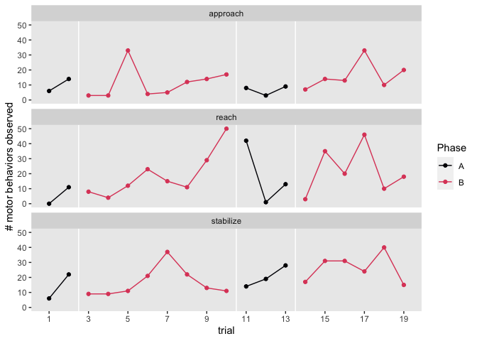

coker2009
================
A Solomon Kurz
2022-02-27

The purpose of this file is to simulate the data from Coker et al (2009;
<https://doi.org/10.3233/NRE-2009-0469>). We don’t have their actual
data file, they displayed their data in Figure 2 (pp. 204–205). Here
we’ll work through that figure to make a data file that approximates
their original data.

Load the **tidyverse**.

``` r
library(tidyverse)
```

First make the behavior-specific data frames.

``` r
# reached for an object with affected limb
reach <-
  tibble(trial = 1:19,
         phase = rep(c("A1", "B1", "A2", "B2"), times = c(2, 8, 3, 6)),
         total = c(0, 11, 8, 4, 12, 23, 15, 11, 29, 50, 42, 1, 13, 3, 35, 20, 46, 10, 18),
         behavior = "reach") 

# stabilized weight with affected limb
stabilize <-
  tibble(trial = 1:19,
         phase = rep(c("A1", "B1", "A2", "B2"), times = c(2, 8, 3, 6)),
         total = c(6, 22, 9, 9, 11, 21, 37, 22, 13, 11, 14, 19, 28, 17, 31, 31, 24, 40, 15),
         behavior = "stabilize") 

# approached mid-line with affected limb
approach <-
  tibble(trial = 1:19,
         phase = rep(c("A1", "B1", "A2", "B2"), times = c(2, 8, 3, 6)),
         total = c(6, 14, 3, 3, 33, 4, 5, 12, 14, 17, 8, 3, 9, 7, 14, 13, 33, 10, 20),
         behavior = "approach") 
```

Now combine them, wrangle, and save the new data frame as `coker2009`.

``` r
coker2009 <- bind_rows(
  reach, stabilize, approach
) %>% 
  mutate(phase = factor(phase, levels = c("A1", "B1", "A2", "B2")),
         trial0 = trial - 1) %>% 
  group_by(phase, behavior) %>% 
  mutate(ptrial = 1:n()) %>% 
  ungroup() %>% 
  mutate(ptrial0 = ptrial - 1) %>% 
  select(behavior, trial, trial0, ptrial, ptrial0, phase, total)
```

Take a look at the data.

``` r
glimpse(coker2009)
```

    ## Rows: 57
    ## Columns: 7
    ## $ behavior <chr> "reach", "reach", "reach", "reach", "reach", "reach", "reach"…
    ## $ trial    <int> 1, 2, 3, 4, 5, 6, 7, 8, 9, 10, 11, 12, 13, 14, 15, 16, 17, 18…
    ## $ trial0   <dbl> 0, 1, 2, 3, 4, 5, 6, 7, 8, 9, 10, 11, 12, 13, 14, 15, 16, 17,…
    ## $ ptrial   <int> 1, 2, 1, 2, 3, 4, 5, 6, 7, 8, 1, 2, 3, 1, 2, 3, 4, 5, 6, 1, 2…
    ## $ ptrial0  <dbl> 0, 1, 0, 1, 2, 3, 4, 5, 6, 7, 0, 1, 2, 0, 1, 2, 3, 4, 5, 0, 1…
    ## $ phase    <fct> A1, A1, B1, B1, B1, B1, B1, B1, B1, B1, A2, A2, A2, B2, B2, B…
    ## $ total    <dbl> 0, 11, 8, 4, 12, 23, 15, 11, 29, 50, 42, 1, 13, 3, 35, 20, 46…

``` r
coker2009 %>% 
  mutate(Phase = ifelse(str_detect(phase, "A"), "A", "B")) %>% 
  
  ggplot(aes(x = trial, y = total, group = phase, color = Phase)) +
  geom_vline(xintercept = c(2.5, 10.5, 13.5), color = "white") +
  geom_point() +
  geom_line() +
  scale_x_continuous(breaks = seq(from = 1, to = 19, by = 2)) +
  scale_color_viridis_d(option = "A", end = .6) +
  ylab("# motor behaviors observed") +
  theme(panel.grid = element_blank()) +
  facet_wrap(~ behavior, ncol = 1)
```

<!-- -->

Now save the results in an external file.

``` r
save(coker2009, file = "/Users/solomonkurz/Dropbox/Experimental-design-and-the-GLMM/sketches/data/coker2009.rda")
```

## Session information

``` r
sessionInfo()
```

    ## R version 4.1.2 (2021-11-01)
    ## Platform: x86_64-apple-darwin17.0 (64-bit)
    ## Running under: macOS Catalina 10.15.7
    ## 
    ## Matrix products: default
    ## BLAS:   /Library/Frameworks/R.framework/Versions/4.1/Resources/lib/libRblas.0.dylib
    ## LAPACK: /Library/Frameworks/R.framework/Versions/4.1/Resources/lib/libRlapack.dylib
    ## 
    ## locale:
    ## [1] en_US.UTF-8/en_US.UTF-8/en_US.UTF-8/C/en_US.UTF-8/en_US.UTF-8
    ## 
    ## attached base packages:
    ## [1] stats     graphics  grDevices utils     datasets  methods   base     
    ## 
    ## other attached packages:
    ## [1] forcats_0.5.1   stringr_1.4.0   dplyr_1.0.7     purrr_0.3.4    
    ## [5] readr_2.0.1     tidyr_1.2.0     tibble_3.1.6    ggplot2_3.3.5  
    ## [9] tidyverse_1.3.1
    ## 
    ## loaded via a namespace (and not attached):
    ##  [1] tidyselect_1.1.1  xfun_0.25         haven_2.4.3       colorspace_2.0-2 
    ##  [5] vctrs_0.3.8       generics_0.1.2    viridisLite_0.4.0 htmltools_0.5.2  
    ##  [9] yaml_2.2.1        utf8_1.2.2        rlang_1.0.1       pillar_1.7.0     
    ## [13] withr_2.4.3       glue_1.6.1        DBI_1.1.1         dbplyr_2.1.1     
    ## [17] modelr_0.1.8      readxl_1.3.1      lifecycle_1.0.1   munsell_0.5.0    
    ## [21] gtable_0.3.0      cellranger_1.1.0  rvest_1.0.1       evaluate_0.14    
    ## [25] labeling_0.4.2    knitr_1.33        tzdb_0.1.2        fastmap_1.1.0    
    ## [29] fansi_1.0.2       highr_0.9         broom_0.7.10      Rcpp_1.0.8       
    ## [33] backports_1.4.1   scales_1.1.1      jsonlite_1.7.3    farver_2.1.0     
    ## [37] fs_1.5.0          hms_1.1.0         digest_0.6.29     stringi_1.7.4    
    ## [41] grid_4.1.2        cli_3.1.1         tools_4.1.2       magrittr_2.0.2   
    ## [45] crayon_1.4.2      pkgconfig_2.0.3   ellipsis_0.3.2    xml2_1.3.2       
    ## [49] reprex_2.0.1      lubridate_1.7.10  assertthat_0.2.1  rmarkdown_2.10   
    ## [53] httr_1.4.2        rstudioapi_0.13   R6_2.5.1          compiler_4.1.2
