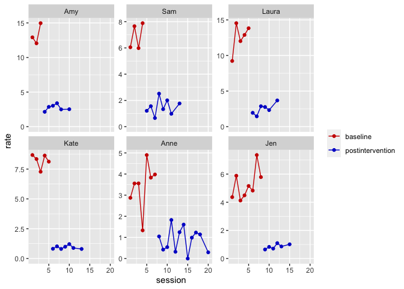

mancuso2016
================
A Solomon Kurz
2022-02-21

The purpose of this file is to simulate the data from Mancuso &
Miltenberger (2016; <https://doi.org/10.1002/jaba.267>). We don’t have
their actual data file, they displayed their data in Figure 1 (p. 191).
Here we’ll work through that figure to make a data file that
approximates their original data.

Load the **tidyverse**.

``` r
library(tidyverse)
```

First make the person-specific data frames.

``` r
# Amy
amy <- tibble(
  id      = "Amy",
  session = 1:20,
  post    = rep(0:1, times = c(3, 17))) %>% 
  mutate(condition = ifelse(post == 0, "baseline", "postintervention"),
         rate      = c(13, 12, 15, 2, 3, 3, 3.5, 2.5, NA, 2.5, NA, NA, NA, NA, NA, NA, NA, NA, NA, NA))

# Sam
sam <- tibble(
  id      = "Sam",
  session = 1:20,
  post    = rep(0:1, times = c(4, 16))) %>% 
  mutate(condition = ifelse(post == 0, "baseline", "postintervention"),
         rate      = c(6, 7.5, 6, 7.9, 1.2, 1.5, 0.75, 2.5, 1.33, 2, 0.9, NA, 1.8, NA, NA, NA, NA, NA, NA, NA))

# Laura
laura <- tibble(
  id      = "Laura",
  session = 1:20,
  post    = rep(0:1, times = c(5, 15))) %>% 
  mutate(condition = ifelse(post == 0, "baseline", "postintervention"),
         rate      = c(9.2, 14.5, 12, 13, 13.9, 2, 1.5, 2.8, 2.7, 2.3, NA, 3.75, NA, NA, NA, NA, NA, NA, NA, NA))

# Kate
kate <- tibble(
  id      = "Kate",
  session = 1:20,
  post    = rep(0:1, times = c(5, 15))) %>% 
  mutate(condition = ifelse(post == 0, "baseline", "postintervention"),
         rate      = c(8.8, 8.2, 7.3, 8.6, 8.2, 0.8, 1, 0.85, 0.88, 1.1, 
                    0.9, NA, 0.75, NA, NA, NA, NA, NA, NA, NA))

# Anne
anne <- tibble(
  id      = "Anne",
  session = 1:20,
  post    = rep(0:1, times = c(7, 13))) %>% 
  mutate(condition = ifelse(post == 0, "baseline", "postintervention"),
         rate      = c(2.9, 3.5, 3.65, 1.4, 4.8, 3.8, 3.9, 
                    1, 0.5, 0.6, 1.9, 0.2, 1.2, 1.7, 0.15, 1.1, 1.25, 1, NA, 0.2))

# Jen
jen <- tibble(
  id      = "Jen",
  session = 1:20,
  post    = rep(0:1, times = c(8, 12))) %>% 
  mutate(condition = ifelse(post == 0, "baseline", "postintervention"),
         rate      = c(4.3, 6, 4.25, 4.4, 5.2, 4.8, 7.3, 5.8, 0.7, 0.8, 
                    0.6, 1, 0.9, NA, 1, NA, NA, NA, NA, NA))
```

Now combine them, wrangle, and save the new data frame as `mancuso2016`.

``` r
names <- c("Amy", "Sam", "Laura", "Kate", "Anne", "Jen")

mancuso2016 <-
  bind_rows(amy, sam, laura, kate, anne, jen) %>% 
  mutate(id = factor(id, levels = names))  %>% 
  mutate(session01 = session - 1) %>% 
  select(id, session, session01, condition, post, rate) %>% 
  # add the minutes variable
  mutate(minutes = ifelse(post == 0, 
                          rbeta(n = n(), shape1 = 0.5, shape2 = 0.7),
                          rbeta(n = n(), shape1 = 0.7, shape2 = 0.5))) %>% 
  mutate(minutes = minutes * 2 + 3) %>% 
  mutate(minutes = ifelse(is.na(rate), NA, minutes)) %>% 
  # compute the counts
  mutate(count = round(rate * minutes, digits = 0))
```

Take a look at the data.

``` r
glimpse(mancuso2016)
```

    ## Rows: 120
    ## Columns: 8
    ## $ id        <fct> Amy, Amy, Amy, Amy, Amy, Amy, Amy, Amy, Amy, Amy, Amy, Amy, …
    ## $ session   <int> 1, 2, 3, 4, 5, 6, 7, 8, 9, 10, 11, 12, 13, 14, 15, 16, 17, 1…
    ## $ session01 <dbl> 0, 1, 2, 3, 4, 5, 6, 7, 8, 9, 10, 11, 12, 13, 14, 15, 16, 17…
    ## $ condition <chr> "baseline", "baseline", "baseline", "postintervention", "pos…
    ## $ post      <int> 0, 0, 0, 1, 1, 1, 1, 1, 1, 1, 1, 1, 1, 1, 1, 1, 1, 1, 1, 1, …
    ## $ rate      <dbl> 13.0, 12.0, 15.0, 2.0, 3.0, 3.0, 3.5, 2.5, NA, 2.5, NA, NA, …
    ## $ minutes   <dbl> 3.019887, 3.899758, 3.274424, 3.255476, 3.143865, 4.956539, …
    ## $ count     <dbl> 39, 47, 49, 7, 9, 15, 14, 9, NA, 8, NA, NA, NA, NA, NA, NA, …

Here’s a version of Figure 1.

``` r
mancuso2016 %>% 
  drop_na(count) %>% 
  
  ggplot(aes(x = session, y = count / minutes, color = condition)) +
  geom_point() +
  geom_line() +
  scale_color_manual(NULL, values = c("red3", "blue3")) +
  scale_y_continuous("rate", limits = c(0, NA)) +
  facet_wrap(~ id, scales = "free_y")
```

<!-- -->

We could also use the `geom_smooth()` method to get a sense of the
treands across students and conditions.

``` r
mancuso2016 %>% 
  drop_na(count) %>% 
  
  ggplot(aes(x = session, y = count / minutes , color = condition)) +
  geom_point() +
  geom_smooth(method = "lm", se = FALSE, formula = y ~ x, size = 1/2) +
  scale_color_manual(NULL, values = c("red3", "blue3")) +
  scale_y_continuous("rate", limits = c(0, NA)) +
  facet_wrap(~ id, scales = "free_y")
```

<!-- -->

Now save the results in an external file.

``` r
save(mancuso2016, file = "/Users/solomonkurz/Dropbox/Experimental-design-and-the-GLMM/sketches/data/mancuso2016.rda")
```

## Session information

``` r
sessionInfo()
```

    ## R version 4.1.2 (2021-11-01)
    ## Platform: x86_64-apple-darwin17.0 (64-bit)
    ## Running under: macOS Catalina 10.15.7
    ## 
    ## Matrix products: default
    ## BLAS:   /Library/Frameworks/R.framework/Versions/4.1/Resources/lib/libRblas.0.dylib
    ## LAPACK: /Library/Frameworks/R.framework/Versions/4.1/Resources/lib/libRlapack.dylib
    ## 
    ## locale:
    ## [1] en_US.UTF-8/en_US.UTF-8/en_US.UTF-8/C/en_US.UTF-8/en_US.UTF-8
    ## 
    ## attached base packages:
    ## [1] stats     graphics  grDevices utils     datasets  methods   base     
    ## 
    ## other attached packages:
    ## [1] forcats_0.5.1   stringr_1.4.0   dplyr_1.0.7     purrr_0.3.4    
    ## [5] readr_2.0.1     tidyr_1.2.0     tibble_3.1.6    ggplot2_3.3.5  
    ## [9] tidyverse_1.3.1
    ## 
    ## loaded via a namespace (and not attached):
    ##  [1] Rcpp_1.0.8       lubridate_1.7.10 lattice_0.20-45  assertthat_0.2.1
    ##  [5] digest_0.6.29    utf8_1.2.2       R6_2.5.1         cellranger_1.1.0
    ##  [9] backports_1.4.1  reprex_2.0.1     evaluate_0.14    httr_1.4.2      
    ## [13] highr_0.9        pillar_1.7.0     rlang_1.0.1      readxl_1.3.1    
    ## [17] rstudioapi_0.13  Matrix_1.3-4     rmarkdown_2.10   labeling_0.4.2  
    ## [21] splines_4.1.2    munsell_0.5.0    broom_0.7.10     compiler_4.1.2  
    ## [25] modelr_0.1.8     xfun_0.25        pkgconfig_2.0.3  mgcv_1.8-38     
    ## [29] htmltools_0.5.2  tidyselect_1.1.1 fansi_1.0.2      crayon_1.4.2    
    ## [33] tzdb_0.1.2       dbplyr_2.1.1     withr_2.4.3      grid_4.1.2      
    ## [37] nlme_3.1-153     jsonlite_1.7.3   gtable_0.3.0     lifecycle_1.0.1 
    ## [41] DBI_1.1.1        magrittr_2.0.2   scales_1.1.1     cli_3.1.1       
    ## [45] stringi_1.7.4    farver_2.1.0     fs_1.5.0         xml2_1.3.2      
    ## [49] ellipsis_0.3.2   generics_0.1.2   vctrs_0.3.8      tools_4.1.2     
    ## [53] glue_1.6.1       hms_1.1.0        fastmap_1.1.0    yaml_2.2.1      
    ## [57] colorspace_2.0-2 rvest_1.0.1      knitr_1.33       haven_2.4.3
