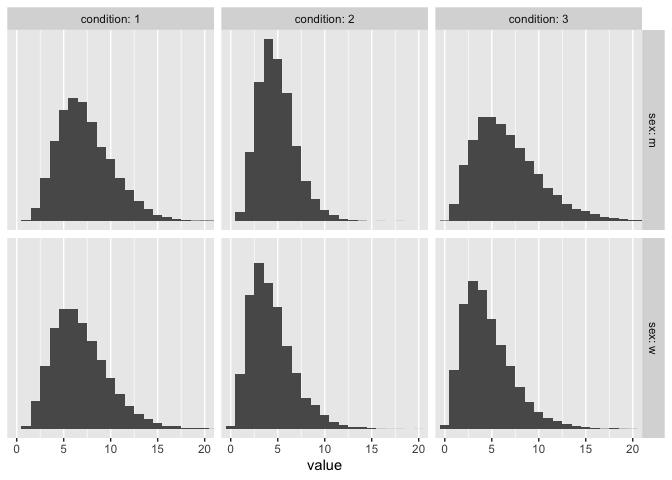
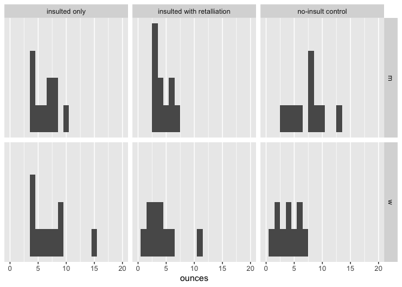

marlatt1975
================
A Solomon Kurz
2022-02-24

The purpose of this file is to simulate the data from Marlatt, Kosturn,
& Lang (1975; <https://doi.org/10.1037/0021-843X.84.6.652>). We don’t
have their actual data file, but they displayed the means and standard
deviations for their 6 groups in Figure 1 (p. 656). By design, there
were 10 participants in each group.

Load the **tidyverse**.

``` r
library(tidyverse)
```

## Set up

In Table 1 (p. 656), the authors listed the means and standard
deviations for the six groups on the primary outcome variable, the
ounces of wine consumed in the taste-rating task. Here are those values.

``` r
# save the values
m <- c(7.31, 4.86, 6.69, 6.90, 4.37, 4.66)
s <- c(2.93, 1.97, 3.56, 3.04, 2.38, 2.71)

# display them in a tibble
tibble(sex       = rep(c("m", "w"), each = 3),
       condition = rep(1:3, times = 2),
       mean      = m,
       sd        = s)
```

    ## # A tibble: 6 × 4
    ##   sex   condition  mean    sd
    ##   <chr>     <int> <dbl> <dbl>
    ## 1 m             1  7.31  2.93
    ## 2 m             2  4.86  1.97
    ## 3 m             3  6.69  3.56
    ## 4 w             1  6.9   3.04
    ## 5 w             2  4.37  2.38
    ## 6 w             3  4.66  2.71

The ammount of ounces one drinks is a continuous variable with a lower
limit of 0 (i.e., one cannot drink -2 ounces). Without further
information, the gamma distribution seems like a good candedate to
simulate such data. A difficulty is the `rgamma()` function is not
parameterized in terms of the mean and standard deviation.

``` r
rgamma
```

    ## function (n, shape, rate = 1, scale = 1/rate) 
    ## {
    ##     if (!missing(rate) && !missing(scale)) {
    ##         if (abs(rate * scale - 1) < 1e-15) 
    ##             warning("specify 'rate' or 'scale' but not both")
    ##         else stop("specify 'rate' or 'scale' but not both")
    ##     }
    ##     .Call(C_rgamma, n, shape, scale)
    ## }
    ## <bytecode: 0x7fbfa5f39168>
    ## <environment: namespace:stats>

Rather, one can define gamma draws by wither the combination of `shape`
and `rate` or of `shape` and `scale`. In his
[text](https://sites.google.com/site/doingbayesiandataanalysis/),
Kruschke provided a convenience function that takes means and standard
deviations as input and returns the `shape` and `rate` values for the
corresponding gamma distribution. Here we define that function.

``` r
gammaShRaFromMeanSD = function(mean, sd) {
  if (mean <= 0) stop("mean must be > 0")
  if (sd   <= 0) stop("sd must be > 0")
  shape <- mean^2 / sd^2
  rate  <- mean   / sd^2
  return(list(shape = shape, rate = rate))
}
```

Now use Kruschke’s `gammaShRaFromMeanSD()` function to compute the
`shape` and `rate` parameters from the vectors of means (`m`) and
standard deviations (`s`) from above.

``` r
# compute and save the parameter values for men
m1 <- gammaShRaFromMeanSD(mean = m[1], sd = s[1])
m2 <- gammaShRaFromMeanSD(mean = m[2], sd = s[2])
m3 <- gammaShRaFromMeanSD(mean = m[3], sd = s[3])

# compute and save the parameter values for women
w1 <- gammaShRaFromMeanSD(mean = m[4], sd = s[4])
w2 <- gammaShRaFromMeanSD(mean = m[5], sd = s[5])
w3 <- gammaShRaFromMeanSD(mean = m[6], sd = s[6])
```

Here’s a quick example of what we have saved.

``` r
m1
```

    ## $shape
    ## [1] 6.224429
    ## 
    ## $rate
    ## [1] 0.8514951

To get a sense of how this all works, here’s what the corresponding 6
gamma distributions would look like based on 10,000 simulation draws,
each.

``` r
# how many draws?
n <- 1e4

set.seed(1)

tibble(m.1 = rgamma(n = n, shape = m1$shape, rate = m1$rate),
       m.2 = rgamma(n = n, shape = m2$shape, rate = m2$rate),
       m.3 = rgamma(n = n, shape = m3$shape, rate = m3$rate),
       w.1 = rgamma(n = n, shape = w1$shape, rate = w1$rate),
       w.2 = rgamma(n = n, shape = w2$shape, rate = w2$rate),
       w.3 = rgamma(n = n, shape = w3$shape, rate = w3$rate)) %>% 
  pivot_longer(everything()) %>% 
  separate(name, into = c("sex", "condition")) %>% 
  
  # plot
  ggplot(aes(x = value)) +
  geom_histogram(binwidth = 1) +
  scale_y_continuous(NULL, breaks = NULL) +
  coord_cartesian(xlim = c(0, 20)) +
  facet_grid(sex ~ condition, labeller = label_both)
```

<!-- -->

Now simulate the actual data, which we’ll save as `marlatt1975`.

``` r
# how many per group?
n <- 10

# I arrived at this seed value by a little trial and error
set.seed(3)

marlatt1975 <- tibble(
  m.1 = rgamma(n = n, shape = m1$shape, rate = m1$rate),
  m.2 = rgamma(n = n, shape = m2$shape, rate = m2$rate),
  m.3 = rgamma(n = n, shape = m3$shape, rate = m3$rate),
  w.1 = rgamma(n = n, shape = w1$shape, rate = w1$rate),
  w.2 = rgamma(n = n, shape = w2$shape, rate = w2$rate),
  w.3 = rgamma(n = n, shape = w3$shape, rate = w3$rate)) %>% 
  pivot_longer(everything(), values_to = "ounces") %>% 
  separate(name, into = c("sex", "condition")) %>% 
  mutate(condition = factor(condition,
                            labels = c("insulted only",
                                       "insulted with retalliation",
                                       "no-insult control"))) %>% 
  # reduce the precision of the values
  mutate(ounces = round(ounces, digits = 2))

# what have we done?
glimpse(marlatt1975)
```

    ## Rows: 60
    ## Columns: 3
    ## $ sex       <chr> "m", "m", "m", "w", "w", "w", "m", "m", "m", "w", "w", "w", …
    ## $ condition <fct> insulted only, insulted with retalliation, no-insult control…
    ## $ ounces    <dbl> 4.29, 6.12, 3.42, 6.59, 5.05, 4.47, 5.53, 7.35, 9.57, 3.73, …

Here’s a plot of the `marlatt1975` data.

``` r
marlatt1975 %>% 
  ggplot(aes(x = ounces)) +
  geom_histogram(binwidth = 1) +
  scale_y_continuous(NULL, breaks = NULL) +
  coord_cartesian(xlim = c(0, 20)) +
  facet_grid(sex ~ condition)
```

<!-- -->

Here are the sample statistics.

``` r
marlatt1975 %>% 
  group_by(sex, condition) %>% 
  summarise(m = mean(ounces) %>% round(digits = 2),
            s = sd(ounces) %>% round(digits = 2),
            n = n())
```

    ## `summarise()` has grouped output by 'sex'. You can override using the `.groups`
    ## argument.

    ## # A tibble: 6 × 5
    ## # Groups:   sex [2]
    ##   sex   condition                      m     s     n
    ##   <chr> <fct>                      <dbl> <dbl> <int>
    ## 1 m     insulted only               6.24  1.99    10
    ## 2 m     insulted with retalliation  4.47  1.49    10
    ## 3 m     no-insult control           7.45  3.06    10
    ## 4 w     insulted only               7.1   3.39    10
    ## 5 w     insulted with retalliation  4.1   2.85    10
    ## 6 w     no-insult control           4     2.12    10

## Save

Now save the results in an externa `.rda` file.

``` r
save(marlatt1975, file = "/Users/solomonkurz/Dropbox/Experimental-design-and-the-GLMM/sketches/data/marlatt1975.rda")
```

## Session information

``` r
sessionInfo()
```

    ## R version 4.1.2 (2021-11-01)
    ## Platform: x86_64-apple-darwin17.0 (64-bit)
    ## Running under: macOS Catalina 10.15.7
    ## 
    ## Matrix products: default
    ## BLAS:   /Library/Frameworks/R.framework/Versions/4.1/Resources/lib/libRblas.0.dylib
    ## LAPACK: /Library/Frameworks/R.framework/Versions/4.1/Resources/lib/libRlapack.dylib
    ## 
    ## locale:
    ## [1] en_US.UTF-8/en_US.UTF-8/en_US.UTF-8/C/en_US.UTF-8/en_US.UTF-8
    ## 
    ## attached base packages:
    ## [1] stats     graphics  grDevices utils     datasets  methods   base     
    ## 
    ## other attached packages:
    ## [1] forcats_0.5.1   stringr_1.4.0   dplyr_1.0.7     purrr_0.3.4    
    ## [5] readr_2.0.1     tidyr_1.2.0     tibble_3.1.6    ggplot2_3.3.5  
    ## [9] tidyverse_1.3.1
    ## 
    ## loaded via a namespace (and not attached):
    ##  [1] tidyselect_1.1.1 xfun_0.25        haven_2.4.3      colorspace_2.0-2
    ##  [5] vctrs_0.3.8      generics_0.1.2   htmltools_0.5.2  yaml_2.2.1      
    ##  [9] utf8_1.2.2       rlang_1.0.1      pillar_1.7.0     withr_2.4.3     
    ## [13] glue_1.6.1       DBI_1.1.1        dbplyr_2.1.1     modelr_0.1.8    
    ## [17] readxl_1.3.1     lifecycle_1.0.1  munsell_0.5.0    gtable_0.3.0    
    ## [21] cellranger_1.1.0 rvest_1.0.1      evaluate_0.14    labeling_0.4.2  
    ## [25] knitr_1.33       tzdb_0.1.2       fastmap_1.1.0    fansi_1.0.2     
    ## [29] highr_0.9        broom_0.7.10     Rcpp_1.0.8       backports_1.4.1 
    ## [33] scales_1.1.1     jsonlite_1.7.3   farver_2.1.0     fs_1.5.0        
    ## [37] hms_1.1.0        digest_0.6.29    stringi_1.7.4    grid_4.1.2      
    ## [41] cli_3.1.1        tools_4.1.2      magrittr_2.0.2   crayon_1.4.2    
    ## [45] pkgconfig_2.0.3  ellipsis_0.3.2   xml2_1.3.2       reprex_2.0.1    
    ## [49] lubridate_1.7.10 assertthat_0.2.1 rmarkdown_2.10   httr_1.4.2      
    ## [53] rstudioapi_0.13  R6_2.5.1         compiler_4.1.2
