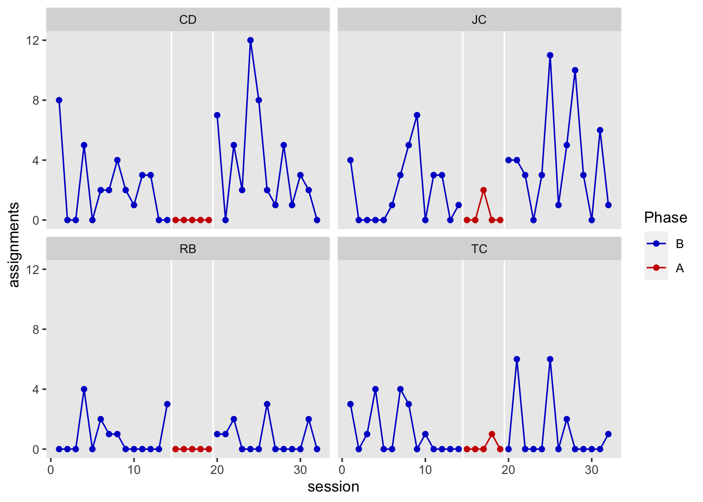
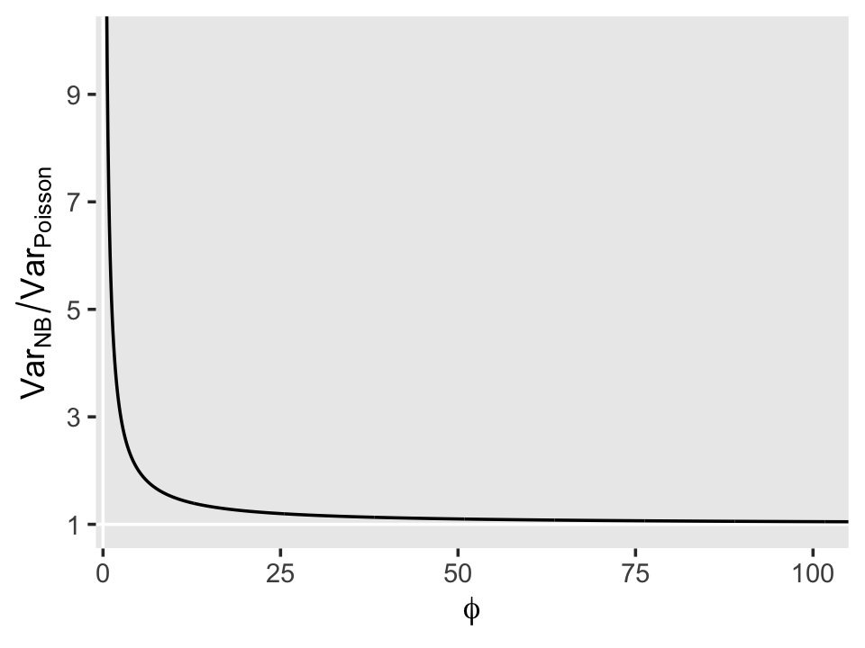
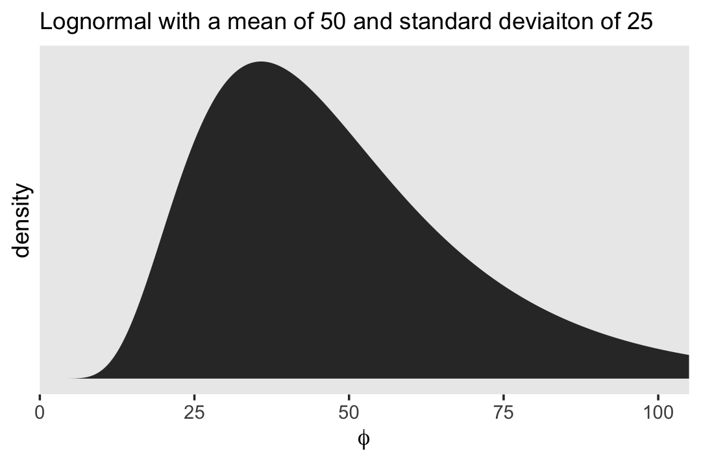
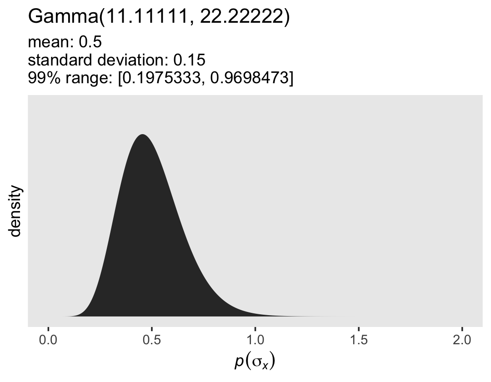
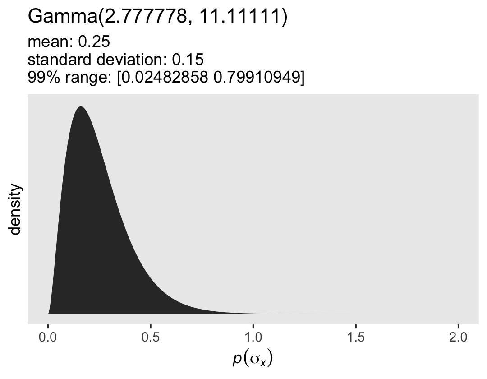
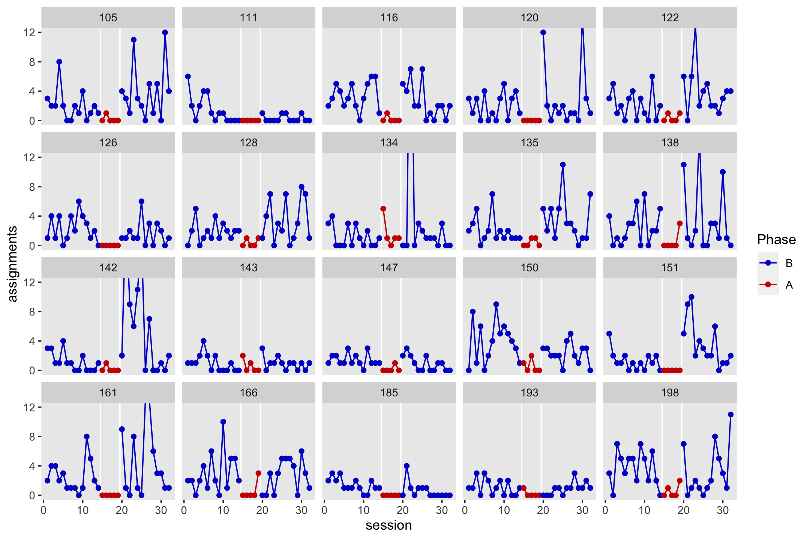
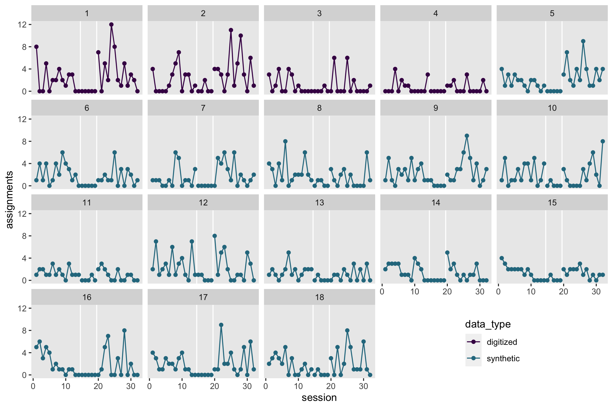
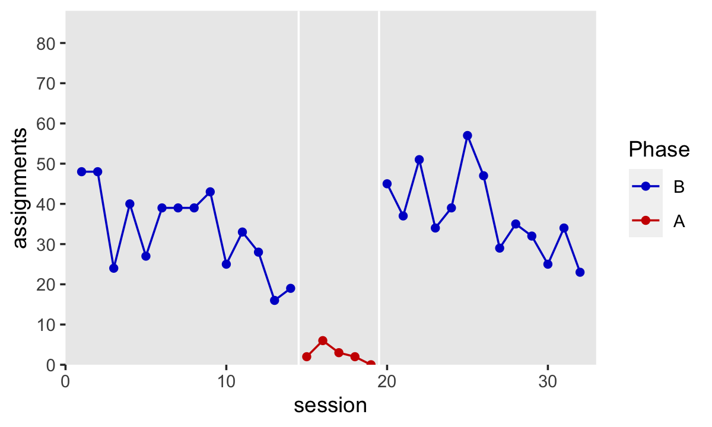

robinson1981
================
A Solomon Kurz
2022-08-05

The purpose of this file is to simulate the data from Robinson et al
(1981; <https://doi.org/10.1901/jaba.1981.14-307>). We don’t have their
actual data file, but they displayed the data from 4 of the 18 boys in
their Figure 2 (p. 312). I digitized those data one subplot at a time
with aid from the WebPlotDigitizer app
(<https://automeris.io/WebPlotDigitizer/>) and saved the cleaned results
in 4 `.csv` files in the `Robinson et al (1981)` subfolder. Here we load
the files.

``` r
library(tidyverse)
library(brms)

cd <- read_csv("Robinson et al (1981)/cd.csv", col_names = FALSE)
jc <- read_csv("Robinson et al (1981)/jc.csv", col_names = FALSE)
rb <- read_csv("Robinson et al (1981)/rb.csv", col_names = FALSE)
tc <- read_csv("Robinson et al (1981)/tc.csv", col_names = FALSE)

# what is this?
glimpse(cd)
```

    ## Rows: 32
    ## Columns: 2
    ## $ X1 <dbl> 0.9809733, 1.9748757, 3.1071337, 3.9904704, 5.0140947, 6.0464870, 7.0595600, 8.0326570, 9.0264107…
    ## $ X2 <dbl> 7.99856963, 0.07211291, 0.07634829, 5.01730840, 0.08348156, 2.03248053, 2.03627008, 4.01497244, 2…

``` r
glimpse(jc)
```

    ## Rows: 32
    ## Columns: 2
    ## $ X1 <dbl> 1.204475, 2.126029, 3.146643, 4.167257, 5.187871, 6.231749, 7.182571, 8.253465, 9.262822, 10.1716…
    ## $ X2 <dbl> 3.955685842, -0.005178115, -0.006134941, -0.007091766, -0.008048592, 0.920972773, 2.930081377, 4.…

``` r
glimpse(rb)
```

    ## Rows: 32
    ## Columns: 2
    ## $ X1 <dbl> 0.8904207, 1.9087797, 2.9874314, 3.8995427, 4.9645918, 5.7818524, 6.9921187, 8.0108453, 8.8600905…
    ## $ X2 <dbl> 0.06134969, 0.09202454, 0.09202454, 3.98773006, 0.12269939, 1.93251534, 0.95092025, 0.95092025, 0…

``` r
glimpse(tc)
```

    ## Rows: 32
    ## Columns: 2
    ## $ X1 <dbl> 1.053523, 2.089295, 3.067778, 4.158687, 5.000000, 6.173211, 7.178860, 8.213556, 9.026358, 10.1159…
    ## $ X2 <dbl> 3.00000000, 0.02884615, 1.00961538, 4.00961538, 0.08653846, 0.02884615, 3.98076923, 2.97115385, 0…

Now we merge the data files into a single data frame `d`, and add a few
columns.

``` r
# combine
d <- bind_rows(cd, jc, tc, rb) %>% 
  # rename
  set_names(c("session", "assignments")) %>% 
  # round the numerals to integers
  mutate_all(round, digits = 0) %>% 
  # add identifiers and experimental phases
  mutate(initials = rep(c("CD", "JC", "TC", "RB"), each = n() / 4),
         id       = rep(1:4, each = n() / 4),
         phase    = case_when(
           session < 15 ~ "B1",
           session < 20 ~ "A1",
           session >= 20 ~ "B2"
         ) %>% 
           factor(., levels = c("B1", "A1", "B2")))

# what have we done?
head(d)
```

    ## # A tibble: 6 × 5
    ##   session assignments initials    id phase
    ##     <dbl>       <dbl> <chr>    <int> <fct>
    ## 1       1           8 CD           1 B1   
    ## 2       2           0 CD           1 B1   
    ## 3       3           0 CD           1 B1   
    ## 4       4           5 CD           1 B1   
    ## 5       5           0 CD           1 B1   
    ## 6       6           2 CD           1 B1

Add new time variables.

``` r
d <- d %>% 
  mutate(session0 = session - 1) %>% 
  group_by(phase, id) %>% 
  mutate(psession = 1:n(),
         psession0 = 1:n() - 1) %>% 
  ungroup()

# what did we do?
d %>% 
  distinct(session, session0, psession, psession0)
```

    ## # A tibble: 32 × 4
    ##    session session0 psession psession0
    ##      <dbl>    <dbl>    <int>     <dbl>
    ##  1       1        0        1         0
    ##  2       2        1        2         1
    ##  3       3        2        3         2
    ##  4       4        3        4         3
    ##  5       5        4        5         4
    ##  6       6        5        6         5
    ##  7       7        6        7         6
    ##  8       8        7        8         7
    ##  9       9        8        9         8
    ## 10      10        9       10         9
    ## # … with 22 more rows
    ## # ℹ Use `print(n = ...)` to see more rows

Add two new `phase`-based dummies.

``` r
d <- d %>% 
  mutate(A1 = ifelse(phase == "A1", 1, 0),
         B2 = ifelse(phase == "B2", 1, 0))

# what did we do?
d %>% 
  distinct(phase, A1, B2)
```

    ## # A tibble: 3 × 3
    ##   phase    A1    B2
    ##   <fct> <dbl> <dbl>
    ## 1 B1        0     0
    ## 2 A1        1     0
    ## 3 B2        0     1

## EDA

We might compute some descriptive statistics to get a sense of the data.

``` r
d %>% 
  group_by(initials, phase) %>% 
  summarise(mean = mean(assignments),
            var = var(assignments),
            min = min(assignments),
            max = max(assignments),
            n = n()) %>% 
  mutate_if(is.double, round, digits = 1)
```

    ## # A tibble: 12 × 7
    ## # Groups:   initials [4]
    ##    initials phase  mean   var   min   max     n
    ##    <chr>    <fct> <dbl> <dbl> <dbl> <dbl> <int>
    ##  1 CD       B1      2.1   5.5     0     8    14
    ##  2 CD       A1      0     0       0     0     5
    ##  3 CD       B2      3.7  12.7     0    12    13
    ##  4 JC       B1      1.9   5.1     0     7    14
    ##  5 JC       A1      0.4   0.8     0     2     5
    ##  6 JC       B2      3.9  11.9     0    11    13
    ##  7 RB       B1      0.8   1.7     0     4    14
    ##  8 RB       A1      0     0       0     0     5
    ##  9 RB       B2      0.7   1.1     0     3    13
    ## 10 TC       B1      1.1   2.6     0     4    14
    ## 11 TC       A1      0.2   0.2     0     1     5
    ## 12 TC       B2      1.2   5       0     6    13

We can also just plot. Here’s a variant of Figure 2 in the original
paper (p. 312).

``` r
d %>% 
  ggplot(aes(x = session, y = assignments, group = phase, color = phase == "A1")) +
  geom_vline(xintercept = c(14.5, 19.5), color = "white") +
  geom_point() +
  geom_line() +
  scale_color_manual("Phase", values = c("blue3", "red3"), labels = c("B", "A")) +
  scale_y_continuous(breaks = 0:3 * 4) +
  theme(panel.grid = element_blank()) +
  facet_wrap(~ initials)
```



## Model

I’m going to use a model to simulate the data from the 14 boys who were
not depicted in Robinson and colleagues’ Figure 2. This model will be
based on the digitized data in `d`. The statistical model will be
similar to the one I’ll later propose in the content sketch (and may end
up in the book), but with very constrained priors. If we describe the
`assignments` counts as varying across

boys and

time points, we can use the multilevel distributional negative-binomial
model

![
\\begin{align\*}
\\text{assignments}\_{it} & \\sim \\operatorname{Negative Binomial}(\\mu\_{it}, \\phi\_{it}) \\\\
\\log(\\mu\_{it}) & = b\_{0i} + b\_{1i} \\text{psession0}\_{it} + b\_{2i} \\text{A1}\_{it} + b\_{3i} \\text{B2}\_{it} + b\_{4i} \\text{psession0}\_{it}\\text{A1}\_{it} + b\_{5i} \\text{psession0}\_{it}\\text{B2}\_{it} \\\\
\\log(\\phi\_{it}) & = h\_{0i} + h\_{1i} \\text{A1}\_{it} + h\_{2i} \\text{B2}\_{it} \\\\
b\_{0i} & = \\beta_0 + u\_{0i} \\\\
b\_{1i} & = \\beta_1 + u\_{1i} \\\\
b\_{2i} & = \\beta_2 + u\_{2i} \\\\
b\_{3i} & = \\beta_3 + u\_{3i} \\\\
b\_{4i} & = \\beta_4 + u\_{4i} \\\\
b\_{5i} & = \\beta_5 + u\_{5i} \\\\
h\_{0i} & = \\eta_0 + u\_{6i} \\\\
h\_{1i} & = \\eta_1 + u\_{7i} \\\\
h\_{2i} & = \\eta_2 + u\_{8i},
\\end{align\*}
](https://latex.codecogs.com/png.image?%5Cdpi%7B110%7D&space;%5Cbg_white&space;%0A%5Cbegin%7Balign%2A%7D%0A%5Ctext%7Bassignments%7D_%7Bit%7D%20%26%20%5Csim%20%5Coperatorname%7BNegative%20Binomial%7D%28%5Cmu_%7Bit%7D%2C%20%5Cphi_%7Bit%7D%29%20%5C%5C%0A%5Clog%28%5Cmu_%7Bit%7D%29%20%26%20%3D%20b_%7B0i%7D%20%2B%20b_%7B1i%7D%20%5Ctext%7Bpsession0%7D_%7Bit%7D%20%2B%20b_%7B2i%7D%20%5Ctext%7BA1%7D_%7Bit%7D%20%2B%20b_%7B3i%7D%20%5Ctext%7BB2%7D_%7Bit%7D%20%2B%20b_%7B4i%7D%20%5Ctext%7Bpsession0%7D_%7Bit%7D%5Ctext%7BA1%7D_%7Bit%7D%20%2B%20b_%7B5i%7D%20%5Ctext%7Bpsession0%7D_%7Bit%7D%5Ctext%7BB2%7D_%7Bit%7D%20%5C%5C%0A%5Clog%28%5Cphi_%7Bit%7D%29%20%26%20%3D%20h_%7B0i%7D%20%2B%20h_%7B1i%7D%20%5Ctext%7BA1%7D_%7Bit%7D%20%2B%20h_%7B2i%7D%20%5Ctext%7BB2%7D_%7Bit%7D%20%5C%5C%0Ab_%7B0i%7D%20%26%20%3D%20%5Cbeta_0%20%2B%20u_%7B0i%7D%20%5C%5C%0Ab_%7B1i%7D%20%26%20%3D%20%5Cbeta_1%20%2B%20u_%7B1i%7D%20%5C%5C%0Ab_%7B2i%7D%20%26%20%3D%20%5Cbeta_2%20%2B%20u_%7B2i%7D%20%5C%5C%0Ab_%7B3i%7D%20%26%20%3D%20%5Cbeta_3%20%2B%20u_%7B3i%7D%20%5C%5C%0Ab_%7B4i%7D%20%26%20%3D%20%5Cbeta_4%20%2B%20u_%7B4i%7D%20%5C%5C%0Ab_%7B5i%7D%20%26%20%3D%20%5Cbeta_5%20%2B%20u_%7B5i%7D%20%5C%5C%0Ah_%7B0i%7D%20%26%20%3D%20%5Ceta_0%20%2B%20u_%7B6i%7D%20%5C%5C%0Ah_%7B1i%7D%20%26%20%3D%20%5Ceta_1%20%2B%20u_%7B7i%7D%20%5C%5C%0Ah_%7B2i%7D%20%26%20%3D%20%5Ceta_2%20%2B%20u_%7B8i%7D%2C%0A%5Cend%7Balign%2A%7D%0A "
\begin{align*}
\text{assignments}_{it} & \sim \operatorname{Negative Binomial}(\mu_{it}, \phi_{it}) \\
\log(\mu_{it}) & = b_{0i} + b_{1i} \text{psession0}_{it} + b_{2i} \text{A1}_{it} + b_{3i} \text{B2}_{it} + b_{4i} \text{psession0}_{it}\text{A1}_{it} + b_{5i} \text{psession0}_{it}\text{B2}_{it} \\
\log(\phi_{it}) & = h_{0i} + h_{1i} \text{A1}_{it} + h_{2i} \text{B2}_{it} \\
b_{0i} & = \beta_0 + u_{0i} \\
b_{1i} & = \beta_1 + u_{1i} \\
b_{2i} & = \beta_2 + u_{2i} \\
b_{3i} & = \beta_3 + u_{3i} \\
b_{4i} & = \beta_4 + u_{4i} \\
b_{5i} & = \beta_5 + u_{5i} \\
h_{0i} & = \eta_0 + u_{6i} \\
h_{1i} & = \eta_1 + u_{7i} \\
h_{2i} & = \eta_2 + u_{8i},
\end{align*}
")

with an upper-level structure

![
\\begin{align\*}
\\begin{bmatrix} u\_{0i} \\\\ \\vdots \\\\ u\_{8i} \\end{bmatrix} & \\sim \\mathcal N(\\mathbf 0, \\mathbf{SRS}) \\\\
\\mathbf{S} & = \\begin{bmatrix} 
  \\sigma_0 \\\\ 
  0 & \\sigma_1 \\\\ 
  0 & 0 & \\sigma_2 \\\\ 
  0 & 0 & 0 & \\sigma_3 \\\\ 
  0 & 0 & 0 & 0 & \\sigma_4 \\\\ 
  0 & 0 & 0 & 0 & 0 & \\sigma_5 \\\\ 
  0 & 0 & 0 & 0 & 0 & 0 & \\sigma_6 \\\\ 
  0 & 0 & 0 & 0 & 0 & 0 & 0 & \\sigma_7 \\\\ 
  0 & 0 & 0 & 0 & 0 & 0 & 0 & 0 & \\sigma_8
  \\end{bmatrix},
\\end{align\*}
](https://latex.codecogs.com/png.image?%5Cdpi%7B110%7D&space;%5Cbg_white&space;%0A%5Cbegin%7Balign%2A%7D%0A%5Cbegin%7Bbmatrix%7D%20u_%7B0i%7D%20%5C%5C%20%5Cvdots%20%5C%5C%20u_%7B8i%7D%20%5Cend%7Bbmatrix%7D%20%26%20%5Csim%20%5Cmathcal%20N%28%5Cmathbf%200%2C%20%5Cmathbf%7BSRS%7D%29%20%5C%5C%0A%5Cmathbf%7BS%7D%20%26%20%3D%20%5Cbegin%7Bbmatrix%7D%20%0A%20%20%5Csigma_0%20%5C%5C%20%0A%20%200%20%26%20%5Csigma_1%20%5C%5C%20%0A%20%200%20%26%200%20%26%20%5Csigma_2%20%5C%5C%20%0A%20%200%20%26%200%20%26%200%20%26%20%5Csigma_3%20%5C%5C%20%0A%20%200%20%26%200%20%26%200%20%26%200%20%26%20%5Csigma_4%20%5C%5C%20%0A%20%200%20%26%200%20%26%200%20%26%200%20%26%200%20%26%20%5Csigma_5%20%5C%5C%20%0A%20%200%20%26%200%20%26%200%20%26%200%20%26%200%20%26%200%20%26%20%5Csigma_6%20%5C%5C%20%0A%20%200%20%26%200%20%26%200%20%26%200%20%26%200%20%26%200%20%26%200%20%26%20%5Csigma_7%20%5C%5C%20%0A%20%200%20%26%200%20%26%200%20%26%200%20%26%200%20%26%200%20%26%200%20%26%200%20%26%20%5Csigma_8%0A%20%20%5Cend%7Bbmatrix%7D%2C%0A%5Cend%7Balign%2A%7D%0A "
\begin{align*}
\begin{bmatrix} u_{0i} \\ \vdots \\ u_{8i} \end{bmatrix} & \sim \mathcal N(\mathbf 0, \mathbf{SRS}) \\
\mathbf{S} & = \begin{bmatrix} 
  \sigma_0 \\ 
  0 & \sigma_1 \\ 
  0 & 0 & \sigma_2 \\ 
  0 & 0 & 0 & \sigma_3 \\ 
  0 & 0 & 0 & 0 & \sigma_4 \\ 
  0 & 0 & 0 & 0 & 0 & \sigma_5 \\ 
  0 & 0 & 0 & 0 & 0 & 0 & \sigma_6 \\ 
  0 & 0 & 0 & 0 & 0 & 0 & 0 & \sigma_7 \\ 
  0 & 0 & 0 & 0 & 0 & 0 & 0 & 0 & \sigma_8
  \end{bmatrix},
\end{align*}
")

and priors

![
\\begin{align\*}
\\beta_0 & \\sim \\mathcal N(\\log(5), 0.5) \\\\
\\beta_1, \\beta_4, \\beta_5 & \\sim \\mathcal N(0, 0.01) \\\\
\\beta_2 & \\sim \\mathcal N(0, 1) \\\\
\\beta_3 & \\sim \\mathcal N(0, 0.25) \\\\
\\eta_0 & \\sim \\mathcal N(3.800451, 0.4723807) \\\\
\\eta_1, \\eta_2 & \\sim \\mathcal N(0, 0.5) \\\\
\\sigma_0, \\sigma_2, \\sigma_6, \\dots, \\sigma_8 & \\sim \\operatorname{Gamma}(11.11111, 22.22222) \\\\
\\sigma_1, \\sigma_3, \\dots, \\sigma_5 & \\sim \\operatorname{Gamma}(2.777778, 11.11111) \\\\
\\mathbf{R} & \\sim \\operatorname{LKJ}(1),
\\end{align\*}
](https://latex.codecogs.com/png.image?%5Cdpi%7B110%7D&space;%5Cbg_white&space;%0A%5Cbegin%7Balign%2A%7D%0A%5Cbeta_0%20%26%20%5Csim%20%5Cmathcal%20N%28%5Clog%285%29%2C%200.5%29%20%5C%5C%0A%5Cbeta_1%2C%20%5Cbeta_4%2C%20%5Cbeta_5%20%26%20%5Csim%20%5Cmathcal%20N%280%2C%200.01%29%20%5C%5C%0A%5Cbeta_2%20%26%20%5Csim%20%5Cmathcal%20N%280%2C%201%29%20%5C%5C%0A%5Cbeta_3%20%26%20%5Csim%20%5Cmathcal%20N%280%2C%200.25%29%20%5C%5C%0A%5Ceta_0%20%26%20%5Csim%20%5Cmathcal%20N%283.800451%2C%200.4723807%29%20%5C%5C%0A%5Ceta_1%2C%20%5Ceta_2%20%26%20%5Csim%20%5Cmathcal%20N%280%2C%200.5%29%20%5C%5C%0A%5Csigma_0%2C%20%5Csigma_2%2C%20%5Csigma_6%2C%20%5Cdots%2C%20%5Csigma_8%20%26%20%5Csim%20%5Coperatorname%7BGamma%7D%2811.11111%2C%2022.22222%29%20%5C%5C%0A%5Csigma_1%2C%20%5Csigma_3%2C%20%5Cdots%2C%20%5Csigma_5%20%26%20%5Csim%20%5Coperatorname%7BGamma%7D%282.777778%2C%2011.11111%29%20%5C%5C%0A%5Cmathbf%7BR%7D%20%26%20%5Csim%20%5Coperatorname%7BLKJ%7D%281%29%2C%0A%5Cend%7Balign%2A%7D%0A "
\begin{align*}
\beta_0 & \sim \mathcal N(\log(5), 0.5) \\
\beta_1, \beta_4, \beta_5 & \sim \mathcal N(0, 0.01) \\
\beta_2 & \sim \mathcal N(0, 1) \\
\beta_3 & \sim \mathcal N(0, 0.25) \\
\eta_0 & \sim \mathcal N(3.800451, 0.4723807) \\
\eta_1, \eta_2 & \sim \mathcal N(0, 0.5) \\
\sigma_0, \sigma_2, \sigma_6, \dots, \sigma_8 & \sim \operatorname{Gamma}(11.11111, 22.22222) \\
\sigma_1, \sigma_3, \dots, \sigma_5 & \sim \operatorname{Gamma}(2.777778, 11.11111) \\
\mathbf{R} & \sim \operatorname{LKJ}(1),
\end{align*}
")

where the model for
")
allows for intercepts (initial status) and slopes (change over time) to
vary across the boys and across the 3 experimental phases (B1, A1, and
B2). In this parameterization, the B1 phase is the reference category,
and the intercepts and slopes for the remaining 2 categories are
depicted as deviations via the `A1` and `B2` dummy variables. Linear
time is captured by the `psession0` variable, which starts at `0` at the
beginning of each experimental phase, and increases by one integer with
each subsequent session.

The model for
")
is a subset of the model for
"),
with the linear changes over time omitted. If there were more data
within boys and more boys in the data set, I’d consider fitting the full
model for
").
Given the smallness of the current data set, allowing the dispersion to
vary across boys and phases seems ambitious enough.

As to the priors, the
, 0.5)")
prior for

is meant to concentrate the intercepts for the first phase, BI, in the
middle single-digit integers. If you exponentiate, here are it’s median
and 95% range on the count space:

``` r
exp(log(5) + c(0, -1, 1))
```

    ## [1]  5.000000  1.839397 13.591409

The tighter prior
")
for
,

and

is designed to only allow for only minor linear trends within the
experimental phases. However, the
")
prior for

will allow for a rather large change in initial status for the A1 phase,
relative to the B1 baseline. The
")
prior for

will help make sure the difference between the two B phases isn’t as
large–they are both B phases, after all.

The
")
prior for

may seem oddly specific. First consider that as
,
the negative binomial distribution converges with the Poisson.

is constrained to values above zero, and as
,
the sample variance will increase, relative to the Poisson. The expected
variance for the Poisson distribution, recall, is the same as the mean.
The variance for the negative binomial model, however, follows the
formula

 = \mu + \frac{\mu^2}{\phi},
")

where

is the additional variance of the negative binomial compared to the
Poisson. As the [Stan team puts
it](https://mc-stan.org/docs/2_18/functions-reference/nbalt.html#probability-mass-function-10):
“So the inverse of parameter

controls the overdispersion, scaled by the square of the mean,
.”
Thus, the amount of extra variance in the negative binomial, relative to
the Poisson, is not independent of the mean. To get a sense of how this
works, here is what the ratio of the variance of negative binomial over
the variance of the Poison looks like for a mean of 5
")
and

values within the range of 0.1 to 100.

``` r
tibble(mu  = 5,
       phi = seq(from = 0.1, to = 110, by = 0.1)) %>% 
  mutate(v_p  = mu,
         v_nb = mu + (mu^2 / phi)) %>% 
  mutate(ratio = v_nb / v_p) %>% 
  
  ggplot(aes(x = phi, y = ratio)) +
  geom_hline(yintercept = 1, color = "white") +
  geom_vline(xintercept = 0, color = "white") +
  geom_line() +
  scale_x_continuous(expression(phi), limits = c(-1, 105), expand = c(0, 0)) +
  scale_y_continuous(expression(Var[NB]/Var[Poisson]), breaks = c(1, 3, 5, 7, 9)) +
  coord_cartesian(ylim = c(1, 10)) +
  theme(panel.grid = element_blank())
```



When
,
the negative-binomial variance is 10% larger than that of the Poisson.
When
,
the negative-binomial variance is twice the Poisson, and the ratio
rapidly increases as

decreases from there.

``` r
tibble(mu  = 5,
       phi = c(5, 50)) %>% 
  mutate(ratio = (mu + (mu^2 / phi)) / mu)
```

    ## # A tibble: 2 × 3
    ##      mu   phi ratio
    ##   <dbl> <dbl> <dbl>
    ## 1     5     5   2  
    ## 2     5    50   1.1

To put a prior on
,
we want a continuous distribution over the positive real numbers. When
you don’t attach a linear model to
,
the **brms** default is
"),
which is fine as far as defaults go, but it places a lot of prior mass
near zero. Another thing to consider is when you do attach a linear
model to
,
**brms** then switches to the log link, which is entirely sensible, but
requires we change how we think about the priors. The parameter space
for

ranges all the way from

to
,
which makes priors from the
Student-
family a more natural fit. So I propose you think about priors for

in terms of the lognormal distribution, which translates directly to the
normal distribution when you take the log. Here’s what the lognormal
distribution looks like with a mean of 50 and a standard deviation of
25.

``` r
# desired sample statistics
m <- 50
s <- 25

# convert those values into the lognormal parameters
mu    <- log(m / sqrt(s^2 / m^2 + 1))
sigma <- sqrt(log(s^2 / m^2 + 1))

# plot!
tibble(x = seq(from = 0.1, to = 105, by = 0.1)) %>% 
  mutate(d = dlnorm(x, meanlog = mu, sdlog = sigma)) %>% 
  ggplot(aes(x = x, y = d)) +
  geom_area() +
  scale_x_continuous(expression(phi), limits = c(0, 105), expand = c(0, 0)) +
  scale_y_continuous("density", breaks = NULL) +
  labs(subtitle = "Lognormal with a mean of 50 and standard deviaiton of 25") +
  theme(panel.grid = element_blank())
```



This lognormal prior puts a lot of mass near 50, which regularizes the
negative-binomial variance to be just a little greater than the Poisson
variance. It has a long, thick right tail, which easily allows for even
less dispersion. Though this prior does allow for small

values, it gives very little prior mass for values near the single-digit
range, which is right around where the negative-binomial variance
asymptotes, relative to the Poisson. If you were to log transform this
distribution, it would turn into
").

``` r
mu
```

    ## [1] 3.800451

``` r
sigma
```

    ## [1] 0.4723807

This is the origin of the priors for
.
The
")
prior for

and

is meant to allow for moderately large changes in

across the experimental phases.

The gamma priors for all the level-2

parameters are meant to encourage small- to moderately-sized boy-level
deviations from the population parameters.

 \\
\sigma_1, \sigma_3, \dots, \sigma_5 & \sim \operatorname{Gamma}(2.777778, 11.11111)
\end{align*}
")

The values from the hyperparameters were computed with the handy
`gamma_s_and_r_from_mean_sd()` function, which is based on [Kruschke’s
work](https://sites.google.com/site/doingbayesiandataanalysis/). With
`gamma_s_and_r_from_mean_sd()`, you can compute the gamma shape and rate
parameters for a given mean and standard deviation.

``` r
gamma_s_and_r_from_mean_sd <- function(mean, sd) {
  if (mean <= 0) stop("mean must be > 0")
  if (sd   <= 0) stop("sd must be > 0")
  shape <- mean^2 / sd^2
  rate  <- mean   / sd^2
  return(list(shape = shape, rate = rate))
}
```

The
")
prior has a mean of 0.5 and a standard deviation of 0.15, and the
")
prior has a mean of 0.52 and a standard deviation of 0.15. Here are what
they look like in a couple plots.

``` r
# Gamma(11.11111, 22.22222)
g <- gamma_s_and_r_from_mean_sd(mean = 0.5, sd = 0.15)

tibble(x = seq(from = 0.001, to = 2, by = 0.002)) %>% 
  mutate(d = dgamma(x, shape = g$shape, rate = g$rate)) %>% 
  ggplot(aes(x = x, y = d)) +
  geom_area() +
  scale_y_continuous("density", breaks = NULL, limits = c(0, 3.2)) +
  labs(title = "Gamma(11.11111, 22.22222)",
       subtitle = "mean: 0.5\nstandard deviation: 0.15\n99% range: [0.1975333, 0.9698473]",,
       x = expression(italic(p)(sigma[italic(x)]))) +
  theme(panel.grid = element_blank())
```



``` r
# Gamma(2.777778, 11.11111)
g <- gamma_s_and_r_from_mean_sd(mean = 0.25, sd = 0.15)

tibble(x = seq(from = 0.001, to = 2, by = 0.002)) %>% 
  mutate(d = dgamma(x, shape = g$shape, rate = g$rate)) %>% 
  ggplot(aes(x = x, y = d)) +
  geom_area() +
  scale_y_continuous("density", breaks = NULL, limits = c(0, 3.2)) +
  labs(title = "Gamma(2.777778, 11.11111)",
       subtitle = "mean: 0.25\nstandard deviation: 0.15\n99% range: [0.02482858 0.79910949]",
       x = expression(italic(p)(sigma[italic(x)]))) +
  theme(panel.grid = element_blank())
```



Finally, the
")
prior will regularize the various level-2 correlations

matrix toward zero.

Here’s how to fit the model with `brm()`.

``` r
# 1.378158 mins
fit <- brm(
  data = d,
  family = negbinomial,
  bf(assignments ~ 0 + Intercept + psession0 + phase + psession0:phase + (1 + psession0 + phase + psession0:phase |i| id),
     shape       ~ 0 + Intercept             + phase                   + (1             + phase                   |i| id)),
  prior = c(prior(normal(0, 0.25),     class = b),
            prior(normal(log(5), 0.5), class = b, coef = Intercept),
            prior(normal(0, 0.01),      class = b, coef = psession0),
            prior(normal(0, 0.01),      class = b, coef = "psession0:phaseA1"),
            prior(normal(0, 0.01),      class = b, coef = "psession0:phaseB2"),
            prior(normal(0, 1),        class = b, coef = phaseA1),
            prior(gamma(11.11111, 22.22222), class = sd),
            prior(gamma(2.777778, 11.11111), class = sd, coef = phaseB2,             group = id),
            prior(gamma(2.777778, 11.11111), class = sd, coef = psession0,           group = id),
            prior(gamma(2.777778, 11.11111), class = sd, coef = "psession0:phaseA1", group = id),
            prior(gamma(2.777778, 11.11111), class = sd, coef = "psession0:phaseB2", group = id),
            
            prior(normal(0, 0.5),              class = b,                   dpar = shape),
            prior(normal(3.800451, 0.4723807), class = b, coef = Intercept, dpar = shape),
            prior(gamma(11.11111, 22.22222), class = sd, dpar = shape),
            
            prior(lkj(1), class = cor)),
  cores = 4, 
  seed = 1,
  control = list(adapt_delta = .99)
)
```

Check the model summary.

``` r
summary(fit)
```

    ##  Family: negbinomial 
    ##   Links: mu = log; shape = log 
    ## Formula: assignments ~ 0 + Intercept + psession0 + phase + psession0:phase + (1 + psession0 + phase + psession0:phase | i | id) 
    ##          shape ~ 0 + Intercept + phase + (1 + phase | i | id)
    ##    Data: d (Number of observations: 128) 
    ##   Draws: 4 chains, each with iter = 2000; warmup = 1000; thin = 1;
    ##          total post-warmup draws = 4000
    ## 
    ## Group-Level Effects: 
    ## ~id (Number of levels: 4) 
    ##                                          Estimate Est.Error l-95% CI u-95% CI Rhat Bulk_ESS Tail_ESS
    ## sd(Intercept)                                0.52      0.14     0.28     0.83 1.00     4944     2850
    ## sd(psession0)                                0.12      0.07     0.03     0.28 1.00     2599     2866
    ## sd(phaseA1)                                  0.51      0.15     0.25     0.84 1.00     6299     2809
    ## sd(phaseB2)                                  0.24      0.14     0.05     0.58 1.00     4704     2571
    ## sd(psession0:phaseA1)                        0.22      0.13     0.04     0.56 1.00     4943     2293
    ## sd(psession0:phaseB2)                        0.09      0.06     0.02     0.25 1.00     3538     2757
    ## sd(shape_Intercept)                          0.81      0.23     0.40     1.30 1.00     3048     2641
    ## sd(shape_phaseA1)                            0.50      0.16     0.24     0.85 1.00     6036     2595
    ## sd(shape_phaseB2)                            0.52      0.16     0.26     0.88 1.00     5005     2807
    ## cor(Intercept,psession0)                     0.02      0.31    -0.57     0.61 1.00     2375     2432
    ## cor(Intercept,phaseA1)                       0.03      0.31    -0.58     0.63 1.00     5843     2952
    ## cor(psession0,phaseA1)                       0.07      0.32    -0.54     0.66 1.00     5354     3110
    ## cor(Intercept,phaseB2)                       0.02      0.31    -0.56     0.61 1.00     5779     2691
    ## cor(psession0,phaseB2)                      -0.00      0.32    -0.61     0.61 1.00     5771     3074
    ## cor(phaseA1,phaseB2)                        -0.01      0.32    -0.61     0.59 1.00     3891     3165
    ## cor(Intercept,psession0:phaseA1)             0.01      0.32    -0.60     0.62 1.00     6535     3277
    ## cor(psession0,psession0:phaseA1)             0.03      0.32    -0.58     0.63 1.00     5424     3146
    ## cor(phaseA1,psession0:phaseA1)               0.00      0.32    -0.62     0.62 1.00     4659     3238
    ## cor(phaseB2,psession0:phaseA1)              -0.01      0.32    -0.61     0.61 1.00     3894     3020
    ## cor(Intercept,psession0:phaseB2)             0.06      0.31    -0.54     0.64 1.00     4853     3318
    ## cor(psession0,psession0:phaseB2)             0.01      0.32    -0.60     0.61 1.00     4413     3143
    ## cor(phaseA1,psession0:phaseB2)               0.02      0.31    -0.59     0.62 1.00     3657     3307
    ## cor(phaseB2,psession0:phaseB2)              -0.01      0.31    -0.60     0.60 1.00     2783     2905
    ## cor(psession0:phaseA1,psession0:phaseB2)     0.00      0.32    -0.60     0.61 1.00     2950     3192
    ## cor(Intercept,shape_Intercept)               0.11      0.30    -0.49     0.65 1.00     2411     2682
    ## cor(psession0,shape_Intercept)               0.20      0.26    -0.33     0.66 1.00     4244     3096
    ## cor(phaseA1,shape_Intercept)                 0.09      0.31    -0.54     0.65 1.00     2714     3077
    ## cor(phaseB2,shape_Intercept)                -0.06      0.31    -0.63     0.54 1.00     3117     3066
    ## cor(psession0:phaseA1,shape_Intercept)       0.04      0.31    -0.56     0.62 1.00     3234     3127
    ## cor(psession0:phaseB2,shape_Intercept)      -0.00      0.29    -0.56     0.56 1.00     2858     3382
    ## cor(Intercept,shape_phaseA1)                 0.00      0.31    -0.58     0.61 1.00     6277     2880
    ## cor(psession0,shape_phaseA1)                 0.01      0.31    -0.59     0.60 1.00     6563     3134
    ## cor(phaseA1,shape_phaseA1)                   0.00      0.31    -0.59     0.60 1.00     4602     3042
    ## cor(phaseB2,shape_phaseA1)                  -0.00      0.33    -0.62     0.60 1.00     3808     2937
    ## cor(psession0:phaseA1,shape_phaseA1)        -0.01      0.32    -0.60     0.62 1.00     3344     3118
    ## cor(psession0:phaseB2,shape_phaseA1)        -0.01      0.32    -0.61     0.59 1.00     3022     3438
    ## cor(shape_Intercept,shape_phaseA1)           0.02      0.32    -0.57     0.61 1.00     3305     3369
    ## cor(Intercept,shape_phaseB2)                 0.05      0.32    -0.58     0.63 1.00     5539     2931
    ## cor(psession0,shape_phaseB2)                 0.10      0.31    -0.51     0.66 1.00     5814     2924
    ## cor(phaseA1,shape_phaseB2)                   0.03      0.32    -0.58     0.62 1.00     3307     2572
    ## cor(phaseB2,shape_phaseB2)                  -0.01      0.31    -0.60     0.58 1.00     3728     3204
    ## cor(psession0:phaseA1,shape_phaseB2)         0.01      0.31    -0.56     0.60 1.00     3155     3296
    ## cor(psession0:phaseB2,shape_phaseB2)         0.02      0.31    -0.56     0.60 1.00     3328     3517
    ## cor(shape_Intercept,shape_phaseB2)           0.12      0.30    -0.48     0.66 1.00     3667     3470
    ## cor(shape_phaseA1,shape_phaseB2)            -0.00      0.31    -0.60     0.60 1.00     2640     3248
    ## 
    ## Population-Level Effects: 
    ##                   Estimate Est.Error l-95% CI u-95% CI Rhat Bulk_ESS Tail_ESS
    ## Intercept             0.99      0.33     0.37     1.65 1.00     1748     2544
    ## psession0            -0.00      0.01    -0.02     0.02 1.00     5993     3102
    ## phaseA1              -1.95      0.57    -3.07    -0.86 1.00     3048     3275
    ## phaseB2               0.17      0.20    -0.22     0.56 1.00     4404     3295
    ## psession0:phaseA1    -0.00      0.01    -0.02     0.02 1.00     7770     2651
    ## psession0:phaseB2     0.00      0.01    -0.02     0.02 1.00     7674     2760
    ## shape_Intercept       2.29      0.46     1.42     3.22 1.00     4245     3390
    ## shape_phaseA1        -0.09      0.51    -1.08     0.91 1.00     6472     2954
    ## shape_phaseB2        -0.56      0.46    -1.48     0.33 1.00     4673     2990
    ## 
    ## Draws were sampled using sampling(NUTS). For each parameter, Bulk_ESS
    ## and Tail_ESS are effective sample size measures, and Rhat is the potential
    ## scale reduction factor on split chains (at convergence, Rhat = 1).

Everything looks on the up-and-up.

## Simulate

The next step is to simulate full timeseries of 100 synthetic boys with
the `brms::predict()` function.

``` r
nd <- d %>% 
  distinct(session, psession0, phase, A1, B2) %>% 
  expand(nesting(session, psession0, phase, A1, B2),
         id = 101:200)

set.seed(1)

p <- predict(
  fit,
  newdata = nd,
  allow_new_levels = TRUE,
  ndraws = 1,
  summary = FALSE) %>% 
  t() %>% 
  data.frame() %>% 
  set_names("assignments") %>% 
  bind_cols(nd) 
```

Here’s what a subset of the new synthetic data set looks like.

``` r
p %>% 
  filter(id %in% sample(101:200, size = 20)) %>% 
  
  ggplot(aes(x = session, y = assignments, group = phase, color = phase == "A1")) +
  geom_vline(xintercept = c(14.5, 19.5), color = "white") +
  geom_point() +
  geom_line() +
  scale_color_manual("Phase", values = c("blue3", "red3"), labels = c("B", "A")) +
  scale_y_continuous(breaks = 0:3 * 4) +
  coord_cartesian(ylim = c(0, 12)) +
  facet_wrap(~ id) +
  theme(panel.grid = element_blank())
```



On the whole, it looks pretty good. However, in their caption for Figure
2, Robinson and colleagues clarified the boys whose data were depicted
in the top row (CD and JC) completed the most assignments in the class.
Further, the boys whose data were depicted in the bottom row (TC and RB)
completed to fewest assignments in the class. To get a sense, here are
the average number of assignments those four boys completed during their
B phases.

``` r
d %>% 
  filter(phase != "A1") %>% 
  group_by(initials, id) %>% 
  summarise(m = mean(assignments))
```

    ## `summarise()` has grouped output by 'initials'. You can override using the `.groups` argument.

    ## # A tibble: 4 × 3
    ## # Groups:   initials [4]
    ##   initials    id     m
    ##   <chr>    <int> <dbl>
    ## 1 CD           1 2.89 
    ## 2 JC           2 2.89 
    ## 3 RB           4 0.741
    ## 4 TC           3 1.15

Thus, we want to select data from synthetic boys whose average number of
assignments range between 1.1481481 and 2.8888889. Further, you’ll note
that the largest number of assignments completed on a given day was 12.
When I read through the article, it wasn’t clear to me if there was a
maximum number of assignments students could complete in a given day.
But in the absence of that information, I prefer to select data from
synthetic boys who has maximum values at 12 or below. Here’s how to pull
a vector of the `id` numbers of the synthetic boys whose data meet those
constraints.

``` r
id_list <- p %>% 
  filter(phase != "A1") %>% 
  group_by(id) %>% 
  summarise(mean = mean(assignments),
            max = max(assignments)) %>% 
  filter(mean > 1.1481481 & mean < 2.8888889) %>% 
  filter(max < 13) %>% 
  pull(id)

# what is this?
str(id_list)
```

    ##  int [1:40] 103 106 107 115 119 123 124 126 127 128 ...

It turns out 40 of the 100 synthetic boys met those constraints. Now
we’ll use the `filter()` and the `sample()` functions to take a random
subset of 14 of those 40 synthetic boys. We’ll then assign them new `id`
numbers, starting with `5` and ending with `18`.

``` r
set.seed(2)

p <- p %>% 
  filter(id %in% sample(id_list, size = 14)) %>% 
  arrange(id, session) %>% 
  mutate(id = rep(5:18, each = 32))
```

Next, we’ll want to follow the conventions in Robinson et al and assign
initials to our synthetic boys. As a first step, we’ll save a vector of
the initials of the four real boys displayed in Figure 2.

``` r
robinson1981_initials <- d %>% 
  distinct(initials) %>% 
  pull()

robinson1981_initials
```

    ## [1] "CD" "JC" "TC" "RB"

Now we will use the `randomNames()` function from the [**randomNames**
package](https://CRAN.R-project.org/package=randomNames) to simulate a
large set of random names, convert the names to initials, and then
select a random subset of 14 distinct initials which are not duplicates
of the initials of the four boys from Figure 2.

``` r
set.seed(3)

simulated_initials <- 
  tibble(name = randomNames::randomNames(100, name.order = "first.last", name.sep = "_")) %>% 
  separate(name, into = c("first", "last"), sep = "_") %>% 
  mutate(initials = str_c(str_sub(first, 1, 1), str_sub(last, 1, 1))) %>% 
  mutate(initials = toupper(initials)) %>% 
  distinct(initials) %>% 
  filter(initials != robinson1981_initials[1]) %>% 
  filter(initials != robinson1981_initials[2]) %>% 
  filter(initials != robinson1981_initials[3]) %>% 
  filter(initials != robinson1981_initials[4]) %>% 
  slice_sample(n = 14) %>% 
  mutate(id = 5:18)

# what do we have?
simulated_initials
```

    ## # A tibble: 14 × 2
    ##    initials    id
    ##    <chr>    <int>
    ##  1 JD           5
    ##  2 IZ           6
    ##  3 SR           7
    ##  4 LC           8
    ##  5 DS           9
    ##  6 SA          10
    ##  7 TM          11
    ##  8 SM          12
    ##  9 SH          13
    ## 10 OL          14
    ## 11 LR          15
    ## 12 NA          16
    ## 13 AB          17
    ## 14 KT          18

Tack the initials onto the simulated data sets.

``` r
p <- p %>% 
  left_join(simulated_initials, by = "id")

# what?
head(p)
```

    ##   assignments session psession0 phase A1 B2 id initials
    ## 1           4       1         0    B1  0  0  5       JD
    ## 2           1       2         1    B1  0  0  5       JD
    ## 3           3       3         2    B1  0  0  5       JD
    ## 4           1       4         3    B1  0  0  5       JD
    ## 5           3       5         4    B1  0  0  5       JD
    ## 6           2       6         5    B1  0  0  5       JD

Now we can finally add the simulated data sets to the data of the four
boys from Figure 2.

``` r
robinson1981 <- d %>% 
  select(assignments, session, psession0, phase, A1, B2, id, initials) %>% 
  bind_rows(p) %>% 
  select(id, initials, session, phase, assignments) %>% 
  mutate(data_type = ifelse(id < 5, "digitized", "synthetic"))

# what is this?
glimpse(robinson1981)
```

    ## Rows: 576
    ## Columns: 6
    ## $ id          <int> 1, 1, 1, 1, 1, 1, 1, 1, 1, 1, 1, 1, 1, 1, 1, 1, 1, 1, 1, 1, 1, 1, 1, 1, 1, 1, 1, 1, 1, 1…
    ## $ initials    <chr> "CD", "CD", "CD", "CD", "CD", "CD", "CD", "CD", "CD", "CD", "CD", "CD", "CD", "CD", "CD"…
    ## $ session     <dbl> 1, 2, 3, 4, 5, 6, 7, 8, 9, 10, 11, 12, 13, 14, 15, 16, 17, 18, 19, 20, 21, 22, 23, 24, 2…
    ## $ phase       <fct> B1, B1, B1, B1, B1, B1, B1, B1, B1, B1, B1, B1, B1, B1, A1, A1, A1, A1, A1, B2, B2, B2, …
    ## $ assignments <dbl> 8, 0, 0, 5, 0, 2, 2, 4, 2, 1, 3, 3, 0, 0, 0, 0, 0, 0, 0, 7, 0, 5, 2, 12, 8, 2, 1, 5, 1, …
    ## $ data_type   <chr> "digitized", "digitized", "digitized", "digitized", "digitized", "digitized", "digitized…

Here’s a look at the full data set.

``` r
robinson1981 %>% 
  ggplot(aes(x = session, y = assignments, group = phase, color = data_type)) +
  geom_vline(xintercept = c(14.5, 19.5), color = "white") +
  geom_point() +
  geom_line() +
  scale_color_viridis_d(option = "D", end = .4) +
  scale_y_continuous(breaks = 0:3 * 4) +
  coord_cartesian(ylim = c(0, 12)) +
  facet_wrap(~ id) +
  theme(legend.position = c(.8, .1),
        panel.grid = element_blank())
```



To my mind, the synthetic data did a pretty okay job mimicking the
characteristics of the original digitized data.

Here’s a plot of the aggregated sums, similar to how Robinson and
colleagues displayed in their Figure 1 (p. 311).

``` r
robinson1981 %>% 
  group_by(session, phase) %>% 
  summarise(assignments = sum(assignments)) %>%
  
  ggplot(aes(x = session, y = assignments, group = phase, color = phase == "A1")) +
  geom_vline(xintercept = c(14.5, 19.5), color = "white") +
  geom_point() +
  geom_line() +
  scale_color_manual("Phase", values = c("blue3", "red3"), labels = c("B", "A")) +
  scale_x_continuous(limits = c(0, 33), expand = c(0, 0)) +
  scale_y_continuous(breaks = 0:8 * 10, limits = c(0, 88), expand = c(0, 0)) +
  theme(panel.grid = element_blank())
```



The session sums in the `robinson1981` data don’t have the same extreme
spread as those Robdinson et al depicted in their Figure 1, but the
gross patterns are there, even including what they described as a
“‘sawtooth’ effect” (p. 311).

Now save the results in an external file.

``` r
save(robinson1981, file = "/Users/solomonkurz/Dropbox/Experimental-design-and-the-GLMM/sketches/data/robinson1981.rda")
```

## Session information

``` r
sessionInfo()
```

    ## R version 4.2.0 (2022-04-22)
    ## Platform: x86_64-apple-darwin17.0 (64-bit)
    ## Running under: macOS Big Sur/Monterey 10.16
    ## 
    ## Matrix products: default
    ## BLAS:   /Library/Frameworks/R.framework/Versions/4.2/Resources/lib/libRblas.0.dylib
    ## LAPACK: /Library/Frameworks/R.framework/Versions/4.2/Resources/lib/libRlapack.dylib
    ## 
    ## locale:
    ## [1] en_US.UTF-8/en_US.UTF-8/en_US.UTF-8/C/en_US.UTF-8/en_US.UTF-8
    ## 
    ## attached base packages:
    ## [1] stats     graphics  grDevices utils     datasets  methods   base     
    ## 
    ## other attached packages:
    ##  [1] brms_2.17.3          Rcpp_1.0.9           forcats_0.5.1        stringr_1.4.0        dplyr_1.0.9         
    ##  [6] purrr_0.3.4          readr_2.1.2          tidyr_1.2.0          tibble_3.1.7         ggplot2_3.3.6       
    ## [11] tidyverse_1.3.1.9000
    ## 
    ## loaded via a namespace (and not attached):
    ##   [1] readxl_1.4.0         backports_1.4.1      plyr_1.8.7           igraph_1.3.1         splines_4.2.0       
    ##   [6] crosstalk_1.2.0      TH.data_1.1-1        rstantools_2.2.0     inline_0.3.19        digest_0.6.29       
    ##  [11] htmltools_0.5.2      fansi_1.0.3          magrittr_2.0.3       checkmate_2.1.0      googlesheets4_1.0.0 
    ##  [16] tzdb_0.3.0           toOrdinal_1.3-0.0    modelr_0.1.8         dtplyr_1.2.1         RcppParallel_5.1.5  
    ##  [21] matrixStats_0.62.0   vroom_1.5.7          xts_0.12.1           sandwich_3.0-1       prettyunits_1.1.1   
    ##  [26] colorspace_2.0-3     rvest_1.0.2          haven_2.5.0          xfun_0.31            callr_3.7.0         
    ##  [31] crayon_1.5.1         jsonlite_1.8.0       survival_3.3-1       zoo_1.8-10           glue_1.6.2          
    ##  [36] gtable_0.3.0         gargle_1.2.0         emmeans_1.7.3        V8_4.1.0             distributional_0.3.0
    ##  [41] pkgbuild_1.3.1       rstan_2.26.11        randomNames_1.5-0.0  abind_1.4-5          scales_1.2.0        
    ##  [46] mvtnorm_1.1-3        DBI_1.1.2            miniUI_0.1.1.1       viridisLite_0.4.0    xtable_1.8-4        
    ##  [51] bit_4.0.4            stats4_4.2.0         StanHeaders_2.26.11  DT_0.22              htmlwidgets_1.5.4   
    ##  [56] httr_1.4.3           threejs_0.3.3        posterior_1.2.1      ellipsis_0.3.2       pkgconfig_2.0.3     
    ##  [61] loo_2.5.1            farver_2.1.1         dbplyr_2.1.1.9000    utf8_1.2.2           tidyselect_1.1.2    
    ##  [66] labeling_0.4.2       rlang_1.0.4          reshape2_1.4.4       later_1.3.0          munsell_0.5.0       
    ##  [71] cellranger_1.1.0     tools_4.2.0          cli_3.3.0            generics_0.1.2       broom_0.8.0         
    ##  [76] ggridges_0.5.3       evaluate_0.15        fastmap_1.1.0        yaml_2.3.5           processx_3.5.3      
    ##  [81] knitr_1.39           bit64_4.0.5          fs_1.5.2             nlme_3.1-157         mime_0.12           
    ##  [86] xml2_1.3.3           brio_1.1.3           compiler_4.2.0       bayesplot_1.9.0      shinythemes_1.2.0   
    ##  [91] rstudioapi_0.13      curl_4.3.2           testthat_3.1.4       reprex_2.0.1         stringi_1.7.6       
    ##  [96] highr_0.9            ps_1.7.0             Brobdingnag_1.2-8    lattice_0.20-45      Matrix_1.4-1        
    ## [101] markdown_1.1         shinyjs_2.1.0        tensorA_0.36.2       vctrs_0.4.1          pillar_1.8.0        
    ## [106] lifecycle_1.0.1      bridgesampling_1.1-2 estimability_1.3     data.table_1.14.2    httpuv_1.6.5        
    ## [111] R6_2.5.1             promises_1.2.0.1     gridExtra_2.3        codetools_0.2-18     colourpicker_1.1.1  
    ## [116] MASS_7.3-56          gtools_3.9.2         assertthat_0.2.1     withr_2.5.0          shinystan_2.6.0     
    ## [121] multcomp_1.4-19      parallel_4.2.0       hms_1.1.1            grid_4.2.0           coda_0.19-4         
    ## [126] rmarkdown_2.14       googledrive_2.0.0    shiny_1.7.2          lubridate_1.8.0      base64enc_0.1-3     
    ## [131] dygraphs_1.1.1.6
