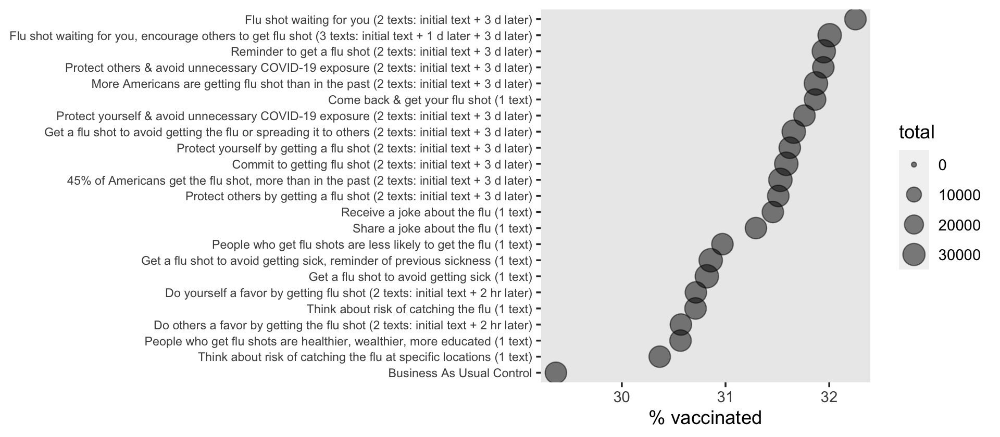
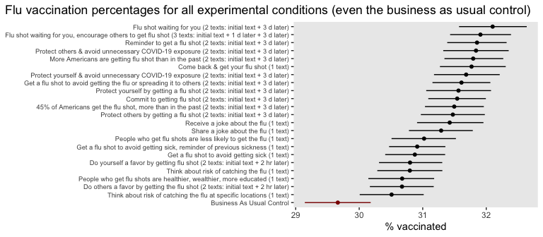

Post-test only designs with a large number of conditions: Milkman et al
(2022)
================
A Solomon Kurz
2022-02-22

Using a post-test only design, Milkman et al (2022) randomly assigned
689, 693 Walmart pharmacy patients into one of 23 conditions.
Participants in 22 of the conditions received one of the 22 text-message
reminders designed to encourage Walmart flu vaccination. Participants in
the business-as-usual control condition received no such messages. The
primary outcome was the proportion of persons in each condition who
received the flu vaccine at Walmart by December 31st, 2020.

Milkman et al (2022) kindly made a subset of their data public on the
OSF at
<https://osf.io/rn8tw/?view_only=546ed2d8473f4978b95948a52712a3c5>. The
purpose of this file is to show how to analyze their main results,
similar to how they were presented in Figure 1 (p. 3).

Load the data and the primary **R** packages.

``` r
# packages
library(tidyverse)
library(brms)

# load the data
d <- readxl::read_excel("data/aggregate_data.xlsx") %>% 
  set_names(c("condition", "total", "dec", "oct")) %>% 
  mutate(nudge = factor(22:0))
```

Here’s a look at the data.

``` r
glimpse(d)
```

    ## Rows: 23
    ## Columns: 5
    ## $ condition <chr> "Flu shot waiting for you (2 texts: initial text + 3 d later…
    ## $ total     <dbl> 27669, 34483, 34034, 27715, 34614, 27690, 27603, 27790, 3459…
    ## $ dec       <dbl> 8924, 11036, 10873, 8853, 11032, 8823, 8767, 8787, 10953, 10…
    ## $ oct       <dbl> 7400, 9125, 8943, 7350, 9085, 7164, 7268, 7268, 9031, 8979, …
    ## $ nudge     <fct> 22, 21, 20, 19, 18, 17, 16, 15, 14, 13, 12, 11, 10, 9, 8, 7,…

The number of persons in each condition who were vaccinated at Walmart
by December 31st, 2020, is listed in the `dec` column. The total number
of persons in each condition is in the `total` column. The experimental
conditions are listed in the `condition` column. The `nudge` column
contains the same information as `condition`, but arranged as an index
variable.

If we divide `dec` by `total`, we get the proportion vaccinated in each
condition. Here’s a quick descriptive plot of those values.

``` r
d %>% 
  mutate(p = dec / total) %>% 
  
  ggplot(aes(x = p, y = reorder(condition, p))) +
  geom_point(aes(size = total),
             alpha = 1/2) +
  scale_size_continuous(limits = c(0, NA)) +
  scale_x_continuous("% vaccinated", breaks = 29:32 / 100, labels = 29:32) +
  ylab(NULL) +
  theme(axis.text.y = element_text(size = 7),
        panel.grid = element_blank())
```



For our statistical inference, we can model these data with a multilevel
binomial model

$$
\\begin{align\*}
\\text{dec}\_i & \\sim \\operatorname{Binomial}(n_i, p_i) \\\\
\\operatorname{logit}(p_i) & = \\beta_0 + \\zeta\_{0i} \\\\
\\zeta\_{0i} & \\sim \\operatorname{Normal}(0, \\sigma) \\\\
\\beta_0 & \\sim \\operatorname{Normal}(0, 1) \\\\
\\sigma & \\sim \\operatorname{Exopnential}(1),
\\end{align\*}
$$

where *p*<sub>*i*</sub> is the vaccine probability in each of the *i*
`nudge` conditions and and *n*<sub>*i*</sub> is the `total` number of
persons within each level of `nudge`. Here’s the model in **brms**.

``` r
fit1 <- brm(
  data = d,
  family = binomial,
  dec | trials(total) ~ 1 + (1 | nudge),
  prior = c(prior(normal(0, 1), class = Intercept),
            prior(exponential(1), class = sd)),
  cores = 4,
  seed = 1,
  file = "fits/fit1.milkman2022"
)
```

Check the model.

``` r
print(fit1)
```

    ##  Family: binomial 
    ##   Links: mu = logit 
    ## Formula: dec | trials(total) ~ 1 + (1 | nudge) 
    ##    Data: d (Number of observations: 23) 
    ##   Draws: 4 chains, each with iter = 2000; warmup = 1000; thin = 1;
    ##          total post-warmup draws = 4000
    ## 
    ## Group-Level Effects: 
    ## ~nudge (Number of levels: 23) 
    ##               Estimate Est.Error l-95% CI u-95% CI Rhat Bulk_ESS Tail_ESS
    ## sd(Intercept)     0.03      0.01     0.02     0.04 1.00     1275     1497
    ## 
    ## Population-Level Effects: 
    ##           Estimate Est.Error l-95% CI u-95% CI Rhat Bulk_ESS Tail_ESS
    ## Intercept    -0.79      0.01    -0.80    -0.77 1.00     1162     1520
    ## 
    ## Draws were sampled using sampling(NUTS). For each parameter, Bulk_ESS
    ## and Tail_ESS are effective sample size measures, and Rhat is the potential
    ## scale reduction factor on split chains (at convergence, Rhat = 1).

It will be easiest to understand the results through a plot. Here’s a
version of Figure 1, as presented in the original paper.

``` r
nd <- d %>% 
  select(nudge, condition, total)

fitted(fit1,
       newdata = nd,
       scale = "linear",
       summary = F) %>% 
  data.frame() %>% 
  set_names(d %>% pull(nudge)) %>% 
  mutate_all(inv_logit_scaled) %>% 
  pivot_longer(`22`:`1`) %>% 
  mutate(contrast = value - `0`) %>% 
  group_by(name) %>% 
  tidybayes::mean_qi(contrast) %>% 
  arrange(desc(as.double(name))) %>% 
  bind_cols(nd %>% filter(nudge != "0")) %>% 
  mutate(group = factor(condition, ordered = TRUE)) %>% 
  
  ggplot(aes(x = contrast)) +
  geom_pointrange(aes(xmin = .lower, xmax = .upper, y = reorder(group, contrast)),
                  fatten = 1.5) +
  geom_vline(xintercept = 0, linetype = 2, size = 1/4) +
  geom_text(data = . %>% 
              filter(name == "13") %>% 
              mutate(contrast = 0.001, 
                     label = "business as usual control: 29.7 95% CI [29.1, 30.2]"),
            aes(y = group, label = label),
            angle = 90, size = 2.5) +
  scale_x_continuous("% point increase in vaccination", breaks = 0:3 / 100, labels = 0:3) +
  labs(title = "Contrasts of all experimental conditions minus the business as usual control condition",
       y = NULL) +
  coord_cartesian(xlim = c(0.00, 0.035)) +
  theme(axis.text.y = element_text(size = 7),
        panel.grid = element_blank(),
        plot.title.position = "plot")
```



Here’s a variant of that plot, which more clearly expressed the
posterior for the control condition.

``` r
fitted(fit1,
       newdata = nd,
       scale = "linear") %>%
  data.frame() %>% 
  mutate_all(inv_logit_scaled) %>% 
  bind_cols(nd) %>% 
  arrange(nudge) %>% 
  mutate(group = factor(condition, ordered = TRUE)) %>% 
  
  ggplot(aes(x = Estimate, xmin = Q2.5, xmax = Q97.5, y = reorder(group, Estimate))) +
  geom_pointrange(aes(color = condition == "Business As Usual Control"),
                  fatten = 1.5) +
  scale_color_manual(values = c("black", "red4"), breaks = NULL) +
  scale_x_continuous("% vaccinated", breaks = 29:32 / 100, labels = 29:32) +
  labs(title = "Flu vaccination percentages for all experimental conditions (even the business as usual control)",
       y = NULL) +
  theme(axis.text.y = element_text(size = 7),
        panel.grid = element_blank(),
        plot.title.position = "plot")
```


## Session information

``` r
sessionInfo()
```

    ## R version 4.1.2 (2021-11-01)
    ## Platform: x86_64-apple-darwin17.0 (64-bit)
    ## Running under: macOS Catalina 10.15.7
    ## 
    ## Matrix products: default
    ## BLAS:   /Library/Frameworks/R.framework/Versions/4.1/Resources/lib/libRblas.0.dylib
    ## LAPACK: /Library/Frameworks/R.framework/Versions/4.1/Resources/lib/libRlapack.dylib
    ## 
    ## locale:
    ## [1] en_US.UTF-8/en_US.UTF-8/en_US.UTF-8/C/en_US.UTF-8/en_US.UTF-8
    ## 
    ## attached base packages:
    ## [1] stats     graphics  grDevices utils     datasets  methods   base     
    ## 
    ## other attached packages:
    ##  [1] brms_2.16.3     Rcpp_1.0.8      forcats_0.5.1   stringr_1.4.0  
    ##  [5] dplyr_1.0.7     purrr_0.3.4     readr_2.0.1     tidyr_1.2.0    
    ##  [9] tibble_3.1.6    ggplot2_3.3.5   tidyverse_1.3.1
    ## 
    ## loaded via a namespace (and not attached):
    ##   [1] readxl_1.3.1         backports_1.4.1      plyr_1.8.6          
    ##   [4] igraph_1.2.6         svUnit_1.0.6         splines_4.1.2       
    ##   [7] crosstalk_1.1.1      TH.data_1.0-10       rstantools_2.1.1    
    ##  [10] inline_0.3.19        digest_0.6.29        htmltools_0.5.2     
    ##  [13] rsconnect_0.8.24     fansi_1.0.2          magrittr_2.0.2      
    ##  [16] checkmate_2.0.0      tzdb_0.1.2           modelr_0.1.8        
    ##  [19] RcppParallel_5.1.4   matrixStats_0.61.0   xts_0.12.1          
    ##  [22] sandwich_3.0-1       prettyunits_1.1.1    colorspace_2.0-2    
    ##  [25] rvest_1.0.1          ggdist_3.0.1         haven_2.4.3         
    ##  [28] xfun_0.25            callr_3.7.0          crayon_1.4.2        
    ##  [31] jsonlite_1.7.3       lme4_1.1-27.1        survival_3.2-13     
    ##  [34] zoo_1.8-9            glue_1.6.1           gtable_0.3.0        
    ##  [37] emmeans_1.7.1-1      distributional_0.2.2 pkgbuild_1.2.0      
    ##  [40] rstan_2.21.3         abind_1.4-5          scales_1.1.1        
    ##  [43] mvtnorm_1.1-2        DBI_1.1.1            miniUI_0.1.1.1      
    ##  [46] xtable_1.8-4         diffobj_0.3.4        stats4_4.1.2        
    ##  [49] StanHeaders_2.21.0-7 DT_0.19              htmlwidgets_1.5.3   
    ##  [52] httr_1.4.2           threejs_0.3.3        arrayhelpers_1.1-0  
    ##  [55] posterior_1.1.0.9000 ellipsis_0.3.2       tidybayes_3.0.2     
    ##  [58] pkgconfig_2.0.3      loo_2.4.1            farver_2.1.0        
    ##  [61] dbplyr_2.1.1         utf8_1.2.2           tidyselect_1.1.1    
    ##  [64] labeling_0.4.2       rlang_1.0.1          reshape2_1.4.4      
    ##  [67] later_1.3.0          munsell_0.5.0        cellranger_1.1.0    
    ##  [70] tools_4.1.2          cli_3.1.1            generics_0.1.2      
    ##  [73] broom_0.7.10         ggridges_0.5.3       evaluate_0.14       
    ##  [76] fastmap_1.1.0        yaml_2.2.1           processx_3.5.2      
    ##  [79] knitr_1.33           fs_1.5.0             nlme_3.1-153        
    ##  [82] mime_0.11            projpred_2.0.2       xml2_1.3.2          
    ##  [85] compiler_4.1.2       bayesplot_1.8.1      shinythemes_1.2.0   
    ##  [88] rstudioapi_0.13      gamm4_0.2-6          reprex_2.0.1        
    ##  [91] stringi_1.7.4        highr_0.9            ps_1.6.0            
    ##  [94] Brobdingnag_1.2-6    lattice_0.20-45      Matrix_1.3-4        
    ##  [97] nloptr_1.2.2.2       markdown_1.1         shinyjs_2.0.0       
    ## [100] tensorA_0.36.2       vctrs_0.3.8          pillar_1.7.0        
    ## [103] lifecycle_1.0.1      bridgesampling_1.1-2 estimability_1.3    
    ## [106] httpuv_1.6.2         R6_2.5.1             promises_1.2.0.1    
    ## [109] gridExtra_2.3        codetools_0.2-18     boot_1.3-28         
    ## [112] colourpicker_1.1.0   MASS_7.3-54          gtools_3.9.2        
    ## [115] assertthat_0.2.1     withr_2.4.3          shinystan_2.5.0     
    ## [118] multcomp_1.4-17      mgcv_1.8-38          parallel_4.1.2      
    ## [121] hms_1.1.0            grid_4.1.2           coda_0.19-4         
    ## [124] minqa_1.2.4          rmarkdown_2.10       shiny_1.6.0         
    ## [127] lubridate_1.7.10     base64enc_0.1-3      dygraphs_1.1.1.6
